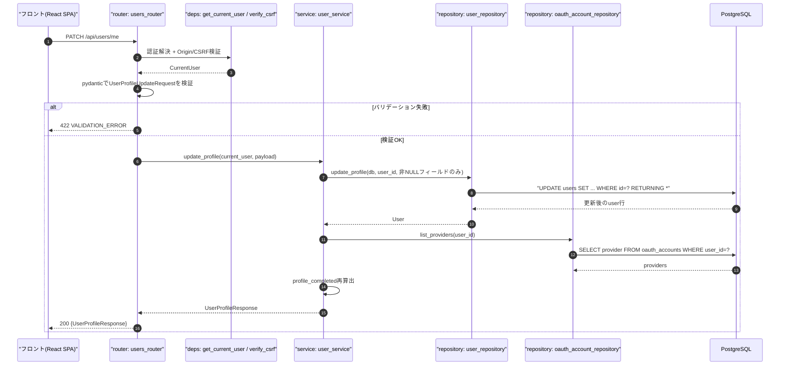
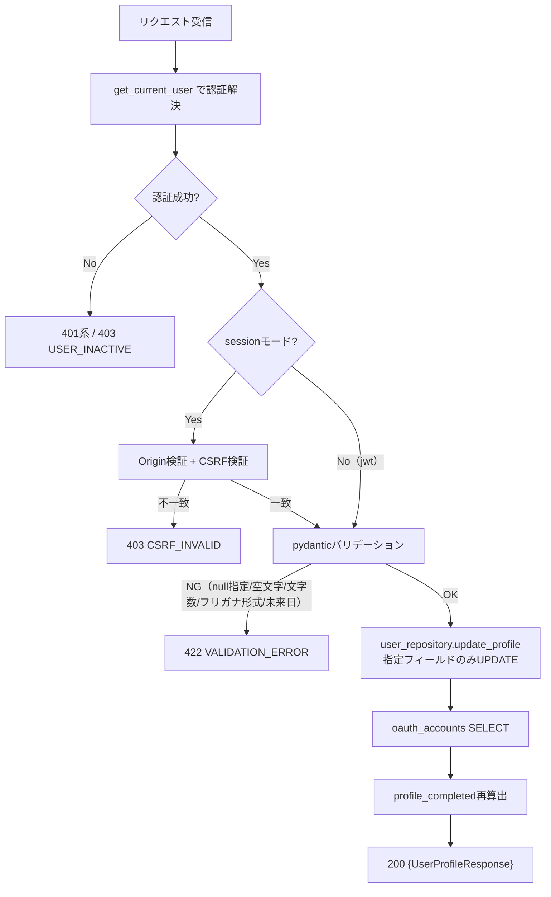
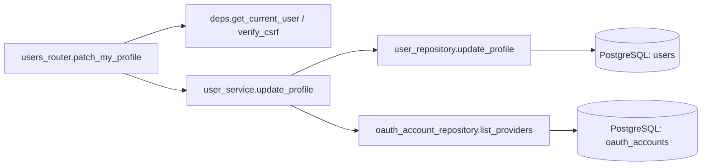
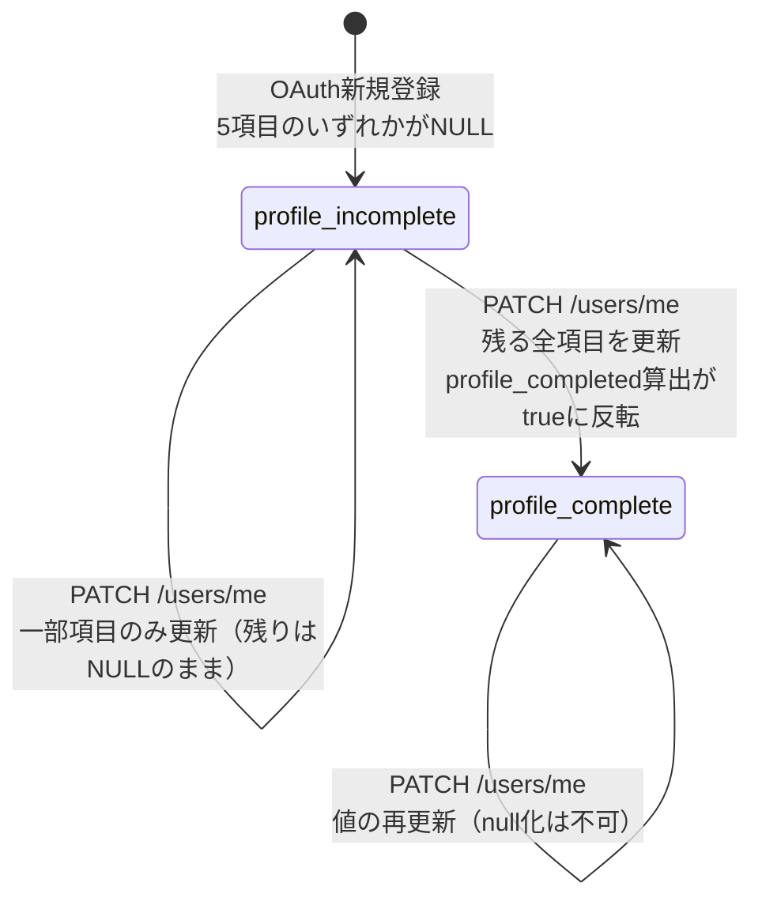

# PATCH /api/users/me（プロフィール部分更新）

## 0. 関連ドキュメント

| ドキュメント | パス |
|--------------|------|
| API基本設計 | `../../../basic_design/04_api.md`（§2.2 ユーザーAPI一覧、§3.2 `PATCH /users/me`） |
| 認証基本設計 | `../../../basic_design/03_auth.md`（§5.3・§5.4 OAuth新規ユーザーとprofile_completed） |
| DB基本設計 | `../../../basic_design/01_database.md`（§3.1 users） |
| DB詳細設計 | `../../database/01_table_users.md`（§8.4 `update_profile`） |
| 自分のプロフィール取得API | `./01_get_users_me.md` |
| パスワード変更API | `./03_put_users_me_password.md` |

## 1. 概要

| 項目 | 内容 |
|------|------|
| エンドポイント | `PATCH /api/users/me` |
| 目的 | 氏名・フリガナ・生年月日の部分更新。OAuth新規ユーザーの未補完プロフィール（`profile_completed=false`）を埋める導線としても使う |
| 認証 | 必要（session：`cerberus_sid` Cookie／jwt：`Authorization: Bearer`） |
| 認可 | 認証済みであれば誰でも（自分自身のみ更新可。他ユーザーのプロフィールは更新不可） |
| CSRF検証 | 必要（sessionモードの更新系。`X-CSRF-Token`） |
| Origin検証 | 必要（Cookieを利用する更新系リクエストのため`03_auth.md`§8の共通方針に従う） |
| AUTH_MODE差異 | 認証経路（Cookie/Bearer）のみ異なる。CSRF検証はsessionモードのみ、jwtモードはAuthorizationヘッダのため不要（`03_auth.md`§4.4） |
| 冪等性 | あり（同一ボディでの複数回実行は同じ結果になる。部分更新のPATCHだが本APIは値の`null`化を許可しないため副作用が蓄積しない） |
| レート制限 | 対象外 |
| トランザクション境界 | `users` UPDATE 1件（単一UPDATE文のため明示的なトランザクション制御は不要。`01_table_users.md`§11に準拠） |

## 2. 入出力仕様

### 2.1 リクエスト

パスパラメータ：なし　クエリパラメータ：なし

ヘッダ

| 名前 | 必須 | 説明 |
|------|------|------|
| `Authorization: Bearer {access_token}` | jwtモードのみ必須 | |
| `X-CSRF-Token` | sessionモードのみ必須 | `03_auth.md`§3.1のDouble Submit Cookie方式 |

Cookie

| 名前 | 必須 | 説明 |
|------|------|------|
| `cerberus_sid` | sessionモードのみ必須 | |
| `cerberus_csrf` | sessionモードのみ必須 | `X-CSRF-Token`との一致検証に使用 |

ボディ（`UserProfileUpdateRequest`、全項目任意の部分更新）

| フィールド | 型 | 必須 | 制約 | 説明 |
|-----------|----|------|------|------|
| last_name | string | 任意 | 1〜30文字 | 指定時は`null`不可 |
| first_name | string | 任意 | 1〜30文字 | 指定時は`null`不可 |
| last_name_kana | string | 任意 | 1〜30文字、ひらがな・カタカナ・数字のみ | 指定時は`null`不可 |
| first_name_kana | string | 任意 | 1〜30文字、ひらがな・カタカナ・数字のみ | 指定時は`null`不可 |
| birth_date | string(date) | 任意 | `YYYY-MM-DD`、未来日不可 | 指定時は`null`不可 |

未指定のフィールドは現在値を維持する。**指定した場合の値を`null`にすることは許可しない**（`03_auth.md`§5.4・§7.4相当の「値の`null`への変更は許可しない」方針。DB上は未補完状態のため理論上NULL列だが、このAPIでNULLへ戻す操作は提供しない）。空文字列 (`""`) も`null`と同様に許可しない値として扱い、`VALIDATION_ERROR`とする。

### 2.2 レスポンス

**200 OK**（`UserProfileResponse`。`01_get_users_me.md`§2.2と同一スキーマ）

```json
{
  "id": "3f1c...",
  "username": "taro",
  "email": "taro@example.com",
  "last_name": "山田",
  "first_name": "太郎",
  "last_name_kana": "ヤマダ",
  "first_name_kana": "タロウ",
  "birth_date": "1995-04-01",
  "profile_completed": true,
  "role": "member",
  "has_password": true,
  "oauth_providers": ["google"]
}
```

| フィールド | 型 | NULL可否 | 説明 |
|-----------|----|----------|------|
| id / username / email | 各種 | 不可 | |
| last_name / first_name / last_name_kana / first_name_kana / birth_date | 各種 | 可（未補完項目が残っている場合） | 更新後の現在値 |
| profile_completed | boolean | 不可 | 更新後に再算出した値。5項目全て非NULLで`true` |
| role | string | 不可 | PostgreSQLの現在値 |
| has_password | boolean | 不可 | |
| oauth_providers | string[] | 不可（空配列可） | |

Set-Cookieは発行しない。共通ヘッダ：`X-Request-ID`。`Cache-Control: no-store`を付与する。

## 3. エラー仕様

| HTTP | code | 発生条件 | メッセージ | 備考 |
|------|------|----------|------------|------|
| 401 | `UNAUTHENTICATED` | Cookie/Bearerヘッダなし | ログインが必要です | |
| 401 | `SESSION_EXPIRED` | sessionモードでRedisに`session:{sid}`が存在しない | セッションの有効期限が切れました | |
| 401 | `TOKEN_EXPIRED` | jwtモードでaccess tokenの`exp`超過 | トークンの有効期限が切れました | |
| 401 | `TOKEN_INVALID` | jwtモードで署名不正・`typ != 'access'` | トークンが不正です | |
| 403 | `USER_INACTIVE` | `users.is_active = false` | このアカウントは無効化されています | |
| 403 | `CSRF_INVALID` | sessionモードで`X-CSRF-Token`不一致・欠落 | CSRFトークンが不正です | |
| 422 | `VALIDATION_ERROR` | 文字数超過・フリガナ形式不正・生年月日形式不正・未来日・空文字列・`null`指定 | 入力内容に誤りがあります | `details`にフィールド単位のメッセージ |
| 503 | `SERVICE_UNAVAILABLE` | Redis（session時）/ PostgreSQL接続不能 | 現在サービスをご利用いただけません | fail-close |
| 500 | `INTERNAL_ERROR` | 未捕捉例外 | サーバーエラーが発生しました | |

## 4. 処理シーケンス



## 5. 処理フロー・分岐



## 6. 関数詳細

### 6.1 `api/routers/users_router.py :: patch_my_profile`

| 項目 | 内容 |
|------|------|
| シグネチャ | `async def patch_my_profile(payload: UserProfileUpdateRequest, current_user: CurrentUser = Depends(get_current_user), db: AsyncSession = Depends(get_db), _: None = Depends(verify_csrf)) -> UserProfileResponse` |
| 引数 | `payload`（pydanticで検証済み）、`current_user`、`db`、`verify_csrf`（sessionモードのみ検証を実行するDI） |
| 戻り値 | `UserProfileResponse`（200） |
| 送出例外 | `get_current_user`から伝播する401/403系、`verify_csrf`から伝播する403 `CSRF_INVALID`、pydanticの`RequestValidationError`（422） |
| 処理内容 | 1. `user_service.update_profile(current_user, payload, db)` を呼び出し結果をそのまま返す |
| 副作用 | なし（サービス層に委譲） |

### 6.2 `schemas/user.py :: UserProfileUpdateRequest`

| 項目 | 内容 |
|------|------|
| シグネチャ | `class UserProfileUpdateRequest(BaseModel)` |
| フィールド | `last_name: str \| None = None`、`first_name: str \| None = None`、`last_name_kana: str \| None = None`、`first_name_kana: str \| None = None`、`birth_date: date \| None = None`（各項目は`Field(min_length=1, max_length=30)`等でバリデータ付与） |
| 戻り値 | - |
| 送出例外 | `pydantic.ValidationError`（未来日・フリガナ形式違反時は`field_validator`で送出） |
| 処理内容 | 1. 各文字列項目は1〜30文字 2. カナ項目は`^[ぁ-んァ-ヶー0-9]+$`相当の正規表現で検証（`01_table_users.md`のDB CHECK制約と同じパターンをアプリ層でも二重防御） 3. `birth_date`は`date.today()`以下であることを検証 4. モデル自体は`None`（未指定）を許可するが、明示的な`null`または空文字列が来た場合にエラーとする判定はservice層の`update_profile`で行う（pydanticの`None`と「JSONで`null`を明示送信」を区別するため、フィールドごとの送信有無は`model_fields_set`で判定する） |
| 副作用 | なし |

### 6.3 `service/user_service.py :: update_profile`

| 項目 | 内容 |
|------|------|
| シグネチャ | `async def update_profile(current_user: CurrentUser, payload: UserProfileUpdateRequest, db: AsyncSession) -> UserProfileResponse` |
| 引数 | `current_user`、`payload`、`db` |
| 戻り値 | `UserProfileResponse` |
| 送出例外 | `ValidationError`（422。`payload.model_fields_set`に含まれるフィールドの値が`None`または空文字列の場合に送出。「指定した値の`null`化禁止」をサービス層で最終確認） |
| 処理内容 | 1. `payload.model_fields_set`で「クライアントが実際に送信したフィールド」を特定 2. 送信されたフィールドの値が`None`ならバリデーションエラー（`null`への変更禁止） 3. 送信されなかったフィールドは更新対象から除外し`user_repository.update_profile`へは渡さない 4. `user_repository.update_profile(db, current_user.id, 更新対象のみ)`を呼び出す 5. `oauth_account_repository.list_providers`でproviders取得 6. 5項目（`last_name`/`first_name`/`last_name_kana`/`first_name_kana`/`birth_date`）の非NULL判定で`profile_completed`を再算出 7. `UserProfileResponse`を構築して返す |
| 副作用 | DB更新（`users`テーブルの指定フィールドのみ） |

### 6.4 `repository/user_repository.py :: update_profile`

`../../database/01_table_users.md` §8.4 を参照（担当外だが再利用する既存関数）。本APIでは「呼び出し元（service層）が送信済みフィールドのみを渡す」ため、`COALESCE`ではなく渡されたフィールドのみを`SET`句に含める動的SQL構築を行う（`08_db_functions.md`にも該当関数はなくアプリ層のSQLAlchemy動的更新で実現する）。

## 7. 関数相関図



## 8. データ遷移図



`profile_completed`はDBカラムではなくAPIレスポンス生成時にサーバーが算出する派生値のため、この図の状態は`users`テーブル上の5項目のNULL/非NULLの組み合わせを表す（`01_table_users.md`§7参照）。

## 9. データアクセス一覧

**PostgreSQL**

| テーブル | 操作 | 条件・TTL | 備考 |
|----------|------|-----------|------|
| users | UPDATE | `id = :user_id`（送信済みフィールドのみSET） | `updated_at`はトリガで自動更新 |
| oauth_accounts | SELECT | `user_id = :user_id` | providers一覧（更新後の再算出用） |

**Redis**

sessionモードの認証解決・CSRF検証（`GET session:{sid}` / `GET csrf:{sid}` → `EXPIRE`）以外の直接アクセスはなし。詳細は`../auth/04_get_auth_me.md`§9を参照。

## 10. バリデーション規則

| スキーマ | フィールド | 規則 |
|----------|-----------|------|
| `UserProfileUpdateRequest` | last_name / first_name | 1〜30文字。フロント（zod）も同一の`min(1).max(30)`を用いる |
| `UserProfileUpdateRequest` | last_name_kana / first_name_kana | 1〜30文字、`^[ぁ-んァ-ヶー0-9]+$`。フロントも同一正規表現を用いる |
| `UserProfileUpdateRequest` | birth_date | `YYYY-MM-DD`、本日以前（未来日不可）。フロントの日付ピッカーも本日を上限にする |
| （サービス層） | 送信済みフィールドの`null`/空文字列 | 許可しない（`VALIDATION_ERROR`）。フロントはフォーム側で空欄送信を抑止するが、サーバー側で最終防御する |

## 11. 非機能・セキュリティ考慮

| 項目 | 内容 |
|------|------|
| 監査ログ | 記録しない（プロフィール編集は個人情報の自己編集であり、監査ログ対象は認証系イベントに限定する`03_auth.md`の方針に整合）。アプリログにはユーザーIDと更新フィールド名のみ（値そのものは出力しない） |
| ユーザー列挙対策 | 自分自身の更新のみのため対象外 |
| fail-close方針 | Redis（session時）/PostgreSQL接続不能時は503 |
| 権限情報の正 | `role`はPostgreSQLの現在値を返す（更新対象外） |
| 入力の二重防御 | pydantic（アプリ層）とDB CHECK制約（`ck_users_kana_format`）の両方でフリガナ形式を検証する |

## 12. テスト設計

| No | 区分 | ケース | 前提 | 期待結果 | pytest関数名案 |
|----|------|--------|------|----------|-----------------|
| 1 | 単体 | 一部項目のみ送信 | `{"last_name": "佐藤"}` | 他項目は現在値を維持し`last_name`のみ更新 | `test_update_profile_partial_update` |
| 2 | 単体 | 送信済みフィールドに`null`指定 | `{"last_name": null}` | `VALIDATION_ERROR`（422） | `test_update_profile_null_rejected` |
| 3 | 単体 | 送信済みフィールドに空文字列 | `{"last_name": ""}` | `VALIDATION_ERROR`（422） | `test_update_profile_empty_string_rejected` |
| 4 | 単体 | フリガナに漢字を指定 | `{"last_name_kana": "山田"}` | `VALIDATION_ERROR`（422） | `test_update_profile_kana_format_invalid` |
| 5 | 単体 | 生年月日に未来日を指定 | `{"birth_date": "2999-01-01"}` | `VALIDATION_ERROR`（422） | `test_update_profile_future_birth_date_rejected` |
| 6 | 単体 | profile_completed再算出（全項目補完完了） | OAuth新規ユーザーが残り全項目を送信 | `profile_completed=true` | `test_update_profile_completes_profile` |
| 7 | 単体 | profile_completed再算出（一部のみ補完） | 5項目中1項目のみ残存NULL | `profile_completed=false` | `test_update_profile_still_incomplete` |
| 8 | 結合 | 正常系（session） | 実PostgreSQL/Redis、ログイン済み、CSRFヘッダあり | `200`、DBの値が更新される | `test_patch_users_me_endpoint_session_success` |
| 9 | 結合 | 正常系（jwt） | 有効なaccess token | `200` | `test_patch_users_me_endpoint_jwt_success` |
| 10 | 結合 | CSRFトークン欠落（session） | `X-CSRF-Token`ヘッダなし | `403 CSRF_INVALID` | `test_patch_users_me_endpoint_csrf_missing` |
| 11 | 結合 | 未認証 | Cookie/ヘッダなし | `401 UNAUTHENTICATED` | `test_patch_users_me_endpoint_unauthenticated` |
| 12 | 結合 | 無効化ユーザー | `is_active=false` | `403 USER_INACTIVE` | `test_patch_users_me_endpoint_inactive_user` |

`AUTH_MODE=session`/`jwt`の両方で8・9を実施する。

## 13. 不明点・要検討事項

| 区分 | 内容 | 影響 |
|------|------|------|
| 要検討 | 基本設計（`04_api.md`§3.2）は「値の`null`への変更は許可しない」とのみ記載し、空文字列（`""`）の扱いには言及がない。本書では空文字列も`null`と同様に拒否する仕様として補完したが、フロントの実装と一致させる必要がある |
| 要検討 | JSONで「フィールドを省略」した場合と「明示的に`null`を送信」した場合をpydantic側でどう区別するかは、実装（`model_fields_set`の利用）に依存する実装詳細であり、基本設計には記述がない |
