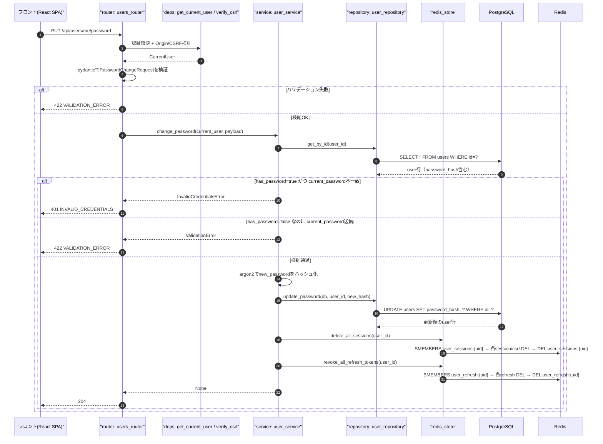
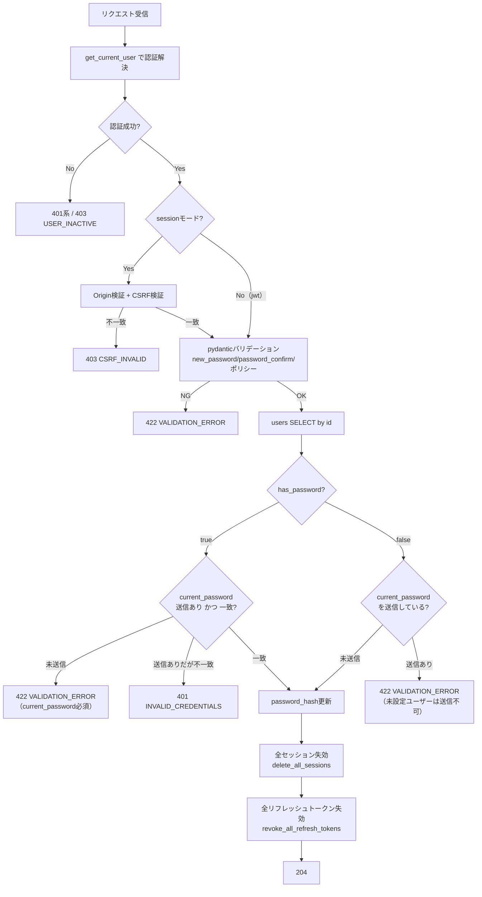
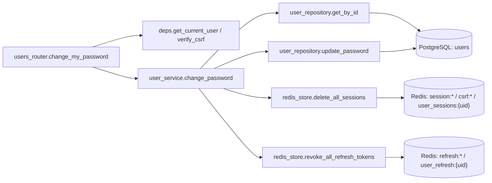
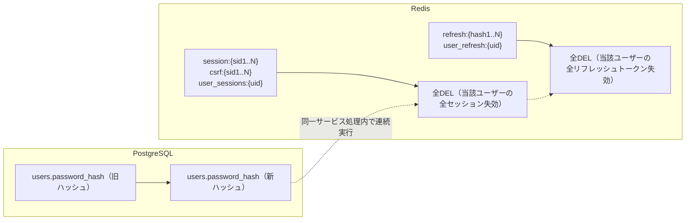

# PUT /api/users/me/password（パスワード変更）

## 0. 関連ドキュメント

| ドキュメント | パス |
|--------------|------|
| API基本設計 | `../../../basic_design/04_api.md`（§2.2 ユーザーAPI一覧、§3.2 `PUT /users/me/password`） |
| 認証基本設計 | `../../../basic_design/03_auth.md`（§7.2末尾・§10 パスワード・トークンのハッシュ） |
| Redis基本設計 | `../../../basic_design/02_redis.md`（§5.1 `delete_all_sessions`、§5.2 `revoke_all_refresh_tokens`） |
| DB基本設計 | `../../../basic_design/01_database.md`（§3.1 users） |
| DB詳細設計 | `../../database/01_table_users.md`（§7 データ遷移図：password_hash設定は状態遷移と独立） |
| プロフィール取得API | `./01_get_users_me.md` |
| パスワードリセット実行API | `../auth/10_post_auth_password_reset.md` |
| ログアウトAPI | `../auth/03_post_auth_logout.md` |

## 1. 概要

| 項目 | 内容 |
|------|------|
| エンドポイント | `PUT /api/users/me/password` |
| 目的 | ログイン中ユーザー自身によるパスワード変更（新規設定を含む） |
| 認証 | 必要（session：`cerberus_sid` Cookie／jwt：`Authorization: Bearer`） |
| 認可 | 認証済みであれば誰でも（自分自身のパスワードのみ変更可） |
| CSRF検証 | 必要（sessionモードの更新系。`X-CSRF-Token`） |
| Origin検証 | 必要（Cookieを利用する更新系リクエスト） |
| AUTH_MODE差異 | 成功時の失効対象がsessionは`session:{sid}`系、jwtは`refresh:{hash}`系という保存先の違いのみ。判定ロジック・レスポンスに差異なし |
| 冪等性 | なし（同一`current_password`/`new_password`で2回目を実行すると1回目成功後は`current_password`が新パスワードと一致しなくなるため2回目は`401 INVALID_CREDENTIALS`となる） |
| レート制限 | 対象外（ログイン試行のレート制限とは別事象。ログイン済みユーザーの操作のため`login_fail`は使用しない） |
| トランザクション境界 | `users.password_hash`のUPDATE（PostgreSQL）と、Redisの全セッション/全リフレッシュトークン失効（同一サービス処理内で連続実行するが、PostgreSQLトランザクションには含められない。`04_api.md`の管理者無効化操作と同様の非分散トランザクション方針） |

## 2. 入出力仕様

### 2.1 リクエスト

パスパラメータ：なし　クエリパラメータ：なし

ヘッダ

| 名前 | 必須 | 説明 |
|------|------|------|
| `Authorization: Bearer {access_token}` | jwtモードのみ必須 | |
| `X-CSRF-Token` | sessionモードのみ必須 | |

Cookie

| 名前 | 必須 | 説明 |
|------|------|------|
| `cerberus_sid` | sessionモードのみ必須 | |
| `cerberus_csrf` | sessionモードのみ必須 | |

ボディ（`PasswordChangeRequest`）

| フィールド | 型 | 必須 | 制約 | 説明 |
|-----------|----|------|------|------|
| current_password | string | 条件付き必須 | `has_password=true`のユーザーは必須。`has_password=false`（Googleのみで登録し未設定）のユーザーは省略可 | 省略時にサーバーは検証をスキップする（値が来た場合は無視ではなく`VALIDATION_ERROR`とする。§13参照） |
| new_password | string | ○ | 8文字以上、大文字英字/小文字英字/数字/記号のうち2種類以上（`04_api.md`§3.1の登録時パスワードポリシーと同一） | |
| password_confirm | string | ○ | `new_password`と一致 | |

### 2.2 レスポンス

**204 No Content**（ボディなし）

Set-Cookieは発行しない（既存のsession/refresh Cookieは失効済みだが、本APIの応答としてCookie破棄の`Set-Cookie`は返さない。次回リクエスト以降はサーバー側で無効と判定されるため、フロントは204受信後に自発的にログアウト状態へ遷移しCookie/メモリを破棄する）。共通ヘッダ：`X-Request-ID`。

## 3. エラー仕様

| HTTP | code | 発生条件 | メッセージ | 備考 |
|------|------|----------|------------|------|
| 401 | `UNAUTHENTICATED` | Cookie/Bearerヘッダなし | ログインが必要です | |
| 401 | `SESSION_EXPIRED` | sessionモードでRedisに`session:{sid}`が存在しない | セッションの有効期限が切れました | |
| 401 | `TOKEN_EXPIRED` | jwtモードでaccess tokenの`exp`超過 | トークンの有効期限が切れました | |
| 401 | `TOKEN_INVALID` | jwtモードで署名不正・`typ != 'access'` | トークンが不正です | |
| 401 | `INVALID_CREDENTIALS` | `has_password=true`で`current_password`不一致 | 現在のパスワードが正しくありません | |
| 403 | `USER_INACTIVE` | `users.is_active = false` | このアカウントは無効化されています | |
| 403 | `CSRF_INVALID` | sessionモードで`X-CSRF-Token`不一致・欠落 | CSRFトークンが不正です | |
| 422 | `VALIDATION_ERROR` | `new_password`と`password_confirm`不一致、パスワードポリシー違反、`has_password=false`なのに`current_password`を送信 | 入力内容に誤りがあります | `details`にフィールド単位のメッセージ |
| 503 | `SERVICE_UNAVAILABLE` | Redis / PostgreSQL接続不能 | 現在サービスをご利用いただけません | fail-close |
| 500 | `INTERNAL_ERROR` | 未捕捉例外 | サーバーエラーが発生しました | |

## 4. 処理シーケンス

## 5. 処理フロー・分岐

## 6. 関数詳細

### 6.1 `api/routers/users_router.py :: change_my_password`

| 項目 | 内容 |
|------|------|
| シグネチャ | `async def change_my_password(payload: PasswordChangeRequest, current_user: CurrentUser = Depends(get_current_user), db: AsyncSession = Depends(get_db), _: None = Depends(verify_csrf)) -> Response` |
| 引数 | `payload`、`current_user`、`db`、`verify_csrf` |
| 戻り値 | `Response(status_code=204)` |
| 送出例外 | `get_current_user`から伝播する401/403系、`verify_csrf`から伝播する403、`InvalidCredentialsError`(401)、`ValidationError`(422) |
| 処理内容 | 1. `user_service.change_password(current_user, payload, db)`を呼び出す 2. 成功時は`204`を返す |
| 副作用 | なし（サービス層に委譲） |

### 6.2 `schemas/user.py :: PasswordChangeRequest`

| 項目 | 内容 |
|------|------|
| シグネチャ | `class PasswordChangeRequest(BaseModel)` |
| フィールド | `current_password: str \| None = None`、`new_password: str`、`password_confirm: str` |
| 戻り値 | - |
| 送出例外 | `pydantic.ValidationError`（`new_password`のポリシー違反・`password_confirm`不一致時） |
| 処理内容 | 1. `new_password`は8文字以上、大文字英字/小文字英字/数字/記号のうち2種類以上を`field_validator`で検証（`01_post_auth_register.md`の登録時パスワードポリシーと同一ロジックを`core/security.py :: validate_password_policy`として共通化） 2. `password_confirm == new_password`を`model_validator`で検証 |
| 副作用 | なし |

### 6.3 `service/user_service.py :: change_password`

| 項目 | 内容 |
|------|------|
| シグネチャ | `async def change_password(current_user: CurrentUser, payload: PasswordChangeRequest, db: AsyncSession, redis_store: RedisStore) -> None` |
| 引数 | `current_user`、`payload`、`db`、`redis_store` |
| 戻り値 | `None` |
| 送出例外 | `InvalidCredentialsError`(401)、`ValidationError`(422) |
| 処理内容 | 1. `user_repository.get_by_id`で現在の`password_hash`を取得 2. `password_hash is not None`（`has_password=true`）の場合：`current_password`が未送信なら`ValidationError`、送信済みで`argon2 verify`が不一致なら`InvalidCredentialsError` 3. `password_hash is None`（`has_password=false`）の場合：`current_password`が送信されていれば`ValidationError`（未設定ユーザーには検証対象がないため） 4. `new_password`をargon2idでハッシュ化 5. `user_repository.update_password(db, user_id, new_hash)` 6. `redis_store.delete_all_sessions(user_id)` 7. `redis_store.revoke_all_refresh_tokens(user_id)` |
| 副作用 | DB更新（`password_hash`）、Redis全失効（`session:*` / `csrf:*` / `user_sessions:{uid}` / `refresh:*` / `user_refresh:{uid}`） |

### 6.4 `repository/user_repository.py :: update_password`

| 項目 | 内容 |
|------|------|
| シグネチャ | `async def update_password(db: AsyncSession, user_id: UUID, password_hash: str) -> User` |
| 引数 | `user_id`、`password_hash`（ハッシュ化済み） |
| 戻り値 | 更新後の`User` |
| 送出例外 | なし |
| 処理内容 | `UPDATE users SET password_hash = :password_hash WHERE id = :user_id RETURNING *`（`updated_at`はトリガで自動更新） |
| 副作用 | DB更新1件 |

### 6.5 `repository/redis_store.py :: delete_all_sessions` / `revoke_all_refresh_tokens`

`../../../basic_design/02_redis.md`§5.1・§5.2を参照（担当外だが再利用する既存関数）。

## 7. 関数相関図

## 8. データ遷移図

パスワード変更を行った端末自身のCookie/アクセストークンも同時に失効するため、フロントは`204`受信後に自発的にログイン画面へ遷移させる（サーバーからのCookie破棄指示はない点に注意）。jwtモードのアクセストークンは署名検証のみのため、失効済みリフレッシュトークンとは独立して最大`ACCESS_TOKEN_TTL_SECONDS`（既定15分）有効なまま残り得る（`03_auth.md`§4.5の即時失効の限界と同様）。

## 9. データアクセス一覧

**PostgreSQL**

| テーブル | 操作 | 条件・TTL | 備考 |
|----------|------|-----------|------|
| users | SELECT | `id = :user_id` | `password_hash`検証用 |
| users | UPDATE | `id = :user_id` | `password_hash`のみ更新 |

**Redis**

| キー | 操作 | 条件・TTL | 備考 |
|------|------|-----------|------|
| `session:{sid}` / `csrf:{sid}` | DEL（`user_sessions:{uid}`の集合を走査して全件） | - | `delete_all_sessions` |
| `user_sessions:{uid}` | DEL | - | 同上 |
| `refresh:{hash}` | DEL（`user_refresh:{uid}`の集合を走査して全件） | - | `revoke_all_refresh_tokens` |
| `user_refresh:{uid}` | DEL | - | 同上 |

sessionモードの認証解決・CSRF検証自体の`GET`/`EXPIRE`は本APIの実行前に発生するため上表には含めない。

## 10. バリデーション規則

| スキーマ | フィールド | 規則 |
|----------|-----------|------|
| `PasswordChangeRequest` | new_password | 8文字以上、大文字英字/小文字英字/数字/記号のうち2種類以上。フロント（zod）も同一ポリシーを`04_api.md`§3.1の登録時と共通のスキーマ定義で用いる |
| `PasswordChangeRequest` | password_confirm | `new_password`と完全一致 |
| `PasswordChangeRequest` | current_password | pydanticレベルでは任意（`str \| None`）。「送信可否」の妥当性判定（`has_password`との整合）はサービス層で行う（DBの現在値を見る必要があるため） |

## 11. 非機能・セキュリティ考慮

| 項目 | 内容 |
|------|------|
| 監査ログ | パスワード変更成功はアプリログにINFOレベルで記録する（ユーザーID・実行時刻のみ。パスワードそのもの・ハッシュは出力しない）。`login_history`テーブルへは記録しない（ログイン試行ではないため対象外。`03_table_login_history.md`§1参照） |
| タイミング攻撃対策 | `current_password`検証は`argon2 verify`（定数時間比較を内部で行う実装）を使用。`has_password=false`ケースでも`current_password`未送信時は即座に次へ進むため計算コストの差でユーザー種別が漏れる余地は小さいが、Google専用ユーザーの存在自体は`GET /users/me`の`has_password`で判別可能なため本APIでの追加対策は不要 |
| fail-close方針 | Redis/PostgreSQL接続不能時は503。ただし`password_hash`のUPDATEが成功した後にRedis全失効が失敗した場合は、旧Cookie/トークンが失効しないまま残るリスクがあるため、Redis接続不能を検知した時点で500ではなく503とし、フロントに再試行を促す（DB更新のロールバックは行わない。§13参照） |
| レート制限 | 対象外（ログイン中ユーザーの操作のため`LOGIN_MAX_ATTEMPTS`は適用しない。総当たり対策が必要であれば要検討） |
| 全端末ログアウト | パスワード漏えい時の被害抑止のため、変更成功時は必ず全セッション・全リフレッシュトークンを失効させる（`03_auth.md`§7.2末尾の方針） |

## 12. テスト設計

| No | 区分 | ケース | 前提 | 期待結果 | pytest関数名案 |
|----|------|--------|------|----------|-----------------|
| 1 | 単体 | has_password=true、current_password一致 | 正しい現在パスワード | パスワード更新・全失効が呼ばれる | `test_change_password_with_current_password_success` |
| 2 | 単体 | has_password=true、current_password不一致 | 誤った現在パスワード | `InvalidCredentialsError` | `test_change_password_wrong_current_password` |
| 3 | 単体 | has_password=true、current_password未送信 | `current_password=None` | `ValidationError`（422相当） | `test_change_password_missing_current_password_when_required` |
| 4 | 単体 | has_password=false、current_password省略 | Googleのみ登録ユーザー | パスワード新規設定に成功 | `test_change_password_set_initial_password_without_current` |
| 5 | 単体 | has_password=false、current_password送信 | 何らかの値を送信 | `ValidationError` | `test_change_password_current_password_not_allowed_when_unset` |
| 6 | 単体 | new_password/password_confirm不一致 | 異なる値 | pydantic `ValidationError` | `test_password_change_request_confirm_mismatch` |
| 7 | 単体 | new_passwordがポリシー違反 | 7文字・1種類のみ | pydantic `ValidationError` | `test_password_change_request_policy_violation` |
| 8 | 結合 | 正常系（session） | 実PostgreSQL/Redis、複数端末でログイン済み | `204`、全端末のsession/csrfが失効し次回リクエストが401になる | `test_put_users_me_password_endpoint_session_success` |
| 9 | 結合 | 正常系（jwt） | 実PostgreSQL/Redis、有効なrefresh token複数 | `204`、全refresh tokenが失効し`/auth/refresh`が401になる | `test_put_users_me_password_endpoint_jwt_success` |
| 10 | 結合 | CSRFトークン欠落（session） | `X-CSRF-Token`ヘッダなし | `403 CSRF_INVALID` | `test_put_users_me_password_endpoint_csrf_missing` |
| 11 | 結合 | 未認証 | Cookie/ヘッダなし | `401 UNAUTHENTICATED` | `test_put_users_me_password_endpoint_unauthenticated` |
| 12 | 結合 | Google専用ユーザーの初回設定後 | パスワード設定成功後に`GET /users/me`を再取得 | `has_password=true`に変化 | `test_put_users_me_password_updates_has_password_flag` |

`AUTH_MODE=session`/`jwt`の両方で8・9を実施する。

## 13. 不明点・要検討事項

| 区分 | 内容 | 影響 |
|------|------|------|
| 要検討 | 基本設計（`03_auth.md`末尾）は「`has_password=false`のユーザーでは`current_password`を省略可」とのみ記載し、「送信した場合にエラーとすべきか無視すべきか」までは明記していない。本書では不整合な入力として`VALIDATION_ERROR`にする方針としたが、無視して処理を継続する設計も選択肢としてあり得る |
| 要検討 | `password_hash`のPostgreSQL更新に成功した直後にRedis全失効が失敗した場合の整合性確保（リトライ・補償処理）は基本設計・Redis詳細設計のいずれにも記述がなく、本書でも503を返すのみに留めた。運用上許容できるか要確認 |
