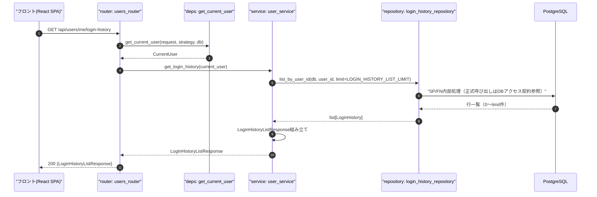
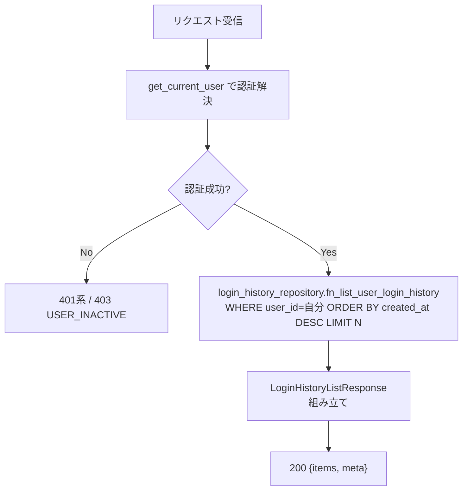
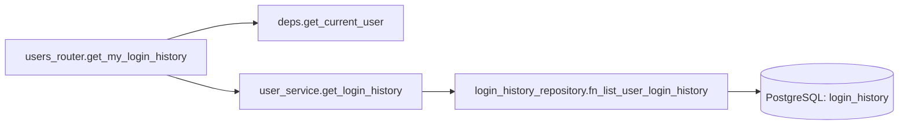
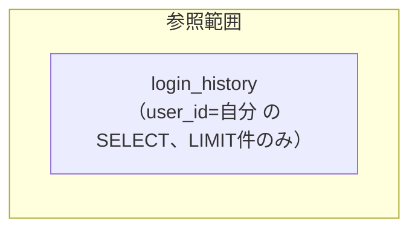

# GET /api/users/me/login-history（自分のログイン履歴）

## 0. 関連ドキュメント

| ドキュメント | パス |
|--------------|------|
| API基本設計 | `../../../basic_design/04_api.md`（§2.2 ユーザーAPI一覧） |
| 認証基本設計 | `../../../basic_design/03_auth.md`（§7章 ログイン履歴の記録契機） |
| DB基本設計 | `../../../basic_design/01_database.md`（§3.7 login_history、§5.4 `sp_purge_login_history`） |
| インフラ基本設計 | `../../../basic_design/06_infra_cicd.md`（§4.2 `LOGIN_HISTORY_RETENTION_DAYS`） |
| DB詳細設計 | `../../database/03_table_login_history.md`（§8.2 `list_by_user_id`） |
| プロフィール取得API | `./01_get_users_me.md` |
| 管理者用ログイン履歴API | `../admin/07_get_admin_login_history.md` |

## 1. 概要

| 項目 | 内容 |
|------|------|
| エンドポイント | `GET /api/users/me/login-history` |
| 目的 | 自分自身のログイン試行履歴（成功・失敗を含む）を新しい順に確認する（設定画面のセキュリティタブを想定） |
| 認証 | 必要（session：`cerberus_sid` Cookie／jwt：`Authorization: Bearer`） |
| 認可 | 認証済みであれば誰でも（**自分の履歴のみ**。他ユーザーの履歴は`user_id`条件で参照不能） |
| CSRF検証 | 不要（参照系メソッド`GET`のため） |
| Origin検証 | 不要（Cookieを新規発行/更新しない参照系のため） |
| AUTH_MODE差異 | 認証経路（Cookie/Bearer）のみ異なる。レスポンス項目・処理内容に差異なし |
| 冪等性 | あり（参照のみ） |
| レート制限 | 対象外 |
| トランザクション境界 | `login_history` SELECT 1回のみ（更新なし） |

## 2. 入出力仕様

### 2.1 リクエスト

パスパラメータ：なし

クエリパラメータ

| 名前 | 型 | 必須 | 制約 | 説明 |
|------|----|------|------|------|
| なし | - | - | - | ページングパラメータは受け付けない。常に直近`LOGIN_HISTORY_LIST_LIMIT`件を返す固定件数の一覧とする（§13参照） |

ヘッダ

| 名前 | 必須 | 説明 |
|------|------|------|
| `Authorization: Bearer {access_token}` | jwtモードのみ必須 | |

Cookie

| 名前 | 必須 | 説明 |
|------|------|------|
| `cerberus_sid` | sessionモードのみ必須 | |

ボディ：なし

### 2.2 レスポンス

**200 OK**（`LoginHistoryListResponse`）

```json
{
  "items": [
    {
      "id": "9e2b...",
      "login_method": "session",
      "ip_address": "203.0.113.10",
      "user_agent": "Mozilla/5.0 ...",
      "success": true,
      "failure_reason": null,
      "created_at": "2026-09-03T04:05:06Z"
    },
    {
      "id": "7a1c...",
      "login_method": "session",
      "ip_address": "203.0.113.10",
      "user_agent": "Mozilla/5.0 ...",
      "success": false,
      "failure_reason": "invalid_credentials",
      "created_at": "2026-09-02T23:10:00Z"
    }
  ],
  "meta": { "limit": 50, "count": 2 }
}
```

| フィールド | 型 | NULL可否 | 説明 |
|-----------|----|----------|------|
| items[].id | string(uuid) | 不可 | |
| items[].login_method | string | 不可 | `session` / `jwt` / `oauth_google` |
| items[].ip_address | string | 可 | 取得できなかった場合はNULL |
| items[].user_agent | string | 可 | 同上 |
| items[].success | boolean | 不可 | |
| items[].failure_reason | string | 可（`success=true`時は必ずNULL） | `invalid_credentials` / `user_inactive` / `oauth_denied` 等 |
| items[].created_at | string(datetime) | 不可 | ISO 8601 / UTC |
| meta.limit | integer | 不可 | 適用された上限件数（`LOGIN_HISTORY_LIST_LIMIT`の現在値） |
| meta.count | integer | 不可 | `items`の実件数（`limit`以下） |

`items`はログイン試行の`login_identifier`（入力されたusername/email原文）を含めない（自分自身の履歴であり値は自明だが、`login_history`テーブルは第三者の誤入力によるレコードも`user_id`一致条件では返らないため、`login_identifier`を返す必然性がなく個人情報の重複露出を避ける。§13参照）。Set-Cookieは発行しない。共通ヘッダ：`X-Request-ID`。`Cache-Control: no-store`を付与する。

## 3. エラー仕様

| HTTP | code | 発生条件 | メッセージ | 備考 |
|------|------|----------|------------|------|
| 401 | `UNAUTHENTICATED` | Cookie/Bearerヘッダなし | ログインが必要です | |
| 401 | `SESSION_EXPIRED` | sessionモードでRedisに`session:{sid}`が存在しない | セッションの有効期限が切れました | |
| 401 | `TOKEN_EXPIRED` | jwtモードでaccess tokenの`exp`超過 | トークンの有効期限が切れました | |
| 401 | `TOKEN_INVALID` | jwtモードで署名不正・`typ != 'access'` | トークンが不正です | |
| 403 | `USER_INACTIVE` | `users.is_active = false` | このアカウントは無効化されています | |
| 503 | `SERVICE_UNAVAILABLE` | Redis（session時）/ PostgreSQL接続不能 | 現在サービスをご利用いただけません | fail-close |
| 500 | `INTERNAL_ERROR` | 未捕捉例外 | サーバーエラーが発生しました | |

## 4. 処理シーケンス



## 5. 処理フロー・分岐



## 6. 関数詳細

### 6.1 `api/routers/users_router.py :: get_my_login_history`

| 項目 | 内容 |
|------|------|
| シグネチャ | `async def get_my_login_history(current_user: CurrentUser = Depends(get_current_user), db: AsyncSession = Depends(get_db), settings: Settings = Depends(get_settings)) -> LoginHistoryListResponse` |
| 引数 | `current_user`、`db`、`settings` |
| 戻り値 | `LoginHistoryListResponse`（200） |
| 送出例外 | `get_current_user`から伝播する401/403系 |
| 処理内容 | 1. `user_service.get_login_history(current_user, db, limit=settings.login_history_list_limit)` を呼び出し結果をそのまま返す |
| 副作用 | なし（参照のみ） |

### 6.2 `service/user_service.py :: get_login_history`

| 項目 | 内容 |
|------|------|
| シグネチャ | `async def get_login_history(current_user: CurrentUser, db: AsyncSession, limit: int) -> LoginHistoryListResponse` |
| 引数 | `current_user`、`db`、`limit`（環境変数由来） |
| 戻り値 | `LoginHistoryListResponse` |
| 送出例外 | なし |
| 処理内容 | 1. `login_history_repository.fn_list_user_login_history(db, current_user.id, limit=limit, offset=0)` 2. 取得した行を`LoginHistoryItem`へマッピング（`login_identifier`は含めない） 3. `meta.limit=limit`、`meta.count=len(items)`を設定し`LoginHistoryListResponse`を返す |
| 副作用 | なし |

### 6.3 `repository/login_history_repository.py :: fn_list_user_login_history`

`../../database/03_table_login_history.md`§8.2を参照（担当外だが再利用する既存関数）。本APIでは`offset=0`固定・`limit=LOGIN_HISTORY_LIST_LIMIT`（既定50）で呼び出す。

## 7. 関数相関図



## 8. データ遷移図

読み取りのみで状態遷移なし。



## 9. データアクセス一覧

**PostgreSQL**

| テーブル | 操作 | 条件・TTL | 備考 |
|----------|------|-----------|------|
| login_history | SELECT | `user_id = :user_id ORDER BY created_at DESC LIMIT :limit` | `ix_login_history_user_created`を使用（`03_table_login_history.md`Q-6） |

**Redis**

sessionモードの認証解決（`GET session:{sid}` → `EXPIRE`）以外の直接アクセスはなし。

## 10. バリデーション規則

| スキーマ | フィールド | 規則 |
|----------|-----------|------|
| なし | - | クエリパラメータを受け付けないため入力バリデーションは不要。`LoginHistoryListResponse`は出力専用スキーマ |

## 11. 非機能・セキュリティ考慮

| 項目 | 内容 |
|------|------|
| 監査ログ | 記録しない（参照APIのため。閲覧行為自体は監査ログ対象としない） |
| ユーザー列挙対策 | 自分自身の履歴のみを返すため対象外 |
| 件数上限の環境変数化 | 上限件数はコードにハードコードせず`LOGIN_HISTORY_LIST_LIMIT`（既定50。`basic_design/04_api.md`§2.2の「直近50件」に対応）として`core/config.py`の`Settings`に定義する。ページングは提供せず常に最新N件のみを返す |
| 自分の履歴のみ | `login_history_repository.fn_list_user_login_history`が`user_id=current_user.id`を必ず条件に含むため、他ユーザーの履歴を混入させる経路がない。管理者であっても本APIでは自分の履歴のみが返る（全ユーザー分は`GET /admin/login-history`が別途提供） |
| fail-close方針 | Redis（session時）/PostgreSQL接続不能時は503 |
| 個人情報の露出範囲 | `login_identifier`（入力されたID文字列）はレスポンスに含めない。IPアドレス・UAは自分自身の履歴表示のため許容する |

## 12. テスト設計

| No | 区分 | ケース | 前提 | 期待結果 | pytest関数名案 |
|----|------|--------|------|----------|-----------------|
| 1 | 単体 | 件数上限以下 | 3件のログイン履歴 | `items`が3件、`meta.count=3` | `test_get_login_history_under_limit` |
| 2 | 単体 | 件数上限超過 | `LOGIN_HISTORY_LIST_LIMIT=50`に対し60件存在 | `items`が新しい順に50件、`meta.limit=50` | `test_get_login_history_over_limit_truncated` |
| 3 | 単体 | 該当履歴なし | 新規ユーザーで履歴0件 | `items=[]`、`meta.count=0` | `test_get_login_history_empty` |
| 4 | 単体 | login_identifierの非露出 | 任意の履歴 | レスポンスに`login_identifier`キーが含まれない | `test_login_history_item_has_no_identifier` |
| 5 | 結合 | 正常系（session） | 実PostgreSQL/Redis、複数回ログイン試行済み | `200`、新しい順に並ぶ | `test_users_me_login_history_endpoint_session_success` |
| 6 | 結合 | 正常系（jwt） | 有効なaccess token | `200` | `test_users_me_login_history_endpoint_jwt_success` |
| 7 | 結合 | 未認証 | Cookie/ヘッダなし | `401 UNAUTHENTICATED` | `test_users_me_login_history_endpoint_unauthenticated` |
| 8 | 結合 | 無効化ユーザー | `is_active=false` | `403 USER_INACTIVE` | `test_users_me_login_history_endpoint_inactive_user` |
| 9 | 結合 | 他ユーザーの履歴が混入しないこと | 2ユーザー分の履歴が存在 | 自分の履歴のみ返る | `test_users_me_login_history_does_not_leak_other_users` |

`AUTH_MODE=session`/`jwt`の両方で5・6を実施する。

## 13. 不明点・要検討事項

| 区分 | 内容 | 影響 |
|------|------|------|
| 要検討 | 「件数上限の環境変数化」に対応する具体的な環境変数名（`LOGIN_HISTORY_LIST_LIMIT`）は基本設計（`06_infra_cicd.md`§4.2）の環境変数一覧に未掲載であり、本書で新規に提案した。既存の`LOGIN_HISTORY_RETENTION_DAYS`（保持"日数"）とは別の設定項目（一覧の"件数"）であるため、`.env.example`・`config.py`への追記が必要 |

## DBアクセス契約

本APIのDBアクセスは、下記のFN/SP呼び出しをrepositoryの薄いラッパーから実行する。テーブルへの直接CRUD、認証業務の判定、履歴のINSERTはrepositoryに実装しない。healthの `SELECT 1` だけは本契約の対象外である。

| 正式な呼び出し | 契約 |
|----------------|------|
| fn_list_user_login_history(p_user_id, p_limit, p_offset) | `detailed_design/database/08_db_functions.md` のシグネチャに従う |

SQLSTATE P0xxxは同文書 §4 の対応表でAPIエラーへ変換し、Redis・メール・JWTの処理はAPI/service層に残す。