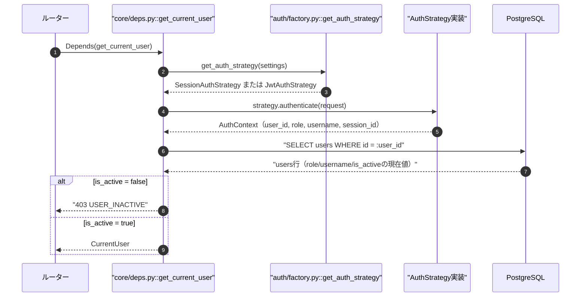
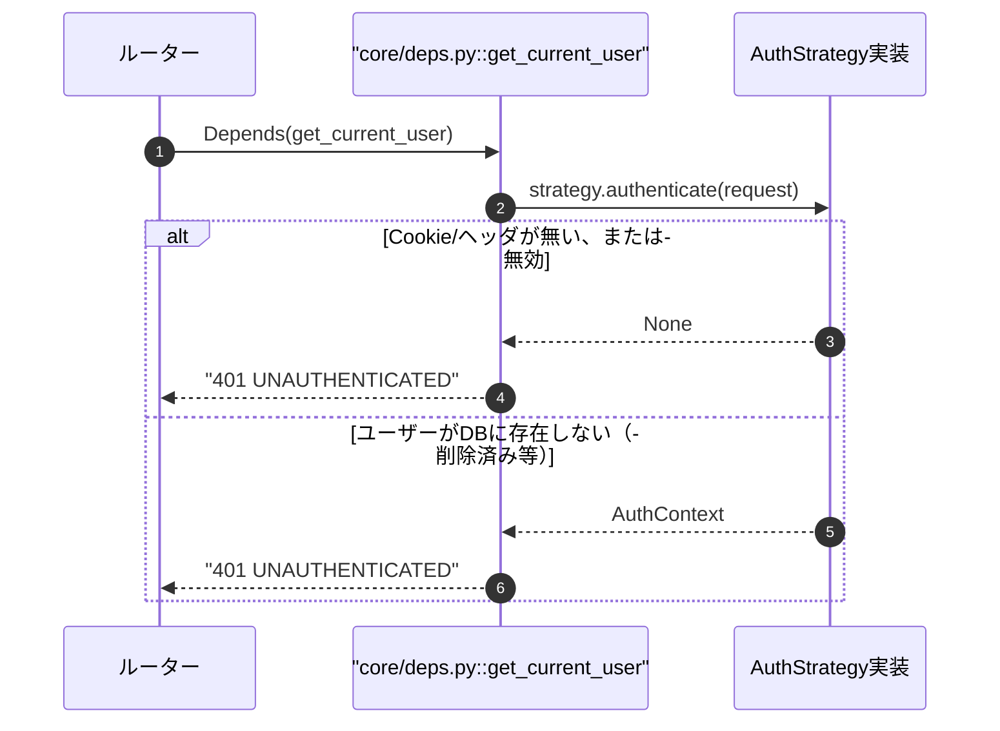
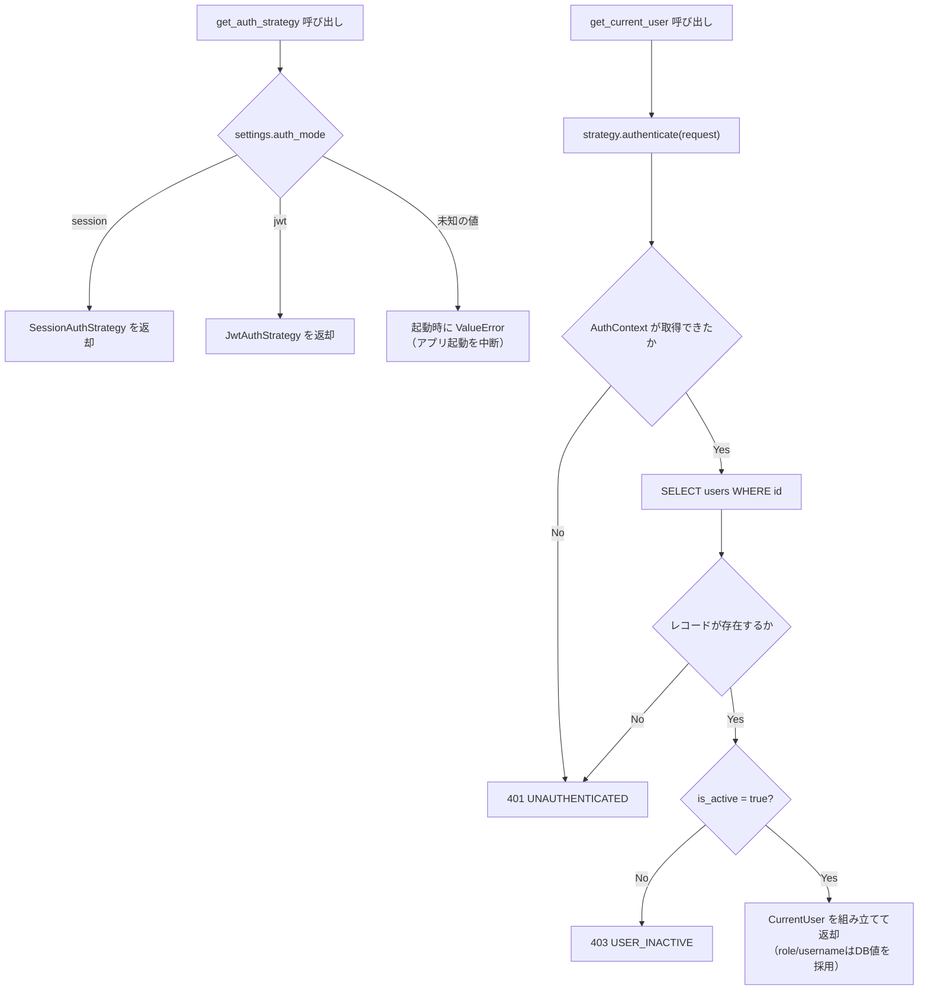
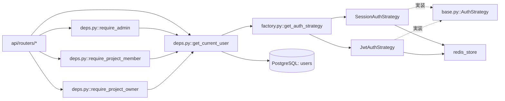

# 00 AuthStrategy抽象クラスと現在ユーザー解決DI

## 0. 関連ドキュメント

- 基本設計：[`../../basic_design/03_auth.md`](../../basic_design/03_auth.md)（§1〜§2、§9）
- 基本設計：[`../../basic_design/02_redis.md`](../../basic_design/02_redis.md)（キー設計・TTL）
- 基本設計：[`../../basic_design/04_api.md`](../../basic_design/04_api.md)（§1 共通仕様、§4 エラー体系）
- 詳細設計：[`./01_session_auth.md`](./01_session_auth.md) / [`./02_jwt_auth.md`](./02_jwt_auth.md) / [`./03_csrf.md`](./03_csrf.md) / [`./05_rbac.md`](./05_rbac.md) / [`./08_redis_store.md`](./08_redis_store.md)

## 1. 概要

| 項目 | 内容 |
|------|------|
| 対象 | `auth/base.py`（AuthStrategy抽象）、`auth/factory.py`（Strategyファクトリ）、`core/deps.py`（現在ユーザー解決DI） |
| 責務 | 認証方式の差異（Cookieセッション／JWT）をStrategyパターンで隠蔽し、ルーター層には統一インターフェースのみを公開する。あわせて認証済みユーザーの解決・認可チェックを共通DIとして提供する |
| 適用条件 | `AUTH_MODE`（`session` \| `jwt`）。起動時に一度だけ評価し `@lru_cache` されたインスタンスをDIで配布する |
| 依存先 | Redis（各Strategy経由）、PostgreSQL（`users`テーブル）、`core/config.py`（Settings） |
| 実装ファイル | `api/app/auth/base.py`、`api/app/auth/factory.py`、`api/app/core/deps.py`、`api/app/schemas/auth.py`（`AuthContext`/`LoginResult`相当のDTO） |

## 2. 構成要素

| 要素 | 種別 | 責務 | 備考 |
|------|------|------|------|
| `AuthStrategy` | 抽象クラス（`abc.ABC`） | `login` / `authenticate` / `logout` / `refresh` の統一インターフェースを定義 | `SessionAuthStrategy` / `JwtAuthStrategy` が実装 |
| `AuthContext` | データクラス（`dataclass`または`pydantic.BaseModel`） | Strategyがリクエストから復元した最小限の認証情報を保持 | `user_id` / `role` / `username` / `session_id` |
| `LoginResult` | データクラス | ログイン成立後にルーター層へ返す値。Cookie設定・レスポンスJSON組み立ての元情報 | `access_token` / `refresh_token` / `csrf_token` はStrategy内部でCookie化するための一時値 |
| `CurrentUser` | pydanticモデル（`schemas/auth.py`） | `get_current_user` が返す、DB再確認済みのユーザー情報 | `id` / `username` / `role` / `is_active` / `email_verified_at` |
| `get_auth_strategy` | 関数（`auth/factory.py`） | `settings.auth_mode` に応じたStrategyインスタンスを返す | `@lru_cache` により起動後は同一インスタンスを再利用 |
| `get_current_user` | DI関数（`core/deps.py`） | `AuthContext` からDBの現在値で `CurrentUser` を構築 | role/usernameはDBを正とする |
| `get_current_user_optional` | DI関数 | 認証任意のエンドポイント用 | `/auth/me` では使用しない |
| `require_admin` | DI関数 | `role == 'admin'` を強制 | 403 `FORBIDDEN` |
| `require_project_member` | DI関数 | プロジェクト所属を強制 | 詳細は[`./05_rbac.md`](./05_rbac.md) |
| `require_project_owner` | DI関数 | オーナーまたはadminを強制 | 詳細は[`./05_rbac.md`](./05_rbac.md) |

## 3. 設定項目（環境変数）

| 変数名 | 型 | 既定値 | 用途 | 秘匿 |
|--------|----|--------|------|------|
| `AUTH_MODE` | str（`session` \| `jwt`） | `session` | Strategy選択の唯一の分岐点 | 否（`.env`） |

本ファイルが扱う設定項目は `AUTH_MODE` のみである。セッション・JWT固有のTTLや鍵は[`./01_session_auth.md`](./01_session_auth.md)・[`./02_jwt_auth.md`](./02_jwt_auth.md)で扱う。`core/config.py` の `Settings`（pydantic-settings）で型検証し、未知の値は起動時に `ValueError` を送出してプロセスを落とす（fail-fast）。

## 4. 全体の出入力

| 分類 | 項目 | 内容 |
|------|------|------|
| 入力 | `Request`（Cookie / `Authorization` ヘッダ） | Strategyが方式に応じて読み取る対象を選択する |
| 入力 | `Settings.auth_mode`（環境変数） | ファクトリの分岐条件 |
| 入力 | `AsyncSession`（DBセッション、`get_db`経由） | `get_current_user` がユーザーの現在値を取得するため |
| 出力 | `AuthContext \| None` | `authenticate()` の戻り値。ルーター層には渡さず `get_current_user` 内部でのみ使用 |
| 出力 | `CurrentUser` | ルーター・サービス層で使用する唯一の「現在のユーザー」表現 |
| 出力 | `LoginResult` | `login()` / `refresh()` の戻り値。ルーターがCookie設定・JSON応答を組み立てる元情報 |
| 出力 | HTTPエラー（401/403） | `get_current_user` 系DIが送出する `HTTPException` 相当の業務例外 |

## 5. シーケンス図

### 5.1 リクエストごとの現在ユーザー解決（正常系）

### 5.2 未認証・異常系

## 6. 処理フロー・分岐

**fail-close方針**：`AUTH_MODE` が不正な場合はリクエスト単位ではなくアプリ起動そのものを失敗させる。Redis/DB接続不能時の挙動は各Strategy側（[`./01_session_auth.md`](./01_session_auth.md) §10、[`./02_jwt_auth.md`](./02_jwt_auth.md) §10）で定義する。

## 7. データ遷移図

なし（本ファイルはRedisキーやトークンのライフサイクルを直接持たない。状態遷移は[`./01_session_auth.md`](./01_session_auth.md)・[`./02_jwt_auth.md`](./02_jwt_auth.md)を参照）。

## 8. 関数・処理詳細

### 8.1 `auth/base.py :: AuthStrategy.login`

| 項目 | 内容 |
|------|------|
| シグネチャ / 定義 | `async def login(self, user: User, request: Request, response: Response) -> LoginResult`（抽象メソッド） |
| 引数 / 入力 | `user`: 認証済みのORMユーザー。`request`: Origin検証等に使用。`response`: Cookie設定先 |
| 戻り値 / 出力 | `LoginResult`（`auth_mode` / `access_token` / `refresh_token` / `csrf_token` / `expires_in`） |
| 送出例外 / 失敗条件 | 実装側の責務。基底では未定義 |
| 処理内容 | 各Strategyが実装（[`./01_session_auth.md`](./01_session_auth.md) §8、[`./02_jwt_auth.md`](./02_jwt_auth.md) §8参照） |
| 副作用 | Redisへの書き込み、`response` へのCookie設定 |

### 8.2 `auth/base.py :: AuthStrategy.authenticate`

| 項目 | 内容 |
|------|------|
| シグネチャ / 定義 | `async def authenticate(self, request: Request) -> AuthContext \| None`（抽象メソッド） |
| 引数 / 入力 | `request`（Cookieまたは`Authorization`ヘッダを内部で読む） |
| 戻り値 / 出力 | `AuthContext`。認証できない場合は `None` を返し、例外は投げない |
| 送出例外 / 失敗条件 | なし（呼び出し元の `get_current_user` が401判定を行う） |
| 処理内容 | 各Strategyが実装 |
| 副作用 | sessionモードはRedisの `EXPIRE`（スライディング更新）を伴う。jwtモードは副作用なし |

### 8.3 `auth/base.py :: AuthStrategy.logout` / `refresh`

| 項目 | 内容 |
|------|------|
| シグネチャ / 定義 | `async def logout(self, request: Request, response: Response) -> None` / `async def refresh(self, request: Request, response: Response) -> LoginResult` |
| 引数 / 入力 | 上記と同様 |
| 戻り値 / 出力 | `logout` は `None`、`refresh` は `LoginResult` |
| 送出例外 / 失敗条件 | `SessionAuthStrategy.refresh` は `NotSupportedInModeError`（405 `NOT_SUPPORTED_IN_MODE`）を送出する |
| 処理内容 | 各Strategyが実装 |
| 副作用 | Redisキー削除・Cookie破棄（logout）、Redisキーのローテーション（refresh） |

### 8.4 `auth/factory.py :: get_auth_strategy`

| 項目 | 内容 |
|------|------|
| シグネチャ / 定義 | `@lru_cache` `def get_auth_strategy(settings: Settings = Depends(get_settings)) -> AuthStrategy` |
| 引数 / 入力 | `settings.auth_mode` |
| 戻り値 / 出力 | `SessionAuthStrategy` または `JwtAuthStrategy` の単一インスタンス |
| 送出例外 / 失敗条件 | `auth_mode` が `session`/`jwt` 以外の場合 `ValueError`（アプリ起動時に評価されるため起動失敗となる） |
| 処理内容 | 1. `settings.auth_mode` を参照 2. 対応するStrategyクラスをインスタンス化（`redis_store`・`settings`を注入） 3. `lru_cache` によりプロセス内で使い回す |
| 副作用 | なし（インスタンス生成のみ） |

### 8.5 `core/deps.py :: get_current_user`

| 項目 | 内容 |
|------|------|
| シグネチャ / 定義 | `async def get_current_user(request: Request, strategy: AuthStrategy = Depends(get_auth_strategy), db: AsyncSession = Depends(get_db)) -> CurrentUser` |
| 引数 / 入力 | 下表参照 |
| 戻り値 / 出力 | `CurrentUser`（`id` / `username` / `role` / `is_active` / `email_verified_at`） |
| 送出例外 / 失敗条件 | `AuthContext` が得られない場合 `401 UNAUTHENTICATED`。`users` に該当行が無い場合 `401 UNAUTHENTICATED`。`is_active = false` の場合 `403 USER_INACTIVE` |
| 処理内容 | 1. `strategy.authenticate(request)` を呼び `AuthContext` を得る 2. `None` なら401 3. `AuthContext.user_id` で `users` をSELECT 4. 存在しなければ401 5. `is_active` を確認し `false` なら403 6. `role` / `username` / `email_verified_at` はDBの現在値のみを採用し、`AuthContext` の値は使用しない 7. `CurrentUser` を組み立てて返す |
| 副作用 | なし（`strategy.authenticate` 内部の副作用を除く） |

**引数一覧**

| 引数 | 型 | 内容 |
|------|----|------|
| `request` | `Request` | Cookie / ヘッダの取得元 |
| `strategy` | `AuthStrategy` | DIで注入される、現在の `AUTH_MODE` に対応するStrategy |
| `db` | `AsyncSession` | `users` テーブル参照用 |

### 8.6 `core/deps.py :: get_current_user_optional`

| 項目 | 内容 |
|------|------|
| シグネチャ / 定義 | `async def get_current_user_optional(request: Request, strategy: AuthStrategy = Depends(get_auth_strategy), db: AsyncSession = Depends(get_db)) -> CurrentUser \| None` |
| 引数 / 入力 | `get_current_user` と同一 |
| 戻り値 / 出力 | `CurrentUser` または `None`（未認証・無効を例外にしない） |
| 送出例外 / 失敗条件 | 送出しない（`get_current_user` を内部で呼び、例外を握りつぶして `None` に変換） |
| 処理内容 | 1. `get_current_user` 相当の処理を試行 2. 401/403相当の状態は例外にせず `None` を返す |
| 副作用 | なし |
| 備考 | `GET /auth/me` は必須認証の `get_current_user` を用いる（基本設計§9.2に明記）。本設計時点で `get_current_user_optional` を要する公開エンドポイントは基本設計に存在しないため、将来の拡張点として用意する |

### 8.7 `core/deps.py :: require_admin`

| 項目 | 内容 |
|------|------|
| シグネチャ / 定義 | `def require_admin(user: CurrentUser = Depends(get_current_user)) -> CurrentUser` |
| 引数 / 入力 | `user`: `get_current_user` の結果 |
| 戻り値 / 出力 | `CurrentUser`（そのまま返す） |
| 送出例外 / 失敗条件 | `user.role != 'admin'` の場合 `403 FORBIDDEN` |
| 処理内容 | 1. `role` を確認 2. `admin` でなければ403 | 
| 副作用 | なし |

### 8.8 `core/deps.py :: require_project_member` / `require_project_owner`

詳細は[`./05_rbac.md`](./05_rbac.md)を正とする。本ファイルではDI関数群の一覧としてのみ位置づける（表2参照）。

## 9. 関数・要素相関図

## 10. セキュリティ・非機能考慮

| 観点 | 方針 | 根拠 |
|------|------|------|
| DBの現在値を正とする | `AuthContext` の `role`/`username` は認可判定に使わず、必ず `users` テーブルの現在値を再取得する | 管理者によるロール変更・無効化を、失効前のトークン/セッションでも即座に反映するため（基本設計§9.2） |
| fail-fast | `AUTH_MODE` が不正な値の場合はリクエスト処理ではなく起動時に例外を送出する | 設定ミスを本番運用前に検出するため |
| 情報漏洩防止 | `get_current_user` は401と403を明確に区別するが、プロジェクトリソースへの認可は[`./05_rbac.md`](./05_rbac.md)の方針（未所属は404）に従う | 存在有無の漏洩を防ぐため |
| ログ出力 | 認証失敗時の理由（401/403の種別）はアプリログに記録し、レスポンスボディには最小限のエラーコードのみを含める | 攻撃者への情報提供を避けつつ運用調査を可能にするため |
| DIの単一責務 | `require_admin` 等は `get_current_user` に依存する形で合成し、認証と認可のロジックを分離する | 責務分離（本プロジェクトのコーディングルール） |

## 11. テスト設計

| No | 区分 | ケース | 前提 | 期待結果 | テスト名案 |
|----|------|--------|------|----------|-----------|
| 1 | 単体 | `get_auth_strategy` が `AUTH_MODE=session` で `SessionAuthStrategy` を返す | `Settings(auth_mode="session")` | インスタンス型が一致 | `test_factory_returns_session_strategy` |
| 2 | 単体 | `get_auth_strategy` が `AUTH_MODE=jwt` で `JwtAuthStrategy` を返す | `Settings(auth_mode="jwt")` | インスタンス型が一致 | `test_factory_returns_jwt_strategy` |
| 3 | 単体 | `AUTH_MODE` が不正値の場合に起動時 `ValueError` | `Settings(auth_mode="invalid")` | `ValueError` 送出 | `test_factory_raises_on_invalid_mode` |
| 4 | 結合 | `authenticate` が `None` を返す場合 `get_current_user` が401 | Cookie/ヘッダなしのリクエスト | `401 UNAUTHENTICATED` | `test_get_current_user_unauthenticated` |
| 5 | 結合 | `is_active=false` のユーザーで403 | 事前にDB上で無効化済みのユーザーのセッション/トークン | `403 USER_INACTIVE` | `test_get_current_user_inactive_user` |
| 6 | 結合 | ログイン後にDB上でroleを`admin`へ変更しても、既存セッション/トークンで直後にadmin判定される | session/jwt双方でパラメータ化 | `require_admin` が通過 | `test_role_change_reflected_immediately` |
| 7 | 結合 | `require_admin` が member ロールで403 | member権限で認証済み | `403 FORBIDDEN` | `test_require_admin_forbidden_for_member` |
| 8 | 単体 | `get_current_user_optional` が未認証時に例外を出さず `None` を返す | Cookie/ヘッダなし | 戻り値 `None` | `test_get_current_user_optional_returns_none` |

## 12. 不明点・要検討事項

| 区分 | 内容 | 影響 |
|------|------|------|
| 要検討 | `get_current_user_optional` を実際に使用する公開エンドポイントが基本設計上に存在しない（`/auth/me` は必須認証）。将来的な用途（例：公開プロジェクトページ等）が追加されるまでは未使用のユーティリティとなる | 低。実装しても呼び出し元が無いだけで害はない |
| 不明 | `AuthContext`/`LoginResult`/`CurrentUser` の実装形式（`dataclass` か `pydantic.BaseModel` か）は基本設計に明記がない。本ファイルでは両者の使い分けを慣例（DTO=pydantic、内部値オブジェクト=dataclass許容）として仮定した | 低。実装時に統一されていれば問題ない |
