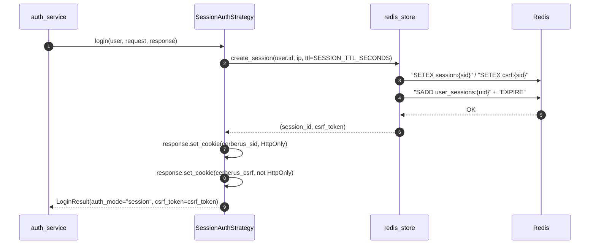
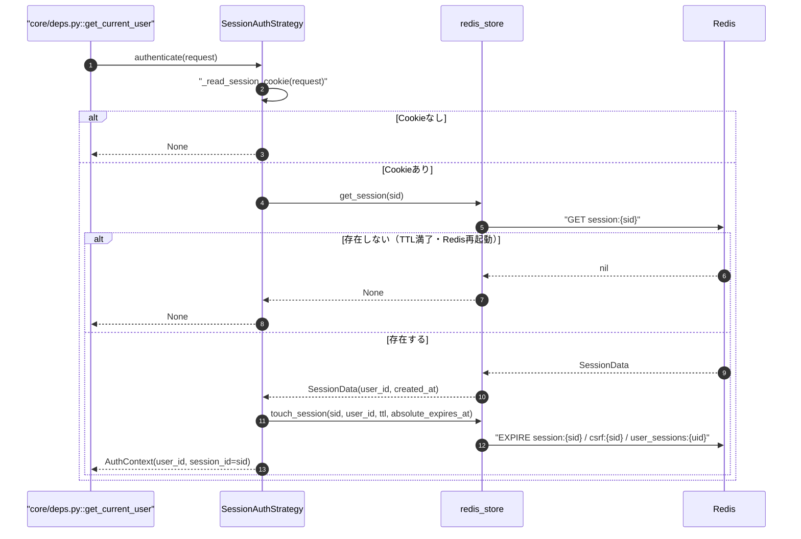
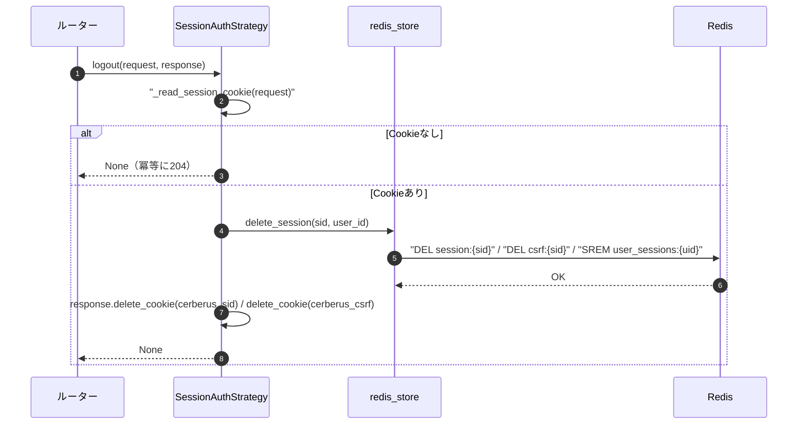
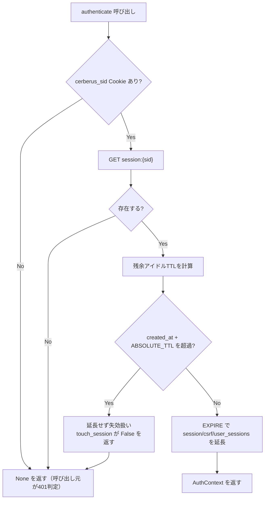
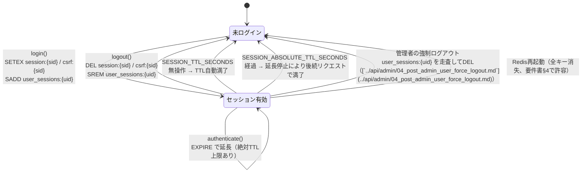
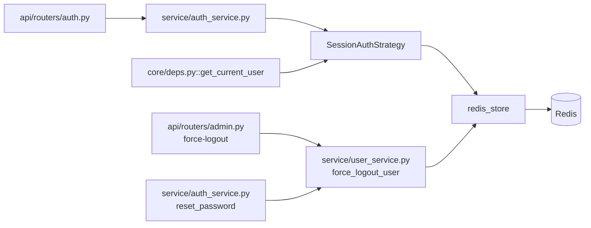

# 01 sessionモード（Cookie + Redis）

## 0. 関連ドキュメント

- 基本設計：[`../../basic_design/03_auth.md`](../../basic_design/03_auth.md)（§3 session方式、§8 CSRF、§11 比較表）
- 基本設計：[`../../basic_design/02_redis.md`](../../basic_design/02_redis.md)（§2 キー一覧、§3 TTL設計、§4.1 状態遷移、§5.1 操作関数）
- 詳細設計：[`./00_strategy_base.md`](./00_strategy_base.md)（`AuthStrategy`抽象・`get_current_user`）
- 詳細設計：[`./02_jwt_auth.md`](./02_jwt_auth.md)（比較対象のjwtモード）
- 詳細設計：[`./03_csrf.md`](./03_csrf.md)（CSRF検証の詳細）
- 詳細設計：[`./08_redis_store.md`](./08_redis_store.md)（`redis_store`関数実装）
- 詳細設計：[`../api/auth/02_post_auth_login.md`](../api/auth/02_post_auth_login.md) / [`../api/auth/03_post_auth_logout.md`](../api/auth/03_post_auth_logout.md)

## 1. 概要

| 項目 | 内容 |
|------|------|
| 対象 | `auth/session_auth.py :: SessionAuthStrategy`（`AuthStrategy`の実装の一つ） |
| 責務 | サーバー側セッションをRedisに保持し、HttpOnly Cookie `cerberus_sid` でセッションIDを送受信する認証状態の確立・検証・失効を担う |
| 適用条件 | `AUTH_MODE=session`（既定値）。`auth/factory.py::get_auth_strategy` がインスタンスを配布する |
| 依存先 | Redis（`redis_store`の§5.1系関数）、PostgreSQL（`users`。role/usernameの現在値確認は`00_strategy_base.md`側の責務） |
| 実装ファイル | `api/app/auth/session_auth.py`、`api/app/repository/redis_store.py`（共通利用） |

`refresh()` は本方式では意味を持たない（Redis TTLの延長は`authenticate()`内のスライディング更新で完結する）ため、`NotSupportedInModeError` を送出し、ルーターは `405 NOT_SUPPORTED_IN_MODE` を返す。

## 2. 構成要素

| 要素 | 種別 | 責務 | 備考 |
|------|------|------|------|
| `SessionAuthStrategy` | クラス | `AuthStrategy`の実装。login/authenticate/logout/refresh(NotSupported) | コンストラクタで`redis_store`・`settings`を注入 |
| `_read_session_cookie` | プライベートメソッド | `request.cookies`から`cerberus_sid`を取得 | Cookie名は`COOKIE_NAME_SESSION`環境変数 |
| `_build_auth_context` | プライベートメソッド | RedisのSessionDataから`AuthContext`を組み立てる | `role`/`username`は含めない（DB確認は上位層の責務） |
| `redis_store.create_session` | 関数（外部・[`./08_redis_store.md`](./08_redis_store.md)） | session_id/csrf_tokenの発行とRedis書き込み | [`../../basic_design/02_redis.md`](../../basic_design/02_redis.md) §5.1 |
| `redis_store.touch_session` | 関数（外部） | スライディング更新（アイドルTTL延長、絶対TTL上限あり） | 同上 |
| `redis_store.delete_session` / `delete_all_sessions` | 関数（外部） | 単一/全端末の即時失効 | 同上 |

## 3. 設定項目（環境変数）

| 変数名 | 型 | 既定値 | 用途 | 秘匿 |
|--------|----|--------|------|------|
| `SESSION_TTL_SECONDS` | int | `1800` | セッションのアイドルタイムアウト（スライディング延長の単位） | 否 |
| `SESSION_ABSOLUTE_TTL_SECONDS` | int | `28800`（8時間） | セッション作成時刻からの絶対上限。超過後は延長しない | 否 |
| `COOKIE_NAME_SESSION` | str | `cerberus_sid` | セッションCookie名 | 否 |
| `COOKIE_NAME_CSRF` | str | `cerberus_csrf` | CSRFトークンCookie名（[`./03_csrf.md`](./03_csrf.md)参照） | 否 |
| `COOKIE_SECURE` | bool | `true`（本番） | Cookieの`Secure`属性。ローカルHTTP開発では`false` | 否 |
| `COOKIE_SAMESITE` | str | `lax` | セッション/CSRF Cookieの`SameSite` | 否 |

TTL・Cookie名は`core/config.py`の`Settings`から取得し、`session_auth.py`にハードコードしない。

## 4. 全体の出入力

| 分類 | 項目 | 内容 |
|------|------|------|
| 入力（login） | `user`（認証済みORMユーザー）、`request`（IP取得用） | `redis_store.create_session`へ渡す |
| 入力（authenticate） | `request.cookies[COOKIE_NAME_SESSION]` | Redis参照キー |
| 入力（logout） | `request.cookies[COOKIE_NAME_SESSION]`、`AuthContext.user_id` | 削除対象の特定 |
| 出力（login） | `Set-Cookie: cerberus_sid` / `Set-Cookie: cerberus_csrf`、`LoginResult(auth_mode="session")` | `access_token`/`refresh_token`は`None` |
| 出力（authenticate） | `AuthContext(user_id, session_id)` または `None` | `role`/`username`は含めない |
| 出力（logout） | `Set-Cookie`（`Max-Age=0`によるCookie破棄） | Redisキー削除（副作用） |
| Redisキー入出力 | `session:{sid}` / `csrf:{sid}` / `user_sessions:{uid}` | [`../../basic_design/02_redis.md`](../../basic_design/02_redis.md) §2 |

## 5. シーケンス図

### 5.1 ログイン（正常系・基本設計§3.2の再掲ではなくStrategy内部処理に焦点）

### 5.2 リクエストごとの認証（スライディング更新を含む）

### 5.3 ログアウト

## 6. 処理フロー・分岐

**fail-close方針**：Redis接続不能時（`ConnectionError`等）は`authenticate`が例外を吸収せず、上位のミドルウェアが`503 SERVICE_UNAVAILABLE`に変換する（[`../../basic_design/02_redis.md`](../../basic_design/02_redis.md) §6）。セッション判定不能時に「認証済み扱い」へフォールバックしないことが本方式のfail-close要件である。

## 7. データ遷移図

## 8. 関数・処理詳細

### 8.1 `auth/session_auth.py :: SessionAuthStrategy.login`

| 項目 | 内容 |
|------|------|
| シグネチャ / 定義 | `async def login(self, user: User, request: Request, response: Response) -> LoginResult` |
| 引数 / 入力 | `user`: 認証済みユーザー。`request`: `TRUSTED_PROXY_CIDRS`の境界内だけXFFを右から検証して解決したIPを取得。`response`: Cookie設定先 |
| 戻り値 / 出力 | `LoginResult(auth_mode="session", access_token=None, refresh_token=None, csrf_token=<発行値>, expires_in=SESSION_TTL_SECONDS)` |
| 送出例外 / 失敗条件 | Redis書き込み失敗時は`RedisUnavailableError`（呼び出し元で503変換） |
| 処理内容 | 1. `redis_store.create_session(user.id, ip, ttl=settings.session_ttl_seconds)`を呼びsession_id/csrf_tokenを得る 2. `response.set_cookie`で`cerberus_sid`（HttpOnly, Secure=`COOKIE_SECURE`, SameSite=`COOKIE_SAMESITE`, Path=`/`, Max-Age未設定）を設定 3. `response.set_cookie`で`cerberus_csrf`（HttpOnly=False、他属性は同様）を設定 4. `LoginResult`を組み立てて返す |
| 副作用 | Redis書き込み（`session:{sid}`/`csrf:{sid}`/`user_sessions:{uid}`）、レスポンスへの`Set-Cookie`付与 |

### 8.2 `auth/session_auth.py :: SessionAuthStrategy.authenticate`

| 項目 | 内容 |
|------|------|
| シグネチャ / 定義 | `async def authenticate(self, request: Request) -> AuthContext \| None` |
| 引数 / 入力 | `request.cookies.get(settings.cookie_name_session)` |
| 戻り値 / 出力 | `AuthContext(user_id=..., role=None, username=None, session_id=sid)`。`role`/`username`は`00_strategy_base.md`の`get_current_user`がDBから再取得するため、本メソッドでは設定不要（フィールドは存在するが未使用） |
| 送出例外 / 失敗条件 | 例外を送出せず、認証不可時は`None`を返す |
| 処理内容 | 1. Cookieを読み取り、無ければ`None` 2. `redis_store.get_session(sid)`を呼ぶ 3. `None`なら`None`を返す 4. `redis_store.touch_session(sid, user_id, ttl, absolute_expires_at)`を呼びTTLを延長する。`False`が返る場合（絶対TTL超過）は`None`を返す 5. `AuthContext`を組み立てて返す |
| 副作用 | Redisの`EXPIRE`（TTL延長） |

### 8.3 `auth/session_auth.py :: SessionAuthStrategy.logout`

| 項目 | 内容 |
|------|------|
| シグネチャ / 定義 | `async def logout(self, request: Request, response: Response) -> None` |
| 引数 / 入力 | `request`（Cookie読み取り用）、`response`（Cookie破棄用） |
| 戻り値 / 出力 | `None` |
| 送出例外 / 失敗条件 | なし（Cookieが無い場合も冪等に成功扱い） |
| 処理内容 | 1. Cookieから`sid`を取得。無ければ何もせず終了 2. `get_session(sid)`で`user_id`を特定できる場合は`redis_store.delete_session(sid, user_id)`を呼ぶ 3. `response.delete_cookie`で`cerberus_sid`・`cerberus_csrf`を破棄（`Max-Age=0`） |
| 副作用 | Redis削除（`session:{sid}`/`csrf:{sid}`/`user_sessions:{uid}`からの除去）、Cookie破棄 |

### 8.4 `auth/session_auth.py :: SessionAuthStrategy.refresh`

| 項目 | 内容 |
|------|------|
| シグネチャ / 定義 | `async def refresh(self, request: Request, response: Response) -> LoginResult` |
| 引数 / 入力 | 使用しない |
| 戻り値 / 出力 | 返さない（例外送出） |
| 送出例外 / 失敗条件 | 常に`NotSupportedInModeError`を送出。ルーター層で`405 NOT_SUPPORTED_IN_MODE`に変換（[`../api/auth/06_post_auth_refresh.md`](../api/auth/06_post_auth_refresh.md)参照） |
| 処理内容 | 呼び出されたことをログに記録し、即座に例外を送出する |
| 副作用 | なし |

### 8.5 `service/user_service.py :: force_logout_user` との関係（全セッション失効）

| 項目 | 内容 |
|------|------|
| シグネチャ / 定義 | `async def force_logout_user(user_id: UUID) -> int`（管理者API・パスワードリセット・パスワード変更・アカウント無効化から共通利用） |
| 引数 / 入力 | `user_id` |
| 戻り値 / 出力 | 削除したセッション数（`int`） |
| 送出例外 / 失敗条件 | Redis接続不能時は呼び出し元に伝播（fail-close） |
| 処理内容 | 1. `redis_store.delete_all_sessions(user_id)`を呼ぶ 2. 内部は`SMEMBERS user_sessions:{uid}`で全session_idを列挙し、各`session:{sid}`/`csrf:{sid}`を`DEL`した後に`user_sessions:{uid}`自体を`DEL`する | 
| 副作用 | Redis上のユーザー単位の全セッション削除（**ユーザー単位の全セッション失効の実現方法**そのもの） |

`force_logout_user`はStrategy自体のメソッドではなく、`SessionAuthStrategy`と`JwtAuthStrategy`の双方から共通して呼ばれるユーザー単位の失効ユーティリティである。sessionモードでは`delete_all_sessions`、jwtモードでは`revoke_all_refresh_tokens`（[`./02_jwt_auth.md`](./02_jwt_auth.md) §8）を、`AUTH_MODE`に関わらず両方呼び出す設計とする（同一ユーザーが将来モード切替を経験しても残留キーが残らないようにするため）。

## 9. 関数・要素相関図

## 10. セキュリティ・非機能考慮

| 観点 | 方針 | 根拠 |
|------|------|------|
| Cookie属性 | `HttpOnly=Yes`（`cerberus_sid`）によりJSからの読み取り・XSSでの持ち出しを防ぐ | [`../../basic_design/03_auth.md`](../../basic_design/03_auth.md) §3.1 |
| CSRF Cookieのみ非HttpOnly | `cerberus_csrf`はJSが`X-CSRF-Token`ヘッダへ転記するため`HttpOnly=No`とする | Double Submit Cookieの原理上必須（[`./03_csrf.md`](./03_csrf.md)） |
| ログアウトの即時性 | `DEL`によるRedisキー削除は同期的に反映され、次リクエストから即401になる | jwtモードとの本質的な差分（要件書§3.1の学習観点） |
| fail-close | Redis接続不能時は認証不能として`503`（未認証扱いの`401`にはしない） | [`../../basic_design/02_redis.md`](../../basic_design/02_redis.md) §6 |
| セッション固定化対策 | ログイン成功時は必ず新規`session_id`を発行し、ログイン前のCookie値を再利用しない | 認証状態遷移時のセッション固定化攻撃を防ぐため |
| 絶対TTL | アイドルTTLの延長のみでは無期限セッションになり得るため、`SESSION_ABSOLUTE_TTL_SECONDS`で上限を設ける | 長時間放置端末からの乗っ取りリスク低減 |
| ログ出力 | セッション作成・削除・強制ログアウトはユーザーID・request_idを記録し、Cookie値やセッションIDそのものは記録しない | 秘匿情報の非ログ化 |

## 11. テスト設計

| No | 区分 | ケース | 前提 | 期待結果 | テスト名案 |
|----|------|--------|------|----------|-----------|
| 1 | 単体 | `login`が新規`session_id`/`csrf_token`を発行しRedisに書き込む | `fakeredis` | `session:{sid}`/`csrf:{sid}`/`user_sessions:{uid}`が存在 | `test_session_login_creates_keys` |
| 2 | 単体 | `authenticate`が有効なCookieで`AuthContext`を返す | 事前に`create_session`済み | `AuthContext.user_id`が一致 | `test_session_authenticate_success` |
| 3 | 単体 | `authenticate`がCookie無しで`None`を返す | Cookieなしのリクエスト | `None` | `test_session_authenticate_no_cookie` |
| 4 | 単体 | `authenticate`がTTL満了後に`None`を返す | TTLを1秒に上書きしsleep | `None` | `test_session_authenticate_expired` |
| 5 | 単体 | `authenticate`呼び出しごとにTTLが延長される（アイドルタイムアウト） | `touch_session`呼び出し前後のTTL比較 | 延長後TTL >= 延長前TTL | `test_session_authenticate_extends_ttl` |
| 6 | 単体 | 絶対TTL超過時は延長されず失効扱いになる | `created_at`を`SESSION_ABSOLUTE_TTL_SECONDS`超過に設定 | `touch_session`が`False`、`authenticate`が`None` | `test_session_absolute_ttl_exceeded` |
| 7 | 単体 | `logout`がRedisキーを削除しCookieを破棄する | 事前ログイン状態 | `session:{sid}`が存在しない、レスポンスに`Max-Age=0` | `test_session_logout_deletes_keys` |
| 8 | 単体 | `logout`後の`authenticate`が`None`を返す（即時失効） | logout実行直後 | `None` | `test_session_logout_immediate_invalidation` |
| 9 | 単体 | `refresh`が`NotSupportedInModeError`を送出する | - | 例外送出 | `test_session_refresh_not_supported` |
| 10 | 結合 | `force_logout_user`が同一ユーザーの複数端末セッションを一括失効する | 2端末分`login`済み | 両方の`authenticate`が`None` | `test_force_logout_all_sessions` |
| 11 | 結合 | ログアウト後に旧`X-CSRF-Token`を使った更新系リクエストが401になる | logout後に同じCookie/ヘッダで再送 | `401 SESSION_EXPIRED` | `test_logout_then_request_returns_401` |
| 網羅できない範囲 | Redisプロセス自体のダウン・再起動中の挙動 | 実プロセス障害はCIで再現しないため手動確認とする | - | - |

## 12. 比較表：session方式 vs jwt方式（要件書§3.1対応）

要件書§3.1「ログアウト時の失効方法の違い」「スケールする場合にどちらが有利か」「CSRF対策の要否の違い」に対応する。jwtモードの詳細は[`./02_jwt_auth.md`](./02_jwt_auth.md)を参照。

| 観点 | session方式 | jwt方式 |
|------|-------------|---------|
| 認証状態の保持場所 | サーバー（Redis）。クライアントは不透明なsession_idのみ保持 | クライアント（アクセストークン本体）。サーバーはリフレッシュトークンのハッシュのみ保持 |
| ログアウト時の失効方法 | `DEL session:{sid}`で**即時**失効。次リクエストから401 | `DEL refresh:{hash}`のみ即時。**アクセストークンは署名検証のみのためRedisを参照せず、`ACCESS_TOKEN_TTL_SECONDS`（既定900秒）経過まで有効であり続ける** |
| ユーザー単位の全端末失効 | `user_sessions:{uid}`を走査して全`session_id`をDEL（即時・全端末で反映） | `user_refresh:{uid}`を走査して全リフレッシュトークンをDEL。ただし各端末の直近発行アクセストークンは残存TTL分だけ有効 |
| スケール時（サーバー台数増加時）の優位性 | 全台がRedisを共有すればステートレスに近い形で水平分割できるが、**毎リクエストでRedisへの往復が必須**であり、Redisが単一障害点・スループットの上限になり得る | アクセストークン検証は署名検証のみで**ストアへの往復が不要**。リクエストの大半（アクセストークン検証）はRedis非依存でスケールしやすい。ただしリフレッシュ発行・ローテーションはRedis依存が残る |
| CSRF対策の要否 | **必須**。ブラウザがCookieを自動送信するため、Double Submit Cookie + Origin検証が全更新系APIに必要（[`./03_csrf.md`](./03_csrf.md)） | 通常APIは`Authorization`ヘッダ方式のため**不要**。Cookieを使う`/auth/refresh`・`/auth/logout`のみCSRF対策が必要 |
| リクエストごとのRedisアクセス | 毎回必要（`GET`+`EXPIRE`） | 通常APIでは不要（署名検証のみ）。`/auth/refresh`のみ必要 |
| 実装の複雑さ | 低い（CRUD的なキー操作のみ） | ローテーション・再利用検知・family失効の実装が必要で高い（[`./02_jwt_auth.md`](./02_jwt_auth.md) §6） |

## 13. 不明点・要検討事項

| 区分 | 内容 | 影響 |
|------|------|------|
| 確定 | `create_session`に渡す`ip`は`TRUSTED_PROXY_CIDRS`で解決したクライアントIPとする。境界外のXFFは無視し、接続元IPを採用する | `login_history`・レート制限と同じIP解決規則を共有する |
| 不明 | `SESSION_ABSOLUTE_TTL_SECONDS`超過を検出した`touch_session`が`False`を返した際、当該セッションキー自体をこのタイミングで明示的に`DEL`するか、TTL経過に委ねるかは基本設計に記載がない。本設計では「延長しない」のみを実装し、明示削除は行わない前提とした | 低。どちらでも最終的にTTLで失効するため機能上の差は小さい |
| なし | 上記以外 | - |
