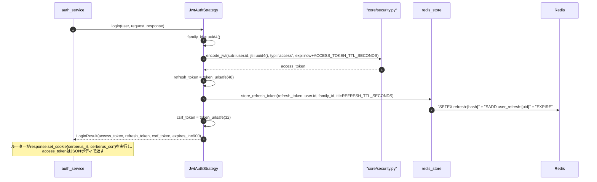
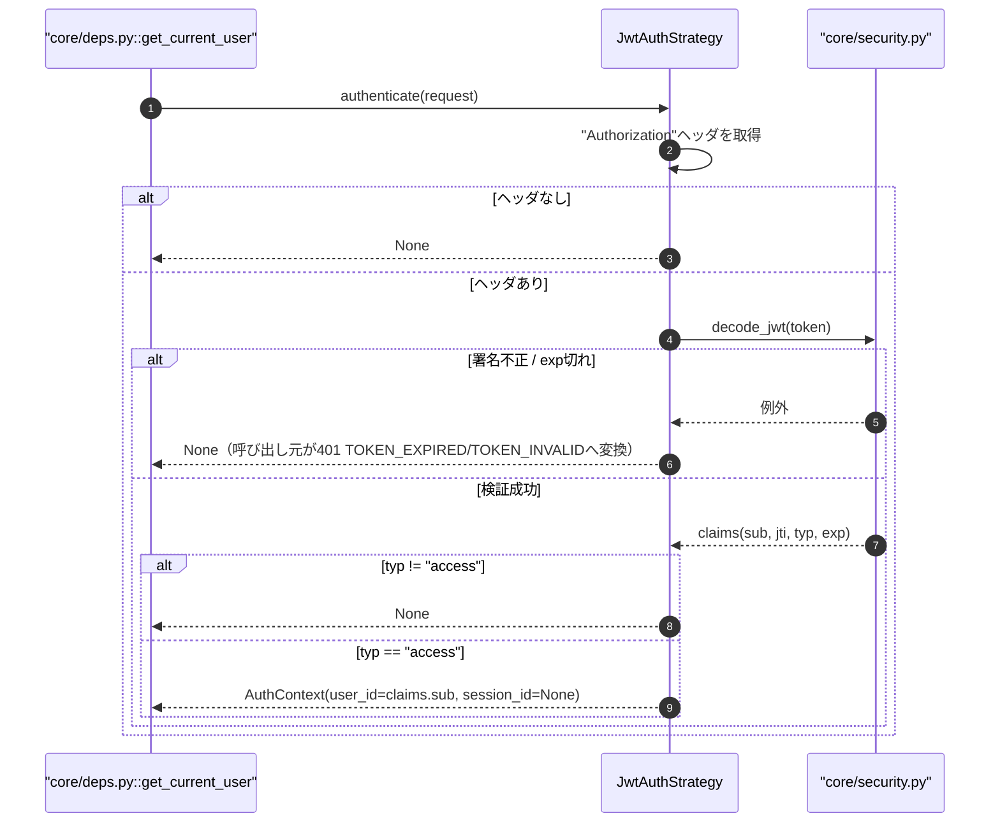
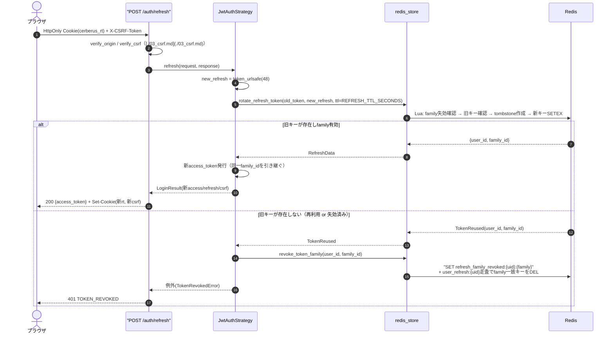
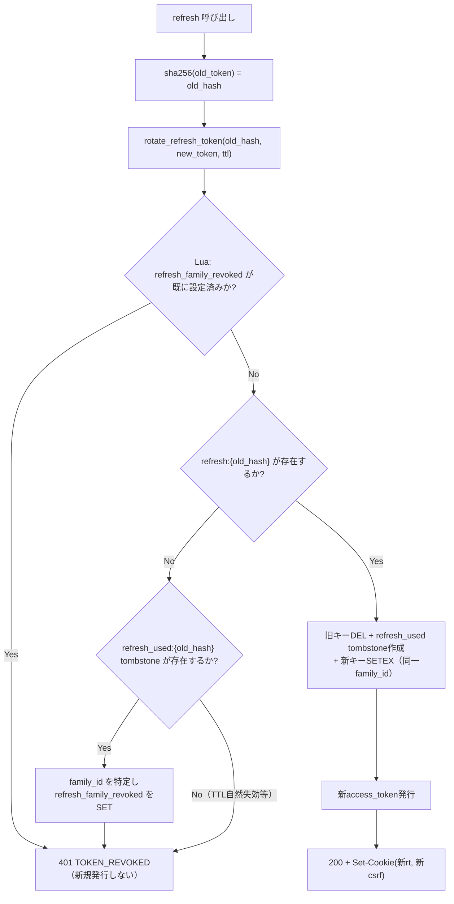
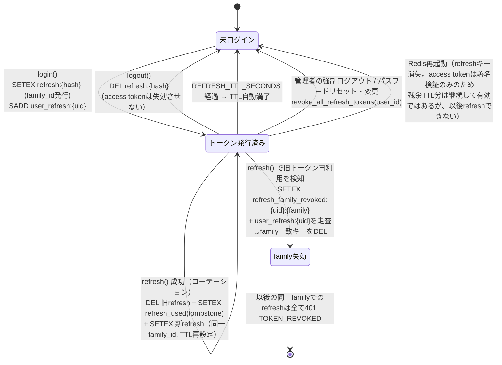
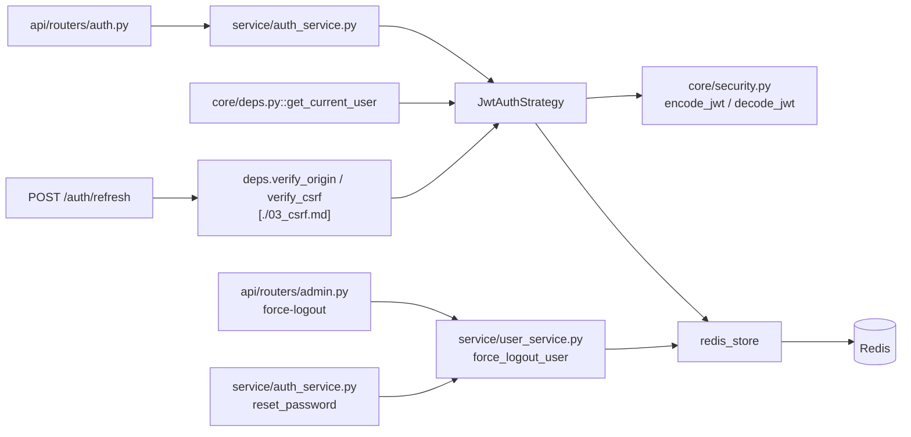

# 02 jwtモード（アクセストークン + リフレッシュトークン・ローテーション）

## 0. 関連ドキュメント

- 基本設計：[`../../basic_design/03_auth.md`](../../basic_design/03_auth.md)（§4 jwt方式、§8 CSRF、§11 比較表）
- 基本設計：[`../../basic_design/02_redis.md`](../../basic_design/02_redis.md)（§2 キー一覧、§4.2 ローテーション遷移、§5.2 操作関数）
- 詳細設計：[`./00_strategy_base.md`](./00_strategy_base.md)（`AuthStrategy`抽象・`get_current_user`）
- 詳細設計：[`./01_session_auth.md`](./01_session_auth.md)（比較対象のsessionモード、§12に比較表あり）
- 詳細設計：[`./03_csrf.md`](./03_csrf.md)（`/auth/refresh`・`/auth/logout`のCSRF検証）
- 詳細設計：[`./08_redis_store.md`](./08_redis_store.md)（`redis_store`関数実装、Luaスクリプト）
- 詳細設計：[`../api/auth/06_post_auth_refresh.md`](../api/auth/06_post_auth_refresh.md) / [`../api/auth/03_post_auth_logout.md`](../api/auth/03_post_auth_logout.md)

## 1. 概要

| 項目 | 内容 |
|------|------|
| 対象 | `auth/jwt_auth.py :: JwtAuthStrategy`（`AuthStrategy`の実装の一つ） |
| 責務 | 短命アクセストークン（署名検証のみ・サーバー保存なし）と長命リフレッシュトークン（ハッシュ化してRedis保存）による認証状態の確立・検証・失効・ローテーションを担う |
| 適用条件 | `AUTH_MODE=jwt`。`auth/factory.py::get_auth_strategy`がインスタンスを配布する |
| 依存先 | Redis（`redis_store`の§5.2系関数、Luaスクリプト）、PostgreSQL（`users`。role/usernameの現在値確認は`00_strategy_base.md`側の責務） |
| 実装ファイル | `api/app/auth/jwt_auth.py`、`api/app/repository/redis_store.py`（共通利用）、`api/app/core/security.py`（JWTエンコード/デコード） |

## 2. 構成要素

| 要素 | 種別 | 責務 | 備考 |
|------|------|------|------|
| `JwtAuthStrategy` | クラス | `AuthStrategy`の実装。login/authenticate/logout/refresh | コンストラクタで`redis_store`・`settings`を注入 |
| `_issue_tokens` | プライベートメソッド | アクセストークンの署名生成とリフレッシュトークンの発行・Redis登録 | `family_id`を新規発行するのはログイン時のみ |
| `_decode_access_token` | プライベートメソッド | `Authorization: Bearer`のJWT検証 | Redisアクセスなし |
| `core/security.py :: encode_jwt` / `decode_jwt` | 関数（外部） | `HS256`署名・検証の実処理 | `JWT_SECRET_KEY`を使用 |
| `redis_store.store_refresh_token` / `rotate_refresh_token` | 関数（外部・[`./08_redis_store.md`](./08_redis_store.md)） | リフレッシュトークンの発行・原子的ローテーション | [`../../basic_design/02_redis.md`](../../basic_design/02_redis.md) §5.2 |
| `redis_store.revoke_refresh_token` / `revoke_token_family` / `revoke_all_refresh_tokens` | 関数（外部） | 単一/family/ユーザー全体の失効 | 同上 |

## 3. 設定項目（環境変数）

| 変数名 | 型 | 既定値 | 用途 | 秘匿 |
|--------|----|--------|------|------|
| `JWT_SECRET_KEY` | str | なし（必須） | アクセストークンの署名鍵（`HS256`） | **秘匿**（`.env`/GitHub Secrets） |
| `JWT_ALGORITHM` | str | `HS256` | 署名アルゴリズム | 否 |
| `ACCESS_TOKEN_TTL_SECONDS` | int | `900`（15分） | アクセストークンの有効期限（`exp`クレーム算出元） | 否 |
| `REFRESH_TTL_SECONDS` | int | `1209600`（14日） | リフレッシュトークンのRedis TTL・Cookie `Max-Age` | 否 |
| `COOKIE_NAME_REFRESH` | str | `cerberus_rt` | リフレッシュトークンCookie名 | 否 |
| `COOKIE_NAME_CSRF` | str | `cerberus_csrf` | jwtモードのdouble-submit CSRF Cookie名（sessionモードと共有の設定項目） | 否 |
| `COOKIE_SECURE` | bool | `true`（本番） | Cookieの`Secure`属性 | 否 |
| `COOKIE_SAMESITE_REFRESH` | str | `strict` | リフレッシュCookieの`SameSite`（sessionより厳格） | 否 |
| `COOKIE_SAMESITE` | str | `lax` | CSRF Cookieの`SameSite` | 否 |

JWT鍵・TTLは`core/config.py`の`Settings`から取得し、`jwt_auth.py`にハードコードしない。

## 4. 全体の出入力

| 分類 | 項目 | 内容 |
|------|------|------|
| 入力（login） | `user`、`request` | `family_id`を新規生成し`_issue_tokens`へ渡す |
| 入力（authenticate） | `request.headers["Authorization"]` | `Bearer {access_token}` |
| 入力（refresh） | `request.cookies[COOKIE_NAME_REFRESH]`、`X-CSRF-Token`ヘッダ、`Origin` | Cookie/ヘッダ双方が必須（[`./03_csrf.md`](./03_csrf.md)） |
| 入力（logout） | `request.cookies[COOKIE_NAME_REFRESH]`（任意）、CSRF/Origin | Cookieが無ければ検証不要でCookie破棄のみ |
| 出力（login） | `LoginResult(access_token, refresh_token, csrf_token, expires_in)` | `refresh_token`/`csrf_token`はルーターが`Set-Cookie`化し、JSONには含めない |
| 出力（authenticate） | `AuthContext(user_id, session_id=None)` | Redis参照なし |
| 出力（refresh） | 新しい`LoginResult`（access_token更新、refresh/csrf Cookie再発行） | ローテーション |
| Redisキー入出力 | `refresh:{hash}` / `refresh_used:{hash}` / `refresh_family_revoked:{uid}:{family}` / `user_refresh:{uid}` | [`../../basic_design/02_redis.md`](../../basic_design/02_redis.md) §2 |

## 5. シーケンス図

### 5.1 ログイン

### 5.2 リクエストごとの認証（Redis非参照）

### 5.3 リフレッシュ（ローテーション、正常系・再利用検知）

Redis側の原子性は[`../../basic_design/02_redis.md`](../../basic_design/02_redis.md) §4.2のLuaスクリプトに準拠する。

## 6. 処理フロー・分岐

**fail-close方針**：`rotate_refresh_token`が原子性を欠くと二重成功（同じrefresh tokenから2つの有効な新トークンが生まれる）が起きうるため、Lua単一スクリプトで「確認→削除→作成」を必ず一括実行する（[`../../basic_design/02_redis.md`](../../basic_design/02_redis.md) §4.2）。Redis接続不能時は`503 SERVICE_UNAVAILABLE`とする。

## 7. データ遷移図

`access_token`自体はRedisに存在しないため、この図には現れない。アクセストークンの有効性は「発行時刻＋`ACCESS_TOKEN_TTL_SECONDS`」という時間経過のみで決まり、上記いずれの状態遷移（logout・family失効・全失効）によっても即時には無効化されない。これが基本設計§4.5・§11で明記された、session方式との本質的な差分である。

## 8. 関数・処理詳細

### 8.1 `auth/jwt_auth.py :: JwtAuthStrategy.login`

| 項目 | 内容 |
|------|------|
| シグネチャ / 定義 | `async def login(self, user: User, request: Request, response: Response) -> LoginResult` |
| 引数 / 入力 | `user`、`request`（未使用、インターフェース整合のため保持）、`response`（Cookie設定先） |
| 戻り値 / 出力 | `LoginResult(auth_mode="jwt", access_token, refresh_token, csrf_token, expires_in=ACCESS_TOKEN_TTL_SECONDS)` |
| 送出例外 / 失敗条件 | Redis書き込み失敗時`RedisUnavailableError` |
| 処理内容 | 1. `family_id = uuid4()`を新規発行（ログイン起点の系列を開始） 2. `_issue_tokens(user, family_id)`でaccess/refresh双方を生成 3. `csrf_token = token_urlsafe(32)`を生成（Redis保存はしない） |
| 副作用 | Redis書き込み（`refresh:{hash}`/`user_refresh:{uid}`） |

### 8.2 `auth/jwt_auth.py :: JwtAuthStrategy._issue_tokens`

| 項目 | 内容 |
|------|------|
| シグネチャ / 定義 | `async def _issue_tokens(self, user: User, family_id: str) -> TokenPair` |
| 引数 / 入力 | `user`、`family_id`（新規ログイン時は新規生成、ローテーション時は引き継ぎ） |
| 戻り値 / 出力 | `TokenPair(access_token, refresh_token)` |
| 送出例外 / 失敗条件 | なし（下位のRedis/署名処理の例外を伝播） |
| 処理内容 | 1. `access_token = encode_jwt({sub: user.id, iat: now, exp: now+ACCESS_TOKEN_TTL_SECONDS, jti: uuid4(), typ: "access"}, JWT_SECRET_KEY, JWT_ALGORITHM)` 2. `refresh_token = token_urlsafe(48)` 3. `redis_store.store_refresh_token(refresh_token, user.id, family_id, ttl=REFRESH_TTL_SECONDS)` |
| 副作用 | Redis書き込み |

### 8.3 `auth/jwt_auth.py :: JwtAuthStrategy.authenticate`

| 項目 | 内容 |
|------|------|
| シグネチャ / 定義 | `async def authenticate(self, request: Request) -> AuthContext \| None` |
| 引数 / 入力 | `request.headers.get("Authorization")` |
| 戻り値 / 出力 | `AuthContext(user_id, session_id=None)` または `None` |
| 送出例外 / 失敗条件 | 送出しない。JWT検証エラーは`None`に変換する（呼び出し元が401種別を確定） |
| 処理内容 | 1. ヘッダから`Bearer `プレフィックスを除いたトークンを取得。無ければ`None` 2. `_decode_access_token(token)`で署名・`exp`を検証 3. `typ != "access"`なら`None`（リフレッシュトークンやfuture拡張のtyp混入を拒否） 4. `AuthContext(user_id=claims["sub"])`を返す |
| 副作用 | なし（Redis参照なし） |

### 8.4 `auth/jwt_auth.py :: JwtAuthStrategy.refresh`

| 項目 | 内容 |
|------|------|
| シグネチャ / 定義 | `async def refresh(self, request: Request, response: Response) -> LoginResult` |
| 引数 / 入力 | `request.cookies[COOKIE_NAME_REFRESH]`（CSRF/Origin検証はルーター側の依存関係`verify_origin`/`verify_csrf`が事前に実施済み） |
| 戻り値 / 出力 | 新しい`LoginResult` |
| 送出例外 / 失敗条件 | Cookie無し：`TokenInvalidError`（401 `TOKEN_INVALID`）。再利用検知：`TokenRevokedError`（401 `TOKEN_REVOKED`） |
| 処理内容 | 1. Cookieから旧refresh tokenを取得 2. `new_refresh_token = token_urlsafe(48)`を生成 3. `redis_store.rotate_refresh_token(old_token, new_refresh_token, ttl=REFRESH_TTL_SECONDS)`を呼ぶ 4. 成功時：同一`family_id`で新access_tokenを発行し新`LoginResult`を返す 5. `TOKEN_REUSED`時：`revoke_token_family(user_id, family_id)`を呼び`TokenRevokedError`を送出 |
| 副作用 | Redis更新（ローテーションまたはfamily失効） |

### 8.5 `auth/jwt_auth.py :: JwtAuthStrategy.logout`

| 項目 | 内容 |
|------|------|
| シグネチャ / 定義 | `async def logout(self, request: Request, response: Response) -> None` |
| 引数 / 入力 | `request.cookies[COOKIE_NAME_REFRESH]`（任意） |
| 戻り値 / 出力 | `None` |
| 送出例外 / 失敗条件 | なし（Cookie無しも冪等に成功） |
| 処理内容 | 1. Cookieから`refresh_token`を取得。無ければCookie破棄のみで終了 2. あれば`redis_store.get_refresh_token(refresh_token)`で`user_id`を特定 3. `redis_store.revoke_refresh_token(refresh_token, user_id)`を実行 4. `response.delete_cookie`で`cerberus_rt`・`cerberus_csrf`を破棄 |
| 副作用 | Redis削除。**アクセストークンは失効させない**（フロントがメモリから破棄する運用。基本設計§4.5） |

### 8.6 `service/user_service.py :: force_logout_user`（jwt側の内部処理）

| 項目 | 内容 |
|------|------|
| シグネチャ / 定義 | [`./01_session_auth.md`](./01_session_auth.md) §8.5と共通の関数。jwtモード相当部分のみ記載 |
| 引数 / 入力 | `user_id` |
| 戻り値 / 出力 | `redis_store.revoke_all_refresh_tokens(user_id)`が削除した件数 |
| 送出例外 / 失敗条件 | Redis接続不能時は伝播 |
| 処理内容 | `user_refresh:{uid}`を`SMEMBERS`で列挙し全`refresh:{hash}`を`DEL`、`user_refresh:{uid}`自体も`DEL`する | 
| 副作用 | Redis上のユーザー単位の全リフレッシュトークン削除。**既発行のアクセストークンは対象外**（最大`ACCESS_TOKEN_TTL_SECONDS`残存する） |

## 9. 関数・要素相関図

## 10. セキュリティ・非機能考慮

| 観点 | 方針 | 根拠 |
|------|------|------|
| アクセストークンの保存場所 | フロントのメモリ（Zustand）。`localStorage`には置かない | XSS時のトークン持ち出しリスク低減（[`../../basic_design/03_auth.md`](../../basic_design/03_auth.md) §4.1） |
| リフレッシュトークンをJWTにしない | ランダム文字列＋Redisハッシュ保存とし、内容を持たせない | 失効管理をRedis一元管理で完結させるため |
| ローテーション必須 | `/auth/refresh`成功のたびに新トークンへ差し替え、旧トークンはtombstone化して二度と使えなくする | リフレッシュトークン漏洩時の被害window縮小 |
| 再利用検知とfamily失効 | tombstone化済みトークンの再提示を検知したら同一family全体を失効させる | 盗まれたrefresh tokenが正規ユーザーより先に使われた場合の検知（Rotation + Reuse Detection） |
| ログアウトの非即時性（アクセストークン） | `logout`はrefreshのみ失効させ、アクセストークンの強制失効（denylist）は採用しない | 学習目的でsession方式との差分を明確化するため（[`../../basic_design/03_auth.md`](../../basic_design/03_auth.md) §4.5） |
| CSRF | 通常APIは`Authorization`ヘッダのため不要。Cookieを使う`/auth/refresh`・`/auth/logout`は必須（[`./03_csrf.md`](./03_csrf.md)） | ブラウザの自動Cookie送信対象APIのみ対策 |
| fail-close | Redis接続不能時、`refresh`・`logout`は`503`。`authenticate`（アクセストークン検証）はRedis非依存のため継続動作する | アクセストークン検証の可用性はRedis障害から独立させる設計判断 |
| ログ出力 | `jti`・ローテーション発生・family失効発生はログに記録し、トークン本体・ハッシュ値は記録しない | 秘匿情報の非ログ化 |

## 11. テスト設計

| No | 区分 | ケース | 前提 | 期待結果 | テスト名案 |
|----|------|--------|------|----------|-----------|
| 1 | 単体 | `login`がaccess/refresh双方を発行しRedisに書き込む | `fakeredis` | `refresh:{hash}`が存在、access_tokenが検証可能 | `test_jwt_login_issues_tokens` |
| 2 | 単体 | `authenticate`が有効なaccess_tokenで`AuthContext`を返す | 発行直後のトークン | `AuthContext.user_id`一致 | `test_jwt_authenticate_success` |
| 3 | 単体 | `authenticate`が期限切れaccess_tokenで`None`を返す | `exp`を過去に設定 | `None`（呼び出し元が401 TOKEN_EXPIRED） | `test_jwt_authenticate_expired` |
| 4 | 単体 | `authenticate`が署名不正で`None`を返す | 別鍵で署名したトークン | `None`（401 TOKEN_INVALID） | `test_jwt_authenticate_invalid_signature` |
| 5 | 単体 | `authenticate`が`typ != "access"`で`None`を返す | `typ="refresh"`を模したトークン | `None` | `test_jwt_authenticate_wrong_typ` |
| 6 | 結合 | `refresh`がローテーションに成功し新トークンを発行する | ログイン直後 | 新`refresh:{hash}`が存在し旧キーは削除済み | `test_jwt_refresh_rotation_success` |
| 7 | 結合 | ローテーション後に旧refresh tokenで再度`refresh`すると401 TOKEN_REVOKED | 旧トークンを再送 | `401 TOKEN_REVOKED` | `test_jwt_refresh_reuse_detected` |
| 8 | 結合 | 再利用検知後、同一familyの他の（まだ未使用の）トークンでも401になる | family失効後に別端末の旧トークンで`refresh` | `401 TOKEN_REVOKED` | `test_jwt_refresh_family_revoked_blocks_all` |
| 9 | 結合 | 同一refresh tokenで同時に2回`refresh`しても成功は1回のみ | `asyncio.gather`で並行実行 | 成功1回・失敗1回（`TOKEN_REVOKED`） | `test_jwt_refresh_concurrent_rotation` |
| 10 | 単体 | `logout`後、同じrefresh tokenで`refresh`が失敗する | logout実行直後 | `401 TOKEN_INVALID`または`TOKEN_REVOKED` | `test_jwt_logout_then_refresh_fails` |
| 11 | 結合 | `logout`後もログアウト直前に発行済みのaccess_tokenは`authenticate`に成功し続ける（TTL内） | logout実行後、同一access_tokenで別リクエスト | `AuthContext`が返る（session方式との差分を検証） | `test_jwt_logout_access_token_remains_valid_until_expiry` |
| 12 | 結合 | `force_logout_user`が同一ユーザーの全refreshを失効させる | 2端末分ログイン済み | 両方の`refresh`が失敗 | `test_jwt_force_logout_all_refresh_tokens` |
| 13 | 単体 | `/auth/refresh`はCSRF/Origin検証失敗時にStrategyへ到達しない | CSRFヘッダ欠落 | `403 CSRF_INVALID`（[`./03_csrf.md`](./03_csrf.md)） | `test_jwt_refresh_endpoint_requires_csrf` |
| 網羅できない範囲 | 実際のクロックドリフト・分散環境での`jti`衝突 | 単一プロセス・単一時計でのテストに限定するため | - | - |

## 12. 不明点・要検討事項

| 区分 | 内容 | 影響 |
|------|------|------|
| 要検討 | アクセストークンの即時失効（denylist）は基本設計§4.5で明示的に不採用とされているが、`PATCH /admin/users/{id}/status`での無効化直後もアクセストークンが最大15分有効な点は運用上の残存リスクとして明記が必要。本ファイルは基本設計の方針をそのまま踏襲し、追加の緩和策（例：`jti`単位のdenylist）は創作しない | 中。学習目的では許容されるが、実運用転用時は要見直し |
| 不明 | `jti`をログに記録する際の保持期間・PIIとしての扱いは基本設計・要件書に記載がない | 低。運用ログ設計（`infra/07_operation.md`）側で検討すべき事項として留保 |
| なし | 上記以外 | - |
