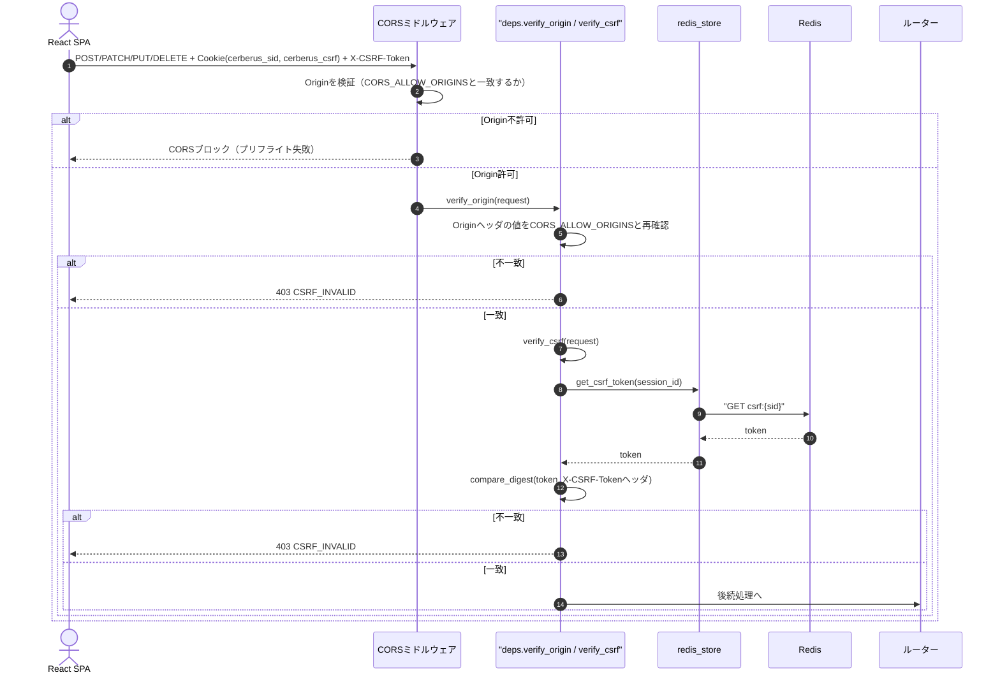
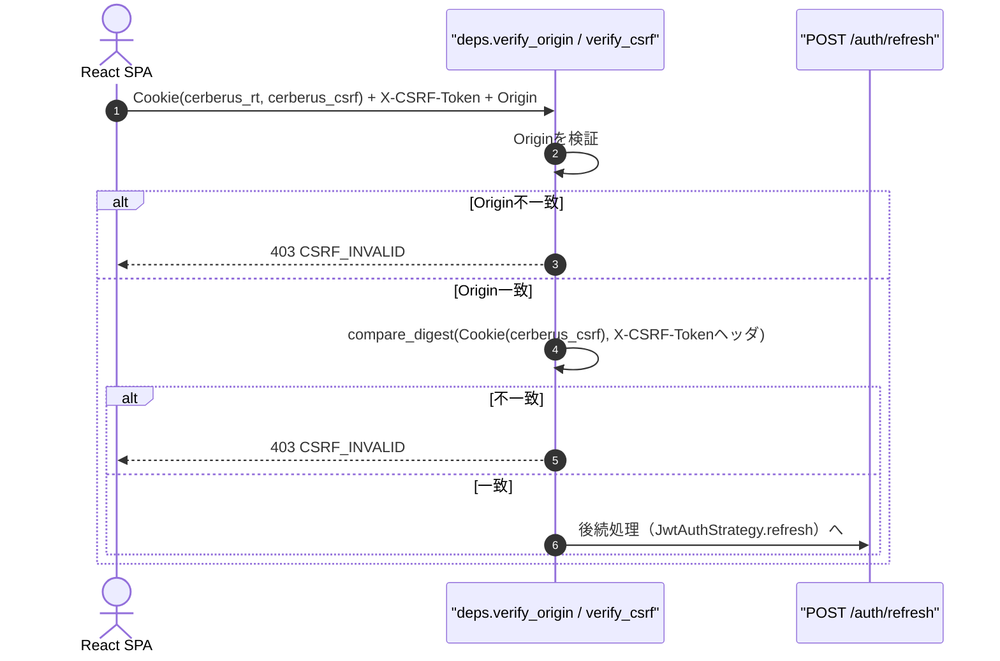
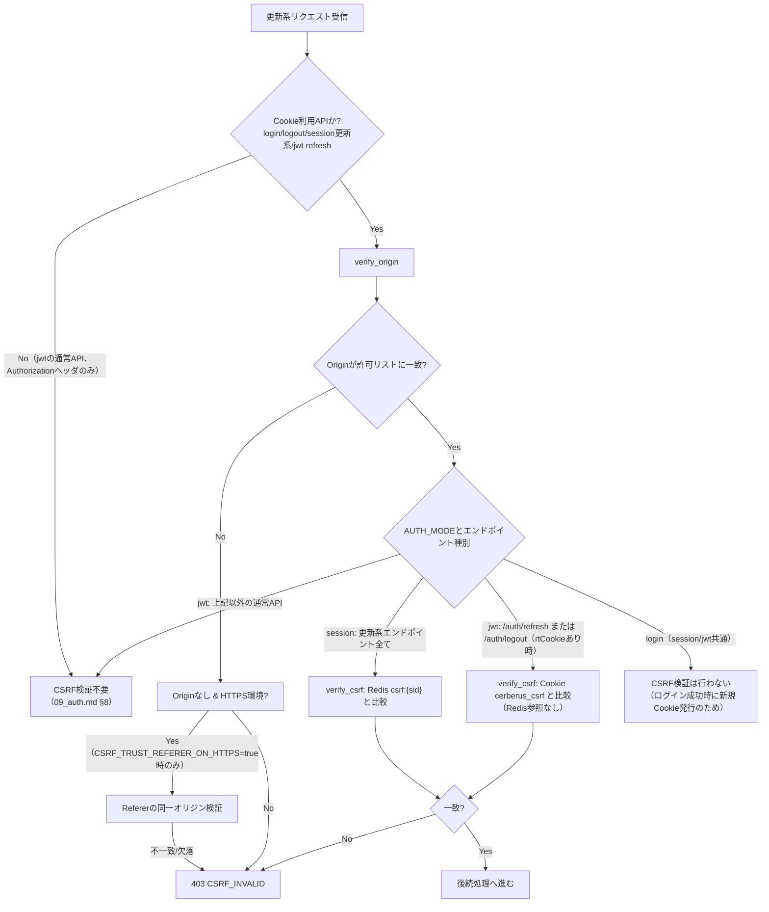
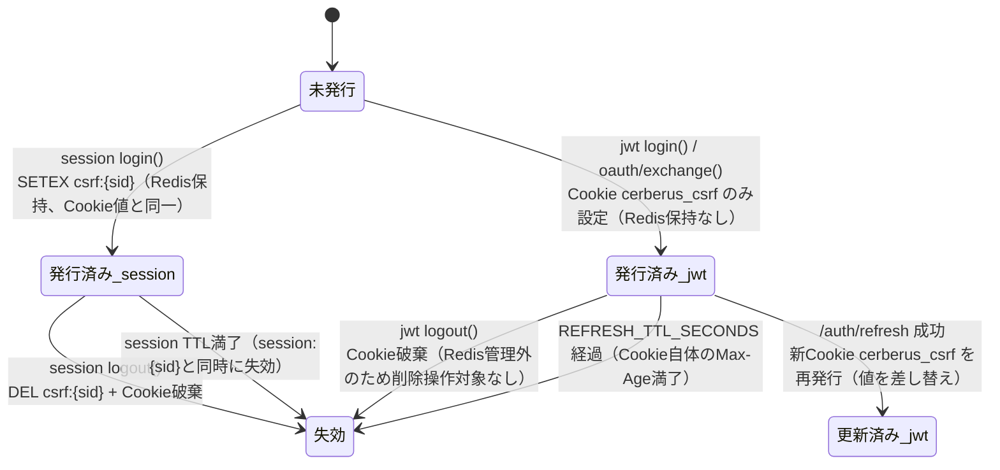
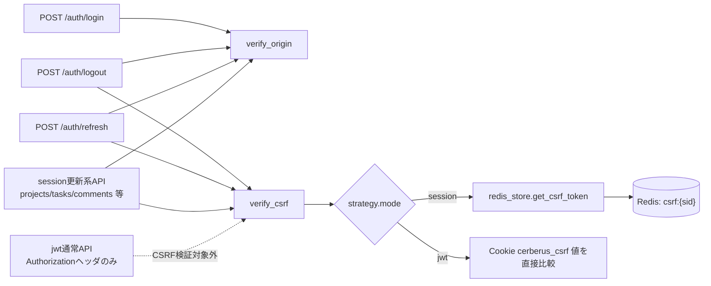

# 03 CSRF対策（Double Submit Cookie + Origin検証）

## 0. 関連ドキュメント

- 基本設計：[`../../basic_design/03_auth.md`](../../basic_design/03_auth.md)（§3.1 Cookie仕様、§4.4 jwtのCSRF、§8 CSRF対策、§9.2 `verify_origin`/`verify_csrf`）
- 基本設計：[`../../basic_design/04_api.md`](../../basic_design/04_api.md)（§1 共通仕様、§4.2 エラーコード一覧）
- 基本設計：[`../../basic_design/02_redis.md`](../../basic_design/02_redis.md)（§2 `csrf:{session_id}`キー）
- 詳細設計：[`./00_strategy_base.md`](./00_strategy_base.md)（DI関数群の一覧）
- 詳細設計：[`./01_session_auth.md`](./01_session_auth.md) / [`./02_jwt_auth.md`](./02_jwt_auth.md)（各モードでの適用箇所）
- 詳細設計：[`../api/auth/02_post_auth_login.md`](../api/auth/02_post_auth_login.md) / [`../api/auth/03_post_auth_logout.md`](../api/auth/03_post_auth_logout.md) / [`../api/auth/06_post_auth_refresh.md`](../api/auth/06_post_auth_refresh.md) / [`../api/projects/02_post_projects.md`](../api/projects/02_post_projects.md)

## 1. 概要

| 項目 | 内容 |
|------|------|
| 対象 | `core/deps.py :: verify_origin` / `verify_csrf`（DI関数）、Cookie発行箇所（`SessionAuthStrategy`・`JwtAuthStrategy`） |
| 責務 | Cookieを自動送信するリクエストに対し、Double Submit Cookie方式のトークン一致検証とOrigin検証を行い、CSRF攻撃を防ぐ |
| 適用条件 | Cookieを発行・利用する更新系（POST/PUT/PATCH/DELETE）エンドポイント全て。適用範囲はモードにより異なる（§6参照） |
| 依存先 | Redis（sessionモードの`csrf:{sid}`）、リクエストの`Origin`/`Referer`ヘッダ |
| 実装ファイル | `api/app/core/deps.py`、`api/app/core/security.py`（`secrets.compare_digest`によるトークン比較） |

## 2. 構成要素

| 要素 | 種別 | 責務 | 備考 |
|------|------|------|------|
| `verify_origin` | DI関数 | `Origin`ヘッダが`CORS_ALLOW_ORIGINS`に含まれるか検証 | Originが無い場合、HTTPS環境に限り`Referer`を代替検証 |
| `verify_csrf` | DI関数 | Cookie値と`X-CSRF-Token`ヘッダの一致を`secrets.compare_digest`で検証 | session：Redis`csrf:{sid}`とヘッダを比較。jwt：Cookie`cerberus_csrf`とヘッダを比較（Redis参照なし） |
| `cerberus_csrf` Cookie | Cookie | Double Submit Cookieのトークン保持 | `HttpOnly=No`（JSが読み取り`X-CSRF-Token`へ転記するため） |
| axiosインターセプタ | フロント実装（参考記載のみ・本設計では規定しない） | `cerberus_csrf`Cookie値を読み取り全更新系リクエストへ`X-CSRF-Token`として自動付与 | [`../../basic_design/05_frontend.md`](../../basic_design/05_frontend.md)側の責務（本ファイルはバックエンド検証のみを規定） |
| `CORS_ALLOW_ORIGINS` | 設定 | 許可Originの一覧 | `allow_credentials=true`との併用時は`*`禁止 |

## 3. 設定項目（環境変数）

| 変数名 | 型 | 既定値 | 用途 | 秘匿 |
|--------|----|--------|------|------|
| `CORS_ALLOW_ORIGINS` | list[str] | なし（必須。例：`http://localhost:5173`） | 許可Originの一覧。CORSミドルウェアと`verify_origin`で共用 | 否 |
| `COOKIE_NAME_CSRF` | str | `cerberus_csrf` | CSRFトークンCookie名（session/jwt共通） | 否 |
| `COOKIE_SAMESITE` | str | `lax` | CSRF Cookie・sessionモードの追加防御 | 否 |
| `COOKIE_SAMESITE_REFRESH` | str | `strict` | jwtモードのrefresh Cookie（追加防御。CSRF検証を代替はしない） | 否 |
| `COOKIE_SECURE` | bool | `true`（本番） | Cookieの`Secure`属性 | 否 |
| `CSRF_TRUST_REFERER_ON_HTTPS` | bool（要検討・仮称） | `false` | `Origin`ヘッダが無い旧式クライアントに限り`Referer`検証へフォールバックするかの切替 | 否（12章参照） |

トークン自体はハッシュ化せず、値の一致比較のみを行う（[`../../basic_design/03_auth.md`](../../basic_design/03_auth.md) §10）。

## 4. 全体の出入力

| 分類 | 項目 | 内容 |
|------|------|------|
| 入力 | `request.headers["Origin"]` / `request.headers["Referer"]` | Origin検証の対象 |
| 入力 | `request.headers["X-CSRF-Token"]` | クライアントが転記したCSRFトークン |
| 入力 | `request.cookies["cerberus_csrf"]` | Cookie側のCSRFトークン |
| 入力（sessionのみ） | Redis `csrf:{session_id}` | Cookie値との照合対象（Redis値を正とする） |
| 出力 | `None`（検証成功時、後続処理へ進む） | 副作用なし |
| 出力（失敗時） | `403 CSRF_INVALID`（Origin不一致・CSRFトークン不一致・欠落のいずれも同一コード。`../../basic_design/04_api.md` §4.2 のエラーコード体系および `03_auth.md` §9.2 に従い、全エンドポイントで403に統一する） | エラーレスポンス |

## 5. シーケンス図

### 5.1 session方式：更新系リクエストのCSRF検証

### 5.2 jwt方式：`/auth/refresh` のCSRF検証（Redis非参照）

## 6. 処理フロー・分岐

**fail-close方針**：Origin・CSRFいずれかの検証に失敗した場合は例外なく処理を中断し、後続のビジネスロジックへ到達させない。判定不能（Redis接続不能でsessionのCSRF値が取得できない等）な場合も許可側へフォールバックせず`503 SERVICE_UNAVAILABLE`とする。

## 7. データ遷移図

CSRFトークン自体のライフサイクルは以下の通り。Redisキーとしての遷移は[`./01_session_auth.md`](./01_session_auth.md) §7の`csrf:{sid}`部分と同一のため、ここではCookie発行元別の要点のみ示す。

## 8. 関数・処理詳細

### 8.1 `core/deps.py :: verify_origin`

| 項目 | 内容 |
|------|------|
| シグネチャ / 定義 | `async def verify_origin(request: Request) -> None` |
| 引数 / 入力 | `request.headers.get("origin")`、`request.headers.get("referer")`、`settings.cors_allow_origins` |
| 戻り値 / 出力 | `None`（検証通過時） |
| 送出例外 / 失敗条件 | `Origin`が存在し許可リストに無い場合、または`Origin`が無く`Referer`も同一オリジンでない場合に`CsrfInvalidError`（403 `CSRF_INVALID`。エンドポイントによる差異はない） |
| 処理内容 | 1. `Origin`ヘッダを取得 2. 存在すれば`cors_allow_origins`との完全一致を確認 3. 存在しない場合、HTTPS環境かつ`CSRF_TRUST_REFERER_ON_HTTPS=true`のときに限り`Referer`のオリジン部分を同様に検証 4. いずれも満たさなければ例外を送出 |
| 副作用 | なし |

### 8.2 `core/deps.py :: verify_csrf`

| 項目 | 内容 |
|------|------|
| シグネチャ / 定義 | `async def verify_csrf(request: Request, strategy: AuthStrategy = Depends(get_auth_strategy)) -> None` |
| 引数 / 入力 | `request.cookies.get(COOKIE_NAME_CSRF)`、`request.headers.get("X-CSRF-Token")`、（sessionモードのみ）`session_id` |
| 戻り値 / 出力 | `None` |
| 送出例外 / 失敗条件 | Cookie・ヘッダのいずれかが欠落、または値が不一致の場合`CsrfInvalidError`（403 `CSRF_INVALID`） |
| 処理内容 | 1. `AUTH_MODE`分岐（`strategy.mode`で判定） 2. sessionモード：`redis_store.get_csrf_token(session_id)`をRedisから取得し正とする 3. jwtモード：Cookie値そのものを正とする（Redis参照なし） 4. いずれも`X-CSRF-Token`ヘッダと`secrets.compare_digest`で比較 5. 不一致・いずれかが空文字/欠落なら例外送出 |
| 副作用 | sessionモードのみRedis参照（読み取りのみ、書き込みなし） |

### 8.3 `core/deps.py :: require_csrf_protected`（更新系ルーターへの適用単位、参考実装名）

| 項目 | 内容 |
|------|------|
| シグネチャ / 定義 | ルーター側で`dependencies=[Depends(verify_origin), Depends(verify_csrf)]`として宣言する組み合わせ。単一のラッパー関数を設けるかは実装判断（不明点として12章に記載） |
| 引数 / 入力 | - |
| 戻り値 / 出力 | - |
| 送出例外 / 失敗条件 | 上記2関数の送出条件を継承 |
| 処理内容 | ルーター定義時に「Cookie発行/利用APIか」を判定し、該当するエンドポイントにのみ依存関係として付与する（§6のflowchart参照） |
| 副作用 | なし |

## 9. 関数・要素相関図

## 10. セキュリティ・非機能考慮

| 観点 | 方針 | 根拠 |
|------|------|------|
| Double Submit Cookie | Cookie値とヘッダ値の一致を要求することで、攻撃者が任意サイトから被害者ブラウザ経由でリクエストを送っても、Cookieの値をJSで読み取れない（クロスオリジンのため）限りヘッダを偽造できない | CSRFの基本対策原理 |
| Origin検証の必須化 | `SameSite`属性だけに依存せず、`Origin`ヘッダを必須検証する | 古いブラウザ・拡張機能・プロキシ環境で`SameSite`が無視される可能性への多層防御 |
| `SameSite`属性との関係 | `SameSite=Lax`（通常Cookie）・`Strict`（jwtのrefresh Cookie）は**追加防御**であり、CSRF対策の主体はDouble Submit Cookie + Origin検証である。`SameSite`のみに依存しない設計とする | ブラウザ実装差異・トップレベルナビゲーションでの`Lax`の抜け穴を考慮 |
| session/jwtでの適用差 | session：全更新系APIが対象（Cookieが常時自動送信されるため）。jwt：通常APIは`Authorization`ヘッダ方式のため対象外、Cookieを使う`/auth/refresh`・`/auth/logout`のみ対象 | ブラウザが自動送信するのはCookieのみであり、`Authorization`ヘッダは開発者が明示的に付与しない限り送信されないため |
| `compare_digest`の使用 | 文字列の`==`比較ではなく`secrets.compare_digest`でタイミング攻撃を防ぐ | [`../../basic_design/03_auth.md`](../../basic_design/03_auth.md) §10 |
| CORSとの併用禁止事項 | `allow_credentials=true`のとき`allow_origins=["*"]`を禁止し、`CORS_ALLOW_ORIGINS`の明示的リストのみを許可する | ブラウザ仕様上`*`と資格情報付きリクエストの併用は認証情報漏洩に直結するため |
| ログイン時のCSRF検証除外 | ログイン成功前はCSRF Cookieが未発行のため`verify_csrf`は適用せず、`verify_origin`のみを適用する | ログインは新規Cookie発行APIであり、既存トークンとの照合対象が存在しないため |

## 11. テスト設計

| No | 区分 | ケース | 前提 | 期待結果 | テスト名案 |
|----|------|--------|------|----------|-----------|
| 1 | 単体 | `verify_origin`が許可Originで通過する | `Origin: http://localhost:5173`が`CORS_ALLOW_ORIGINS`に含まれる | 例外なし | `test_verify_origin_allowed` |
| 2 | 単体 | `verify_origin`が不許可Originで例外を送出する | `Origin: http://evil.example`| `CsrfInvalidError`送出 | `test_verify_origin_rejected` |
| 3 | 単体 | `verify_origin`がOrigin欠落かつ`CSRF_TRUST_REFERER_ON_HTTPS=false`で例外を送出する | Originヘッダなし | `CsrfInvalidError`送出 | `test_verify_origin_missing_rejected_by_default` |
| 4 | 単体 | `verify_csrf`（session）がCookie・ヘッダ・Redis値すべて一致で通過する | `fakeredis`に`csrf:{sid}`設定済み | 例外なし | `test_verify_csrf_session_match` |
| 5 | 単体 | `verify_csrf`（session）がヘッダ欠落で403となる | `X-CSRF-Token`ヘッダ無し | `CsrfInvalidError`（403 CSRF_INVALID） | `test_verify_csrf_session_missing_header` |
| 6 | 単体 | `verify_csrf`（session）がCookie値とRedis値の不一致で403となる | Redis値を意図的に変更 | `CsrfInvalidError` | `test_verify_csrf_session_redis_mismatch` |
| 7 | 単体 | `verify_csrf`（jwt）がCookie値とヘッダ値の一致のみで通過する（Redis未参照） | `fakeredis`をモックし呼び出されないことを確認 | 例外なし、Redis呼び出し0回 | `test_verify_csrf_jwt_no_redis_access` |
| 8 | 結合 | sessionモードで`X-CSRF-Token`欠落時に更新系APIが403となる | `POST /projects`をヘッダ無しで実行 | `403 CSRF_INVALID` | `test_create_project_missing_csrf_session_mode` |
| 9 | 結合 | jwtモードの通常更新系APIは`X-CSRF-Token`が無くても成功する | `Authorization`ヘッダのみで`POST /projects` | `201`（CSRF検証をスキップ） | `test_create_project_no_csrf_required_jwt_mode` |
| 10 | 結合 | jwtモードの`/auth/refresh`はCSRFヘッダ欠落で403となる | Cookieのみ、ヘッダ無し | `403 CSRF_INVALID`（[`./02_jwt_auth.md`](./02_jwt_auth.md) No.13と共通） | `test_jwt_refresh_requires_csrf_header` |
| 11 | 結合 | ログインAPIはCSRF検証をスキップしOrigin検証のみ行う | 新規Cookie未発行状態でログイン | `204`成功（CSRF検証は呼ばれない） | `test_login_skips_csrf_check` |
| 網羅できない範囲 | 実ブラウザの`SameSite`挙動差異（拡張機能・古いWebView等） | 自動テストはFastAPI TestClient/httpxでのヘッダ・Cookie模擬に限られ、実ブラウザ環境固有の挙動は対象外とし手動確認とする | - | - |

## 12. 比較表：session vs jwt でのCSRF対策の要否（要件書§3.1対応）

| 観点 | session方式 | jwt方式 |
|------|-------------|---------|
| 認証情報の送信方式 | Cookie（ブラウザが自動送信） | `Authorization: Bearer`ヘッダ（明示的にJSが付与） |
| CSRF対策の要否（通常API） | **必須**。ブラウザが`cerberus_sid`を自動送信するため、悪意あるサイトからの偽装リクエストが認証済み扱いになり得る | **不要**。ヘッダはブラウザが自動付与しないため、クロスオリジンの偽装フォーム/画像リクエストではAuthorizationヘッダを再現できない |
| CSRF対策の要否（Cookie利用箇所） | 全更新系APIが対象 | `/auth/refresh`（refresh Cookie自動送信）・`/auth/logout`（refresh Cookieがある場合）のみ対象 |
| 検証の主体 | Double Submit Cookie（Redis上の`csrf:{sid}`が正） | Double Submit Cookie（Cookie値そのものが正、Redis参照なし） |
| `SameSite`との関係 | `Lax`は追加防御。主対策はCSRFトークン照合 | refresh Cookieは`Strict`でさらに厳格化、CSRFトークン照合と二重で防御 |

## 13. 不明点・要検討事項

| 区分 | 内容 | 影響 |
|------|------|------|
| 要検討 | `Origin`ヘッダが存在しない場合の`Referer`フォールバック可否（`CSRF_TRUST_REFERER_ON_HTTPS`相当の設定）は基本設計に明記が無く、本ファイルで既定`false`（フォールバックしない＝より厳格側）として仮置きした。学習用途としてはOriginを必須とする方が単純で説明しやすいため、有効化する場合は要合意 | 中。旧式クライアント・一部プロキシ経由アクセスを拒否する可能性がある |
| 解消済 | Origin不一致時のHTTPステータスは、基本設計（[../../basic_design/04_api.md](../../basic_design/04_api.md) §4.2 のエラーコード一覧、[../../basic_design/03_auth.md](../../basic_design/03_auth.md) §9.2）に従い **全エンドポイントで `403 CSRF_INVALID`** に統一済み。関連する各APIの詳細設計も修正済み | なし（統一により、フロントのエラーハンドリングは403の単一分岐でよい） |
| 不明 | `verify_origin`/`verify_csrf`を単一の依存関数（例：`require_csrf_protected`）にまとめるか、ルーターごとに2つ列挙するかは基本設計・実装ファイル一覧に明記が無い | 低。実装方針の違いのみで機能上の差はない |
