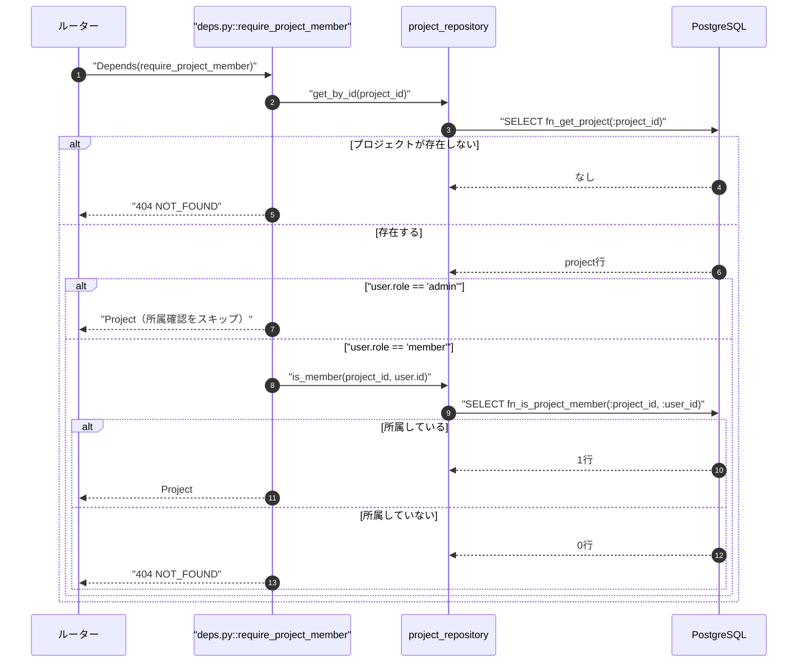
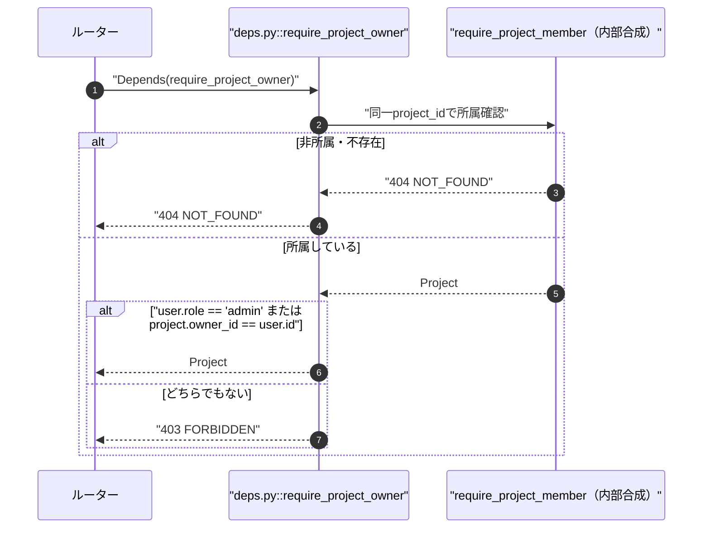
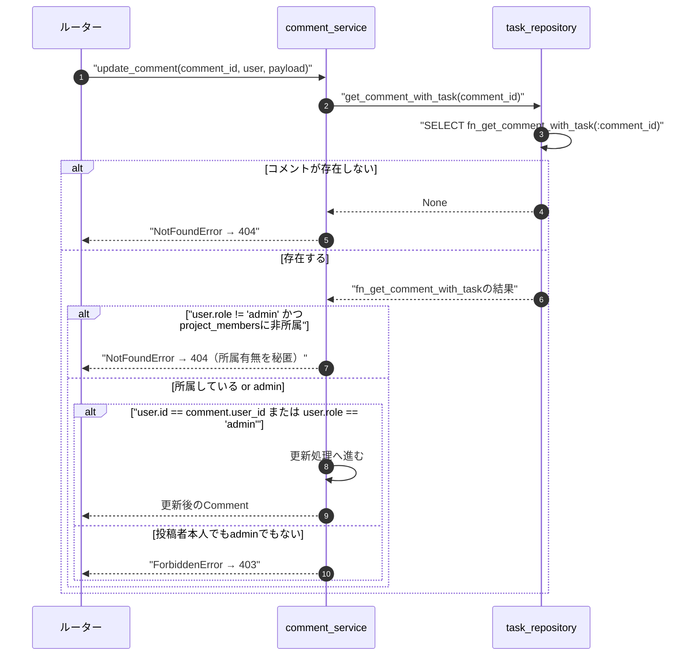
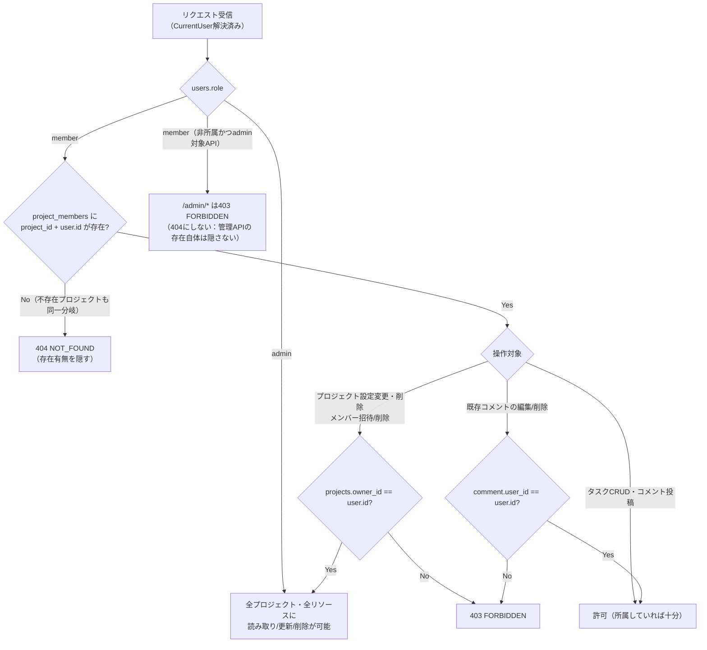
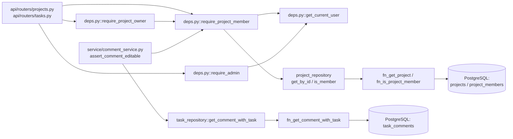

# 05 ロール・認可（RBAC）

## 0. 関連ドキュメント

- 基本設計：[../../basic_design/03_auth.md](../../basic_design/03_auth.md)（§9 認可（RBAC））
- 基本設計：[../../basic_design/04_api.md](../../basic_design/04_api.md)（§5 認可マトリクス）
- 基本設計：[../../basic_design/01_database.md](../../basic_design/01_database.md)（`users.role` / `projects.owner_id` / `project_members`）
- 詳細設計：[./00_strategy_base.md](./00_strategy_base.md)（`get_current_user` 系DIの土台）
- 詳細設計：[../database/01_table_users.md](../database/01_table_users.md)、[../database/04_table_projects.md](../database/04_table_projects.md)、[../database/05_table_project_members.md](../database/05_table_project_members.md)
- 詳細設計：[../api/projects/05_delete_project.md](../api/projects/05_delete_project.md)、[../api/projects/07_post_project_members.md](../api/projects/07_post_project_members.md)、[../api/projects/09_delete_project_member.md](../api/projects/09_delete_project_member.md)、[../api/tasks/08_patch_comment.md](../api/tasks/08_patch_comment.md)

## 1. 概要

| 項目 | 内容 |
|------|------|
| 対象 | `core/deps.py`（`require_admin` / `require_project_member` / `require_project_owner`）、`service/*` 内の投稿者判定ロジック |
| 責務 | `users.role`（`member`/`admin`）、プロジェクト所属（`project_members`）、プロジェクトオーナー（`projects.owner_id`）、コメント投稿者（`task_comments.user_id`）を、DBの事実判定とAPIのHTTP変換に分離して実装する |
| 適用条件 | `get_current_user`（[./00_strategy_base.md](./00_strategy_base.md)）で解決済みの `CurrentUser` が存在するリクエストすべて |
| 依存先 | PostgreSQL（`users` / `projects` / `project_members` / `task_comments`）。Redis・トークンには依存しない（認可はDBの現在値のみを見る） |
| 実装ファイル | `api/app/core/deps.py`、`api/app/repository/`（SP/FN薄いラッパー）、`api/app/service/`（取得済みデータ同士の比較・HTTP変換） |

## 2. 構成要素

| 要素 | 種別 | 責務 | 備考 |
|------|------|------|------|
| `require_admin` | DI関数 | `role == 'admin'` を強制 | [./00_strategy_base.md](./00_strategy_base.md) §8.7 で定義済み。本書では認可マトリクスとの対応のみ扱う |
| `require_project_member` | DI関数 | `fn_get_project` と `fn_is_project_member` の戻り値を受け、非所属・不存在を404へ変換 | 所属可否の事実判定はDB側 |
| `require_project_owner` | DI関数 | `fn_get_project` の `owner_id` と取得済み `CurrentUser.id` を比較し、非オーナーを403へ変換 | admin bypassは取得済みroleとの比較 |
| `project_repository.is_member` | リポジトリ関数 | `SELECT fn_is_project_member(:project_id, :user_id)` の結果を返す | 業務SQLを持たない |
| `project_repository.get_by_id` | リポジトリ関数 | `SELECT fn_get_project(:project_id)` の結果を返す | 存在しなければ `None` |
| コメント投稿者判定 | サービス内関数（DIではなく通常関数） | `user.id == comment.user_id or user.role == 'admin'` を判定 | `project_members` 経由の404判定の後段でのみ実行（§6参照） |

## 3. 設定項目（環境変数）

本ファイルが扱う機能に専用の環境変数は存在しない。ロール種別（`member`/`admin`）は `users.role` のCHECK制約（[../database/01_table_users.md](../database/01_table_users.md)）としてDBに固定され、設定ファイルやハードコードされた文字列リテラルとしてロール名を複製しない（`core/constants.py` 等に定数として1箇所のみ定義することを推奨）。

| 変数名 | 型 | 既定値 | 用途 | 秘匿 |
|--------|----|--------|------|------|
| なし | - | - | - | - |

## 4. 全体の出入力

| 分類 | 項目 | 内容 |
|------|------|------|
| 入力 | `CurrentUser`（`get_current_user` の戻り値） | `id` / `role` / `is_active` |
| 入力 | パスパラメータ `project_id` / `comment_id` / `task_id` 等 | ルーターからDIへ渡される |
| 入力 | `AsyncSession`（`get_db`） | repository経由の `fn_get_project` / `fn_is_project_member` / `fn_get_comment_with_task` 呼び出し |
| 出力 | `Project`（`require_project_member` / `require_project_owner`） | 後続のルーター・サービスが再利用する、認可確認済みのORMオブジェクト |
| 出力 | HTTP 403 `FORBIDDEN` | ロール・オーナー・投稿者いずれの条件も満たさない場合 |
| 出力 | HTTP 404 `NOT_FOUND` | プロジェクト非所属・プロジェクト不存在・非所属コメント |

## 5. シーケンス図

### 5.1 `require_project_member`（正常系・admin bypass・非所属）

### 5.2 `require_project_owner`（所属はしているがオーナーでない場合）

### 5.3 コメント編集時の3段階判定（存在→所属→投稿者）

詳細は[../api/tasks/08_patch_comment.md](../api/tasks/08_patch_comment.md) §4を正とし、本図は判定順序の要点のみを示す。

## 6. 処理フロー・分岐

**404と403の使い分けの原則**：「プロジェクトに所属しているかどうか」を境界として、所属していない相手には常に404を返し「存在するかどうか」自体を秘匿する。所属が確認できた後の権限不足（非オーナー・非投稿者）は403で明示する。`/admin/*` はプロジェクト単位のリソースではなく管理者専用の別名前空間であるため、非adminには一律403とし404では隠さない（[基本設計§9.2](../../basic_design/03_auth.md)）。

## 7. データ遷移図

なし（RBACはリクエストごとにDBの現在値を参照する判定ロジックであり、状態遷移を持たない。ロール変更自体の遷移は[../database/01_table_users.md](../database/01_table_users.md) §7を参照）。

## 8. 関数・処理詳細

### 8.1 `core/deps.py :: require_project_member`

| 項目 | 内容 |
|------|------|
| シグネチャ / 定義 | `async def require_project_member(project_id: UUID, user: CurrentUser = Depends(get_current_user), db: AsyncSession = Depends(get_db)) -> Project` |
| 引数 / 入力 | `project_id`：パスパラメータ。`user`：認証済みユーザー。`db`：DBセッション |
| 戻り値 / 出力 | `Project`（ORMインスタンス） |
| 送出例外 / 失敗条件 | `NotFoundError`（→404）：`project_id` が存在しない、または `user.role == 'member'` かつ `project_members` に不在 |
| 処理内容 | 1. `project_repository.get_by_id` が `SELECT fn_get_project(:project_id)` を呼ぶ 2. 空集合なら404 3. `project_repository.is_member` が `SELECT fn_is_project_member(:project_id, :user_id)` を呼ぶ 4. `False`なら404、`True`ならProjectを返す。admin bypassはFNの戻り値に含める |
| 副作用 | なし（FN呼び出しのみ） |

### 8.2 `core/deps.py :: require_project_owner`

| 項目 | 内容 |
|------|------|
| シグネチャ / 定義 | `async def require_project_owner(project: Project = Depends(require_project_member), user: CurrentUser = Depends(get_current_user)) -> Project` |
| 引数 / 入力 | `project`：`require_project_member` が解決済みのオブジェクト（DIチェーンにより所属確認は完了済み） |
| 戻り値 / 出力 | `Project` |
| 送出例外 / 失敗条件 | `ForbiddenError`（→403）：`user.role != 'admin'` かつ `project.owner_id != user.id` |
| 処理内容 | 1. `require_project_member` の結果を受け取る（この時点で非所属・不存在は404済み） 2. `user.role == 'admin'` または `project.owner_id == user.id` を確認 3. いずれも満たさなければ `ForbiddenError` |
| 副作用 | なし |

### 8.3 `repository/project_repository.py :: is_member`

| 項目 | 内容 |
|------|------|
| シグネチャ / 定義 | `async def is_member(db: AsyncSession, project_id: UUID, user_id: UUID) -> bool` |
| 引数 / 入力 | `project_id` / `user_id` |
| 戻り値 / 出力 | `bool` |
| 送出例外 / 失敗条件 | なし |
| 処理内容 | `SELECT fn_is_project_member(:project_id, :user_id)` を実行し、FNのbooleanを返す。repositoryに所属判定SQLを持たせない |
| 副作用 | なし |

### 8.4 `service/comment_service.py :: assert_comment_editable`（投稿者判定・イメージ）

| 項目 | 内容 |
|------|------|
| シグネチャ / 定義 | `def assert_comment_editable(comment: TaskComment, user: CurrentUser) -> None` |
| 引数 / 入力 | `comment`（`task`をselectinload済み）、`user` |
| 戻り値 / 出力 | `None`（例外を送出しなければ許可） |
| 送出例外 / 失敗条件 | `ForbiddenError`（→403）：`user.id != comment.user_id` かつ `user.role != 'admin'` |
| 処理内容 | 1. `user.id == comment.user_id or user.role == 'admin'` を判定 2. `False` なら `ForbiddenError` |
| 副作用 | なし |
| 備考 | この関数は `require_project_member` 相当の所属確認（404判定）を**内包しない**。呼び出し元のサービス関数が先に所属確認を行い、通過後にのみ本関数を呼ぶこと（[../api/tasks/08_patch_comment.md](../api/tasks/08_patch_comment.md) §8参照） |

## 9. 関数・要素相関図

## 10. セキュリティ・非機能考慮

| 観点 | 方針 | 根拠 |
|------|------|------|
| 情報漏洩防止（存在有無の秘匿） | 非所属メンバーには一貫して404を返し、プロジェクト・タスク・コメントの存在有無を推測させない | [基本設計§9.2](../../basic_design/03_auth.md) |
| 権限不足の明示 | 所属が確認できた後の権限不足（非オーナー・非投稿者）は403とし、404で隠す対象を「所属可否」に限定する | 同上・利用者へのフィードバック可読性 |
| admin判定 | `fn_is_project_member` が有効adminを含めて事実判定する。API層は戻り値を404/403へ変換し、同じSQL条件を複製しない | DB責務の一元化 |
| DBの現在値を正とする | `CurrentUser.role` は `get_current_user`（[./00_strategy_base.md](./00_strategy_base.md)）内で毎リクエストDBから再取得済みであり、本書のDI関数はそれをそのまま用いる。RBAC層独自のキャッシュは持たない | ロール変更・所属変更を即時反映するため |
| `/admin/*` の扱い | プロジェクト単位のリソースとは異なる名前空間として扱い、非adminには404ではなく一律403を返す | 認可マトリクス（[../../basic_design/04_api.md](../../basic_design/04_api.md) §5）との整合 |
| ログ出力 | 403/404いずれも発生時にアプリログへ `user_id` / `project_id` / 判定結果を記録し、レスポンスボディには含めない | 運用調査と情報漏洩防止の両立 |

## 11. テスト設計

| No | 区分 | ケース | 前提 | 期待結果 | テスト名案 |
|----|------|--------|------|----------|-----------|
| 1 | 結合 | `fn_is_project_member` がadminを所属扱いにする | `role='admin'`、非所属プロジェクト | `true` → APIはProjectを返す | `test_fn_is_project_member_admin_bypass` |
| 2 | 結合 | `fn_is_project_member` が所属memberを許可する | `role='member'`、`project_members`に登録済み | `true` → Projectを返す | `test_fn_is_project_member_member_ok` |
| 3 | 結合 | `fn_is_project_member` が非所属memberを拒否する | `role='member'`、`project_members`に未登録 | `false` → `404 NOT_FOUND` | `test_fn_is_project_member_non_member_404` |
| 4 | 結合 | `fn_get_project` が不存在を空集合で返す | 存在しないUUID | 空集合 → `404 NOT_FOUND` | `test_fn_get_project_missing_404` |
| 5 | 単体 | `require_project_owner` がオーナーで通過 | `owner_id == user.id` | Projectを返す | `test_require_project_owner_owner_ok` |
| 6 | 単体 | `require_project_owner` が所属member（非オーナー）で403 | `owner_id != user.id`、所属済み | `ForbiddenError` | `test_require_project_owner_non_owner_403` |
| 7 | 単体 | `require_project_owner` がadminで403にならず通過 | `role='admin'`、非オーナー・非所属 | Projectを返す | `test_require_project_owner_admin_bypass` |
| 8 | 単体 | `assert_comment_editable` が投稿者本人で許可 | `user.id == comment.user_id` | 例外なし | `test_assert_comment_editable_author_ok` |
| 9 | 単体 | `assert_comment_editable` がadminで許可 | `role='admin'`、非投稿者 | 例外なし | `test_assert_comment_editable_admin_ok` |
| 10 | 単体 | `assert_comment_editable` が非投稿者・非adminで403 | `role='member'`、非投稿者 | `ForbiddenError` | `test_assert_comment_editable_forbidden` |
| 11 | 結合 | ロール変更直後にadmin判定が即時反映される | member→adminへSP更新後、既存セッション/トークンのままFN実行 | `fn_is_project_member=true` | `test_role_change_reflected_in_rbac`（[./00_strategy_base.md](./00_strategy_base.md) テスト6と対）|
| 12 | 網羅できない範囲 | 大量プロジェクト・大量メンバーでの`is_member`のクエリ性能 | - | 自動テスト対象外（[../database/05_table_project_members.md](../database/05_table_project_members.md)のインデックス設計で担保） | - |

## 12. 不明点・要検討事項

| 区分 | 内容 | 影響 |
|------|------|------|
| 要検討 | `require_project_owner` を通過するadminが、実際には非所属プロジェクトへメンバー招待（`POST /projects/{id}/members`）を行った場合の監査ログ要否が基本設計に明記がない。現状は`login_history`相当の操作ログは無く、admin操作の追跡はDBの`updated_at`のみに依存する | 低〜中。将来の監査要件次第でadmin操作ログテーブルの追加が必要になり得る |
| 不明 | コメント削除（`DELETE /comments/{id}`）の403/404判定が`08_patch_comment.md`と同一パターンを踏襲する前提としたが、削除APIの詳細設計（`api/tasks/09_delete_comment.md`）における明記の有無は担当外のため本書では参照のみとした | 低。担当ファイル外のため実装時に整合確認が必要 |
