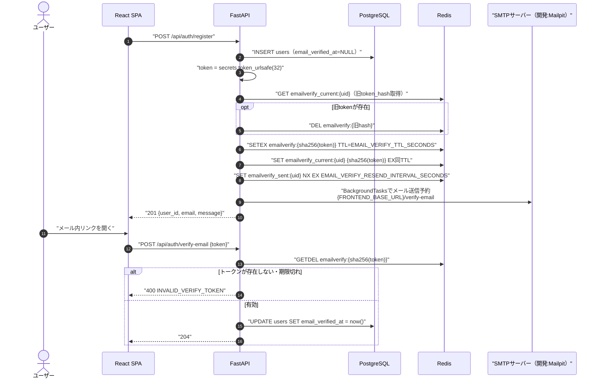
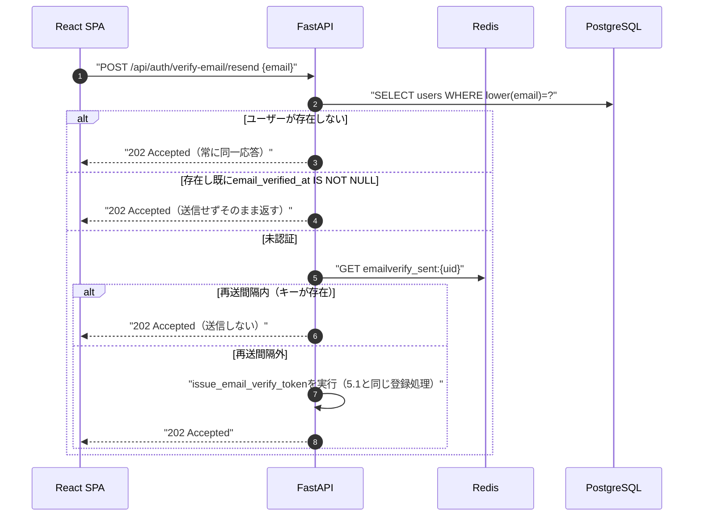
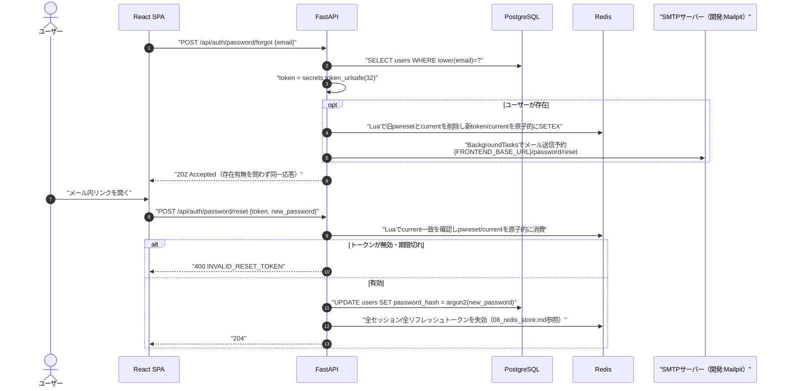
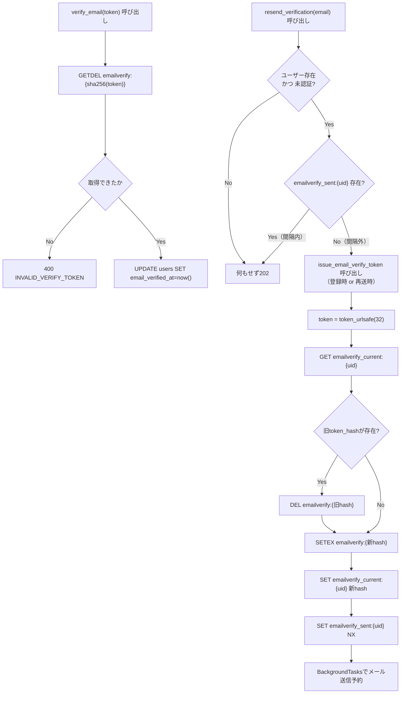
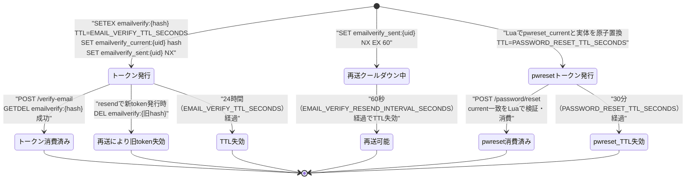
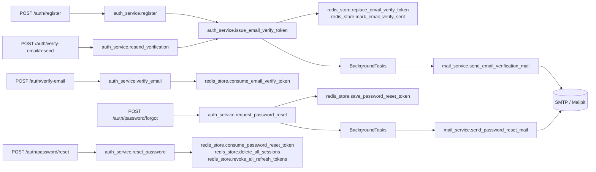

# 06 メール認証・パスワードリセットのトークン設計とメール送信

## 0. 関連ドキュメント

- 基本設計：[../../basic_design/03_auth.md](../../basic_design/03_auth.md)（§6 会員登録とメール認証、§7 パスワードリセット、§10 パスワード・トークンのハッシュ）
- 基本設計：[../../basic_design/02_redis.md](../../basic_design/02_redis.md)（§2 キー一覧の `emailverify:*` / `emailverify_current:*` / `emailverify_sent:*` / `pwreset:*`）
- 詳細設計：[./08_redis_store.md](./08_redis_store.md)（トークン操作関数の実装詳細）、[./00_strategy_base.md](./00_strategy_base.md)
- 詳細設計：[../api/auth/07_post_auth_verify_email.md](../api/auth/07_post_auth_verify_email.md)、[../api/auth/08_post_auth_verify_email_resend.md](../api/auth/08_post_auth_verify_email_resend.md)、[../api/auth/09_post_auth_password_forgot.md](../api/auth/09_post_auth_password_forgot.md)、[../api/auth/10_post_auth_password_reset.md](../api/auth/10_post_auth_password_reset.md)、[../api/auth/01_post_auth_register.md](../api/auth/01_post_auth_register.md)
- 詳細設計：[../database/01_table_users.md](../database/01_table_users.md)（`email_verified_at`）、[../infra/04_env_config.md](../infra/04_env_config.md)（環境変数一覧）

## 1. 概要

| 項目 | 内容 |
|------|------|
| 対象 | `service/auth_service.py`（トークン発行・消費のオーケストレーション）、`service/mail_service.py`（SMTP送信）、`api/app/templates/mail/*`（本文テンプレート） |
| 責務 | メール認証トークン・パスワードリセットトークンのワンタイム生成・ハッシュ化・消費、メール本文の組み立てとBackgroundTasksによる非同期送信、再送レート制限 |
| 適用条件 | `AUTH_MODE` に依存しない（session/jwt共通）。Google OAuth新規登録は本フローを経由しない（[../../basic_design/03_auth.md](../../basic_design/03_auth.md) §5.3・§6） |
| 依存先 | Redis（`emailverify:*` / `pwreset:*` 系キー）、PostgreSQL（`users.email_verified_at` / `users.password_hash`）、SMTPサーバー（開発：Mailpit、本番：外部SMTP） |
| 実装ファイル | `api/app/service/auth_service.py`、`api/app/service/mail_service.py`、`api/app/repository/redis_store.py`、`api/app/templates/mail/password_reset.{html,txt}`、`api/app/templates/mail/email_verification.{html,txt}` |

## 2. 構成要素

| 要素 | 種別 | 責務 | 備考 |
|------|------|------|------|
| `issue_email_verify_token` | 関数（`auth_service`） | 新token生成・旧token失効・Redis登録・送信予約 | 登録時・再送時の両方から呼ばれる共通関数 |
| `verify_email` | 関数（`auth_service`） | トークン消費・`email_verified_at`更新 | ワンタイム消費（`GETDEL`） |
| `resend_verification` | 関数（`auth_service`） | 再送レート制限確認 → `issue_email_verify_token`呼び出し | ユーザー不存在・認証済みでも例外を出さない |
| `request_password_reset` | 関数（`auth_service`） | token生成・Redis登録・送信予約 | ユーザー不存在でも例外を出さず202を維持 |
| `reset_password` | 関数（`auth_service`） | トークン消費・Redis全失効・パスワード更新 | Redis失効成功後にDB更新 |
| `send_email_verification_mail` | 関数（`mail_service`） | テンプレートレンダリング＋SMTP送信 | `{FRONTEND_BASE_URL}/verify-email#token=...` |
| `send_password_reset_mail` | 関数（`mail_service`） | 同上 | `{FRONTEND_BASE_URL}/password/reset#token=...` |
| `BackgroundTasks` | FastAPI標準機能 | レスポンス返却後にSMTP送信を非同期実行 | 送信失敗はログのみ、APIレスポンスへは影響させない |
| `jinja2` テンプレート | ファイル | メール本文（HTML/テキスト） | URLはfragment（`#token=`）で埋め込む |

## 3. 設定項目（環境変数）

`../infra/04_env_config.md` §3.8「メール（SMTP/Mailpit）」を正とし、本書ではトークン・メール送信に関わる項目のみ再掲する。

| 変数名 | 型 | 既定値 | 用途 | 秘匿 |
|--------|----|--------|------|------|
| `EMAIL_VERIFY_TTL_SECONDS` | int | `86400` | `emailverify:{hash}` / `emailverify_current:{uid}` のTTL | `.env` |
| `EMAIL_VERIFY_RESEND_INTERVAL_SECONDS` | int | `60` | `emailverify_sent:{uid}` のTTL＝再送最小間隔 | `.env` |
| `PASSWORD_RESET_TTL_SECONDS` | int | `1800` | `pwreset:{hash}` / `pwreset_current:{uid}` のTTL | `.env` |
| `SMTP_HOST` / `SMTP_PORT` | str / int | `mailpit` / `1025` | 開発：Mailpit接続先。本番は外部SMTP値で上書き | `.env` |
| `SMTP_USER` / `SMTP_PASSWORD` | str | 空文字 | 本番外部SMTP利用時のみ設定 | **Secret**（値がある場合） |
| `SMTP_USE_TLS` | bool | `false` | SMTP接続のTLS有効化 | `.env` |
| `MAIL_FROM` | str | `no-reply@cerberus.local` | 送信元アドレス | `.env` |
| `FRONTEND_BASE_URL` | str | `http://localhost:5173` | メール本文内リンクの基点 | `.env` |

トークン長・ハッシュアルゴリズムは値としては固定（`token_urlsafe(32)` / SHA-256）だが、桁数を将来変更する余地を残すため `core/config.py` にリテラル32等を直接埋め込まず、`TOKEN_URLSAFE_BYTES`のような定数をモジュール内の1箇所にまとめることを推奨する（環境変数化までは基本設計上不要と判断。§12参照）。

## 4. 全体の出入力

| 分類 | 項目 | 内容 |
|------|------|------|
| 入力 | `POST /auth/register` の`email` | `issue_email_verify_token`のトリガー |
| 入力 | `POST /auth/verify-email` の`token` | `verify_email`が`GETDEL emailverify:{sha256(token)}`で消費 |
| 入力 | `POST /auth/verify-email/resend` の`email` | `resend_verification`のトリガー |
| 入力 | `POST /auth/password/forgot` の`email` | `request_password_reset`のトリガー |
| 入力 | `POST /auth/password/reset` の`token`/`new_password` | `reset_password`がcurrent一致を確認して原子的に消費 |
| 出力 | Redis `emailverify:{hash}` / `emailverify_current:{uid}` / `emailverify_sent:{uid}` | §7参照 |
| 出力 | Redis `pwreset:{hash}` | ワンタイムトークン |
| 出力 | SMTP送信（`BackgroundTasks`経由） | 認証メール／リセットメール |
| 出力 | PostgreSQL `users.email_verified_at` / `users.password_hash` の更新 | 消費成功時のみ |
| 出力 | HTTP 202/204/400 | 各APIのレスポンス（詳細は各APIの詳細設計） |

## 5. シーケンス図

### 5.1 メール認証トークンの発行〜消費

### 5.2 再送レート制限

### 5.3 パスワードリセットの発行〜消費

## 6. 処理フロー・分岐

**fail-close方針**：Redis接続不能時は`issue_email_verify_token`・`verify_email`・`request_password_reset`・`reset_password`いずれも例外を送出し、APIハンドラは`503 SERVICE_UNAVAILABLE`へ変換する（[./08_redis_store.md](./08_redis_store.md) §10）。メール送信自体の失敗（SMTP接続不可）はBackgroundTasks内でログに記録するのみとし、既に返却済みの202/201/204レスポンスには影響させない。

## 7. データ遷移図

`emailverify:{hash}` と `emailverify_current:{uid}` は常に対で管理し、ユーザーごとに有効なメール認証トークンを最大1本に保つ。`pwreset:{hash}` も `pwreset_current:{uid}` と対で管理し、ユーザーごとに最新の1本だけをLuaで原子的に有効化・消費する。

## 8. 関数・処理詳細

### 8.1 `service/auth_service.py :: issue_email_verify_token`

| 項目 | 内容 |
|------|------|
| シグネチャ / 定義 | `async def issue_email_verify_token(user: User, background: BackgroundTasks) -> None` |
| 引数 / 入力 | `user`（`email_verified_at`確認済み・未認証であること）、`background` |
| 戻り値 / 出力 | `None` |
| 送出例外 / 失敗条件 | なし（呼び出し元が事前条件を満たす前提。Redis/DB接続不能時は下位の例外がそのまま伝播） |
| 処理内容 | 1. `token = secrets.token_urlsafe(32)` 2. `redis_store.replace_email_verify_token(token, user.id, ttl=EMAIL_VERIFY_TTL_SECONDS)`（旧token失効＋新token登録＋current更新を一括実行、[./08_redis_store.md](./08_redis_store.md) §5.3参照） 3. `redis_store.mark_email_verify_sent(user.id, interval=EMAIL_VERIFY_RESEND_INTERVAL_SECONDS)` 4. `background.add_task(mail_service.send_email_verification_mail, user.email, token, expires_hours=EMAIL_VERIFY_TTL_SECONDS // 3600)` |
| 副作用 | Redis書き込み3種、BackgroundTasksへのSMTP送信登録 |

### 8.2 `service/auth_service.py :: verify_email`

| 項目 | 内容 |
|------|------|
| シグネチャ / 定義 | `async def verify_email(token: str) -> None` |
| 引数 / 入力 | `token`（クライアントから受け取った平文） |
| 戻り値 / 出力 | `None` |
| 送出例外 / 失敗条件 | `InvalidVerifyTokenError`（→400 `INVALID_VERIFY_TOKEN`）：`consume_email_verify_token`が`None`を返した場合 |
| 処理内容 | 1. `user_id = await redis_store.consume_email_verify_token(token)`（内部で`sha256`化して`GETDEL`） 2. `None`なら例外 3. `user_repository.mark_email_verified(db, user_id)`で`UPDATE users SET email_verified_at = now()` |
| 副作用 | Redis削除（ワンタイム消費）、PostgreSQL UPDATE |

### 8.3 `service/auth_service.py :: resend_verification`

| 項目 | 内容 |
|------|------|
| シグネチャ / 定義 | `async def resend_verification(email: str, background: BackgroundTasks) -> None` |
| 引数 / 入力 | `email`、`background` |
| 戻り値 / 出力 | `None`（成否によらず常に正常終了。呼び出し元は常に202を返す） |
| 送出例外 / 失敗条件 | なし |
| 処理内容 | 1. `user_repository.find_by_email(db, email)` 2. `None`または`email_verified_at IS NOT NULL`なら何もせず終了 3. `redis_store.get(f"emailverify_sent:{user.id}")`相当のチェックが可能なキーが存在すれば終了（再送間隔内） 4. 間隔外なら`issue_email_verify_token(user, background)`を呼ぶ |
| 副作用 | 条件を満たす場合のみ8.1と同じ副作用 |

### 8.4 `service/auth_service.py :: request_password_reset`

| 項目 | 内容 |
|------|------|
| シグネチャ / 定義 | `async def request_password_reset(email: str, background: BackgroundTasks) -> None` |
| 引数 / 入力 | `email`、`background` |
| 戻り値 / 出力 | `None`（存在有無によらず呼び出し元は常に202） |
| 送出例外 / 失敗条件 | なし |
| 処理内容 | 1. `user_repository.find_by_email(db, email)` 2. `None`なら何もせず終了 3. 存在すれば`token = secrets.token_urlsafe(32)` 4. `redis_store.save_password_reset_token(token, user.id, ttl=PASSWORD_RESET_TTL_SECONDS)` 5. `background.add_task(mail_service.send_password_reset_mail, user.email, token, expires_minutes=PASSWORD_RESET_TTL_SECONDS // 60)` |
| 副作用 | 条件付きでRedis書き込み・BackgroundTasks登録 |

### 8.5 `service/auth_service.py :: reset_password`

| 項目 | 内容 |
|------|------|
| シグネチャ / 定義 | `async def reset_password(token: str, new_password: str) -> None` |
| 引数 / 入力 | `token`（平文）、`new_password`（バリデーション済み） |
| 戻り値 / 出力 | `None` |
| 送出例外 / 失敗条件 | `InvalidResetTokenError`（→400 `INVALID_RESET_TOKEN`）：`consume_password_reset_token`が`None`を返した場合 |
| 処理内容 | 1. `user_id = await redis_store.consume_password_reset_token(token)` 2. `None`なら例外 3. `delete_all_sessions` と `revoke_all_refresh_tokens` を実行 4. 成功後に `hash_password` と `user_repository.update_password` を同一DBトランザクションで実行。Redis失敗時はDB更新しない |
| 副作用 | Redis削除（ワンタイム消費＋全失効）、PostgreSQL UPDATE |

### 8.6 `service/mail_service.py :: send_email_verification_mail` / `send_password_reset_mail`

| 項目 | 内容 |
|------|------|
| シグネチャ / 定義 | `async def send_email_verification_mail(to: str, token: str, expires_hours: int) -> None` `async def send_password_reset_mail(to: str, token: str, expires_minutes: int) -> None` |
| 引数 / 入力 | 宛先・平文トークン・有効期限（表示用） |
| 戻り値 / 出力 | `None` |
| 送出例外 / 失敗条件 | 内部で`aiosmtplib`の例外を捕捉しログに記録するのみで、呼び出し元（`BackgroundTasks`）へは伝播させない |
| 処理内容 | 1. `jinja2`テンプレート（HTML/テキスト）をレンダリングし`{FRONTEND_BASE_URL}/verify-email#token=...`または`{FRONTEND_BASE_URL}/password/reset#token=...`を埋め込む 2. `aiosmtplib`で`SMTP_HOST`/`SMTP_PORT`へ送信（`SMTP_USE_TLS`に応じてSTARTTLS） 3. 送信失敗時は`logger.error`にトークンを含めずに記録 |
| 副作用 | 外部SMTP送信（開発環境ではMailpitコンテナ宛） |

## 9. 関数・要素相関図

## 10. セキュリティ・非機能考慮

| 観点 | 方針 | 根拠 |
|------|------|------|
| ユーザー列挙対策 | `verify-email/resend`・`password/forgot`はユーザー不存在・認証済みでも常に202を返し、SMTP送信有無を外部から判別不能にする | [基本設計§6.3・§7.1](../../basic_design/03_auth.md) |
| ワンタイム消費 | `GETDEL`による原子的な取得＋削除で、同一トークンの2回目の使用は必ず失敗する（冪等化は行わない） | [基本設計§6.1のNote](../../basic_design/03_auth.md) |
| トークンのログ非出力 | `token`（平文・ハッシュ双方）はアプリログに出力しない。成功/失敗の別のみを記録する | 共通ルール／[04_google_oauth.md](./04_google_oauth.md) §10と同方針 |
| URLへの埋め込み位置 | query stringではなくfragment（`#token=...`）を使用し、サーバーログ・Refererへの記録を避ける | [基本設計§7.2末尾](../../basic_design/03_auth.md) |
| 再送レート制限 | `emailverify_sent:{uid}`（`SETEX ... NX`）により`EMAIL_VERIFY_RESEND_INTERVAL_SECONDS`間隔でのみ送信を許可し、メール爆撃を防ぐ | [基本設計§6.3](../../basic_design/03_auth.md) |
| パスワードリセットの再送制限 | `password/forgot` はIP単位5回/900秒、`password/reset` はIP単位10回/900秒。超過時は429、Redis障害時は503 | [要件の確定表](../../requirements/security_business_rules.md#21-ログイン以外のrate-limit) |
| リセット成功時の全失効 | `reset_password`成功時は該当ユーザーの全セッション・全リフレッシュトークンを失効させ、漏洩した旧パスワードでのセッション継続を断つ | [基本設計§7.2末尾](../../basic_design/03_auth.md) |
| fail-close | Redis接続不能時は各関数が例外を送出し、APIハンドラは`503 SERVICE_UNAVAILABLE`を返す（メール未送信のまま201/202を返すことはしない） | [./08_redis_store.md](./08_redis_store.md) §10 |
| SMTP送信失敗の非ブロッキング | メール送信は`BackgroundTasks`で非同期化し、送信失敗がAPIレスポンスの成否に影響しない | [基本設計§7.2](../../basic_design/03_auth.md) |

## 11. テスト設計

| No | 区分 | ケース | 前提 | 期待結果 | テスト名案 |
|----|------|--------|------|----------|-----------|
| 1 | 単体 | `issue_email_verify_token`が旧tokenを失効させて新tokenを登録する | `fakeredis`、既存`emailverify_current`あり | 旧hashキーが削除され新hashキーが作成される | `test_issue_email_verify_token_replaces_old` |
| 2 | 単体 | `verify_email`が正しいtokenで`email_verified_at`を更新する | 有効なtoken | UPDATE発行、例外なし | `test_verify_email_success` |
| 3 | 単体 | `verify_email`が無効・期限切れtokenで例外 | `GETDEL`が`None` | `InvalidVerifyTokenError` | `test_verify_email_invalid_token` |
| 4 | 単体 | 同一tokenの2回目の`verify_email`が失敗する | 1回目成功後に同一tokenで再実行 | `InvalidVerifyTokenError`（ワンタイム消費） | `test_verify_email_token_reuse_fails` |
| 5 | 単体 | `resend_verification`が再送間隔内でSMTPを呼ばない | `emailverify_sent`キーが存在 | `mail_service`がモックで呼ばれない、202相当の正常終了 | `test_resend_verification_rate_limited` |
| 6 | 単体 | `resend_verification`が既認証ユーザーで何もしない | `email_verified_at`が非NULL | SMTP未呼び出し | `test_resend_verification_already_verified_noop` |
| 7 | 単体 | `request_password_reset`が存在しないメールでも例外を出さない | `find_by_email`が`None` | 正常終了、SMTP未呼び出し | `test_request_password_reset_unknown_email_noop` |
| 8 | 単体 | `reset_password`成功時に全セッション・全リフレッシュが失効する | 有効なtoken、対象ユーザーに複数セッション/トークンあり | `delete_all_sessions`・`revoke_all_refresh_tokens`が呼ばれる | `test_reset_password_revokes_all_sessions` |
| 9 | 単体 | `reset_password`が無効tokenで例外 | `GETDEL`が`None` | `InvalidResetTokenError` | `test_reset_password_invalid_token` |
| 10 | 結合 | 登録→確認メール受信→認証→ログイン可能になる一連の流れ | 実DB＋`fakeredis`、SMTPは`aiosmtplib`をモック | 各ステップが基本設計§6.1のシーケンス通りに完了する | `test_register_verify_login_flow` |
| 11 | 結合 | メール本文にfragment形式のURLが含まれる | テンプレートレンダリング結果を検証 | `#token=`形式でquery stringを含まない | `test_mail_template_uses_fragment_url` |
| 網羅できない範囲 | 実際のSMTPサーバー（本番外部SMTP）への到達性・迷惑メール判定 | - | 外部サービス依存のため自動テスト対象外。開発環境ではMailpit Web UIでの手動確認とする |

## 12. Issue #8で確定した事項

| 区分 | 内容 | 影響 |
|------|------|------|
| 採用 | `pwreset_current:{uid}`を追加し、最新トークンだけをLuaで発行・消費する。Rate LimitとRedis障害時のfail-closeも適用する | 旧トークンの無効化とメール爆撃防止 |
| 採用 | トークン生成32バイト・SHA-256は既存の共通方式を維持し、変更可能なTTLだけ環境変数で管理する | 各メールトークン方式の一貫性 |
