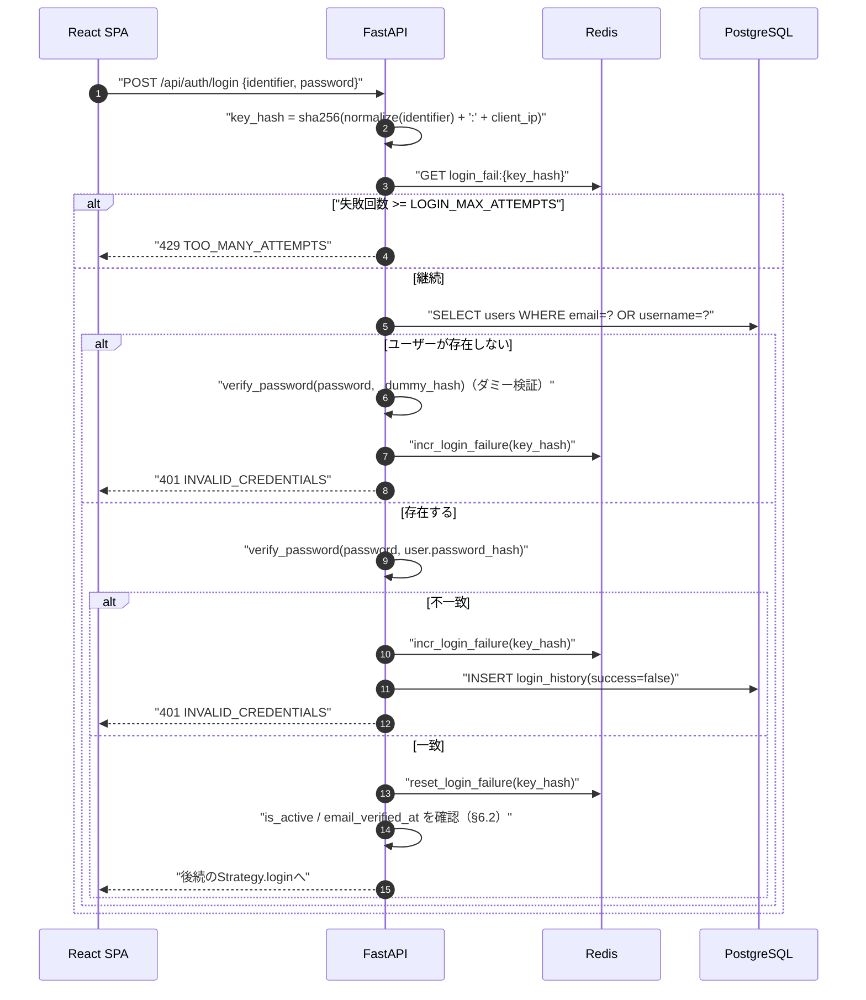
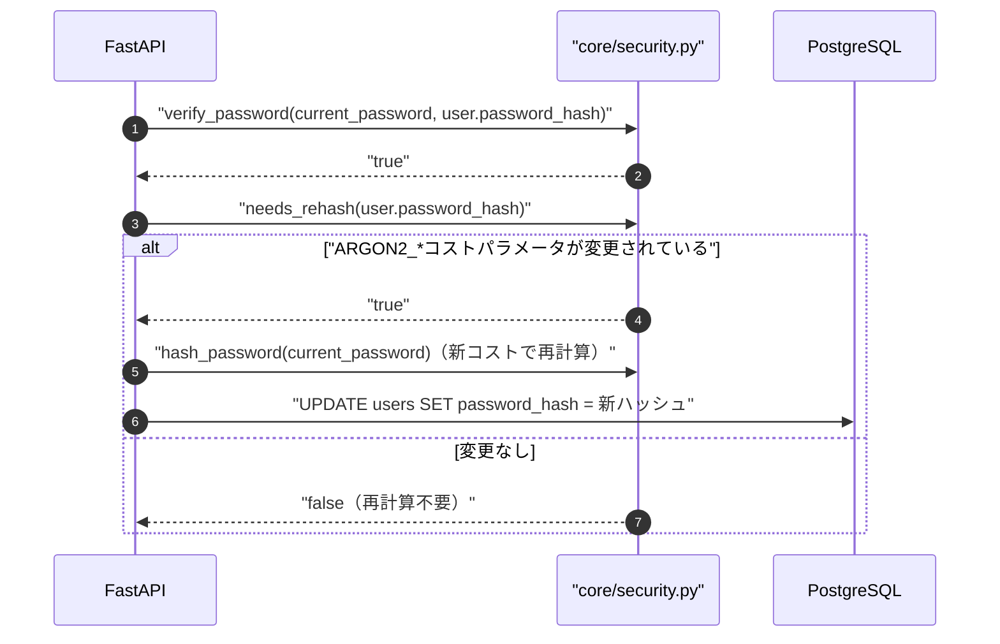
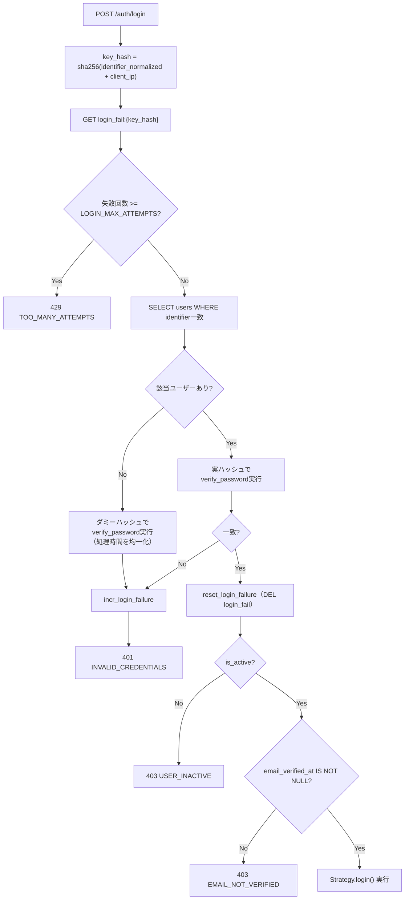
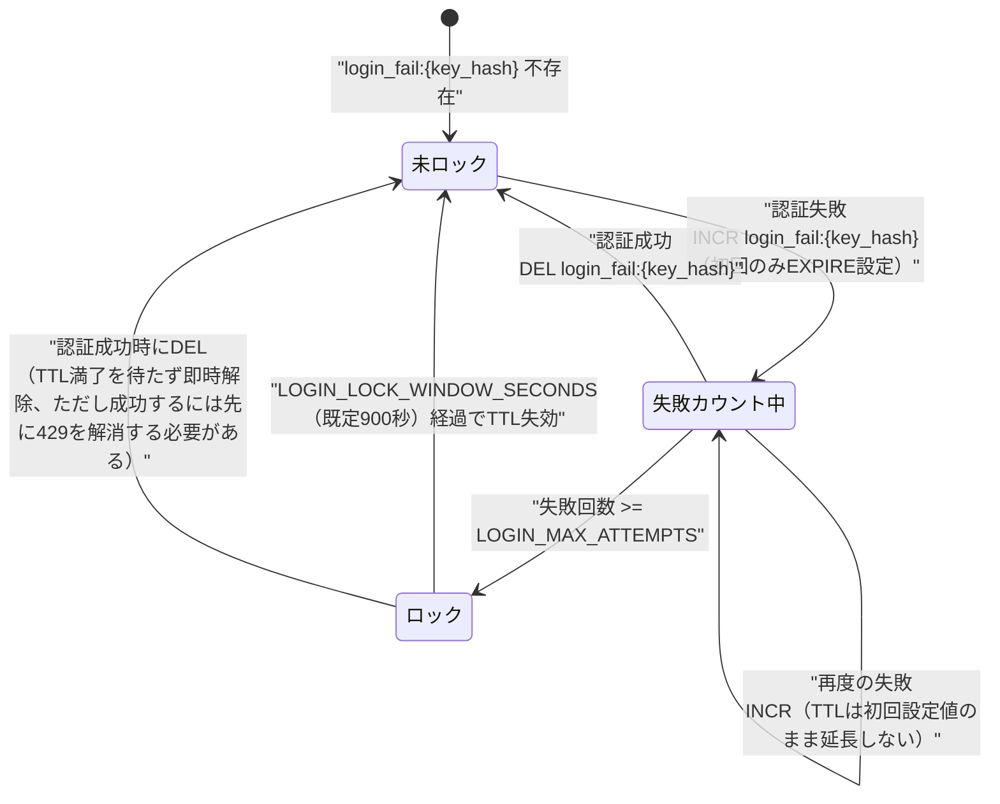
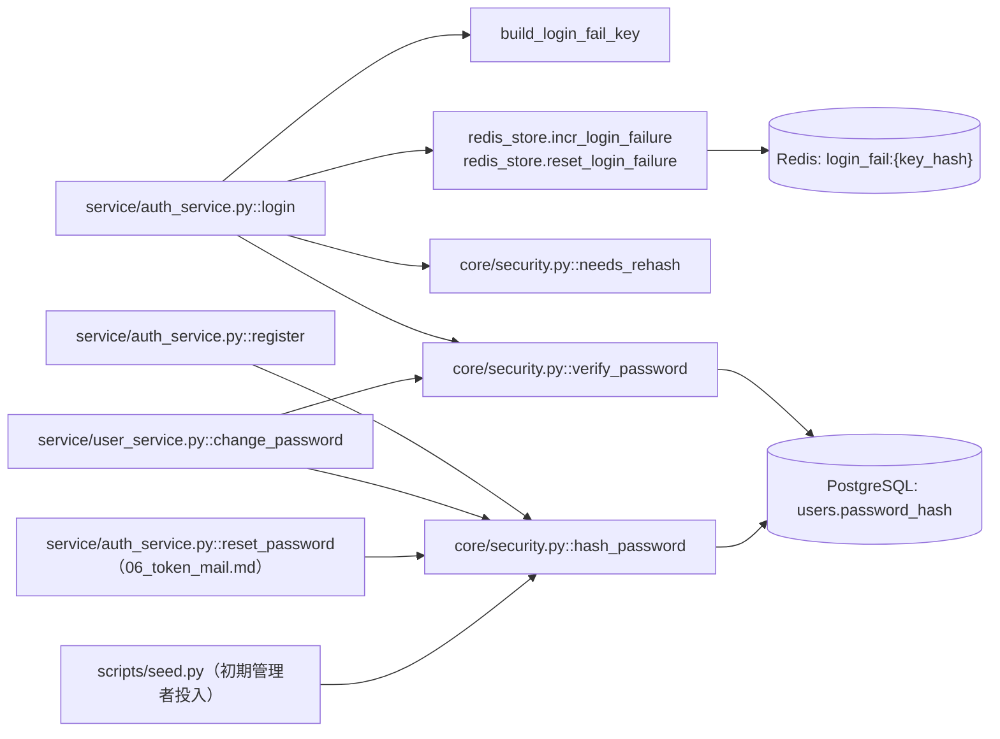

# 07 パスワードハッシュとログイン失敗レート制限

## 0. 関連ドキュメント

- 基本設計：[../../basic_design/03_auth.md](../../basic_design/03_auth.md)（§3.2 ログインシーケンス、§6.2 判定順序、§10 パスワード・トークンのハッシュ）
- 基本設計：[../../basic_design/02_redis.md](../../basic_design/02_redis.md)（§2 キー一覧の `login_fail:*`）
- 詳細設計：[./08_redis_store.md](./08_redis_store.md)（`incr_login_failure` / `reset_login_failure` の実装詳細）
- 詳細設計：[../api/auth/02_post_auth_login.md](../api/auth/02_post_auth_login.md)（本設計と同一方針の既存記述元）
- 詳細設計：[../infra/04_env_config.md](../infra/04_env_config.md)（環境変数一覧・§12の環境変数名の揺れに関する記載）
- 詳細設計：[../api/users/03_put_users_me_password.md](../api/users/03_put_users_me_password.md)、[../database/01_table_users.md](../database/01_table_users.md)

## 1. 概要

| 項目 | 内容 |
|------|------|
| 対象 | `core/security.py`（パスワードハッシュ生成・検証）、`service/auth_service.py :: login`（ログイン失敗レート制限） |
| 責務 | argon2idによるパスワードハッシュの生成・検証・コストパラメータ管理、ログイン失敗回数のカウントによるブルートフォース対策、タイミング攻撃対策 |
| 適用条件 | `AUTH_MODE`に依存しない（session/jwt共通）。パスワードを保有しないOAuth専用ユーザー（`password_hash IS NULL`）はログイン試行自体が別経路（[../../basic_design/03_auth.md](../../basic_design/03_auth.md) §5）となるため、本書の対象外 |
| 依存先 | `passlib[argon2]`、Redis（`login_fail:*`）、PostgreSQL（`users.password_hash`） |
| 実装ファイル | `api/app/core/security.py`、`api/app/service/auth_service.py`、`api/app/repository/redis_store.py` |

## 2. 構成要素

| 要素 | 種別 | 責務 | 備考 |
|------|------|------|------|
| `hash_password` | 関数（`core/security.py`） | argon2idでパスワードをハッシュ化 | 会員登録・パスワード変更・パスワードリセット・seedスクリプトから共通利用 |
| `verify_password` | 関数（`core/security.py`） | 平文パスワードとハッシュを照合 | 定数時間比較（argon2実装が内包） |
| `needs_rehash` | 関数（`core/security.py`） | コストパラメータ変更時の再ハッシュ要否判定 | `passlib`の`CryptContext.needs_update`相当 |
| `_dummy_hash` | モジュール内定数（`core/security.py`） | ユーザー不存在時のダミー検証用ハッシュ | タイミング攻撃対策（§10参照） |
| `build_login_fail_key` | 関数（`service/auth_service.py`または`core/security.py`） | 識別子とIPからRedisキーのハッシュ値を生成 | 平文の識別子・IPをキーに含めない |
| `incr_login_failure` / `reset_login_failure` | `redis_store`関数 | 失敗回数のINCR/DEL | 詳細は[./08_redis_store.md](./08_redis_store.md) §5.3 |

## 3. 設定項目（環境変数）

`../infra/04_env_config.md` §3.3「認証共通・session方式」を正とする。

| 変数名 | 型 | 既定値 | 用途 | 秘匿 |
|--------|----|--------|------|------|
| `ARGON2_TIME_COST` | int | `3` | argon2idの反復回数コスト | `.env` |
| `ARGON2_MEMORY_COST` | int | `65536` | argon2idのメモリコスト（KiB） | `.env` |
| `ARGON2_PARALLELISM` | int | `4` | argon2idの並列度コスト | `.env` |
| `LOGIN_MAX_ATTEMPTS` | int | `5` | `login_fail:{key_hash}`の許容失敗回数上限 | `.env` |
| `LOGIN_LOCK_WINDOW_SECONDS` | int | `900` | `login_fail:{key_hash}`のTTL＝カウント窓 | `.env` |

**環境変数名に関する注記**：ログイン失敗上限の環境変数名は、基本設計（`../../basic_design/06_infra_cicd.md` §4.3）の表記である `LOGIN_MAX_ATTEMPTS` を正とし、全詳細設計で統一している（対となる時間窓は `LOGIN_LOCK_WINDOW_SECONDS`）。

## 4. 全体の出入力

| 分類 | 項目 | 内容 |
|------|------|------|
| 入力 | `POST /auth/register` / `PUT /users/me/password` / `POST /auth/password/reset` の`new_password`（平文） | `hash_password`の入力 |
| 入力 | `POST /auth/login`の`identifier`（email/username）・`password`（平文）・クライアントIP | ハッシュ検証とレート制限キーの入力 |
| 入力 | `ARGON2_*` / `LOGIN_LOCK_*`（環境変数） | コストパラメータ・レート制限しきい値 |
| 出力 | `users.password_hash`（argon2idハッシュ文字列） | PostgreSQLへの永続化値 |
| 出力 | Redis `login_fail:{key_hash}`（失敗回数） | ログイン試行のたびに参照・更新 |
| 出力 | HTTP `401 INVALID_CREDENTIALS` / `429 TOO_MANY_ATTEMPTS` | ログインAPIのエラー応答 |

## 5. シーケンス図

### 5.1 ログイン時のレート制限とハッシュ検証

### 5.2 パスワード変更・再ハッシュ判定

## 6. 処理フロー・分岐

**タイミング攻撃対策の要点**：ユーザーが存在しない場合でも`_dummy_hash`に対して`verify_password`を必ず実行し、存在有無による応答時間差を縮小する（[../../basic_design/03_auth.md](../../basic_design/03_auth.md) §3.2）。`argon2`のハッシュ検証自体が定数時間比較を内包するため、`secrets.compare_digest`を別途使用する必要はない。

**fail-close方針**：Redis接続不能時は`login_fail`の確認・更新ができないため、[./08_redis_store.md](./08_redis_store.md) §10の方針に従い`503 SERVICE_UNAVAILABLE`を返し、レート制限を無効化したままログイン処理を継続することはしない。

## 7. データ遷移図

`login_fail:{key_hash}`はカウント専用のキーであり、パスワードハッシュや識別子の平文は一切保持しない。TTLは初回`INCR`時にのみ設定し、以降の失敗では延長しない（`LOGIN_LOCK_WINDOW_SECONDS`は「最初の失敗からの固定窓」であり、失敗を重ねるほどロック時間が延びる設計ではない）。

## 8. 関数・処理詳細

### 8.1 `core/security.py :: hash_password`

| 項目 | 内容 |
|------|------|
| シグネチャ / 定義 | `def hash_password(plain_password: str) -> str` |
| 引数 / 入力 | `plain_password`（バリデーション済み平文パスワード） |
| 戻り値 / 出力 | argon2idエンコード済みハッシュ文字列（`passlib`形式、コストパラメータ埋め込み済み） |
| 送出例外 / 失敗条件 | なし（`passlib`内部エラーは通常発生しない想定） |
| 処理内容 | 1. `CryptContext(schemes=["argon2"], argon2__time_cost=ARGON2_TIME_COST, argon2__memory_cost=ARGON2_MEMORY_COST, argon2__parallelism=ARGON2_PARALLELISM)`を用いて`hash(plain_password)`を実行 2. 結果を返す |
| 副作用 | なし（CPU/メモリ負荷はコストパラメータに依存） |

### 8.2 `core/security.py :: verify_password`

| 項目 | 内容 |
|------|------|
| シグネチャ / 定義 | `def verify_password(plain_password: str, password_hash: str) -> bool` |
| 引数 / 入力 | `plain_password`、`password_hash`（DB格納値または`_dummy_hash`） |
| 戻り値 / 出力 | `bool` |
| 送出例外 / 失敗条件 | 不正な形式のハッシュに対しては`False`を返す（例外を送出しない。`passlib`の`verify`が内部で捕捉） |
| 処理内容 | 1. `CryptContext.verify(plain_password, password_hash)`を実行し結果を返す | 
| 副作用 | なし |

### 8.3 `core/security.py :: needs_rehash`

| 項目 | 内容 |
|------|------|
| シグネチャ / 定義 | `def needs_rehash(password_hash: str) -> bool` |
| 引数 / 入力 | `password_hash`（現在DBに格納されているハッシュ） |
| 戻り値 / 出力 | `bool`：現在の`ARGON2_*`コストパラメータと異なる場合`True` |
| 送出例外 / 失敗条件 | なし |
| 処理内容 | `CryptContext.needs_update(password_hash)`を呼び出す |
| 副作用 | なし |
| 備考 | 呼び出し元（ログイン成功時等）が`True`の場合に`hash_password`で再計算し`users.password_hash`を更新する運用とする。基本設計に明記された機能ではなく、コストパラメータ変更時の段階的移行を可能にするための実装レベルの補完（§12参照） |

### 8.4 `service/auth_service.py :: build_login_fail_key`

| 項目 | 内容 |
|------|------|
| シグネチャ / 定義 | `def build_login_fail_key(identifier: str, client_ip: str) -> str` |
| 引数 / 入力 | `identifier`（ログインフォーム入力のemail/username）、`client_ip`（信頼できるプロキシ経由で確定したIP） |
| 戻り値 / 出力 | `str`（`sha256`ダイジェストの16進文字列。Redisキー`login_fail:{key_hash}`の`{key_hash}`部分） |
| 送出例外 / 失敗条件 | なし |
| 処理内容 | 1. `normalized = identifier.strip().lower()` 2. `sha256(f"{normalized}:{client_ip}".encode()).hexdigest()`を返す |
| 副作用 | なし |
| 備考 | メール/ユーザー名を平文でRedisキーへ保存しないための一方向ハッシュ（[../../basic_design/02_redis.md](../../basic_design/02_redis.md) §2の`login_fail`行の注記どおり） |

### 8.5 `service/auth_service.py :: login`（レート制限・ハッシュ検証部分の抜粋）

| 項目 | 内容 |
|------|------|
| シグネチャ / 定義 | `async def login(payload: LoginRequest, request: Request, response: Response) -> LoginResult` |
| 引数 / 入力 | `payload.identifier` / `payload.password`、`request`（クライアントIP取得元） |
| 戻り値 / 出力 | `LoginResult` |
| 送出例外 / 失敗条件 | `TooManyAttemptsError`（429）、`InvalidCredentialsError`（401）、`UserInactiveError`（403）、`EmailNotVerifiedError`（403） |
| 処理内容 | 全体シーケンスは[../api/auth/02_post_auth_login.md](../api/auth/02_post_auth_login.md) §4・§6.2を正とし、本書はハッシュ検証・レート制限に関わる部分（1〜6手順）のみを担当範囲とする：1. `key_hash = build_login_fail_key(...)` 2. `redis_store.incr_login_failure`前に`GET`相当で現在値確認し上限超過なら例外 3. `user_repository.find_by_identifier` 4. 該当なしなら`verify_password(password, _dummy_hash)`後に`incr_login_failure`して例外 5. 該当ありなら`verify_password(password, user.password_hash)`、不一致なら`incr_login_failure`して例外 6. 一致なら`reset_login_failure`し`needs_rehash`を確認して必要なら再ハッシュ |
| 副作用 | Redis: `login_fail`のGET/INCR/DEL。DB: 再ハッシュ時のみ`users.password_hash`をUPDATE |

## 9. 関数・要素相関図

## 10. セキュリティ・非機能考慮

| 観点 | 方針 | 根拠 |
|------|------|------|
| ハッシュアルゴリズム | argon2id（`passlib[argon2]`）を採用し、bcrypt/PBKDF2は使用しない | [基本設計§10](../../basic_design/03_auth.md) |
| コストパラメータの外部化 | `ARGON2_TIME_COST`/`ARGON2_MEMORY_COST`/`ARGON2_PARALLELISM`を環境変数化し、ハードコードしない | 共通コーディングルール |
| タイミング攻撃対策 | ユーザー不存在時もダミーハッシュで`verify_password`を実行し、応答時間差からユーザー存在有無を推測させない | [基本設計§3.2](../../basic_design/03_auth.md) |
| ブルートフォース対策 | `login_fail:{key_hash}`により`LOGIN_LOCK_WINDOW_SECONDS`内の失敗回数を`LOGIN_MAX_ATTEMPTS`で制限し、上限到達時は429を返す | [../../basic_design/02_redis.md](../../basic_design/02_redis.md) §2 |
| キーの秘匿 | Redisキーには識別子・IPの平文を保存せず、正規化済み識別子とIPを結合した`sha256`ハッシュのみを使用する | [../../basic_design/02_redis.md](../../basic_design/02_redis.md) §2の注記 |
| fail-close | Redis接続不能時はレート制限判定ができないため、ログイン処理自体を`503`で拒否する（無条件許可にフォールバックしない） | [./08_redis_store.md](./08_redis_store.md) §10 |
| 再ハッシュの段階移行 | `needs_rehash`により、コストパラメータ変更後もログイン成功のたびに順次新パラメータへ移行できる（一括再ハッシュのバッチ処理は行わない） | 要検討（§12参照） |
| ログ出力 | 平文パスワード・ハッシュ値はログに一切出力しない。失敗回数・ロック発生の事実のみを記録する | 共通ルール |

## 11. テスト設計

| No | 区分 | ケース | 前提 | 期待結果 | テスト名案 |
|----|------|--------|------|----------|-----------|
| 1 | 単体 | `hash_password`が生成したハッシュを`verify_password`で検証できる | 任意の平文パスワード | `True`を返す | `test_hash_and_verify_password_roundtrip` |
| 2 | 単体 | 誤ったパスワードで`verify_password`が`False` | 正しいハッシュ、誤った平文 | `False` | `test_verify_password_rejects_wrong_password` |
| 3 | 単体 | `needs_rehash`がコストパラメータ変更を検知する | `ARGON2_TIME_COST`を変更した設定で既存ハッシュを検証 | `True` | `test_needs_rehash_detects_cost_change` |
| 4 | 単体 | `build_login_fail_key`が同一入力で同一キーを生成する | 同じidentifier/IP | 同一ハッシュ値 | `test_build_login_fail_key_deterministic` |
| 5 | 単体 | `build_login_fail_key`が大文字小文字・前後空白を正規化する | `" User@Example.com "`と`"user@example.com"` | 同一キーになる | `test_build_login_fail_key_normalizes_identifier` |
| 6 | 結合 | 存在しないユーザーでもダミー検証で応答時間が実ユーザーと近似する | ベンチマーク的な結合テスト | 極端な時間差が発生しない（許容範囲の定義は実装時に決定） | `test_login_timing_similar_for_unknown_user`（要検討：厳密な閾値は基本設計に無し） |
| 7 | 結合 | `LOGIN_MAX_ATTEMPTS`回失敗後に429となる | `fakeredis`でカウントを積み上げ | `429 TOO_MANY_ATTEMPTS` | `test_login_rate_limited_after_max_attempts` |
| 8 | 結合 | ログイン成功で`login_fail`がDELされる | 失敗を数回重ねた後に成功 | 次回リクエストで`GET login_fail`が空 | `test_login_success_resets_failure_count` |
| 9 | 結合 | `LOGIN_LOCK_WINDOW_SECONDS`経過後にロックが解除される | TTLを短く上書きしたテスト設定 | TTL経過後は429にならない | `test_login_lock_expires_after_window` |
| 10 | 網羅できない範囲 | argon2の実際のメモリ使用量・処理時間の絶対値 | - | 環境依存のためCIでは相対比較・存在確認のみとし、絶対値の性能保証は対象外とする | - |

## 12. 不明点・要検討事項

| 区分 | 内容 | 影響 |
|------|------|------|
| 要検討 | `LOGIN_MAX_ATTEMPTS` の具体値（既定5）は基本設計 §4.3 の例示値であり、学習用途としての妥当性は運用開始時に再確認する | `.env.example`、`core/config.py` |
| 要検討 | `LOGIN_MAX_ATTEMPTS`の具体的な既定値（本書・[../infra/04_env_config.md](../infra/04_env_config.md)では`5`）は基本設計（[../../basic_design/02_redis.md](../../basic_design/02_redis.md)）にはTTL（900秒）のみ記載があり閾値自体の明記がないため、詳細設計側で仮定した値である | 実装時に運用ポリシーとして正式値を確定する必要がある |
| 要検討 | `needs_rehash`による段階的再ハッシュは基本設計に明記された機能ではなく、コーディングルール（ハードコーディング禁止・コストパラメータの環境変数化）から実装レベルで妥当と判断し追加した。コストパラメータ変更時に既存ハッシュを一括で再計算するバッチ処理の要否は未定義 | 低〜中。運用でコストパラメータを変更する頻度次第で一括移行機能の要否が変わる |
| 不明 | タイミング攻撃対策（ダミーハッシュ検証）の効果を検証する結合テストの合格基準（許容される時間差の閾値）が基本設計に定義されていない | テスト実装時に閾値を独自に設定する必要があり、CI環境差による不安定化のリスクがある |
