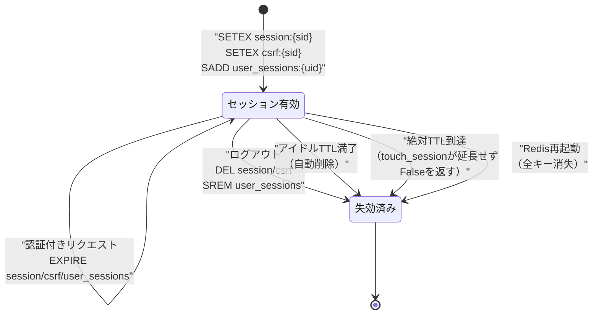
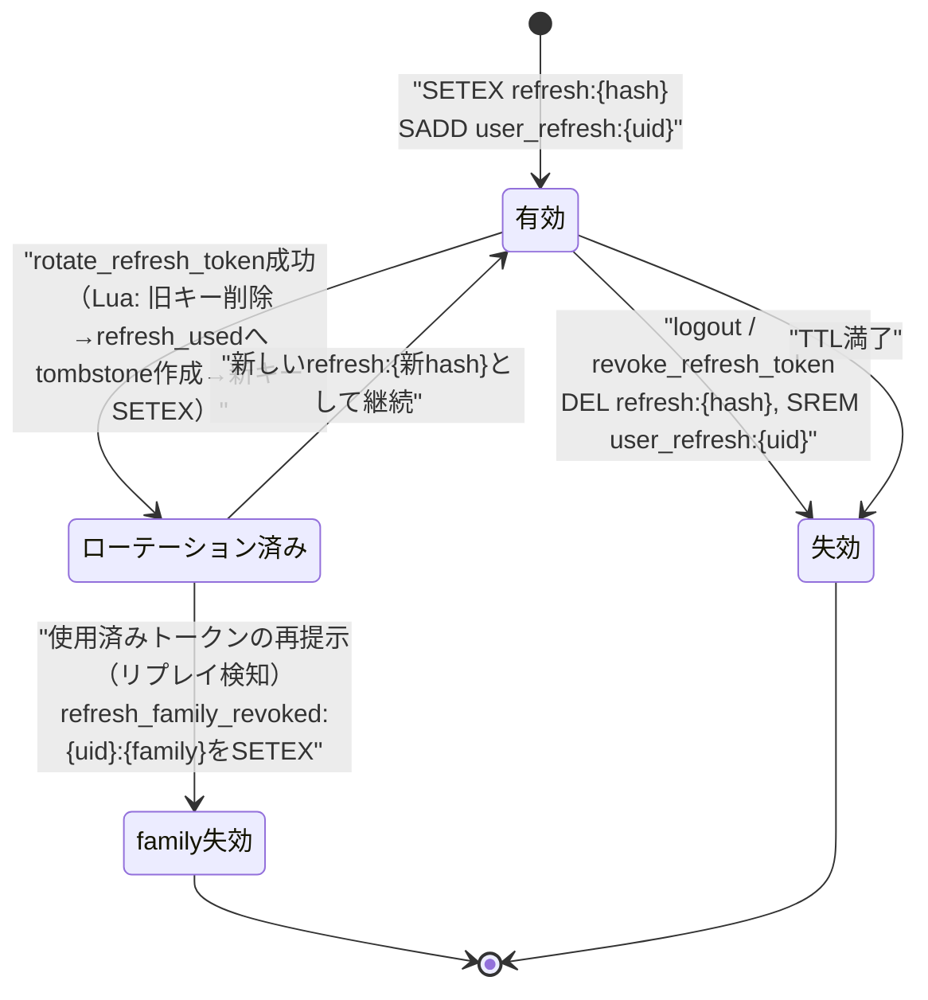
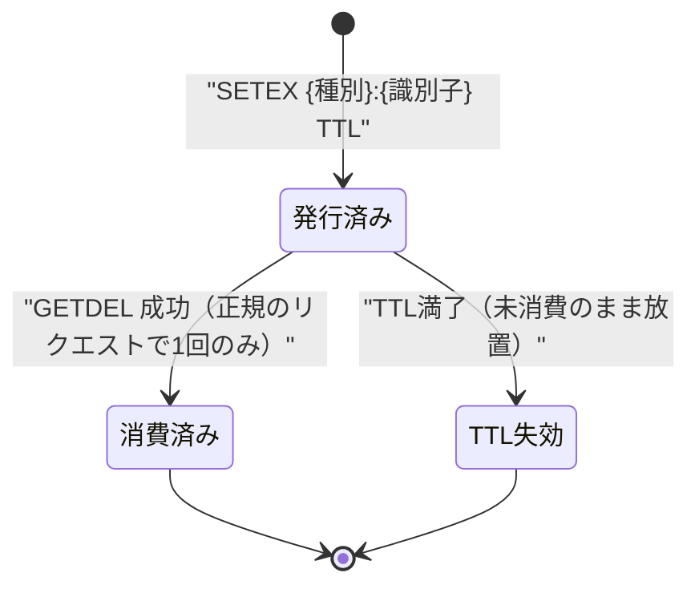
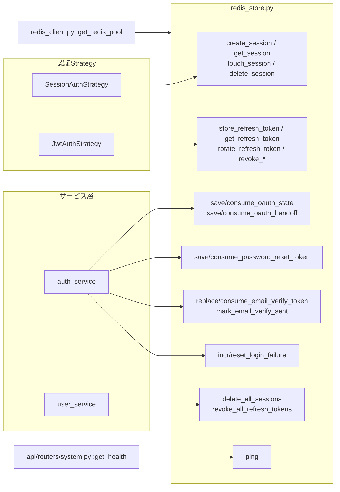

# 08 redis_store層（Redisキー操作関数とTTL設計）

## 0. 関連ドキュメント

- 基本設計：[../../basic_design/02_redis.md](../../basic_design/02_redis.md)（本ファイルの正）
- 基本設計：[../../basic_design/03_auth.md](../../basic_design/03_auth.md)（各キーの利用シーン）
- 詳細設計：[./00_strategy_base.md](./00_strategy_base.md)、[./01_session_auth.md](./01_session_auth.md)、[./02_jwt_auth.md](./02_jwt_auth.md)、[./04_google_oauth.md](./04_google_oauth.md)、[./06_token_mail.md](./06_token_mail.md)、[./07_password_security.md](./07_password_security.md)
- 詳細設計：[../infra/04_env_config.md](../infra/04_env_config.md)（環境変数一覧・§3.2データストア）

## 1. 概要

| 項目 | 内容 |
|------|------|
| 対象 | `api/app/repository/redis_store.py`（全Redis操作関数）、`api/app/core/redis_client.py`（接続プール管理） |
| 責務 | 認証・認可に関わる全Redisキーの生成・読み書き・TTL管理・原子的操作（Lua/パイプライン）を一元化し、他レイヤーからは本モジュールの関数経由でのみRedisにアクセスさせる |
| 適用条件 | `AUTH_MODE`に依存しない（session/jwt双方の各Strategy、`auth_service`、`user_service`から共通利用） |
| 依存先 | Redis 8（単一ノード、永続化無効）、`redis-py`（asyncio版） |
| 実装ファイル | `api/app/repository/redis_store.py`、`api/app/core/redis_client.py`、`api/app/repository/redis_scripts/rotate_refresh_token.lua` |

## 2. 構成要素

| 要素 | 種別 | 責務 | 備考 |
|------|------|------|------|
| `redis_client.py :: get_redis_pool` | 関数（`@lru_cache`起動時1回） | `redis.asyncio.ConnectionPool`を`REDIS_URL`から生成 | アプリ起動時に生成し、以後は使い回す |
| `redis_store.py` | モジュール | 全キー操作関数を集約 | 関数一覧は§8参照 |
| キー命名関数群（`_session_key`等） | プライベート関数 | `{用途}:{識別子}`形式の文字列を`REDIS_KEY_PREFIX`付きで生成 | プレフィックスの前置をこの層に閉じ込める |
| `rotate_refresh_token.lua` | Luaスクリプト | リフレッシュトークンローテーションの原子的実行 | `EVALSHA`でキャッシュ利用 |
| `ping` | 関数 | Redis疎通確認 | `/api/health`から利用 |

## 3. 設定項目（環境変数）

`../infra/04_env_config.md` §3.2「データストア」・§3.3〜§3.8を正とし、本書が扱うキーのTTL・接続設定のみ再掲する。

| 変数名 | 型 | 既定値 | 用途 | 秘匿 |
|--------|----|--------|------|------|
| `REDIS_URL` | str | `redis://redis:6379/0` | `redis-py`接続文字列 | `.env` |
| `REDIS_KEY_PREFIX` | str | 空文字 | 全キーへの前置プレフィックス（環境共有時の衝突回避） | `.env` |
| `REDIS_TEST_DB` | int | `1` | テスト実行時に接続するDB番号 | `.env` |
| `SESSION_TTL_SECONDS` | int | `1800` | `session:*` / `csrf:*` / `user_sessions:*`のアイドルTTL | `.env` |
| `SESSION_ABSOLUTE_TTL_SECONDS` | int | `28800` | セッションの絶対有効期限（`touch_session`が超過を許さない） | `.env` |
| `REFRESH_TTL_SECONDS` | int | `1209600` | `refresh:*` / `refresh_used:*` / `refresh_family_revoked:*` / `user_refresh:*`のTTL | `.env` |
| `OAUTH_STATE_TTL_SECONDS` | int | `600` | `oauth_state:*`のTTL | `.env` |
| `OAUTH_HANDOFF_TTL_SECONDS` | int | `60` | `oauth_handoff:*`のTTL | `.env` |
| `PASSWORD_RESET_TTL_SECONDS` | int | `1800` | `pwreset:*`のTTL | `.env` |
| `EMAIL_VERIFY_TTL_SECONDS` | int | `86400` | `emailverify:*` / `emailverify_current:*`のTTL | `.env` |
| `EMAIL_VERIFY_RESEND_INTERVAL_SECONDS` | int | `60` | `emailverify_sent:*`のTTL | `.env` |
| `LOGIN_LOCK_WINDOW_SECONDS` | int | `900` | `login_fail:*`のTTL | `.env` |

いずれの値も関数の引数として呼び出し側（各Strategy・`auth_service`）から渡され、`redis_store.py`内にリテラルとしてハードコードしない。

## 4. 全体の出入力

| 分類 | 項目 | 内容 |
|------|------|------|
| 入力 | 各関数の引数（`user_id` / `session_id` / `token` / `ttl`等） | 呼び出し元（各Strategy・サービス層）から渡される |
| 入力 | `REDIS_URL` / `REDIS_KEY_PREFIX` / `REDIS_TEST_DB`（環境変数） | 接続先・名前空間の決定 |
| 出力 | Redisキーの作成・更新・削除（下記§5.1一覧） | 認証・認可状態の永続化先（ただしRedis自体は非永続） |
| 出力 | 関数の戻り値（`bool` / データクラス / `None`等） | 呼び出し元の分岐判定に使用 |
| 副作用 | Redisへの書き込み・削除。永続化（RDB/AOF）は行わないため、プロセス再起動やRedis再起動で全データが消失し得る | §10参照 |

## 5. キー一覧（`basic_design/02_redis.md` §2 の完全網羅）

| キー | 値（JSON等） | TTL（環境変数） | スライディング延長 | 設定元 | 用途 |
|------|-------------|-----------------|---------------------|--------|------|
| `session:{session_id}` | `{user_id, created_at, ip}` | `SESSION_TTL_SECONDS`（既定1800） | する（絶対期限`SESSION_ABSOLUTE_TTL_SECONDS`まで） | session方式ログイン | セッション有効性判定 |
| `csrf:{session_id}` | `{token}` | `SESSION_TTL_SECONDS`（sessionと同一） | する（sessionと同時） | session方式ログイン | CSRFトークン照合 |
| `refresh:{token_hash}` | `{user_id, issued_at, family_id}` | `REFRESH_TTL_SECONDS`（既定1209600） | しない | jwt方式ログイン/リフレッシュ | リフレッシュトークン有効性判定 |
| `refresh_used:{old_hash}` | `{user_id, family_id, used_at}` | `REFRESH_TTL_SECONDS` | しない | ローテーション成功時 | 使用済みトークンの再提示検知用tombstone |
| `refresh_family_revoked:{user_id}:{family_id}` | `1` | `REFRESH_TTL_SECONDS` | しない | 再利用検知時 | family失効の原子的な記録 |
| `user_sessions:{user_id}` | Set（session_idの集合） | `SESSION_TTL_SECONDS`（延長） | する（作成・touch時） | session方式ログイン | 全端末ログアウト・管理者強制ログアウト |
| `user_refresh:{user_id}` | Set（token_hashの集合） | `REFRESH_TTL_SECONDS`（延長） | する（新規発行・ローテーション時） | jwt方式ログイン | 同上（JWT） |
| `oauth_state:{state}` | `{redirect_to, code_verifier, nonce, created_at}` | `OAUTH_STATE_TTL_SECONDS`（既定600） | しない | OAuth2認可開始 | state・PKCE・nonceの検証値 |
| `oauth_handoff:{code}` | `{user_id, redirect_to, created_at}` | `OAUTH_HANDOFF_TTL_SECONDS`（既定60） | しない | jwt OAuthコールバック | フロントへの一時コード（ワンタイム） |
| `pwreset:{token_hash}` | `{user_id, requested_at}` | `PASSWORD_RESET_TTL_SECONDS`（既定1800） | しない | パスワードリセット要求 | 現在トークンの実体 |
| `pwreset_current:{user_id}` | 現在のtoken_hash | `PASSWORD_RESET_TTL_SECONDS`（既定1800） | しない（再発行時に原子的に置換） | パスワードリセット要求 | 最新トークンのみ有効にする逆引き |
| `emailverify:{token_hash}` | `{user_id, requested_at}` | `EMAIL_VERIFY_TTL_SECONDS`（既定86400） | しない | 会員登録・認証メール再送 | メール認証トークン有効性判定 |
| `emailverify_current:{user_id}` | 現在のtoken_hash | `EMAIL_VERIFY_TTL_SECONDS` | しない（再発行時に新TTLで置換） | 会員登録・認証メール再送 | 再送時に旧トークンを失効させる逆引き |
| `emailverify_sent:{user_id}` | 直近送信時刻（数値） | `EMAIL_VERIFY_RESEND_INTERVAL_SECONDS`（既定60） | しない | 認証メール送信時（`SETEX`） | 認証メール再送のレート制限 |
| `login_fail:{key_hash}` | 連続失敗回数（数値） | `LOGIN_LOCK_WINDOW_SECONDS`（既定900） | しない（初回`INCR`時のみ設定） | ログイン失敗時（`INCR`） | ブルートフォース対策のカウント |

**値に保存しない情報**：パスワード・パスワードハッシュ・アクセストークン平文・リフレッシュトークン平文・メールアドレス/ユーザー名の平文（`login_fail`のキー自体はハッシュ化済み識別子）。全14キーは本表で網羅済み（[../../basic_design/02_redis.md](../../basic_design/02_redis.md) §2と1対1対応）。

## 6. キー命名規約

| 規則 | 内容 |
|------|------|
| 基本形式 | `{用途}:{識別子}`（コロン区切り、用途は英小文字＋アンダースコア） |
| プレフィックス | `REDIS_KEY_PREFIX`（既定空文字）を全キーの先頭に前置可能。例：`REDIS_KEY_PREFIX=stg_` の場合 `stg_session:{sid}` |
| 複合識別子 | `refresh_family_revoked:{user_id}:{family_id}` のように複数識別子はさらにコロンで連結する |
| 生成箇所 | 命名規則の適用は`redis_store.py`内のプライベート関数（`_session_key(sid)`等）に閉じ込め、呼び出し元でキー文字列を直接組み立てない |
| ハッシュ化対象 | `token_hash`はトークン平文の`sha256(token).hexdigest()`。`key_hash`（`login_fail`）は`sha256(normalized_identifier + ":" + client_ip).hexdigest()`（[./07_password_security.md](./07_password_security.md) §8.4） |

## 7. データ遷移図

### 7.1 セッション系キーの状態遷移

### 7.2 リフレッシュトークン系キーの状態遷移

### 7.3 ワンタイム消費系キー（`oauth_state`/`oauth_handoff`/`pwreset`/`emailverify`）共通パターン

`emailverify`のみ、消費前に再発行（再送）が起こり得る点が他の3種と異なる（`emailverify_current:{uid}`経由で旧token_hashを特定し明示的に`DEL`する。[./06_token_mail.md](./06_token_mail.md) §7）。

### 7.4 `login_fail`の状態遷移

[./07_password_security.md](./07_password_security.md) §7を参照（本書と同一のキー・TTL設計に基づく）。

## 8. 操作関数の一覧と詳細

すべて`async def`。TTL値は引数として受け取り、関数内にハードコードしない。

### 8.1 セッション操作

| 関数 | シグネチャ | 処理概要 |
|------|-----------|----------|
| `create_session` | `async def create_session(user_id: UUID, ip: str \| None, ttl: int) -> tuple[str, str]` | `secrets.token_urlsafe(32)`でsession_id・csrf_tokenを生成し、パイプラインで`SETEX session:{sid}` / `SETEX csrf:{sid}` / `SADD user_sessions:{uid}` / `EXPIRE user_sessions:{uid} ttl`を実行 |
| `get_session` | `async def get_session(session_id: str) -> SessionData \| None` | `GET session:{sid}`しJSONデコード。存在しなければ`None` |
| `touch_session` | `async def touch_session(session_id: str, user_id: UUID, ttl: int, absolute_expires_at: datetime) -> bool` | セッションの`created_at`から実効TTL＝`min(ttl, absolute_expires_at - now())`を算出し0以下なら延長せず`False`を返す。0超なら`EXPIRE session/csrf/user_sessions`を同一処理内で更新し`True` |
| `get_csrf_token` | `async def get_csrf_token(session_id: str) -> str \| None` | `GET csrf:{sid}` |
| `delete_session` | `async def delete_session(session_id: str, user_id: UUID) -> None` | `DEL session:{sid}` / `DEL csrf:{sid}` / `SREM user_sessions:{uid} session_id` |
| `delete_all_sessions` | `async def delete_all_sessions(user_id: UUID) -> int` | `SMEMBERS user_sessions:{uid}`で列挙 → 各`session:*`/`csrf:*`を`DEL` → 最後に`DEL user_sessions:{uid}` → 削除件数を返す |

### 8.2 リフレッシュトークン操作

| 関数 | シグネチャ | 処理概要 |
|------|-----------|----------|
| `store_refresh_token` | `async def store_refresh_token(token: str, user_id: UUID, family_id: str, ttl: int) -> None` | `hash = sha256(token)`をキーに`SETEX refresh:{hash}` + `SADD user_refresh:{uid}` + `EXPIRE user_refresh:{uid} ttl` |
| `get_refresh_token` | `async def get_refresh_token(token: str) -> RefreshData \| None` | `GET refresh:{sha256(token)}` |
| `rotate_refresh_token` | `async def rotate_refresh_token(old_token: str, new_token: str, ttl: int) -> RefreshData \| TokenReused` | `rotate_refresh_token.lua`を`EVALSHA`で実行（§9参照）。旧キーが使用済みなら`TokenReused(user_id, family_id)`相当を返す |
| `revoke_refresh_token` | `async def revoke_refresh_token(token: str, user_id: UUID) -> None` | `DEL refresh:{hash}` + `SREM user_refresh:{uid} hash` |
| `revoke_token_family` | `async def revoke_token_family(user_id: UUID, family_id: str) -> int` | `SETEX refresh_family_revoked:{uid}:{family}` → `SMEMBERS user_refresh:{uid}`を走査し`family_id`一致の`refresh:*`を`DEL` → 削除件数を返す |
| `revoke_all_refresh_tokens` | `async def revoke_all_refresh_tokens(user_id: UUID) -> int` | `SMEMBERS user_refresh:{uid}`で列挙 → 各`refresh:*`を`DEL` → `DEL user_refresh:{uid}` → 削除件数を返す |

### 8.3 OAuth2操作

| 関数 | シグネチャ | 処理概要 |
|------|-----------|----------|
| `save_oauth_state` | `async def save_oauth_state(state: str, redirect_to: str, code_verifier: str, nonce: str, ttl: int) -> None` | `SETEX oauth_state:{state}` |
| `consume_oauth_state` | `async def consume_oauth_state(state: str) -> OAuthStateData \| None` | `GETDEL oauth_state:{state}`（ワンタイム消費） |
| `save_oauth_handoff` | `async def save_oauth_handoff(code: str, user_id: UUID, redirect_to: str, ttl: int) -> None` | `SETEX oauth_handoff:{code}` |
| `consume_oauth_handoff` | `async def consume_oauth_handoff(code: str) -> OAuthHandoffData \| None` | `GETDEL oauth_handoff:{code}`（ワンタイム消費） |

### 8.4 パスワードリセット・メール認証操作

| 関数 | シグネチャ | 処理概要 |
|------|-----------|----------|
| `save_password_reset_token` | `async def save_password_reset_token(token: str, user_id: UUID, ttl: int) -> None` | Luaで旧`pwreset_current:{uid}`と実体を置換し、新hashを`pwreset`と`pwreset_current`へ原子的に登録 |
| `consume_password_reset_token` | `async def consume_password_reset_token(token: str) -> UUID \| None` | Luaで`pwreset_current:{uid}`との一致を確認して実体・currentを原子的に消費し、`user_id`を返す |
| `replace_email_verify_token` | `async def replace_email_verify_token(token: str, user_id: UUID, ttl: int) -> None` | `GET emailverify_current:{uid}`で旧hash取得 → 存在すれば`DEL emailverify:{旧hash}` → `SETEX emailverify:{新hash}` → `SET emailverify_current:{uid} 新hash EX ttl`（パイプラインで実行し、途中失敗時も新旧いずれかは残る想定。厳密なLua原子化は§12で要検討） |
| `consume_email_verify_token` | `async def consume_email_verify_token(token: str) -> UUID \| None` | `GETDEL emailverify:{hash}` → `user_id`を返す（ワンタイム消費） |
| `mark_email_verify_sent` | `async def mark_email_verify_sent(user_id: UUID, interval: int) -> bool` | `SET emailverify_sent:{uid} <now> NX EX interval`。`False`なら間隔内につき送信しない |

### 8.5 レート制限・ヘルスチェック

| 関数 | シグネチャ | 処理概要 |
|------|-----------|----------|
| `incr_login_failure` | `async def incr_login_failure(identifier: str, client_ip: str, window: int) -> int` | `key_hash = build_login_fail_key(identifier, client_ip)`（[./07_password_security.md](./07_password_security.md) §8.4） → `INCR login_fail:{key_hash}` → 戻り値が`1`（初回）なら`EXPIRE login_fail:{key_hash} window`を追加実行 → 現在の失敗回数を返す |
| `reset_login_failure` | `async def reset_login_failure(identifier: str, client_ip: str) -> None` | 同一`key_hash`で`DEL login_fail:{key_hash}` |
| `check_rate_limit` | `async def check_rate_limit(scope: str, key: str, max_requests: int, window: int) -> int` | `rate_limit:{scope}:{key_hash}`を原子的に加算し、超過時は残りTTLとともに拒否する |
| `ping` | `async def ping() -> bool` | `redis.ping()`の成否を返す。`/api/health`から呼ばれる |

## 9. 原子性（GETDELとLuaスクリプト）

| 操作 | 原子性の担保方法 | 理由 |
|------|-------------------|------|
| `GETDEL`（`consume_oauth_state` / `consume_oauth_handoff` / `consume_password_reset_token` / `consume_email_verify_token`） | Redis 6.2以降のネイティブ`GETDEL`コマンドを使用（`GET`→`DEL`を別コマンドで行わない） | 単純な`GET`+`DEL`の2コマンドでは、同時に2リクエストが到達した場合に両方が値を取得してしまい、ワンタイム性が破れる |
| `rotate_refresh_token` | 専用Luaスクリプト（`EVALSHA`）で「family失効確認 → 旧キー存在確認 → 旧キー削除 → `refresh_used`へtombstone作成 → 新キー`SETEX` → `user_refresh`集合更新」を1回のRedis呼び出し内で実行 | 単純な`GET`→`DEL`→`SET`の複数コマンドでは、同一リフレッシュトークンでの同時複数リクエストが二重に成功し得る（Redisはシングルスレッドで各コマンドを順に実行するが、複数コマンド間には他クライアントの操作が割り込み得る） |
| `mark_email_verify_sent` | `SET ... NX EX`（`SETNX`+`EXPIRE`ではなく単一コマンドの`NX`+`EX`オプション） | `SETNX`と`EXPIRE`を分離すると、`SETNX`成功直後にプロセスが落ちるとTTLが設定されないキーが残り得る |
| `incr_login_failure`の初回EXPIRE | `INCR`の戻り値が`1`のときのみ`EXPIRE`を実行するパターン（Lua化はしない） | 複数ワーカーからの同時`INCR`はRedis側でアトミックに直列化されるため、戻り値`1`は必ず「このプロセスが最初にキーを作成した」ことを保証する。ごく短い間隔で`EXPIRE`未設定の状態が生じ得るが、実害（TTL無し永続化）はレースの当該ウィンドウでのみ発生しうる低リスクとして許容する（§12で要検討） |
| `delete_all_sessions` / `revoke_all_refresh_tokens` / `revoke_token_family` | 個別キーの削除後に集合キー自体を削除する順序を固定し、削除漏れが起きた場合でも「集合に存在するが実体キーが無い」状態を安全側（未失効ではなく失効扱い）に倒す | `SMEMBERS`取得後にTTL切れした個別キーは既に不存在のため、`DEL`は冪等に失敗せず処理を継続できる |

## 10. Redis障害時のfail-close方針と永続化なしによる影響

| ケース | 挙動 | 対応 |
|--------|------|------|
| Redis接続不能（`ConnectionError`等） | `redis_store.py`の各関数が例外を送出し、呼び出し元（Strategy・`auth_service`）はそれを捕捉せずに伝播させる。APIハンドラの共通例外ハンドラが**503 `SERVICE_UNAVAILABLE`**に変換する | 認証・レート制限・トークン検証のいずれもRedis依存のため、フェイルオープン（無条件許可）は行わない（fail-close） |
| Redis再起動・プロセスダウン | 永続化（RDB/AOF）が無効なため、全キー（セッション・リフレッシュトークン・各種ワンタイムトークン・レート制限カウンタ）が消失する。結果として全ユーザーがログアウト状態になる | フロントは401検知でログイン画面へ遷移させる（要件書で許容済み・[../../basic_design/02_redis.md](../../basic_design/02_redis.md) §6） |
| メモリ枯渇 | `maxmemory-policy`は`noeviction`とし、キーがLRU等で勝手に消えることを防ぐ | メモリ上限に達した場合は新規書き込みがエラーとなり、結果として503が増える形でfail-closeが働く |
| TTL満了直後のアクセス | `GET`/`GETDEL`が`nil`を返し、呼び出し元は`None`として扱う | session系は`401 SESSION_EXPIRED`、jwt系リフレッシュは`401 TOKEN_EXPIRED`等、各Strategyの詳細設計に従う |
| `/api/health`でのRedis状態反映 | `ping()`の結果をヘルスチェックレスポンスに含める | Redis障害時は`/api/health`が異常を報告し、監視・アラートの起点となる |

**永続化なしによる影響の要点**：本設計ではRedisを「認証状態が有効かどうかを判定するための揮発ストア」と明確に位置づけ（[../../basic_design/02_redis.md](../../basic_design/02_redis.md) §1）、PostgreSQL側にrole/username等の正データを保持することで、Redis消失時も「全員が再ログインを求められる」以上の実害（データ不整合・二重課金相当の問題等）が生じない設計としている。パスワードリセット・メール認証トークンの消失についても、ユーザーが再度`forgot`/`resend`を実行すれば復旧可能であり、永続化なしを許容する前提となっている。

## 11. 関数相関図

## 12. セキュリティ・非機能考慮

| 観点 | 方針 | 根拠 |
|------|------|------|
| 平文の非保持 | パスワード・パスワードハッシュ・トークン平文・識別子平文をキー値に含めない | [../../basic_design/02_redis.md](../../basic_design/02_redis.md) §2末尾 |
| 接続プール | アプリ起動時に`ConnectionPool`を1度だけ生成し、リクエストごとの再接続を避ける | パフォーマンス・接続数上限対策 |
| fail-close | 上記§10のとおり、Redis障害時は認証機能全体を503で停止させる | [../../basic_design/02_redis.md](../../basic_design/02_redis.md) §6 |
| キー衝突回避 | `REDIS_KEY_PREFIX`により、同一Redisインスタンスを複数環境（開発/CI等）で共有する場合の名前空間分離を可能にする | [../infra/04_env_config.md](../infra/04_env_config.md) §3.2 |
| テスト分離 | `REDIS_TEST_DB`（既定1）を本番/開発用DB（既定0）と分離し、テストの`FLUSHDB`が実データへ影響しないようにする | [../../basic_design/02_redis.md](../../basic_design/02_redis.md) §7 |
| ログ出力 | 各関数はキー名（識別子部分を含む）や失敗事実は記録可とするが、値（トークン・IP等）そのものはINFOレベル以上でログに出さない | 共通ルール |

## 13. テスト設計

| No | 区分 | ケース | 前提 | 期待結果 | テスト名案 |
|----|------|--------|------|----------|-----------|
| 1 | 単体 | `create_session`がsession/csrf/user_sessionsを同時に作成する | `fakeredis` | 3キーとも存在しTTLが設定されている | `test_create_session_sets_all_keys` |
| 2 | 単体 | `touch_session`が絶対TTL超過時に延長せず`False`を返す | `absolute_expires_at`が過去 | `False`、TTLは延長されない | `test_touch_session_respects_absolute_ttl` |
| 3 | 単体 | `delete_all_sessions`が集合内の全キーと集合自体を削除する | 複数session_idを`user_sessions`に登録済み | 個別キー・集合キーとも消失、削除件数が一致 | `test_delete_all_sessions_removes_all` |
| 4 | 単体 | `rotate_refresh_token`が旧キー削除・tombstone作成・新キー作成を原子的に行う | 有効な旧token | 旧`refresh:*`消失、`refresh_used:*`作成、新`refresh:*`作成 | `test_rotate_refresh_token_atomic` |
| 5 | 結合 | 同一refresh tokenで同時に2回`rotate_refresh_token`を実行 | `asyncio.gather`で並行実行 | 成功は1回のみ、2回目は`TokenReused`、`refresh_family_revoked`が設定される | `test_rotate_refresh_token_concurrent_reuse_detected` |
| 6 | 単体 | `consume_oauth_state`/`consume_oauth_handoff`/`consume_password_reset_token`/`consume_email_verify_token`が2回目は`None`を返す | 1回目呼び出し後に同一キーで2回目を呼ぶ | いずれも2回目は`None`（ワンタイム消費） | `test_consume_functions_are_one_time` |
| 7 | 単体 | `replace_email_verify_token`が旧`emailverify:*`を削除し新規登録する | 既存`emailverify_current`あり | 旧hashキー消失、新hashキー・current更新 | `test_replace_email_verify_token_revokes_old` |
| 8 | 単体 | `mark_email_verify_sent`が間隔内で`False`を返す | 直前に呼び出し済み | 2回目は`False`（`NX`失敗） | `test_mark_email_verify_sent_rate_limited` |
| 9 | 単体 | `incr_login_failure`が初回のみTTLを設定する | 新規キー | 1回目`INCR`直後にTTLが設定され、2回目`INCR`ではTTLが変わらない（延長しない） | `test_incr_login_failure_sets_ttl_once` |
| 10 | 結合 | TTL検証：短いTTL（1秒）に上書きし失効を確認 | 設定を1秒に上書き | `asyncio.sleep(1.5)`後に`GET`が`None` | `test_ttl_expiry_short_window` |
| 11 | 結合 | Redis接続不能時に各関数が例外を送出しAPIが503を返す | Redisコンテナ停止をシミュレート（モック） | `ConnectionError`相当が伝播し`503 SERVICE_UNAVAILABLE` | `test_redis_unavailable_returns_503` |
| 12 | 結合 | 集合整合性：`create_session`→`touch_session`→`delete_session`後に`user_sessions`から該当IDが除去されている | 一連の操作を実行 | `SMEMBERS`に残らない | `test_session_set_consistency` |
| 13 | 後片付け | 各テスト後に`REDIS_TEST_DB`のみ`FLUSHDB` | テスト用DB限定 | 本番/開発用DB（DB0）へ影響しない | - |
| 網羅できない範囲 | Redisプロセス自体のクラッシュ・OOM Killer発火時の挙動 | - | 自動テストでは再現せず、手動確認・監視アラートで代替する |

## 14. 不明点・要検討事項

| 区分 | 内容 | 影響 |
|------|------|------|
| 要検討 | `replace_email_verify_token`（旧token削除→新token登録→current更新の3ステップ）を基本設計（[../../basic_design/02_redis.md](../../basic_design/02_redis.md) §5.3）は「Luaまたは同一トランザクション相当の処理」としており厳密な実装方式を確定していない。本書ではパイプライン実行を仮定したが、途中でプロセスが落ちた場合に「新旧どちらのトークンも有効」または「current値と実キーの不整合」が一時的に生じ得る。実害は小さい（最悪でも旧トークンが使える期間がわずかに残る程度）が、`rotate_refresh_token`同様にLua化するかは要検討 | 低〜中。実装時にLua化するかパイプラインのままとするかを決定する必要がある |
| 要検討 | `incr_login_failure`の「初回`INCR`後にのみ`EXPIRE`を設定する」パターンにおいて、`INCR`成功直後・`EXPIRE`実行前にプロセスが落ちた場合、そのキーはTTL無し（永続）のまま残り得る。基本設計にはこのレースへの対応方針が明記されていない | 低。発生確率は極めて低いが、発生した場合は該当`key_hash`が恒久ロックされうるため、運用上は`login_fail:*`にTTLが無いキーを検知・削除する監視ジョブの追加を検討する余地がある |
| 不明 | `refresh_used:{old_hash}`（tombstone）のTTLが`REFRESH_TTL_SECONDS`と同一である点について、ローテーション頻度が高い場合にtombstoneキー数が線形に増加する（各キーは個別TTLで自然失効するため無制限には増えないが、ピーク時のメモリ使用量の見積もりは基本設計に無い） | 低。`noeviction`ポリシーのため理論上はメモリ上限に達するとエラーになり得るが、実運用規模での見積もりは基本設計の対象外 |
