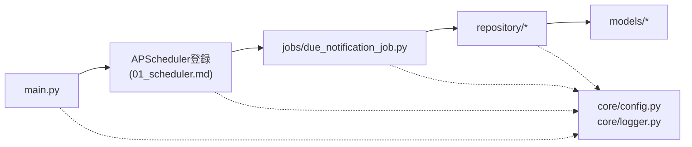

# batch/00 全体設計

## 0. 関連ドキュメント

- 基本設計：[../../basic_design/00_overview.md](../../basic_design/00_overview.md)（§1/§2/§3/§6/§7/§8）、[../../basic_design/01_database.md](../../basic_design/01_database.md)（§3.5 tasks、§3.8 notifications、§5.5 `sp_purge_notifications`）、[../../basic_design/02_redis.md](../../basic_design/02_redis.md)（§4.4）、[../../basic_design/06_infra_cicd.md](../../basic_design/06_infra_cicd.md)（§2/§2.1/§3.3/§4.5）
- 詳細設計：[01_scheduler.md](./01_scheduler.md)、[02_due_notification_job.md](./02_due_notification_job.md)、[../log/00_history.md](../log/00_history.md)、[../database/12_table_batch_history.md](../database/12_table_batch_history.md)、[../infra/01_docker_compose.md](../infra/01_docker_compose.md)、[../infra/08_dockerfile_batch.md](../infra/08_dockerfile_batch.md)、[../infra/04_env_config.md](../infra/04_env_config.md)、[../database/06_table_tasks.md](../database/06_table_tasks.md)、[../database/08_db_functions.md](../database/08_db_functions.md)

## 1. 概要

| 項目 | 内容 |
|------|------|
| 対象 | `batch/` 配下一式（専用コンテナ。API とは別プロセス・別イメージ） |
| 責務 | 要件書§3.4 N-1 の定期実行（毎日10時・17時の期限通知）を、10時用・17時用の2つのcronジョブとして常駐スケジューラで担う。バックエンドAPIのプロセス内では実行しない |
| 適用条件 | `docker compose up -d batch`。CD/CIでも `batch` イメージを独立してビルド・デプロイする |
| 依存先 | PostgreSQL（`db/migrations` は backend の Alembic が正）、Redis（実行ロック）。`api/app` への import 依存はない |
| 実装ファイル | `batch/app/main.py`、`batch/app/core/{config.py,logger.py}`、`batch/app/jobs/due_notification_job.py`、`batch/app/repository/`、`batch/app/models/`、`batch/Dockerfile`、`batch/requirements.txt` |

## 2. ディレクトリ構成

```
batch/
├── app/
│   ├── main.py                 # エントリポイント。APScheduler起動 or --run-once実行
│   ├── core/
│   │   ├── config.py           # pydantic-settings による Settings
│   │   └── logger.py           # logging設定（backendのcore/logger.pyと同等の方針）
│   ├── jobs/
│   │   └── due_notification_job.py   # 期限通知ジョブ本体
│   ├── repository/
│   │   ├── task_repository.py        # 期限通知対象タスクの抽出
│   │   ├── notification_repository.py # notificationsへのINSERT
│   │   ├── purge_repository.py       # sp_purge_notificationsの呼び出し
│   │   └── redis_lock.py             # 実行ロックの取得
│   ├── models/
│   │   ├── task.py             # tasksのORMモデル（backend側の再定義。§5参照）
│   │   └── notification.py     # notificationsのORMモデル（同上）
│   ├── db.py                   # SQLAlchemy 非同期エンジン・セッションファクトリ
│   └── redis_client.py         # Redis接続プール
├── tests/
│   ├── unit/
│   ├── integration/
│   └── conftest.py
├── Dockerfile
└── requirements.txt
```

1ファイル概ね200行程度・許容300行程度を目安に、`jobs`（何を・いつ）と `repository`（どう永続化アクセスするか）の責務を分離する。

## 3. 依存方向



依存の方向は `jobs → repository → models` の一方向とし、`core` は全層から参照可能な共通基盤とする（`api/app` と同じ設計方針、[../../basic_design/00_overview.md](../../basic_design/00_overview.md) §3）。逆方向（`repository` から `jobs` を参照する等）は禁止する。

## 4. `api/app` を import しない理由

| 観点 | 内容 |
|------|------|
| コンテナ独立性 | `batch` と `backend` は別イメージ・別コンテナであり、実行時に互いのソースを共有しない（[../infra/01_docker_compose.md](../infra/01_docker_compose.md)）。`import app...` は `api/` パッケージが `batch` イメージ内に存在しないため実行時エラーとなる |
| デプロイの独立性 | `backend` のリリースサイクルと `batch` のリリースサイクルを分離できる（片方のみのホットフィックスが可能） |
| 責務の分離 | `batch` はDB/Redisへ直接アクセスし、HTTP API層（認証・認可・入出力DTO）を経由しない。`api/app` のルータ・サービス層を持ち込む必要がない |

この方針の結果、ORMモデル（`tasks`/`notifications` に相当する部分）を `batch/app/models/` に**二重定義**する必要がある。

## 5. ORMモデルの二重定義と整合の担保

| 項目 | 内容 |
|------|------|
| 二重定義の範囲 | `batch` が実際に読み書きする列のみ（`tasks`: `id`/`status`/`assignee_id`/`due_at`/`created_at` 等、`notifications`: 全列）。`task_comments` 等、期限通知ジョブが使わないテーブルは `batch` 側にモデルを作らない |
| マイグレーションの正 | `api/alembic/versions/` の Alembic マイグレーションのみがスキーマ変更を実行する。`batch` はマイグレーションを一切実行しない（[../infra/01_docker_compose.md](../infra/01_docker_compose.md) §2.1、[../infra/08_dockerfile_batch.md](../infra/08_dockerfile_batch.md)） |
| 整合の担保手段 | ① CI の `batch-test` ジョブで、`backend-test` と同一の `services: postgres` に対して `alembic upgrade head` 適用後に `batch` の統合テストを実行し、`batch/app/models/*` が実スキーマに対して失敗しないことを検証する（[../infra/05_ci_workflow.md](../infra/05_ci_workflow.md)）。② `tasks`/`notifications` のカラム変更（Alembicリビジョン追加）時は、レビュー観点として `batch/app/models/*` の追随を必須項目にする（レビュー運用のみで、自動検知の仕組みは本設計の範囲外。§13参照） |
| 不変条件 | `batch` 側モデルは `NOT NULL`/`CHECK`/デフォルト値をAPI側と同一に保つ。差異があるとINSERT時に想定外の制約違反、またはUPDATE漏れが起きる |

## 6. 設定管理（pydantic-settings）

`batch/app/core/config.py` に `Settings(BaseSettings)` を定義し、`api/app/core/config.py`（[../infra/04_env_config.md](../infra/04_env_config.md)）と同じ方針で環境変数を型付きで一元管理する。`batch` が参照する主な変数は `DATABASE_URL` / `REDIS_URL` / `APP_TIMEZONE` / `NOTIFICATION_RETENTION_DAYS` / `NOTIFY_DUE_RUN_HOURS` / `NOTIFY_DUE_CRON_MINUTE` / `NOTIFY_DUE_TARGET_HOUR` / `NOTIFY_DUE_LOCK_TTL_SECONDS` / `NOTIFY_DUE_BATCH_CHUNK_SIZE` / `BATCH_ENABLED` / `LOG_LEVEL`。詳細は [../infra/04_env_config.md](../infra/04_env_config.md) を参照。`batch` は `AUTH_MODE` や Cookie 関連等の認証系変数を持たない（`extra="forbid"` により誤って参照すれば起動時に検知される）。

## 7. ログ方針

| 項目 | 内容 |
|------|------|
| 形式 | 構造化ログ（`core/logger.py`、`LOG_LEVEL` で制御）。`backend` と同一方針 |
| 出力内容 | ジョブ開始・終了、実行ロックの取得成否、抽出件数・作成件数、`sp_purge_notifications` の呼び出し結果 |
| リクエストID | 存在しない（HTTPリクエストを持たないため）。ジョブ実行ごとに一意な `run_id`をログと`batch_history`へ付与し、1回の実行を相関できるようにする |
| 秘匿情報 | `DATABASE_URL`/`REDIS_URL` の資格情報部分をログへ出力しない |
| DB履歴 | ジョブ開始時に`inprogress`をINSERTし、正常時は`complete`、失敗時は`error`へUPDATEする。履歴操作失敗はジョブ結果を隠さず標準出力へ記録する |

## 8. `--run-once` による手動実行

| 項目 | 内容 |
|------|------|
| コマンド | `docker compose run --rm batch python -m app.main --run-once due_notification --slot 10`（[../../basic_design/06_infra_cicd.md](../../basic_design/06_infra_cicd.md) §2.1、[07_operation.md](../infra/07_operation.md)） |
| 用途 | 障害時の当日分リカバリ、動作確認。常駐スケジューラを起動せず、指定ジョブを1回だけ実行してプロセスを終了する |
| ロックとの関係 | `--run-once` でも指定した実行枠の Redis 実行ロックの取得を試みる（[01_scheduler.md](./01_scheduler.md) §4、[02_due_notification_job.md](./02_due_notification_job.md) §4）。当日・同一枠がロック済みの場合は取得失敗として即終了し、二重実行にはならない |
| 詳細設計 | 引数解析・分岐は [01_scheduler.md](./01_scheduler.md) §3 に記載 |

## 9. テスト方針

| 区分 | 方針 |
|------|------|
| 単体テスト | `jobs`/`repository` を個別にモック化して検証（pytest、`backend` と同様の構成） |
| 結合テスト | 実PostgreSQL・実Redis（CIでは `services`）に接続し、`alembic upgrade head` 適用後のスキーマに対して `due_notification_job` を実行して検証 |
| カバレッジ | `omit` は不要に追加しない。対象範囲は基本設計・CI詳細設計（[../infra/05_ci_workflow.md](../infra/05_ci_workflow.md)）に準拠 |
| CI | `batch-test` ジョブ（ruff / mypy / pytest）。詳細は [../infra/05_ci_workflow.md](../infra/05_ci_workflow.md) |

## 10. 不明点・要検討事項

| 区分 | 内容 | 影響 |
|------|------|------|
| 要検討 | ORMモデルの二重定義について、CIでの自動検知（例：`api`/`batch` 両モデルのカラム定義を比較する専用テスト）を追加するかは基本設計に明記がなく、本書はレビュー運用のみを前提とした。実装時に自動比較テストの追加を検討したい | `batch/tests/`、[../infra/05_ci_workflow.md](../infra/05_ci_workflow.md) |
| 要検討 | `batch/app/models/` に置くモデルの範囲（読み取り専用の `tasks` を `Mapped` の一部列のみで定義するか、全列定義するか）は実装時の裁量とする | `batch/app/models/task.py` |
| 不明 | `batch` コンテナの将来的なジョブ追加（例：他の定期処理）時に `jobs/` をどう分割するかは要件書スコープ外であり本設計では触れない | 将来のジョブ追加時の設計 |
