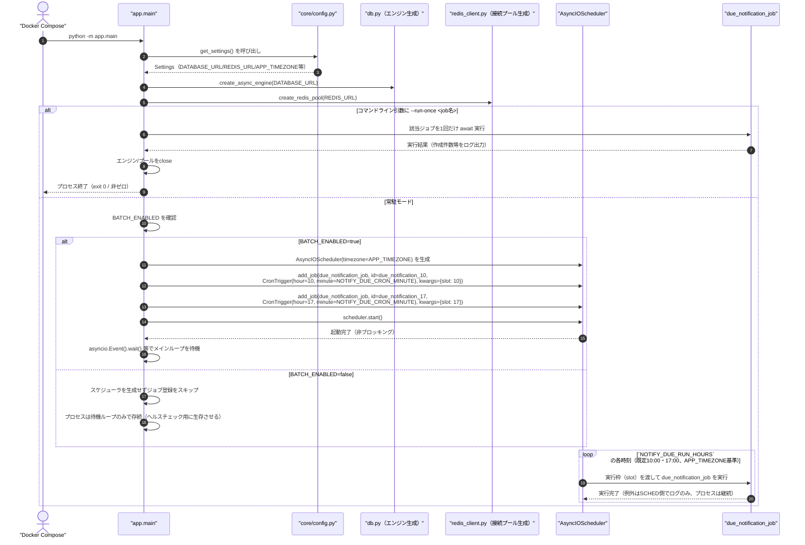
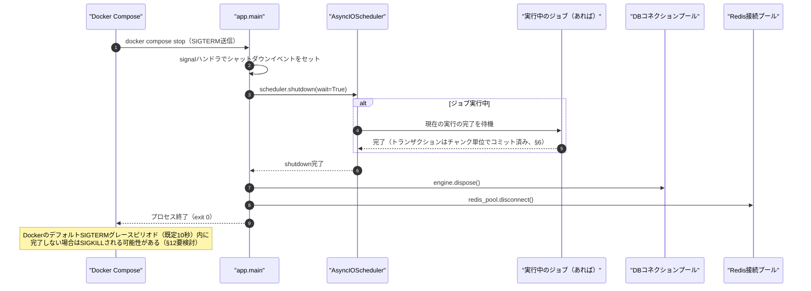
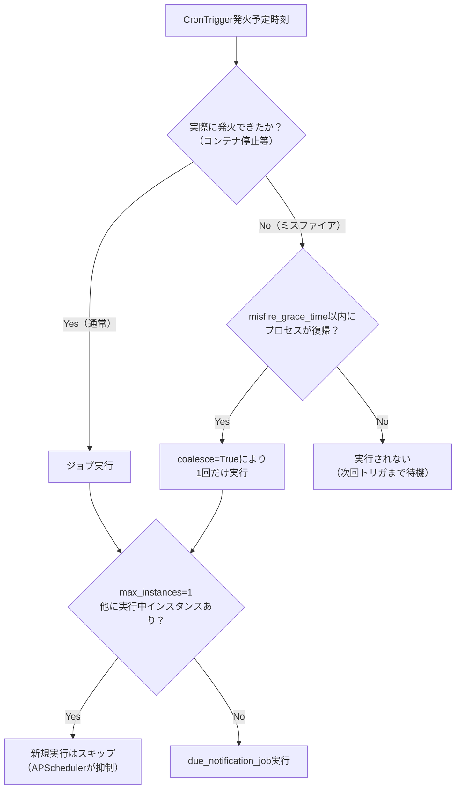
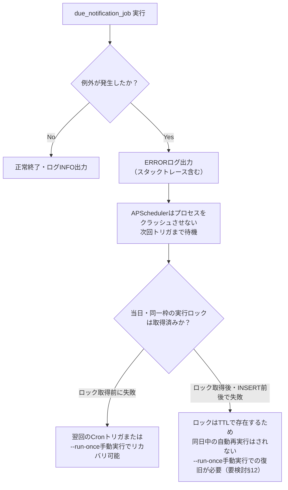

# batch/01 スケジューラ詳細設計

## 0. 関連ドキュメント

- 基本設計：[../../basic_design/00_overview.md](../../basic_design/00_overview.md)（§7/§8）、[../../basic_design/06_infra_cicd.md](../../basic_design/06_infra_cicd.md)（§2.1）、[../../basic_design/02_redis.md](../../basic_design/02_redis.md)（§4.4）
- 詳細設計：[00_overview.md](./00_overview.md)、[02_due_notification_job.md](./02_due_notification_job.md)、[../log/00_history.md](../log/00_history.md)、[../database/12_table_batch_history.md](../database/12_table_batch_history.md)、[../infra/01_docker_compose.md](../infra/01_docker_compose.md)、[../infra/04_env_config.md](../infra/04_env_config.md)、[../infra/07_operation.md](../infra/07_operation.md)

## 1. 概要

| 項目 | 内容 |
|------|------|
| 対象 | `batch/app/main.py`（常駐プロセスのエントリポイント） |
| 責務 | APScheduler の `AsyncIOScheduler` を起動し、`CronTrigger`（タイムゾーン `APP_TIMEZONE`）で10時用・17時用の `due_notification_job` を2つ登録・実行する。`BATCH_ENABLED=false` の場合はジョブを登録せず常駐のみ行う |
| 適用条件 | `docker compose up -d batch`（常駐実行）、または `python -m app.main --run-once due_notification --slot 10|17`（1回実行） |
| 依存先 | `apscheduler`（`AsyncIOScheduler`, `CronTrigger`）、`asyncio`、SQLAlchemy 非同期エンジン、`redis-py`（非同期） |
| 実装ファイル | `batch/app/main.py` |

## 2. 全体の出入力

| 区分 | 内容 |
|------|------|
| 入力 | 起動時コマンドライン引数（`--run-once <job名>` の有無）、環境変数（`core/config.py` 経由） |
| 出力 | プロセスの標準出力への構造化ログ、`batch_history`の開始・完了・失敗履歴。常駐時は終了しない（プロセスとして稼働し続ける） |
| 副作用 | DBコネクションプール・Redis接続プールの生成、`batch_history`の状態更新、ジョブ実行時の`notifications`へのINSERTと保持期間パージ |

## 3. 起動シーケンス

## 4. `BATCH_ENABLED=false` の挙動

| 項目 | 内容 |
|------|------|
| 目的 | CI・検証環境で「常駐するが通知は作成しない」状態を作れるようにする（[../../basic_design/06_infra_cicd.md](../../basic_design/06_infra_cicd.md) §4.5） |
| 挙動 | `AsyncIOScheduler` へジョブを `add_job` しない。プロセスはコンテナのヘルスチェック（プロセス生存監視、§7）に応答するため終了しない |
| `--run-once` との関係 | `BATCH_ENABLED` の値に関わらず `--run-once <job名>` はジョブを実行する（手動実行はフラグの影響を受けない、[00_overview.md](./00_overview.md) §8）。誤って `BATCH_ENABLED=false` のまま `--run-once` の運用に依存しないよう、§9運用手順に明記する（[../infra/07_operation.md](../infra/07_operation.md)） |
| ログ | 起動時に `BATCH_ENABLED=false` を INFO ログで明示し、運用者が意図せぬ無効化に気づけるようにする |

## 5. グレースフルシャットダウン（SIGTERM）

`scheduler.shutdown(wait=True)` により、実行中のジョブ本体（[02_due_notification_job.md](./02_due_notification_job.md)）が処理中のチャンクを完了してから終了する。新規のジョブトリガは受け付けない。

## 6. `misfire_grace_time` / `coalesce` / `max_instances` の方針

| 設定 | 値 | 理由 |
|------|-----|------|
| `misfire_grace_time` | 環境変数化せずコード定数として大きめの値（例：3600秒）を設定する想定（§12要検討。基本設計に明記なし） | コンテナ再起動やホスト再起動で実行時刻を過ぎてしまった場合でも、一定時間内なら実行を試みる（欠損を減らす） |
| `coalesce` | `True` | ミスファイアが複数積み重なっても1回にまとめて実行する（同一実行枠で複数回突然実行される事態を避ける）。当日・同一枠は結果的にRedis実行ロック（§4.4、[02_due_notification_job.md](./02_due_notification_job.md)）でも二重実行が防止される（二重防御） |
| `max_instances` | `1` | 同一ジョブの並行実行を許可しない。前回実行が長引いても次回トリガと重複起動させない |

## 7. DB・Redis接続プールのライフサイクル

| 項目 | 内容 |
|------|------|
| DB | `db.py` が `create_async_engine(DATABASE_URL, pool_size=..., max_overflow=...)` を起動時に1度だけ生成し、プロセス終了まで再利用する。`DATABASE_POOL_SIZE`/`DATABASE_MAX_OVERFLOW`（[../infra/04_env_config.md](../infra/04_env_config.md)）を `api` と共通の変数名で参照する |
| Redis | `redis_client.py` が `redis.asyncio.ConnectionPool.from_url(REDIS_URL)` を起動時に1度だけ生成する |
| 再接続 | 個々の操作失敗時にコネクションプール自体を再生成しない（プール内の切断済み接続は次回利用時に自動再接続される、`redis-py`/`SQLAlchemy` 標準動作に依存） |
| クローズ | SIGTERM受信時（§5）に `engine.dispose()` / `redis_pool.disconnect()` を呼び、明示的にクローズする |

## 8. ヘルスチェック（プロセス生存監視）

| 項目 | 内容 |
|------|------|
| 方式 | HTTPエンドポイントを持たないため、`python -c "import os; os.kill(1, 0)"` によるPID 1の生存確認を `docker-compose.yml` の `HEALTHCHECK` として使う（[../infra/01_docker_compose.md](../infra/01_docker_compose.md) §8.2） |
| 判定内容 | 「メインプロセスが生きているか」のみを見る。スケジューラが実際にジョブを登録できているか、直近の実行が成功したかは**ヘルスチェックの対象外**（§12要検討） |
| 運用時の確認 | 実行結果（成功/失敗、作成件数）は `docker compose logs batch` で確認する（[../infra/07_operation.md](../infra/07_operation.md)） |

## 9. 失敗時の扱い

| 項目 | 内容 |
|------|------|
| ジョブ内例外 | ジョブ関数内で捕捉しERRORログを出力後、例外を握ってプロセスを継続させる（1回の失敗でプロセス全体を落とさない） |
| プロセスクラッシュ | 予期しないクラッシュ時は Docker の `restart: unless-stopped`（[../infra/01_docker_compose.md](../infra/01_docker_compose.md) §2.1）により再起動される。再起動後はスケジューラが再登録され、次回のCronトリガまで待機する |
| 当日分のリカバリ | ロック取得後に失敗した場合、対象枠の再実行は `--run-once due_notification --slot 10|17` の手動実行に依る（§4、[02_due_notification_job.md](./02_due_notification_job.md) §3のロック仕様） |

## 10. テスト設計

| No | 区分 | ケース | 前提 | 期待結果 | テスト名案 |
|----|------|--------|------|----------|-----------|
| 1 | 単体 | `BATCH_ENABLED=true` でジョブが登録される | `Settings(batch_enabled=True)` | `scheduler.add_job` が呼ばれる | `test_main_registers_job_when_enabled` |
| 2 | 単体 | `BATCH_ENABLED=false` でジョブが登録されない | `Settings(batch_enabled=False)` | `scheduler.add_job` が呼ばれない | `test_main_skips_job_when_disabled` |
| 3 | 単体 | 10時・17時の2つの `CronTrigger` が `APP_TIMEZONE`・設定値で構成される | `NOTIFY_DUE_RUN_HOURS=10,17` を注入 | `add_job` が2回呼ばれ、各 `hour`/`minute`/`timezone` と `slot` が期待値と一致 | `test_main_registers_two_cron_triggers` |
| 4 | 単体 | `--run-once due_notification` でジョブが1回だけ実行され常駐しない | CLI引数を模擬 | ジョブが1回 await 実行され、`scheduler.start()` が呼ばれない | `test_main_run_once_executes_job_without_scheduler` |
| 5 | 単体 | SIGTERM受信で `scheduler.shutdown(wait=True)` が呼ばれる | シグナルハンドラを模擬発火 | `shutdown` 呼び出し確認、`engine.dispose()`/`redis_pool.disconnect()` 呼び出し確認 | `test_main_sigterm_graceful_shutdown` |
| 6 | 結合 | ジョブ内で例外が発生してもプロセスが継続する | ジョブをモックし例外を送出させる | ERRORログ出力後もプロセス（イベントループ）が終了しない | `test_main_job_exception_does_not_crash_process` |
| 7 | 結合 | `max_instances=1` により前回実行中は新規実行がスキップされる | 長時間実行のジョブをモック、Cronを短間隔に上書き | 2回目の実行がAPSchedulerにより抑制される | `test_scheduler_max_instances_prevents_overlap` |
| 網羅できない範囲 | 実際のCronトリガ発火タイミング（時計依存）の自動テスト | - | `freezegun`等での時刻固定テストに留め、実時刻でのE2E確認は手動とする | - |

## 11. 関数詳細（`batch/app/main.py`）

| 関数 | シグネチャ | 処理内容 |
|------|-----------|----------|
| `main` | `def main() -> None` | CLI引数解析（`argparse`。`--run-once <job名> --slot <10|17>`）→ `asyncio.run(async_main(args))` |
| `async_main` | `async def async_main(args: Namespace) -> None` | Settings取得 → DB/Redisプール生成 → `--run-once` 分岐 or 常駐スケジューラ起動 → シャットダウン処理 |
| `build_scheduler` | `def build_scheduler(settings: Settings) -> AsyncIOScheduler` | `AsyncIOScheduler(timezone=settings.app_timezone)` を生成し、`BATCH_ENABLED=true` の場合のみ `NOTIFY_DUE_RUN_HOURS` の各値に対応する2つのcronジョブを `add_job` する |
| `handle_sigterm` | `def handle_sigterm(scheduler: AsyncIOScheduler, shutdown_event: asyncio.Event) -> None` | `signal.signal(SIGTERM, ...)` から呼ばれ、`shutdown_event.set()` してメインループを終了させる |

## 12. 不明点・要検討事項

| 区分 | 内容 | 影響 |
|------|------|------|
| 要検討 | `misfire_grace_time` の具体値（例示3600秒）は基本設計に明記がなく、本書が学習用途の仮値として提案した。コード定数か環境変数化するかも未確定 | `batch/app/main.py` の `add_job` 呼び出し |
| 要検討 | ヘルスチェックが「プロセス生存」のみで「直近ジョブの成功」を見ない点について、運用上十分か（[../infra/07_operation.md](../infra/07_operation.md) の手動確認手順に依存する）は要検討 | [../infra/01_docker_compose.md](../infra/01_docker_compose.md) §8.2 |
| 要検討 | ロック取得後に失敗した当日・同一枠を自動リトライする仕組み（例：一定時間後に再試行）を持たせるかは基本設計に明記がなく、本書は手動 `--run-once` のみを前提とした | [02_due_notification_job.md](./02_due_notification_job.md) §3 |
| 不明 | Docker停止時のSIGTERMグレースピリオド（既定10秒）が、チャンク処理中のジョブの安全な中断に十分かは実測が必要 | `docker-compose.yml` の `stop_grace_period` 設定要否（[../infra/01_docker_compose.md](../infra/01_docker_compose.md)） |
