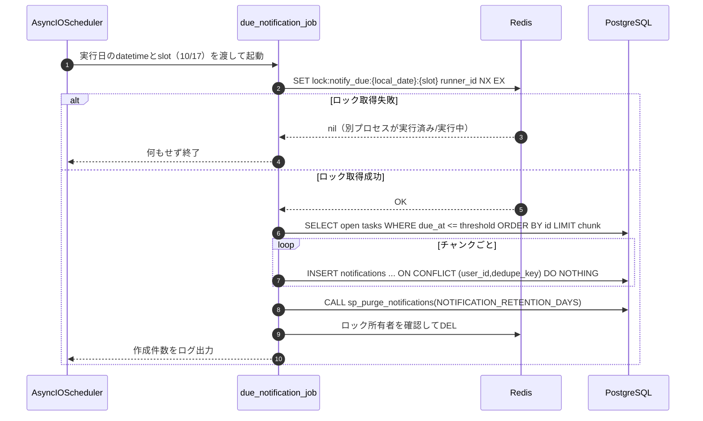

# batch/02 期限通知ジョブ詳細設計

## 0. 関連ドキュメント

| ドキュメント | 内容 |
|--------------|------|
| [../../basic_design/01_database.md](../../basic_design/01_database.md) | §3.5 tasks、§3.8 notifications、§5.5 `sp_purge_notifications`、§7 Q-7 |
| [../../basic_design/02_redis.md](../../basic_design/02_redis.md) | 期限通知実行ロック `lock:notify_due:{YYYY-MM-DD}:{slot}` |
| [../../basic_design/06_infra_cicd.md](../../basic_design/06_infra_cicd.md) | §2.1 batchコンテナ、§4.5通知設定 |
| [./00_overview.md](./00_overview.md) | batchの依存方向・設定・手動実行 |
| [./01_scheduler.md](./01_scheduler.md) | APSchedulerからの起動 |
| [../database/10_table_notifications.md](../database/10_table_notifications.md) | 通知DDL・`dedupe_key` |
| [../database/08_db_functions.md](../database/08_db_functions.md) | `sp_purge_notifications` |

## 1. 概要

| 項目 | 内容 |
|------|------|
| 対象 | `batch/app/jobs/due_notification_job.py :: run_due_notification_job` |
| 実行時刻 | `NOTIFY_DUE_RUN_HOURS`（既定10時・17時）の各値に対応する2つのcronジョブ。分は `NOTIFY_DUE_CRON_MINUTE`、`APP_TIMEZONE`基準 |
| 対象タスク | `status <> 'done'`、`assignee_id IS NOT NULL`、`due_at IS NOT NULL`、`due_at <= 翌日10:00` |
| 下限 | 設けない。期限切れタスクも当日のリマインド対象とする |
| 作成通知 | 担当者へ `type='due_soon_batch'` を作成 |
| 重複防止 | Redisの日付・実行枠別ロックと `UNIQUE (user_id, dedupe_key)` の二重防御 |
| 保持期間 | ジョブ末尾で `sp_purge_notifications(NOTIFICATION_RETENTION_DAYS)` を実行 |

「翌日10時まで」は境界値を含む（`due_at <= threshold`）。10時・17時の両枠で同じ境界を使う。DBにはUTCで保存し、`threshold`は実行日の`APP_TIMEZONE`翌日 `NOTIFY_DUE_TARGET_HOUR`（既定10時）をUTCへ変換する。

## 2. 入出力仕様

| 区分 | 内容 |
|------|------|
| 入力 | `Settings`、現在時刻、PostgreSQL、Redis |
| 出力 | 作成件数、スキップ件数、ログ。通知行と期限超過通知の削除 |
| 副作用 | Redisロック取得、notifications INSERT、`sp_purge_notifications`実行 |

## 3. 処理シーケンス



## 4. 抽出・通知作成規則

```sql
SELECT id, project_id, title, assignee_id, due_at
  FROM tasks
 WHERE status <> 'done'
   AND assignee_id IS NOT NULL
   AND due_at IS NOT NULL
   AND due_at <= :threshold_utc
 ORDER BY id
 LIMIT :chunk_size;
```

通知は次の値をスナップショットする。

| カラム | 値 |
|--------|----|
| `user_id` | `tasks.assignee_id` |
| `task_id` | `tasks.id` |
| `type` | `due_soon_batch` |
| `title` | `tasks.title` |
| `body` | `期限が近いタスクです`（表示文言は定数化し、将来の多言語化に備える） |
| `due_at` | 抽出時点の`tasks.due_at` |
| `dedupe_key` | `batch:{local_date}:{slot}:{task_id}` |

同じタスクが同一実行枠で複数回抽出されても、`ON CONFLICT DO NOTHING`で1通知に収める。10時枠と17時枠は `slot` が異なるため、それぞれ1通知を作成する。翌日は日付が変わるため新しいリマインドを作成する。

## 5. Redisロック

ロックキーは `lock:notify_due:{APP_TIMEZONEの実行日}:{slot}`、値はランナー固有の`runner_id`、TTLは`NOTIFY_DUE_LOCK_TTL_SECONDS`とする。取得は `SET key runner_id NX EX ttl`。解放時はLuaまたはトランザクションで値を比較してからDELし、別実行者のロックを削除しない。TTL満了後の同一枠の再実行はDBの一意制約で重複を防ぐ。

## 6. 失敗時の扱い

| 失敗箇所 | 扱い |
|----------|------|
| Redis接続不能 | fail-close。通知作成を行わずERRORログ。次回スケジュールまたは`--run-once`で再実行 |
| タスクSELECT/INSERT失敗 | チャンクのトランザクションをロールバックしERRORログ。ジョブ全体を失敗扱い |
| パージ失敗 | 通知作成済みデータは維持し、ジョブを失敗扱い。次回にパージを再試行 |
| 1タスクの不正データ | エラーを記録し、他タスクの処理を継続できる単位で分離 |

ロック取得後の失敗でもロックはTTLで自然解放される。成功時のみ所有者確認後に解放する。

## 7. 関数詳細

| 関数 | シグネチャ | 責務 |
|------|------------|------|
| `run_due_notification_job` | `async def run_due_notification_job(now: datetime, settings: Settings, notification_slot: str) -> JobResult` | ローカル日付・共通閾値算出、日付・実行枠別ロック、抽出、通知作成、パージ |
| `iter_due_tasks` | `AsyncIterator[DueTask]` | `due_at <= threshold`のタスクをチャンク取得 |
| `bulk_create_due_notifications` | `async def ...(tasks, run_date, notification_slot) -> int` | `ON CONFLICT DO NOTHING`で一括INSERT |
| `purge_notifications` | `async def purge_notifications(retention_days: int) -> int` | `CALL sp_purge_notifications(...)` |

batchのrepositoryはAPIのrouter/serviceをimportしない。接続・ORMモデル・通知INSERTをbatch内で完結させる。

## 8. テスト設計

| No | 区分 | ケース | 期待結果 | テスト名案 |
|----|------|--------|----------|------------|
| 1 | 単体 | 10時・17時実行時の閾値計算 | どちらも翌日10時ちょうどを含む同じUTC値になる | `test_due_threshold_is_shared_by_both_slots` |
| 2 | 結合 | 期限切れ・当日・翌日10時ちょうどを含む | 未完了かつ担当者ありの3件が対象 | `test_due_job_selects_past_and_boundary_tasks` |
| 3 | 結合 | `status='done'`、未割当、期限NULL | 通知を作成しない | `test_due_job_excludes_done_unassigned_and_no_due` |
| 4 | 結合 | 同じ実行枠のジョブを2回実行 | 2回目の作成件数0、重複なし | `test_due_job_is_idempotent_on_same_slot` |
| 5 | 結合 | 10時枠と17時枠を実行 | 同じタスクに各枠1件ずつ通知を作成する | `test_due_job_creates_one_notification_per_slot` |
| 6 | 結合 | 2プロセスが同じ実行枠で同時実行 | Redisロック取得者だけが抽出する | `test_due_job_uses_slot_scoped_redis_lock` |
| 7 | 結合 | 通知保持期間を超過した行がある | パージされ、期間内の行は残る | `test_due_job_purges_expired_notifications` |
