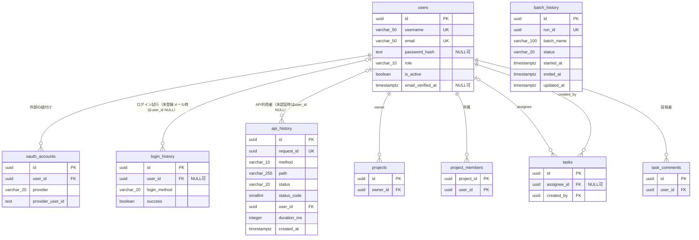

# DB詳細設計 00 設計方針

## 0. 関連ドキュメント

- `../../basic_design/01_database.md`（正。本書はこれを詳細化したものであり、内容が矛盾する場合は基本設計側が正）
- `../../basic_design/00_overview.md`
- `../../requirements/task_management_requirements.md`
- `./01_table_users.md` / `./02_table_oauth_accounts.md` / `./03_table_login_history.md` / `./11_table_api_history.md` / `./12_table_batch_history.md`（本書の方針に従うテーブル詳細）

## 1. 本書の位置づけ

`basic_design/01_database.md` の設計方針・命名規約・型方針・共通カラム・列挙表現・削除方針・ER図を、実装（DDL・SQLAlchemyモデル・マイグレーション）に落とし込めるレベルまで詳細化する。テーブル個別の定義（カラム定義・DDL・インデックス・リポジトリ関数）は `01_table_*.md` 以降で扱い、本書では全テーブルに共通する方針のみを扱う。

`users` / `oauth_accounts` / `login_history` / `notifications` / `api_history` / `batch_history` の詳細は本書とあわせて各テーブル設計書を参照する。`projects` 以降のテーブルおよび DB関数・マイグレーション運用は別担当ファイル（`04_table_projects.md` 〜 `12_table_batch_history.md`）で扱うため本書では個別定義を繰り返さない。

## 2. 基本方針（`basic_design/01_database.md` §1 の再掲・詳細化）

| 項目 | 方針 | 補足 |
|------|------|------|
| DBMS | PostgreSQL 17 | Docker Compose の `postgres` サービス |
| 保存対象 | 永続的に残す必要のあるデータのみ | ログイン有効性の判定は Redis 側（`../../basic_design/02_redis.md`） |
| 主キー | `UUID`（`gen_random_uuid()`、`pgcrypto` 拡張） | URL露出時の連番推測を防止 |
| 文字列型 | 入力上限がある項目は `VARCHAR(n)`、それ以外は `TEXT` | 上限は基本設計のカラム定義に従う |
| 日時型 | `TIMESTAMPTZ`（UTC保存） | `APP_TIMEZONE`（既定`Asia/Tokyo`）を基準にアプリ層で表示・日次境界を判定し、DBへはUTCで保存する |
| 列挙 | `VARCHAR + CHECK制約` | PostgreSQLの `ENUM` 型は使わない（Alembicでの値追加が容易なため） |
| 論理削除 | 行わない（物理削除） | `users` のみ `is_active` で無効化を表現。他テーブルはFKの `ON DELETE` 挙動に従う |
| ORM | SQLAlchemy 2.x（`Mapped` / `mapped_column` の宣言的スタイル） | `api/app/models/` |
| マイグレーション | Alembic | `db/migrations/` は手動DDL置き場、`api/alembic/versions/` が実行される正（詳細は `09_migration.md`） |

### 2.1 業務ロジックを伴うDBアクセスの責務所在（roadmap #12 に基づく方針）

業務ロジックを伴うDBアクセス（参照系・更新系を問わない）は、**原則としてPostgreSQLのストアドプロシージャ／関数（SP/FN）層が正**とする。repository層はSP/FN呼び出しの薄いラッパーとして実装し、repository層自体に業務判定・条件分岐・複数テーブルにまたがる整合性制御を持たせない。

- SP/FNは `db/functions/`（実装）・`08_db_functions.md`（詳細設計）で定義する。命名は `sp_<動詞>_<対象>`（例：`sp_create_task` / `sp_deactivate_user`）、参照系は `fn_<動詞>_<対象>` を基本とする（詳細命名規約は `08_db_functions.md` に従う）。
- repository層（`api/app/repository/`）は原則としてSP/FNの呼び出し（`CALL` / `SELECT`）とその戻り値のORM/DTOへの変換のみを担い、業務判定はSP/FN側に委譲する。
- service層はSP/FN呼び出し結果（正常値・エラーコード）に基づく後続処理（レスポンス整形・通知トリガ等、DBアクセスを伴わない処理）を担当する。
- **repository層がテーブルへ直接アクセスしてよい例外**（SP/FN経由を要さない）：
  1. `GET /api/health` のDB疎通確認（単純な `SELECT 1` のみ。業務ロジックを含まない）
  2. Alembicマイグレーション内のDDL適用・初期データseed（`api/alembic/versions/`）
  3. テストフィクスチャ（`tests/` 配下のテストデータ準備・後始末）

上記以外でテーブルへ直接SQLを発行する実装（ORMの `session.query` / `session.execute` によるSELECT・INSERT・UPDATE・DELETEを含む）は、業務ロジックを伴う限りSP/FN経由への置き換えを原則とする。

> 旧方針（「それ以外のビジネスロジックは基本的にAPI（service/repository層）が正」という暗黙の前提）は本節により撤回し、上記に置き換える。

## 3. 命名規約

| 対象 | 規約 | 例 |
|------|------|-----|
| テーブル名 | 複数形スネークケース | `users` / `oauth_accounts` / `login_history`（例外：不可算名詞はそのまま） |
| カラム名 | スネークケース | `email_verified_at` |
| 主キー制約名 | `pk_<table>` | `pk_users` |
| 外部キー制約名 | `fk_<table>_<column>_<ref_table>` | `fk_oauth_accounts_user_id_users` |
| CHECK制約名 | `ck_<table>_<column>` | `ck_users_role` |
| 一意制約名 | `uq_<table>_<column(s)>` | `uq_oauth_accounts_provider_provider_user_id` |
| インデックス名 | `ix_<table>_<column(s)>` | `ix_users_created_at` |
| 外部キー参照カラム | `<単数形テーブル名>_id` | `user_id` → `users.id` |
| SQLAlchemyモデルクラス | 単数形パスカルケース | `User` / `OAuthAccount` / `LoginHistory` |
| ORMモデルファイル | `models/<単数形スネークケース>.py` | `models/user.py` |
| リポジトリファイル | `repository/<単数形スネークケース>_repository.py` | `repository/user_repository.py` |

制約名・インデックス名はAlembicの `op.create_check_constraint` 等に明示的に渡し、自動生成された無名の制約名に依存しない。

## 4. 型方針（詳細）

| 論理型 | PostgreSQL型 | SQLAlchemy型 | 備考 |
|--------|--------------|--------------|------|
| ID | `UUID` | `UUID(as_uuid=True)`（`sqlalchemy.dialects.postgresql`） | 既定値はDB側 `server_default=text("gen_random_uuid()")` |
| 短い文字列（上限あり） | `VARCHAR(n)` | `String(n)` | `n` は基本設計のカラム定義表に従う |
| 長文・可変長 | `TEXT` | `Text` | `password_hash` / `description` / `body` 等 |
| 真偽値 | `BOOLEAN` | `Boolean` | |
| 整数 | `INTEGER` | `Integer` | `position` / `version` 等 |
| 日付のみ | `DATE` | `Date` | `birth_date` |
| 日時 | `TIMESTAMPTZ` | `datetime` | `tasks.due_at` / `notifications.due_at`。DBはUTC保存、表示・日次判定は`APP_TIMEZONE` |
| 日時（タイムゾーン付き） | `TIMESTAMPTZ` | `DateTime(timezone=True)` | UTCで保存 |
| IPアドレス | `INET` | `INET`（`sqlalchemy.dialects.postgresql`） | `login_history.ip_address` |
| 列挙 | `VARCHAR(n) + CHECK` | `String(n)` + `CheckConstraint` | Python側は `Literal` 型または `enum.StrEnum` をスキーマ層（pydantic）で使用し、DB側は文字列として保持 |

## 5. 共通カラム

全テーブル共通ではなく、テーブルの性質ごとに以下の共通パターンを適用する（`basic_design/01_database.md` のER図・テーブル定義に準拠）。

| パターン | 対象カラム | 適用テーブル |
|----------|-----------|--------------|
| 主キー | `id UUID PK DEFAULT gen_random_uuid()` | `users` / `oauth_accounts` / `projects` / `tasks` / `task_comments` / `login_history` / `api_history` / `batch_history`（`project_members` のみ複合PKで対象外） |
| 作成日時 | `created_at TIMESTAMPTZ NOT NULL DEFAULT now()` | 通常の永続テーブルと`api_history`。`batch_history`は起動時刻を`started_at`として保持 |
| 更新日時 | `updated_at TIMESTAMPTZ NOT NULL DEFAULT now()`（トリガで自動更新） | `users` / `projects` / `tasks` / `task_comments` / `batch_history`（状態更新を持つテーブル）。`oauth_accounts` / `login_history` / `api_history` / `project_members`は追記専用 |

`updated_at` の自動更新は `db/functions/trg_set_updated_at.sql`（トリガ関数）を対象テーブルの `BEFORE UPDATE` に適用する（詳細は `04_table_projects.md` 以降および `08_db_functions.md` を参照。`users` テーブルへの適用は `01_table_users.md` §3・§4 に記載）。

## 6. UUID採番方針

- 主キーの採番は **DB側**（`gen_random_uuid()`）で行い、アプリ層でUUIDを生成してINSERTすることはしない。理由：採番責務をDBに一元化し、複数の挿入経路（API・マイグレーションのseed）で採番ロジックが分岐しないようにするため。例外として `api_history.request_id` は主キーではない相関IDのため、API履歴ミドルウェアが `uuid.uuid4()` で生成してレスポンス・ログ・DBへ同じ値を渡す。
- `pgcrypto` 拡張を初期マイグレーションで `CREATE EXTENSION IF NOT EXISTS pgcrypto` により有効化する（`09_migration.md` の初期リビジョンで実施。本書では前提のみ記載）。
- SQLAlchemyモデル側では `mapped_column(UUID(as_uuid=True), primary_key=True, server_default=text("gen_random_uuid()"))` とし、Python側で `default=uuid4` は設定しない（DBの既定値と二重管理にしないため）。
- UUIDのバージョンはPostgreSQLの `gen_random_uuid()` が生成する v4 に従う。
- `request_id` の生成元は API の履歴ミドルウェア、形式は UUID v4 文字列とする（例：`550e8400-e29b-41d4-a716-446655440000`）。DBの `api_history.id` は `gen_random_uuid()`、`request_id` はアプリから必須値としてINSERTする。
- `08_db_functions.md` の新規作成系SP（`sp_create_project` / `sp_create_task` / `sp_add_task_comment` / `sp_register_user` 等）は本方針（DB側採番）に従い、主キーをAPI側から引数で受け取らずSP内部で採番してOUTパラメータで返す。

## 7. CHECK制約による列挙表現

`ENUM` 型を使わず `VARCHAR(n) + CHECK` で列挙を表現する方針（理由：Alembicでの値追加時に `ALTER TYPE ... ADD VALUE` のトランザクション制約を回避できるため）。

| テーブル | カラム | 許容値 | 制約名 |
|----------|--------|--------|--------|
| `users` | `role` | `member` / `admin` | `ck_users_role` |
| `oauth_accounts` | `provider` | `google` | `ck_oauth_accounts_provider` |
| `tasks` | `status` | `todo` / `in_progress` / `done` | `ck_tasks_status` |
| `login_history` | `login_method` | `session` / `jwt` / `oauth_google` | `ck_login_history_login_method` |
| `api_history` | `status` | `success` / `error` | `ck_api_history_status` |
| `batch_history` | `trigger_type` | `scheduled` / `manual` | `ck_batch_history_trigger_type` |
| `batch_history` | `status` | `inprogress` / `complete` / `error` | `ck_batch_history_status` |

CHECK制約の記述形式：`CHECK (<column> IN ('value1', 'value2', ...))`。値の追加はAlembicのマイグレーションで `CHECK` 制約を `DROP` → `ADD` し直す（値の削除を伴わない追加であれば新しいリビジョンで制約定義を更新する）。

アプリ層（pydantic schemas）でも同じ許容値を `Literal` または `enum.StrEnum` として二重に定義し、リクエストバリデーションの時点で不正値を弾く（DB側のCHECK制約は最終防衛線）。

## 8. 物理削除方針

- 全テーブルで論理削除フラグ（`deleted_at` 等）は持たない。削除はSQLの `DELETE` による物理削除を基本とする。
- 例外は `users` / `projects` / `tasks` の3テーブルで、`is_active`（管理者・オーナー・作成者による無効化）を用いて「利用停止」を表現する（issue #10で`projects`/`tasks`に拡張）。これら3テーブルに対する物理削除API自体は基本設計で提供されない（`01_table_users.md` §7、`04_table_projects.md`、`06_table_tasks.md` の各リポジトリ関数節を参照）。`DELETE /api/projects/{id}`・`DELETE /api/tasks/{id}` はいずれも `is_active=false` へのUPDATEとして実装する。
- `is_active=false` への更新処理の実装主体は**SP**（`sp_deactivate_users` / `sp_deactivate_projects` / `sp_deactivate_tasks` 等の `sp_deactivate_*`）とする（§2.1の方針に従う）。repository層はこれらSPの呼び出しのみを行い、無効化に伴う付随処理（権限チェック・関連レコードの整合性制御等）はSP側に持たせる。
- 親テーブル削除時の子テーブル挙動は外部キーの `ON DELETE` 句に従う（`CASCADE` / `RESTRICT` / `SET NULL`）。ただし `users` / `projects` / `tasks` はアプリケーションAPIとして物理削除経路を提供しないため、これらを起点とする `ON DELETE CASCADE` / `SET NULL` は通常運用では発火しない防御的制約という位置づけになる。各テーブルの詳細は `01_table_users.md` 〜 `03_table_login_history.md` の「制約・インデックス」節、および `projects` 以降は担当ファイルを参照。
- `login_history` / `api_history` / `batch_history` は保持期間超過分をそれぞれの `sp_purge_*_history` プロシージャによる物理削除の対象とする（保持期間はそれぞれ90日 / 30日 / 30日）。

## 9. 全体ER図

`users` / `oauth_accounts` / `login_history` を中心に、関連する他テーブルとの関係のみを示す（`projects` 以降の内部構造は担当ファイルを参照）。

## 10. マイグレーション運用との関係

DDLの実適用（Alembicリビジョンの構成・初期データseed・CI/CDでの `alembic upgrade head` 実行タイミング）は `09_migration.md`（別担当）で扱う。本書および `01_table_*.md` 〜 `03_table_*.md` に記載するDDLは、Alembicリビジョンに落とし込む際の設計上の正として参照される。

## 11. 不明点・要検討事項

- ~~`TIMESTAMPTZ` で保存した日時をアプリ層でどのタイムゾーンに変換して返却するか~~ → issue #40で確定。API応答は`APP_TIMEZONE`でのオフセット付きISO 8601文字列に変換して返却する（[`basic_design/01_database.md` §1](../../basic_design/01_database.md#1-設計方針)参照）。
- CHECK制約の値追加時のAlembic運用（`DROP CONSTRAINT` → `ADD CONSTRAINT` の具体的な手順・ダウングレード時の扱い）は `09_migration.md` 側で詳細化が必要（本書では方針のみ記載）。要検討。
- ~~エラーコード対応表をDB側とAPI側のどちらを正とするか~~ → roadmap #12 phase1（task1.2）にて`P0001`〜`P0009`共通＋MESSAGE文字列方式で確定済み。`08_db_functions.md` §4と`basic_design/04_api.md` §4.2が1対1で対応する（[`quality_check.md` §3](./../quality_check.md)で合格確認済み）。
- ~~admin操作（role変更・強制ログアウト等）でのRedisセッション失効順序制御~~ → issue #40で確認。実際にDB更新とRedis失効の両方を伴うのは無効化API（`sp_admin_update_user_status`）のみで、既に「DB先行→成功後Redis失効（フェイルセーフ側＝無効化済みに倒す）」で確定・実装済み（[`api/admin/03_patch_admin_user_status.md`](../api/admin/03_patch_admin_user_status.md) §4参照）。role変更はRedisを更新せず、強制ログアウトはDBを更新しないため、これら2操作には順序保証の論点自体が発生しない。今後DB+Redis複合更新を伴うadmin操作を追加する場合は、この確定パターン（DB先行）を踏襲する。
- 本節§2.1の新方針は roadmap #12 に基づく先行改訂であり、basic_designとdetailed_designの改訂順序が本書冒頭「## 0. 関連ドキュメント」記載の文書間優先順位ルール（矛盾時は基本設計が正）と一時的に矛盾する期間が生じる。当該期間の扱い（basic_design側の追従改訂タイミング・暫定的な優先順位の扱い）は要検討。
- ヘルスチェック（`GET /api/health`）を例外としてSP/FN化しない方針（本書§2.1に反映済み）が有力だが、roadmap #12 側での最終確定はまだ済んでいない。要検討。
- `api_history` 記録ミドルウェアをSP化した場合の全リクエストへのレイテンシ影響は未検証。要検討（性能検証が必要）。
- `APP_TIMEZONE` を `sp_create_task` 等のSP/FNへ呼び出しの都度引数として渡すか、DBセッションのカスタムGUC（`SET app.timezone = ...`）として扱うかは未確定。要検討。
- repository層がSP/FN呼び出しの薄いラッパーに縮小すること（本書§2.1）に伴い、SQLAlchemy ORMモデル（`api/app/models/`）の存在意義自体が変わる可能性がある（型定義・スキーマ検証用途への縮小等）。要検討。
