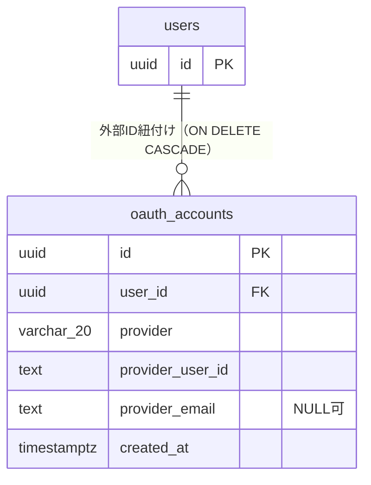
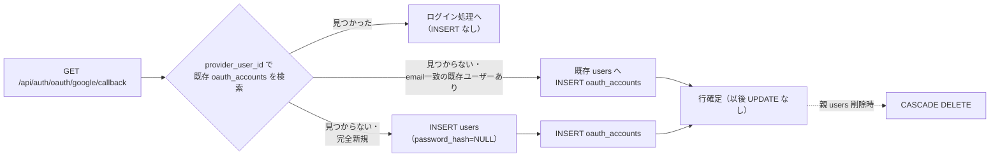
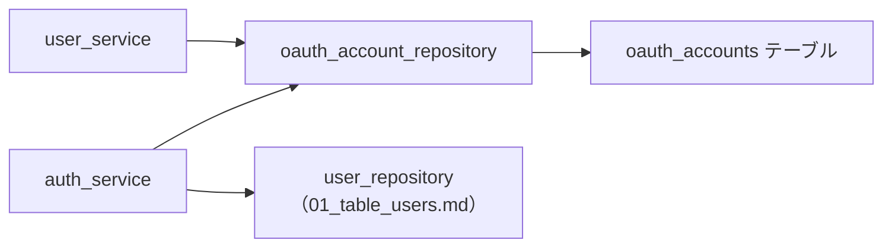

# DB詳細設計 02 oauth_accounts テーブル

## 0. 関連ドキュメント

- `../../basic_design/01_database.md`（§3.2 oauth_accounts、正）
- `../../basic_design/03_auth.md`（§7 Google OAuth2 フロー）
- `./00_policy.md`（命名規約・型方針・共通カラム）
- `./01_table_users.md`（親テーブル）
- `../api/auth/11_get_auth_oauth_google.md` / `../api/auth/12_get_auth_oauth_google_callback.md` / `../api/auth/13_post_auth_oauth_exchange.md`

## 1. 概要

| 項目 | 内容 |
|------|------|
| テーブル名 / 論理名 | `oauth_accounts` / OAuth外部ID紐付け |
| 役割 | Google OAuth2でログインしたユーザーの外部ID（`sub`）と `users` を紐付ける。将来の他プロバイダ追加を見越した構造 |
| 想定件数・増加傾向 | Googleログインを利用したユーザー数に比例。1ユーザーにつき現状は最大1行（プロバイダは `google` のみ） |
| ライフサイクル | 作成契機：Google OAuth初回ログイン時（新規ユーザー作成時、または既存ユーザーへの紐付け時）。更新契機：**なし**（`updated_at` を持たない）。削除契機：親ユーザー削除時のCASCADEのみ（削除APIは提供されない） |
| 関連ORMモデル | `models/oauth_account.py :: OAuthAccount` |

## 2. カラム定義

`basic_design/01_database.md` §3.2 の定義から逸脱しない。

| 論理名 | カラム名 | 型 | NULL | 既定値 | 主キー/一意 | 説明 |
|--------|----------|----|------|--------|--------------|------|
| ID | `id` | UUID | NO | `gen_random_uuid()` | PK | |
| ユーザーID | `user_id` | UUID | NO | - | FK → `users.id`（`ON DELETE CASCADE`） | |
| プロバイダ | `provider` | VARCHAR(20) | NO | - | - | `google`（CHECK。将来の拡張余地） |
| プロバイダ側ユーザーID | `provider_user_id` | TEXT | NO | - | UNIQUE（`provider`との複合） | Googleの `sub`（不変の識別子） |
| プロバイダ側メール | `provider_email` | TEXT | YES | - | - | 参考情報。変更され得るため識別子には使わない |
| 作成日時 | `created_at` | TIMESTAMPTZ | NO | `now()` | - | |

`updated_at` は持たない（`00_policy.md` §5のとおり、追記のみで更新契機がないテーブルのため）。

## 3. DDL

```sql
CREATE TABLE oauth_accounts (
    id                 UUID         NOT NULL DEFAULT gen_random_uuid(),
    user_id            UUID         NOT NULL,
    provider           VARCHAR(20)  NOT NULL,
    provider_user_id   TEXT         NOT NULL,
    provider_email     TEXT,
    created_at         TIMESTAMPTZ  NOT NULL DEFAULT now(),
    CONSTRAINT pk_oauth_accounts PRIMARY KEY (id),
    CONSTRAINT fk_oauth_accounts_user_id_users FOREIGN KEY (user_id)
        REFERENCES users (id) ON DELETE CASCADE,
    CONSTRAINT ck_oauth_accounts_provider CHECK (provider IN ('google'))
);

COMMENT ON TABLE oauth_accounts IS 'OAuth外部ID（Google等）と users の紐付け';
COMMENT ON COLUMN oauth_accounts.provider_user_id IS 'プロバイダ側の不変識別子（Googleの sub）';
COMMENT ON COLUMN oauth_accounts.provider_email IS '参考情報。変更される可能性があるため識別子に使わない';

CREATE UNIQUE INDEX uq_oauth_accounts_provider_provider_user_id
    ON oauth_accounts (provider, provider_user_id);
CREATE INDEX ix_oauth_accounts_user_id ON oauth_accounts (user_id);
```

## 4. 制約・インデックス

| 種別 | 名称 | 対象カラム | 内容 | 目的（対応クエリ） |
|------|------|-----------|------|---------------------|
| PK | `pk_oauth_accounts` | `id` | 主キー | |
| FK | `fk_oauth_accounts_user_id_users` | `user_id` | `ON DELETE CASCADE` | 親ユーザー削除時に紐付けも消える（削除API自体は未提供） |
| CHECK | `ck_oauth_accounts_provider` | `provider` | `IN ('google')` | 未対応プロバイダの混入防止 |
| UNIQUE | `uq_oauth_accounts_provider_provider_user_id` | `(provider, provider_user_id)` | 同一プロバイダの同一外部IDの重複紐付けを防止 | OAuthコールバック時の既存アカウント検索（`basic_design/03_auth.md` §7.2） |
| INDEX | `ix_oauth_accounts_user_id` | `user_id` | B-tree | `GET /api/users/me` 等でユーザーの連携状況を取得する際の逆引き |

`user_id` 単体の重複は許容する（将来 `google` 以外のプロバイダが追加された場合、同一ユーザーが複数プロバイダを持てるようにするため）。ただし現状 `provider='google'` のみのため、実質1ユーザー1行運用となる。

## 5. SQLAlchemyモデル定義

```python
class OAuthAccount(Base):
    __tablename__ = "oauth_accounts"

    id: Mapped[uuid.UUID] = mapped_column(
        UUID(as_uuid=True), primary_key=True, server_default=text("gen_random_uuid()")
    )
    user_id: Mapped[uuid.UUID] = mapped_column(
        UUID(as_uuid=True), ForeignKey("users.id", ondelete="CASCADE"), nullable=False
    )
    provider: Mapped[str] = mapped_column(String(20), nullable=False)
    provider_user_id: Mapped[str] = mapped_column(Text, nullable=False)
    provider_email: Mapped[str | None] = mapped_column(Text, nullable=True)
    created_at: Mapped[datetime] = mapped_column(DateTime(timezone=True), server_default=func.now())

    user: Mapped["User"] = relationship(back_populates="oauth_accounts", lazy="joined")

    __table_args__ = (
        CheckConstraint("provider IN ('google')", name="ck_oauth_accounts_provider"),
        UniqueConstraint("provider", "provider_user_id", name="uq_oauth_accounts_provider_provider_user_id"),
    )
```

`user` は `lazy="joined"` とする。OAuthコールバック処理では `OAuthAccount` 取得と同時にユーザー情報（`is_active` 判定等）が必要になるため、N+1を避ける目的で常時JOINする。

## 6. ER関連図



## 7. データ遷移図

状態カラムは持たないため、行の生成契機のみを示す（更新は発生せず、削除は親ユーザー削除時のCASCADEのみ）。



## 8. リポジトリ関数詳細

### 8.1 `repository/oauth_account_repository.py :: get_by_provider_identity`

| 項目 | 内容 |
|------|------|
| シグネチャ | `async def get_by_provider_identity(db: AsyncSession, provider: str, provider_user_id: str) -> OAuthAccount \| None` |
| 引数 / 戻り値 | `provider`：`'google'` 固定 / `provider_user_id`：Googleの `sub` / 該当行（`user` をJOIN済み）または `None` |
| 発行SQL | `SELECT * FROM oauth_accounts WHERE provider = :provider AND provider_user_id = :provider_user_id`（`user` は `lazy="joined"` によりJOINして取得） |
| 使用インデックス | `uq_oauth_accounts_provider_provider_user_id` |
| 送出例外 | なし |
| 処理内容 | 1. OAuthコールバック時に既存紐付けの有無を判定する（`basic_design/03_auth.md` §7.2 のフロー起点） |

### 8.2 `repository/oauth_account_repository.py :: create`

| 項目 | 内容 |
|------|------|
| シグネチャ | `async def create(db: AsyncSession, user_id: UUID, provider: str, provider_user_id: str, provider_email: str \| None) -> OAuthAccount` |
| 引数 / 戻り値 | 紐付け対象の各値 / 作成後の `OAuthAccount` |
| 発行SQL | `INSERT INTO oauth_accounts (user_id, provider, provider_user_id, provider_email) VALUES (:user_id, :provider, :provider_user_id, :provider_email) RETURNING *` |
| 使用インデックス | `uq_oauth_accounts_provider_provider_user_id`（一意制約違反検出） |
| 送出例外 | `IntegrityError`（同一 `provider`+`provider_user_id` が既に存在する場合。通常は事前に `get_by_provider_identity` で存在確認するため到達しない想定だが、同時リクエストの競合時に発生し得る） |
| 処理内容 | 1. 新規ユーザー作成時、または既存ユーザーへの紐付け時に1件INSERT |

### 8.3 `repository/oauth_account_repository.py :: list_by_user_id`

| 項目 | 内容 |
|------|------|
| シグネチャ | `async def list_by_user_id(db: AsyncSession, user_id: UUID) -> list[OAuthAccount]` |
| 引数 / 戻り値 | 対象ユーザーID / 紐付け一覧 |
| 発行SQL | `SELECT * FROM oauth_accounts WHERE user_id = :user_id` |
| 使用インデックス | `ix_oauth_accounts_user_id` |
| 送出例外 | なし |
| 処理内容 | 1. `GET /api/users/me` でGoogle連携状況を表示する際に使用（現状は最大1件） |

## 9. 関数相関図



## 10. 想定クエリと性能

| No | ユースケース | クエリ概要 | 使用インデックス | 想定計画 |
|----|--------------|-----------|-------------------|----------|
| 1 | OAuthコールバック時の既存紐付け検索 | `WHERE provider=:p AND provider_user_id=:sub` | `uq_oauth_accounts_provider_provider_user_id` | Index Scan（一意ヒット） |
| 2 | ユーザーの連携一覧取得 | `WHERE user_id=:uid` | `ix_oauth_accounts_user_id` | Index Scan（件数少） |

## 11. 整合性・並行制御

| 観点 | 内容 |
|------|------|
| 外部キーCASCADE | `user_id` は `ON DELETE CASCADE`。親 `users` が物理削除された場合（現状APIなし）に連動削除される |
| 楽観ロック | なし（更新自体が発生しないテーブルのため不要） |
| advisory lock | 使用しない |
| トランザクション境界 | OAuth新規ユーザー作成時は `users` へのINSERTと `oauth_accounts` へのINSERTを同一トランザクションで行い、失敗時は双方ロールバックする（`basic_design/03_auth.md` §7.2 のシーケンスに対応） |
| 同時実行時の競合 | 同一Googleアカウントで同時に複数タブからコールバックが発生した場合、2件目のINSERTは `uq_oauth_accounts_provider_provider_user_id` 違反となる。service層は `IntegrityError` を捕捉し、再度 `get_by_provider_identity` で取得し直してログイン処理を継続する（要検討：本フォールバック処理は基本設計に明記がないため実装時に確定させる） |

## 12. テスト設計

| No | 区分 | ケース | 期待結果 | テスト名案 |
|----|------|--------|----------|-----------|
| 1 | 制約 | 同一 `(provider, provider_user_id)` でINSERTを2回実行 | 2回目が `IntegrityError`（`uq_oauth_accounts_provider_provider_user_id`） | `test_create_oauth_account_duplicate_identity_raises` |
| 2 | 制約 | `provider` に `'google'` 以外を設定 | `IntegrityError`（`ck_oauth_accounts_provider`） | `test_oauth_accounts_provider_check_constraint` |
| 3 | 制約 | 存在しない `user_id` でINSERT | `IntegrityError`（`fk_oauth_accounts_user_id_users`） | `test_create_oauth_account_invalid_user_id_raises` |
| 4 | CASCADE | 親 `users` を削除 | `oauth_accounts` の該当行が0件になる | `test_delete_user_cascades_oauth_accounts` |
| 5 | 並行制御 | 同一 `provider_user_id` で同時に2件INSERTを発行 | 片方は成功、もう片方は `IntegrityError` となり一意性が保たれる | `test_concurrent_create_oauth_account_same_identity` |
| 6 | リポジトリ | `get_by_provider_identity` で `user` がJOIN済みで取得できるか | 追加クエリなしで `user.email` 等にアクセスできる | `test_get_by_provider_identity_eager_loads_user` |

## 13. 不明点・要検討事項

- 同一Googleアカウントでの同時コールバック競合時、`IntegrityError` 発生後にどこまで自動リトライ（再取得してログイン継続）するかの具体的な実装方針は基本設計に明記がない。要検討。
- 将来 `provider` に `google` 以外（例：GitHub等）を追加する場合の `ck_oauth_accounts_provider` 制約更新手順は `09_migration.md` 側での検討が必要（本書では対象外）。
