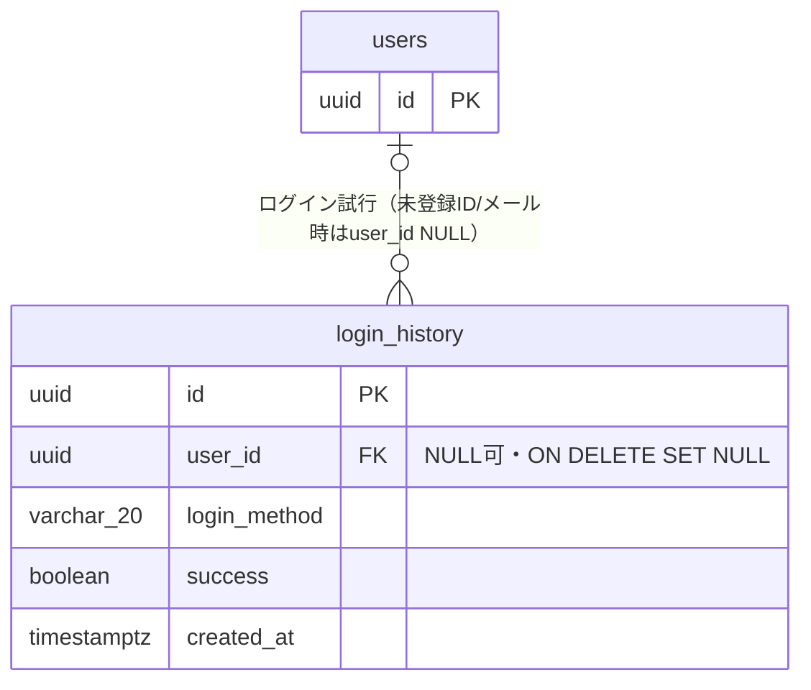
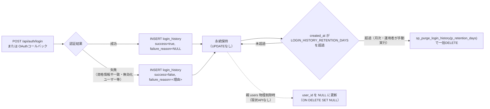
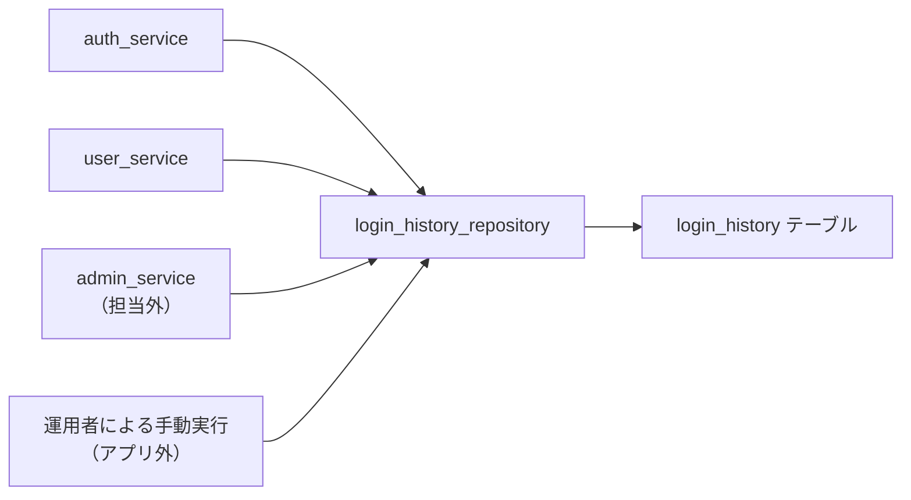

# DB詳細設計 03 login_history テーブル

## 0. 関連ドキュメント

- `../../basic_design/01_database.md`（§3.7 login_history、§5.4 `sp_purge_login_history`、正）
- `../../basic_design/03_auth.md`（ログイン・OAuth・登録フローでの記録契機）
- `../../basic_design/00_overview.md`（§7 データ全体像：Redisの失効判定とPostgreSQL監査ログの分離方針）
- `./00_policy.md`（命名規約・型方針・共通カラム・物理削除方針）
- `./01_table_users.md`（親テーブル）
- `../api/users/04_get_users_me_login_history.md`
- `../api/admin/07_get_admin_login_history.md`
- `../database/08_db_functions.md`（`sp_purge_login_history` の実行方式。担当外だが参照のみ行う）

## 1. 概要

| 項目 | 内容 |
|------|------|
| テーブル名 / 論理名 | `login_history` / ログイン試行履歴（監査ログ） |
| 役割 | ログイン試行（成功・失敗いずれも）の監査ログ。Redis側のセッション/リフレッシュトークンのTTL失効とは独立して「誰が・いつ・どの方式で・成功したか」を永続的に記録する |
| 想定件数・増加傾向 | **INSERTのみで単調増加**。ログイン試行（成功・失敗問わず）のたびに1行追加されるため、他テーブルより増加速度が速い。学習用途では小規模だが、設計としては「件数が最も速く増えるテーブル」として扱う |
| ライフサイクル | 作成契機：`POST /api/auth/login` の成否確定時、OAuthコールバック成功時（`login_method='oauth_google'`）。更新契機：**なし**（追記専用、`updated_at` を持たない）。削除契機：保持期間（既定90日、環境変数 `LOGIN_HISTORY_RETENTION_DAYS`）超過分を `sp_purge_login_history` プロシージャで一括物理削除（運用者が月次で手動実行。アプリ内cronは設けない） |
| 関連ORMモデル | `models/login_history.py :: LoginHistory` |

## 2. カラム定義

`basic_design/01_database.md` §3.7 の定義から逸脱しない。

| 論理名 | カラム名 | 型 | NULL | 既定値 | 主キー/一意 | 説明 |
|--------|----------|----|------|--------|--------------|------|
| ID | `id` | UUID | NO | `gen_random_uuid()` | PK | |
| ユーザーID | `user_id` | UUID | YES | - | FK → `users.id`（`ON DELETE SET NULL`） | 存在しないID/メール入力時はNULL |
| 入力識別子 | `login_identifier` | VARCHAR(50) | NO | - | - | 入力された username / email（原文。パスワードは記録しない） |
| ログイン方式 | `login_method` | VARCHAR(20) | NO | - | - | `session` / `jwt` / `oauth_google`（CHECK） |
| IPアドレス | `ip_address` | INET | YES | - | - | `TRUSTED_PROXY_CIDRS`に含まれる直近ProxyからのXFFだけを解決して取得。未信頼時は接続元IP |
| ユーザーエージェント | `user_agent` | TEXT | YES | - | - | |
| 成否 | `success` | BOOLEAN | NO | - | - | |
| 失敗理由 | `failure_reason` | VARCHAR(50) | YES | - | - | `invalid_credentials` / `user_inactive` / `oauth_denied` 等 |
| 作成日時 | `created_at` | TIMESTAMPTZ | NO | `now()` | - | |

パスワードリセットの実行履歴は本テーブルに含めない（`login_method` のCHECK制約を汚さないため。基本設計スコープでは `security_events` テーブルも追加しない）。

## 3. DDL

```sql
CREATE TABLE login_history (
    id                UUID          NOT NULL DEFAULT gen_random_uuid(),
    user_id           UUID,
    login_identifier  VARCHAR(50)   NOT NULL,
    login_method      VARCHAR(20)   NOT NULL,
    ip_address        INET,
    user_agent        TEXT,
    success           BOOLEAN       NOT NULL,
    failure_reason    VARCHAR(50),
    created_at        TIMESTAMPTZ   NOT NULL DEFAULT now(),
    CONSTRAINT pk_login_history PRIMARY KEY (id),
    CONSTRAINT fk_login_history_user_id_users FOREIGN KEY (user_id)
        REFERENCES users (id) ON DELETE SET NULL,
    CONSTRAINT ck_login_history_login_method
        CHECK (login_method IN ('session', 'jwt', 'oauth_google')),
    CONSTRAINT ck_login_history_failure_reason_consistency
        CHECK ((success = true AND failure_reason IS NULL) OR (success = false))
);

COMMENT ON TABLE login_history IS 'ログイン試行の監査ログ。Redis側のTTL失効とは独立して保持する';
COMMENT ON COLUMN login_history.login_identifier IS '入力された username / email の原文。パスワードは記録しない';
COMMENT ON COLUMN login_history.user_id IS '未登録ID/メール入力時はNULL';

CREATE INDEX ix_login_history_user_created ON login_history (user_id, created_at DESC);
CREATE INDEX ix_login_history_created ON login_history (created_at DESC);
```

`ck_login_history_failure_reason_consistency` は基本設計に明記のない補助的CHECK制約であり、「成功時に failure_reason が入っている」というデータ不整合をDB側で防ぐ目的で追加した（§13参照。基本設計と矛盾する仕様ではなく、基本設計のカラム説明を素直に制約化したもの）。

## 4. 制約・インデックス

| 種別 | 名称 | 対象カラム | 内容 | 目的（対応クエリ） |
|------|------|-----------|------|---------------------|
| PK | `pk_login_history` | `id` | 主キー | |
| FK | `fk_login_history_user_id_users` | `user_id` | `ON DELETE SET NULL` | ユーザー無効化時にも監査ログを残す。他テーブルと異なり `RESTRICT` ではなく `SET NULL`（監査ログの独立性を優先） |
| CHECK | `ck_login_history_login_method` | `login_method` | `IN ('session','jwt','oauth_google')` | 不正な方式の混入防止 |
| CHECK | `ck_login_history_failure_reason_consistency` | `success`, `failure_reason` | 成功時は `failure_reason` がNULL | データ不整合の防止（本書独自の補助制約） |
| INDEX | `ix_login_history_user_created` | `(user_id, created_at DESC)` | 複合B-tree | ユーザー別ログイン履歴取得（Q-6、`GET /api/users/me/login-history`） |
| INDEX | `ix_login_history_created` | `(created_at DESC)` | B-tree | 管理者による全体ログイン履歴一覧（`GET /api/admin/login-history`）、および `sp_purge_login_history` の削除対象特定 |

`user_id` 単体のインデックスは作成しない（`ix_login_history_user_created` の先頭カラムとして機能を包含するため）。

## 5. SQLAlchemyモデル定義

```python
class LoginHistory(Base):
    __tablename__ = "login_history"

    id: Mapped[uuid.UUID] = mapped_column(
        UUID(as_uuid=True), primary_key=True, server_default=text("gen_random_uuid()")
    )
    user_id: Mapped[uuid.UUID | None] = mapped_column(
        UUID(as_uuid=True), ForeignKey("users.id", ondelete="SET NULL"), nullable=True
    )
    login_identifier: Mapped[str] = mapped_column(String(50), nullable=False)
    login_method: Mapped[str] = mapped_column(String(20), nullable=False)
    ip_address: Mapped[str | None] = mapped_column(INET, nullable=True)
    user_agent: Mapped[str | None] = mapped_column(Text, nullable=True)
    success: Mapped[bool] = mapped_column(Boolean, nullable=False)
    failure_reason: Mapped[str | None] = mapped_column(String(50), nullable=True)
    created_at: Mapped[datetime] = mapped_column(DateTime(timezone=True), server_default=func.now())

    user: Mapped["User | None"] = relationship(back_populates="login_histories", lazy="noload")

    __table_args__ = (
        CheckConstraint(
            "login_method IN ('session', 'jwt', 'oauth_google')",
            name="ck_login_history_login_method",
        ),
        CheckConstraint(
            "(success = true AND failure_reason IS NULL) OR (success = false)",
            name="ck_login_history_failure_reason_consistency",
        ),
    )
```

`user` は既定で `lazy="noload"` とする。一覧取得はいずれもリポジトリ関数側で `user_id` を条件に直接クエリするため、ORMリレーション経由での遅延ロードを避け、意図しないN+1を防ぐ。

## 6. ER関連図



## 7. データ遷移図

状態カラムを持たず、追記専用のテーブルであるため、行単位の状態遷移ではなく「生成〜保持〜一括削除」のライフサイクルをフローで示す。



## 8. リポジトリ関数詳細

### 8.1 `repository/login_history_repository.py :: create`

| 項目 | 内容 |
|------|------|
| シグネチャ | `async def create(db: AsyncSession, data: LoginHistoryCreateInput) -> LoginHistory` |
| 引数 / 戻り値 | `data`：`user_id`（NULL可）・`login_identifier`・`login_method`・`ip_address`・`user_agent`・`success`・`failure_reason` / 作成後の `LoginHistory` |
| 発行SQL | `INSERT INTO login_history (user_id, login_identifier, login_method, ip_address, user_agent, success, failure_reason) VALUES (:user_id, :login_identifier, :login_method, :ip_address, :user_agent, :success, :failure_reason) RETURNING *` |
| 使用インデックス | なし（INSERTのみ） |
| 送出例外 | `IntegrityError`（`ck_login_history_login_method` / `ck_login_history_failure_reason_consistency` 違反時。通常はservice層で許容値のみ渡すため到達しない想定） |
| 処理内容 | 1. ログイン試行（成功・失敗）確定直後に必ず1件INSERTする 2. INSERT失敗時はログイン処理を失敗として扱い、成功時に作成したRedis状態を補償削除して `503 SERVICE_UNAVAILABLE` を返す |

### 8.2 `repository/login_history_repository.py :: list_by_user_id`

| 項目 | 内容 |
|------|------|
| シグネチャ | `async def list_by_user_id(db: AsyncSession, user_id: UUID, limit: int = 50, offset: int = 0) -> list[LoginHistory]` |
| 引数 / 戻り値 | 対象ユーザーID・取得件数・オフセット / 新しい順の一覧 |
| 発行SQL | `SELECT * FROM login_history WHERE user_id = :user_id ORDER BY created_at DESC LIMIT :limit OFFSET :offset` |
| 使用インデックス | `ix_login_history_user_created` |
| 送出例外 | なし |
| 処理内容 | 1. `GET /api/users/me/login-history` から呼び出され、自分自身の履歴のみ返す（Q-6。基本設計の既定値 `LIMIT 50` に合わせる） |

### 8.3 `repository/login_history_repository.py :: list_all`

| 項目 | 内容 |
|------|------|
| シグネチャ | `async def list_all(db: AsyncSession, limit: int = 50, offset: int = 0) -> list[LoginHistory]` |
| 引数 / 戻り値 | 取得件数・オフセット / 新しい順の一覧（全ユーザー対象） |
| 発行SQL | `SELECT * FROM login_history ORDER BY created_at DESC LIMIT :limit OFFSET :offset` |
| 使用インデックス | `ix_login_history_created` |
| 送出例外 | なし |
| 処理内容 | 1. `GET /api/admin/login-history`（管理者専用）から呼び出す 2. RBACによる管理者判定はservice層/認可レイヤで行い、本関数はフィルタなしで返す |

### 8.4 `repository/login_history_repository.py :: purge_expired`

| 項目 | 内容 |
|------|------|
| シグネチャ | `async def purge_expired(db: AsyncSession, retention_days: int) -> None` |
| 引数 / 戻り値 | `retention_days`：環境変数 `LOGIN_HISTORY_RETENTION_DAYS` の値 / なし |
| 発行SQL | `CALL sp_purge_login_history(:retention_days)` |
| 使用インデックス | `ix_login_history_created`（プロシージャ内部の `DELETE ... WHERE created_at < ...` で使用） |
| 送出例外 | なし（DBエラーはそのまま呼び出し元に伝播） |
| 処理内容 | 1. 運用者が月次で手動実行するオペレーション用エントリポイント（アプリ内cronは設けない。`basic_design/01_database.md` §5.4） |

## 9. 関数相関図



## 10. 想定クエリと性能

| No | ユースケース | クエリ概要 | 使用インデックス | 想定計画 |
|----|--------------|-----------|-------------------|----------|
| Q-6 | 自分のログイン履歴 | `WHERE user_id=:uid ORDER BY created_at DESC LIMIT 50` | `ix_login_history_user_created` | Index Scan（複合インデックスの先頭一致 + ソート済み） |
| - | 管理者の全体ログイン履歴 | `ORDER BY created_at DESC LIMIT/OFFSET` | `ix_login_history_created` | Index Scan Backward |
| - | 保持期間超過分の一括削除 | `DELETE WHERE created_at < now() - interval` | `ix_login_history_created` | Index Scan（削除範囲の特定） |

## 11. 整合性・並行制御

| 観点 | 内容 |
|------|------|
| 外部キーCASCADE | `user_id` は `ON DELETE SET NULL`。他テーブルの多くが `RESTRICT`/`CASCADE`であるのに対し、監査ログの独立性（ユーザーが無効化・削除されても履歴自体は残す）を優先して `SET NULL` とする |
| 楽観ロック | なし（UPDATEが発生しないテーブルのため不要） |
| advisory lock | 使用しない（`purge_expired` は運用者が手動実行するバッチ処理であり、通常のリクエスト処理と競合する頻度が低いため見送り。同時実行を厳密に防ぐ必要が生じた場合は要検討） |
| トランザクション境界 | PostgreSQLとRedisは同一トランザクションにできないため、`login_history` INSERTを認証成立の完了条件とする。INSERT失敗時はRedis状態を補償削除し、監査ログなしのログインを許可しない |
| 保持期間管理 | `LOGIN_HISTORY_RETENTION_DAYS`（既定90）を超えた行は `sp_purge_login_history` で削除。削除はバッチ処理であり、通常のAPIリクエスト経路からは呼び出さない |

## 12. テスト設計

| No | 区分 | ケース | 期待結果 | テスト名案 |
|----|------|--------|----------|-----------|
| 1 | 制約 | `login_method` に許容値以外を設定 | `IntegrityError`（`ck_login_history_login_method`） | `test_login_history_login_method_check_constraint` |
| 2 | 制約 | `success=true` かつ `failure_reason` に値を設定 | `IntegrityError`（`ck_login_history_failure_reason_consistency`） | `test_login_history_failure_reason_consistency_check` |
| 3 | 制約 | 存在しない `user_id` でINSERT | `IntegrityError`（`fk_login_history_user_id_users`） | `test_create_login_history_invalid_user_id_raises` |
| 4 | 正常系 | `user_id=NULL`（未登録メールでのログイン試行）でINSERT | 正常にINSERTされる | `test_create_login_history_unregistered_identifier` |
| 5 | CASCADE | 親 `users` を削除 | `login_history.user_id` が `NULL` に更新され、行自体は残る | `test_delete_user_sets_login_history_user_id_null` |
| 6 | 件数増加 | 大量件数（例：10,000件）投入時の `list_by_user_id` の応答 | `ix_login_history_user_created` を使用しLIMIT付きで高速応答する（実行計画にIndex Scanが現れる） | `test_list_by_user_id_uses_index_with_large_dataset` |
| 7 | 保持期間 | `retention_days` より古い行と新しい行を混在させて `purge_expired` を実行 | 古い行のみ削除され、新しい行は残る | `test_purge_expired_deletes_only_old_rows` |
| 8 | リポジトリ | `list_all` がRBACの制御なしに全件返すこと（呼び出し元制御の確認） | service層で管理者以外からの呼び出しが拒否される（403） | `test_list_all_login_history_requires_admin_at_service_layer` |

## 13. Issue #8で確定した事項

- `ck_login_history_failure_reason_consistency`（成功時は `failure_reason` をNULLにする制約）は基本設計に明記のない補助的な制約として本書で追加した。基本設計の意図と齟齬がないか要確認。
- `login_history` INSERT失敗時は `503 SERVICE_UNAVAILABLE` とし、成功ログインを返さない。構造化ログへ `event=login_history_write_failed`、`request_id`、対象user_idを記録する（パスワード・トークンは記録しない）。
- `X-Forwarded-For` は `TRUSTED_PROXY_CIDRS` による信頼境界を通過した場合のみ監査IPへ反映する。
- `purge_expired` の実行中に新規ログイン試行のINSERTと競合した場合の挙動（ロック待ち等）は、PostgreSQLの標準的なMVCCに委ねる前提とし、advisory lockは使用しない方針としたが、運用上問題ないか要検討。
- `failure_reason` の許容値一覧（`invalid_credentials` / `user_inactive` / `oauth_denied` 等）はCHECK制約化せず基本設計の「等」表記のまま自由記述としたが、値のガバナンスをDB側でも制約すべきか要検討。
