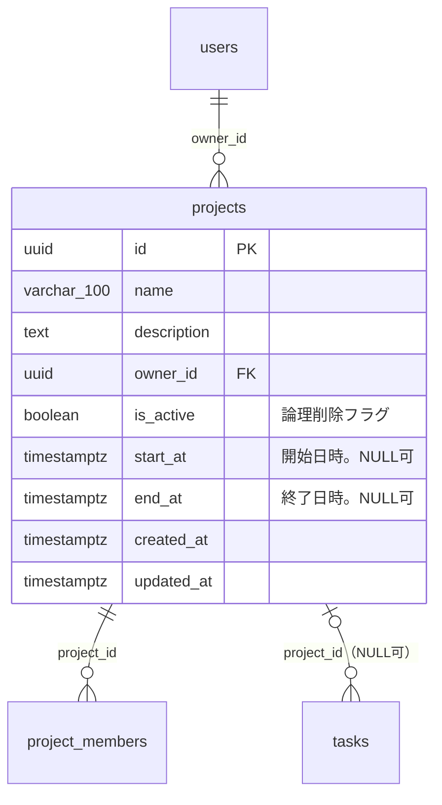
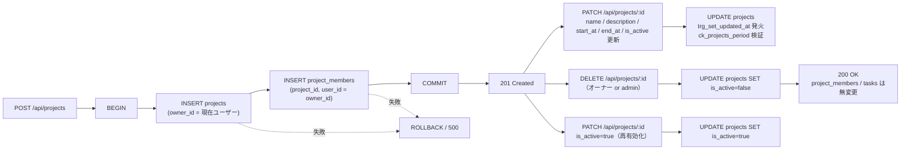
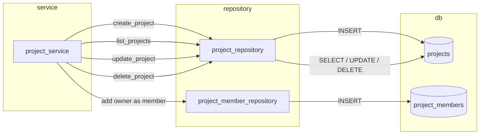

# projects テーブル 詳細設計

## 0. 関連ドキュメント

- 基本設計（正）：[`../../basic_design/01_database.md`](../../basic_design/01_database.md#33-projects)
- 全体設計：[`../../basic_design/00_overview.md`](../../basic_design/00_overview.md)
- 本テーブルを操作するAPI詳細設計
  - [`../api/projects/01_get_projects.md`](../api/projects/01_get_projects.md) GET /api/projects
  - [`../api/projects/02_post_projects.md`](../api/projects/02_post_projects.md) POST /api/projects
  - [`../api/projects/03_get_project.md`](../api/projects/03_get_project.md) GET /api/projects/{project_id}
  - [`../api/projects/04_patch_project.md`](../api/projects/04_patch_project.md) PATCH /api/projects/{project_id}
  - [`../api/projects/05_delete_project.md`](../api/projects/05_delete_project.md) DELETE /api/projects/{project_id}
- 関連テーブル：[`05_table_project_members.md`](./05_table_project_members.md)、[`06_table_tasks.md`](./06_table_tasks.md)、[`01_table_users.md`](./01_table_users.md)

## 1. 概要

| 項目 | 内容 |
|------|------|
| テーブル名 / 論理名 | `projects` / プロジェクト |
| 役割 | チームで共有するタスク管理単位。オーナー1名と複数メンバーが所属する |
| 想定件数・増加傾向 | 学習用途のため小規模（数十〜数百件）。ユーザー数に比例して緩やかに増加 |
| ライフサイクル | 作成契機：`POST /api/projects`（オーナー自身を `project_members` にも同時登録）。更新契機：`PATCH /api/projects/{project_id}`（name/description/start_at/end_at/is_active）。削除契機：`DELETE /api/projects/{project_id}`（オーナー or admin）→ 論理削除（`is_active=false`への更新）。物理削除は行わない。保持期間の定めなし |
| 関連ORMモデル | `models/project.py :: Project` |

## 2. カラム定義

| 論理名 | カラム名 | 型 | NULL | 既定値 | 主キー/一意 | 説明 |
|--------|----------|----|------|--------|--------------|------|
| ID | `id` | UUID | NO | `gen_random_uuid()` | PK | |
| プロジェクト名 | `name` | VARCHAR(100) | NO | - | - | 1〜100文字（アプリ層） |
| 説明 | `description` | TEXT | YES | - | - | |
| オーナー | `owner_id` | UUID | NO | - | FK → `users.id` | `ON DELETE RESTRICT`（オーナーが残る限りユーザー削除不可。本設計ではユーザー物理削除APIは提供しないため実質的には無効化保護の意味を持つ） |
| 有効フラグ | `is_active` | BOOLEAN | NO | `true` | - | 論理削除フラグ。`false` は無効化（論理削除）済みを表す |
| 開始日時 | `start_at` | TIMESTAMPTZ | YES | - | - | UTC保存。`end_at` との前後関係は `ck_projects_period` で検証 |
| 終了日時 | `end_at` | TIMESTAMPTZ | YES | - | - | UTC保存。`start_at` との前後関係は `ck_projects_period` で検証 |
| 作成日時 | `created_at` | TIMESTAMPTZ | NO | `now()` | - | |
| 更新日時 | `updated_at` | TIMESTAMPTZ | NO | `now()` | - | `trg_set_updated_at` トリガで自動更新（[`../../basic_design/01_database.md#51-dbfunctionstrg_set_updated_atsql`](../../basic_design/01_database.md#51-dbfunctionstrg_set_updated_atsql)） |

基本設計 `01_database.md` §3.3 の定義から逸脱しない（`is_active`/`start_at`/`end_at` は issue #10 対応として本改訂で追加）。

## 3. DDL

```sql
CREATE TABLE projects (
    id          UUID PRIMARY KEY DEFAULT gen_random_uuid(),
    name        VARCHAR(100) NOT NULL,
    description TEXT,
    owner_id    UUID NOT NULL REFERENCES users(id) ON DELETE RESTRICT,
    is_active   BOOLEAN NOT NULL DEFAULT true,
    start_at    TIMESTAMPTZ,
    end_at      TIMESTAMPTZ,
    created_at  TIMESTAMPTZ NOT NULL DEFAULT now(),
    updated_at  TIMESTAMPTZ NOT NULL DEFAULT now(),
    CONSTRAINT ck_projects_period
        CHECK (start_at IS NULL OR end_at IS NULL OR end_at >= start_at)
);

COMMENT ON TABLE projects IS 'チームで共有するタスク管理単位';
COMMENT ON COLUMN projects.owner_id IS 'FK: users.id ON DELETE RESTRICT（オーナーが残る限りユーザー削除不可）';
COMMENT ON COLUMN projects.is_active IS '論理削除フラグ。false は DELETE /api/projects/{id} による無効化済みを表す';

CREATE INDEX ix_projects_owner_id ON projects (owner_id);

CREATE TRIGGER trg_projects_set_updated_at
    BEFORE UPDATE ON projects
    FOR EACH ROW
    EXECUTE FUNCTION trg_set_updated_at();
```

## 4. 制約・インデックス

| 種別 | 名称 | 対象カラム | 内容 | 目的（対応クエリ） |
|------|------|-----------|------|---------------------|
| PK | `projects_pkey` | `id` | 主キー | 単一行取得（Q-Proj-1） |
| FK | `projects_owner_id_fkey` | `owner_id` | → `users.id` `ON DELETE RESTRICT` | オーナーが存在する限りユーザー削除を禁止し、履歴の整合性を保つ |
| NOT NULL | - | `name`, `owner_id`, `is_active`, `created_at`, `updated_at` | 必須項目の担保 | - |
| CHECK | `ck_projects_period` | `start_at`, `end_at` | `start_at IS NULL OR end_at IS NULL OR end_at >= start_at` | 開始・終了日時の前後関係を保証（両方NULL、片方のみ設定は許容） |
| INDEX | `ix_projects_owner_id` | `owner_id` | B-tree | `GET /admin/projects` でのオーナー絞り込み、オーナー変更系処理の存在確認 |

`name` にはアプリ層（pydantic）で1〜100文字のバリデーションを課すが、DB側の `CHECK` 制約は設けない（基本設計に明記がないため）。`is_active` 絞り込み用の専用インデックスは、学習用途で件数が少ないため本改訂では設けない（Seq Scanを許容。将来的な部分インデックス `WHERE is_active` の追加は要検討）。

## 5. SQLAlchemyモデル定義

```python
class Project(Base):
    __tablename__ = "projects"
    __table_args__ = (
        CheckConstraint(
            "start_at IS NULL OR end_at IS NULL OR end_at >= start_at",
            name="ck_projects_period",
        ),
    )

    id: Mapped[uuid.UUID] = mapped_column(
        UUID(as_uuid=True), primary_key=True, server_default=text("gen_random_uuid()")
    )
    name: Mapped[str] = mapped_column(String(100), nullable=False)
    description: Mapped[str | None] = mapped_column(Text, nullable=True)
    owner_id: Mapped[uuid.UUID] = mapped_column(
        UUID(as_uuid=True), ForeignKey("users.id", ondelete="RESTRICT"), nullable=False
    )
    is_active: Mapped[bool] = mapped_column(Boolean, nullable=False, server_default=text("true"))
    start_at: Mapped[datetime | None] = mapped_column(TIMESTAMP(timezone=True), nullable=True)
    end_at: Mapped[datetime | None] = mapped_column(TIMESTAMP(timezone=True), nullable=True)
    created_at: Mapped[datetime] = mapped_column(
        TIMESTAMP(timezone=True), nullable=False, server_default=func.now()
    )
    updated_at: Mapped[datetime] = mapped_column(
        TIMESTAMP(timezone=True), nullable=False, server_default=func.now()
    )

    owner: Mapped["User"] = relationship(
        "User", foreign_keys=[owner_id], lazy="joined"
    )
    members: Mapped[list["ProjectMember"]] = relationship(
        "ProjectMember", back_populates="project",
        cascade="all, delete-orphan", lazy="selectin"
    )
    tasks: Mapped[list["Task"]] = relationship(
        "Task", back_populates="project",
        cascade="all, delete-orphan", lazy="noload"
    )
```

`tasks` は一覧規模が大きくなり得るため既定の `lazy` を `noload` とし、カンバン取得は `task_repository` の専用クエリ（`selectinload` 相当）で明示的に取得する（[`../../basic_design/01_database.md#7-主要クエリ`](../../basic_design/01_database.md#7-主要クエリ) Q-3）。

`members`/`tasks` の `cascade="all, delete-orphan"` はORM層でのカスケード定義だが、`DELETE /api/projects/{id}` が論理削除（`UPDATE`）に変わったことで、アプリ経由では `Project` エンティティに対する `session.delete()` は発生しなくなった。DB側の `ON DELETE CASCADE` と同様、物理削除経路が提供されないため通常到達しない防御的な定義という位置づけになる（§7・§11参照）。

## 6. ER関連図



## 7. データ遷移図



作成時は `projects` INSERT と `project_members` INSERT を同一トランザクションで行う（[`../../basic_design/01_database.md#43-プロジェクト作成時のデータ生成`](../../basic_design/01_database.md#43-プロジェクト作成時のデータ生成)）。

削除時は `UPDATE projects SET is_active=false` のみを発行する論理削除であり、`projects` 行そのものは物理削除されない。そのため `project_members` / `tasks`（さらに `task_comments`）への `ON DELETE CASCADE` は、通常運用では発火しない。本設計にユーザー物理削除APIが存在しない場合と同様、DB制約としては維持しつつ「実運用では到達しない防御的制約」という位置づけに変わる（§11参照）。無効化されたプロジェクトの `tasks` は削除されず、タスク自体は有効なまま一覧・カンバンに残り続ける（`tasks.project_is_active` 相当の情報でフロントにバッジ表示する。[`06_table_tasks.md`](./06_table_tasks.md) §1・§8.10参照）。

## 8. リポジトリ関数詳細

### 8.1 `repository/project_repository.py :: create`

| 項目 | 内容 |
|------|------|
| シグネチャ | `async def create(session: AsyncSession, *, name: str, description: str \| None, owner_id: UUID) -> Project` |
| 引数 / 戻り値 | 引数：プロジェクト名・説明・オーナーID。戻り値：作成された `Project`（`id`/`created_at` 採番済み） |
| 発行SQL | ```sql\nINSERT INTO projects (name, description, owner_id)\nVALUES (:name, :description, :owner_id)\nRETURNING id, name, description, owner_id, created_at, updated_at;\n``` |
| 使用インデックス | PK（RETURNING のみ） |
| 送出例外 | なし（FK違反は呼び出し元 `owner_id` が現在ユーザーのため通常発生しない） |
| 処理内容 | 1. `Project` エンティティを構築<br/>2. `session.add()` して `flush()`<br/>3. サービス層が同一トランザクションで `project_member_repository.create()` を呼び、オーナーをメンバー登録する |

### 8.2 `repository/project_repository.py :: get_by_id`

| 項目 | 内容 |
|------|------|
| シグネチャ | `async def get_by_id(session: AsyncSession, project_id: UUID) -> Project \| None` |
| 引数 / 戻り値 | プロジェクトID → `Project`（存在しなければ `None`） |
| 発行SQL | ```sql\nSELECT id, name, description, owner_id, created_at, updated_at\nFROM projects WHERE id = :project_id;\n``` |
| 使用インデックス | PK |
| 送出例外 | なし（`None` を返し、サービス層で `NotFoundError` に変換） |
| 処理内容 | 1. PKで単一行取得<br/>2. 呼び出し元（`deps.require_project_member` 等）が所属確認に利用 |

### 8.3 `repository/project_repository.py :: list_for_user`

| 項目 | 内容 |
|------|------|
| シグネチャ | `async def list_for_user(session: AsyncSession, *, user_id: UUID, is_admin: bool, page: int, per_page: int) -> tuple[list[Project], int]` |
| 引数 / 戻り値 | ページング条件 → `(該当ページの Project 一覧, 総件数)` |
| 発行SQL | ```sql\n-- is_admin=false の場合\nSELECT p.id, p.name, p.description, p.owner_id, p.created_at, p.updated_at\nFROM projects p\nJOIN project_members pm ON pm.project_id = p.id\nWHERE pm.user_id = :user_id\nORDER BY p.created_at DESC\nLIMIT :limit OFFSET :offset;\n-- is_admin=true の場合は JOIN/WHERE を省略し全件を対象にする\n``` |
| 使用インデックス | `ix_project_members_user_id`（[`05_table_project_members.md`](./05_table_project_members.md)） |
| 送出例外 | なし |
| 処理内容 | 1. `is_admin` により全件/所属分岐<br/>2. 件数取得は `COUNT(*)` を同条件で別途発行<br/>3. `per_page` は環境変数 `PAGINATION_DEFAULT_PER_PAGE`（既定20）/ `PAGINATION_MAX_PER_PAGE`（上限100）で検証し、上限超過は `422 VALIDATION_ERROR` とする |

### 8.4 `repository/project_repository.py :: update`

| 項目 | 内容 |
|------|------|
| シグネチャ | `async def update(session: AsyncSession, project: Project, *, name: str \| None, description: str \| None, start_at: datetime \| None, end_at: datetime \| None, is_active: bool \| None) -> Project` |
| 引数 / 戻り値 | 更新対象エンティティと部分更新値 → 更新後 `Project` |
| 発行SQL | ```sql\nUPDATE projects\nSET name = COALESCE(:name, name),\n    description = COALESCE(:description, description),\n    start_at = CASE WHEN :start_at_set THEN :start_at ELSE start_at END,\n    end_at = CASE WHEN :end_at_set THEN :end_at ELSE end_at END,\n    is_active = COALESCE(:is_active, is_active)\nWHERE id = :id\nRETURNING id, name, description, owner_id, is_active, start_at, end_at, created_at, updated_at;\n``` |
| 使用インデックス | PK |
| 送出例外 | `ConstraintViolationError`（`ck_projects_period` 違反時。アプリ層でも事前バリデーションする） |
| 処理内容 | 1. ORMエンティティの属性を更新し `flush()`（`trg_set_updated_at` が `updated_at` を更新）<br/>2. `description`/`start_at`/`end_at` を明示的に `null` にするケースは pydantic の `exclude_unset` で区別する<br/>3. `is_active=true` を指定する呼び出しが再有効化（reactivate）に相当し、認可はルータ側 `deps.require_project_owner_or_admin` で事前判定する |

### 8.5 `repository/project_repository.py :: delete`（論理削除）

| 項目 | 内容 |
|------|------|
| シグネチャ | `async def delete(session: AsyncSession, project: Project) -> None` |
| 引数 / 戻り値 | 削除対象エンティティ → なし |
| 発行SQL | ```sql\nUPDATE projects SET is_active = false WHERE id = :id;\n``` |
| 使用インデックス | PK |
| 送出例外 | なし |
| 処理内容 | 1. `project.is_active = False` としてORMエンティティを更新し `flush()`（`trg_set_updated_at` により `updated_at` も更新される）<br/>2. `projects` 行・`project_members`・`tasks` は物理削除されない。`DELETE FROM projects` は発行しないため `ON DELETE CASCADE` は発火しない |

再有効化は `update()`（8.4）に `is_active=True` を渡す形で提供し、専用の `reactivate` 関数は設けない（内部実装は同一UPDATE文のため関数を分けるメリットが薄いと判断。関数を分離するかは実装時の裁量とする）。

## 9. 関数相関図



## 10. 想定クエリと性能

| No | ユースケース | クエリ概要 | 使用インデックス | 想定計画 |
|----|-------------|-----------|-------------------|----------|
| Q-Proj-1 | プロジェクト詳細取得 | `WHERE id = :id` | PK | Index Scan（1行） |
| Q-Proj-2 | ダッシュボード一覧（member） | `projects JOIN project_members WHERE pm.user_id = :me ORDER BY created_at DESC` | `ix_project_members_user_id` | Index Scan on `project_members` → Nested Loop → `projects` PK Lookup |
| Q-Proj-3 | 管理者用全件一覧 | `ORDER BY created_at DESC LIMIT/OFFSET` | なし（Seq Scan） | 学習用途で件数が少ないため許容。将来的に `ix_projects_created_at` の追加を検討可 |
| Q-Proj-4 | オーナー確認 | `WHERE owner_id = :uid` | `ix_projects_owner_id` | Index Scan |

## 11. 整合性・並行制御

| 項目 | 内容 |
|------|------|
| FK CASCADE（`owner_id`） | `ON DELETE RESTRICT`。オーナーが所属する限り `users` 行の物理削除は不可（本設計にユーザー物理削除APIは無いため通常到達しない防御的制約） |
| FK CASCADE（`project_members.project_id`） | `ON DELETE CASCADE`。ただし `projects` の削除APIは論理削除（`is_active=false`への`UPDATE`）に変わったため、`projects` 行自体が物理削除される経路が無く、通常運用では発火しない防御的制約という位置づけになる |
| FK CASCADE（`tasks.project_id`） | `ON DELETE CASCADE`。上記と同様、`projects` の物理削除経路が無いため通常運用では発火しない防御的制約（[`06_table_tasks.md`](./06_table_tasks.md) §11も参照。`tasks.project_id` 自体は本改訂でNULL許容・`ON DELETE SET NULL`に変更） |
| CHECK制約（`start_at`/`end_at`） | `ck_projects_period`。`UPDATE`/`INSERT` 時にDBが最終検証。アプリ層でも事前バリデーションし、`422` として早期に弾く |
| 論理削除（`is_active`） | `DELETE /api/projects/{id}` は `UPDATE projects SET is_active=false` のみを発行し、関連テーブルへは何も伝播しない。再有効化は `PATCH /api/projects/{id}` に `is_active=true` を指定して行う（オーナー/adminのみ） |
| トランザクション境界 | 作成：`projects` INSERT + `project_members` INSERT を1トランザクション。更新・論理削除・再有効化：`UPDATE projects` 単文 |
| 楽観ロック | `projects` には `version` カラムを持たない（基本設計上、同時編集の主対象は `tasks` のみ）。name/description/start_at/end_at/is_active の同時更新は最終書き込み優先（Last Write Wins）とする |
| advisory lock | 使用しない |

## 12. テスト設計

| No | 区分 | ケース | 期待結果 | テスト名案 |
|----|------|--------|----------|------------|
| T-1 | 正常系 | オーナーがプロジェクトを作成する | `projects` に1行、`project_members` に1行（オーナー自身）が同一トランザクションで作成される | `test_create_project_registers_owner_as_member` |
| T-2 | 制約違反 | `owner_id` に存在しないUUIDを指定してINSERT | FK違反で例外（実運用では現在ユーザーIDのため通常到達しない） | `test_create_project_invalid_owner_raises_fk_error` |
| T-3 | 論理削除 | オーナー or admin が `DELETE /projects/{id}` を実行 | `projects.is_active` が `false` になるのみで、行自体は残り `project_members` / `tasks` は削除されない | `test_delete_project_sets_is_active_false` |
| T-3' | 防御的制約の確認 | （実運用では到達しない）テスト内で直接 `DELETE FROM projects` を発行する | `project_members` / `tasks` / `task_comments` の関連行がCASCADEですべて削除される | `test_direct_physical_delete_cascades_as_defensive_constraint` |
| T-4 | RESTRICT確認 | プロジェクトのオーナーであるユーザーの `users` 行を直接DELETEしようとする | FK違反（`RESTRICT`）で失敗する | `test_delete_user_with_owned_project_restricted` |
| T-5 | 認可 | 非オーナー・非adminが `PATCH /projects/{id}` を実行 | 403（所属メンバーの場合）/ 404（非所属の場合） | `test_update_project_forbidden_for_non_owner` |
| T-6 | 一覧 | member が `GET /projects` を実行（デフォルト） | 自分が所属する `is_active=true` のプロジェクトのみ返る | `test_list_projects_scoped_to_membership_active_only` |
| T-6' | 一覧（無効分含む） | オーナー/admin が `GET /projects?include_inactive=true` を実行 | `is_active=false` のプロジェクトも含めて返る | `test_list_projects_include_inactive` |
| T-7 | 一覧 | admin が `GET /projects` を実行 | 全プロジェクト（`is_active=true`のみ、デフォルト時）が返る | `test_list_projects_admin_returns_all_active` |
| T-8 | 更新 | `PATCH /projects/{id}` で name のみ更新 | `description`/`start_at`/`end_at` は変更されず、`updated_at` が更新される | `test_update_project_partial_update_keeps_other_fields` |
| T-9 | 再有効化 | オーナー or admin が無効化済みプロジェクトに `PATCH /projects/{id}` で `is_active=true` を指定 | `is_active` が `true` に戻る | `test_reactivate_project_sets_is_active_true` |
| T-10 | CHECK制約（期間） | `start_at > end_at` となる組み合わせでINSERT/UPDATE | `ck_projects_period` 違反でエラー | `test_project_period_check_rejects_end_before_start` |
| T-11 | CHECK制約（片方NULL） | `start_at` のみ設定・`end_at` のみ設定・両方NULLの3パターンでINSERT/UPDATE | いずれも `ck_projects_period` を満たし成功する | `test_project_period_check_allows_partial_or_null` |

## 13. 不明点・要検討事項

- 管理者用全件一覧（Q-Proj-3）は `created_at` 順ソートだが専用インデックスは基本設計になく、Seq Scanを許容する設計とした。件数増加時の要否は要検討。
- `name` に対するDB側 `CHECK` 制約（例：空文字禁止）の要否は基本設計に明記がないため、アプリ層バリデーションのみとした。
- `start_at`/`end_at` の用途（表示のみか、業務ロジック側で参照するか。例：期間外のプロジェクトへのタスク作成を制限する等）は基本設計に明記がないため、本改訂では単純な表示用日時項目としてのみ扱い、業務ロジックでの制約は設けていない。要検討。
- `GET /api/projects` の `include_inactive` クエリパラメータの正式なパラメータ名・認可範囲（オーナー/adminのみか、メンバー全員に許可するか）はAPI設計担当の詳細設計（[`../api/projects/01_get_projects.md`](../api/projects/01_get_projects.md)）で確定する。本ファイルでは方針のみ記載した。
