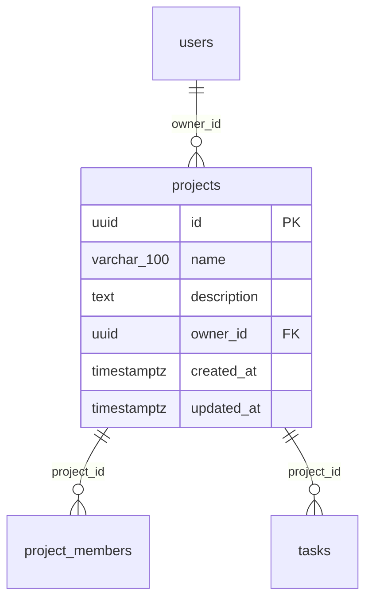
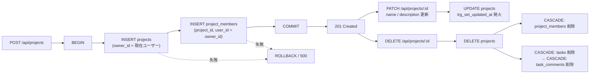
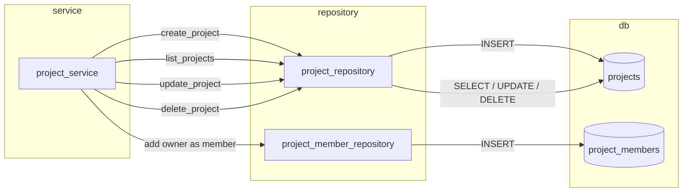

# projects テーブル 詳細設計

## 0. 関連ドキュメント

- 基本設計（正）：[`../../basic_design/01_database.md`](../../basic_design/01_database.md#33-projects)
- 全体設計：[`../../basic_design/00_overview.md`](../../basic_design/00_overview.md)
- 本テーブルを操作するAPI詳細設計
  - [`../api/projects/01_get_projects.md`](../api/projects/01_get_projects.md) GET /api/projects
  - [`../api/projects/02_post_projects.md`](../api/projects/02_post_projects.md) POST /api/projects
  - [`../api/projects/03_get_project.md`](../api/projects/03_get_project.md) GET /api/projects/{project_id}
  - [`../api/projects/04_patch_project.md`](../api/projects/04_patch_project.md) PATCH /api/projects/{project_id}
  - [`../api/projects/05_delete_project.md`](../api/projects/05_delete_project.md) DELETE /api/projects/{project_id}
- 関連テーブル：[`05_table_project_members.md`](./05_table_project_members.md)、[`06_table_tasks.md`](./06_table_tasks.md)、[`01_table_users.md`](./01_table_users.md)

## 1. 概要

| 項目 | 内容 |
|------|------|
| テーブル名 / 論理名 | `projects` / プロジェクト |
| 役割 | チームで共有するタスク管理単位。オーナー1名と複数メンバーが所属する |
| 想定件数・増加傾向 | 学習用途のため小規模（数十〜数百件）。ユーザー数に比例して緩やかに増加 |
| ライフサイクル | 作成契機：`POST /api/projects`（オーナー自身を `project_members` にも同時登録）。更新契機：`PATCH /api/projects/{project_id}`（name/description のみ）。削除契機：`DELETE /api/projects/{project_id}`（オーナー or admin）。物理削除のみで論理削除は行わない。保持期間の定めなし |
| 関連ORMモデル | `models/project.py :: Project` |

## 2. カラム定義

| 論理名 | カラム名 | 型 | NULL | 既定値 | 主キー/一意 | 説明 |
|--------|----------|----|------|--------|--------------|------|
| ID | `id` | UUID | NO | `gen_random_uuid()` | PK | |
| プロジェクト名 | `name` | VARCHAR(100) | NO | - | - | 1〜100文字（アプリ層） |
| 説明 | `description` | TEXT | YES | - | - | |
| オーナー | `owner_id` | UUID | NO | - | FK → `users.id` | `ON DELETE RESTRICT`（オーナーが残る限りユーザー削除不可。本設計ではユーザー物理削除APIは提供しないため実質的には無効化保護の意味を持つ） |
| 作成日時 | `created_at` | TIMESTAMPTZ | NO | `now()` | - | |
| 更新日時 | `updated_at` | TIMESTAMPTZ | NO | `now()` | - | `trg_set_updated_at` トリガで自動更新（[`../../basic_design/01_database.md#51-dbfunctionstrg_set_updated_atsql`](../../basic_design/01_database.md#51-dbfunctionstrg_set_updated_atsql)） |

基本設計 `01_database.md` §3.3 の定義から逸脱しない。

## 3. DDL

```sql
CREATE TABLE projects (
    id          UUID PRIMARY KEY DEFAULT gen_random_uuid(),
    name        VARCHAR(100) NOT NULL,
    description TEXT,
    owner_id    UUID NOT NULL REFERENCES users(id) ON DELETE RESTRICT,
    created_at  TIMESTAMPTZ NOT NULL DEFAULT now(),
    updated_at  TIMESTAMPTZ NOT NULL DEFAULT now()
);

COMMENT ON TABLE projects IS 'チームで共有するタスク管理単位';
COMMENT ON COLUMN projects.owner_id IS 'FK: users.id ON DELETE RESTRICT（オーナーが残る限りユーザー削除不可）';

CREATE INDEX ix_projects_owner_id ON projects (owner_id);

CREATE TRIGGER trg_projects_set_updated_at
    BEFORE UPDATE ON projects
    FOR EACH ROW
    EXECUTE FUNCTION trg_set_updated_at();
```

## 4. 制約・インデックス

| 種別 | 名称 | 対象カラム | 内容 | 目的（対応クエリ） |
|------|------|-----------|------|---------------------|
| PK | `projects_pkey` | `id` | 主キー | 単一行取得（Q-Proj-1） |
| FK | `projects_owner_id_fkey` | `owner_id` | → `users.id` `ON DELETE RESTRICT` | オーナーが存在する限りユーザー削除を禁止し、履歴の整合性を保つ |
| NOT NULL | - | `name`, `owner_id`, `created_at`, `updated_at` | 必須項目の担保 | - |
| INDEX | `ix_projects_owner_id` | `owner_id` | B-tree | `GET /admin/projects` でのオーナー絞り込み、オーナー変更系処理の存在確認 |

`name` にはアプリ層（pydantic）で1〜100文字のバリデーションを課すが、DB側の `CHECK` 制約は設けない（基本設計に明記がないため）。

## 5. SQLAlchemyモデル定義

```python
class Project(Base):
    __tablename__ = "projects"

    id: Mapped[uuid.UUID] = mapped_column(
        UUID(as_uuid=True), primary_key=True, server_default=text("gen_random_uuid()")
    )
    name: Mapped[str] = mapped_column(String(100), nullable=False)
    description: Mapped[str | None] = mapped_column(Text, nullable=True)
    owner_id: Mapped[uuid.UUID] = mapped_column(
        UUID(as_uuid=True), ForeignKey("users.id", ondelete="RESTRICT"), nullable=False
    )
    created_at: Mapped[datetime] = mapped_column(
        TIMESTAMP(timezone=True), nullable=False, server_default=func.now()
    )
    updated_at: Mapped[datetime] = mapped_column(
        TIMESTAMP(timezone=True), nullable=False, server_default=func.now()
    )

    owner: Mapped["User"] = relationship(
        "User", foreign_keys=[owner_id], lazy="joined"
    )
    members: Mapped[list["ProjectMember"]] = relationship(
        "ProjectMember", back_populates="project",
        cascade="all, delete-orphan", lazy="selectin"
    )
    tasks: Mapped[list["Task"]] = relationship(
        "Task", back_populates="project",
        cascade="all, delete-orphan", lazy="noload"
    )
```

`tasks` は一覧規模が大きくなり得るため既定の `lazy` を `noload` とし、カンバン取得は `task_repository` の専用クエリ（`selectinload` 相当）で明示的に取得する（[`../../basic_design/01_database.md#7-主要クエリ`](../../basic_design/01_database.md#7-主要クエリ) Q-3）。

## 6. ER関連図



## 7. データ遷移図



作成時は `projects` INSERT と `project_members` INSERT を同一トランザクションで行う（[`../../basic_design/01_database.md#43-プロジェクト作成時のデータ生成`](../../basic_design/01_database.md#43-プロジェクト作成時のデータ生成)）。削除時は `project_members` / `tasks`（さらに `task_comments`）が `ON DELETE CASCADE` で連鎖削除される。

## 8. リポジトリ関数詳細

### 8.1 `repository/project_repository.py :: create`

| 項目 | 内容 |
|------|------|
| シグネチャ | `async def create(session: AsyncSession, *, name: str, description: str \| None, owner_id: UUID) -> Project` |
| 引数 / 戻り値 | 引数：プロジェクト名・説明・オーナーID。戻り値：作成された `Project`（`id`/`created_at` 採番済み） |
| 発行SQL | ```sql\nINSERT INTO projects (name, description, owner_id)\nVALUES (:name, :description, :owner_id)\nRETURNING id, name, description, owner_id, created_at, updated_at;\n``` |
| 使用インデックス | PK（RETURNING のみ） |
| 送出例外 | なし（FK違反は呼び出し元 `owner_id` が現在ユーザーのため通常発生しない） |
| 処理内容 | 1. `Project` エンティティを構築<br/>2. `session.add()` して `flush()`<br/>3. サービス層が同一トランザクションで `project_member_repository.create()` を呼び、オーナーをメンバー登録する |

### 8.2 `repository/project_repository.py :: get_by_id`

| 項目 | 内容 |
|------|------|
| シグネチャ | `async def get_by_id(session: AsyncSession, project_id: UUID) -> Project \| None` |
| 引数 / 戻り値 | プロジェクトID → `Project`（存在しなければ `None`） |
| 発行SQL | ```sql\nSELECT id, name, description, owner_id, created_at, updated_at\nFROM projects WHERE id = :project_id;\n``` |
| 使用インデックス | PK |
| 送出例外 | なし（`None` を返し、サービス層で `NotFoundError` に変換） |
| 処理内容 | 1. PKで単一行取得<br/>2. 呼び出し元（`deps.require_project_member` 等）が所属確認に利用 |

### 8.3 `repository/project_repository.py :: list_for_user`

| 項目 | 内容 |
|------|------|
| シグネチャ | `async def list_for_user(session: AsyncSession, *, user_id: UUID, is_admin: bool, page: int, per_page: int) -> tuple[list[Project], int]` |
| 引数 / 戻り値 | ページング条件 → `(該当ページの Project 一覧, 総件数)` |
| 発行SQL | ```sql\n-- is_admin=false の場合\nSELECT p.id, p.name, p.description, p.owner_id, p.created_at, p.updated_at\nFROM projects p\nJOIN project_members pm ON pm.project_id = p.id\nWHERE pm.user_id = :user_id\nORDER BY p.created_at DESC\nLIMIT :limit OFFSET :offset;\n-- is_admin=true の場合は JOIN/WHERE を省略し全件を対象にする\n``` |
| 使用インデックス | `ix_project_members_user_id`（[`05_table_project_members.md`](./05_table_project_members.md)） |
| 送出例外 | なし |
| 処理内容 | 1. `is_admin` により全件/所属分岐<br/>2. 件数取得は `COUNT(*)` を同条件で別途発行<br/>3. `per_page` は環境変数 `PAGINATION_DEFAULT_PAGE_SIZE`（既定20）/ `PAGINATION_MAX_PAGE_SIZE`（上限100）でクランプ（サービス層で実施） |

### 8.4 `repository/project_repository.py :: update`

| 項目 | 内容 |
|------|------|
| シグネチャ | `async def update(session: AsyncSession, project: Project, *, name: str \| None, description: str \| None) -> Project` |
| 引数 / 戻り値 | 更新対象エンティティと部分更新値 → 更新後 `Project` |
| 発行SQL | ```sql\nUPDATE projects\nSET name = COALESCE(:name, name),\n    description = COALESCE(:description, description)\nWHERE id = :id\nRETURNING id, name, description, owner_id, created_at, updated_at;\n``` |
| 使用インデックス | PK |
| 送出例外 | なし（認可はルータ側 `deps.require_project_owner_or_admin` で事前判定） |
| 処理内容 | 1. ORMエンティティの属性を更新し `flush()`（`trg_set_updated_at` が `updated_at` を更新）<br/>2. `description` を明示的に `null` にするケースは pydantic の `exclude_unset` で区別する |

### 8.5 `repository/project_repository.py :: delete`

| 項目 | 内容 |
|------|------|
| シグネチャ | `async def delete(session: AsyncSession, project: Project) -> None` |
| 引数 / 戻り値 | 削除対象エンティティ → なし |
| 発行SQL | ```sql\nDELETE FROM projects WHERE id = :id;\n``` |
| 使用インデックス | PK |
| 送出例外 | なし |
| 処理内容 | 1. `session.delete(project)` して `flush()`<br/>2. `project_members` / `tasks` / `task_comments` は `ON DELETE CASCADE` によりDB側で連鎖削除される（アプリ側で個別DELETEは行わない） |

## 9. 関数相関図



## 10. 想定クエリと性能

| No | ユースケース | クエリ概要 | 使用インデックス | 想定計画 |
|----|-------------|-----------|-------------------|----------|
| Q-Proj-1 | プロジェクト詳細取得 | `WHERE id = :id` | PK | Index Scan（1行） |
| Q-Proj-2 | ダッシュボード一覧（member） | `projects JOIN project_members WHERE pm.user_id = :me ORDER BY created_at DESC` | `ix_project_members_user_id` | Index Scan on `project_members` → Nested Loop → `projects` PK Lookup |
| Q-Proj-3 | 管理者用全件一覧 | `ORDER BY created_at DESC LIMIT/OFFSET` | なし（Seq Scan） | 学習用途で件数が少ないため許容。将来的に `ix_projects_created_at` の追加を検討可 |
| Q-Proj-4 | オーナー確認 | `WHERE owner_id = :uid` | `ix_projects_owner_id` | Index Scan |

## 11. 整合性・並行制御

| 項目 | 内容 |
|------|------|
| FK CASCADE（`owner_id`） | `ON DELETE RESTRICT`。オーナーが所属する限り `users` 行の物理削除は不可（本設計にユーザー物理削除APIは無いため通常到達しない防御的制約） |
| FK CASCADE（`project_members.project_id`） | `ON DELETE CASCADE`。プロジェクト削除時に所属情報を自動削除 |
| FK CASCADE（`tasks.project_id`） | `ON DELETE CASCADE`。プロジェクト削除時にタスクを自動削除し、`task_comments` も連鎖で削除される |
| トランザクション境界 | 作成：`projects` INSERT + `project_members` INSERT を1トランザクション。削除：`DELETE FROM projects` 単文（CASCADEはDBが保証） |
| 楽観ロック | `projects` には `version` カラムを持たない（基本設計上、同時編集の主対象は `tasks` のみ）。name/description の同時更新は最終書き込み優先（Last Write Wins）とする |
| advisory lock | 使用しない |

## 12. テスト設計

| No | 区分 | ケース | 期待結果 | テスト名案 |
|----|------|--------|----------|------------|
| T-1 | 正常系 | オーナーがプロジェクトを作成する | `projects` に1行、`project_members` に1行（オーナー自身）が同一トランザクションで作成される | `test_create_project_registers_owner_as_member` |
| T-2 | 制約違反 | `owner_id` に存在しないUUIDを指定してINSERT | FK違反で例外（実運用では現在ユーザーIDのため通常到達しない） | `test_create_project_invalid_owner_raises_fk_error` |
| T-3 | CASCADE削除 | オーナー or admin がプロジェクトを削除 | `project_members` / `tasks` / `task_comments` の関連行がすべて削除される | `test_delete_project_cascades_members_tasks_comments` |
| T-4 | RESTRICT確認 | プロジェクトのオーナーであるユーザーの `users` 行を直接DELETEしようとする | FK違反（`RESTRICT`）で失敗する | `test_delete_user_with_owned_project_restricted` |
| T-5 | 認可 | 非オーナー・非adminが `PATCH /projects/{id}` を実行 | 403（所属メンバーの場合）/ 404（非所属の場合） | `test_update_project_forbidden_for_non_owner` |
| T-6 | 一覧 | member が `GET /projects` を実行 | 自分が所属するプロジェクトのみ返る | `test_list_projects_scoped_to_membership` |
| T-7 | 一覧 | admin が `GET /projects` を実行 | 全プロジェクトが返る | `test_list_projects_admin_returns_all` |
| T-8 | 更新 | `PATCH /projects/{id}` で name のみ更新 | `description` は変更されず、`updated_at` が更新される | `test_update_project_partial_update_keeps_description` |

## 13. 不明点・要検討事項

- ページングの既定値・上限値（`per_page` 既定20・最大100）は `basic_design/04_api.md` §1 に記載があるが、対応する `core/config.py` の環境変数名は基本設計に明記がないため、本書では `PAGINATION_DEFAULT_PAGE_SIZE` / `PAGINATION_MAX_PAGE_SIZE` と仮称した。実装時に確定名称を確認すること（要検討）。
- 管理者用全件一覧（Q-Proj-3）は `created_at` 順ソートだが専用インデックスは基本設計になく、Seq Scanを許容する設計とした。件数増加時の要否は要検討。
- `name` に対するDB側 `CHECK` 制約（例：空文字禁止）の要否は基本設計に明記がないため、アプリ層バリデーションのみとした。
