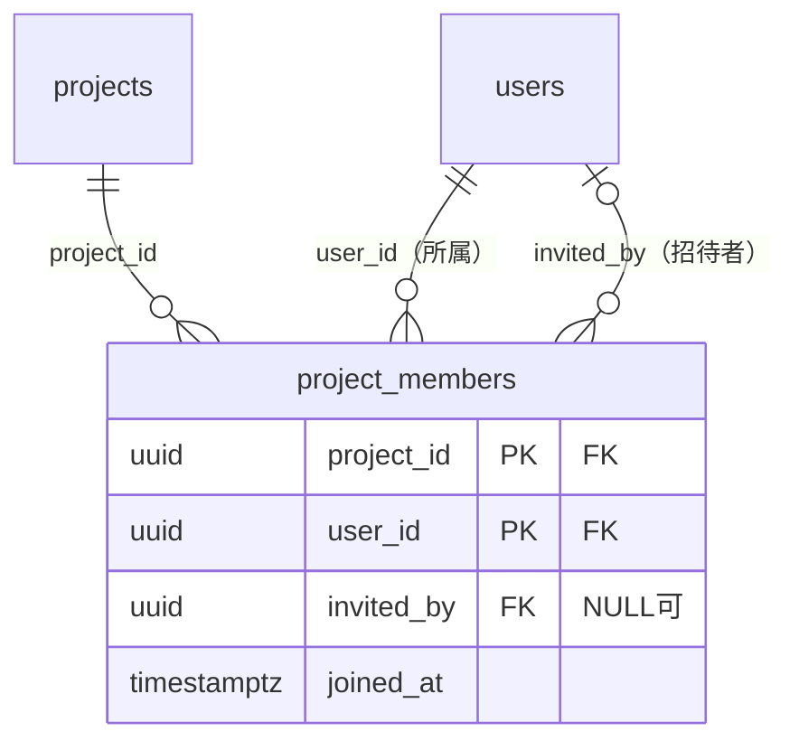
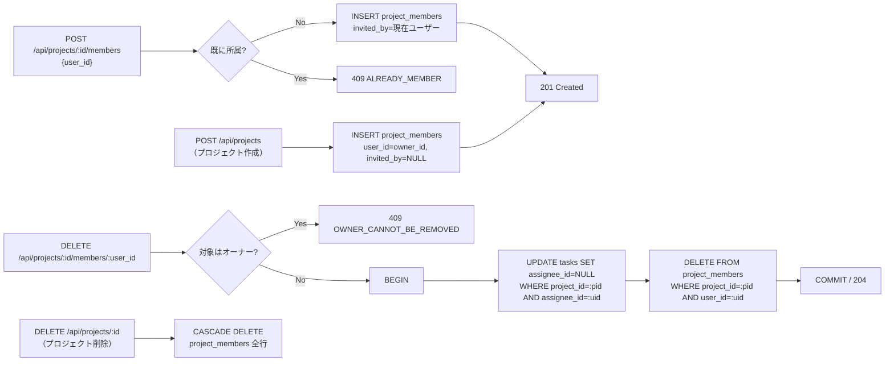
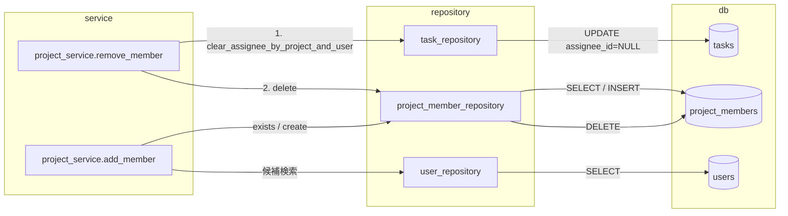

# project_members テーブル 詳細設計

## 0. 関連ドキュメント

- 基本設計（正）：[`../../basic_design/01_database.md`](../../basic_design/01_database.md#34-project_members)
- 全体設計：[`../../basic_design/00_overview.md`](../../basic_design/00_overview.md)
- 本テーブルを操作するAPI詳細設計
  - [`../api/projects/02_post_projects.md`](../api/projects/02_post_projects.md) POST /api/projects（オーナー登録）
  - [`../api/projects/06_get_project_members.md`](../api/projects/06_get_project_members.md) GET /api/projects/{project_id}/members
  - [`../api/projects/07_post_project_members.md`](../api/projects/07_post_project_members.md) POST /api/projects/{project_id}/members
  - [`../api/projects/08_get_project_member_candidates.md`](../api/projects/08_get_project_member_candidates.md) GET /api/projects/{project_id}/members/candidates
  - [`../api/projects/09_delete_project_member.md`](../api/projects/09_delete_project_member.md) DELETE /api/projects/{project_id}/members/{user_id}
- 関連テーブル：[`04_table_projects.md`](./04_table_projects.md)、[`01_table_users.md`](./01_table_users.md)、[`06_table_tasks.md`](./06_table_tasks.md)

## 1. 概要

| 項目 | 内容 |
|------|------|
| テーブル名 / 論理名 | `project_members` / プロジェクト所属 |
| 役割 | ユーザーとプロジェクトの多対多関係（所属）を表す中間テーブル。認可判定（所属チェック）の唯一の情報源 |
| 想定件数・増加傾向 | `projects × 平均メンバー数` に比例。学習用途のため小規模 |
| ライフサイクル | 作成契機：プロジェクト作成時（オーナー自身を自動登録）／`POST /api/projects/{project_id}/members`（オーナー・adminによる招待）。更新契機：なし（更新APIを持たない。再招待は行削除→再作成ではなくINSERTのみで、既存行がある場合は `409 ALREADY_MEMBER`）。削除契機：`DELETE /api/projects/{project_id}/members/{user_id}`、またはプロジェクト削除時のCASCADE。保持期間の定めなし |
| 関連ORMモデル | `models/project_member.py :: ProjectMember` |

## 2. カラム定義

| 論理名 | カラム名 | 型 | NULL | 既定値 | 主キー/一意 | 説明 |
|--------|----------|----|------|--------|--------------|------|
| プロジェクトID | `project_id` | UUID | NO | - | PK(1) / FK → `projects.id` | `ON DELETE CASCADE` |
| ユーザーID | `user_id` | UUID | NO | - | PK(2) / FK → `users.id` | `ON DELETE CASCADE` |
| 招待者 | `invited_by` | UUID | YES | - | FK → `users.id` | `ON DELETE SET NULL`。プロジェクト作成時のオーナー自動登録では `NULL` |
| 参加日時 | `joined_at` | TIMESTAMPTZ | NO | `now()` | - | |

主キーは複合主キー `(project_id, user_id)` であり、単独の `id` カラムは持たない。基本設計 `01_database.md` §3.4 の定義から逸脱しない。

## 3. DDL

```sql
CREATE TABLE project_members (
    project_id  UUID NOT NULL REFERENCES projects(id) ON DELETE CASCADE,
    user_id     UUID NOT NULL REFERENCES users(id) ON DELETE CASCADE,
    invited_by  UUID REFERENCES users(id) ON DELETE SET NULL,
    joined_at   TIMESTAMPTZ NOT NULL DEFAULT now(),
    PRIMARY KEY (project_id, user_id)
);

COMMENT ON TABLE project_members IS 'プロジェクトとユーザーの所属関係（複合主キー）。認可判定の唯一の情報源';
COMMENT ON COLUMN project_members.invited_by IS 'FK: users.id ON DELETE SET NULL（招待者が退会・無効化しても行自体は残す）';

CREATE INDEX ix_project_members_user_id ON project_members (user_id);
```

## 4. 制約・インデックス

| 種別 | 名称 | 対象カラム | 内容 | 目的（対応クエリ） |
|------|------|-----------|------|---------------------|
| PK | `project_members_pkey` | `(project_id, user_id)` | 複合主キー。同一ユーザーの重複所属を禁止 | `POST .../members` の重複検知（`409 ALREADY_MEMBER`） |
| FK | `project_members_project_id_fkey` | `project_id` | → `projects.id` `ON DELETE CASCADE` | プロジェクト削除時に所属情報を自動削除 |
| FK | `project_members_user_id_fkey` | `user_id` | → `users.id` `ON DELETE CASCADE` | ユーザー物理削除時に所属情報を自動削除（本設計ではユーザー物理削除APIは提供しないため、実運用では到達しにくいがDB整合性のため定義） |
| FK | `project_members_invited_by_fkey` | `invited_by` | → `users.id` `ON DELETE SET NULL` | 招待者情報の欠落時にも行自体を残す |
| INDEX | `ix_project_members_user_id` | `user_id` | B-tree | ダッシュボードの所属プロジェクト一覧取得（`01_database.md` Q-2） |

複合主キーには自動的にユニークインデックス（`project_id, user_id` の順）が張られるため、`GET /projects/{id}/members` のプロジェクト側絞り込みはこのPKインデックスの先頭列 `project_id` で効率的に処理できる。

## 5. SQLAlchemyモデル定義

```python
class ProjectMember(Base):
    __tablename__ = "project_members"

    project_id: Mapped[uuid.UUID] = mapped_column(
        UUID(as_uuid=True), ForeignKey("projects.id", ondelete="CASCADE"), primary_key=True
    )
    user_id: Mapped[uuid.UUID] = mapped_column(
        UUID(as_uuid=True), ForeignKey("users.id", ondelete="CASCADE"), primary_key=True
    )
    invited_by: Mapped[uuid.UUID | None] = mapped_column(
        UUID(as_uuid=True), ForeignKey("users.id", ondelete="SET NULL"), nullable=True
    )
    joined_at: Mapped[datetime] = mapped_column(
        TIMESTAMP(timezone=True), nullable=False, server_default=func.now()
    )

    project: Mapped["Project"] = relationship(
        "Project", back_populates="members", lazy="joined"
    )
    user: Mapped["User"] = relationship(
        "User", foreign_keys=[user_id], lazy="joined"
    )
    inviter: Mapped["User | None"] = relationship(
        "User", foreign_keys=[invited_by], lazy="joined"
    )
```

複合主キーのため `Base` の単一 `id` 主キー前提のMixinは使わず、モデル固有に `primary_key=True` を2カラムへ付与する。

## 6. ER関連図



## 7. データ遷移図



メンバー削除（DELETEメンバーAPI）では、担当タスクの `assignee_id` を先に `NULL` 化してから `project_members` を削除する（`06_table_tasks.md` の `assignee_id` FKは `ON DELETE SET NULL` だが、これは `users` 行自体の削除時のみ発火するため、所属解除だけを行う本ケースではアプリ層のUPDATEが必須）。

## 8. リポジトリ関数詳細

### 8.1 `repository/project_member_repository.py :: create`

| 項目 | 内容 |
|------|------|
| シグネチャ | `async def create(session: AsyncSession, *, project_id: UUID, user_id: UUID, invited_by: UUID \| None) -> ProjectMember` |
| 引数 / 戻り値 | 所属関係のキーと招待者 → 作成された `ProjectMember` |
| 発行SQL | ```sql\nINSERT INTO project_members (project_id, user_id, invited_by)\nVALUES (:project_id, :user_id, :invited_by)\nRETURNING project_id, user_id, invited_by, joined_at;\n``` |
| 使用インデックス | PK（一意制約チェック） |
| 送出例外 | `ConflictError`（PK違反 `unique_violation` を捕捉して変換） |
| 処理内容 | 1. INSERT実行<br/>2. `IntegrityError`（`23505`）捕捉時は `ConflictError("ALREADY_MEMBER")` へ変換してサービス層へ送出 |

### 8.2 `repository/project_member_repository.py :: exists`

| 項目 | 内容 |
|------|------|
| シグネチャ | `async def exists(session: AsyncSession, *, project_id: UUID, user_id: UUID) -> bool` |
| 引数 / 戻り値 | プロジェクトID・ユーザーID → 所属していれば `True` |
| 発行SQL | ```sql\nSELECT 1 FROM project_members\nWHERE project_id = :project_id AND user_id = :user_id\nLIMIT 1;\n``` |
| 使用インデックス | PK |
| 送出例外 | なし |
| 処理内容 | 1. `deps.require_project_member` での所属チェック、および `db/functions/fn_is_project_member.sql` によるDB側二重防御と対になるアプリ層チェックに使用 |

### 8.3 `repository/project_member_repository.py :: list_by_project`

| 項目 | 内容 |
|------|------|
| シグネチャ | `async def list_by_project(session: AsyncSession, project_id: UUID) -> list[ProjectMember]` |
| 引数 / 戻り値 | プロジェクトID → メンバー一覧（`user` を `joined` でロード済み） |
| 発行SQL | ```sql\nSELECT pm.project_id, pm.user_id, pm.invited_by, pm.joined_at,\n       u.username, u.last_name, u.first_name\nFROM project_members pm\nJOIN users u ON u.id = pm.user_id\nWHERE pm.project_id = :project_id\nORDER BY pm.joined_at ASC;\n``` |
| 使用インデックス | PK（`project_id` 先頭一致） |
| 送出例外 | なし |
| 処理内容 | 1. `GET /projects/{id}/members` のレスポンス生成に使用 |

### 8.4 `repository/project_member_repository.py :: delete`

| 項目 | 内容 |
|------|------|
| シグネチャ | `async def delete(session: AsyncSession, *, project_id: UUID, user_id: UUID) -> None` |
| 引数 / 戻り値 | 削除対象のキー → なし |
| 発行SQL | ```sql\nDELETE FROM project_members\nWHERE project_id = :project_id AND user_id = :user_id;\n``` |
| 使用インデックス | PK |
| 送出例外 | なし（対象0件でもエラーとしない。存在確認はサービス層で事前実施） |
| 処理内容 | 1. `task_service`（または `project_service.remove_member` 内）が同一トランザクションで先に `task_repository.clear_assignee_by_project_and_user()` を呼び担当タスクをNULL化<br/>2. 本関数でメンバー行を削除 |

### 8.5 `repository/task_repository.py :: clear_assignee_by_project_and_user`

| 項目 | 内容 |
|------|------|
| シグネチャ | `async def clear_assignee_by_project_and_user(session: AsyncSession, *, project_id: UUID, user_id: UUID) -> int` |
| 引数 / 戻り値 | プロジェクトID・対象ユーザーID → 更新件数 |
| 発行SQL | ```sql\nUPDATE tasks\nSET assignee_id = NULL\nWHERE project_id = :project_id AND assignee_id = :user_id;\n``` |
| 使用インデックス | `ix_tasks_assignee_id`（[`06_table_tasks.md`](./06_table_tasks.md)） |
| 送出例外 | なし |
| 処理内容 | 1. メンバー削除に先立ち、当該ユーザーが担当していたタスクの `assignee_id` を一括 `NULL` 化<br/>2. `version` はステータス・並び順を変えないため加算しない（担当者解除は「更新」ではなくメンバー削除に付随する後始末として扱う） |

## 9. 関数相関図



## 10. 想定クエリと性能

| No | ユースケース | クエリ概要 | 使用インデックス | 想定計画 |
|----|-------------|-----------|-------------------|----------|
| Q-PM-1 | ダッシュボード所属一覧 | `WHERE user_id = :me` | `ix_project_members_user_id` | Index Scan |
| Q-PM-2 | プロジェクトのメンバー一覧 | `WHERE project_id = :pid ORDER BY joined_at` | PK（`project_id` 先頭） | Index Scan → Sort（メンバー数が少なく実用上は問題なし） |
| Q-PM-3 | 所属確認 | `WHERE project_id = :pid AND user_id = :uid` | PK | Index Only Scan |
| Q-PM-4 | 招待候補検索 | `users` を対象に `username` 前方一致で検索し、`project_members` に無いユーザーを `NOT EXISTS` で除外 | `ix_project_members_user_id`（`NOT EXISTS` の相関サブクエリ）、`users.uq_users_username` | Index Scan + Anti Join |

## 11. 整合性・並行制御

| 項目 | 内容 |
|------|------|
| FK CASCADE（`project_id`） | `ON DELETE CASCADE`。プロジェクト削除時に所属情報を自動削除 |
| FK CASCADE（`user_id`） | `ON DELETE CASCADE`。ユーザー物理削除時に所属情報を自動削除（本設計ではユーザーは無効化のみで物理削除APIを提供しないため、通常運用では発火しない） |
| FK CASCADE（`invited_by`） | `ON DELETE SET NULL`。招待者が削除されても所属行自体は残す |
| メンバー削除とタスクの関係 | `tasks.assignee_id` の `ON DELETE SET NULL` はDBの `users` 行削除にのみ反応するため、「所属解除（`project_members` 削除）」では発火しない。サービス層が明示的に `UPDATE tasks SET assignee_id=NULL` を実行してからメンバー行を削除する（§8.5） |
| トランザクション境界 | メンバー削除：`UPDATE tasks(assignee_id=NULL)` → `DELETE project_members` を1トランザクション。メンバー追加：INSERT単文（重複はPK違反で検知） |
| オーナー保護 | オーナー自身の `project_members` 行は `DELETE .../members/{user_id}` から削除不可（`409 OWNER_CANNOT_BE_REMOVED`。サービス層で `project.owner_id == user_id` を判定） |
| 一意性 | 複合PKにより `(project_id, user_id)` の重複所属を禁止。再招待は `409 ALREADY_MEMBER` |
| advisory lock | 使用しない |

## 12. テスト設計

| No | 区分 | ケース | 期待結果 | テスト名案 |
|----|------|--------|----------|------------|
| T-1 | 正常系 | オーナーがプロジェクト作成時に自動でメンバー登録される | `project_members` に `(project_id, owner_id)` が1行存在 | `test_create_project_auto_registers_owner` |
| T-2 | 制約違反（PK） | 既に所属しているユーザーを再度招待する | `409 ALREADY_MEMBER`（DB一意制約違反を変換） | `test_add_member_duplicate_returns_conflict` |
| T-3 | CASCADE削除 | プロジェクトを削除する | 関連する `project_members` 行がすべて削除される | `test_delete_project_cascades_members` |
| T-4 | 業務ロジック | 担当タスクを持つメンバーを削除する | 削除前に該当タスクの `assignee_id` が `NULL` になり、その後 `project_members` 行が削除される | `test_remove_member_nullifies_assigned_tasks` |
| T-5 | 業務ロジック | オーナー自身を削除しようとする | `409 OWNER_CANNOT_BE_REMOVED` となり `project_members` 行は削除されない | `test_remove_owner_forbidden` |
| T-6 | 並行制御 | メンバー削除と担当タスクのUPDATEを同一トランザクションで実行中にエラーが発生 | ロールバックされ、`assignee_id` のNULL化・メンバー削除のいずれも反映されない | `test_remove_member_rolls_back_on_error` |
| T-7 | 認可 | 非オーナー・非adminの一般メンバーがメンバー招待/削除APIを呼ぶ | `403`（所属している場合）/ `404`（非所属の場合） | `test_member_apis_forbidden_for_non_owner` |
| T-8 | 招待候補 | 既に所属しているユーザーを候補検索する | 候補一覧に含まれない | `test_candidate_search_excludes_existing_members` |

## 13. 不明点・要検討事項

- メンバー削除時の担当タスクNULL化（§8.5）は `basic_design/04_api.md` §7.2 の `remove_member` 説明（「削除対象者が担当中のタスクは同一トランザクションで `assignee_id=NULL` にしてからmembershipを削除」）に基づく具体化であり、`01_database.md` 本文には明示のSQL手順の記載がないため、本書のSQL・関数分割は詳細設計としての具体化である。
- オーナー自身の削除拒否（`409 OWNER_CANNOT_BE_REMOVED`）はAPI設計側の認可マトリクスに準じた挙動として妥当と判断したが、エラーコード名は基本設計に明記がないため仮称とした（要検討）。
