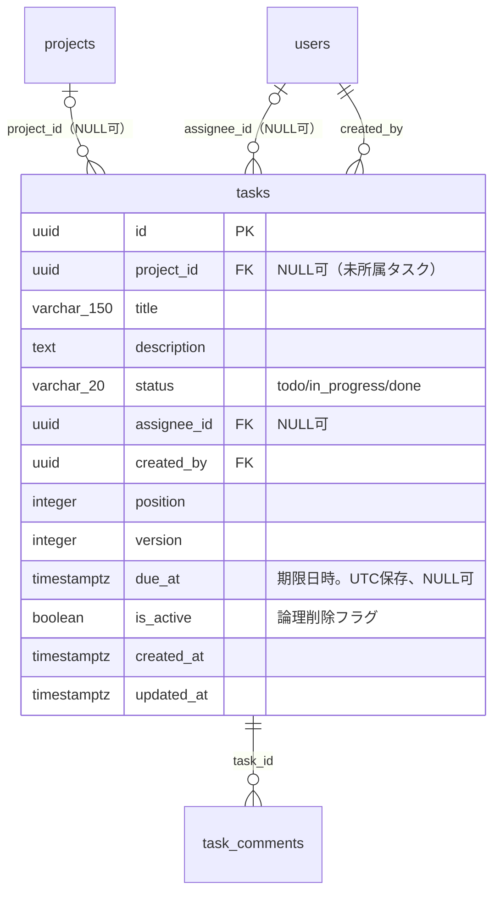
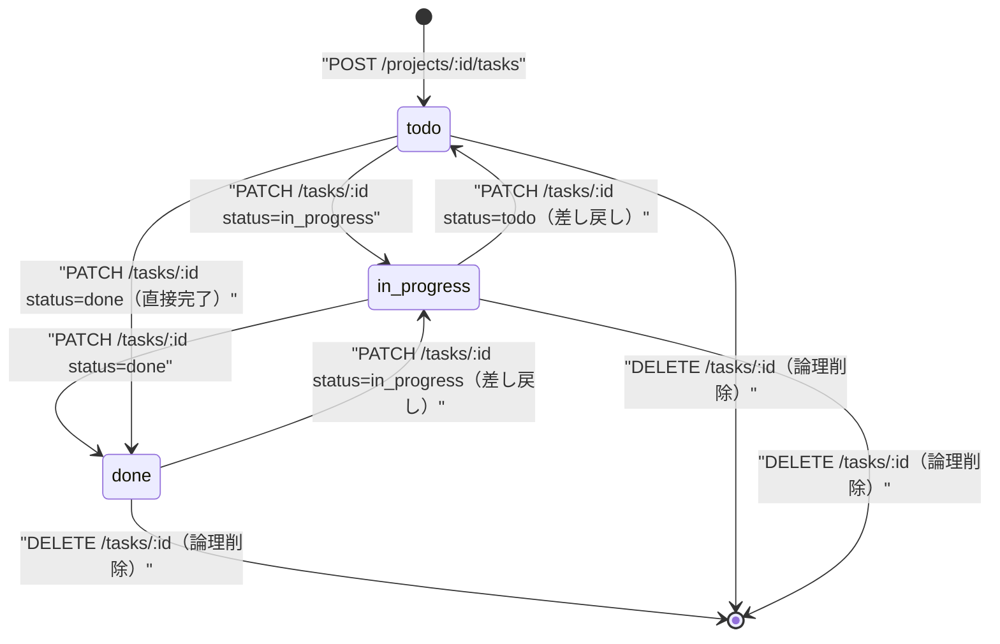
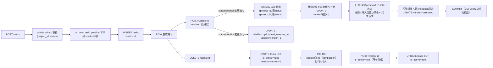
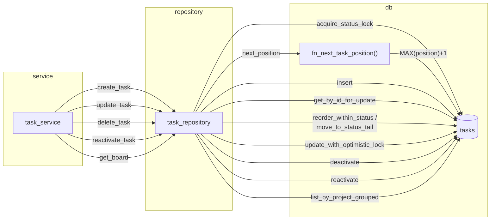

# tasks テーブル 詳細設計

## 0. 関連ドキュメント

- 基本設計（正）：[`../../basic_design/01_database.md`](../../basic_design/01_database.md#35-tasks)
- 全体設計：[`../../basic_design/00_overview.md`](../../basic_design/00_overview.md)
- 本テーブルを操作するAPI詳細設計
  - [`../api/tasks/01_get_project_tasks.md`](../api/tasks/01_get_project_tasks.md) GET /api/projects/{project_id}/tasks
  - [`../api/tasks/02_post_project_tasks.md`](../api/tasks/02_post_project_tasks.md) POST /api/projects/{project_id}/tasks
  - [`../api/tasks/03_get_task.md`](../api/tasks/03_get_task.md) GET /api/tasks/{task_id}
  - [`../api/tasks/04_patch_task.md`](../api/tasks/04_patch_task.md) PATCH /api/tasks/{task_id}
  - [`../api/tasks/05_delete_task.md`](../api/tasks/05_delete_task.md) DELETE /api/tasks/{task_id}
  - `../api/tasks/` 配下に新設予定：`GET /api/tasks`（横断一覧）、`POST /api/tasks`（`project_id`任意でのフラット作成）。ファイルは既存9ファイルの次番号で新規作成される想定（API設計担当が対応。issue #10 ブリーフ参照）
- 関連テーブル：[`04_table_projects.md`](./04_table_projects.md)、[`05_table_project_members.md`](./05_table_project_members.md)、[`01_table_users.md`](./01_table_users.md)、[`07_table_task_comments.md`](./07_table_task_comments.md)
- DB関数：[`08_db_functions.md`](./08_db_functions.md)（`fn_next_task_position`）

## 1. 概要

| 項目 | 内容 |
|------|------|
| テーブル名 / 論理名 | `tasks` / タスク |
| 役割 | プロジェクト配下のタスク。カンバンの3列（`todo`/`in_progress`/`done`）に `status` で分類され、列内の並び順を `position` で保持する |
| 想定件数・増加傾向 | プロジェクト数 × 平均タスク数。学習用途のため小〜中規模 |
| ライフサイクル | 作成契機：`POST /api/projects/{project_id}/tasks`（`project_id`はパス由来）、または `POST /api/tasks`（bodyの`project_id`は任意・NULL可）。更新契機：`PATCH /api/tasks/{task_id}`（title/description/status/assignee/position/due_at/is_active、`version` 必須）。削除契機：`DELETE /api/tasks/{task_id}` → 論理削除（`is_active=false`への更新）。物理削除は行わない。プロジェクトが無効化（論理削除）されてもタスクは削除されない |
| 関連ORMモデル | `models/task.py :: Task` |

## 2. カラム定義

| 論理名 | カラム名 | 型 | NULL | 既定値 | 主キー/一意 | 説明 |
|--------|----------|----|------|--------|--------------|------|
| ID | `id` | UUID | NO | `gen_random_uuid()` | PK | |
| プロジェクトID | `project_id` | UUID | YES | - | FK → `projects.id` | `ON DELETE SET NULL`。NULLはプロジェクト未所属タスクを表す |
| タイトル | `title` | VARCHAR(150) | NO | - | - | 1〜150文字（アプリ層） |
| 説明 | `description` | TEXT | YES | - | - | |
| ステータス | `status` | VARCHAR(20) | NO | `'todo'` | - | `CHECK (status IN ('todo','in_progress','done'))` |
| 担当者 | `assignee_id` | UUID | YES | - | FK → `users.id` | `ON DELETE SET NULL`。指定時は有効なプロジェクトメンバーであること（アプリ層検証） |
| 作成者 | `created_by` | UUID | NO | - | FK → `users.id` | `ON DELETE RESTRICT` |
| 並び順 | `position` | INTEGER | NO | `0` | 一意（`project_id, status` 内） | `CHECK (position >= 0)`。`UNIQUE (project_id, status, position) DEFERRABLE INITIALLY DEFERRED` |
| バージョン | `version` | INTEGER | NO | `1` | - | 楽観的排他制御用。`CHECK (version > 0)`。更新成功時に+1 |
| 期限日時 | `due_at` | TIMESTAMPTZ | YES | - | - | UTC保存。表示・日次境界の判定は`APP_TIMEZONE` |
| 有効フラグ | `is_active` | BOOLEAN | NO | `true` | - | 論理削除フラグ。`false` は無効化（論理削除）済みを表す |
| 作成日時 | `created_at` | TIMESTAMPTZ | NO | `now()` | - | |
| 更新日時 | `updated_at` | TIMESTAMPTZ | NO | `now()` | - | `trg_set_updated_at` トリガで自動更新 |

基本設計 `01_database.md` §3.5 の定義から逸脱しない（`project_id` のNULL許容化・`is_active` 追加は issue #10 対応として本改訂で追加）。

タスクのレスポンスには `project_is_active`（boolean、`project_id`がNULLの場合は`null`）を含める。DBに永続カラムとして保持するのではなく、`projects` とのJOINで都度取得する派生値である（§8.10参照）。

## 3. DDL

```sql
CREATE TABLE tasks (
    id           UUID PRIMARY KEY DEFAULT gen_random_uuid(),
    project_id   UUID REFERENCES projects(id) ON DELETE SET NULL,
    title        VARCHAR(150) NOT NULL,
    description  TEXT,
    status       VARCHAR(20) NOT NULL DEFAULT 'todo'
                 CONSTRAINT ck_tasks_status CHECK (status IN ('todo', 'in_progress', 'done')),
    assignee_id  UUID REFERENCES users(id) ON DELETE SET NULL,
    created_by   UUID NOT NULL REFERENCES users(id) ON DELETE RESTRICT,
    position     INTEGER NOT NULL DEFAULT 0
                 CONSTRAINT ck_tasks_position_non_negative CHECK (position >= 0),
    version      INTEGER NOT NULL DEFAULT 1
                 CONSTRAINT ck_tasks_version_positive CHECK (version > 0),
    due_at       TIMESTAMPTZ,
    is_active    BOOLEAN NOT NULL DEFAULT true,
    created_at   TIMESTAMPTZ NOT NULL DEFAULT now(),
    updated_at   TIMESTAMPTZ NOT NULL DEFAULT now(),
    CONSTRAINT uq_tasks_project_status_position
        UNIQUE (project_id, status, position) DEFERRABLE INITIALLY DEFERRED
);

COMMENT ON TABLE tasks IS 'カンバンのタスク。statusで列を、positionで列内順序を表す';
COMMENT ON COLUMN tasks.project_id IS 'FK: projects.id ON DELETE SET NULL。NULLはプロジェクト未所属タスクを表す';
COMMENT ON COLUMN tasks.status IS 'todo / in_progress / done のいずれか（CHECK制約）';
COMMENT ON COLUMN tasks.position IS '同一 project_id, status 内の並び順（0起点）';
COMMENT ON COLUMN tasks.version IS '楽観的排他制御用。PATCH成功時に+1';
COMMENT ON COLUMN tasks.is_active IS '論理削除フラグ。false は DELETE /api/tasks/{id} による無効化済みを表す';

CREATE INDEX ix_tasks_assignee_id ON tasks (assignee_id);

CREATE TRIGGER trg_tasks_set_updated_at
    BEFORE UPDATE ON tasks
    FOR EACH ROW
    EXECUTE FUNCTION trg_set_updated_at();
```

`DEFERRABLE` な一意制約はPostgreSQLの仕様上、テーブル定義内の `CONSTRAINT ... UNIQUE (...) DEFERRABLE` としてのみ定義可能（`CREATE UNIQUE INDEX` では不可）なため、上記DDLのテーブル制約1本のみで表現する。

**`project_id IS NULL` 行における一意制約の限界**：PostgreSQLのUNIQUE制約はNULLを互いに異なる値として扱うため、`uq_tasks_project_status_position` は `project_id IS NULL`（プロジェクト未所属タスク）の行同士では機能せず、同一 `status`/`position` を持つ複数の未所属タスクが共存し得る。DDL自体はこの挙動を変更せず維持する（`project_id` を含む複合UNIQUE制約でNULLを同一視させるPostgreSQL標準の方法は無いため）。実用上の対応はアプリ層のadvisory lockキー生成で行う（§8.1参照）。DB制約だけでは重複を防げない点は §13 の要検討事項として明記する。

## 4. 制約・インデックス

| 種別 | 名称 | 対象カラム | 内容 | 目的（対応クエリ） |
|------|------|-----------|------|---------------------|
| PK | `tasks_pkey` | `id` | 主キー | タスク詳細取得 |
| FK | `tasks_project_id_fkey` | `project_id` | → `projects.id` `ON DELETE SET NULL` | `projects` の物理削除経路が無いため通常運用では発火しない防御的制約。意味上は「プロジェクトが消えたらタスクを未所属にする」を表す |
| FK | `tasks_assignee_id_fkey` | `assignee_id` | → `users.id` `ON DELETE SET NULL` | ユーザー削除時に担当者を自動的に未割当へ（本設計では所属解除はアプリ層UPDATEで対応。§11参照） |
| FK | `tasks_created_by_fkey` | `created_by` | → `users.id` `ON DELETE RESTRICT` | 作成者の履歴保護。ユーザーは無効化のみで物理削除しないため通常は問題にならない |
| CHECK | `ck_tasks_status` | `status` | `status IN ('todo','in_progress','done')` | 不正な状態値の混入防止 |
| CHECK | `ck_tasks_position_non_negative` | `position` | `position >= 0` | 並び順の健全性 |
| CHECK | `ck_tasks_version_positive` | `version` | `version > 0` | 楽観ロック値の健全性 |
| UNIQUE（遅延） | `uq_tasks_project_status_position` | `(project_id, status, position)` | `DEFERRABLE INITIALLY DEFERRED` | 列内重複防止。再採番中の一時的な重複をトランザクション内で許容しつつCOMMIT時に検証。**`project_id IS NULL` の行同士では機能しない**（上記コラム参照） |
| INDEX | `ix_tasks_assignee_id` | `assignee_id` | B-tree | 担当タスク絞り込み、メンバー削除時の一括NULL化（`05_table_project_members.md` §8.5） |

`uq_tasks_project_status_position` はカンバン表示クエリ（`WHERE project_id=:pid ORDER BY status, position`）の実行計画でも利用される。

## 5. SQLAlchemyモデル定義

```python
class TaskStatus(str, enum.Enum):
    TODO = "todo"
    IN_PROGRESS = "in_progress"
    DONE = "done"


class Task(Base):
    __tablename__ = "tasks"
    __table_args__ = (
        CheckConstraint("status IN ('todo','in_progress','done')", name="ck_tasks_status"),
        CheckConstraint("position >= 0", name="ck_tasks_position_non_negative"),
        CheckConstraint("version > 0", name="ck_tasks_version_positive"),
        UniqueConstraint(
            "project_id", "status", "position",
            name="uq_tasks_project_status_position",
            deferrable=True, initially="DEFERRED",
        ),
    )

    id: Mapped[uuid.UUID] = mapped_column(
        UUID(as_uuid=True), primary_key=True, server_default=text("gen_random_uuid()")
    )
    project_id: Mapped[uuid.UUID | None] = mapped_column(
        UUID(as_uuid=True), ForeignKey("projects.id", ondelete="SET NULL"), nullable=True
    )
    title: Mapped[str] = mapped_column(String(150), nullable=False)
    description: Mapped[str | None] = mapped_column(Text, nullable=True)
    status: Mapped[str] = mapped_column(String(20), nullable=False, server_default="todo")
    assignee_id: Mapped[uuid.UUID | None] = mapped_column(
        UUID(as_uuid=True), ForeignKey("users.id", ondelete="SET NULL"), nullable=True
    )
    created_by: Mapped[uuid.UUID] = mapped_column(
        UUID(as_uuid=True), ForeignKey("users.id", ondelete="RESTRICT"), nullable=False
    )
    position: Mapped[int] = mapped_column(Integer, nullable=False, server_default="0")
    version: Mapped[int] = mapped_column(Integer, nullable=False, server_default="1")
    due_at: Mapped[datetime | None] = mapped_column(TIMESTAMP(timezone=True), nullable=True)
    is_active: Mapped[bool] = mapped_column(Boolean, nullable=False, server_default=text("true"))
    created_at: Mapped[datetime] = mapped_column(
        TIMESTAMP(timezone=True), nullable=False, server_default=func.now()
    )
    updated_at: Mapped[datetime] = mapped_column(
        TIMESTAMP(timezone=True), nullable=False, server_default=func.now()
    )

    project: Mapped["Project | None"] = relationship("Project", back_populates="tasks", lazy="joined")
    assignee: Mapped["User | None"] = relationship(
        "User", foreign_keys=[assignee_id], lazy="joined"
    )
    creator: Mapped["User"] = relationship("User", foreign_keys=[created_by], lazy="noload")
    comments: Mapped[list["TaskComment"]] = relationship(
        "TaskComment", back_populates="task", cascade="all, delete-orphan", lazy="noload"
    )
```

`comments` は件数が多くなり得るため `lazy="noload"` とし、コメント一覧は `task_comment_repository` の専用クエリで取得する（N+1回避、`01_database.md` Q-4）。

## 6. ER関連図



## 7. データ遷移図

### 7.1 status カラムの状態遷移（基本設計 §4.1 と同一。遷移制限なし）



`[*]` への遷移は `is_active=false` への論理削除であり、行自体は削除されない（`status` は最後の値を保持したまま無効化される）。

### 7.2 行全体のライフサイクルと再採番の契機



論理削除（`is_active=false`）はDELETE時点の `position`/`status` をそのまま保持し、後続タスクの `position` 詰めは行わない。無効化されたタスクは一覧・カンバンから除外されるだけで、`position` にギャップが生じても列内の並び順（`ORDER BY position`）自体は崩れないため実用上問題ない（物理削除時代の詰め直しロジックは廃止する。§8.8参照）。

## 8. SP/FNリポジトリ契約

repositoryは下表のSP/FN呼び出しとDTO写像だけを行う。advisory lock、position再採番、version検証、通知INSERTはSP内部へ移し、repositoryで直接 `SELECT` / `INSERT` / `UPDATE` / `DELETE` を行わない。

| repository契約 | DB呼び出し | 戻り値・エラー |
|----------------|------------|----------------|
| `acquire_status_lock` / `next_position` | 単独公開しない。`sp_create_task` / `sp_update_task` 内でlock→`fn_next_task_position` | SPトランザクション内でのみ有効 |
| `insert` | `CALL sp_create_task(:project_id, :created_by, :assignee_id, :title, :body, :status, :due_at, :position)` | `fn_get_task`で作成結果を取得 |
| `get_by_id_for_update` | `SELECT fn_get_task(:task_id)` | 存在しなければ空集合。行ロックはSP内部 |
| `update_with_optimistic_lock` / reorder | `CALL sp_update_task(:task_id, :editor_id, :version, ...)` | version不一致は `P0005 TASK_CONFLICT` |
| `deactivate` / `reactivate` | `CALL sp_deactivate_task(:task_id, :is_active)` | `is_active`だけ変更、position詰めなし |
| `list_by_project_grouped` | `SELECT fn_get_project_board(:project_id, :include_inactive)` | status/position順のFN結果を3列へ写像 |
| 横断一覧 | `SELECT fn_list_tasks(:user_id, :project_id, :status, :include_inactive, :limit, :offset)` | 権限スコープはFN内で判定 |

### 8.1 SQL実装参考（SP/FN内部）

以下の既存小節に記載するSQLはSP/FN本体の実装参考であり、repositoryから直接発行しない。`fn_next_task_position` の呼び出し、advisory lock、楽観ロックはSP内へ統合する。

### 8.2 `repository/task_repository.py :: acquire_status_lock`

| 項目 | 内容 |
|------|------|
| シグネチャ | `async def acquire_status_lock(session: AsyncSession, *, project_id: UUID, status: str) -> None` |
| 引数 / 戻り値 | プロジェクトID・ステータス → なし（ロック取得のみ） |
| 発行SQL | ```sql\nSELECT pg_advisory_xact_lock(\n  hashtextextended(:project_id::text || ':' || :status, 0)\n);\n``` |
| 使用インデックス | 該当なし（advisory lockはロックテーブルであり行ロックではない） |
| 送出例外 | なし（`pg_advisory_xact_lock` はトランザクション終了時に自動解放） |
| 処理内容 | 1. `project_id` が `NULL`（未所属タスク）の場合は固定プレースホルダ文字列 `'00000000-0000-0000-0000-000000000000'` に変換してからロックキーを生成する（未所属タスク全体を1つの仮想グループとして直列化し、`uq_tasks_project_status_position` がNULL同士の重複を検出できない問題をアプリ層で補う。§13参照）<br/>2. `project_id`（または上記プレースホルダ）と `status` の組み合わせを64bitハッシュ化してロックキーとする<br/>3. 同一列に対する position 採番・再採番を直列化し、同時作成/移動時の一意制約違反やpositionの飛び・重複を防ぐ |

### 8.3 `repository/task_repository.py :: next_position`

| 項目 | 内容 |
|------|------|
| シグネチャ | `async def next_position(session: AsyncSession, *, project_id: UUID, status: str) -> int` |
| 引数 / 戻り値 | プロジェクトID・ステータス → 末尾に採番すべき `position` |
| 発行SQL | ```sql\nSELECT fn_next_task_position(:project_id, :status);\n``` |
| 使用インデックス | `uq_tasks_project_status_position`（関数内部の `MAX(position)` 集計で使用） |
| 送出例外 | なし |
| 処理内容 | 1. 呼び出し前に `acquire_status_lock` を同一トランザクションで取得済みであることが前提<br/>2. `fn_next_task_position`（[`08_db_functions.md`](./08_db_functions.md)）が `COALESCE(MAX(position), -1) + 1` を返す |

### 8.4 `repository/task_repository.py :: insert`

| 項目 | 内容 |
|------|------|
| シグネチャ | `async def insert(session: AsyncSession, task: Task) -> Task` |
| 引数 / 戻り値 | 未永続化の `Task` エンティティ → 採番済み `Task` |
| 発行SQL | ```sql\nINSERT INTO tasks\n  (project_id, title, description, status, assignee_id, created_by, position, due_at)\nVALUES\n  (:project_id, :title, :description, :status, :assignee_id, :created_by, :position, :due_at)\nRETURNING id, version, created_at, updated_at;\n``` |
| 使用インデックス | `uq_tasks_project_status_position`（制約検証） |
| 送出例外 | `ConflictError`（`uq_tasks_project_status_position` 違反時。advisory lock内で `next_position` を呼んでいれば通常発生しない） |
| 処理内容 | `session.add()` + `flush()`。`version` はDB既定値 `1` を使用 |

### 8.5 `repository/task_repository.py :: get_by_id_for_update`

| 項目 | 内容 |
|------|------|
| シグネチャ | `async def get_by_id_for_update(session: AsyncSession, task_id: UUID) -> Task \| None` |
| 引数 / 戻り値 | タスクID → `Task`（存在しなければ `None`） |
| 発行SQL | ```sql\nSELECT id, project_id, title, description, status, assignee_id,\n       created_by, position, version, due_at, created_at, updated_at\nFROM tasks WHERE id = :task_id\nFOR UPDATE;\n``` |
| 使用インデックス | PK |
| 送出例外 | なし |
| 処理内容 | 1. `PATCH /tasks/{id}` の直前に行ロック（`FOR UPDATE`）を取得し、`version` チェックとUPDATEの間の競合を防ぐ（advisory lockは「列全体」、本ロックは「この1行」が対象という違いに注意） |

### 8.6 `repository/task_repository.py :: update_with_optimistic_lock`

| 項目 | 内容 |
|------|------|
| シグネチャ | `async def update_with_optimistic_lock(session: AsyncSession, task: Task, *, expected_version: int, changes: dict) -> Task` |
| 引数 / 戻り値 | 対象エンティティ・期待バージョン・更新差分 → 更新後 `Task` |
| 発行SQL | ```sql\nUPDATE tasks\nSET title = COALESCE(:title, title),\n    description = CASE WHEN :description_set THEN :description ELSE description END,\n    status = COALESCE(:status, status),\n    assignee_id = CASE WHEN :assignee_set THEN :assignee_id ELSE assignee_id END,\n    position = COALESCE(:position, position),\n    due_at = CASE WHEN :due_at_set THEN :due_at ELSE due_at END,\n    version = version + 1\nWHERE id = :id AND version = :expected_version\nRETURNING id, status, position, version, updated_at;\n``` |
| 使用インデックス | PK。`WHERE` 句の `version` 一致条件はPK取得後のフィルタ |
| 送出例外 | `ConflictError("TASK_CONFLICT")`（`RETURNING` が0行、すなわち `version` 不一致） |
| 処理内容 | 1. `UPDATE ... WHERE id=:id AND version=:expected_version` で行を絞り込む<br/>2. 影響行数0件なら `version` 不一致とみなし `409 TASK_CONFLICT` に変換<br/>3. status/position が変わる場合は事前に §8.6〜8.7 の再採番処理を同一トランザクションで実施してから本UPDATEを発行する |

### 8.7 `repository/task_repository.py :: reorder_within_status`

| 項目 | 内容 |
|------|------|
| シグネチャ | `async def reorder_within_status(session: AsyncSession, *, project_id: UUID, status: str, moving_task_id: UUID, target_position: int) -> None` |
| 引数 / 戻り値 | 同一列内での移動条件 → なし |
| 発行SQL | ```sql\n-- 1. 移動対象を退避値へ\nUPDATE tasks SET position = (\n  SELECT COALESCE(MAX(position), -1) + 1 + COUNT(*) FROM tasks\n  WHERE project_id = :project_id AND status = :status\n) WHERE id = :moving_task_id;\n-- 2. 対象位置以降を+1（前方へ移動する場合）または-1（後方へ移動する場合）でずらす\nUPDATE tasks SET position = position + :shift\nWHERE project_id = :project_id AND status = :status\n  AND id <> :moving_task_id\n  AND position BETWEEN :range_start AND :range_end;\n-- 3. 移動対象を最終位置へ\nUPDATE tasks SET position = :target_position WHERE id = :moving_task_id;\n``` |
| 使用インデックス | `uq_tasks_project_status_position`（`DEFERRABLE INITIALLY DEFERRED` によりCOMMIT時まで違反検査を遅延） |
| 送出例外 | `ConflictError`（COMMIT時に制約違反が残っていた場合。ロジック上は発生しない想定） |
| 処理内容 | 1. `acquire_status_lock` 済みであることが前提<br/>2. 退避値へ一時移動 → 間の行をシフト → 最終位置を設定、の3段階UPDATEで一意制約の一時的な重複（`DEFERRABLE INITIALLY DEFERRED` によりCOMMITまで許容）を回避しつつ整合させる |

### 8.8 `repository/task_repository.py :: move_to_status_tail`

| 項目 | 内容 |
|------|------|
| シグネチャ | `async def move_to_status_tail(session: AsyncSession, *, project_id: UUID, moving_task_id: UUID, old_status: str, new_status: str) -> int` |
| 引数 / 戻り値 | 列間移動の条件 → 新列での採番位置 |
| 発行SQL | ```sql\n-- 旧列の後続を詰める\nUPDATE tasks SET position = position - 1\nWHERE project_id = :project_id AND status = :old_status\n  AND position > (SELECT position FROM tasks WHERE id = :moving_task_id);\n-- 新列の末尾position取得\nSELECT fn_next_task_position(:project_id, :new_status);\n-- 移動対象を新列・新positionへ更新\nUPDATE tasks SET status = :new_status, position = :new_position\nWHERE id = :moving_task_id;\n``` |
| 使用インデックス | `uq_tasks_project_status_position` |
| 送出例外 | なし（advisory lockで直列化済み） |
| 処理内容 | `acquire_status_lock(project_id, old_status)` と `(project_id, new_status)` を**キー文字列の昇順**で取得しデッドロックを防止 → 旧列の詰め → 新列末尾へ挿入、の順で実行。`update_with_optimistic_lock` の直前に呼ばれる |

### 8.9 `repository/task_repository.py :: deactivate`

| 項目 | 内容 |
|------|------|
| シグネチャ | `async def deactivate(session: AsyncSession, task: Task) -> None` |
| 引数 / 戻り値 | 削除（無効化）対象の `Task` → なし |
| 発行SQL | ```sql\nUPDATE tasks SET is_active = false, version = version + 1\nWHERE id = :id;\n``` |
| 使用インデックス | PK |
| 送出例外 | なし |
| 処理内容 | 1. `task.is_active = False` としてORMエンティティを更新し `flush()`（`trg_set_updated_at` により `updated_at` も更新）<br/>2. **position の詰め（compaction）は行わない**（物理削除時代の `delete_and_compact` とは異なり、`status`/`position` は変更しない）<br/>3. `task_comments` はDBの `ON DELETE CASCADE` を持つが、`tasks` 行自体を物理削除しないため発火しない。無効化後もコメント履歴は参照可能なまま残る<br/>4. advisory lockは不要（`position` を変更しないため列内の直列化対象にならない） |

### 8.10 `repository/task_repository.py :: reactivate`

| 項目 | 内容 |
|------|------|
| シグネチャ | `async def reactivate(session: AsyncSession, task: Task) -> None` |
| 引数 / 戻り値 | 再有効化対象の `Task` → なし |
| 発行SQL | ```sql\nUPDATE tasks SET is_active = true, version = version + 1\nWHERE id = :id;\n``` |
| 使用インデックス | PK |
| 送出例外 | なし |
| 処理内容 | `PATCH /tasks/{id}` に `is_active=true` を指定した場合に呼ばれる。認可はルータ側（作成者/プロジェクトオーナー/admin）で事前判定する。`position`/`status` はDELETE時点の値のまま復元される |

### 8.11 `repository/task_repository.py :: list_by_project_grouped`

| 項目 | 内容 |
|------|------|
| シグネチャ | `async def list_by_project_grouped(session: AsyncSession, project_id: UUID, *, include_inactive: bool = False) -> dict[str, list[Task]]` |
| 引数 / 戻り値 | プロジェクトID → `{"todo": [...], "in_progress": [...], "done": [...]}` |
| 発行SQL | ```sql\nSELECT t.id, t.title, t.description, t.status, t.assignee_id, t.position,\n       t.version, t.due_at, t.is_active, p.is_active AS project_is_active\nFROM tasks t\nLEFT JOIN projects p ON p.id = t.project_id\nWHERE t.project_id = :project_id\n  AND (:include_inactive OR t.is_active = true)\nORDER BY t.status, t.position ASC;\n``` |
| 使用インデックス | `uq_tasks_project_status_position` |
| 送出例外 | なし |
| 処理内容 | 1. `projects` を `LEFT JOIN` して `project_is_active` を1クエリで取得し、レスポンスDTOに含める（`project_id` がNULLの行は `project_is_active=null` となる）<br/>2. デフォルトは `t.is_active = true` のみを対象とし、`include_inactive=true` で無効化済みタスクも含める<br/>3. 1クエリで取得しアプリ側で `status` ごとにグルーピング。コメント件数は `task_comment_repository.count_by_task_ids()` で別クエリ集計しN+1を回避 |

`GET /api/tasks`（横断一覧）の `list_all_for_user` 相当のクエリも同様に `projects` を `LEFT JOIN` して `project_is_active` を含める。`project_id IS NULL` を指定した絞り込みは `WHERE t.project_id IS NULL AND t.created_by = :user_id`（未所属タスクは作成者本人のみ参照可）とする。

## 9. 関数相関図



## 10. 想定クエリと性能

| No | ユースケース | クエリ概要 | 使用インデックス | 想定計画 |
|----|-------------|-----------|-------------------|----------|
| Q-Task-1 | カンバン取得 | `WHERE project_id=:pid ORDER BY status, position` | `uq_tasks_project_status_position` | Index Scan（ソート済みのため追加Sort不要） |
| Q-Task-2 | タスク詳細 | `WHERE id=:id` | PK | Index Scan（1行） |
| Q-Task-3 | 末尾position採番 | `SELECT COALESCE(MAX(position),-1)+1 WHERE project_id=:pid AND status=:status` | `uq_tasks_project_status_position` | Index Scan（Backward、最終要素のみ） |
| Q-Task-4 | 担当タスク絞り込み | `WHERE assignee_id=:uid` | `ix_tasks_assignee_id` | Index Scan |
| Q-Task-5 | 楽観ロック更新 | `UPDATE ... WHERE id=:id AND version=:v` | PK | Index Scan（1行、`FOR UPDATE` 併用） |
| Q-Task-6 | 論理削除 | `UPDATE tasks SET is_active=false WHERE id=:id` | PK | Index Scan（1行、後続position詰めは行わないためこれのみ） |
| Q-Task-7 | カンバン取得（project_is_active付き） | `tasks LEFT JOIN projects ON project_id ORDER BY status, position` | `uq_tasks_project_status_position` | Index Scan → Nested Loop（`projects` PK Lookup） |

## 11. 整合性・並行制御

| 項目 | 内容 |
|------|------|
| FK CASCADE（`project_id`） | `ON DELETE SET NULL`。`projects` の物理削除経路が無いため通常運用では発火しない防御的制約。`projects` が論理削除（`is_active=false`）されてもタスクの `project_id` は変更されない |
| FK CASCADE（`assignee_id`） | `ON DELETE SET NULL`。`users` 行自体の削除時にのみ発火。所属解除（`project_members` 削除）はDBのFKでは発火しないため、`05_table_project_members.md` §8.5 のアプリ層UPDATEで対応 |
| FK CASCADE（`created_by`） | `ON DELETE RESTRICT`。作成者の履歴を保護 |
| CHECK制約 | `ck_tasks_status`（3値のみ許可）、`ck_tasks_position_non_negative`、`ck_tasks_version_positive` |
| 一意制約（遅延） | `uq_tasks_project_status_position` は `DEFERRABLE INITIALLY DEFERRED`。再採番の中間状態（退避値経由）での一時的重複をトランザクション内で許容し、COMMIT時に最終検証する。ただし `project_id IS NULL` の行同士では機能しないため、advisory lockキー生成でNULLを固定プレースホルダに変換して直列化することで実質的な衝突を防ぐ（§8.1、§13） |
| 論理削除（`is_active`） | `DELETE /api/tasks/{id}` は `UPDATE tasks SET is_active=false` のみを発行し、`position` の詰め（compaction）は行わない。再有効化は `PATCH /api/tasks/{id}` に `is_active=true` を指定して行う（作成者/プロジェクトオーナー/adminのみ） |
| 楽観ロック（`version`） | `PATCH /tasks/{id}` は `version` を必須パラメータとし、`UPDATE ... WHERE id=:id AND version=:expected_version` で一致した場合のみ更新、成功時に `version+1`。不一致時は影響行数0件を検知して `409 TASK_CONFLICT` |
| advisory lock | `pg_advisory_xact_lock(hashtextextended(project_id \|\| ':' \|\| status, 0))` で `(project_id, status)` 単位に position 採番・再採番を直列化。`_xact_` 系のためトランザクション終了で自動解放。列間移動時は旧列・新列のロックをキー文字列の昇順で取得しデッドロックを回避 |
| トランザクション境界 | 作成：lock取得→採番→INSERTを1トランザクション。更新（status/position変更あり）：`FOR UPDATE`→lock取得→再採番UPDATE群→楽観ロックUPDATEを1トランザクション。論理削除・再有効化：`UPDATE tasks SET is_active=...` 単文（position詰めを行わないためadvisory lock・複数UPDATEは不要） |
| ロックの二重性 | 行ロック（`FOR UPDATE`/`version`列）は「この1タスク」、advisory lockは「同じ列の複数タスク」の同時更新を防ぐ。目的が異なるため併用する |

## 12. テスト設計

| No | 区分 | ケース | 期待結果 | テスト名案 |
|----|------|--------|----------|------------|
| T-1 | 制約違反（CHECK） | `status='invalid'` / `position=-1` でINSERT/UPDATEを試みる | それぞれ `ck_tasks_status` / `ck_tasks_position_non_negative` 違反でDBエラー | `test_task_check_constraints_reject_invalid_values` |
| T-2 | 制約違反（UNIQUE） | advisory lockを取らずに同一 `(project_id, status, position)` を持つ2行を並行INSERT | 一意制約違反、またはadvisory lockにより直列化されて後続が採番し直される | `test_concurrent_task_creation_serialized_by_advisory_lock` |
| T-3 | 論理削除の非連鎖確認 | プロジェクトを `DELETE /api/projects/{id}` で無効化（論理削除）する | 配下の `tasks` は削除も `project_id` NULL化もされず、`is_active` も変化しない | `test_project_deactivation_does_not_affect_tasks` |
| T-3' | 防御的制約の確認 | （実運用では到達しない）テスト内で直接 `DELETE FROM projects` を発行する | 配下の `tasks.project_id` が `SET NULL` になり、`task_comments` はCASCADE削除される | `test_direct_physical_project_delete_sets_task_project_id_null` |
| T-4 | 並行更新（楽観ロック） | 2クライアントが同じ `version` を元に同時 `PATCH` する | 先着のみ成功し `version+1`、後着は `409 TASK_CONFLICT` | `test_patch_task_version_conflict_returns_409` |
| T-5 | 並び順 | 列内の中間位置へタスクを移動する | 移動元より後ろの要素が詰まり、移動先以降がずれ、`position` に欠番・重複が生じない | `test_reorder_within_status_keeps_positions_contiguous` |
| T-6 | 列間移動 | `todo` → `in_progress` へ `position` 指定なしで移動する | 旧列の後続が詰まり、新列の末尾に採番される | `test_move_status_appends_to_tail_of_new_column` |
| T-7 | 論理削除時の非compaction確認 | 列の中間のタスクを `DELETE /tasks/{id}` で論理削除する | `is_active=false` になるのみで、後続タスクの `position` は詰められずギャップが残る | `test_deactivate_task_does_not_compact_positions` |
| T-8 | advisory lock | 同一 `(project_id, status)` への複数の作成・移動リクエストを並行実行 | 採番・並べ替えが直列化され、`uq_tasks_project_status_position` 違反が発生しない | `test_advisory_lock_prevents_position_collision_under_concurrency` |
| T-8' | advisory lock（未所属タスク） | `project_id IS NULL` の複数タスクを同一 `status` へ並行作成する | プレースホルダキーにより直列化され、`position` の実質的な重複が生じない | `test_advisory_lock_serializes_unassigned_tasks` |
| T-9 | FK | `assignee_id` に非メンバーのユーザーIDを指定して作成/更新する | アプリ層バリデーションで拒否（`422`または`400`。DB制約ではなくサービス層検証） | `test_assign_non_member_user_rejected` |
| T-10 | デフォルト値 | `status`/`position`/`version`/`is_active` を指定せずにINSERTする | `status='todo'`、`position` は `next_position` 経由の採番値、`version=1`、`is_active=true` となる | `test_create_task_defaults_applied` |
| T-11 | 再有効化 | 作成者/プロジェクトオーナー/admin が無効化済みタスクに `PATCH /tasks/{id}` で `is_active=true` を指定 | `is_active` が `true` に戻り、`position`/`status` はDELETE時点の値のまま | `test_reactivate_task_sets_is_active_true` |
| T-12 | project_id NULL許容 | `project_id` を指定せずに `POST /api/tasks` でタスクを作成する | `tasks.project_id` が `NULL` で作成され、FK違反にならない | `test_create_task_without_project_succeeds` |
| T-13 | project_is_active | 無効化済みプロジェクト配下の有効タスクを取得する | レスポンスの `project_is_active` が `false`、タスク自体は一覧・カンバンに表示される | `test_task_response_includes_project_is_active` |
| T-14 | project_is_active（未所属） | `project_id IS NULL` のタスクを取得する | レスポンスの `project_is_active` が `null` | `test_task_response_project_is_active_null_when_unassigned` |
| T-15 | 一覧デフォルト絞り込み | `GET /api/tasks` をデフォルトパラメータで実行 | `is_active=true` のタスクのみ返る | `test_list_tasks_default_excludes_inactive` |

## 13. 不明点・要検討事項

- `position` のDB既定値は `01_database.md` の定義上 `0` だが、実運用では常に `fn_next_task_position` 経由で採番するため素の既定値 `0` が使われる場面は基本的に無い（DBスキーマ上の安全弁としてのみ機能する）。この理解でよいか要確認。
- advisory lockのキー生成方法（`hashtextextended(project_id || ':' || status, 0)`）は基本設計に具体的な実装が無いため、本書での具体化である。`pg_advisory_xact_lock` は単一bigint引数版を用いる想定だが、2引数版（`(classid, objid)` 形式）を用いるかは実装時に確定すること（要検討）。
- 列間移動時のロック取得順序（キー文字列の昇順固定によるデッドロック回避）は基本設計に記載がなく、本書での具体化である。
- **`project_id IS NULL` 行に対するUNIQUE制約の限界**：`uq_tasks_project_status_position` はPostgreSQLの仕様上NULL同士を区別するため、未所属タスク間では機能しない。本書ではadvisory lockキー生成でNULLを固定プレースホルダ（`'00000000-0000-0000-0000-000000000000'`）に変換して直列化する対応方針としたが、これはあくまでアプリ層での直列化であり、advisory lockを経由しない経路（バッチ処理・管理ツール等からの直接INSERTなど）が将来追加された場合は重複を防げない。DB制約側での根本的な解決（例：`project_id` に非NULLの番兵値を用いる設計への変更）を行うかは要検討。
- `start_at`/`end_at` を持つ `projects` の期間外に作成された未所属タスクの扱い（業務ロジック上の制約を設けるか）は基本設計に明記がなく要検討（[`04_table_projects.md`](./04_table_projects.md) §13も参照）。
- `GET /api/tasks`（横断一覧）における未所属タスクの参照範囲（作成者本人のみ、という方針で確定してよいか）はAPI設計担当の詳細設計で最終確認する。
