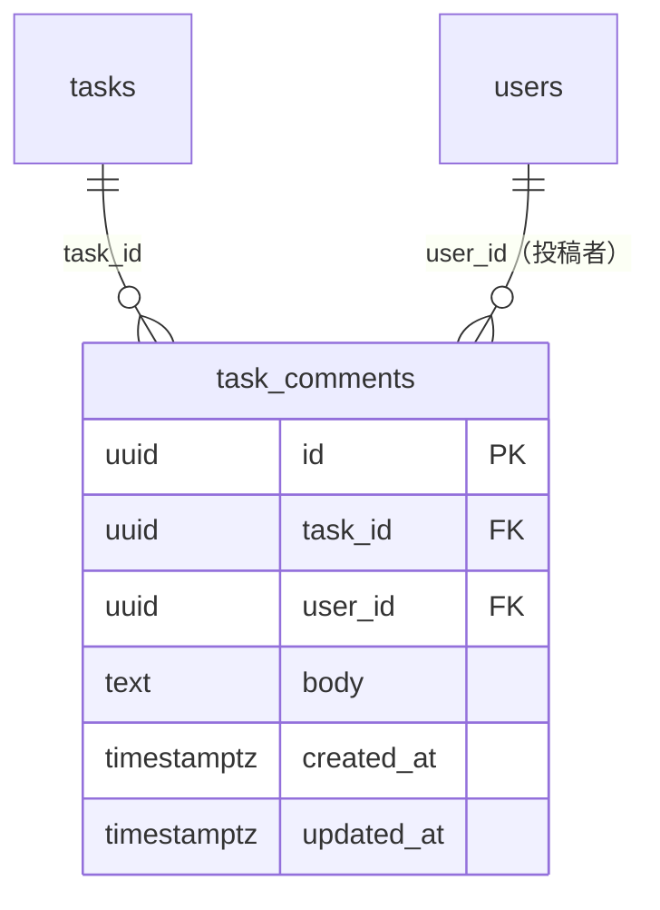
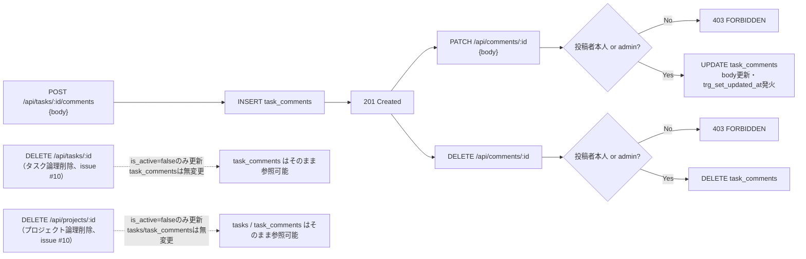
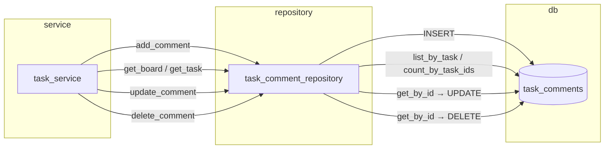

# task_comments テーブル 詳細設計

## 0. 関連ドキュメント

- 基本設計（正）：[`../../basic_design/01_database.md`](../../basic_design/01_database.md#36-task_comments)
- 全体設計：[`../../basic_design/00_overview.md`](../../basic_design/00_overview.md)
- 本テーブルを操作するAPI詳細設計
  - [`../api/tasks/06_get_task_comments.md`](../api/tasks/06_get_task_comments.md) GET /api/tasks/{task_id}/comments
  - [`../api/tasks/07_post_task_comments.md`](../api/tasks/07_post_task_comments.md) POST /api/tasks/{task_id}/comments
  - [`../api/tasks/08_patch_comment.md`](../api/tasks/08_patch_comment.md) PATCH /api/comments/{comment_id}
  - [`../api/tasks/09_delete_comment.md`](../api/tasks/09_delete_comment.md) DELETE /api/comments/{comment_id}
- 関連テーブル：[`06_table_tasks.md`](./06_table_tasks.md)、[`01_table_users.md`](./01_table_users.md)

## 1. 概要

| 項目 | 内容 |
|------|------|
| テーブル名 / 論理名 | `task_comments` / タスクコメント |
| 役割 | タスクに対する投稿者コメント。タスク詳細モーダルのスレッド表示に使用 |
| 想定件数・増加傾向 | タスク数 × 平均コメント数。学習用途のため小規模 |
| ライフサイクル | 作成契機：`POST /api/tasks/{task_id}/comments`。更新契機：`PATCH /api/comments/{comment_id}`（投稿者本人 or admin）。削除契機：`DELETE /api/comments/{comment_id}`（投稿者本人 or admin）のみ。物理削除。**タスク削除（`DELETE /api/tasks/{task_id}`）はissue #10で論理削除（`is_active=false`）に変更されたため`tasks`行は物理削除されず、`task_id`のFK `ON DELETE CASCADE` は通常運用では発火しない。タスク無効化後もコメントは物理削除されず参照可能なまま残る** |
| 関連ORMモデル | `models/task_comment.py :: TaskComment` |

## 2. カラム定義

| 論理名 | カラム名 | 型 | NULL | 既定値 | 主キー/一意 | 説明 |
|--------|----------|----|------|--------|--------------|------|
| ID | `id` | UUID | NO | `gen_random_uuid()` | PK | |
| タスクID | `task_id` | UUID | NO | - | FK → `tasks.id` | `ON DELETE CASCADE` |
| 投稿者 | `user_id` | UUID | NO | - | FK → `users.id` | `ON DELETE RESTRICT` |
| 本文 | `body` | TEXT | NO | - | - | 1〜2000文字（アプリ層で検証） |
| 作成日時 | `created_at` | TIMESTAMPTZ | NO | `now()` | - | |
| 更新日時 | `updated_at` | TIMESTAMPTZ | NO | `now()` | - | 編集時に更新 |

基本設計 `01_database.md` §3.6 の定義から逸脱しない。`updated_at` の自動更新トリガについて、基本設計 §5.1 の適用対象一覧には `task_comments` が明記されているため、`users`/`projects`/`tasks` と同様に `trg_set_updated_at` を適用する。

## 3. DDL

```sql
CREATE TABLE task_comments (
    id          UUID PRIMARY KEY DEFAULT gen_random_uuid(),
    task_id     UUID NOT NULL REFERENCES tasks(id) ON DELETE CASCADE,
    user_id     UUID NOT NULL REFERENCES users(id) ON DELETE RESTRICT,
    body        TEXT NOT NULL,
    created_at  TIMESTAMPTZ NOT NULL DEFAULT now(),
    updated_at  TIMESTAMPTZ NOT NULL DEFAULT now()
);

COMMENT ON TABLE task_comments IS 'タスクに対する投稿者コメント';
COMMENT ON COLUMN task_comments.body IS '1〜2000文字（アプリ層バリデーション。DB側にCHECK制約は設けない）';

CREATE INDEX ix_task_comments_task_created ON task_comments (task_id, created_at);

CREATE TRIGGER trg_task_comments_set_updated_at
    BEFORE UPDATE ON task_comments
    FOR EACH ROW
    EXECUTE FUNCTION trg_set_updated_at();
```

## 4. 制約・インデックス

| 種別 | 名称 | 対象カラム | 内容 | 目的（対応クエリ） |
|------|------|-----------|------|---------------------|
| PK | `task_comments_pkey` | `id` | 主キー | コメント単体の更新・削除対象特定 |
| FK | `task_comments_task_id_fkey` | `task_id` | → `tasks.id` `ON DELETE CASCADE` | タスクの物理削除経路が無いため通常運用では発火しない防御的制約（issue #10でタスク削除は論理削除化） |
| FK | `task_comments_user_id_fkey` | `user_id` | → `users.id` `ON DELETE RESTRICT` | 投稿者の履歴を保護（ユーザーは無効化のみで物理削除しないため通常は問題にならない） |
| NOT NULL | - | `task_id`, `user_id`, `body`, `created_at`, `updated_at` | 必須項目の担保 | - |
| INDEX | `ix_task_comments_task_created` | `(task_id, created_at)` | B-tree複合 | `GET /tasks/{id}/comments` のタスク別・投稿順取得（`01_database.md` Q-4） |

`body` の1〜2000文字制約はDB側 `CHECK` を設けずアプリ層（pydantic）で検証する。基本設計 §3.6 に「アプリ層で検証」と明記されているため、これに従う。

## 5. SQLAlchemyモデル定義

```python
class TaskComment(Base):
    __tablename__ = "task_comments"

    id: Mapped[uuid.UUID] = mapped_column(
        UUID(as_uuid=True), primary_key=True, server_default=text("gen_random_uuid()")
    )
    task_id: Mapped[uuid.UUID] = mapped_column(
        UUID(as_uuid=True), ForeignKey("tasks.id", ondelete="CASCADE"), nullable=False
    )
    user_id: Mapped[uuid.UUID] = mapped_column(
        UUID(as_uuid=True), ForeignKey("users.id", ondelete="RESTRICT"), nullable=False
    )
    body: Mapped[str] = mapped_column(Text, nullable=False)
    created_at: Mapped[datetime] = mapped_column(
        TIMESTAMP(timezone=True), nullable=False, server_default=func.now()
    )
    updated_at: Mapped[datetime] = mapped_column(
        TIMESTAMP(timezone=True), nullable=False, server_default=func.now()
    )

    task: Mapped["Task"] = relationship("Task", back_populates="comments", lazy="noload")
    author: Mapped["User"] = relationship("User", foreign_keys=[user_id], lazy="joined")
```

`task` 側からの逆参照は `lazy="noload"`（Task.comments と同じ理由でN+1回避のため専用クエリを使う）。`author` は一覧表示で必ず表示名が必要なため `joined` とする。

## 6. ER関連図



## 7. データ遷移図



`status` のような状態カラムを持たないため、状態遷移図（`stateDiagram-v2`）は作成せず、CRUDイベントを `flowchart` で示す。

## 8. SP/FNリポジトリ契約

repositoryは下表のSP/FN呼び出しとDTO写像だけを行い、`task_comments` への直接CRUDは行わない。コメントの存在・所属に必要な事実はFNで取得し、投稿者本人かどうかとHTTP 403への変換はAPI層で行う。

| repository契約 | DB呼び出し | 戻り値・エラー |
|----------------|------------|----------------|
| `create` | `CALL sp_add_task_comment(:task_id, :user_id, :body, :comment_id)`（`:comment_id` はOUTパラメータ。DB側で `gen_random_uuid()` により採番される） | `fn_get_comment_with_task(:comment_id)`で作成結果を取得 |
| `list_by_task` | `SELECT fn_list_task_comments(:task_id)` | コメント一覧 |
| `count_by_task_ids` | `fn_list_task_comments`の結果または専用FN集約 | N+1を発生させない |
| `get_by_id` | `SELECT fn_get_comment_with_task(:comment_id)` | 空集合は404へ変換 |
| `update` | `CALL sp_update_task_comment(:comment_id, :user_id, :body)` | 更新後をFNで取得 |
| `delete` | `CALL sp_delete_task_comment(:comment_id, :user_id)` | 投稿者事実は事前FN、APIで403変換 |

### 8.1 SP/FN実装の参照

`sp_add_task_comment` / `sp_update_task_comment` / `sp_delete_task_comment` / `fn_list_task_comments` / `fn_get_comment_with_task` の内部SQL・ロック方針・エラーコードは本ファイルに重複記載せず、[08_db_functions.md](./08_db_functions.md) §3.8（業務SP/FNの内部処理契約）を正とする。repositoryはこれらSP/FNの呼び出しと戻り値のDTO写像のみを実装し、`task_comments` テーブルへの直接SELECT/INSERT/UPDATE/DELETEは行わない。投稿者本人かどうかの判定とHTTP 403への変換はAPI層で行う。

コメント件数集計（`comment_count`）は `fn_list_task_comments` の結果、または専用の集約FNを用いてN+1を回避する。

## 9. 関数相関図



## 10. 想定クエリと性能

| No | ユースケース | クエリ概要 | 使用インデックス | 想定計画 |
|----|-------------|-----------|-------------------|----------|
| Q-TC-1 | コメント一覧取得 | `WHERE task_id=:tid ORDER BY created_at` | `ix_task_comments_task_created` | Index Scan（ソート済み） |
| Q-TC-2 | カンバンカードのコメント件数 | `WHERE task_id = ANY(:ids) GROUP BY task_id` | `ix_task_comments_task_created`（先頭列） | Bitmap Index Scan → HashAggregate |
| Q-TC-3 | コメント単体取得（編集・削除） | `WHERE id=:id` | PK | Index Scan（1行） |

## 11. 整合性・並行制御

| 項目 | 内容 |
|------|------|
| FK CASCADE（`task_id`） | `ON DELETE CASCADE`。`tasks`の物理削除経路が無いため通常運用では発火しない防御的制約（issue #10でタスク削除は論理削除化。プロジェクト削除も同様に論理削除のため`tasks`経由の連鎖も発火しない） |
| FK CASCADE（`user_id`） | `ON DELETE RESTRICT`。投稿者の履歴を保護。ユーザーは無効化のみで物理削除しないため通常は問題にならない |
| トランザクション境界 | 作成・更新・削除いずれも単一SQL文（明示的な複数文トランザクションは不要） |
| 楽観ロック | `task_comments` に `version` カラムは無い（基本設計上、楽観ロックの対象は `tasks` のみ）。同時編集は最終書き込み優先（Last Write Wins） |
| advisory lock | 使用しない |
| 認可 | 編集・削除は投稿者本人または admin のみ許可（サービス層で `comment.user_id == current_user.id or current_user.role == 'admin'` を判定し、該当しなければ `403`） |

## 12. テスト設計

| No | 区分 | ケース | 期待結果 | テスト名案 |
|----|------|--------|----------|------------|
| T-1 | 正常系 | プロジェクトメンバーがコメントを投稿する | `task_comments` に1行作成され `201` | `test_add_comment_success` |
| T-2 | 制約違反（FK） | 存在しない `task_id` を指定してコメント作成を試みる | 呼び出し元でタスク存在チェックにより`404`（DB到達前にサービス層で防止） | `test_add_comment_task_not_found_returns_404` |
| T-3 | 論理削除の非連鎖（issue #10） | コメントが存在するタスクを `DELETE /api/tasks/{id}` で無効化する | `tasks.is_active=false` に更新されるのみで、`task_comments` 行は削除されずそのまま参照できる | `test_deactivate_task_does_not_delete_comments` |
| T-4 | 論理削除の非連鎖・間接（issue #10） | コメントが存在するプロジェクトを `DELETE /api/projects/{id}` で無効化する | `projects.is_active=false` に更新されるのみで、`tasks` / `task_comments` は変化しない | `test_deactivate_project_does_not_delete_tasks_or_comments` |
| T-5 | 認可 | 投稿者本人以外の一般メンバーがコメントを編集/削除しようとする | `403 FORBIDDEN` | `test_update_delete_comment_forbidden_for_other_user` |
| T-6 | 認可 | admin が他人のコメントを編集/削除する | 成功する | `test_admin_can_update_delete_any_comment` |
| T-7 | バリデーション | `body` が空文字、または2001文字以上 | `422`（アプリ層バリデーション。DB到達前に拒否） | `test_comment_body_length_validation` |
| T-8 | 一覧 | 同一タスクに複数コメントがある状態で一覧取得 | `created_at` 昇順（投稿順）で返る | `test_list_comments_ordered_by_created_at_asc` |

## 13. 不明点・要検討事項

- `body` の文字数上限2000文字を扱う `core/config.py` の環境変数名は基本設計に明記がない。本書では言及を避けアプリ層pydanticスキーマの固定バリデーションとして扱ったが、環境変数化する場合は名称確定が必要（要検討）。
- コメント編集履歴（編集済みフラグや旧本文の保持）の要否は基本設計に記載が無いため、本書では扱わない（対象外と判断）。
