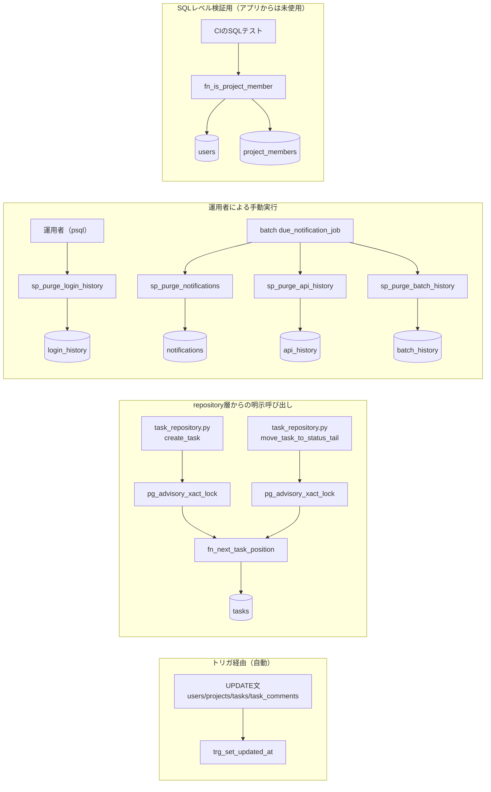

# 08 DB関数・ストアドプロシージャ詳細設計

## 関連ドキュメント

- [../../basic_design/01_database.md](../../basic_design/01_database.md)（§5 DB関数・プロシージャ、§6 マイグレーション方針）
- [09_migration.md](./09_migration.md)（本ファイルの各関数がどのAlembicリビジョンで適用されるか）
- [06_table_tasks.md](./06_table_tasks.md)（`fn_next_task_position` の対象テーブル）
- [01_table_users.md](./01_table_users.md) / [05_table_project_members.md](./05_table_project_members.md)（`fn_is_project_member` の対象テーブル）
- [07_table_task_comments.md](./07_table_task_comments.md)、[03_table_login_history.md](./03_table_login_history.md)

## 1. 概要

本ファイルは `basic_design/01_database.md` §5 に列挙された7つのDBオブジェクト（トリガ関数1・通常関数2・プロシージャ4）について、SQL本体・呼び出し元・排他制御・テスト方法を具体化する。

| 項目 | 内容 |
|------|------|
| 配置場所（手動DDL置き場） | `db/functions/*.sql`（トリガ関数・通常関数）、`db/procedures/*.sql`（プロシージャ） |
| 実行される正 | `api/alembic/versions/` 配下のリビジョンファイル。上記 `.sql` は `op.execute()` で読み込んで適用する（詳細は [09_migration.md](./09_migration.md) §2） |
| 前提拡張 | `pgcrypto`（`gen_random_uuid()` 用。関数自体はこの拡張に依存しない） |
| 命名規約 | トリガ関数 `trg_*` / 通常関数 `fn_*` / プロシージャ `sp_*`（`basic_design/01_database.md` の命名に準拠） |

## 2. 関数一覧

| No | 種別 | 関数名 | 引数 | 戻り値 | 用途 |
|----|------|--------|------|--------|------|
| 1 | トリガ関数 | `trg_set_updated_at` | なし | `TRIGGER` | `updated_at` の自動更新 |
| 2 | 関数 | `fn_is_project_member` | `p_project_id UUID`, `p_user_id UUID` | `BOOLEAN` | プロジェクト所属・管理者判定（DB側の二重防御） |
| 3 | 関数 | `fn_next_task_position` | `p_project_id UUID`, `p_status VARCHAR` | `INTEGER` | タスクの列内次position採番 |
| 4 | プロシージャ | `sp_purge_login_history` | `p_retention_days INTEGER` | なし | ログイン履歴の保持期間管理 |
| 5 | プロシージャ | `sp_purge_notifications` | `p_retention_days INTEGER` | なし | 通知の保持期間管理（batchから日次実行） |
| 6 | プロシージャ | `sp_purge_api_history` | `p_retention_days INTEGER` | なし | API履歴の保持期間管理（batchから日次実行） |
| 7 | プロシージャ | `sp_purge_batch_history` | `p_retention_days INTEGER` | なし | batch履歴の保持期間管理（batchから日次実行） |

## 3. 関数詳細

### 3.1 `db/functions/trg_set_updated_at.sql`

| 項目 | 内容 |
|------|------|
| シグネチャ | `trg_set_updated_at() RETURNS TRIGGER` |
| 引数 / 戻り値 | 引数なし。`NEW` レコード（`updated_at` を書き換えたもの）を返す |
| 適用対象 | `users` / `projects` / `tasks` / `task_comments` / `batch_history` の `BEFORE UPDATE FOR EACH ROW` |
| 呼び出し元 | アプリからは直接呼ばない。`UPDATE` 文実行時にPostgreSQLが自動起動する |
| 排他制御 | 対象行のロックは通常の `UPDATE` 行ロックに従う。関数自体に追加のロック取得はない |

```sql
CREATE OR REPLACE FUNCTION trg_set_updated_at()
RETURNS TRIGGER
LANGUAGE plpgsql
AS $$
BEGIN
    NEW.updated_at := now();
    RETURN NEW;
END;
$$;

-- 適用例（対象4テーブル分をAlembicリビジョンで繰り返す）
CREATE TRIGGER trg_users_set_updated_at
    BEFORE UPDATE ON users
    FOR EACH ROW
    EXECUTE FUNCTION trg_set_updated_at();
```

**テスト方法**：`UPDATE users SET last_name = 'x' WHERE id = :id;` を実行し、`updated_at` が実行前より新しい値になっていることを確認する（`test_db_functions.py::test_trg_set_updated_at_users` 等、対象4テーブル分）。

### 3.2 `db/functions/fn_is_project_member.sql`

| 項目 | 内容 |
|------|------|
| シグネチャ | `fn_is_project_member(p_project_id UUID, p_user_id UUID) RETURNS BOOLEAN` |
| 引数 | `p_project_id`：判定対象プロジェクトID。`p_user_id`：判定対象ユーザーID |
| 戻り値 | 所属または管理者であれば `true`、`users.is_active = false` または非所属・非管理者なら `false` |
| 呼び出し元 | `service/` 層からは呼ばない（正はアプリ層の `fn_is_project_member` 相当ロジック）。CIの検証用SQLテスト、および将来的な行レベルセキュリティ（RLS）導入時の判定関数候補として用意する |
| 排他制御 | 参照のみ。追加ロックなし（`SELECT` はスナップショット読み取り） |

```sql
CREATE OR REPLACE FUNCTION fn_is_project_member(
    p_project_id UUID,
    p_user_id UUID
) RETURNS BOOLEAN
LANGUAGE sql
STABLE
AS $$
    SELECT EXISTS (
        SELECT 1
        FROM users u
        WHERE u.id = p_user_id
          AND u.is_active = true
          AND (
              u.role = 'admin'
              OR EXISTS (
                  SELECT 1
                  FROM project_members pm
                  WHERE pm.project_id = p_project_id
                    AND pm.user_id = p_user_id
              )
          )
    );
$$;
```

**テスト方法**：
- 所属メンバーで `true` を返すこと
- 非所属の一般ユーザーで `false` を返すこと
- 非所属でも `role = 'admin'` なら `true` を返すこと
- `is_active = false` のユーザーは所属していても `false` を返すこと

（`test_db_functions.py::test_fn_is_project_member_*`）

**要検討**：本基本設計はアプリ層での認可判定を正としており（`basic_design/01_database.md` §5.2 備考）、本関数を実際にRLSポリシーやSQL側チェック制約として使うかは明記されていない。現状は「SQLレベルの検証テスト用」に留め、アプリ層の認可実装（[../auth/05_rbac.md](../auth/05_rbac.md)）とロジックの二重化が生じないよう、将来変更時は両方の同時更新が必要である旨を運用上の注意として残す。

### 3.3 `db/functions/fn_next_task_position.sql`

| 項目 | 内容 |
|------|------|
| シグネチャ | `fn_next_task_position(p_project_id UUID, p_status VARCHAR) RETURNS INTEGER` |
| 引数 | `p_project_id`：対象プロジェクトID。`p_status`：対象カンバン列（`todo` / `in_progress` / `done`） |
| 戻り値 | 当該 `(project_id, status)` の列における次のposition（現在の最大値+1。行が0件なら0） |
| 呼び出し元 | `repository/task_repository.py :: create_task`、`repository/task_repository.py :: move_task_to_status_tail`（列間移動時の末尾追加） |
| 前提 | **呼び出し側が同一トランザクション内で `pg_advisory_xact_lock` を取得済みであること**（`basic_design/01_database.md` §5.3・§3.5「同時更新制御」）。本関数自体はロックを取得しない |

```sql
CREATE OR REPLACE FUNCTION fn_next_task_position(
    p_project_id UUID,
    p_status VARCHAR
) RETURNS INTEGER
LANGUAGE sql
AS $$
    SELECT COALESCE(MAX(position), -1) + 1
    FROM tasks
    WHERE project_id = p_project_id
      AND status = p_status;
$$;
```

**排他制御（呼び出し側の責務）**：

| 項目 | 内容 |
|------|------|
| ロック種別 | `pg_advisory_xact_lock(hashtext(p_project_id::text \|\| ':' \|\| p_status))` をトランザクション先頭で取得。トランザクションコミット/ロールバック時に自動解放 |
| ロック粒度 | プロジェクトID + status の組み合わせ単位（列単位）。同一プロジェクトでも別列の並行更新はブロックしない |
| 呼び出し順序 | ① advisory lock 取得 → ② `fn_next_task_position` 呼び出し（または再並べ替え処理） → ③ `INSERT`/`UPDATE` → ④ `COMMIT` |
| デッドロック対策 | 単一列に対する単一ロックのみ取得するため、複数ロックの取得順序起因のデッドロックは発生しない。列間移動（元の列 → 先の列）の場合も `LEAST/GREATEST` でロック取得順をプロジェクトID文字列＋status名の昇順に固定する |

```sql
-- repository層が発行するSQLの流れ（プレースホルダ表記）
SELECT pg_advisory_xact_lock(hashtext(:project_id || ':' || :status));
SELECT fn_next_task_position(:project_id, :status) AS next_position;
INSERT INTO tasks (id, project_id, title, status, position, ...)
VALUES (gen_random_uuid(), :project_id, :title, :status, :next_position, ...);
```

**テスト方法**：
- 空の列に対して `0` を返すこと
- 既存position `{0,1,2}` に対して `3` を返すこと
- 2つの並行トランザクションが同一 `(project_id, status)` に対して同時採番を試みても、advisory lock により直列化され、position の重複が発生しないこと（`asyncio.gather` で同時実行するテスト、または `pytest-postgresql` の2コネクションを使った統合テスト）

（`test_db_functions.py::test_fn_next_task_position_*`）

### 3.4 `db/procedures/sp_purge_login_history.sql`

| 項目 | 内容 |
|------|------|
| シグネチャ | `sp_purge_login_history(p_retention_days INTEGER)` |
| 引数 | `p_retention_days`：保持日数。環境変数 `LOGIN_HISTORY_RETENTION_DAYS`（既定90）をアプリ側から渡す |
| 戻り値 | なし（`PROCEDURE`。副作用として `login_history` の行を削除） |
| 呼び出し元 | アプリ内cronは設けない（学習範囲外、`basic_design/01_database.md` §5.4）。運用者が `psql` から月次で手動実行する |
| 排他制御 | `DELETE` 対象行に対する通常の行ロックのみ。大量削除時のロック長時間化を避けるため、運用手順として `LIMIT` によるバッチ削除を推奨する（下記「運用時の注意」参照） |

```sql
CREATE OR REPLACE PROCEDURE sp_purge_login_history(
    p_retention_days INTEGER
)
LANGUAGE plpgsql
AS $$
BEGIN
    DELETE FROM login_history
    WHERE created_at < now() - (p_retention_days || ' days')::interval;
END;
$$;
```

**呼び出し方法（運用者が手動実行）**：

```sql
CALL sp_purge_login_history(<LOGIN_HISTORY_RETENTION_DAYS>);
```

`LOGIN_HISTORY_RETENTION_DAYS` はハードコードせず、実行時に `psql -v retention_days=${LOGIN_HISTORY_RETENTION_DAYS}` のように環境変数値を明示的に渡す運用とする（[../infra/04_env_config.md](../infra/04_env_config.md) 参照）。

**運用時の注意（要検討）**：`login_history` の想定件数が大きくなった場合、`DELETE` 一括実行が長時間ロックを保持する可能性がある。バッチ分割削除（`LIMIT` + ループ）への変更要否は基本設計に明記がなく要検討。学習用途の想定データ量では現状のシンプルな実装で問題ないと判断する。

**テスト方法**：
- `p_retention_days` より古い `created_at` の行が削除されること
- `p_retention_days` 以内の行が削除されずに残ること
- 空テーブルに対して呼び出してもエラーにならないこと

（`test_db_functions.py::test_sp_purge_login_history_*`）

### 3.5 `db/procedures/sp_purge_notifications.sql`

| 項目 | 内容 |
|------|------|
| シグネチャ | `sp_purge_notifications(p_retention_days INTEGER)` |
| 呼び出し元 | `batch/app/jobs/due_notification_job.py`。運用者が手動で実行するAPIは提供しない |
| 処理 | `DELETE FROM notifications WHERE created_at < now() - (p_retention_days || ' days')::interval` |
| 排他制御 | PostgreSQLの通常のDELETE行ロック。通知作成とは別トランザクションで実行する |
| 入力検証 | `p_retention_days > 0` でない場合は例外にする |

```sql
CREATE OR REPLACE PROCEDURE sp_purge_notifications(
    p_retention_days INTEGER
)
LANGUAGE plpgsql
AS $$
BEGIN
    IF p_retention_days <= 0 THEN
        RAISE EXCEPTION 'p_retention_days must be positive';
    END IF;
    DELETE FROM notifications
     WHERE created_at < now() - (p_retention_days || ' days')::interval;
END;
$$;
```

テストでは保持期間境界、未読・既読双方の削除、空テーブル、0以下の拒否を確認する。

### 3.6 `db/procedures/sp_purge_api_history.sql`

| 項目 | 内容 |
|------|------|
| シグネチャ | `sp_purge_api_history(p_retention_days INTEGER)` |
| 呼び出し元 | batchのジョブ終了処理（運用者向けAPIは提供しない） |
| 処理 | `api_history.created_at`が保持期限より前の行をDELETE |
| 入力検証 | `p_retention_days > 0` でない場合は例外 |
| 保持設定 | `API_HISTORY_RETENTION_DAYS`（既定30） |

```sql
CREATE OR REPLACE PROCEDURE sp_purge_api_history(p_retention_days INTEGER)
LANGUAGE plpgsql
AS $$
BEGIN
    IF p_retention_days <= 0 THEN
        RAISE EXCEPTION 'p_retention_days must be positive';
    END IF;
    DELETE FROM api_history
     WHERE created_at < now() - (p_retention_days || ' days')::interval;
END;
$$;
```

### 3.7 `db/procedures/sp_purge_batch_history.sql`

| 項目 | 内容 |
|------|------|
| シグネチャ | `sp_purge_batch_history(p_retention_days INTEGER)` |
| 呼び出し元 | batchのジョブ終了処理（運用者向けAPIは提供しない） |
| 処理 | `batch_history.started_at`が保持期限より前の行をDELETE |
| 入力検証 | `p_retention_days > 0` でない場合は例外 |
| 保持設定 | `BATCH_HISTORY_RETENTION_DAYS`（既定30） |

```sql
CREATE OR REPLACE PROCEDURE sp_purge_batch_history(p_retention_days INTEGER)
LANGUAGE plpgsql
AS $$
BEGIN
    IF p_retention_days <= 0 THEN
        RAISE EXCEPTION 'p_retention_days must be positive';
    END IF;
    DELETE FROM batch_history
     WHERE started_at < now() - (p_retention_days || ' days')::interval;
END;
$$;
```

## 4. 関数相関図



## 5. テスト設計

| No | 区分 | ケース | 期待結果 | テスト名案 |
|----|------|--------|----------|-----------|
| 1 | 正常系 | `trg_set_updated_at`：対象4テーブルいずれかを `UPDATE` | `updated_at` が更新される | `test_trg_set_updated_at_updates_timestamp` |
| 2 | 正常系 | `fn_is_project_member`：所属メンバーで判定 | `true` | `test_fn_is_project_member_member_returns_true` |
| 3 | 正常系 | `fn_is_project_member`：非所属の管理者で判定 | `true` | `test_fn_is_project_member_admin_returns_true` |
| 4 | 異常系 | `fn_is_project_member`：無効化ユーザー（`is_active=false`）で判定 | `false` | `test_fn_is_project_member_inactive_returns_false` |
| 5 | 正常系 | `fn_next_task_position`：空の列 | `0` | `test_fn_next_task_position_empty_column` |
| 6 | 正常系 | `fn_next_task_position`：既存position `{0,1,2}` | `3` | `test_fn_next_task_position_existing_rows` |
| 7 | 並行系 | `fn_next_task_position`：同一列への同時採番2並列 | position重複なし、直列化される | `test_fn_next_task_position_concurrent_no_duplicate` |
| 8 | 正常系 | `sp_purge_login_history`：保持期間超過行あり | 対象行が削除される | `test_sp_purge_login_history_deletes_expired` |
| 9 | 正常系 | `sp_purge_login_history`：保持期間内の行 | 削除されない | `test_sp_purge_login_history_keeps_recent` |
| 10 | 異常系 | `sp_purge_login_history`：空テーブルに対して実行 | エラーなく正常終了 | `test_sp_purge_login_history_empty_table_noop` |
| 11 | 正常系 | `sp_purge_notifications`：保持期間超過行あり | 未読・既読を問わず対象行が削除される | `test_sp_purge_notifications_deletes_expired` |
| 12 | 異常系 | `sp_purge_notifications`：保持日数0以下 | 明示的なエラーで終了 | `test_sp_purge_notifications_rejects_non_positive_days` |
| 13 | 正常系 | `sp_purge_api_history`：保持期間超過行あり | 対象行が削除される | `test_sp_purge_api_history_deletes_expired` |
| 14 | 異常系 | `sp_purge_api_history`：保持日数0以下 | 明示的なエラーで終了 | `test_sp_purge_api_history_rejects_non_positive_days` |
| 15 | 正常系 | `sp_purge_batch_history`：保持期間超過行あり | 対象行が削除される | `test_sp_purge_batch_history_deletes_expired` |
| 16 | 異常系 | `sp_purge_batch_history`：保持日数0以下 | 明示的なエラーで終了 | `test_sp_purge_batch_history_rejects_non_positive_days` |

## 6. 不明点・要検討事項

- `fn_is_project_member` をアプリ層の認可判定と完全に一致させたSQLレベルテストとして常時運用するか、将来的にRLSポリシーへ組み込むかは基本設計に明記がなく要検討。
- `sp_purge_login_history` のバッチ削除化（大量データ時のロック長時間化対策）は基本設計のスコープ外であり、想定データ量次第で要検討。
- `db/functions/` `db/procedures/` の `.sql` ファイルをAlembicリビジョンからどのAPIで読み込むか（`op.execute(open(path).read())` か `context.execute()` か）はマイグレーション実装側の裁量であり、本ファイルでは呼び出し規約のみを規定する（詳細は [09_migration.md](./09_migration.md) 参照）。
