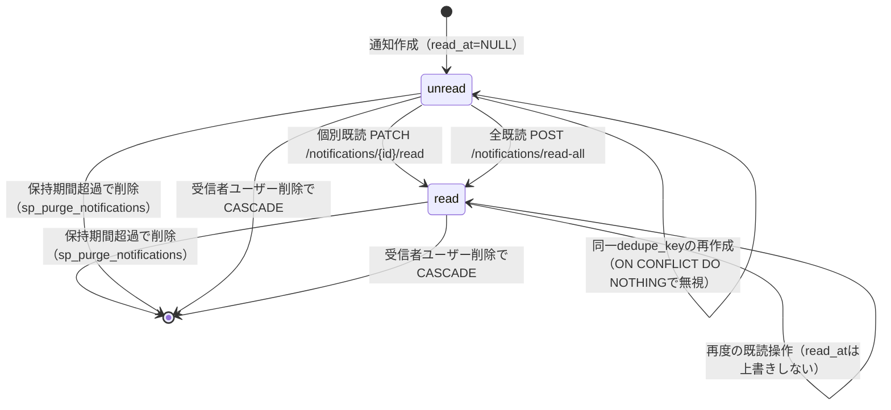
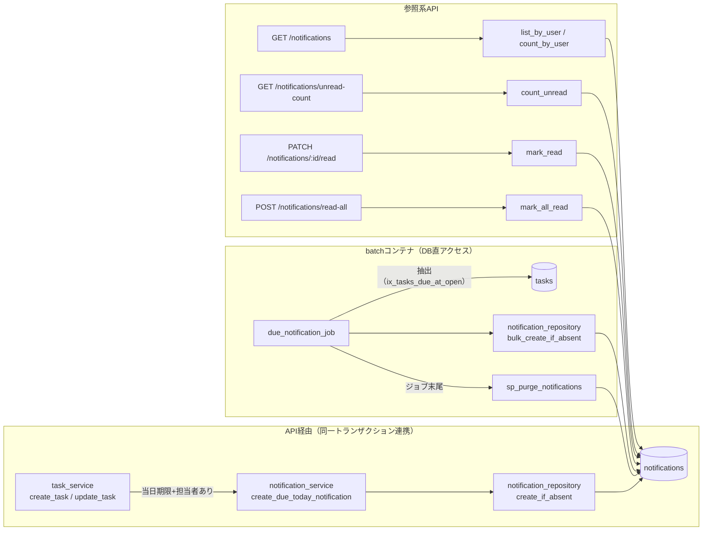

# notifications テーブル 詳細設計

## 0. 関連ドキュメント

- 基本設計（正）：[`../../basic_design/01_database.md`](../../basic_design/01_database.md#38-notifications)（§3.8 テーブル定義、§4.1.1 状態遷移、§5.5 `sp_purge_notifications`、§7 Q-8/Q-9）
- 全体設計：[`../../basic_design/00_overview.md`](../../basic_design/00_overview.md)
- [`../../basic_design/02_redis.md`](../../basic_design/02_redis.md#44-期限通知バッチの実行ロック)（`lock:notify_due:{YYYY-MM-DD}:{slot}` 実行ロック）
- [`../../basic_design/04_api.md`](../../basic_design/04_api.md)（§2.6/§3.3 通知API、§6.3 バッチシーケンス、§7.3 `notification_service`）
- [`../../basic_design/06_infra_cicd.md`](../../basic_design/06_infra_cicd.md)（§4 環境変数：`NOTIFY_DUE_*` / `NOTIFICATION_RETENTION_DAYS` / `APP_TIMEZONE`）
- 本テーブルを操作するAPI詳細設計
  - `../api/notifications/01_get_notifications.md` GET /api/notifications（未作成。他担当割当。本書からは未リンク）
  - `../api/notifications/02_get_unread_count.md` GET /api/notifications/unread-count（同上）
  - `../api/notifications/03_patch_notification_read.md` PATCH /api/notifications/{id}/read（同上）
  - `../api/notifications/04_post_notifications_read_all.md` POST /api/notifications/read-all（同上）
  - [`../api/tasks/02_post_project_tasks.md`](../api/tasks/02_post_project_tasks.md)（タスク作成時の通知作成連携）
  - [`../api/tasks/04_patch_task.md`](../api/tasks/04_patch_task.md)（`due_at` 変更時の通知作成連携）
- 関連テーブル：[`06_table_tasks.md`](./06_table_tasks.md)（`task_id` FK、`due_at`）、[`01_table_users.md`](./01_table_users.md)（`user_id` FK）
- 設計方針：[`00_policy.md`](./00_policy.md)（`APP_TIMEZONE`、命名規約、共通カラム方針）
- DB関数：[`08_db_functions.md`](./08_db_functions.md)（`sp_purge_notifications` は他担当ファイル。§9・§13で参照）

## 1. 概要

| 項目 | 内容 |
|------|------|
| テーブル名 / 論理名 | `notifications` / アプリ内通知 |
| 役割 | タスクの期限に関するアプリ内通知（要件書 §3.4 N-1〜N-6）を、ユーザー1人×1通知＝1行で保持する。既読状態は `read_at` の有無で表す |
| 想定件数・増加傾向 | ユーザー数 × 担当タスク数 × 通知契機（作成/更新/10時・17時バッチ）。`NOTIFICATION_RETENTION_DAYS`（既定90）で上限化される |
| ライフサイクル | 作成契機：①`POST /api/projects/{project_id}/tasks`（当日期限＋担当者あり）、②`PATCH /api/tasks/{task_id}`（`due_at` 変更＋当日期限＋担当者あり）、③毎日10時・17時の `due_notification_job`（`batch` コンテナ）。更新契機：`PATCH /api/notifications/{id}/read`、`POST /api/notifications/read-all`（いずれも `read_at` のみ）。削除契機：`sp_purge_notifications` による保持期間超過分の一括削除、または受信者ユーザー削除時のCASCADE。物理削除のみ |
| 関連ORMモデル | `models/notification.py :: Notification` |

## 2. カラム定義

| 論理名 | カラム名 | 型 | NULL | 既定値 | 主キー/一意 | 説明 |
|--------|----------|----|------|--------|--------------|------|
| ID | `id` | UUID | NO | `gen_random_uuid()` | PK | |
| 受信者ユーザーID | `user_id` | UUID | NO | - | FK → `users.id` | `ON DELETE CASCADE`。通知の受信者 |
| 対象タスクID | `task_id` | UUID | YES | - | FK → `tasks.id` | `ON DELETE SET NULL`。タスクが削除されても通知履歴自体は残す |
| 種別 | `type` | VARCHAR(30) | NO | - | - | `CHECK (type IN ('due_soon_batch','due_today_created','due_today_updated'))` |
| 見出し | `title` | VARCHAR(200) | NO | - | - | 作成時点のタスク名をスナップショット（タスク削除・改名後も内容が分かるようにするため） |
| 本文 | `body` | TEXT | YES | - | - | 補足本文（例：「期限が近いタスクです」） |
| 期限スナップショット | `due_at` | TIMESTAMPTZ | YES | - | - | 作成時点の `tasks.due_at` のコピー。UTC保存、表示は `APP_TIMEZONE` に変換（`00_policy.md` §4） |
| 重複防止キー | `dedupe_key` | VARCHAR(120) | NO | - | 一意（`user_id` 内） | `UNIQUE (user_id, dedupe_key)`。採番規則は §5 |
| 既読日時 | `read_at` | TIMESTAMPTZ | YES | `NULL` | - | `NULL` は未読。既読は不可逆（未読へ戻す操作は提供しない） |
| 作成日時 | `created_at` | TIMESTAMPTZ | NO | `now()` | - | |

`updated_at` は持たない。通知は作成後に `read_at` 以外を書き換えないため、`06_table_tasks.md` のような更新契機トリガ（`trg_set_updated_at`）は不要（`00_policy.md` §5）。

基本設計 `01_database.md` §3.8 の定義から逸脱しない。

## 3. DDL

```sql
CREATE TABLE notifications (
    id          UUID PRIMARY KEY DEFAULT gen_random_uuid(),
    user_id     UUID NOT NULL REFERENCES users(id) ON DELETE CASCADE,
    task_id     UUID REFERENCES tasks(id) ON DELETE SET NULL,
    type        VARCHAR(30) NOT NULL
                CONSTRAINT ck_notifications_type
                CHECK (type IN ('due_soon_batch', 'due_today_created', 'due_today_updated')),
    title       VARCHAR(200) NOT NULL,
    body        TEXT,
    due_at      TIMESTAMPTZ,
    dedupe_key  VARCHAR(120) NOT NULL,
    read_at     TIMESTAMPTZ,
    created_at  TIMESTAMPTZ NOT NULL DEFAULT now(),
    CONSTRAINT uq_notifications_user_dedupe UNIQUE (user_id, dedupe_key)
);

COMMENT ON TABLE notifications IS 'アプリ内通知。ユーザー1人×1通知=1行。既読はread_atの有無で表現';
COMMENT ON COLUMN notifications.type IS 'due_soon_batch / due_today_created / due_today_updated のいずれか（CHECK制約）';
COMMENT ON COLUMN notifications.title IS '作成時点のタスク名スナップショット。タスク削除後も内容確認できるようにするため';
COMMENT ON COLUMN notifications.dedupe_key IS '通知の重複作成防止キー。採番規則は10_table_notifications.md §5';

CREATE INDEX ix_notifications_user_created ON notifications (user_id, created_at DESC);
CREATE INDEX ix_notifications_user_unread ON notifications (user_id) WHERE read_at IS NULL;
```

`uq_notifications_user_dedupe` はテーブル制約として定義し（`CONSTRAINT ... UNIQUE`）、`INSERT ... ON CONFLICT (user_id, dedupe_key) DO NOTHING`（§5）の競合対象インデックスとして使用する。`ix_notifications_user_unread` は部分インデックスのため `CREATE INDEX` を分離して記述する（`06_table_tasks.md` の `uq_tasks_project_status_position` とは異なり `DEFERRABLE` は不要。通知は再採番のような中間状態を持たないため）。

## 4. 制約・インデックス

| 種別 | 名称 | 対象カラム | 内容 | 目的（対応クエリ） |
|------|------|-----------|------|---------------------|
| PK | `notifications_pkey` | `id` | 主キー | `PATCH /notifications/{id}/read` の対象特定 |
| FK | `notifications_user_id_fkey` | `user_id` | → `users.id` `ON DELETE CASCADE` | 受信者ユーザー削除時に通知も自動削除（監査対象ではなく個人の作業支援情報のため履歴保護は不要） |
| FK | `notifications_task_id_fkey` | `task_id` | → `tasks.id` `ON DELETE SET NULL` | タスク削除後も通知履歴自体は残し、`task` 欄のみ `null` として返す（`04_api.md` §3.3） |
| CHECK | `ck_notifications_type` | `type` | `type IN ('due_soon_batch','due_today_created','due_today_updated')` | 不正な種別値の混入防止 |
| UNIQUE | `uq_notifications_user_dedupe` | `(user_id, dedupe_key)` | 一意制約 | 重複通知の防止。`ON CONFLICT` の対象（§5） |
| INDEX | `ix_notifications_user_created` | `(user_id, created_at DESC)` | B-tree | 通知一覧（`GET /notifications`、Q-9）の取得。`user_id` で絞り込み `created_at DESC` でソート済み |
| INDEX | `ix_notifications_user_unread` | `(user_id) WHERE read_at IS NULL` | 部分インデックス | 未読件数（`GET /notifications/unread-count`、Q-8）の取得。ポーリングで最高頻度に叩かれるため、既読行を除いた小さいインデックスで応答する |

`ix_notifications_user_unread` は既読になった行を自動的にインデックスから除外する（部分インデックスの性質上、`read_at` がNULLでなくなった時点でエントリが除かれる）ため、既読が積み重なってもインデックスサイズは未読件数に応じてのみ増減し、保持期間分の全行に対してスキャンする必要がない。

## 5. `dedupe_key` 採番規則

| `type` | 発生契機 | `dedupe_key` の形式 | 意図 |
|--------|----------|----------------------|------|
| `due_soon_batch` | 毎日10時・17時の `due_notification_job`（`NOTIFY_DUE_RUN_HOURS` と `NOTIFY_DUE_CRON_MINUTE`） | `batch:{実行日 YYYY-MM-DD（APP_TIMEZONE基準）}:{slot}:{task_id}` | 同一実行枠の再実行では1タスク1通知に収め、10時・17時は別通知とする。日が変われば `dedupe_key` も変わるため、期限切れ未完了タスクは再びリマインドされる（`01_database.md` §3.8 の「下限なし」抽出条件と対） |
| `due_today_created` | `POST /projects/{id}/tasks`（担当者あり・`due_at` が `APP_TIMEZONE` の当日） | `created:{task_id}` | タスク作成は1回のみのイベントのため、キーに変動要素を含めない（1タスク1回だけ） |
| `due_today_updated` | `PATCH /tasks/{id}`（`due_at` 変更・担当者あり・変更後が `APP_TIMEZONE` の当日） | `updated:{task_id}:{変更後due_atのISO8601(UTC)}` | 同じ日時へ設定し直した場合は新規通知を作らず、別の日時へ変更した場合のみ新たに通知する。UTC正規化した文字列をキーに含めることで、タイムゾーン表記の揺れによる意図しない重複/欠落を防ぐ |

**`INSERT ... ON CONFLICT (user_id, dedupe_key) DO NOTHING` を使う理由**

1. 通知作成はタスク作成／更新と**同一トランザクション**で行う（`04_api.md` §3.3）。事前に `SELECT ... FOR UPDATE` で重複有無を確認してから `INSERT` する方式は、確認とINSERTの間に別トランザクションが同じ `dedupe_key` を挿入する競合（TOCTOU）を防げない。`ON CONFLICT DO NOTHING` は1文でアトミックに「存在しなければ作る」を実現する。
2. `due_soon_batch` はチャンク単位（`NOTIFY_DUE_BATCH_CHUNK_SIZE` 件ずつ）で `INSERT` するため、ジョブが二重起動された場合（Redisロック取得に失敗しなかった稀なケースを含む）でも `ON CONFLICT DO NOTHING` により後発の `INSERT` が競合0件として正常終了し、例外にならない。
3. 競合時に「作成0件」として処理を継続し、タスク側の処理（作成・更新）自体は失敗させない（`04_api.md` §3.3「通知だけが残る・通知だけが欠けるという不整合を避けるため」）。

```sql
INSERT INTO notifications (user_id, task_id, type, title, body, due_at, dedupe_key)
VALUES (:user_id, :task_id, :type, :title, :body, :due_at, :dedupe_key)
ON CONFLICT (user_id, dedupe_key) DO NOTHING
RETURNING id;
```

`RETURNING id` が0行であれば「既に同じ通知が存在した（作成しなかった）」と判定できる。

## 6. SQLAlchemyモデル定義

```python
class NotificationType(str, enum.Enum):
    DUE_SOON_BATCH = "due_soon_batch"
    DUE_TODAY_CREATED = "due_today_created"
    DUE_TODAY_UPDATED = "due_today_updated"


class Notification(Base):
    __tablename__ = "notifications"
    __table_args__ = (
        CheckConstraint(
            "type IN ('due_soon_batch','due_today_created','due_today_updated')",
            name="ck_notifications_type",
        ),
        UniqueConstraint("user_id", "dedupe_key", name="uq_notifications_user_dedupe"),
        Index("ix_notifications_user_created", "user_id", "created_at", postgresql_ops={"created_at": "DESC"}),
        Index(
            "ix_notifications_user_unread", "user_id",
            postgresql_where=text("read_at IS NULL"),
        ),
    )

    id: Mapped[uuid.UUID] = mapped_column(
        UUID(as_uuid=True), primary_key=True, server_default=text("gen_random_uuid()")
    )
    user_id: Mapped[uuid.UUID] = mapped_column(
        UUID(as_uuid=True), ForeignKey("users.id", ondelete="CASCADE"), nullable=False
    )
    task_id: Mapped[uuid.UUID | None] = mapped_column(
        UUID(as_uuid=True), ForeignKey("tasks.id", ondelete="SET NULL"), nullable=True
    )
    type: Mapped[str] = mapped_column(String(30), nullable=False)
    title: Mapped[str] = mapped_column(String(200), nullable=False)
    body: Mapped[str | None] = mapped_column(Text, nullable=True)
    due_at: Mapped[datetime | None] = mapped_column(TIMESTAMP(timezone=True), nullable=True)
    dedupe_key: Mapped[str] = mapped_column(String(120), nullable=False)
    read_at: Mapped[datetime | None] = mapped_column(TIMESTAMP(timezone=True), nullable=True)
    created_at: Mapped[datetime] = mapped_column(
        TIMESTAMP(timezone=True), nullable=False, server_default=func.now()
    )

    user: Mapped["User"] = relationship("User", lazy="noload")
    task: Mapped["Task | None"] = relationship("Task", lazy="joined")
```

`user` は N+1 回避のため一覧取得時に個別ロードしない（`lazy="noload"`。JWT/セッションで既にログインユーザーが分かっているため紐付け不要）。`task` は一覧レスポンスの `task` 欄（`04_api.md` §3.3。タスク削除済みなら `null`）に必要なため `lazy="joined"` とする。`06_table_tasks.md` の `comments` と同様の判断基準（用途が明確な参照のみ eager load）に従う。

## 7. データ遷移図（状態遷移。基本設計 §4.1.1 と同一）



既読は不可逆であり、未読へ戻す操作は提供しない。全既読（`mark_all_read`）は `WHERE user_id=:me AND read_at IS NULL` に限定して更新するため、既に既読の通知の `read_at` は変化しない（冪等）。保持期間超過による削除は `read_at` の有無を問わず対象になる（§9）。

## 8. リポジトリ関数詳細

### 8.1 `repository/notification_repository.py :: list_by_user`

| 項目 | 内容 |
|------|------|
| シグネチャ | `async def list_by_user(session: AsyncSession, *, user_id: UUID, page: int, per_page: int, unread_only: bool) -> Page[Notification]` |
| 引数 / 戻り値 | 受信者ID・ページング条件・未読限定フラグ → ページングされた `Notification` 一覧 |
| 発行SQL | ```sql\nSELECT n.id, n.type, n.title, n.body, n.due_at, n.read_at, n.created_at,\n       t.id AS task_id, t.project_id, t.title AS task_title\nFROM notifications n\nLEFT JOIN tasks t ON t.id = n.task_id\nWHERE n.user_id = :user_id\n  AND (:unread_only = false OR n.read_at IS NULL)\nORDER BY n.created_at DESC\nLIMIT :per_page OFFSET :offset;\n``` |
| 使用インデックス | `ix_notifications_user_created`（`unread_only=false`）／`ix_notifications_user_unread` と `ix_notifications_user_created` の両方に該当（`unread_only=true`。実行計画はPostgreSQLの選択に委ねる） |
| 送出例外 | なし |
| 処理内容 | `LEFT JOIN` によりタスクが削除済み（`task_id IS NULL`）の行も欠落させず取得し、`task` 欄を `null` としてレスポンスに反映する（`04_api.md` §3.3） |

### 8.2 `repository/notification_repository.py :: count_by_user`

| 項目 | 内容 |
|------|------|
| シグネチャ | `async def count_by_user(session: AsyncSession, *, user_id: UUID, unread_only: bool) -> int` |
| 引数 / 戻り値 | 受信者ID・未読限定フラグ → 件数 |
| 発行SQL | ```sql\nSELECT count(*) FROM notifications\nWHERE user_id = :user_id\n  AND (:unread_only = false OR read_at IS NULL);\n``` |
| 使用インデックス | `ix_notifications_user_created`（`unread_only=false`）／`ix_notifications_user_unread`（`unread_only=true`） |
| 送出例外 | なし |
| 処理内容 | 一覧レスポンスの `meta.total`（`unread_only=true` 時は未読総数）に使用。`list_by_user` とは別クエリで発行し、`COUNT(*) OVER()` は使わない（`04_table_projects.md` 系のページング方針に合わせる） |

### 8.3 `repository/notification_repository.py :: count_unread`

| 項目 | 内容 |
|------|------|
| シグネチャ | `async def count_unread(session: AsyncSession, *, user_id: UUID) -> int` |
| 引数 / 戻り値 | 受信者ID → 未読件数 |
| 発行SQL | ```sql\nSELECT count(*) FROM notifications\nWHERE user_id = :user_id AND read_at IS NULL;\n``` |
| 使用インデックス | `ix_notifications_user_unread` |
| 送出例外 | なし |
| 処理内容 | `GET /notifications/unread-count`（ポーリングで最高頻度）専用の軽量クエリ。通知本体を返さず件数のみ集計するため `ix_notifications_user_unread` のみで応答できる |

### 8.4 `repository/notification_repository.py :: mark_read`

| 項目 | 内容 |
|------|------|
| シグネチャ | `async def mark_read(session: AsyncSession, *, user_id: UUID, notification_id: UUID) -> Notification \| None` |
| 引数 / 戻り値 | 受信者ID・通知ID → 更新後 `Notification`（自分宛てでない/存在しない場合は `None`） |
| 発行SQL | ```sql\nUPDATE notifications\nSET read_at = COALESCE(read_at, now())\nWHERE id = :notification_id AND user_id = :user_id\nRETURNING id, read_at;\n``` |
| 使用インデックス | PK（`WHERE id=...`）。`user_id` はPK取得後の本人確認フィルタ |
| 送出例外 | なし（呼び出し元の `service/notification_service.py :: mark_read` が `RETURNING` 0行を「他人の通知 or 不存在」として `404 NOT_FOUND` に変換。存在を隠すため他人の通知と不存在を区別しない） |
| 処理内容 | `COALESCE(read_at, now())` により既読済みでも `read_at` を上書きしない（冪等。2回目以降の `PATCH` も `200` を返す） |

### 8.5 `repository/notification_repository.py :: mark_all_read`

| 項目 | 内容 |
|------|------|
| シグネチャ | `async def mark_all_read(session: AsyncSession, *, user_id: UUID) -> int` |
| 引数 / 戻り値 | 受信者ID → 更新件数 |
| 発行SQL | ```sql\nUPDATE notifications\nSET read_at = now()\nWHERE user_id = :user_id AND read_at IS NULL;\n``` |
| 使用インデックス | `ix_notifications_user_unread` |
| 送出例外 | なし |
| 処理内容 | `WHERE read_at IS NULL` に限定するため既存の既読行の `read_at` は変化しない。未読が0件でも `0` を返し `200`（`04_api.md` §3.3） |

### 8.6 `repository/notification_repository.py :: create_if_absent`

| 項目 | 内容 |
|------|------|
| シグネチャ | `async def create_if_absent(session: AsyncSession, *, user_id: UUID, task_id: UUID \| None, type: str, title: str, body: str \| None, due_at: datetime \| None, dedupe_key: str) -> bool` |
| 引数 / 戻り値 | 通知内容一式 → 新規作成できたか（`True`＝作成、`False`＝`dedupe_key` 競合で無視） |
| 発行SQL | ```sql\nINSERT INTO notifications\n  (user_id, task_id, type, title, body, due_at, dedupe_key)\nVALUES\n  (:user_id, :task_id, :type, :title, :body, :due_at, :dedupe_key)\nON CONFLICT (user_id, dedupe_key) DO NOTHING\nRETURNING id;\n``` |
| 使用インデックス | `uq_notifications_user_dedupe`（`ON CONFLICT` の対象） |
| 送出例外 | なし（一意制約違反は `ON CONFLICT` で吸収するため `IntegrityError` は発生しない） |
| 処理内容 | 1. `service/notification_service.py :: create_due_today_notification` から、タスク作成/更新の**呼び出し元トランザクションを引き継いで**呼ばれる（`04_api.md` §7.3）<br/>2. `RETURNING` の行数（0 or 1）から作成の成否を判定して呼び出し元へ返す |

### 8.7 `repository/notification_repository.py :: bulk_create_if_absent`

| 項目 | 内容 |
|------|------|
| シグネチャ | `async def bulk_create_if_absent(session: AsyncSession, rows: list[dict]) -> int` |
| 引数 / 戻り値 | `due_soon_batch` 用の行データ配列（`NOTIFY_DUE_BATCH_CHUNK_SIZE` 件ずつに分割済み） → 実際に作成された件数 |
| 発行SQL | ```sql\nINSERT INTO notifications\n  (user_id, task_id, type, title, body, due_at, dedupe_key)\nSELECT * FROM unnest(\n  :user_ids::uuid[], :task_ids::uuid[], :types::varchar[],\n  :titles::varchar[], :bodies::text[], :due_ats::timestamptz[], :dedupe_keys::varchar[]\n)\nON CONFLICT (user_id, dedupe_key) DO NOTHING\nRETURNING id;\n``` |
| 使用インデックス | `uq_notifications_user_dedupe` |
| 送出例外 | なし |
| 処理内容 | 1. `batch/jobs/due_notification_job.py` から `NOTIFY_DUE_BATCH_CHUNK_SIZE`（既定500）件単位で呼ばれ、1トランザクションが長時間化しないようにする<br/>2. `unnest` による複数行一括 `INSERT` で、行ごとの往復（N回の `INSERT`）を避ける<br/>3. `len(RETURNING)` を作成件数としてINFOログに出す（`04_api.md` §6.3） |

## 9. 関数相関図



## 10. 想定クエリと性能

| No | ユースケース | クエリ概要 | 使用インデックス | 想定計画 |
|----|-------------|-----------|-------------------|----------|
| Q-Notif-1 | 通知一覧（Q-9） | `WHERE user_id=:me ORDER BY created_at DESC LIMIT/OFFSET` | `ix_notifications_user_created` | Index Scan（Backward不要、DESC定義のため昇順スキャン） |
| Q-Notif-2 | 未読件数（Q-8） | `SELECT count(*) WHERE user_id=:me AND read_at IS NULL` | `ix_notifications_user_unread` | Index Only Scan（未読行のみを含む小さいインデックス） |
| Q-Notif-3 | 個別既読 | `UPDATE ... WHERE id=:id AND user_id=:me` | PK | Index Scan（1行） |
| Q-Notif-4 | 全既読 | `UPDATE ... WHERE user_id=:me AND read_at IS NULL` | `ix_notifications_user_unread` | Index Scan |
| Q-Notif-5 | 重複防止INSERT | `INSERT ... ON CONFLICT (user_id, dedupe_key) DO NOTHING` | `uq_notifications_user_dedupe` | Index挿入時の一意性チェック |
| Q-Notif-6 | 保持期間パージ | `DELETE FROM notifications WHERE created_at < now() - interval` | 該当なし（`created_at` 単独インデックスは持たない。§13で要検討） | Seq Scan（保持期間内の行が大半のため、想定データ量では許容） |

## 11. 整合性・並行制御

| 項目 | 内容 |
|------|------|
| FK CASCADE（`user_id`） | `ON DELETE CASCADE`。受信者ユーザー削除時に通知も自動削除。`login_history` と異なり監査対象ではないため履歴保護（`SET NULL`）は採用しない |
| FK CASCADE（`task_id`） | `ON DELETE SET NULL`。タスク削除後も通知履歴（`title`/`body`/`due_at` のスナップショット）は残る。API応答では `task` 欄が `null` になる |
| CHECK制約 | `ck_notifications_type`（3値のみ許可） |
| 一意制約 | `uq_notifications_user_dedupe`。`DEFERRABLE` ではない（`tasks.uq_tasks_project_status_position` のような中間状態を経る再採番が発生しないため、即時検証で問題ない） |
| 重複防止の実現方法 | `INSERT ... ON CONFLICT (user_id, dedupe_key) DO NOTHING` によるアトミックな冪等INSERT（理由は§5）。加えて `due_soon_batch` はRedisの実行枠別ロック（`lock:notify_due:{YYYY-MM-DD}:{slot}`、`NOTIFY_DUE_LOCK_TTL_SECONDS`）で同一枠のジョブ自体の二重実行を防ぐ二段構え |
| トランザクション境界 | ①作成時（`due_today_created`/`due_today_updated`）：タスクのINSERT/UPDATEと通知の `create_if_absent` を1トランザクションで実行（`04_api.md` §3.3）。②バッチ：チャンク単位の `bulk_create_if_absent` 1回＝1トランザクション（全対象を1トランザクションにまとめない。長時間トランザクションを避けるため） |
| 既読の冪等性 | `mark_read` は `COALESCE(read_at, now())` で既読済みの `read_at` を保持。楽観ロック（`tasks.version` のような）は不要（既読操作同士は競合しても結果が同じため） |

## 12. テスト設計

| No | 区分 | ケース | 期待結果 | テスト名案 |
|----|------|--------|----------|------------|
| T-1 | 制約違反（CHECK） | `type='invalid'` でINSERTを試みる | `ck_notifications_type` 違反でDBエラー | `test_notification_check_constraint_rejects_invalid_type` |
| T-2 | 重複防止 | 同一 `(user_id, dedupe_key)` で2回 `INSERT ... ON CONFLICT DO NOTHING` | 1件目は作成、2件目は`RETURNING`0行（作成されない） | `test_create_if_absent_ignores_duplicate_dedupe_key` |
| T-3 | CASCADE削除（ユーザー） | 受信者ユーザーを削除する | 配下の `notifications` が連鎖削除される | `test_delete_user_cascades_notifications` |
| T-4 | SET NULL（タスク） | 対象タスクを削除する | `notifications.task_id` が `NULL` になり行自体は残る | `test_delete_task_sets_notification_task_id_null` |
| T-5 | 既読の冪等性 | 既読済み通知に対し2回目の `mark_read` を実行 | `read_at` が変化せず `200` を返す | `test_mark_read_is_idempotent` |
| T-6 | 全既読の限定条件 | 既読・未読が混在する状態で `mark_all_read` を実行 | 未読のみ `read_at` が更新され、既読行の `read_at` は変化しない | `test_mark_all_read_only_updates_unread_rows` |
| T-7 | 認可（存在の隠蔽） | 他人の `notification_id` を指定して `mark_read` を実行 | 更新0件を検知しサービス層で `404 NOT_FOUND` に変換される | `test_mark_read_other_users_notification_returns_404` |
| T-8 | 未読件数 | 未読3件・既読2件のユーザーで `count_unread` を実行 | `3` を返す | `test_count_unread_returns_unread_only` |
| T-9 | 一覧のタスク削除考慮 | `task_id` が `NULL`（削除済みタスク）の通知を一覧取得 | `task` 欄が `null` として取得できる（例外を出さない） | `test_list_by_user_handles_deleted_task_gracefully` |
| T-10 | バッチ一括作成 | 同一実行枠で `due_notification_job` を2回実行（Redisロックをすり抜けたと仮定） | 2回目の `bulk_create_if_absent` は全件 `dedupe_key` 競合で0件作成 | `test_bulk_create_if_absent_no_duplicate_on_same_slot_rerun` |
| T-11 | 保持期間パージ | `NOTIFICATION_RETENTION_DAYS` より古い `created_at` の行がある状態で `sp_purge_notifications` を実行 | 対象行が削除され、期間内の行は残る（未読・既読を問わず削除対象） | `test_sp_purge_notifications_deletes_expired_regardless_of_read_state` |

## 13. 不明点・要検討事項

- `sp_purge_notifications` の関数本体・呼び出しテストは [`08_db_functions.md`](./08_db_functions.md)（他担当ファイル）の管轄だが、本書執筆時点で同ファイルの関数一覧（§2）・関数相関図（§4）に `sp_purge_notifications` が未掲載。`sp_purge_login_history` と対になるオブジェクトのため、担当者側での追記が必要（他担当との整合事項。詳細は完了報告に記載）。
- Q-Notif-6（保持期間パージ）は `created_at` 単独のインデックスを持たない設計としたが、想定データ量（学習用途）では `Seq Scan` で十分と判断した。実運用でユーザー数・通知量が大きくなった場合に `ix_notifications_created_at` の追加が必要かは要検討。
- `due_soon_batch` の `bulk_create_if_absent` を `unnest` による配列一括INSERTで実装する案は本書での具体化であり、基本設計・API詳細設計に明記された正の実装ではない（1行ずつの `INSERT` ループでも要件は満たせるため、実装時の性能検証次第でどちらを採るかは要検討）。
- `notifications.due_at` は作成時点の `tasks.due_at` のスナップショットであり、その後 `tasks.due_at` が変更されても本カラムは追随しない（通知内容の不変性を優先する設計判断）。この理解でよいか、基本設計に明記がないため要確認。
