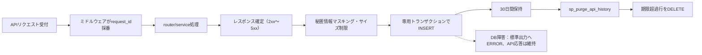

# DB詳細設計 11 api_history テーブル

## 0. 関連ドキュメント

- [../../basic_design/01_database.md](../../basic_design/01_database.md)（§3.9 `api_history`）
- [../log/00_history.md](../log/00_history.md)（API履歴の記録契機・マスキング方針）
- [./00_policy.md](./00_policy.md)（命名規約・型方針・保持方針）
- [./01_table_users.md](./01_table_users.md)（`user_id`の参照先）

## 1. 概要

`api_history` は、backendが受け付けたAPIリクエストを1リクエスト1行で保存する障害調査用履歴である。認証の成否は `login_history`、アプリケーションの詳細な構造化ログは標準出力で扱い、本テーブルはAPI単位の検索に必要な情報に限定する。

| 項目 | 内容 |
|------|------|
| 作成契機 | `/api` 配下の全HTTPリクエストのレスポンス確定後（4xx/5xxを含む）。`/api/health`も対象とする |
| 保存単位 | 1 HTTPリクエストにつき1行。リダイレクトやクライアント再送は別リクエストとして記録 |
| 更新 | なし。追記専用 |
| 保持 | `API_HISTORY_RETENTION_DAYS`（既定30日）を超えた行をbatchが日次削除 |
| 保存失敗 | API本体の成功・失敗を変更しない。標準出力へエラーを記録し、次回以降の調査対象とする |

## 2. カラム定義

| 論理名 | カラム名 | 型 | NULL | 既定値 | 制約・備考 |
|--------|----------|----|------|--------|-----------|
| ID | `id` | UUID | NO | `gen_random_uuid()` | PK |
| リクエストID | `request_id` | UUID | NO | - | UNIQUE。サーバーが発行する相関ID |
| HTTPメソッド | `method` | VARCHAR(10) | NO | - | `GET`等 |
| APIパス | `path` | VARCHAR(255) | NO | - | クエリ文字列を除いたFastAPIのルートテンプレート |
| API状態 | `status` | VARCHAR(20) | NO | - | `success` / `error` |
| HTTPステータス | `status_code` | SMALLINT | NO | - | 100〜599。2xx/3xxはsuccess、4xx/5xxはerror |
| エラーコード | `error_code` | VARCHAR(80) | YES | - | エラー時のみ。basic_design/04_api.md §4.2 のアプリ定義コード。未定義の例外は`INTERNAL_ERROR` |
| エラー内容 | `error_detail` | TEXT | YES | - | エラー時のみ。スタックトレースや秘密情報は保存しない |
| リクエストbody | `body` | JSONB | YES | - | JSON bodyのみ。秘匿項目をマスキングし、上限超過時はNULL |
| ユーザーID | `user_id` | UUID | YES | - | FK → `users.id` `ON DELETE SET NULL`。未認証はNULL |
| クライアントIP | `ip_address` | INET | YES | - | 信頼済みproxyから取得。信頼範囲は運用設定に従う |
| User-Agent | `user_agent` | TEXT | YES | - | 長さ上限はアプリ層で適用 |
| 処理時間 | `duration_ms` | INTEGER | NO | - | 0以上のミリ秒 |
| 記録日時 | `created_at` | TIMESTAMPTZ | NO | `now()` | リクエスト受付時刻。UTC保存 |

bodyにはパスワード、token、Cookie、Authorizationヘッダ等を保存しない。フォーム・ファイル・JSONとして解釈できないbodyは保存せず、構造化ログにサイズ・content-typeのみを記録する。

## 3. DDL

```sql
CREATE TABLE api_history (
    id             UUID         NOT NULL DEFAULT gen_random_uuid(),
    request_id     UUID         NOT NULL,
    method         VARCHAR(10)  NOT NULL,
    path           VARCHAR(255) NOT NULL,
    status         VARCHAR(20)  NOT NULL,
    status_code    SMALLINT     NOT NULL,
    error_code     VARCHAR(80),
    error_detail   TEXT,
    body           JSONB,
    user_id        UUID,
    ip_address     INET,
    user_agent     TEXT,
    duration_ms    INTEGER      NOT NULL,
    created_at     TIMESTAMPTZ  NOT NULL DEFAULT now(),
    CONSTRAINT pk_api_history PRIMARY KEY (id),
    CONSTRAINT uq_api_history_request_id UNIQUE (request_id),
    CONSTRAINT fk_api_history_user_id_users FOREIGN KEY (user_id)
        REFERENCES users (id) ON DELETE SET NULL,
    CONSTRAINT ck_api_history_status CHECK (status IN ('success', 'error')),
    CONSTRAINT ck_api_history_status_code CHECK (status_code BETWEEN 100 AND 599),
    CONSTRAINT ck_api_history_status_consistency CHECK (
        (status = 'success' AND status_code BETWEEN 200 AND 399
            AND error_code IS NULL AND error_detail IS NULL)
        OR (status = 'error' AND status_code BETWEEN 400 AND 599
            AND (error_code IS NOT NULL OR error_detail IS NOT NULL))
    ),
    CONSTRAINT ck_api_history_duration_ms CHECK (duration_ms >= 0)
);

CREATE INDEX ix_api_history_created ON api_history (created_at DESC);
CREATE INDEX ix_api_history_path_created ON api_history (path, created_at DESC);
CREATE INDEX ix_api_history_status_created ON api_history (status, created_at DESC);
```

## 4. ORMモデル・リポジトリ

モデルは `api/app/models/api_history.py :: ApiHistory`、Repositoryは `api/app/repository/api_history_repository.py` とし、`body`はPostgreSQL方言のSQLAlchemy `JSONB`、`ip_address`はPostgreSQLの`INET`で定義する。`user`リレーションは `lazy="noload"` とし、一覧検索で意図しないユーザー情報取得を行わない。

`created_at`はAPI受付時にミドルウェアが取得した時刻を明示的に設定する。DDLの`DEFAULT now()`は、履歴保存処理側で時刻を渡せない異常時のフォールバックとして使用する。

| 関数 | 入力 | 出力・副作用 |
|------|------|--------------|
| `create` | `ApiHistoryCreateInput` | `api_history`へ1行INSERT。専用セッションでcommit |
| `purge_expired` | `retention_days` | `sp_purge_api_history`を呼び出し、期限超過行を削除 |
| `list_by_request_id` | `request_id` | 障害調査用に最大1行を返す。運用者向け内部機能であり公開APIにはしない |

履歴INSERTはリクエスト処理のトランザクションと分離する。同一セッションを共有すると4xx/5xx時にrollbackで履歴まで失われるため、ミドルウェア終了処理から専用DBセッションを生成する。

## 5. データ遷移図



## 6. テスト設計

| No | 区分 | ケース | 期待結果 | テスト名案 |
|----|------|--------|----------|-----------|
| 1 | 結合 | 正常なAPIを1回呼び出す | `api_history`に1行、request_id・path・status_code・duration_msが保存される | `test_api_request_creates_api_history` |
| 2 | 結合 | 4xx/5xx APIを呼び出す | `status='error'`、error_code/detailが保存される | `test_api_error_creates_error_history` |
| 3 | 単体 | password/tokenを含むbody | 対象値がマスキングされ、平文が保存されない | `test_api_history_masks_sensitive_body_fields` |
| 4 | 単体 | bodyがサイズ上限を超える | bodyはNULLで保存され、API応答は変化しない | `test_api_history_drops_oversized_body` |
| 5 | 結合 | 履歴INSERTを失敗させる | API本体の応答は維持され、標準出力へ記録される | `test_api_history_failure_does_not_change_api_response` |
| 6 | 結合 | 30日境界の行をパージする | 保持期限より古い行のみ削除される | `test_purge_api_history_deletes_expired_rows` |
| 7 | 制約 | 同じrequest_idをINSERTする | `IntegrityError`となる | `test_api_history_request_id_is_unique` |

## 7. 不明点・要検討事項

- `X-Forwarded-For`を信頼できるproxyのCIDR範囲はインフラ環境ごとに異なるため、実装前に確定が必要。
- bodyのマスキング項目と上限値は環境変数で変更可能にするが、秘匿項目の既定値を削除できない仕様にするかは要検討。
- API履歴を管理者画面や公開APIで閲覧する機能は今回のスコープに含めない。
