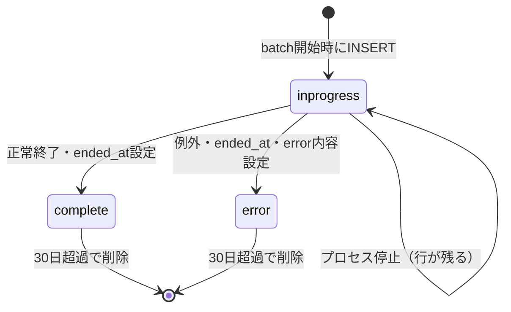

# DB詳細設計 12 batch_history テーブル

## 0. 関連ドキュメント

- [../../basic_design/01_database.md](../../basic_design/01_database.md)（§3.10 `batch_history`）
- [../log/00_history.md](../log/00_history.md)（batch実行の記録契機）
- [../batch/00_overview.md](../batch/00_overview.md)（batch実行基盤）
- [./00_policy.md](./00_policy.md)（命名規約・型方針・保持方針）

## 1. 概要

`batch_history` は、batchジョブ1回の実行を1行で管理する実行履歴である。ジョブ開始時に `inprogress` でINSERTし、正常完了時または失敗時に同じ行をUPDATEする。標準出力の詳細ログとは別に、実行状況をDBから確認できるようにする。

| 項目 | 内容 |
|------|------|
| 作成契機 | `--run-once`を含む全batchジョブの開始時 |
| 更新契機 | 正常完了または失敗の確定時。`inprogress`のままプロセスが落ちた場合は後述の棚卸し対象 |
| 保持 | `BATCH_HISTORY_RETENTION_DAYS`（既定30日）を超えた行をbatchが日次削除 |
| 実行単位 | schedulerの実行枠ごと。10時と17時は別`run_id` |
| 失敗時 | error_code/detailを保存し、ジョブの例外処理・標準出力と相関できる`run_id`を残す |

## 2. カラム定義

| 論理名 | カラム名 | 型 | NULL | 既定値 | 制約・備考 |
|--------|----------|----|------|--------|-----------|
| ID | `id` | UUID | NO | `gen_random_uuid()` | PK |
| 実行ID | `run_id` | UUID | NO | - | UNIQUE。1回の実行に1つ |
| batch名 | `batch_name` | VARCHAR(100) | NO | - | `due_notification`等 |
| 起動契機 | `trigger_type` | VARCHAR(20) | NO | - | `scheduled` / `manual` |
| 実行枠 | `slot` | VARCHAR(20) | YES | - | 期限通知の`10`/`17`等。対象外jobはNULL |
| 状態 | `status` | VARCHAR(20) | NO | `'inprogress'` | `inprogress` / `complete` / `error` |
| 起動時刻 | `started_at` | TIMESTAMPTZ | NO | `now()` | UTC保存 |
| 終了時刻 | `ended_at` | TIMESTAMPTZ | YES | - | 完了・失敗時は必須 |
| エラーコード | `error_code` | VARCHAR(80) | YES | - | `status='error'`時のみ。`error_detail`との少なくとも一方を設定 |
| エラー内容 | `error_detail` | TEXT | YES | - | 秘密情報・接続文字列は保存しない |
| 対象件数 | `target_count` | INTEGER | NO | `0` | ジョブ固有の対象件数 |
| 成功件数 | `success_count` | INTEGER | NO | `0` | 作成・処理成功件数 |
| スキップ件数 | `skipped_count` | INTEGER | NO | `0` | ロック・重複等で未処理の件数 |
| 更新時刻 | `updated_at` | TIMESTAMPTZ | NO | `now()` | 状態・件数更新時に更新 |

`slot`はbatch共通の枠ではなく、ジョブが必要とする場合だけ設定する。`inprogress`のまま残った行は、プロセスクラッシュやSIGKILLの可能性を示す。自動的に`error`へ変更すると実際の失敗時刻が不明になるため、運用者が標準出力と照合する。

## 3. DDL

```sql
CREATE TABLE batch_history (
    id              UUID         NOT NULL DEFAULT gen_random_uuid(),
    run_id          UUID         NOT NULL,
    batch_name      VARCHAR(100) NOT NULL,
    trigger_type    VARCHAR(20)  NOT NULL,
    slot            VARCHAR(20),
    status          VARCHAR(20)  NOT NULL DEFAULT 'inprogress',
    started_at      TIMESTAMPTZ  NOT NULL DEFAULT now(),
    ended_at        TIMESTAMPTZ,
    error_code      VARCHAR(80),
    error_detail    TEXT,
    target_count    INTEGER      NOT NULL DEFAULT 0,
    success_count   INTEGER      NOT NULL DEFAULT 0,
    skipped_count   INTEGER      NOT NULL DEFAULT 0,
    updated_at      TIMESTAMPTZ  NOT NULL DEFAULT now(),
    CONSTRAINT pk_batch_history PRIMARY KEY (id),
    CONSTRAINT uq_batch_history_run_id UNIQUE (run_id),
    CONSTRAINT ck_batch_history_trigger_type CHECK (trigger_type IN ('scheduled', 'manual')),
    CONSTRAINT ck_batch_history_status CHECK (status IN ('inprogress', 'complete', 'error')),
    CONSTRAINT ck_batch_history_status_consistency CHECK (
        (status = 'inprogress' AND ended_at IS NULL AND error_code IS NULL AND error_detail IS NULL)
        OR (status = 'complete' AND ended_at IS NOT NULL AND error_code IS NULL AND error_detail IS NULL)
        OR (
            status = 'error'
            AND ended_at IS NOT NULL
            AND (error_code IS NOT NULL OR error_detail IS NOT NULL)
        )
    ),
    CONSTRAINT ck_batch_history_ended_at CHECK (ended_at IS NULL OR ended_at >= started_at),
    CONSTRAINT ck_batch_history_counts CHECK (
        target_count >= 0 AND success_count >= 0 AND skipped_count >= 0
    )
);

CREATE INDEX ix_batch_history_started ON batch_history (started_at DESC);
CREATE INDEX ix_batch_history_name_started ON batch_history (batch_name, started_at DESC);
CREATE INDEX ix_batch_history_status_started ON batch_history (status, started_at DESC);
```

## 4. ORMモデル・リポジトリ

モデルは `batch/app/models/batch_history.py :: BatchHistory`、Repositoryは `batch/app/repository/batch_history_repository.py` とし、API側には同じテーブルを更新できるモデル定義を置かない。batchが開始・完了・失敗のDB操作を担当する。保持期間の削除は `batch/app/repository/purge_repository.py` から `sp_purge_batch_history` を呼び出す。

| 関数 | 入力 | 出力・副作用 |
|------|------|--------------|
| `start` | batch名、trigger_type、slot | run_idを採番して`inprogress`行をINSERT |
| `complete` | run_id、件数 | statusを`complete`、ended_atを設定してUPDATE |
| `fail` | run_id、error_code/detail、件数 | statusを`error`、ended_atを設定してUPDATE |
| `purge_expired` | retention_days | `sp_purge_batch_history`を呼び出し、期限超過行を削除 |

開始INSERTが失敗した場合はジョブ本体を実行せず、標準出力へERRORを記録する。完了／失敗UPDATEが失敗した場合は、ジョブ結果を覆さず標準出力に`run_id`とともに記録する。

## 5. 状態遷移図



## 6. テスト設計

| No | 区分 | ケース | 期待結果 | テスト名案 |
|----|------|--------|----------|-----------|
| 1 | 結合 | batch開始 | `inprogress`行と一意なrun_idが保存される | `test_batch_start_creates_inprogress_history` |
| 2 | 結合 | 正常完了 | 同じrun_idが`complete`、ended_at付きで更新される | `test_batch_complete_updates_history` |
| 3 | 結合 | 例外終了 | `error`、ended_at、error_code/detailが保存される | `test_batch_failure_updates_error_history` |
| 4 | 制約 | `inprogress`にended_atを設定 | `IntegrityError`となる | `test_batch_history_inprogress_requires_null_end` |
| 5 | 制約 | run_id重複 | `IntegrityError`となる | `test_batch_history_run_id_is_unique` |
| 6 | 結合 | 30日境界の行をパージする | 期限超過行のみ削除される | `test_purge_batch_history_deletes_expired_rows` |
| 7 | 結合 | 履歴UPDATEが失敗する | batch本体の結果は保持し、標準出力へ記録する | `test_batch_history_update_failure_does_not_hide_job_result` |

## 7. 不明点・要検討事項

- `inprogress`のまま残った行を一定時間後に自動的に`error`へ補正するかは要検討。現設計では事実と推測を混同しないため補正しない。
- 将来batchが並列実行される場合、同じ`batch_name`・`slot`の多重起動を許可するかはジョブごとに定義する。
