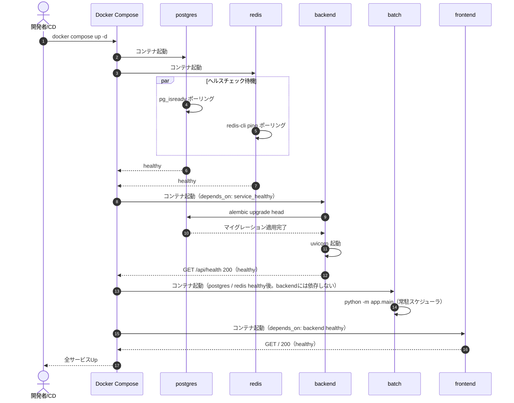
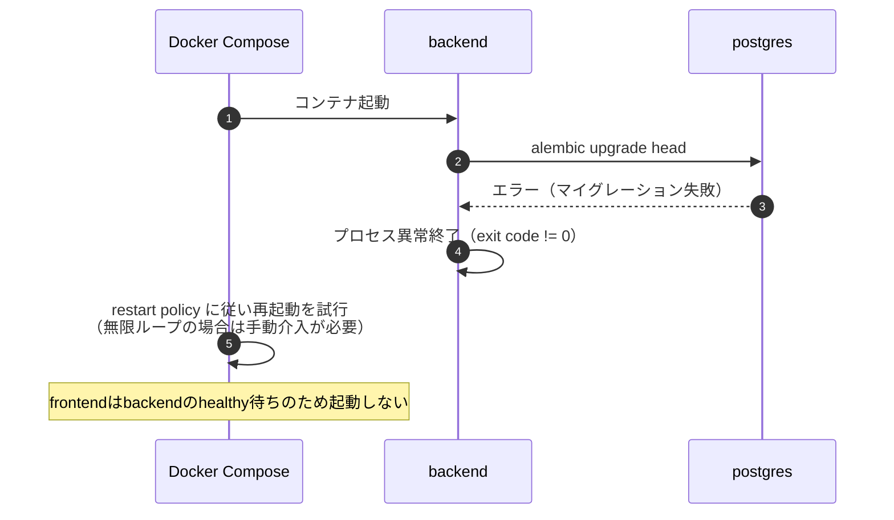
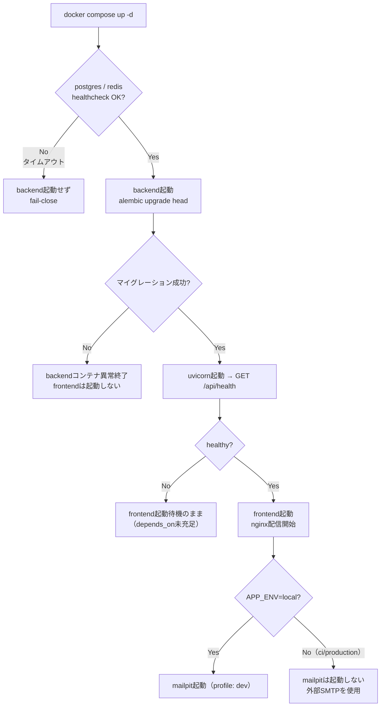
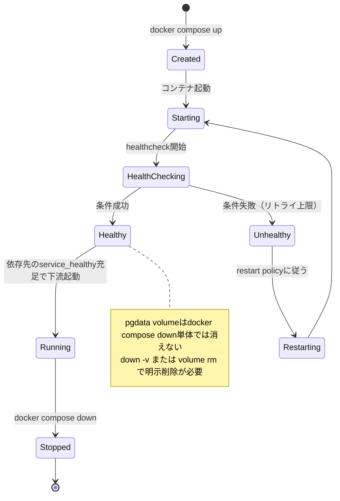
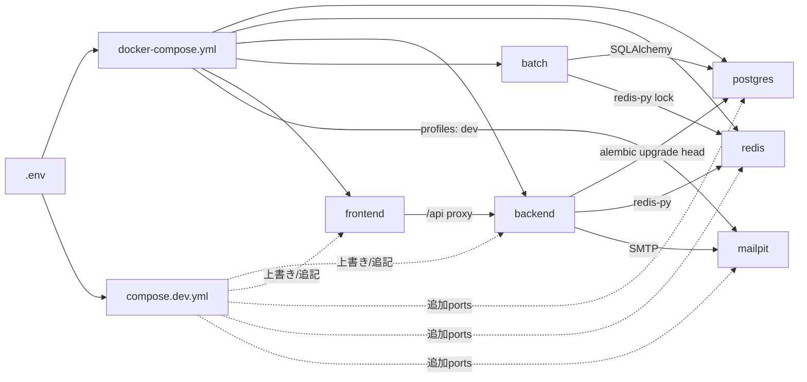

# infra/01 Docker Compose構成

## 0. 関連ドキュメント

- 基本設計：[../../basic_design/06_infra_cicd.md](../../basic_design/06_infra_cicd.md)（§1〜2）、[../../basic_design/00_overview.md](../../basic_design/00_overview.md)（§2 システム構成）
- 詳細設計：[02_dockerfile_api.md](./02_dockerfile_api.md)、[03_dockerfile_frontend.md](./03_dockerfile_frontend.md)、[04_env_config.md](./04_env_config.md)

## 1. 概要

| 項目 | 内容 |
|------|------|
| 対象 | `docker-compose.yml`（本体）と `compose.dev.yml`（開発差分オーバーレイ） |
| 責務 | `backend` / `frontend` / `batch` / `postgres` / `redis` / `mailpit` の6サービスを1つの Docker Compose ネットワークで起動し、依存順序とヘルスチェックを保証する |
| 適用条件 | ローカル / 自宅サーバーの Docker Compose（クラウド不使用）。`mailpit` は `profiles: [dev]` の場合のみ起動 |
| 依存先 | Docker Engine / Docker Compose v2（`docker compose` コマンド。ハイフン付き `docker-compose` は使用しない） |
| 実装ファイル | `docker-compose.yml`、`compose.dev.yml`、`.env` / `.env.example` |

## 2. 構成要素

| 要素 | 種別 | 責務 | 備考 |
|------|------|------|------|
| `postgres` | サービス | 永続データストア | イメージ `postgres:17-alpine`。volume `pgdata` |
| `redis` | サービス | セッション／トークンの一時ストア | イメージ `redis:8-alpine`。volumeなし（永続化しない） |
| `backend` | サービス（自ビルド） | FastAPI + Uvicorn。起動時に `alembic upgrade head` | contextはリポジトリルート。`db/functions/`・`db/procedures/`を含む。[02_dockerfile_api.md](./02_dockerfile_api.md) |
| `frontend` | サービス（自ビルド） | ビルド成果物を nginx で配信、`/api` を backend へ proxy | [03_dockerfile_frontend.md](./03_dockerfile_frontend.md) |
| `batch` | サービス（自ビルド） | 毎日10時・17時の期限通知ジョブを2つのcronジョブとして常駐スケジューラで実行 | contextはリポジトリルート。[08_dockerfile_batch.md](./08_dockerfile_batch.md)。HTTPポートなし |
| `mailpit` | サービス | 開発用SMTPモック | イメージ `axllent/mailpit`。`profiles: [dev]` |
| `cerberus_net` | ネットワーク | bridge。6サービスを内部DNS名（サービス名）で疎通 | 外部公開は `frontend` の1ポートのみが原則 |
| `pgdata` | volume | PostgreSQLデータ永続化 | named volume |
| `compose.dev.yml` | オーバーレイファイル | バインドマウント・ホットリロード・追加ポート公開を開発時だけ有効化 | `docker compose -f docker-compose.yml -f compose.dev.yml up` |

## 3. 設定項目（環境変数）

| 変数名 | 型 | 既定値 | 用途 | 秘匿 |
|--------|-----|--------|------|------|
| `COMPOSE_PROJECT_NAME` | str | `cerberus` | Composeプロジェクト名（リソース名の接頭辞） | 否 |
| `APP_ENV` | str | `local` | `local` / `ci` / `production`。`mailpit` profile有効化の判断材料 | 否 |
| `FRONTEND_PORT` | int | `5173` | ホスト公開ポート（`frontend` の80番へ） | 否 |
| `BACKEND_PORT` | int | `8000` | 開発時のみ`compose.dev.yml`で`127.0.0.1`に公開 | 否 |
| `POSTGRES_PORT` | int | `5432` | 開発時のみ`compose.dev.yml`で`127.0.0.1`に公開 | 否 |
| `REDIS_PORT` | int | `6379` | 開発時のみ`compose.dev.yml`で`127.0.0.1`に公開 | 否 |
| `MAILPIT_SMTP_PORT` | int | `1025` | 開発時のみ`compose.dev.yml`で`127.0.0.1`に公開 | 否 |
| `MAILPIT_UI_PORT` | int | `8025` | 開発時のみ`compose.dev.yml`で`127.0.0.1`に公開 | 否 |
| `APP_TIMEZONE` | str | `Asia/Tokyo` | backend / batchの日次境界・表示基準 | 否 |
| `NOTIFY_DUE_RUN_HOURS` / `NOTIFY_DUE_CRON_MINUTE` | str / int | `10,17` / `0` | 期限通知ジョブを登録する実行時刻（`APP_TIMEZONE`基準）。値ごとに別cronジョブを登録 | 否 |
| `NOTIFY_DUE_TARGET_HOUR` | int | `10` | 10時・17時の両実行枠で共通して使う対象期限の翌日境界 | 否 |
| `NOTIFY_DUE_LOCK_TTL_SECONDS` | int | `82800` | Redisの日付・実行枠別ロックのTTL | 否 |
| `NOTIFY_DUE_BATCH_CHUNK_SIZE` | int | `500` | 通知INSERTを分割する件数 | 否 |
| `NOTIFICATION_RETENTION_DAYS` | int | `90` | 通知保持期間 | 否 |
| `POSTGRES_USER` / `POSTGRES_PASSWORD` / `POSTGRES_DB` | str | `cerberus` / *** / `cerberus` | `postgres` イメージの初期化変数 | `POSTGRES_PASSWORD`のみ**Secret** |
| `DATABASE_URL` | str | `postgresql+asyncpg://...@postgres:5432/cerberus` | backendのDB接続文字列（コンテナ内部ポート固定`5432`） | **Secret**（資格情報を含む） |
| `REDIS_URL` | str | `redis://redis:6379/0` | backendのRedis接続文字列（コンテナ内部ポート固定`6379`） | 否 |
| `SMTP_HOST` / `SMTP_PORT` | str/int | `mailpit` / `1025` | backendからmailpitへの接続（コンテナ内部ポート固定） | 否 |

全項目の詳細・全一覧は [04_env_config.md](./04_env_config.md) を参照。**外部公開ポート（ホスト側）は必ず `.env` の変数経由とし、コンテナ内部ポートはコード上の固定値（80/8000/5432/6379/1025/8025）とする**。

## 4. 全体の出入力

| 区分 | 内容 |
|------|------|
| 入力 | `.env`（Compose変数展開）、各サービスのビルドコンテキスト（backend/batchはリポジトリルート、frontendは`frontend/`）、ホストの `docker compose up` コマンド |
| 出力 | 起動済みコンテナ群、`pgdata` volume（永続データ）、`cerberus_net` 経由の内部通信、ホストへ公開される `${FRONTEND_PORT}`（本番/CD）および開発時追加ポート |
| 副作用 | `backend` 起動時の `alembic upgrade head` によるDBスキーマ変更 |

## 5. シーケンス図

### 5.1 `docker compose up -d` 起動シーケンス

### 5.2 マイグレーション失敗時（異常系）

## 6. 処理フロー・分岐

## 7. データ遷移図

## 8. 関数・処理詳細

### 8.1 `docker-compose.yml` :: サービス定義（宣言的設定であり関数ではないため仕様として記載）

| 項目 | 内容 |
|------|------|
| 定義対象 | `services.postgres` / `services.redis` / `services.backend` / `services.batch` / `services.frontend` / `services.mailpit`、`networks.cerberus_net`、`volumes.pgdata` |
| 入力 | `.env` の各変数（`env_file: .env` または `environment:` 個別指定） |
| 出力 | コンテナ群、named volume `pgdata` |
| 失敗条件 | 必須環境変数未設定時、`docker compose config` で警告（未定義変数は空文字扱い）。`backend` の `core/config.py` 起動時バリデーションで実質的に失敗させる（[04_env_config.md](./04_env_config.md)参照） |
| 処理内容 | 1. `postgres`/`redis` を healthcheck 付きで起動 2. `depends_on.condition: service_healthy` で `backend` と `batch` を待機起動 3. `backend` の healthcheck 成功後に `frontend` を起動 4. `APP_ENV=local` かつ `--profile dev` 指定時のみ `mailpit` を起動 |
| 副作用 | `pgdata` volumeへの書き込み、`cerberus_net` へのコンテナ参加 |

### 8.2 各サービスの healthcheck 仕様

| サービス | healthcheck コマンド | interval/timeout/retries（目安） |
|----------|---------------------|-----------------------------------|
| `postgres` | `pg_isready -U ${POSTGRES_USER} -d ${POSTGRES_DB}` | 5s / 5s / 5回 |
| `redis` | `redis-cli ping` | 5s / 5s / 5回 |
| `backend` | `python -c "import urllib.request; urllib.request.urlopen('http://127.0.0.1:8000/api/health')"`（Python標準ライブラリ） | 10s / 5s / 5回、`start_period`でマイグレーション時間を確保 |
| `frontend` | `wget -qO- http://127.0.0.1:80/`（nginx:alpineに含まれるBusyBox） | 10s / 5s / 5回 |
| `batch` | `python -c "import os; os.kill(1, 0)"`（PID 1の生存監視） | 10s / 5s / 3回 |
| `mailpit` | なし（`dev` profile専用の補助サービスのため必須としない） | - |

### 8.3 `compose.dev.yml` :: 開発オーバーレイ

| 項目 | 内容 |
|------|------|
| 目的 | ソースのバインドマウント、ホットリロード（`uvicorn --reload` / `vite dev`）、開発用ポート公開を本体定義から分離する |
| 入力 | `docker compose -f docker-compose.yml -f compose.dev.yml up` |
| 出力 | `backend`/`frontend`のバインドマウント有効化、`${BACKEND_PORT}`/`${POSTGRES_PORT}`/`${REDIS_PORT}`/`${MAILPIT_SMTP_PORT}`/`${MAILPIT_UI_PORT}` を `127.0.0.1` に限定公開 |
| 処理内容 | 1. `backend.volumes` に `./api:/app/api` と `./db:/app/db:ro` を追加 2. `backend.command` を `uvicorn app.main:app --reload` に上書き 3. `postgres`/`redis`/`mailpit` の `ports` を `127.0.0.1:${PORT}:内部固定ポート` で追加 |
| 副作用 | 本番/CD構成（`docker-compose.yml`単体）には影響しない（オーバーレイのみに閉じる） |

## 9. 関数・要素相関図

## 10. セキュリティ・非機能考慮

| 観点 | 方針 | 根拠 |
|------|------|------|
| ポート露出 | `backend`/`postgres`/`redis`/`mailpit` は本体Composeで `ports` を持たない。開発時のみ `compose.dev.yml` で `127.0.0.1` 限定公開 | [../../basic_design/06_infra_cicd.md](../../basic_design/06_infra_cicd.md) §1 |
| 秘匿情報 | `POSTGRES_PASSWORD`/`DATABASE_URL`/`JWT_SECRET_KEY`等は `.env`（コミット禁止）およびCI/CD時はGitHub Secrets経由 | [04_env_config.md](./04_env_config.md) |
| Redis永続化 | `--save "" --appendonly no --maxmemory-policy noeviction`、volumeを割り当てない。再起動で全ログアウトになる挙動を意図的に許容 | 要件書§4、[../../basic_design/00_overview.md](../../basic_design/00_overview.md) §8 |
| 起動順序 | `depends_on.condition: service_healthy` を用い、DB/Redis未準備状態でのAPI起動（＝マイグレーション失敗の温床）を防ぐ | [../../basic_design/06_infra_cicd.md](../../basic_design/06_infra_cicd.md) §2 |
| イメージ最小化 | `-alpine` 系イメージを使用し攻撃対象面を縮小 | 同上 |
| ネットワーク分離 | `cerberus_net` 内のみで名前解決させ、ホストの他プロジェクトと混在させない（`COMPOSE_PROJECT_NAME`でネットワーク名も分離） | 一般的なCompose運用指針 |

## 11. テスト設計

| No | 区分 | ケース | 前提 | 期待結果 | テスト名案 |
|----|------|--------|------|----------|-----------|
| 1 | 結合 | `docker compose config` で構文検証 | `.env.example` をコピーして `.env` 生成 | エラーなく解決される | `test_compose_config_valid`（CIのシェルステップ） |
| 2 | 結合 | `docker compose up -d` 後に全サービスhealthy | ローカル/CI環境 | 6サービス（dev profile込み）が `healthy` または起動継続 | `test_compose_up_all_healthy` |
| 3 | 結合 | backend起動時にAlembicマイグレーションが適用される | 空のpostgresボリューム | `alembic_version`テーブルが最新headと一致 | `test_backend_migration_on_start` |
| 4 | 結合 | redisコンテナ再起動でセッションが消える | session方式でログイン後 `docker compose restart redis` | `/auth/me`が401になる | `test_redis_restart_invalidates_session` |
| 5 | 結合 | backend/postgres/redisのポートが本体Composeで非公開 | `docker-compose.yml`単体起動 | `docker compose port backend 8000`等が失敗、またはホストから疎通不可 | `test_no_unintended_port_exposure` |
| 網羅できない範囲 | 実機の自宅サーバー環境でのファイアウォール設定 | - | ネットワーク機器依存のため自動テスト対象外。手動確認とする | - |

## 12. 不明点・要検討事項

| 区分 | 内容 | 影響 |
|------|------|------|
| 確定 | backendはPython標準ライブラリ、frontendはnginx:alpineのBusyBox `wget`、batchはPythonでPID 1を確認する。追加のOSパッケージは導入しない | [02_dockerfile_api.md](./02_dockerfile_api.md)、[03_dockerfile_frontend.md](./03_dockerfile_frontend.md)、[08_dockerfile_batch.md](./08_dockerfile_batch.md) |
| 要検討 | `mailpit` を `production`/CD環境で誤って起動しない保証は `profiles: [dev]` 運用に依存しており、CDワークフロー側で `--profile` を明示的に付与しない運用ルールが必要 | [06_cd_workflow.md](./06_cd_workflow.md) |
| 不明 | `pgdata` volumeのバックアップ自動化はスコープ外（要件書§11、[../../basic_design/06_infra_cicd.md](../../basic_design/06_infra_cicd.md) §8）のため、本書では手動 `pg_dump` のみを前提とする | 運用手順（[07_operation.md](./07_operation.md)） |
