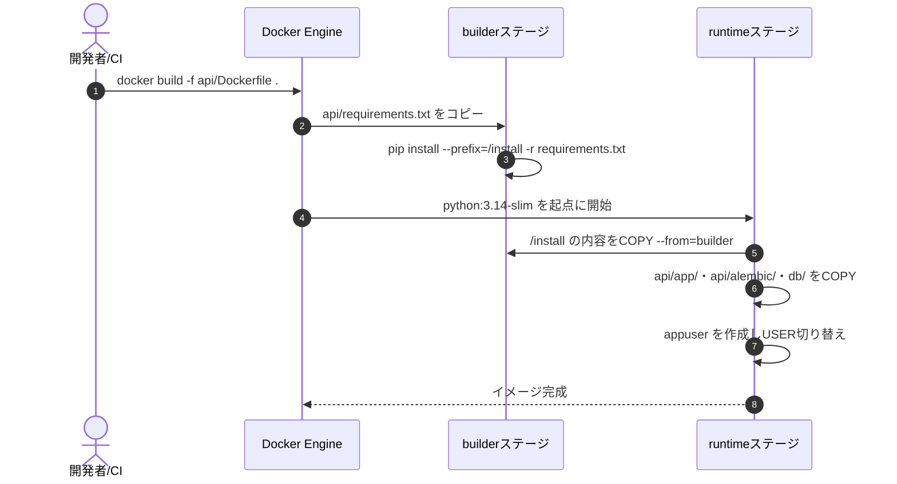
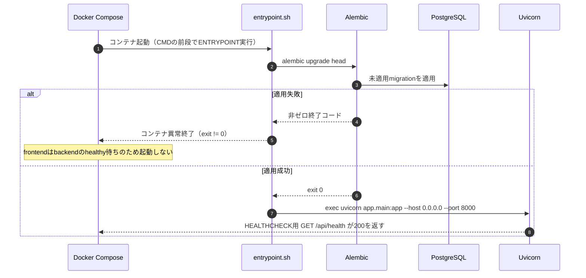
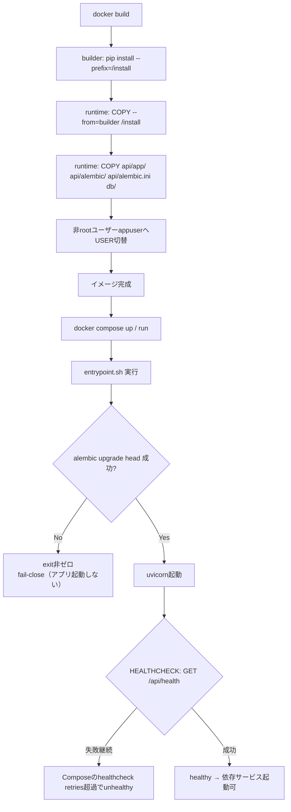
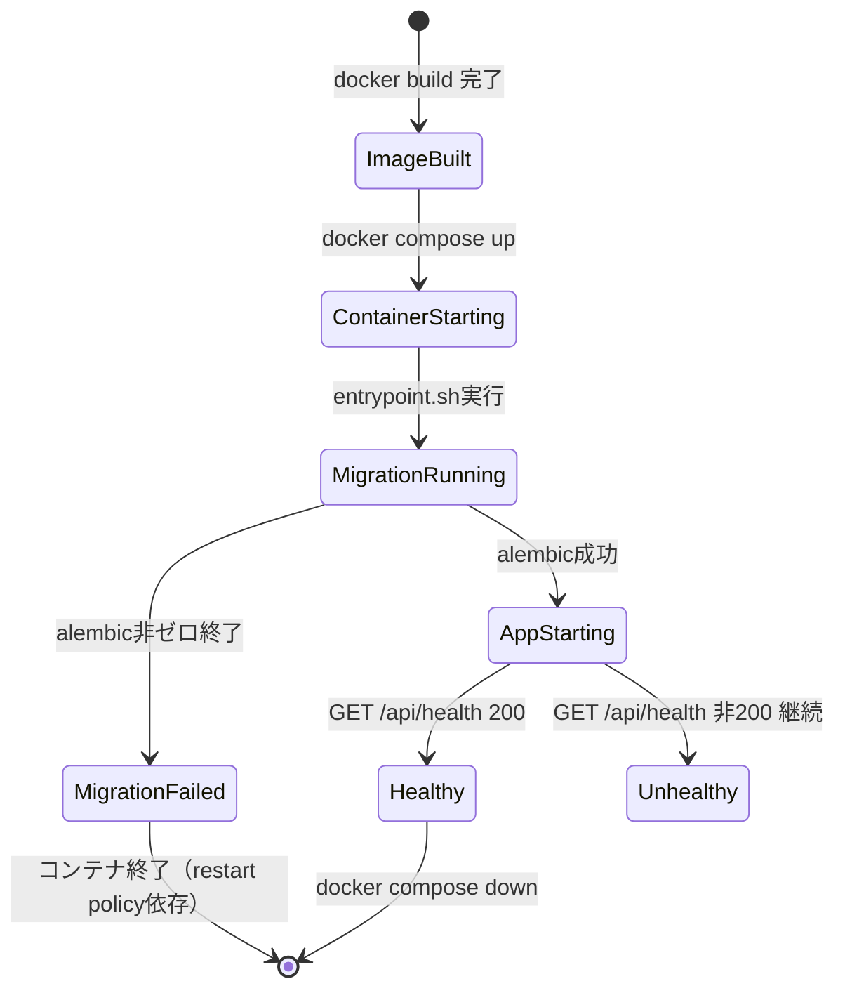
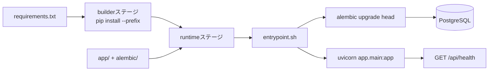

# infra/02 backend Dockerfile

## 0. 関連ドキュメント

- 基本設計：[../../basic_design/06_infra_cicd.md](../../basic_design/06_infra_cicd.md)（§3.1）、[../../basic_design/00_overview.md](../../basic_design/00_overview.md)（§3 ディレクトリ構成）
- 詳細設計：[01_docker_compose.md](./01_docker_compose.md)、[04_env_config.md](./04_env_config.md)、[../database/09_migration.md](../database/09_migration.md)

## 1. 概要

| 項目 | 内容 |
|------|------|
| 対象 | `api/Dockerfile`（backendイメージ） |
| 責務 | FastAPIアプリを実行するランタイムイメージを作成し、起動時にAlembicマイグレーションを適用してからUvicornを起動する |
| 適用条件 | `docker compose build backend` / CI `docker-build` ジョブ / CD `build-and-push` ジョブで使用 |
| 依存先 | `python:3.14-slim`（ベースイメージ）、`requirements.txt`、PostgreSQL（マイグレーション適用先） |
| 実装ファイル | `api/Dockerfile`、`api/requirements.txt`、`api/alembic.ini`、`api/entrypoint.sh` |

## 2. 構成要素

| 要素 | 種別 | 責務 | 備考 |
|------|------|------|------|
| `builder` ステージ | ビルドステージ | `pip install --prefix=/install` で依存関係をビルド | `requirements.txt` のみを先にコピーしレイヤキャッシュを効かせる |
| `runtime` ステージ | 実行ステージ | `builder` の成果物と `api/app/`・`api/alembic/`・`db/`をコピーし、非rootで実行 | ベースは `python:3.14-slim` |
| `appuser` | OSユーザー | 非root実行ユーザー | `useradd -m -u 10001 appuser` 相当 |
| `entrypoint.sh` | シェルスクリプト | `alembic upgrade head` 実行後に `exec uvicorn` へ切り替え | 失敗時は非ゼロで終了しUvicornを起動しない |
| `HEALTHCHECK` | Dockerfile命令 | `GET /api/health` を内部的に確認 | コンテナ内部ポート`8000`固定 |

## 3. 設定項目（環境変数）

| 変数名 | 型 | 既定値 | 用途 | 秘匿 |
|--------|-----|--------|------|------|
| `DATABASE_URL` | str | なし（必須） | Alembic接続・SQLAlchemy接続 | **Secret**（`.env`/GitHub Secrets） |
| `REDIS_URL` | str | `redis://redis:6379/0` | backendのRedis接続 | 否 |
| `AUTH_MODE` | str | `session` | 認証方式切り替え | 否（`.env`） |
| `LOG_LEVEL` | str | `INFO` | ロギングレベル | 否（`.env`） |
| `ENABLE_API_DOCS` | bool | `true` | `/api/docs` 有効化 | 否（`.env`） |

上記はコンテナ内で `core/config.py`（pydantic-settings）が読み込む値であり、Dockerfile自体には値をハードコードしない。全一覧は [04_env_config.md](./04_env_config.md) を参照。コンテナが listen するポートは環境変数化せず `8000` に固定する（ホスト側公開ポートのみ `.env` の `BACKEND_PORT` で制御し、[01_docker_compose.md](./01_docker_compose.md) 側の責務とする）。

## 4. 全体の出入力

| 区分 | 内容 |
|------|------|
| 入力 | ビルドコンテキスト（リポジトリルート）、実行時環境変数（`.env` 経由でCompose注入） |
| 出力 | backendイメージ（`ghcr.io/{owner}/cerberus-backend:{tag}`）、起動後は `0.0.0.0:8000` でHTTPを待ち受け |
| 副作用 | 起動時に `DATABASE_URL` 先のPostgreSQLへ `alembic upgrade head` を適用（スキーマ変更） |

## 5. シーケンス図

### 5.1 イメージビルド

### 5.2 コンテナ起動〜マイグレーション適用

## 6. 処理フロー・分岐

## 7. データ遷移図

## 8. 関数・処理詳細

### 8.1 `api/Dockerfile` :: `builder` ステージ

| 項目 | 内容 |
|------|------|
| ベースイメージ | `python:3.14-slim`（`AS builder`） |
| 引数/入力 | `requirements.txt`（先にCOPYしてレイヤキャッシュを利かせる） |
| 出力 | `/install` 配下にインストール済みパッケージ一式 |
| 失敗条件 | 依存解決不能（バージョン競合）、ネットワーク不通 |
| 処理内容 | 1. `COPY requirements.txt .` 2. `RUN pip install --no-cache-dir --prefix=/install -r requirements.txt` |
| 副作用 | なし（このステージの成果物のみruntimeへ引き渡す） |

### 8.2 `api/Dockerfile` :: `runtime` ステージ

| 項目 | 内容 |
|------|------|
| ベースイメージ | `python:3.14-slim`（`AS runtime`） |
| 引数/入力 | `builder` の `/install`、`api/app/`、`api/alembic/`、`api/alembic.ini`、`api/entrypoint.sh`、`db/functions/`、`db/procedures/` |
| 出力 | 実行可能なbackendイメージ |
| 失敗条件 | `appuser` 作成失敗、`COPY` 対象パス誤り |
| 処理内容 | 1. `COPY --from=builder /install /usr/local` 2. `RUN useradd -m -u 10001 appuser` 3. `WORKDIR /app/api` 4. `COPY --chown=appuser:appuser api/app ./app`、`api/alembic ./alembic`、`api/alembic.ini ./alembic.ini`、`api/entrypoint.sh ./entrypoint.sh`、`db /app/db` 5. `RUN chmod +x entrypoint.sh` 6. `USER appuser` 7. `EXPOSE 8000` 8. `HEALTHCHECK CMD python -c "import urllib.request; urllib.request.urlopen('http://127.0.0.1:8000/api/health')"` 9. `ENTRYPOINT ["./entrypoint.sh"]` |
| 副作用 | イメージレイヤに非root実行ユーザーを組み込む |

### 8.3 `entrypoint.sh` :: メインスクリプト

| 項目 | 内容 |
|------|------|
| シグネチャ / 定義 | シェルスクリプト（`#!/bin/sh -e`） |
| 引数 / 入力 | 環境変数 `DATABASE_URL` 等（`core/config.py` 経由で参照される値と同一） |
| 戻り値 / 出力 | プロセス終了コード（0=成功してUvicornへ`exec`、非0=起動失敗） |
| 送出例外 / 失敗条件 | `alembic upgrade head` の非ゼロ終了 |
| 処理内容 | 1. `alembic upgrade head` を実行 2. 失敗時は即座に終了（`set -e`によりスクリプト全体が停止） 3. 成功時は `exec uvicorn app.main:app --host 0.0.0.0 --port 8000` に置き換わる（PID 1をUvicornに委譲しシグナル伝播を正しくする） |
| 副作用 | DBスキーマ変更（マイグレーション適用） |

## 9. 関数・要素相関図

## 10. セキュリティ・非機能考慮

| 観点 | 方針 | 根拠 |
|------|------|------|
| 実行ユーザー | 非root（`appuser`、UID固定）で実行し、コンテナ内権限昇格の影響を限定 | 一般的なコンテナセキュリティ指針 |
| イメージサイズ/攻撃対象面 | `-slim` ベース＋マルチステージで不要なビルドツールをruntimeに残さない | [../../basic_design/06_infra_cicd.md](../../basic_design/06_infra_cicd.md) §3.1 |
| シークレット非混入 | `DATABASE_URL`/`JWT_SECRET_KEY`等をDockerfile・イメージ内に埋め込まず、実行時環境変数としてのみ注入 | [04_env_config.md](./04_env_config.md) |
| マイグレーション失敗時の挙動 | fail-close（起動させない）。適用済みmigrationの自動downgradeは行わない | [../../basic_design/06_infra_cicd.md](../../basic_design/06_infra_cicd.md) §8 |
| シグナル伝播 | `exec` でUvicornをPID 1に置き換え、`docker stop` のSIGTERMが正しく届くようにする | Docker運用一般指針 |
| キャッシュ最適化 | `requirements.txt` を先にCOPYし、アプリコード変更時に依存再インストールを避ける | [../../basic_design/06_infra_cicd.md](../../basic_design/06_infra_cicd.md) §3.1 |

## 11. テスト設計

| No | 区分 | ケース | 前提 | 期待結果 | テスト名案 |
|----|------|--------|------|----------|-----------|
| 1 | 結合 | `docker build -f api/Dockerfile .` が成功する | CI `docker-build` ジョブ | `db/functions/`・`db/procedures/`を含むイメージが生成される | `test_backend_image_builds`（CIステップ） |
| 2 | 結合 | イメージ内プロセスが非rootで実行される | ビルド済みイメージ | `docker run --rm image whoami` が `appuser` を返す | `test_backend_runs_as_nonroot` |
| 3 | 結合 | マイグレーション成功時にUvicornが起動する | postgres起動済み、`DATABASE_URL`正しい | `/api/health` が200を返す | `test_entrypoint_migration_success_starts_app` |
| 4 | 結合 | マイグレーション失敗時にアプリが起動しない | `DATABASE_URL`を不正な値に設定 | コンテナが非ゼロで終了し、Uvicornが起動しない | `test_entrypoint_migration_failure_blocks_app` |
| 5 | 結合 | `requirements.txt`未変更時にDockerキャッシュが効く | 2回連続ビルド | 2回目の `pip install` レイヤがキャッシュ利用（ビルドログで確認） | `test_backend_build_cache_effective`（手動/CIログ確認） |
| 網羅できない範囲 | 実運用のself-hosted runner上でのビルド時間計測 | - | ハードウェア依存のため定量テスト対象外。CIログで定性確認 | - |

## 12. 不明点・要検討事項

| 区分 | 内容 | 影響 |
|------|------|------|
| 確定 | `python:3.14-slim`に標準搭載されるPython標準ライブラリで`/api/health`を確認し、追加のOSパッケージは導入しない | イメージサイズ、[01_docker_compose.md](./01_docker_compose.md) §8.2 |
| 不明 | `entrypoint.sh` のシェルを `sh`（`slim`イメージ標準）と`bash`のどちらにするかは基本設計に明記なし。可搬性を優先し `sh` を前提としたが、実装時に確認が必要 | 実装時のスクリプト構文 |
