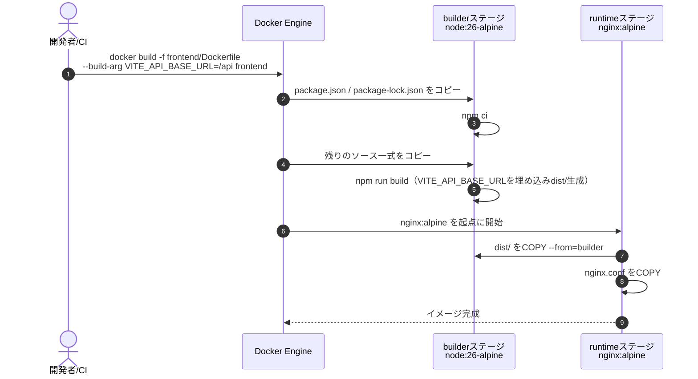
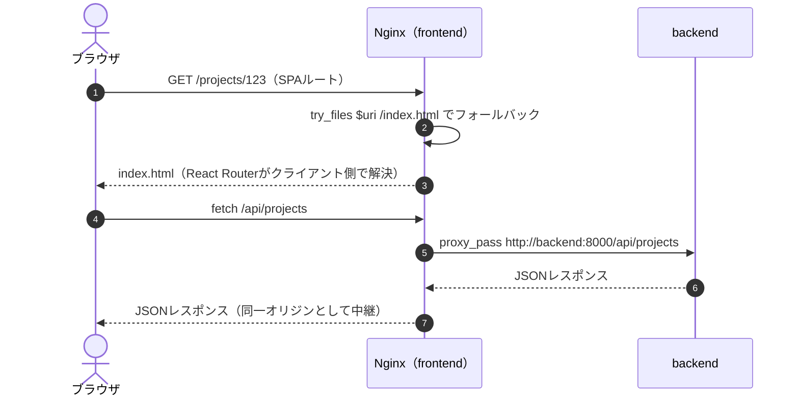
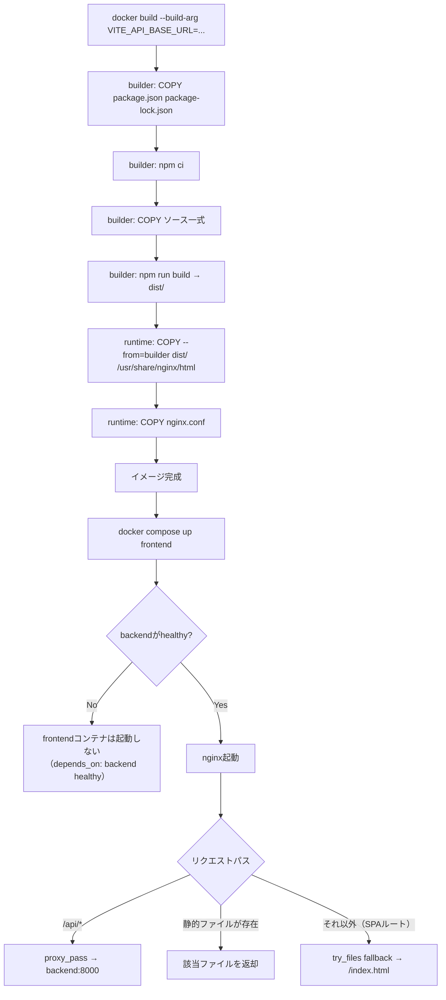
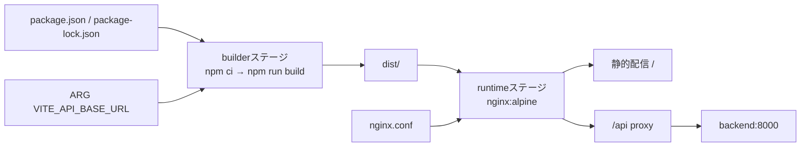

# infra/03 frontend Dockerfile

## 0. 関連ドキュメント

- 基本設計：[../../basic_design/06_infra_cicd.md](../../basic_design/06_infra_cicd.md)（§3.2）、[../../basic_design/05_frontend.md](../../basic_design/05_frontend.md)
- 詳細設計：[01_docker_compose.md](./01_docker_compose.md)、[04_env_config.md](./04_env_config.md)

## 1. 概要

| 項目 | 内容 |
|------|------|
| 対象 | `frontend/Dockerfile`（frontendイメージ） |
| 責務 | ReactアプリをViteでビルドし、静的成果物をNginxで配信する。`/api` を backend へリバースプロキシする |
| 適用条件 | `docker compose build frontend` / CI `docker-build` ジョブ / CD `build-and-push` ジョブで使用 |
| 依存先 | `node:26-alpine`（builder）、`nginx:alpine`（runtime）、backend（`/api` proxy先） |
| 実装ファイル | `frontend/Dockerfile`、`frontend/nginx.conf`、`frontend/package.json` |

## 2. 構成要素

| 要素 | 種別 | 責務 | 備考 |
|------|------|------|------|
| `builder` ステージ | ビルドステージ | `npm ci` → `npm run build` で `dist/` を生成 | `node:26-alpine` |
| `runtime` ステージ | 実行ステージ | `dist/` をNginxのドキュメントルートへ配置して配信 | `nginx:alpine` |
| `nginx.conf` | 設定ファイル | SPAのfallback設定と `/api` proxy設定 | イメージにCOPY |
| `ARG VITE_API_BASE_URL` 等 | ビルド引数 | ビルド時に静的ファイルへ埋め込む `VITE_*` 変数 | 秘匿情報は渡さない |
| `HEALTHCHECK` | Dockerfile命令 | `GET /` を内部的に確認 | コンテナ内部ポート`80`固定 |

## 3. 設定項目（環境変数）

| 変数名 | 型 | 既定値 | 用途 | 秘匿 |
|--------|-----|--------|------|------|
| `VITE_API_BASE_URL` | str | `/api` | フロントのAPIベースURL。**ビルド時に静的ファイルへ埋め込まれる**（`ARG`として受け取り`ENV`化） | 否（`.env`） |
| `FRONTEND_PORT` | int | `5173` | ホスト公開ポート（[01_docker_compose.md](./01_docker_compose.md)側の責務。Dockerfile自体には登場しない） | 否（`.env`） |

`VITE_*` はビルド時にJSバンドルへ静的に埋め込まれるため、実行時（コンテナ起動後）に値を変更しても反映されない。したがって **秘匿情報（APIキー等）を `VITE_*` に載せてはならない**。認証モード（`AUTH_MODE`）等の実行時に変わりうる値は、`GET /api/auth/config` からフロントが実行時取得する設計とし、ビルド時変数と二重管理しない（[../../basic_design/03_auth.md](../../basic_design/03_auth.md) §2）。全一覧は [04_env_config.md](./04_env_config.md) を参照。

## 4. 全体の出入力

| 区分 | 内容 |
|------|------|
| 入力 | ビルドコンテキスト（`frontend/` 一式）、ビルド引数 `--build-arg VITE_API_BASE_URL=...`（Composeの`build.args`経由で`.env`から供給） |
| 出力 | frontendイメージ（`ghcr.io/{owner}/cerberus-frontend:{tag}`）、起動後は `0.0.0.0:80` でHTTPを待ち受け |
| 副作用 | なし（静的配信のみ。永続化状態を持たない） |

## 5. シーケンス図

### 5.1 イメージビルド

### 5.2 リクエスト処理（起動後）

## 6. 処理フロー・分岐

## 7. データ遷移図

なし（静的配信のみで状態を持たないため、データ遷移は発生しない）。

## 8. 関数・処理詳細

### 8.1 `frontend/Dockerfile` :: `builder` ステージ

| 項目 | 内容 |
|------|------|
| ベースイメージ | `node:26-alpine`（`AS builder`） |
| 引数/入力 | `ARG VITE_API_BASE_URL`（既定値 `/api`）。`COPY package.json package-lock.json` を先に行いレイヤキャッシュを利用 |
| 出力 | `/app/dist` 配下のビルド成果物 |
| 失敗条件 | `npm ci` の依存解決失敗、TypeScript型エラー等によるビルド失敗 |
| 処理内容 | 1. `ARG VITE_API_BASE_URL=/api` 宣言 2. `ENV VITE_API_BASE_URL=$VITE_API_BASE_URL` 3. `COPY package.json package-lock.json ./` 4. `RUN npm ci` 5. `COPY . .` 6. `RUN npm run build` |
| 副作用 | なし（このステージの成果物のみruntimeへ引き渡す） |

### 8.2 `frontend/Dockerfile` :: `runtime` ステージ

| 項目 | 内容 |
|------|------|
| ベースイメージ | `nginx:alpine`（`AS runtime`） |
| 引数/入力 | `builder` の `/app/dist`、`frontend/nginx.conf` |
| 出力 | 実行可能なfrontendイメージ |
| 失敗条件 | `nginx.conf` の構文誤り（`nginx -t` 相当の起動時検証で検知） |
| 処理内容 | 1. `COPY --from=builder /app/dist /usr/share/nginx/html` 2. `COPY nginx.conf /etc/nginx/conf.d/default.conf` 3. `EXPOSE 80` 4. `HEALTHCHECK CMD wget -qO- http://localhost:80/ \|\| exit 1` |
| 副作用 | なし |

### 8.3 `frontend/nginx.conf` :: サーバーブロック仕様

| 項目 | 内容 |
|------|------|
| リッスンポート | `80`（コンテナ内部固定。ホスト公開は[01_docker_compose.md](./01_docker_compose.md)の`${FRONTEND_PORT}`が担当） |
| SPA fallback | `location / { try_files $uri $uri/ /index.html; }` |
| `/api` proxy | `location /api/ { proxy_pass http://backend:8000/api/; proxy_set_header Host $host; proxy_set_header X-Forwarded-For $proxy_add_x_forwarded_for; }`（backendの内部ポート`8000`固定、サービス名`backend`で名前解決） |
| 静的アセットキャッシュ | ハッシュ付きファイル名（Viteのデフォルト）に対して `Cache-Control: public, max-age=31536000, immutable` を設定可能（`index.html`自体はキャッシュしない） |

## 9. 関数・要素相関図

## 10. セキュリティ・非機能考慮

| 観点 | 方針 | 根拠 |
|------|------|------|
| ビルド時変数と秘匿情報 | `VITE_*` はクライアント配信物に平文で埋め込まれるため、APIキー等の秘匿情報を渡さない | [../../basic_design/06_infra_cicd.md](../../basic_design/06_infra_cicd.md) §3.2 |
| Same-Origin構成 | `/api` proxyにより、ブラウザから見るとfrontendとbackendが同一オリジンとなりCookie送受信が単純化される（CORS設定が最小化） | [../../basic_design/00_overview.md](../../basic_design/00_overview.md) §2 |
| イメージ最小化 | `-alpine` ベース、マルチステージでNode.jsツールチェーンをruntimeに残さない | [../../basic_design/06_infra_cicd.md](../../basic_design/06_infra_cicd.md) §3.2 |
| 実行ユーザー | `nginx:alpine` 標準の非root worker process構成に従う（マスタープロセスのみroot、workerは`nginx`ユーザー） | nginx公式イメージのデフォルト仕様 |
| SPA fallbackの範囲 | `/api/` 配下は先にproxyへマッチさせ、fallbackの対象から除外する（`location`の優先順位に注意） | 一般的なnginx SPA構成 |

## 11. テスト設計

| No | 区分 | ケース | 前提 | 期待結果 | テスト名案 |
|----|------|--------|------|----------|-----------|
| 1 | 結合 | `docker build -f frontend/Dockerfile frontend` が成功する | CI `docker-build` ジョブ | ビルドエラーなしでイメージが生成される | `test_frontend_image_builds`（CIステップ） |
| 2 | 結合 | SPAの深いパスへ直接アクセスして200が返る | frontendコンテナ起動済み | `GET /projects/abc` が `index.html` を返す（404にならない） | `test_frontend_spa_fallback` |
| 3 | 結合 | `/api/*` がbackendへ中継される | backend/frontend起動済み | `GET /api/health` がbackendの応答をそのまま返す | `test_frontend_api_proxy` |
| 4 | 結合 | ビルド時に指定した`VITE_API_BASE_URL`が成果物に反映される | `--build-arg VITE_API_BASE_URL=/api` でビルド | バンドル中の文字列に`/api`が含まれる | `test_frontend_build_arg_embedded` |
| 5 | 単体 | ハッシュ付き静的アセットにキャッシュヘッダが付く | frontendコンテナ起動済み | `GET /assets/xxx.hash.js` のレスポンスヘッダに`Cache-Control`が含まれる | `test_frontend_static_cache_headers` |
| 網羅できない範囲 | 実ブラウザでのCookie送受信（Same-Origin挙動）の目視確認 | - | 自動テストはAPIレベルに留め、実ブラウザでのCookie付与は手動確認とする | - |

## 12. 不明点・要検討事項

| 区分 | 内容 | 影響 |
|------|------|------|
| 要検討 | `VITE_API_BASE_URL` を将来的に絶対URL（別オリジン構成）へ変更する場合、CORSおよびCookieの`SameSite`設定（[../../basic_design/03_auth.md](../../basic_design/03_auth.md) §3.1/4.1）への影響を再設計する必要がある | フロント・認証双方の設計変更 |
| 不明 | 静的アセットの`Cache-Control`具体値（`max-age`秒数等）は基本設計に明記がなく本書で仮に提示した値であり、実装時に確定させる | `nginx.conf`の具体設定 |
