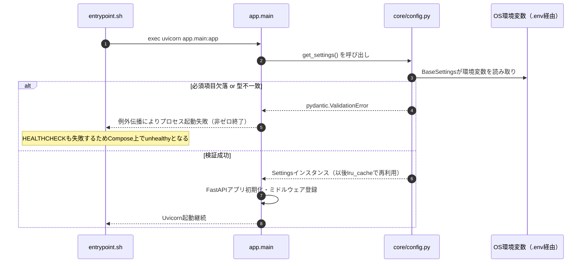
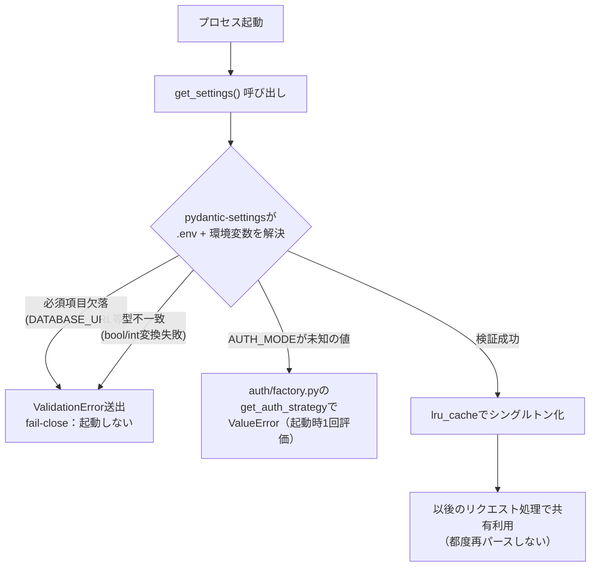
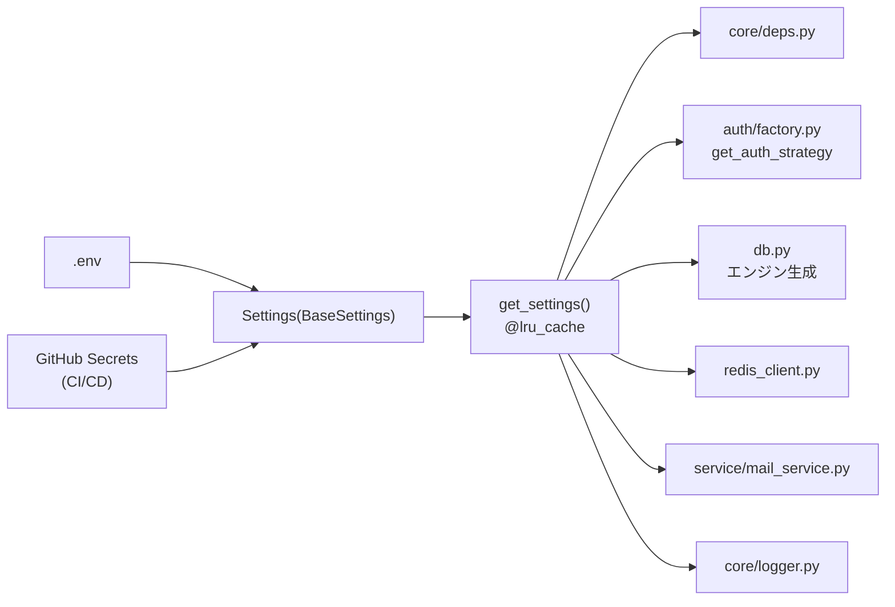

# infra/04 環境変数一覧・config.py設計

## 0. 関連ドキュメント

- 基本設計：[../../basic_design/06_infra_cicd.md](../../basic_design/06_infra_cicd.md)（§4）、[../../basic_design/03_auth.md](../../basic_design/03_auth.md)、[../../basic_design/00_overview.md](../../basic_design/00_overview.md)
- 詳細設計：[01_docker_compose.md](./01_docker_compose.md)、[02_dockerfile_api.md](./02_dockerfile_api.md)、[03_dockerfile_frontend.md](./03_dockerfile_frontend.md)、[../auth/00_strategy_base.md](../auth/00_strategy_base.md)、[../auth/04_google_oauth.md](../auth/04_google_oauth.md)、[../api/auth/02_post_auth_login.md](../api/auth/02_post_auth_login.md)

## 1. 概要

| 項目 | 内容 |
|------|------|
| 対象 | `api/app/core/config.py`（`Settings(BaseSettings)`）、`.env` / `.env.example`、GitHub Secrets |
| 責務 | 全環境変数を型付きで一元管理し、起動時に検証する。値のハードコーディングを排除する唯一の入口とする |
| 適用条件 | backendプロセス起動時（`import app.core.config` の初回評価） |
| 依存先 | `pydantic-settings`（`BaseSettings`） |
| 実装ファイル | `api/app/core/config.py` |

## 2. 構成要素

| 要素 | 種別 | 責務 | 備考 |
|------|------|------|------|
| `Settings` | pydanticモデル | 全環境変数をフィールドとして型定義 | `model_config = SettingsConfigDict(env_file=".env", case_sensitive=True)` |
| `get_settings()` | 関数（`@lru_cache`） | `Settings()` のシングルトン取得 | 起動時に1度だけ評価し、以後はキャッシュ返却 |
| `.env` | ファイル | ローカル/自宅サーバーでの実値（**コミット禁止**） | `.gitignore` に登録済み |
| `.env.example` | ファイル | 変数名と無害な例のみを記載した雛形（コミット対象） | 秘匿値は`***`等のダミー |
| GitHub Secrets | CI/CD | CI: ダミー値注入、CD: `.env`をヒアドキュメント生成 | ワークフローログへ出力しない |

## 3. 設定項目（環境変数） 全一覧

秘匿区分：`平文可` = `.env`/`.env.example`に実例値を書ける、`Secret` = `.env`のみ・`.env.example`はダミー・GitHub Secretsで管理。

### 3.1 共通・ポート

| 変数名 | 型 | 既定値 | 用途 | 秘匿 |
|--------|-----|--------|------|------|
| `COMPOSE_PROJECT_NAME` | str | `cerberus` | Composeプロジェクト名 | 平文可 |
| `APP_ENV` | Literal["local","ci","production"] | `local` | 実行環境の判定（mailpit有効化等） | 平文可 |
| `LOG_LEVEL` | str | `INFO` | `core/logger.py` のログレベル | 平文可 |
| `FRONTEND_PORT` | int | `5173` | frontendのホスト公開ポート | 平文可 |
| `BACKEND_PORT` | int | `8000` | 開発時のみbackendをホストへ公開する場合のポート | 平文可 |
| `POSTGRES_PORT` | int | `5432` | 開発時のみpostgresをホストへ公開する場合のポート | 平文可 |
| `REDIS_PORT` | int | `6379` | 開発時のみredisをホストへ公開する場合のポート | 平文可 |
| `MAILPIT_SMTP_PORT` | int | `1025` | 開発時のみmailpit SMTPをホストへ公開する場合のポート | 平文可 |
| `MAILPIT_UI_PORT` | int | `8025` | 開発時のみmailpit UIをホストへ公開する場合のポート | 平文可 |

### 3.2 データストア

| 変数名 | 型 | 既定値 | 用途 | 秘匿 |
|--------|-----|--------|------|------|
| `POSTGRES_USER` | str | `cerberus` | postgresコンテナ初期化 | 平文可 |
| `POSTGRES_PASSWORD` | str | なし（必須） | postgresコンテナ初期化 | **Secret** |
| `POSTGRES_DB` | str | `cerberus` | postgresコンテナ初期化 | 平文可 |
| `DATABASE_URL` | str | なし（必須） | SQLAlchemy/Alembic接続文字列 | **Secret** |
| `DATABASE_POOL_SIZE` | int | `5` | コネクションプールサイズ | 平文可 |
| `DATABASE_MAX_OVERFLOW` | int | `10` | プール超過時の追加接続数 | 平文可 |
| `REDIS_URL` | str | `redis://redis:6379/0` | redis-py接続文字列 | 平文可 |
| `REDIS_KEY_PREFIX` | str | 空文字 | Redisキー名前空間（環境共有時の衝突回避） | 平文可 |
| `REDIS_TEST_DB` | int | `1` | テスト実行時のRedis DB番号 | 平文可 |
| `LOGIN_HISTORY_RETENTION_DAYS` | int | `365` | `sp_purge_login_history` の保持日数 | 平文可 |

### 3.3 認証共通・session方式

| 変数名 | 型 | 既定値 | 用途 | 秘匿 |
|--------|-----|--------|------|------|
| `AUTH_MODE` | Literal["session","jwt"] | `session` | 認証Strategy切り替え（起動時1回評価） | 平文可 |
| `SESSION_TTL_SECONDS` | int | `1800` | セッションのアイドルTTL（延長される） | 平文可 |
| `SESSION_ABSOLUTE_TTL_SECONDS` | int | `28800` | セッションの絶対有効期限（8時間） | 平文可 |
| `COOKIE_NAME_SESSION` | str | `cerberus_sid` | session Cookie名 | 平文可 |
| `COOKIE_NAME_CSRF` | str | `cerberus_csrf` | CSRF Cookie名（session/jwt共通） | 平文可 |
| `COOKIE_NAME_OAUTH_STATE` | str | `cerberus_oauth_state` | OAuth state Cookie名 | 平文可 |
| `COOKIE_SECURE` | bool | `false`（本番相当は`true`） | Cookieの`Secure`属性 | 平文可 |
| `COOKIE_SAMESITE` | Literal["lax","strict","none"] | `lax` | session/CSRF Cookieの`SameSite` | 平文可 |
| `COOKIE_DOMAIN` | str | 空文字 | Cookieの`Domain`属性（必要時のみ設定） | 平文可 |
| `LOGIN_LOCK_MAX_ATTEMPTS` | int | `5` | ログイン失敗の許容回数上限 | 平文可 |
| `LOGIN_LOCK_WINDOW_SECONDS` | int | `900` | ログイン失敗カウントのロック窓TTL | 平文可 |
| `ARGON2_TIME_COST` | int | `3` | argon2idコストパラメータ | 平文可 |
| `ARGON2_MEMORY_COST` | int | `65536` | argon2idコストパラメータ（KiB） | 平文可 |
| `ARGON2_PARALLELISM` | int | `4` | argon2idコストパラメータ | 平文可 |

### 3.4 jwt方式

| 変数名 | 型 | 既定値 | 用途 | 秘匿 |
|--------|-----|--------|------|------|
| `ACCESS_TOKEN_TTL_SECONDS` | int | `900` | アクセストークン有効期限 | 平文可 |
| `REFRESH_TTL_SECONDS` | int | `1209600` | リフレッシュトークン有効期限（14日） | 平文可 |
| `JWT_SECRET_KEY` | str | なし（必須） | JWT署名鍵（HS256） | **Secret** |
| `JWT_ALGORITHM` | str | `HS256` | JWT署名アルゴリズム | 平文可 |
| `COOKIE_NAME_REFRESH` | str | `cerberus_rt` | refresh token Cookie名 | 平文可 |
| `COOKIE_SAMESITE_REFRESH` | Literal["lax","strict","none"] | `strict` | refresh Cookieの`SameSite` | 平文可 |

### 3.5 CORS・API公開設定

| 変数名 | 型 | 既定値 | 用途 | 秘匿 |
|--------|-----|--------|------|------|
| `CORS_ALLOW_ORIGINS` | list[str]（カンマ区切りをパース） | `http://localhost:5173` | 許可Origin一覧。`allow_credentials=true`と併用 | 平文可 |
| `ENABLE_API_DOCS` | bool | `true` | `/api/docs`（Swagger UI）の有効化。本番は`false`推奨 | 平文可 |

### 3.6 ページング

| 変数名 | 型 | 既定値 | 用途 | 秘匿 |
|--------|-----|--------|------|------|
| `PAGINATION_DEFAULT_PAGE_SIZE` | int | `20` | `per_page`未指定時の既定件数（[../../basic_design/04_api.md](../../basic_design/04_api.md) §該当箇所） | 平文可 |
| `PAGINATION_MAX_PAGE_SIZE` | int | `100` | `per_page`の上限。超過指定は`422`または上限値へクランプ（要検討＝12章参照） | 平文可 |

### 3.7 Google OAuth2

| 変数名 | 型 | 既定値 | 用途 | 秘匿 |
|--------|-----|--------|------|------|
| `GOOGLE_LOGIN_ENABLED` | bool | `true` | Googleログインボタン有効化（`/auth/config`へ反映） | 平文可 |
| `GOOGLE_CLIENT_ID` | str | なし（必須） | OAuth2クライアントID | **Secret** |
| `GOOGLE_CLIENT_SECRET` | str | なし（必須） | OAuth2クライアントシークレット | **Secret** |
| `GOOGLE_REDIRECT_URI` | str | `http://localhost:5173/api/auth/oauth/google/callback` | 認可コールバックURI | 平文可 |
| `GOOGLE_AUTHORIZE_ENDPOINT` | str | `https://accounts.google.com/o/oauth2/v2/auth` | 認可エンドポイント | 平文可 |
| `GOOGLE_TOKEN_ENDPOINT` | str | `https://oauth2.googleapis.com/token` | tokenエンドポイント | 平文可 |
| `GOOGLE_USERINFO_ENDPOINT` | str | `https://openidconnect.googleapis.com/v1/userinfo` | userinfoエンドポイント | 平文可 |
| `GOOGLE_JWKS_URI` | str | `https://www.googleapis.com/oauth2/v3/certs` | JWKS取得元 | 平文可 |
| `GOOGLE_JWKS_CACHE_TTL_SECONDS` | int | `3600` | JWKSキャッシュ有効期間 | 平文可 |
| `OAUTH_STATE_TTL_SECONDS` | int | `600` | `oauth_state:{state}` のTTL | 平文可 |
| `OAUTH_HANDOFF_TTL_SECONDS` | int | `60` | `oauth_handoff:{code}` のTTL（jwtモード限定） | 平文可 |

### 3.8 メール（SMTP/Mailpit）

| 変数名 | 型 | 既定値 | 用途 | 秘匿 |
|--------|-----|--------|------|------|
| `SMTP_HOST` | str | `mailpit` | SMTP接続先（開発）。本番は外部SMTPホスト | 平文可 |
| `SMTP_PORT` | int | `1025` | SMTP接続ポート（開発）。本番は外部SMTPのポート | 平文可 |
| `SMTP_USER` | str | 空文字 | 本番外部SMTP利用時のみ | **Secret**（値がある場合） |
| `SMTP_PASSWORD` | str | 空文字 | 本番外部SMTP利用時のみ | **Secret**（値がある場合） |
| `SMTP_USE_TLS` | bool | `false` | SMTP接続のTLS有効化 | 平文可 |
| `MAIL_FROM` | str | `no-reply@cerberus.local` | メール送信元アドレス | 平文可 |
| `FRONTEND_BASE_URL` | str | `http://localhost:5173` | メール本文内リンク・OAuth後リダイレクト先の基点 | 平文可 |
| `PASSWORD_RESET_TTL_SECONDS` | int | `1800` | パスワードリセットトークンTTL | 平文可 |
| `EMAIL_VERIFY_TTL_SECONDS` | int | `86400` | メール認証トークンTTL（24時間） | 平文可 |
| `EMAIL_VERIFY_RESEND_INTERVAL_SECONDS` | int | `60` | 認証メール再送の最小間隔 | 平文可 |

### 3.9 初期データ・フロント

| 変数名 | 型 | 既定値 | 用途 | 秘匿 |
|--------|-----|--------|------|------|
| `INITIAL_ADMIN_EMAIL` | str | なし（必須） | seed用管理者メール | **Secret** |
| `INITIAL_ADMIN_USERNAME` | str | なし（必須） | seed用管理者ユーザー名 | **Secret** |
| `INITIAL_ADMIN_PASSWORD` | str | なし（必須） | seed用管理者パスワード（平文はseedスクリプト内でのみ使用しargon2化して保存） | **Secret** |
| `VITE_API_BASE_URL` | str | `/api` | フロントのAPIベースURL。**ビルド時にArgとして埋め込み**（backendの`Settings`には含めない） | 平文可 |

## 4. 全体の出入力

| 区分 | 内容 |
|------|------|
| 入力 | `.env`（ローカル/自宅サーバー）、CI: `env:`ブロックとダミーSecrets、CD: GitHub Secretsから生成した`.env` |
| 出力 | `Settings`インスタンス（型付き設定値）。起動時バリデーション失敗時は例外を送出しプロセスを起動させない |
| 副作用 | なし（読み取り専用の設定解決。ただし失敗時はプロセス終了という副作用を持つ） |

## 5. シーケンス図

### 5.1 起動時バリデーション

## 6. 処理フロー・分岐

## 7. データ遷移図

なし（設定値は起動時に1度解決され、プロセス生存中は不変。ホットリロードは行わない）。

## 8. 関数・処理詳細

### 8.1 `core/config.py` :: `Settings`

| 項目 | 内容 |
|------|------|
| シグネチャ / 定義 | `class Settings(BaseSettings): ...`（`model_config = SettingsConfigDict(env_file=".env", env_file_encoding="utf-8", case_sensitive=True, extra="forbid")` |
| 引数 / 入力 | 環境変数（3章の全項目をフィールドとして宣言。必須項目は型のみでデフォルトを与えない） |
| 戻り値 / 出力 | `Settings` インスタンス |
| 送出例外 / 失敗条件 | `pydantic.ValidationError`（必須項目欠落・型変換失敗・`Literal`範囲外） |
| 処理内容 | 1. フィールド宣言（`str`/`int`/`bool`/`Literal`/`list[str]`） 2. `CORS_ALLOW_ORIGINS`はカンマ区切り文字列を`list[str]`へ変換する`field_validator`を持つ 3. `extra="forbid"`により未定義環境変数の混入をエラー化しない（`.env`内の無関係変数は許容しつつ、Settingsフィールドの誤字は個別に検知） |
| 副作用 | なし |

### 8.2 `core/config.py` :: `get_settings`

| 項目 | 内容 |
|------|------|
| シグネチャ / 定義 | `@lru_cache def get_settings() -> Settings:` |
| 引数 / 入力 | なし |
| 戻り値 / 出力 | `Settings`（キャッシュ済みシングルトン） |
| 送出例外 / 失敗条件 | 初回呼び出し時に`Settings()`が送出する`ValidationError`をそのまま伝播 |
| 処理内容 | 1. 初回呼び出し時のみ`Settings()`を評価 2. 以後はキャッシュを返却（`AUTH_MODE`等のリクエスト毎再評価コストを避ける、[../auth/00_strategy_base.md](../auth/00_strategy_base.md)と整合） |
| 副作用 | プロセスメモリ上にシングルトンを保持 |

## 9. 関数・要素相関図

## 10. セキュリティ・非機能考慮

| 観点 | 方針 | 根拠 |
|------|------|------|
| 秘匿情報のコミット防止 | `.env`は`.gitignore`対象。`.env.example`はダミー値のみ | [../../basic_design/06_infra_cicd.md](../../basic_design/06_infra_cicd.md) §4 |
| Secretsの受け渡し | CI: `secrets.*`をジョブ内`env:`へ、CD: deployジョブ内でヒアドキュメントにより`.env`を生成しログ出力しない | [../../basic_design/06_infra_cicd.md](../../basic_design/06_infra_cicd.md) §5.3・6.2 |
| 起動時バリデーション失敗方針 | fail-close。必須項目欠落時はプロセスを起動させず、Compose上でbackendがunhealthy/起動失敗となり後続（frontend起動）も止まる | [01_docker_compose.md](./01_docker_compose.md) |
| ハードコーディング禁止 | URL・TTL・上限値・Cookie名等はすべて本章の環境変数経由とし、コード内リテラルを禁止する | 共通執筆ルール |
| シークレットローテーション | `JWT_SECRET_KEY`変更時は既発行アクセストークンが全て無効化される（リフレッシュはRedis管理のため生存） | [../../basic_design/06_infra_cicd.md](../../basic_design/06_infra_cicd.md) §8 |
| `ENABLE_API_DOCS` | 本番相当環境では`false`にしてSwagger UI経由の情報露出を避けることを推奨（既定`true`は開発優先） | [../../basic_design/06_infra_cicd.md](../../basic_design/06_infra_cicd.md) §4.3 |

## 11. テスト設計

| No | 区分 | ケース | 前提 | 期待結果 | テスト名案 |
|----|------|--------|------|----------|-----------|
| 1 | 単体 | 必須環境変数が全て揃っている場合に`Settings()`が生成できる | `.env`相当のダミー値をmonkeypatchで注入 | 例外なくインスタンス化される | `test_settings_valid_env_ok` |
| 2 | 単体 | `DATABASE_URL`未設定時に`ValidationError`となる | 該当変数のみ未設定 | `pydantic.ValidationError`が送出される | `test_settings_missing_database_url_raises` |
| 3 | 単体 | `AUTH_MODE`に未知の値を与えると`get_auth_strategy`が`ValueError`を送出する | `AUTH_MODE=invalid` | 起動時（初回呼び出し時）に`ValueError` | `test_auth_mode_invalid_raises` |
| 4 | 単体 | `CORS_ALLOW_ORIGINS`のカンマ区切り文字列が`list[str]`へ変換される | `CORS_ALLOW_ORIGINS=http://a,http://b` | `["http://a","http://b"]`になる | `test_settings_cors_origins_parsed` |
| 5 | 単体 | `COOKIE_SECURE`等のbool文字列（`"true"`/`"false"`）が正しく変換される | 環境変数に文字列`"false"`を設定 | `Settings.cookie_secure is False` | `test_settings_bool_parsing` |
| 6 | 結合 | CIの`backend-test`ジョブが`AUTH_MODE`のmatrix（session/jwt）双方で起動できる | CI環境変数一式 | 両方のジョブでSettings生成に成功しテストが実行される | `test_settings_ci_matrix_both_modes`（CIログで確認） |
| 網羅できない範囲 | 実際のGitHub SecretsからCD環境で`.env`が正しく生成されるかの実運用確認 | - | self-hosted runnerの実機依存のため自動テスト対象外。デプロイ後のヘルスチェック結果で代替確認する | - |

## 12. 不明点・要検討事項

| 区分 | 内容 | 影響 |
|------|------|------|
| 要検討 | ログイン失敗上限の環境変数名が、基本設計（[../../basic_design/06_infra_cicd.md](../../basic_design/06_infra_cicd.md) §4.3）では`LOGIN_MAX_ATTEMPTS`、既存の詳細設計（[../api/auth/02_post_auth_login.md](../api/auth/02_post_auth_login.md)）では`LOGIN_LOCK_MAX_ATTEMPTS`と表記が異なる。本書は詳細設計側の既存表記`LOGIN_LOCK_MAX_ATTEMPTS`に合わせたが、`core/config.py`実装時にどちらか一方へ統一する必要がある | `Settings`のフィールド名、[../api/auth/02_post_auth_login.md](../api/auth/02_post_auth_login.md) |
| 要検討 | `PAGINATION_DEFAULT_PAGE_SIZE`/`PAGINATION_MAX_PAGE_SIZE`は基本設計に環境変数名の明記がなく、本書で「ハードコーディングしない」方針に沿って新規に定義した。既定値20/上限100は[../../basic_design/04_api.md](../../basic_design/04_api.md)の記述値をそのまま採用しているが、上限超過時に`422`とするかクランプするかは基本設計に明記がなく未確定 | `schemas/`のページングDTO実装 |
| 不明 | `SMTP_USER`/`SMTP_PASSWORD`が空文字の場合に認証なしSMTP（Mailpit相当）として扱うか、空文字も含めて常時Secret区分とするかの厳密な切り分けは基本設計に明記がない | `service/mail_service.py`の接続分岐 |
