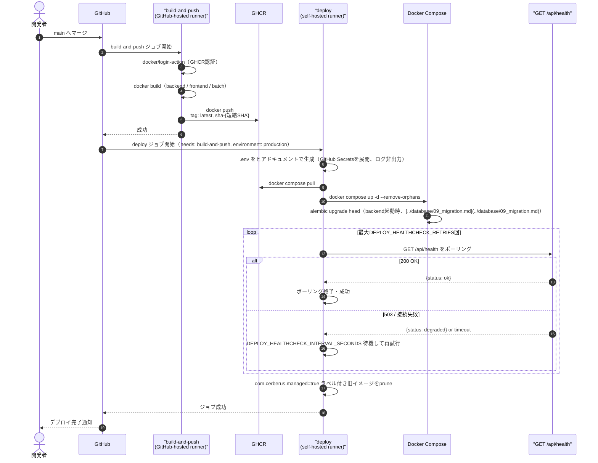
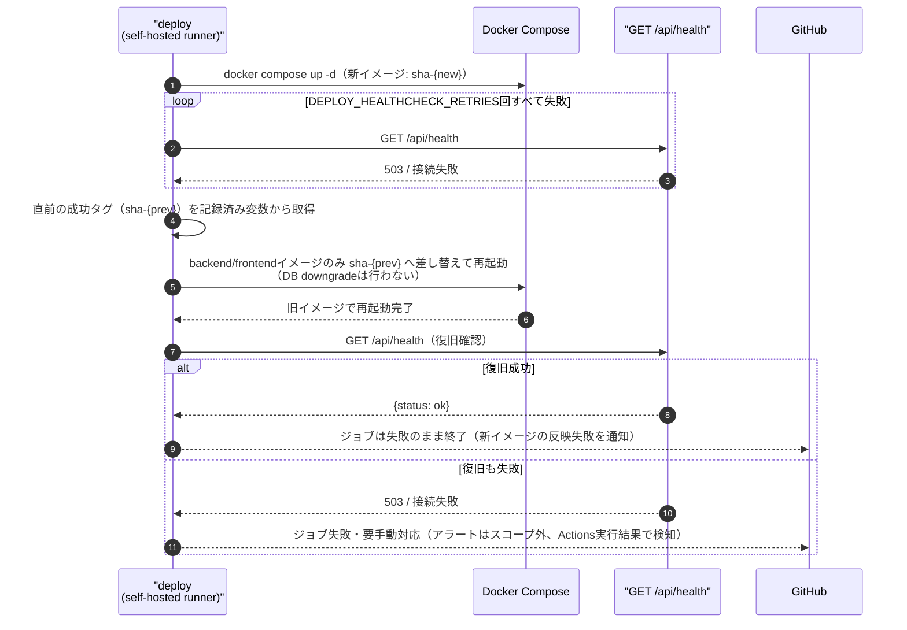
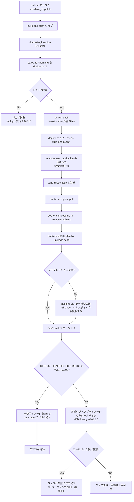
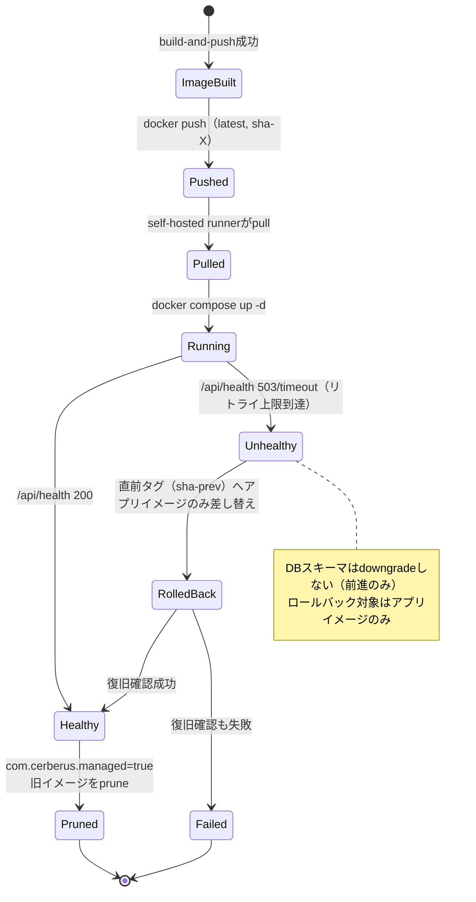

# infra/06 CDワークフロー（`.github/workflows/cd.yml`）

## 0. 関連ドキュメント

- 基本設計：[../../basic_design/06_infra_cicd.md](../../basic_design/06_infra_cicd.md)（§6 CD設計、§8 運用時の確認事項）
- 詳細設計：[01_docker_compose.md](./01_docker_compose.md)、[04_env_config.md](./04_env_config.md)、[05_ci_workflow.md](./05_ci_workflow.md)、[../database/09_migration.md](../database/09_migration.md)（マイグレーション失敗時の方針）、[../api/system/01_get_health.md](../api/system/01_get_health.md)（デプロイ後ヘルスチェック）

## 1. 概要

| 項目 | 内容 |
|------|------|
| 対象 | `.github/workflows/cd.yml` |
| 責務 | mainマージをトリガーにbackend/frontend/batchイメージをビルドしGHCRへpush、self-hosted runner経由で対象環境へデプロイし、ヘルスチェックで疎通確認する |
| 適用条件 | `on: push: branches: [main]`、`workflow_dispatch`（手動再実行） |
| 依存先 | GHCR（`docker/login-action`）、self-hosted runner、Docker Compose（[01_docker_compose.md](./01_docker_compose.md)）、`GET /api/health`（[../api/system/01_get_health.md](../api/system/01_get_health.md)） |
| 実装ファイル | `.github/workflows/cd.yml` |

## 2. 構成要素

| 要素 | 種別 | 責務 | 備考 |
|------|------|------|------|
| `build-and-push` | ジョブ | backend/frontend/batchイメージをビルドしGHCRへpush | `runs-on: ubuntu-latest`（GitHub-hosted runner） |
| `deploy` | ジョブ | self-hosted runner上で`.env`生成 → pull → `docker compose up -d` → ヘルスチェック | `needs: build-and-push`、`runs-on: [self-hosted, linux, cerberus]` |
| GitHub Environment `production` | 環境 | Secretsのスコープ分離、必要に応じた承認フロー | `deploy`ジョブに`environment: production`を指定 |
| `concurrency` グループ | ワークフロー設定 | 同時デプロイの競合防止 | `group: deploy-main, cancel-in-progress: false` |
| イメージタグ | 命名規則 | `latest`と`sha-{短縮SHA}`の2本立て | ロールバック時は`sha-{短縮SHA}`を指定 |

## 3. 設定項目（環境変数・Secrets）

| 変数名 | 型 | 既定値 | 用途 | 秘匿 |
|--------|-----|--------|------|------|
| `REGISTRY` | str | `ghcr.io` | イメージレジストリのホスト名 | 否 |
| `IMAGE_NAME_BACKEND` | str | `ghcr.io/{owner}/cerberus-backend` | backendイメージ名（`{owner}`はリポジトリオーナー） | 否 |
| `IMAGE_NAME_FRONTEND` | str | `ghcr.io/{owner}/cerberus-frontend` | frontendイメージ名 | 否 |
| `IMAGE_NAME_BATCH` | str | `ghcr.io/{owner}/cerberus-batch` | batchイメージ名 | 否 |
| `GITHUB_TOKEN` | str | 自動発行 | `docker/login-action`によるGHCR認証（`permissions: packages: write`） | **Secret**（GitHub自動管理） |
| すべての`.env`項目（[04_env_config.md](./04_env_config.md)§3） | - | - | `deploy`ジョブが`GitHub Environment: production`のSecretsから`.env`をヒアドキュメント生成 | **Secret**表記の項目はすべてGitHub Secrets |
| `DEPLOY_HOST_HEALTHCHECK_URL` | str | `http://localhost:${FRONTEND_PORT}/api/health` | デプロイ後ポーリング先URL | 否（self-hosted runnerローカルの値） |
| `DEPLOY_HEALTHCHECK_RETRIES` / `DEPLOY_HEALTHCHECK_INTERVAL_SECONDS` | int | `10` / `5` | ヘルスチェックのポーリング回数・間隔 | 否（ワークフロー内の`env:`。学習用途の仮値であり基本設計に明記はない。§12参照） |

`.env`生成は`deploy`ジョブ内のステップで`cat <<EOF > .env` 形式のヒアドキュメントを用い、`${{ secrets.* }}`を展開する。生成後の`.env`の中身をワークフローログへ出力するステップ（`cat .env`等）は設けない。

## 4. 全体の出入力

| 区分 | 内容 |
|------|------|
| 入力 | `main`ブランチへのpushイベント（マージコミット）、`workflow_dispatch`、GitHub Environment `production`のSecrets一式 |
| 出力 | GHCR上の`cerberus-backend`/`cerberus-frontend`イメージ（`latest`・`sha-{短縮SHA}`）、self-hosted runner上で稼働するコンテナ群、デプロイ結果（成功/失敗） |
| 副作用 | self-hosted runner上の`.env`ファイル生成・上書き、稼働中コンテナの置き換え（`docker compose up -d`）、`backend`起動時の`alembic upgrade head`によるDBスキーマ変更、`batch`再起動によるスケジューラ再登録、失敗時のイメージロールバック、未使用イメージのprune |

## 5. シーケンス図

### 5.1 CDフロー（正常系・[../../basic_design/06_infra_cicd.md](../../basic_design/06_infra_cicd.md)§6.1を本書の粒度で再掲）

### 5.2 ヘルスチェック失敗時のロールバック（異常系）

## 6. 処理フロー・分岐

## 7. データ遷移図

## 8. 関数・処理詳細

### 8.1 `.github/workflows/cd.yml` :: ワークフロー定義

| 項目 | 内容 |
|------|------|
| シグネチャ / 定義 | `name: cd`。`on: { push: { branches: [main] }, workflow_dispatch: {} }`。`concurrency: { group: deploy-main, cancel-in-progress: false }` |
| 引数 / 入力 | `push`イベント（main）、`workflow_dispatch`手動起動、GitHub Environment `production`のSecrets |
| 戻り値 / 出力 | `build-and-push`/`deploy`各ジョブのconclusion |
| 送出例外 / 失敗条件 | いずれかのジョブ内ステップが非ゼロ終了 |
| 処理内容 | `build-and-push`→`deploy`の2ジョブを`needs`で直列化する |
| 副作用 | なし（定義自体） |

### 8.2 `build-and-push` ジョブ

| 項目 | 内容 |
|------|------|
| シグネチャ / 定義 | `runs-on: ubuntu-latest`。`permissions: { packages: write, contents: read }` |
| 引数 / 入力 | `api/Dockerfile`（[02_dockerfile_api.md](./02_dockerfile_api.md)）、`frontend/Dockerfile`（[03_dockerfile_frontend.md](./03_dockerfile_frontend.md)）、`${{ github.sha }}` |
| 戻り値 / 出力 | GHCR上のイメージ2種（各`latest`/`sha-{短縮SHA}`タグ） |
| 送出例外 / 失敗条件 | `docker/login-action`の認証失敗、`docker build`のビルドエラー、`docker push`の権限エラー |
| 処理内容 | 1. チェックアウト 2. `docker/setup-buildx-action@v3` 3. `docker/login-action@v3`（`registry: ghcr.io`, `username: ${{ github.actor }}`, `password: ${{ secrets.GITHUB_TOKEN }}`） 4. `docker/build-push-action@v6`をbackend/frontend/batch用に3回実行し、各イメージへ`latest`と`sha-${{ github.sha }}`を付けてpush 5. `VITE_API_BASE_URL`をfrontendのビルド`ARG`として本番相当値で渡す |
| 副作用 | GHCR上に新規イメージタグが公開される |

### 8.3 `deploy` ジョブ

| 項目 | 内容 |
|------|------|
| シグネチャ / 定義 | `runs-on: [self-hosted, linux, cerberus]`。`needs: build-and-push`。`environment: production` |
| 引数 / 入力 | GitHub Environment `production`のSecrets（[04_env_config.md](./04_env_config.md)全一覧）、`${{ github.sha }}` |
| 戻り値 / 出力 | デプロイ成功可否、ヘルスチェック結果 |
| 送出例外 / 失敗条件 | `.env`生成失敗（Secrets未設定）、`docker compose pull`失敗、ヘルスチェック未達（リトライ上限到達） |
| 処理内容 | 1. `actions/checkout@v4`（`clean: true`を明示、self-hostedのワークスペース再利用対策） 2. `.env`をヒアドキュメントで生成（`cat <<EOF > .env` 形式、`${{ secrets.* }}`を展開しログ出力しない） 3. `docker compose pull` 4. `docker compose up -d --remove-orphans` 5. `GET ${DEPLOY_HOST_HEALTHCHECK_URL}` を`DEPLOY_HEALTHCHECK_RETRIES`回まで`DEPLOY_HEALTHCHECK_INTERVAL_SECONDS`間隔でポーリング 6. 失敗時は「8.4 ロールバック手順」を実行 7. 成功時は`docker image prune`（`com.cerberus.managed=true`ラベル限定） |
| 副作用 | self-hosted runnerホスト上のコンテナ・イメージ・`.env`ファイルを変更する |

### 8.4 ロールバック手順（`deploy`ジョブ内の失敗時ステップ）

| 項目 | 内容 |
|------|------|
| シグネチャ / 定義 | ヘルスチェック失敗時に実行される後続ステップ（`if: failure()`相当の条件付きステップ） |
| 引数 / 入力 | デプロイ直前に記録した直前成功タグ（`sha-{prev}`。runner上のファイルまたは前回ジョブの出力から取得） |
| 戻り値 / 出力 | ロールバック後の稼働状態 |
| 送出例外 / 失敗条件 | ロールバック後も`/api/health`が失敗する場合は復旧不能としてジョブ失敗のまま終了 |
| 処理内容 | 1. `docker compose.yml`のイメージタグを`sha-{prev}`に一時的に差し替え（環境変数`BACKEND_IMAGE_TAG`/`FRONTEND_IMAGE_TAG`をrunner上で上書きし`docker compose up -d`を再実行する想定） 2. **DBマイグレーションのdowngradeは行わない**（[../database/09_migration.md](../database/09_migration.md)§5） 3. `/api/health`で復旧確認 4. 結果に関わらずジョブ全体は「新バージョンの反映失敗」としてfailure終了する |
| 副作用 | 稼働イメージが旧バージョンに戻る。DBスキーマは変更しない（前進のみ） |

## 9. 関数・要素相関図

```mermaid
flowchart LR
    TRIG["main へのpush / workflow_dispatch"] --> WF["cd.yml"]
    WF --> BAP["build-and-push"]
    BAP --> LOGIN["docker/login-action"]
    BAP --> BUILD["docker build backend/frontend/batch"]
    BUILD --> PUSH["docker push<br/>latest + sha-{短縮SHA}"]
    PUSH --> GHCR[("GHCR")]
    BAP --> DEPLOY["deploy<br/>(needs: build-and-push)"]
    GHCR --> DEPLOY
    DEPLOY --> ENVGEN[".env生成<br/>（Secretsから）"]
    ENVGEN --> PULL["docker compose pull"]
    PULL --> UP["docker compose up -d"]
    UP --> MIG["alembic upgrade head"]
    MIG --> HEALTH["GET /api/health ポーリング"]
    HEALTH -->|失敗| ROLLBACK["直前タグへロールバック<br/>（DB downgradeなし）"]
    HEALTH -->|成功| PRUNE["com.cerberus.managed=true<br/>旧イメージprune"]
    ROLLBACK --> HEALTH2["復旧確認"]
```

## 10. セキュリティ・非機能考慮

| 観点 | 方針 | 根拠 |
|------|------|------|
| Secretsのログ非出力 | `.env`生成ステップは値をログへ`echo`/`cat`しない。GitHub Actionsのマスキング機能（Secrets値の自動置換）にも依存しない設計とする | [../../basic_design/06_infra_cicd.md](../../basic_design/06_infra_cicd.md) §6.2 |
| GitHub Environment承認 | `environment: production`を用い、必要に応じて手動承認（reviewers）を必須化できる構成とする | [../../basic_design/06_infra_cicd.md](../../basic_design/06_infra_cicd.md) §6.2 |
| 同時実行制御 | `concurrency: group: deploy-main, cancel-in-progress: false`により、連続pushでデプロイが競合しない（先行デプロイ完了を待つ） | [../../basic_design/06_infra_cicd.md](../../basic_design/06_infra_cicd.md) §6.2 |
| イメージ削除の限定 | `docker image prune`は`com.cerberus.managed=true`ラベル付きイメージのみ対象とし、共有ホスト上の他プロジェクトのイメージを誤削除しない | [../../basic_design/06_infra_cicd.md](../../basic_design/06_infra_cicd.md) §6.2 |
| ロールバック方針 | アプリイメージのみを直前タグへ戻し、DBマイグレーションのdowngradeは行わない（fail-close：新スキーマ前提の旧アプリ動作は保証しない前提のため、不可逆変更はexpand/contract方式で段階適用する） | [../database/09_migration.md](../database/09_migration.md)§5、[../../basic_design/06_infra_cicd.md](../../basic_design/06_infra_cicd.md) §8 |
| self-hosted runnerのワークスペース | `actions/checkout`の`clean: true`を明示し、前回実行の残留ファイルによる意図しない挙動を防ぐ | [../../basic_design/06_infra_cicd.md](../../basic_design/06_infra_cicd.md) §6.3 |
| パブリックリポジトリでの利用回避 | self-hosted runnerは第三者PRからの任意コード実行リスクがあるため、本ワークフローは`pull_request`をトリガーにせず`push: [main]`限定とする | [../../basic_design/06_infra_cicd.md](../../basic_design/06_infra_cicd.md) §6.3 |

## 11. テスト設計

| No | 区分 | ケース | 前提 | 期待結果 | テスト名案 |
|----|------|--------|------|----------|-----------|
| 1 | 結合 | `build-and-push`：正常ビルド | mainへの正常なマージ | GHCRに`latest`/`sha-{短縮SHA}`の両タグが作成される | `test_cd_build_and_push_creates_both_tags` |
| 2 | 結合 | `deploy`：正常デプロイ | `build-and-push`成功後 | `docker compose up -d`後に`/api/health`が200を返す | `test_cd_deploy_healthcheck_success` |
| 3 | 結合 | `deploy`：ヘルスチェック失敗時にロールバックが発生 | backendのマイグレーションが失敗するよう仕込んだ検証環境 | 直前タグへ差し替え後、ジョブはfailureのまま終了する | `test_cd_deploy_rollback_on_healthcheck_failure` |
| 4 | 結合 | `deploy`：DBスキーマがdowngradeされないこと | ロールバック発生後 | `alembic_version`テーブルは新リビジョンのまま変化しない | `test_cd_rollback_does_not_downgrade_db` |
| 5 | 結合 | `deploy`：`.env`の内容がログに出力されない | 任意のデプロイ実行 | Actionsログに`POSTGRES_PASSWORD`等の値文字列が出現しない | `test_cd_env_generation_no_secret_leak_in_log` |
| 6 | 結合 | 同時デプロイの競合防止 | mainへ短時間に2回連続push | 2回目のジョブは1回目の完了を待って実行される（`cancel-in-progress: false`） | `test_cd_concurrency_group_serializes_deploys` |
| 7 | 結合 | イメージpruneの対象限定 | `com.cerberus.managed`ラベルなしの他プロジェクトイメージが同一ホストに存在する状態 | pruneの対象にならず残存する | `test_cd_prune_only_managed_images` |
| 網羅できない範囲 | 実際のself-hosted runner実機（自宅サーバー/PC）でのネットワーク・ファイアウォール・ディスク容量起因の障害 | - | 実機依存のため自動テスト対象外。手動確認とする | - |
| 網羅できない範囲 | `environment: production`の手動承認フロー自体の動作確認 | - | GitHub側のUI操作を伴うため自動テスト対象外。設定手順の目視確認に留める | - |

## 12. 不明点・要検討事項

| 区分 | 内容 | 影響 |
|------|------|------|
| 要検討 | `DEPLOY_HEALTHCHECK_RETRIES`/`DEPLOY_HEALTHCHECK_INTERVAL_SECONDS`は基本設計に環境変数として明記がなく、本書が実装レベルの詳細として仮値（10回・5秒）を提案した。[../api/system/01_get_health.md](../api/system/01_get_health.md)の`HEALTH_CHECK_TIMEOUT_SECONDS`（アプリ内DB/Redisタイムアウト）とは別概念であり、両者の関係整理が必要 | ワークフロー内の`env:`定義 |
| 要検討 | ロールバック時に「直前の成功タグ（`sha-{prev}`）」をどう記録・取得するか（runner上のファイル保存、GitHub Deployments API、Actions Artifactsのいずれか）は基本設計に明記がなく実装時の裁量とする | `deploy`ジョブのロールバックステップ実装 |
| 要検討 | `environment: production`の手動承認（reviewers）を必須にするかは基本設計に明記がなく、学習用途では省略も許容されるため要検討 | GitHub Environmentsの設定 |
| 不明 | self-hosted runnerが単一ホストのみか、複数環境（開発者ごとの自宅サーバー等）を想定するかは基本設計に明記がなく、本書は単一`production`環境を前提とした |`runs-on`ラベル設計、GitHub Environments構成数 |
