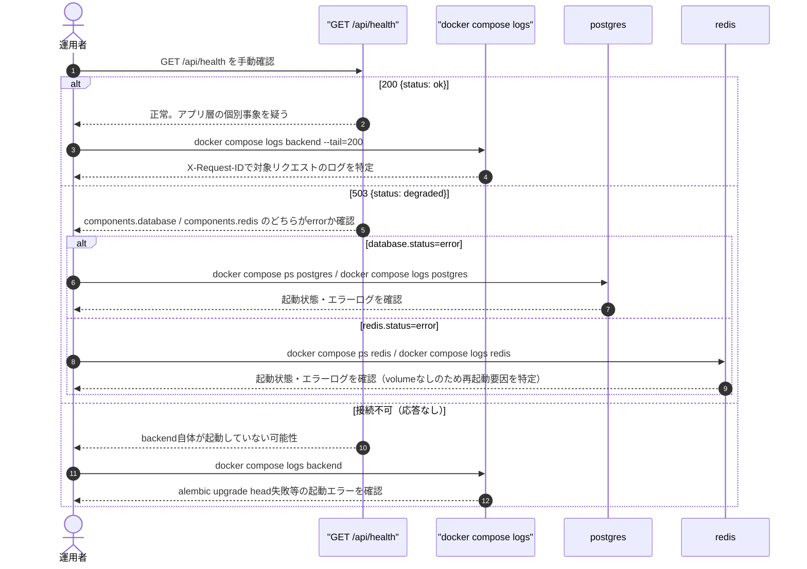
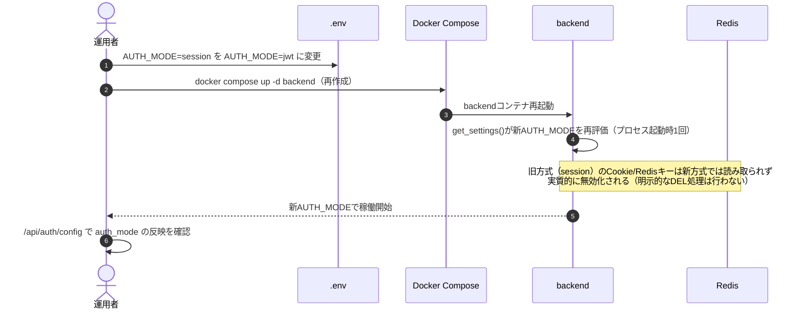
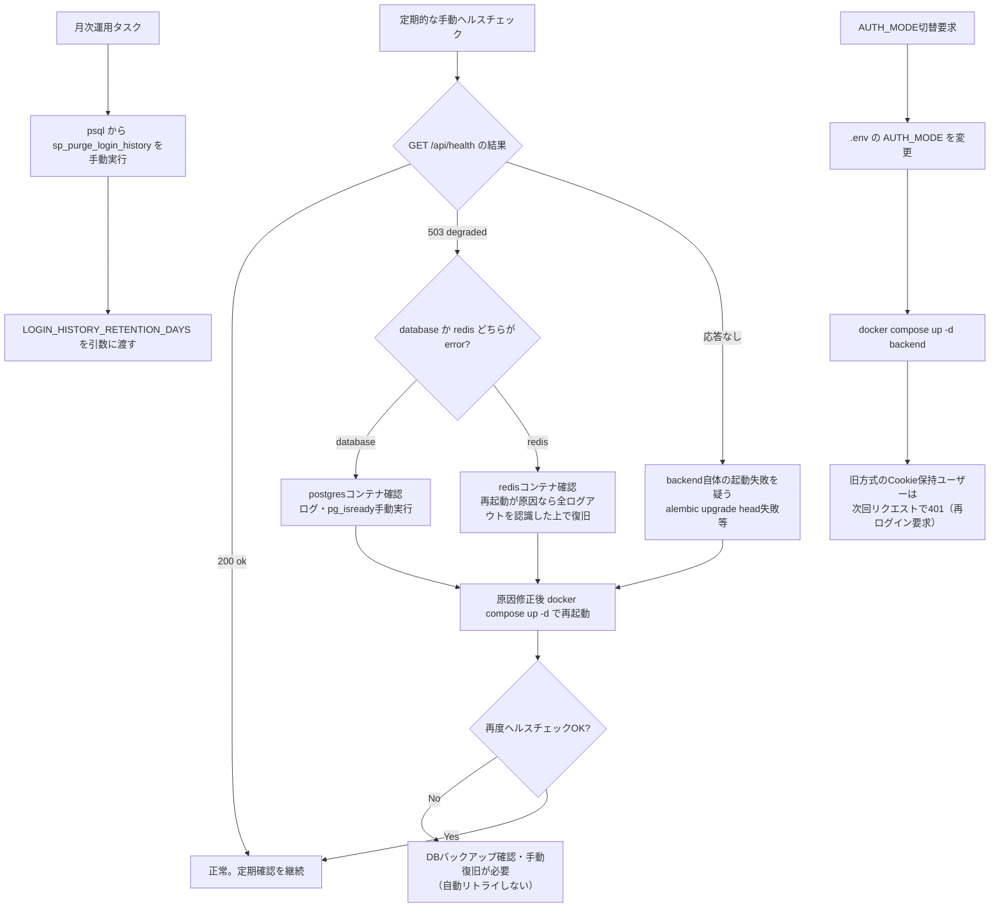
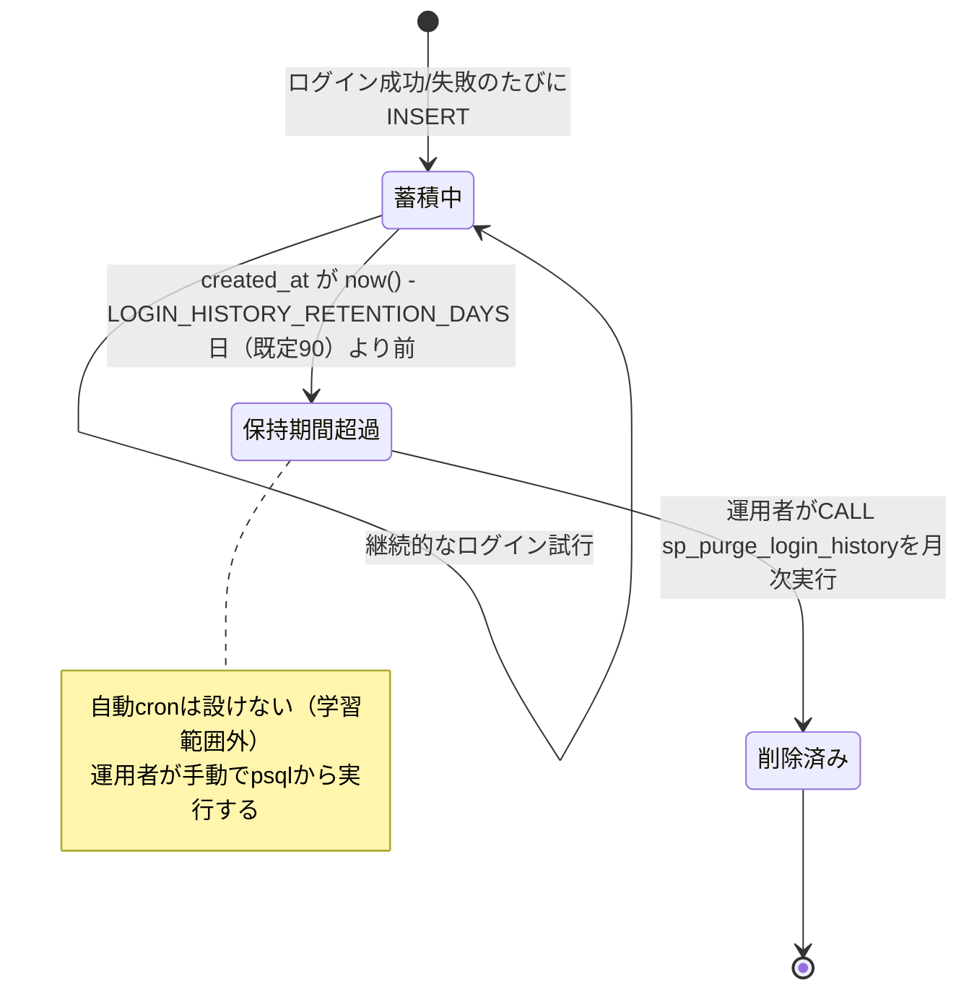
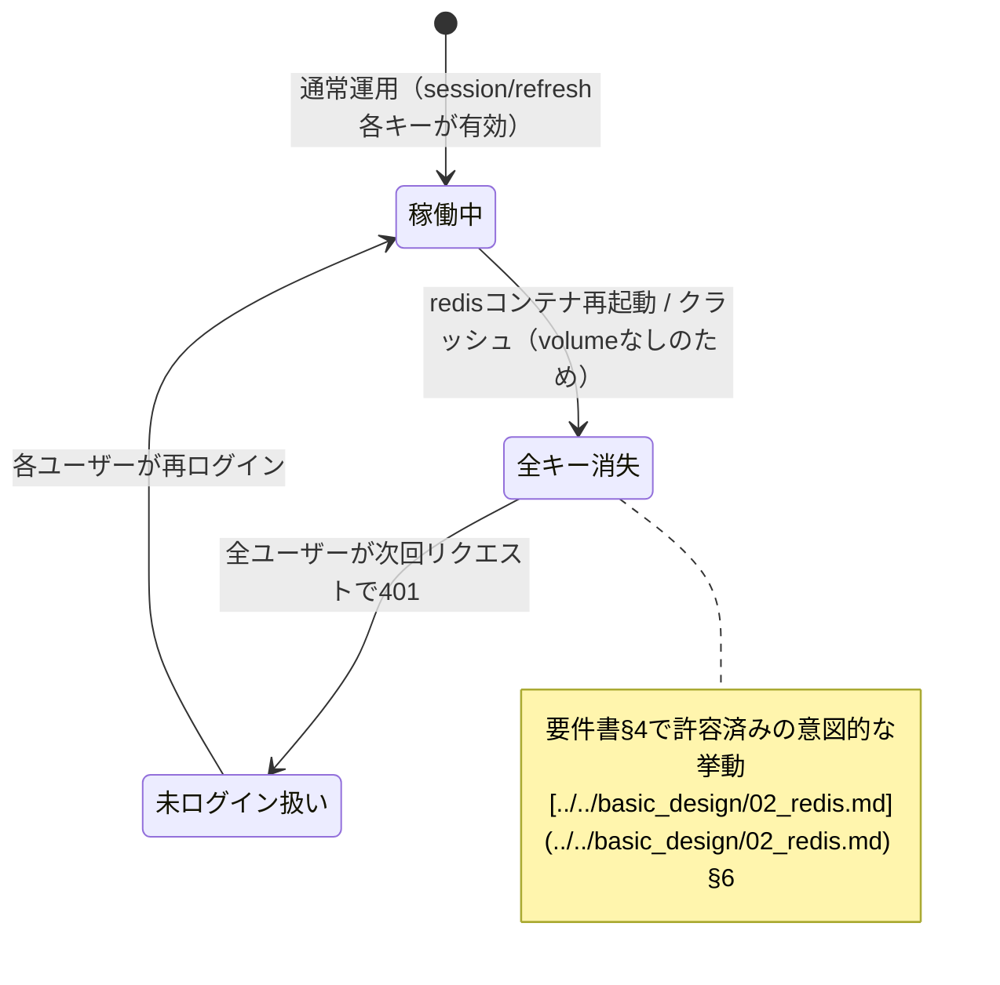
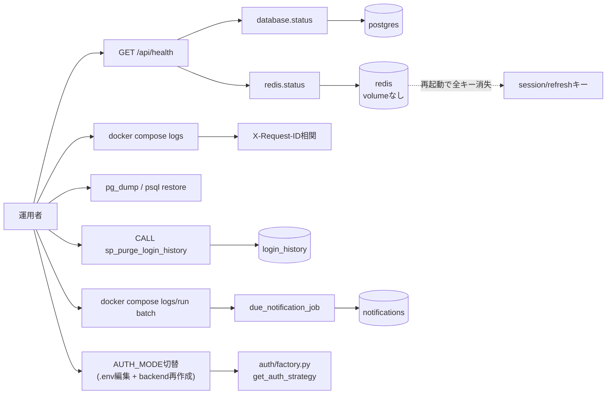

# infra/07 運用設計

## 0. 関連ドキュメント

- 基本設計：[../../basic_design/06_infra_cicd.md](../../basic_design/06_infra_cicd.md)（§8 運用時の確認事項）、[../../basic_design/02_redis.md](../../basic_design/02_redis.md)（§6 障害・運用時の挙動）
- 詳細設計：[01_docker_compose.md](./01_docker_compose.md)、[04_env_config.md](./04_env_config.md)、[06_cd_workflow.md](./06_cd_workflow.md)、[../log/00_history.md](../log/00_history.md)、[../database/11_table_api_history.md](../database/11_table_api_history.md)、[../database/12_table_batch_history.md](../database/12_table_batch_history.md)、[../batch/02_due_notification_job.md](../batch/02_due_notification_job.md)、[../api/system/01_get_health.md](../api/system/01_get_health.md)、[../database/08_db_functions.md](../database/08_db_functions.md)（`sp_purge_*`）、[../database/09_migration.md](../database/09_migration.md)、[../auth/00_strategy_base.md](../auth/00_strategy_base.md)（`AUTH_MODE`切替）

## 1. 概要

| 項目 | 内容 |
|------|------|
| 対象 | 稼働中システムの監視・ログ・バックアップ・障害対応・`AUTH_MODE`切替に関する運用手順 |
| 責務 | 要件書§11でスコープ外とされた自動監視・アラートを除き、手動で実施可能な運用作業を定義する |
| 適用条件 | ローカル/自宅サーバーでの本番相当稼働時（CD後） |
| 依存先 | `GET /api/health`、`docker compose logs`、`pg_dump`、`sp_purge_*`、`api_history`、`batch_history`、batch、Redis（永続化なし） |
| 実装ファイル | 運用手順書のため実装ファイルなし（`docker compose`コマンド・`psql`コマンドの実行手順として記載） |

## 2. 構成要素

| 要素 | 種別 | 責務 | 備考 |
|------|------|------|------|
| `GET /api/health` | 監視対象API | DB/Redis疎通と`AUTH_MODE`の確認 | [../api/system/01_get_health.md](../api/system/01_get_health.md) |
| 構造化ログ + `X-Request-ID` | ログ方式 | リクエスト単位の相関追跡 | `core/logger.py` |
| `docker compose logs` | ログ確認手段 | コンテナ標準出力の閲覧・集約 | 集約基盤（ELK等）はスコープ外 |
| `pg_dump` | バックアップ手段 | `pgdata`のスナップショット取得（手動） | 自動化はスコープ外（要件書§11） |
| `sp_purge_login_history` | 保守用プロシージャ | `login_history`の保持期間超過行削除 | [../database/08_db_functions.md](../database/08_db_functions.md) §3.4 |
| `batch` | 常駐スケジューラ | 毎日10時・17時の期限通知作成と通知保持期間パージ | [../batch/02_due_notification_job.md](../batch/02_due_notification_job.md) |
| `sp_purge_notifications` | batch用プロシージャ | `notifications`の保持期間超過行削除 | [../database/08_db_functions.md](../database/08_db_functions.md) §3.5 |
| `api_history` / `batch_history` | DB履歴 | APIリクエスト、batch実行の検索可能な履歴。各30日保持 | [../log/00_history.md](../log/00_history.md) |
| `sp_purge_api_history` / `sp_purge_batch_history` | 履歴保守 | API・batch履歴の保持期間超過行削除 | [../database/08_db_functions.md](../database/08_db_functions.md) §3.6〜3.7 |
| Redis再起動時の全ログアウト | 既知の挙動 | volumeなしのため再起動でセッション/リフレッシュトークンが消失 | [../../basic_design/02_redis.md](../../basic_design/02_redis.md) §6 |
| `AUTH_MODE`切替手順 | 運用手順 | `session`⇔`jwt`の切り替え | [../auth/00_strategy_base.md](../auth/00_strategy_base.md) |

## 3. 設定項目（環境変数）

| 変数名 | 型 | 既定値 | 用途 | 秘匿 |
|--------|-----|--------|------|------|
| `LOG_LEVEL` | str | `INFO` | 構造化ログの出力レベル | 否 |
| `LOGIN_HISTORY_RETENTION_DAYS` | int | `90` | `sp_purge_login_history`へ渡すログイン履歴の保持日数 | 否 |
| `API_HISTORY_RETENTION_DAYS` / `BATCH_HISTORY_RETENTION_DAYS` | int | `30` / `30` | 各履歴パージへ渡す保持日数 | 否 |
| `AUTH_MODE` | Literal["session","jwt"] | `session` | 切替対象の設定値。変更後は`backend`再起動が必須（起動時1回評価、[../auth/00_strategy_base.md](../auth/00_strategy_base.md)） | 否 |
| `POSTGRES_USER` / `POSTGRES_DB` | str | `cerberus` | `pg_dump`実行時の接続情報 | 否（`POSTGRES_PASSWORD`のみ**Secret**） |
| `COMPOSE_PROJECT_NAME` | str | `cerberus` | `docker compose logs`等の対象プロジェクト特定 | 否 |
| `HEALTH_CHECK_TIMEOUT_SECONDS` | float | `2`（仮値、[../api/system/01_get_health.md](../api/system/01_get_health.md)§13要検討） | 手動ヘルスチェック確認時のアプリ内タイムアウト | 否 |

すべて[04_env_config.md](./04_env_config.md)の全一覧に準拠し、本書で新規の値をハードコードしない。

## 4. 全体の出入力

| 区分 | 内容 |
|------|------|
| 入力 | 運用者による手動コマンド実行（`docker compose logs`、`pg_dump`、`psql -c "CALL sp_purge_login_history(...)"`、`docker compose restart` 等）、`GET /api/health`の定期的な手動確認 |
| 出力 | ログファイル/標準出力、`pg_dump`によるダンプファイル、保持期間パージの削除結果、期限通知ジョブの作成件数、ヘルスチェック結果 |
| 副作用 | Redis再起動時の全ログアウト、`sp_purge_login_history` / `sp_purge_notifications`実行によるDB行削除、batch再起動時のスケジューラ再登録、`AUTH_MODE`切替に伴う既存セッション/トークンの意味的な無効化（後述§6） |

## 5. シーケンス図

### 5.1 障害時の切り分け手順

### 5.2 `AUTH_MODE`切替手順

## 6. 処理フロー・分岐

## 7. データ遷移図

### 7.1 `login_history`保持期間の運用サイクル

### 7.2 Redis再起動によるセッション/トークン消失

## 8. 関数・処理詳細

本ファイルは運用手順書であり、アプリケーション関数は定義しない。以下は運用手順を「処理」とみなして規定する。

### 8.1 ヘルスチェック監視（手動）

| 項目 | 内容 |
|------|------|
| 手順定義 | 運用者が定期的（頻度は運用者裁量、要件書§11で自動アラートはスコープ外）に`GET http://<frontend host>/api/health`を確認する |
| 入力 | なし（クエリ・認証不要、[../api/system/01_get_health.md](../api/system/01_get_health.md)） |
| 出力 | `HealthResponse`（`status`/`auth_mode`/`components.database`/`components.redis`） |
| 失敗条件 | HTTP 503、または接続自体がタイムアウト |
| 処理内容 | 1. `wget -qO- http://localhost:${FRONTEND_PORT}/api/health` 2. `status`が`degraded`なら`components`を見てDB/Redisいずれの異常か切り分け 3. 応答自体がない場合は`docker compose ps`でbackend/frontendコンテナの起動状態を確認 |
| 副作用 | なし |

### 8.2 構造化ログとリクエストIDによる相関

| 項目 | 内容 |
|------|------|
| 手順定義 | `core/logger.py`が発行する構造化ログ（JSON Lines想定）に、各リクエストのミドルウェアが採番した`X-Request-ID`を含める |
| 入力 | 各リクエストのミドルウェア（`request_id_middleware`相当）が`uuid4`等でリクエストIDを生成し、レスポンスヘッダ`X-Request-ID`にも付与 |
| 出力 | `docker compose logs backend`で閲覧可能なログ行（`timestamp`/`level`/`request_id`/`path`/`status_code`/`message`等のフィールドを想定） |
| 失敗条件 | なし（ログ出力自体は失敗しても処理を止めない設計とする） |
| 処理内容 | 1. リクエスト受信時にミドルウェアが`request_id`を生成しコンテキストへ格納 2. ルータ/サービス層のログ呼び出しは`request_id`を自動的に含める（`contextvars`等での伝播、実装詳細は担当外） 3. レスポンスヘッダ`X-Request-ID`をクライアントへ返し、問い合わせ時にユーザーからも提示可能にする 4. 障害調査時は`docker compose logs backend \| grep <request_id>`で該当リクエストの一連のログを追跡する |
| 副作用 | ログ出力（ディスク/標準出力への書き込み） |

### 8.3 ログ保管

| 項目 | 内容 |
|------|------|
| 手順定義 | Dockerのデフォルトログドライバ（`json-file`）に依存し、外部ログ集約基盤へは送信しない（要件書§11でスコープ外） |
| 入力 | 各コンテナの標準出力 |
| 出力 | Docker Engineが管理するログファイル（`docker compose logs`で閲覧） |
| 失敗条件 | ログローテーション未設定の場合、ディスク容量を圧迫する可能性がある |
| 処理内容 | 1. `docker-compose.yml`（[01_docker_compose.md](./01_docker_compose.md)）の各サービスに`logging: { driver: json-file, options: { max-size: "10m", max-file: "3" } }`相当の設定を推奨する（学習用途の仮値。基本設計に明記なし、§12要検討） 2. 長期保管が必要な場合は運用者が`docker compose logs > backup.log`で手動エクスポートする |
| 副作用 | ログローテーションによる古いログの自動削除 |

### 8.4 PostgreSQLバックアップ（手動）

| 項目 | 内容 |
|------|------|
| 手順定義 | `pgdata` volumeの`pg_dump`による手動取得のみ（[../../basic_design/06_infra_cicd.md](../../basic_design/06_infra_cicd.md) §8） |
| 入力 | `POSTGRES_USER`/`POSTGRES_DB`（環境変数） |
| 出力 | ダンプファイル（`.sql`または`.dump`） |
| 失敗条件 | `postgres`コンテナが起動していない、認証情報不一致 |
| 処理内容 | 1. `docker compose exec postgres pg_dump -U ${POSTGRES_USER} ${POSTGRES_DB} > backup_$(date +%Y%m%d).sql` を運用者が手動実行 2. 復元時は`docker compose exec -T postgres psql -U ${POSTGRES_USER} ${POSTGRES_DB} < backup_YYYYMMDD.sql` 3. 自動スケジューリング（cron等）は要件書§11のスコープ外のため設けない |
| 副作用 | ダンプファイルの生成（ホスト側ディスク使用） |

### 8.5 Redis永続化なしによる再起動時の全ログアウト挙動

| 項目 | 内容 |
|------|------|
| 手順定義 | Redisは`--save "" --appendonly no`かつvolumeなしのため、コンテナ再起動・クラッシュで全キーが消失する（[../../basic_design/02_redis.md](../../basic_design/02_redis.md) §6、[01_docker_compose.md](./01_docker_compose.md) §10） |
| 入力 | なし（Redisプロセスの再起動イベント） |
| 出力 | 全ユーザーが次回リクエストで401（`SESSION_EXPIRED`/`TOKEN_EXPIRED`相当） |
| 失敗条件 | 該当なし（意図された挙動） |
| 処理内容 | 1. 運用者はRedis再起動を伴うメンテナンス（`docker compose restart redis`、ホスト再起動等）の際、全ユーザーが再ログインを要求される旨を事前に認識する 2. 緊急メンテナンス以外でのRedis単体再起動は避け、実施する場合は利用者への周知を検討する（学習用途のため通知の自動化はスコープ外） |
| 副作用 | セッション（session方式）・リフレッシュトークン（jwt方式）が全て失効する。アクセストークン自体は署名検証のみのため、jwtモードでは`ACCESS_TOKEN_TTL_SECONDS`の残時間だけAPIアクセスが継続する場合がある点に注意（refreshのみRedis依存） |

### 8.6 `login_history`の保持期間運用（`sp_purge_login_history`）

| 項目 | 内容 |
|------|------|
| 手順定義 | 月次等の頻度で運用者が`psql`から手動実行する（[../database/08_db_functions.md](../database/08_db_functions.md) §3.4） |
| 入力 | `LOGIN_HISTORY_RETENTION_DAYS`（環境変数、既定90） |
| 出力 | なし（副作用として`login_history`の該当行削除） |
| 失敗条件 | 大量データ時のロック長時間化（想定データ量では問題ないと判断、[../database/08_db_functions.md](../database/08_db_functions.md) §3.4） |
| 処理内容 | 1. `docker compose exec postgres psql -U ${POSTGRES_USER} -d ${POSTGRES_DB} -c "CALL sp_purge_login_history(${LOGIN_HISTORY_RETENTION_DAYS});"` を運用者が実行 2. 実行前に`SELECT count(*) FROM login_history WHERE created_at < now() - (${LOGIN_HISTORY_RETENTION_DAYS} || ' days')::interval;`で削除見込み件数を確認することを推奨 3. 自動cron化は行わない（学習範囲外） |
| 副作用 | `login_history`テーブルの行削除（不可逆） |

### 8.7 障害時の切り分け手順

| 項目 | 内容 |
|------|------|
| 手順定義 | §5.1シーケンス図の手順を運用者が実施する |
| 入力 | `GET /api/health`の応答、`docker compose logs`、`docker compose ps` |
| 出力 | 障害箇所の特定結果（DB/Redis/backend起動失敗のいずれか） |
| 失敗条件 | 該当なし（切り分け手順自体） |
| 処理内容 | 1. `/api/health`を確認し`degraded`の場合は`components`で原因系統を特定 2. 応答なしの場合は`docker compose logs backend`で起動時エラー（`alembic upgrade head`失敗等）を確認 3. DB起因なら`docker compose exec postgres pg_isready`、Redis起因なら`docker compose exec redis redis-cli ping`で単体疎通を再確認 4. 原因修正後`docker compose up -d`で対象サービスのみ再作成し、再度ヘルスチェックする 5. 復旧しない場合はDBバックアップ確認・ログ精査を行い、必要に応じて[06_cd_workflow.md](./06_cd_workflow.md)のロールバック手順に従う |
| 副作用 | なし（調査手順自体）。復旧操作（再起動等）は対象サービスへ副作用を及ぼす |

### 8.8 `AUTH_MODE`切り替え手順

| 項目 | 内容 |
|------|------|
| 手順定義 | §5.2シーケンス図の手順を運用者が実施する（[../auth/00_strategy_base.md](../auth/00_strategy_base.md)、`AUTH_MODE`は起動時1回評価） |
| 入力 | `.env`の`AUTH_MODE`（`session`/`jwt`） |
| 出力 | `GET /api/auth/config`の`auth_mode`フィールドが新方式を反映 |
| 失敗条件 | `AUTH_MODE`に未知の値を設定した場合、`get_auth_strategy`が`ValueError`を送出しbackend起動が失敗する（[04_env_config.md](./04_env_config.md) §6） |
| 処理内容 | 1. `.env`の`AUTH_MODE`を書き換え 2. `docker compose up -d backend`でbackendのみ再作成 3. 旧方式でログイン中だったユーザーは、旧方式のCookie（例：`session`方式の`cerberus_sid`）を新方式（`jwt`）のStrategyが解釈できないため次回リクエストで401となり再ログインが必要になる（明示的なセッション一括失効処理は行わない。Redis側の旧キーはTTL経過で自然消滅する） 4. `GET /api/auth/config`で`auth_mode`が意図した値に切り替わったことを確認 |
| 副作用 | 旧方式でログイン中の全ユーザーが実質的に再ログイン要求となる（利用者への事前周知を推奨） |

### 8.9 期限通知ジョブの確認・手動実行

| 項目 | 内容 |
|------|------|
| 手順定義 | 毎日10時・17時の`batch`ログを確認し、必要時だけ対象枠を指定して手動実行する |
| 通常確認 | `docker compose logs --since=24h batch`で`run_due_notification_job`の成功、対象件数、作成件数、パージ結果を確認する |
| 手動実行 | `docker compose run --rm batch python -m app.main --run-once due_notification --slot 10`（17時枠は`--slot 17`）。`BATCH_ENABLED=false`でも実行可能 |
| 二重実行 | Redis `lock:notify_due:{APP_TIMEZONEの実行日}:{slot}`と通知の一意制約で同一実行枠の重複を防止する。ロック取得失敗時は正常終了として扱う |
| 障害時 | Redis/DBエラーはERRORログとし、原因復旧後に`--run-once`で再実行する。通知作成済み分は`dedupe_key`で重複しない |
| 注意 | 手動実行も本番DBへ書き込むため、実行者・対象環境・実行日を確認してから行う |

### 8.10 API・batch履歴の確認・保持期間運用

| 項目 | 内容 |
|------|------|
| API履歴の確認 | `api_history`を`request_id`、`path`、`status`、`created_at`で検索する。標準出力の`X-Request-ID`と照合して詳細ログを追跡する |
| batch履歴の確認 | `batch_history`を`batch_name`、`run_id`、`status`、`started_at`で検索する。`inprogress`が残る場合はプロセスクラッシュ等と判断し標準出力を確認する |
| 自動パージ | batchのジョブ終了処理から`sp_purge_api_history(API_HISTORY_RETENTION_DAYS)`、`sp_purge_batch_history(BATCH_HISTORY_RETENTION_DAYS)`を呼び出す |
| 保持期間 | API・batch履歴は各30日、ログイン履歴は90日。値は環境変数で管理し、パージ失敗は標準出力と`batch_history`で確認する |
| セキュリティ | body、error_detail、標準出力のいずれにもパスワード、token、Cookie、接続文字列を出力しない |

## 9. 関数・要素相関図

## 10. セキュリティ・非機能考慮

| 観点 | 方針 | 根拠 |
|------|------|------|
| ヘルスチェックの秘密情報非露出 | 障害切り分け時も`/api/health`のレスポンスに接続文字列等を含めない | [../api/system/01_get_health.md](../api/system/01_get_health.md) §11 |
| ログへの秘密情報非出力 | 構造化ログに`DATABASE_URL`・パスワード・トークン平文を出力しない（`X-Request-ID`・パス・ステータスコード等のメタデータに限定） | 共通執筆ルール（ハードコーディング禁止・秘匿情報保護） |
| バックアップの手動運用明示 | 自動化していないことを明示し、運用者が定期実行を怠った場合のリスク（障害時のデータ喪失範囲）を認識できるようにする | [../../basic_design/06_infra_cicd.md](../../basic_design/06_infra_cicd.md) §8 |
| Redis再起動の周知 | 意図的な仕様（要件書§4）であることを運用手順に明記し、障害と誤認しないようにする | [../../basic_design/02_redis.md](../../basic_design/02_redis.md) §6 |
| `login_history`削除の不可逆性 | `sp_purge_login_history`実行前に削除見込み件数を確認する手順を推奨し、誤った保持日数指定による過剰削除を防ぐ | [../database/08_db_functions.md](../database/08_db_functions.md) §3.4 |
| `AUTH_MODE`切替の影響周知 | 切替により旧方式ログインユーザーが強制的に再ログインになる旨を運用手順に明記し、利用者への事前周知を運用者の判断に委ねる | [../auth/00_strategy_base.md](../auth/00_strategy_base.md) |
| fail-close方針との整合 | DB/Redis障害時は認証必須APIが503を返す（[../../basic_design/02_redis.md](../../basic_design/02_redis.md) §6）ため、本書の障害切り分け手順もこの503を起点に原因追跡する構成とする | [../../basic_design/02_redis.md](../../basic_design/02_redis.md) §6 |

## 11. テスト設計

| No | 区分 | ケース | 前提 | 期待結果 | テスト名案 |
|----|------|--------|------|----------|-----------|
| 1 | 結合 | ヘルスチェック監視：DB停止時に503を検知できる | postgresコンテナ停止 | `/api/health`が503、`components.database.status=error` | `test_ops_health_detects_database_down`（[../api/system/01_get_health.md](../api/system/01_get_health.md)と重複するテストIDのため実装は同一ケースを流用） |
| 2 | 結合 | ログ相関：同一リクエストのログが同一`request_id`で追跡できる | 任意のAPIリクエストを1回実行 | `docker compose logs backend`中の該当リクエストの全ログ行が同一`request_id`を持つ | `test_ops_log_request_id_correlation` |
| 3 | 結合 | バックアップ：`pg_dump`で取得したダンプから復元できる | ダミーデータ投入済みDB | 復元後に元データと一致する | `test_ops_pg_dump_restore_roundtrip` |
| 4 | 結合 | Redis再起動：全セッションが失効する | session方式でログイン後`docker compose restart redis` | 直後の`/api/auth/me`が401になる | `test_ops_redis_restart_invalidates_all_sessions`（[01_docker_compose.md](./01_docker_compose.md)のテストNo.4と同一観点） |
| 5 | 結合 | `sp_purge_login_history`：保持期間超過行のみ削除される | 新旧混在した`login_history`データ | 古い行のみ削除、新しい行は残存 | `test_ops_purge_login_history_retention_boundary`（[../database/08_db_functions.md](../database/08_db_functions.md)のテストと重複しない範囲で運用手順としての実行確認） |
| 6 | 結合 | `AUTH_MODE`切替：切替後に旧方式のCookieが401になる | `session`方式でログイン中に`AUTH_MODE=jwt`へ切替・backend再作成 | 旧`cerberus_sid`のみを保持するリクエストが401になる | `test_ops_auth_mode_switch_invalidates_old_cookie` |
| 7 | 結合 | `AUTH_MODE`切替：`/auth/config`が新方式を反映する | 切替後 | `auth_mode`フィールドが変更後の値になる | `test_ops_auth_mode_switch_reflected_in_config` |
| 網羅できない範囲 | 実際のディスク容量枯渇・ログローテーション設定の実運用確認 | - | ホスト環境依存のため自動テスト対象外。手動確認とする | - |
| 網羅できない範囲 | 自宅サーバーの電源断・ハードウェア障害シナリオ | - | 実機依存のため自動テスト対象外。障害切り分け手順（§8.7）の目視レビューに留める | - |

## 12. 不明点・要検討事項

| 区分 | 内容 | 影響 |
|------|------|------|
| 要検討 | ログローテーション設定（`max-size: "10m"`, `max-file: "3"`）は基本設計に明記がなく、本書が学習用途の仮値として提案した。ディスク容量の実測に応じて調整が必要 | `docker-compose.yml`の`logging:`設定（[01_docker_compose.md](./01_docker_compose.md)担当範囲との按分が必要） |
| 要検討 | `sp_purge_login_history`の実行頻度（月次か週次か）は基本設計に明記がなく、本書は「月次」を仮の運用サイクルとして記載した | 運用カレンダー・手順書 |
| 要検討 | Redis再起動時の利用者への事前周知（メンテナンス告知）を自動化するかは要件書スコープ外であり本書は手動判断とした | 運用フロー |
| 不明 | 構造化ログの具体的なフィールド構成（JSON Lines形式かどうか、`request_id`の伝播方法が`contextvars`かミドルウェア引き回しか）は基本設計に明記がなく、`core/logger.py`の実装詳細は担当外のため本書では概念のみ記載した | `api/app/core/logger.py`の実装 |
| 不明 | `docker compose logs`以外の外部ログ集約基盤（Loki/ELK等）を将来導入するかは要件書§11でスコープ外と明記されており、本書もその前提を踏襲した | 将来の運用拡張時の再検討事項 |
