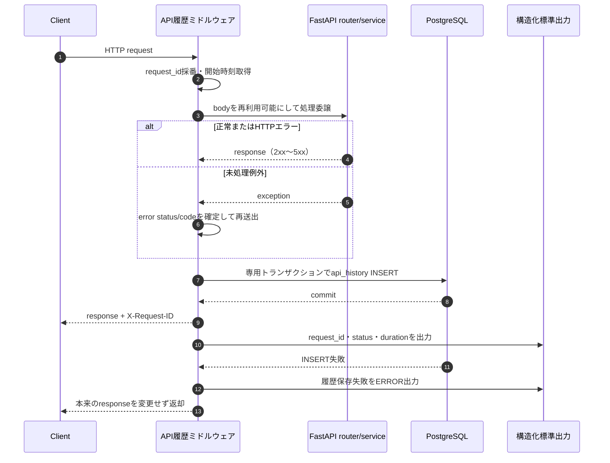
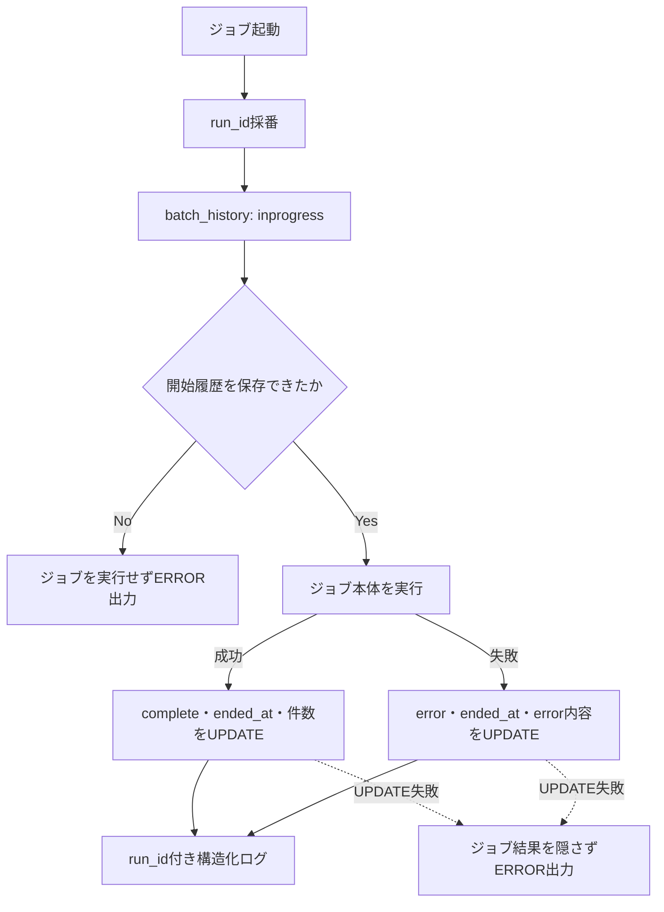
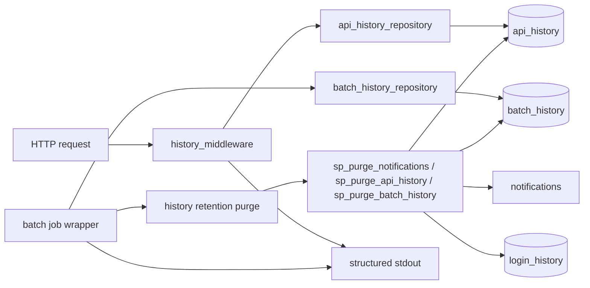
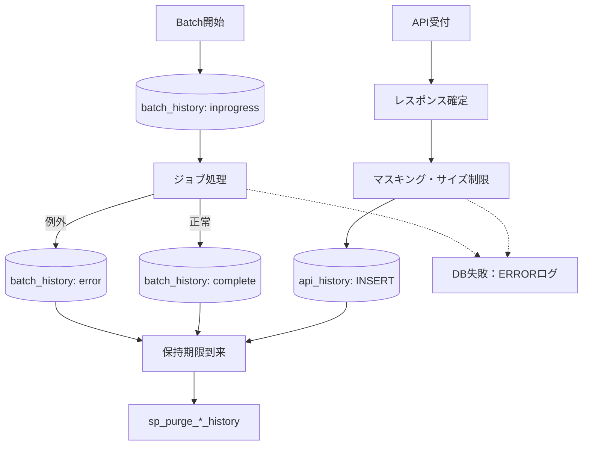

# ログ・履歴設計詳細

## 0. 関連ドキュメント

- [../../basic_design/00_overview.md](../../basic_design/00_overview.md)（ログ方針・データ全体像）
- [../../basic_design/01_database.md](../../basic_design/01_database.md)（`notifications`・`api_history`・`batch_history`）
- [../../basic_design/06_infra_cicd.md](../../basic_design/06_infra_cicd.md)（環境変数・運用）
- [../database/11_table_api_history.md](../database/11_table_api_history.md)
- [../database/12_table_batch_history.md](../database/12_table_batch_history.md)
- [../database/10_table_notifications.md](../database/10_table_notifications.md)
- [../batch/00_overview.md](../batch/00_overview.md)

## 1. 目的と記録対象

ログを「標準出力の構造化ログ」と「PostgreSQLの検索可能な履歴」に分ける。ここではbatchが保持期間を管理する通知・API・batchの3履歴を定義する。認証イベントは既存の `login_history` に保存し、別の保持方針とする。

| 履歴 | 記録対象 | 保持期間 | 主な用途 |
|------|----------|----------|----------|
| `api_history` | 全APIリクエスト（成功・エラー） | 30日 | API別の障害・遅延調査 |
| `batch_history` | 全batchジョブの開始・完了・失敗 | 30日 | 実行状況・件数・失敗確認 |
| `notifications` | 作成されたアプリ内通知（未読・既読） | 90日 | ユーザーへの通知表示 |
| `login_history` | ログイン試行 | 90日 | セキュリティ監査・不正調査 |

API履歴とbatch履歴は `API_HISTORY_RETENTION_DAYS` / `BATCH_HISTORY_RETENTION_DAYS`（既定30日）、通知は `NOTIFICATION_RETENTION_DAYS`（既定90日）、ログイン履歴は `LOGIN_HISTORY_RETENTION_DAYS`（既定90日）で管理する。

### 1.1 batchが管理する3履歴の契約台帳

| テーブル | Model | Repository | Procedure | batch設定 | 保持期間・削除対象 |
|----------|-------|------------|-----------|-----------|------------------|
| `notifications` | `api/app/models/notification.py :: Notification` / `batch/app/models/notification.py :: Notification` | `api/app/repository/notification_repository.py` / `batch/app/repository/notification_repository.py` | `sp_purge_notifications(p_retention_days)` | `NOTIFICATION_RETENTION_DAYS` | 既定90日。`notifications.created_at` が期限より前の行（未読・既読を問わない） |
| `api_history` | `api/app/models/api_history.py :: ApiHistory` | `api/app/repository/api_history_repository.py` | `sp_purge_api_history(p_retention_days)` | `API_HISTORY_RETENTION_DAYS` | 既定30日。`api_history.created_at` が期限より前の行 |
| `batch_history` | `batch/app/models/batch_history.py :: BatchHistory` | `batch/app/repository/batch_history_repository.py` | `sp_purge_batch_history(p_retention_days)` | `BATCH_HISTORY_RETENTION_DAYS` | 既定30日。`batch_history.started_at` が期限より前の行 |

`batch/app/repository/purge_repository.py` は上記3つのProcedureを呼び出す薄いアクセス層とする。Model・Repositoryの配置はコンテナ境界を越えて共有せず、テーブル名、Procedure名、保持設定名、削除基準列だけを一致させる。

## 2. API記録方式

`api/app/core/history_middleware.py`相当のHTTPミドルウェアを、認証ミドルウェアとルータの外側に登録する。受信時にミドルウェアが Python の `uuid.uuid4()`（UUID v4）で `request_id` を生成し、レスポンスの `X-Request-ID` と構造化ログ・DB履歴に同じ値を設定する。例：`550e8400-e29b-41d4-a716-446655440000`。

| タイミング | 処理 |
|------------|------|
| 受付時 | `request_id`、開始時刻、HTTPメソッド、ルート未解決時のraw pathを取得 |
| 処理中 | bodyを一度だけ読み取り、後続のFastAPI処理へ再利用可能な状態で渡す |
| 正常終了 | ルートテンプレート、HTTP status、user_id、durationを確定 |
| 例外終了 | exception handlerの最終status/error_codeを取得し、例外を再送出して既存の応答方針を維持 |
| finally | 専用セッションで`api_history`へINSERT。失敗してもレスポンスを変更しない |

対象は `/api` 配下のすべてのHTTPメソッドとする。クエリ文字列、Cookie、Authorizationヘッダは `api_history` に保存しない。パスは個別IDを除いたルートテンプレート（例：`/api/tasks/{task_id}`）で集計できる形にする。

## 3. body・エラー内容の安全対策

1. JSON bodyを再帰的に走査し、`password`、`password_confirmation`、`token`、`access_token`、`refresh_token`、`client_secret`、`code`、`state`、`csrf_token`を`[REDACTED]`へ置換する。
2. `Authorization`、Cookie、Set-Cookieはbodyとは別に保存しない。
3. JSON以外、multipart、ファイル、復号前後の認証情報はbodyをNULLにする。
4. bodyとerror_detailは設定した上限を超えた場合に切り詰めるかNULLにする。切り詰めでJSON構造を壊さないため、bodyは上限超過時NULLとする。
5. error_detailには利用者へ返す安全な詳細だけを保存し、stack traceは標準出力へ出す。`DATABASE_URL`、JWT鍵、SMTP資格情報等は常にマスキングする。

## 4. batch記録方式

各ジョブを `with_batch_history` 相当の共通ラッパーで包む。scheduler起動と `--run-once` の両方で、ジョブ本体より先に `batch_history`へ `inprogress` をINSERTする。ジョブの結果を集計し、正常時は `complete`、例外時は `error`へ更新する。

`due_notification`では `slot`（10/17）を設定し、`target_count`、`success_count`、`skipped_count`を保存する。Redisロック取得失敗によるスキップはジョブとしては正常完了とし、`skipped_count`または構造化ログで理由を残す。

## 5. 保持期間パージ

`batch`の各定期ジョブ終了処理で、同じDBトランザクションとは分離して通知・API・batchの3プロシージャを実行する。`login_history`のパージは既存方針どおり運用者が手動実行する。

| プロシージャ | 引数 | 対象 | 設定 |
|--------------|------|------|------|
| `sp_purge_api_history` | `p_retention_days INTEGER` | `api_history.created_at` | `API_HISTORY_RETENTION_DAYS`（既定30） |
| `sp_purge_batch_history` | `p_retention_days INTEGER` | `batch_history.started_at` | `BATCH_HISTORY_RETENTION_DAYS`（既定30） |
| `sp_purge_notifications` | `p_retention_days INTEGER` | `notifications.created_at` | `NOTIFICATION_RETENTION_DAYS`（既定90） |
| `sp_purge_login_history` | `p_retention_days INTEGER` | `login_history.created_at` | `LOGIN_HISTORY_RETENTION_DAYS`（既定90） |

パージ失敗は対象ジョブの通知処理失敗とは分けて記録する。ただし運用上、保持期限を超えたデータが残るためbatchの標準出力と `batch_history`のerror情報で確認できるようにする。大量データ時はロック時間を短くする分割削除への変更を要検討とする。

## 6. 関数・処理の相関図

## 7. テスト方針

| 区分 | 方針 |
|------|------|
| 単体 | bodyマスキング、サイズ上限、status/error変換、run_id相関、完了・失敗分岐をmockで検証 |
| 結合 | 実PostgreSQLでAPI履歴のINSERT、batch履歴の状態更新、制約、30日／90日のパージを検証 |
| API結合 | 代表的な2xx、4xx、5xxを呼び、各1行が保存されることを確認。全47 endpointを同一テストで網羅する必要はない |
| 障害 | 履歴INSERT/UPDATEのDBエラーを注入し、業務処理の応答・batchの本来の結果が変わらないことを確認 |

## 8. 不明点・要検討事項

- 履歴を検索する管理者向けAPI・画面は今回作成しない。
- 外部ログ集約基盤、アラート、ログの暗号化・改ざん検知は要件書のスコープ外であり、必要になった時点で別設計とする。
- `inprogress`の監視・補正を自動化する場合のタイムアウト値は要検討。

## 9. 全体の出入力

| 区分 | API履歴 | Batch履歴 | 標準出力ログ |
|------|---------|-----------|--------------|
| 入力 | request_id、HTTP結果、利用者・マスキング済みbody | run_id、ジョブ名、実行枠、件数・エラー | API／Batch処理の構造化イベント |
| 出力 | `api_history` へ1行 | `batch_history` へ開始1行・終了1行 | 障害調査用イベント |
| 責務 | APIレスポンスを変更せず追記 | ジョブの成否と件数を相関 | 秘密情報を含めず詳細を出力 |
| 例外 | INSERT失敗はERRORログ | INSERT/UPDATE失敗はジョブ結果を維持 | 出力先障害の扱いは運用基盤に委譲 |

## 10. データ遷移図

API履歴のINSERT、Batch履歴の開始・終了UPDATE、保持期間パージはそれぞれ専用のトランザクションで実行し、業務処理のトランザクションと混在させない。
