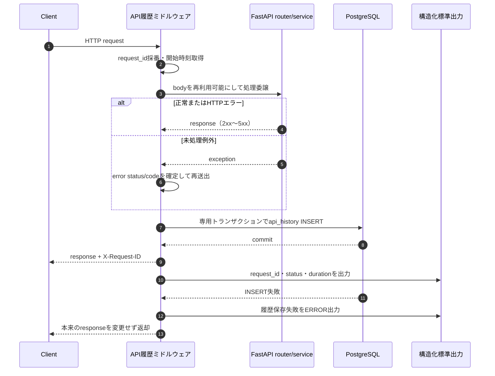
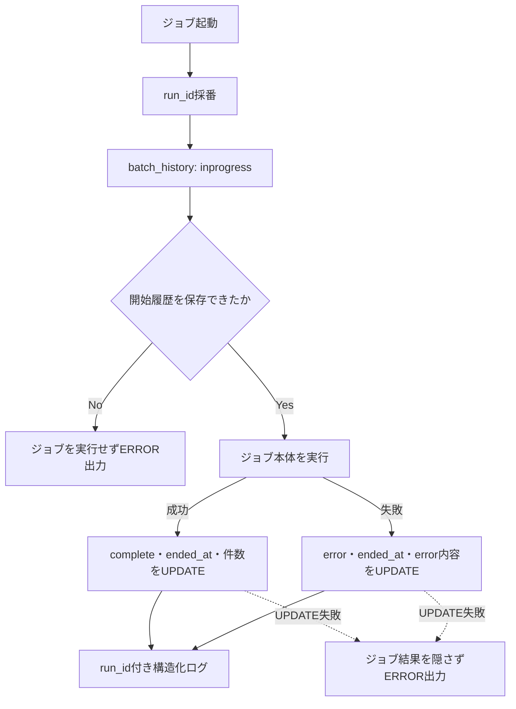
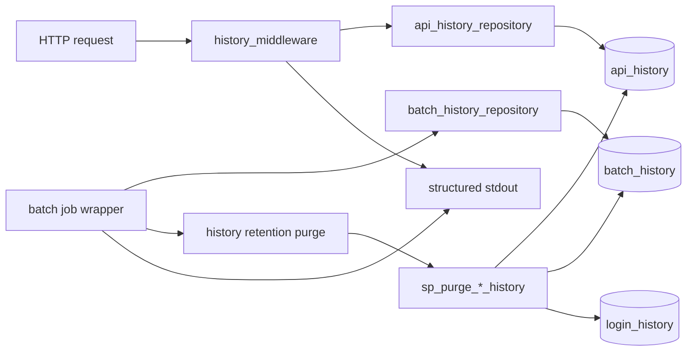

# ログ・履歴設計詳細

## 0. 関連ドキュメント

- [../../basic_design/00_overview.md](../../basic_design/00_overview.md)（ログ方針・データ全体像）
- [../../basic_design/01_database.md](../../basic_design/01_database.md)（`api_history`・`batch_history`）
- [../../basic_design/06_infra_cicd.md](../../basic_design/06_infra_cicd.md)（環境変数・運用）
- [../database/11_table_api_history.md](../database/11_table_api_history.md)
- [../database/12_table_batch_history.md](../database/12_table_batch_history.md)
- [../batch/00_overview.md](../batch/00_overview.md)

## 1. 目的と記録対象

ログを「標準出力の構造化ログ」と「PostgreSQLの検索可能な履歴」に分ける。標準出力は直近の詳細な障害調査、履歴テーブルは30日以内のAPI・batch実行の検索と結果確認に使用する。認証イベントは既存の `login_history` に保存する。

| 履歴 | 記録対象 | 保持期間 | 主な用途 |
|------|----------|----------|----------|
| `api_history` | 全APIリクエスト（成功・エラー） | 30日 | API別の障害・遅延調査 |
| `batch_history` | 全batchジョブの開始・完了・失敗 | 30日 | 実行状況・件数・失敗確認 |
| `login_history` | ログイン試行 | 90日 | セキュリティ監査・不正調査 |

API履歴とbatch履歴はデータ量が大きくなりやすいため30日、ログイン履歴は不正調査の確認期間を確保するため90日とする。保持期限は環境変数で変更できるが、既定値は上表から変更しない。

## 2. API記録方式

`api/app/core/history_middleware.py`相当のHTTPミドルウェアを、認証ミドルウェアとルータの外側に登録する。受信時にサーバー生成の `request_id` を採番し、レスポンスの `X-Request-ID` と構造化ログ・DB履歴に同じ値を設定する。

| タイミング | 処理 |
|------------|------|
| 受付時 | `request_id`、開始時刻、HTTPメソッド、ルート未解決時のraw pathを取得 |
| 処理中 | bodyを一度だけ読み取り、後続のFastAPI処理へ再利用可能な状態で渡す |
| 正常終了 | ルートテンプレート、HTTP status、user_id、durationを確定 |
| 例外終了 | exception handlerの最終status/error_codeを取得し、例外を再送出して既存の応答方針を維持 |
| finally | 専用セッションで`api_history`へINSERT。失敗してもレスポンスを変更しない |

対象は `/api` 配下のすべてのHTTPメソッドとする。クエリ文字列、Cookie、Authorizationヘッダは `api_history` に保存しない。パスは個別IDを除いたルートテンプレート（例：`/api/tasks/{task_id}`）で集計できる形にする。

## 3. body・エラー内容の安全対策

1. JSON bodyを再帰的に走査し、`password`、`password_confirmation`、`token`、`access_token`、`refresh_token`、`client_secret`、`code`、`state`、`csrf_token`を`[REDACTED]`へ置換する。
2. `Authorization`、Cookie、Set-Cookieはbodyとは別に保存しない。
3. JSON以外、multipart、ファイル、復号前後の認証情報はbodyをNULLにする。
4. bodyとerror_detailは設定した上限を超えた場合に切り詰めるかNULLにする。切り詰めでJSON構造を壊さないため、bodyは上限超過時NULLとする。
5. error_detailには利用者へ返す安全な詳細だけを保存し、stack traceは標準出力へ出す。`DATABASE_URL`、JWT鍵、SMTP資格情報等は常にマスキングする。

### 3.1 Issue #8の監査イベント

認証・セキュリティ上の判断は構造化標準出力へ監査イベントとして記録する。`login_history`はログイン試行の正規履歴、`api_history`は全APIの正規履歴であり、次のイベントを両者の`request_id`で突合できるようにする。

| event | 記録項目 | 失敗時の扱い |
|-------|----------|--------------|
| `rate_limit_rejected` | route、scope、limit、window、client_ip、request_id | APIは429。Redis障害なら503 |
| `login_history_write_failed` | user_id（NULL可）、login_method、client_ip、request_id | ログインを成立させず、作成済みRedis状態を補償削除 |
| `auth_state_revoke_failed` | user_id、operation、deleted_session_count、deleted_refresh_count、request_id | DB更新を行わず503。Redis復旧後に同じ操作を再実行 |
| `force_logout` | actor_user_id、target_user_id、mode、access_token_revocation_delay_seconds、request_id | 成功時INFO。JWTの遅延上限は`ACCESS_TOKEN_TTL_SECONDS` |

監査IPは `TRUSTED_PROXY_CIDRS` で確定した `client_ip` とし、`proxy_peer_ip`、`ip_source`（`direct` / `trusted_xff`）も記録する。パスワード、トークン、Cookie、Authorization値、未ハッシュの識別子は記録しない。

## 4. batch記録方式

各ジョブを `with_batch_history` 相当の共通ラッパーで包む。scheduler起動と `--run-once` の両方で、ジョブ本体より先に `batch_history`へ `inprogress` をINSERTする。ジョブの結果を集計し、正常時は `complete`、例外時は `error`へ更新する。

`due_notification`では `slot`（10/17）を設定し、`target_count`、`success_count`、`skipped_count`を保存する。Redisロック取得失敗によるスキップはジョブとしては正常完了とし、`skipped_count`または構造化ログで理由を残す。

## 5. 保持期間パージ

`batch`の各定期ジョブ終了処理で、同じDBトランザクションとは分離してAPI・batch・通知の保持期間プロシージャを実行する。`login_history`のパージは既存方針どおり運用者が手動実行する。

| プロシージャ | 引数 | 対象 | 設定 |
|--------------|------|------|------|
| `sp_purge_api_history` | `p_retention_days INTEGER` | `api_history.created_at` | `API_HISTORY_RETENTION_DAYS`（既定30） |
| `sp_purge_batch_history` | `p_retention_days INTEGER` | `batch_history.started_at` | `BATCH_HISTORY_RETENTION_DAYS`（既定30） |
| `sp_purge_login_history` | `p_retention_days INTEGER` | `login_history.created_at` | `LOGIN_HISTORY_RETENTION_DAYS`（既定90） |

パージ失敗は対象ジョブの通知処理失敗とは分けて記録する。ただし運用上、保持期限を超えたデータが残るためbatchの標準出力と `batch_history`のerror情報で確認できるようにする。大量データ時はロック時間を短くする分割削除への変更を要検討とする。

## 6. 関数・処理の相関図

## 7. テスト方針

| 区分 | 方針 |
|------|------|
| 単体 | bodyマスキング、サイズ上限、status/error変換、run_id相関、完了・失敗分岐をmockで検証 |
| 結合 | 実PostgreSQLでAPI履歴のINSERT、batch履歴の状態更新、制約、30日／90日のパージを検証 |
| API結合 | 代表的な2xx、4xx、5xxを呼び、各1行が保存されることを確認。全47 endpointを同一テストで網羅する必要はない |
| 障害 | 履歴INSERT/UPDATEのDBエラーを注入し、業務処理の応答・batchの本来の結果が変わらないことを確認 |

## 8. 不明点・要検討事項

- 履歴を検索する管理者向けAPI・画面は今回作成しない。
- 外部ログ集約基盤、アラート、ログの暗号化・改ざん検知は要件書のスコープ外であり、必要になった時点で別設計とする。
- `inprogress`の監視・補正を自動化する場合のタイムアウト値は要検討。
