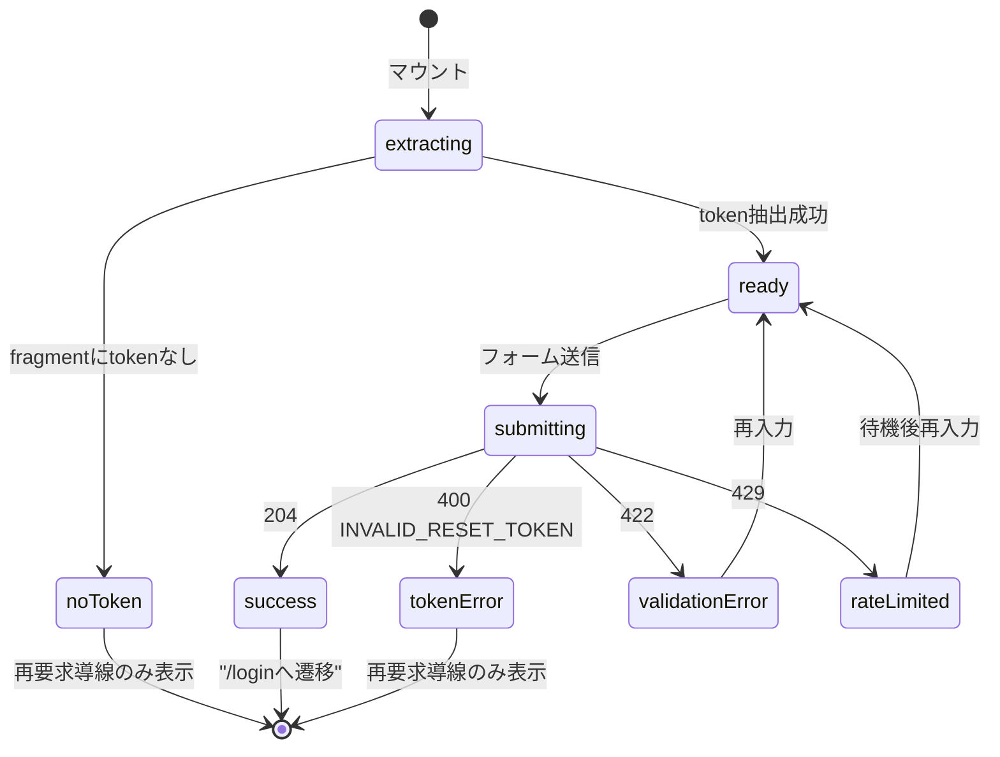
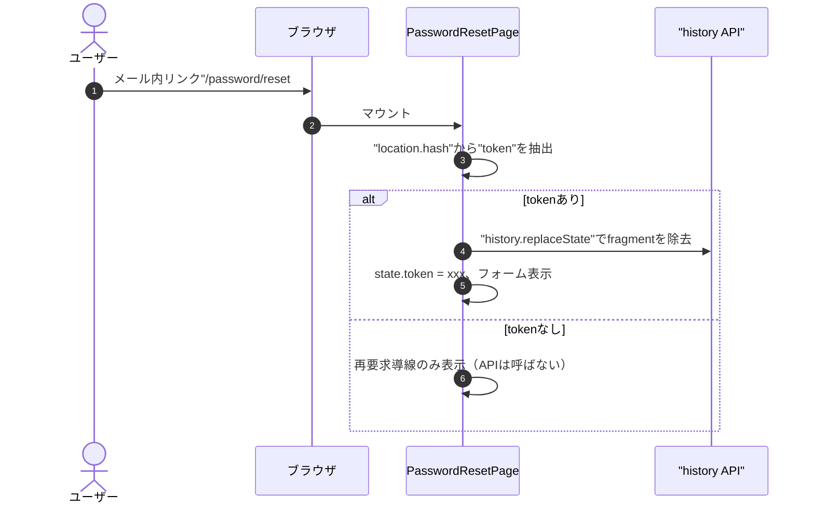
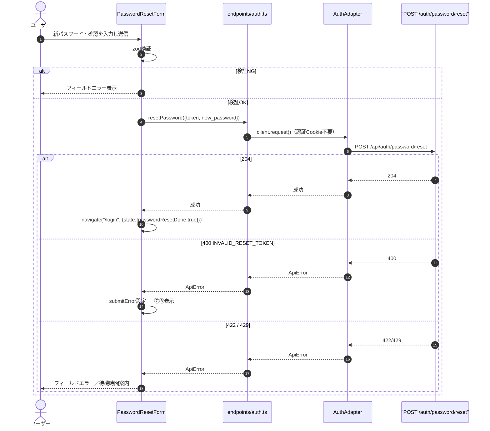
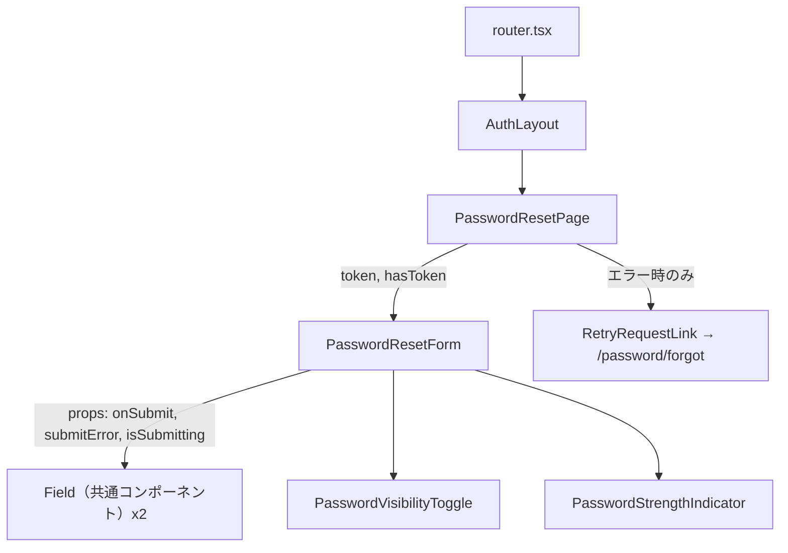
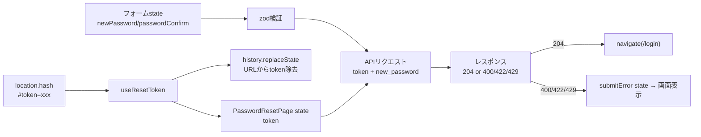

# パスワード再設定画面詳細設計（`/password/reset#token=`）

## 0. 関連ドキュメント

| ドキュメント | 内容 |
|---|---|
| [../../basic_design/05_frontend.md](../../basic_design/05_frontend.md) | §2 画面一覧、§6 APIクライアント層、§7.3 メール認証（fragment設計の類例） |
| [../../basic_design/04_api.md](../../basic_design/04_api.md) | §3.1 認証スキーマ、§4 エラー設計 |
| [../../basic_design/03_auth.md](../../basic_design/03_auth.md) | §7 パスワードリセット、§7.2 メール送信設計 |
| [../api/auth/10_post_auth_password_reset.md](../api/auth/10_post_auth_password_reset.md) | 使用API：POST /api/auth/password/reset |
| [./03_password_forgot.md](./03_password_forgot.md) | 再要求導線の遷移元／遷移先 |
| [./01_login.md](./01_login.md) | 成功後の遷移先 |

## 1. 概要

| 項目 | 内容 |
|------|------|
| 画面名 / パス | パスワード再設定画面 / `/password/reset#token=xxx` |
| レイアウト | AuthLayout |
| ガード | 公開（認証不要）。ただし認証済みユーザーがアクセスした場合もガードでは弾かず、通常どおりリセットフォームを表示する（要検討：認証済みユーザーの扱いは基本設計に明記がないため「不明」とし、実装時は既存セッションを維持したまま処理する前提とする） |
| 対応要件 | 要件書§2記載なし（`basic_design/05_frontend.md` §2 No.4） |
| 主なユースケース | メール内リンクからの到達→ 新パスワード入力→再設定→ログイン画面へ |
| 実装ファイル | `frontend/src/features/auth/PasswordResetPage.tsx`、`frontend/src/features/auth/PasswordResetForm.tsx` |

`basic_design/03_auth.md` §7.2 のメール本文URLは `{FRONTEND_BASE_URL}/password/reset#token=...` である。fragment（`#`以降）はブラウザからサーバーへ送信されず、アクセスログやReferer・プロキシログにも残らないため、トークンの露出経路を減らす目的でquery stringではなくfragmentを採用している。本画面はこの設計をクライアント側で正しく扱う責務を持つ。

## 2. 画面レイアウト

```
┌──────────────────────────────────────┐
│                Cerberus               │  ← ①ロゴ／ヘッダー
│                                        │
│         新しいパスワードを設定         │  ← ②タイトル
│                                        │
│  新しいパスワード      [__________] 👁 │  ← ③パスワード入力
│  新しいパスワード（確認）[________] 👁 │  ← ④パスワード確認入力
│  ・8文字以上                          │  ← ⑤強度インジケータ／規則説明
│  ・大文字/小文字/数字/記号のうち2種類  │
│                                        │
│         [ 再設定する ]                │  ← ⑥送信ボタン
│                                        │
│  （エラー時）リンクの有効期限が切れて  │  ← ⑦エラーメッセージ
│  いるか、既に使用済みです              │
│  → [ もう一度リセットを申請する ]      │  ← ⑧再要求導線（/password/forgotへ）
└──────────────────────────────────────┘
```

- token欠落時：③〜⑥のフォームは表示せず、⑦相当のメッセージ「リンクが不正です」と⑧のみを表示する。
- レスポンシブ：モバイル幅では①〜⑧を縦積みのまま維持し、フォーム幅を `min-width` ではなく `100%` に広げる（固定px幅を使わない方針は `basic_design/05_frontend.md` §8 に準拠）。

## 3. UI要素仕様

| No | 要素 | 種別 | 初期値 | 入力制約 | 活性条件 | イベント／遷移 |
|----|------|------|--------|----------|----------|----------------|
| ① | ロゴ | 静的表示 | - | - | 常時 | クリックなし |
| ② | タイトル | 静的表示 | "新しいパスワードを設定" | - | 常時 | - |
| ③ | 新しいパスワード | password input | "" | 8文字以上、大文字/小文字/数字/記号のうち2種類以上（`basic_design/04_api.md` §3.1 registerと同一規則） | tokenが存在する場合のみ表示 | 目のアイコンで表示切替、入力毎にzod検証 |
| ④ | パスワード確認 | password input | "" | ③と一致 | 同上 | 同上 |
| ⑤ | 強度インジケータ | 静的表示 | - | - | ③入力中 | zod検証結果に応じ表示更新 |
| ⑥ | 再設定するボタン | button submit | disabled | - | ③④が有効かつ送信中でない | クリック／Enterで送信 |
| ⑦ | エラーメッセージ | 静的表示 | 非表示 | - | 400応答時のみ表示 | - |
| ⑧ | 再要求導線 | link | - | - | ⑦表示時のみ | `/password/forgot` へ遷移 |

## 4. 使用API

| No | 呼び出しタイミング | メソッド／パス | 送信内容 | 成功時処理 | 失敗時処理 | queryKey / mutationKey |
|----|---------------------|-----------------|----------|------------|------------|--------------------------|
| 1 | ⑥ボタン押下（フォーム送信） | `POST /api/auth/password/reset` | `{ token, new_password, password_confirm }`（`password_confirm` はクライアント側一致検証のみに使い、APIへは送らない。実際の送信フィールドはAPI側スキーマ [10_post_auth_password_reset.md](../api/auth/10_post_auth_password_reset.md) を正とする） | 204 → トースト「パスワードを再設定しました」→ `/login` へ `navigate` | 400 `INVALID_RESET_TOKEN` → ⑦⑧を表示。422 → フィールドエラー表示。429 `TOO_MANY_ATTEMPTS` → `Retry-After`に基づく待機時間案内。503 → 再試行案内 | `mutationKey: ['auth', 'passwordReset']` |

## 5. 状態管理

| 区分 | 名称 | 型 | 初期値 | 更新契機 | 永続化 |
|------|------|-----|--------|----------|--------|
| ローカルstate | `token` | `string \| null` | マウント時に `location.hash` から抽出 | マウント時1回のみ | しない（refで保持、再レンダーの起点にはしない） |
| ローカルstate（RHF） | `newPassword` / `passwordConfirm` | `string` | "" | 入力毎 | しない |
| ローカルstate | `submitError` | `ApiError \| null` | null | mutation失敗時 | しない |
| TanStack Query | なし（mutationのみ、queryなし） | - | - | - | しない |
| authStore | 参照なし | - | - | - | - |

## 6. 画面状態遷移図



## 7. 処理シーケンス

### 7.1 画面到達〜token抽出



`history.replaceState` は画面遷移を伴わずURLのみを書き換えるため、ブラウザ履歴を汚さない。これにより、ユーザーが「戻る」操作をしてもトークン付きURLへは戻らず、リロード時の誤送信も防げる。

### 7.2 パスワード再設定送信



## 8. コンポーネント構成・相関図



## 9. 関数・カスタムフック詳細

### 9.1 `PasswordResetPage.tsx :: useResetToken`

| 項目 | 内容 |
|------|------|
| シグネチャ | `function useResetToken(): { token: string \| null; ready: boolean }` |
| 引数 | なし |
| 戻り値 | `token`：抽出済みトークン（無ければ`null`）／`ready`：抽出処理完了フラグ |
| 処理内容 | 1. `useRef` で初回実行済みフラグを保持し、`useEffect` 内で二重実行を抑止する<br>2. `window.location.hash` を `URLSearchParams` 相当のパーサーでパースし `token` を取り出す<br>3. tokenが取得できた場合は `window.history.replaceState(null, "", window.location.pathname + window.location.search)` を実行してfragmentを除去する<br>4. `token` state と `ready=true` を設定する |
| 副作用 | `history.replaceState`（画面遷移なし） |

### 9.2 `PasswordResetForm.tsx :: onSubmit`

| 項目 | 内容 |
|------|------|
| シグネチャ | `async function onSubmit(values: PasswordResetFormValues, token: string): Promise<void>` |
| 引数 | `values`（`newPassword`, `passwordConfirm`）、`token`（親から渡される） |
| 戻り値 | `void`（成功時は `navigate` を呼ぶため呼び出し元に戻り値は不要） |
| 処理内容 | 1. zodスキーマで最終検証（RHFの`onSubmit`時点）<br>2. `resetPasswordMutation.mutateAsync({ token, new_password: values.newPassword })` を呼ぶ<br>3. 成功時：`navigate("/login", { state: { passwordResetDone: true } })`<br>4. 失敗時：`ApiError.code` に応じて `submitError` stateを更新 |
| 副作用 | API呼び出し、画面遷移 |

## 10. バリデーション

| フィールド | zodスキーマ | 規則 | エラーメッセージ | バックエンド対応 |
|------------|--------------|------|--------------------|--------------------|
| `newPassword` | `passwordResetSchema.newPassword` | 8文字以上、大文字/小文字/数字/記号のうち2種類以上 | "8文字以上で、2種類以上の文字種を含めてください" | pydantic `RegisterRequest.password` と同一規則（`basic_design/04_api.md` §3.1） |
| `passwordConfirm` | `passwordResetSchema.passwordConfirm` | `newPassword` と一致 | "パスワードが一致しません" | サーバー側は `new_password` のみ受け取り確認フィールドは持たない想定（要検討：APIリクエストスキーマに`password_confirm`が含まれるか [10_post_auth_password_reset.md](../api/auth/10_post_auth_password_reset.md) 側で確定させる） |

## 11. エラーハンドリング

| APIエラーコード / HTTP | 画面表示 | 遷移 | 再試行導線 |
|---|---|---|---|
| `400 INVALID_RESET_TOKEN` | "リンクの有効期限が切れているか、既に使用済みです" | 画面内に留まる | 「もう一度リセットを申請する」→ `/password/forgot` |
| `422 VALIDATION_ERROR` | フィールド単位のエラー | 画面内に留まる | 再入力して送信 |
| `429 TOO_MANY_ATTEMPTS` | 待機時間の案内 | 画面内に留まる | 待機後に再送信 |
| `503 SERVICE_UNAVAILABLE` | サービス一時停止の案内 | 入力値を保持して画面内に留まる | 復旧後に再送信 |
| token欠落（クライアント側判定） | "リンクが不正です" | 画面内に留まる（APIは呼ばない） | 「もう一度リセットを申請する」→ `/password/forgot` |
| その他4xx/5xx | 共通トースト表示 | 画面内に留まる | 再送信ボタンで再試行可 |

## 12. データ遷移図



## 13. アクセシビリティ・表示設定

| 項目 | 内容 |
|------|------|
| 文字サイズ | `--font-scale` に追従する `rem` 指定。固定px幅コンテナを使わない |
| キーボード操作 | Tabで③④⑥へ順次フォーカス、Enterで送信 |
| `aria-*` | ③④に `aria-invalid`（エラー時true）、`aria-describedby` でエラーメッセージと関連付け。⑦のエラーブロックは `role="alert"` |
| フォーカス管理 | 送信エラー発生時に⑦（エラーメッセージ）へ `aria-live="polite"` で通知。token欠落時は⑧のリンクへ初期フォーカス |

## 14. テスト設計

| No | 区分 | ケース | 前提（MSWのモック応答等） | 期待結果 | テスト名案 |
|----|------|--------|---------------------------|----------|------------|
| 1 | 単体 | `useResetToken`：fragmentにtokenあり | `location.hash="#token=abc"` | token抽出、`replaceState`呼び出し | `extracts token from hash and clears it` |
| 2 | 単体 | `useResetToken`：StrictMode二重マウント | `React.StrictMode`相当で2回マウント | `replaceState`は1回のみ呼ばれる | `does not duplicate history replace under double mount` |
| 3 | 単体 | zodスキーマ：パスワード不一致 | - | エラー | `rejects when confirm mismatches` |
| 4 | コンポーネント | フォーム送信成功 | MSW: `POST /auth/password/reset` → 204 | `/login` へ`navigate`呼び出し | `navigates to login on success` |
| 5 | コンポーネント | 400応答 | MSW: 400 `INVALID_RESET_TOKEN` | エラーメッセージ＋再要求導線表示 | `shows retry link on invalid token` |
| 6 | コンポーネント | token欠落時の初期表示 | `location.hash=""` | フォーム非表示、再要求導線のみ | `renders retry link only when token missing` |
| 7 | 結合 | 429応答 | MSW: 429 | 待機時間案内表示 | `shows rate limit message` |
| 網羅できない範囲 | - | 実際のメールクライアントでのリンク遷移・URLエンコーディング差異 | - | - | 手動確認とする（`basic_design/03_auth.md` の方針に準拠） |

## 15. 不明点・要検討事項

| 区分 | 内容 | 影響 |
|------|------|------|
| 要検討 | `POST /auth/password/reset` のリクエストボディに `password_confirm` を含めるか（`basic_design/04_api.md` にリクエストスキーマの明記なし） | API側詳細設計（[10_post_auth_password_reset.md](../api/auth/10_post_auth_password_reset.md)）との整合を要確認 |
| 不明 | 認証済みユーザーが本画面へ到達した場合の挙動（ガード対象外だが、既存セッション/トークンをどう扱うか） | 実装時の分岐に影響する可能性 |
