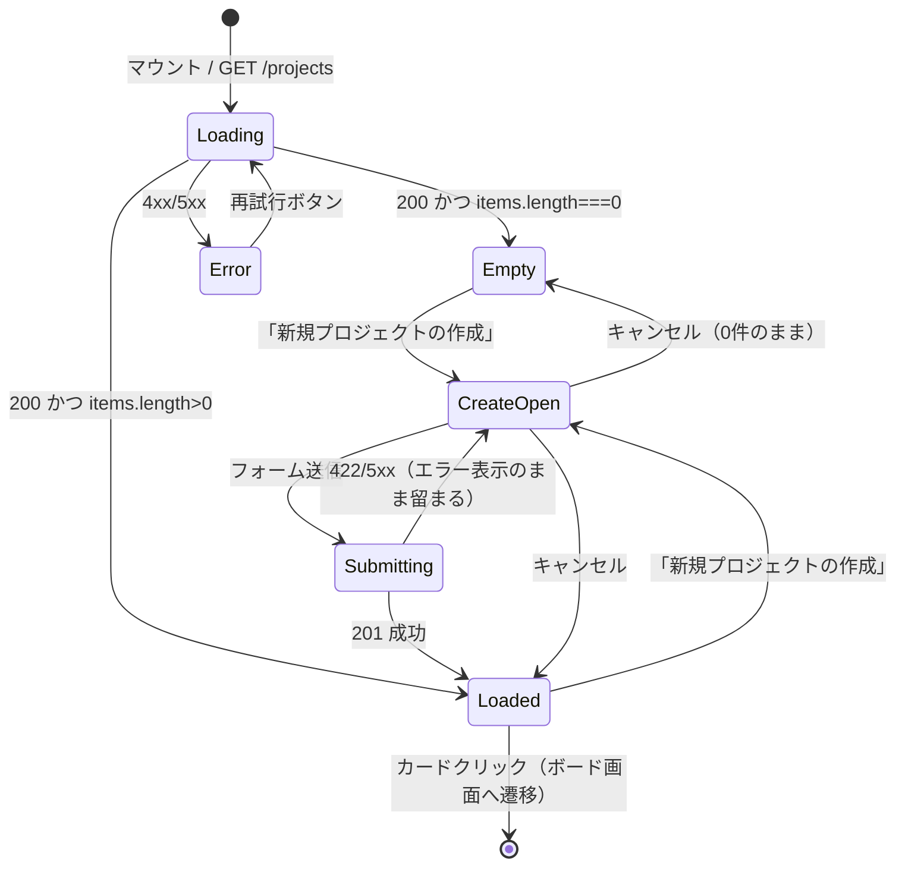
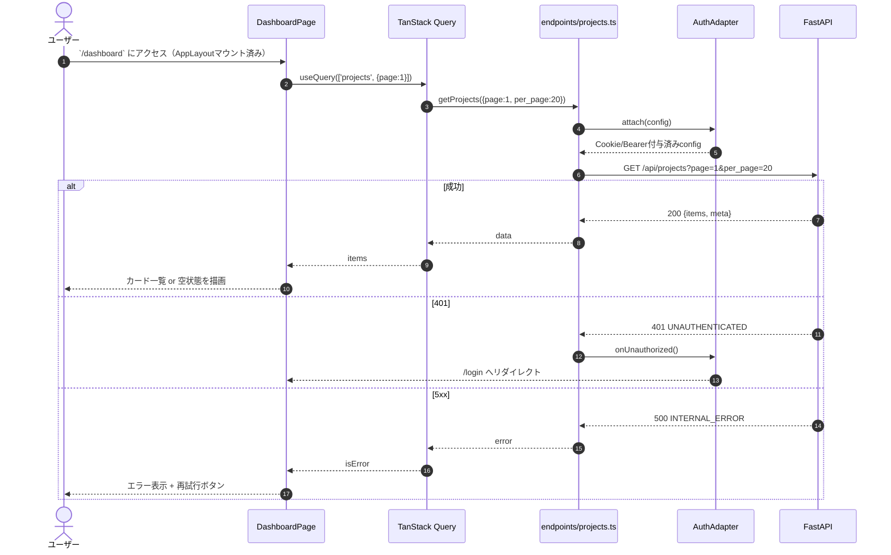
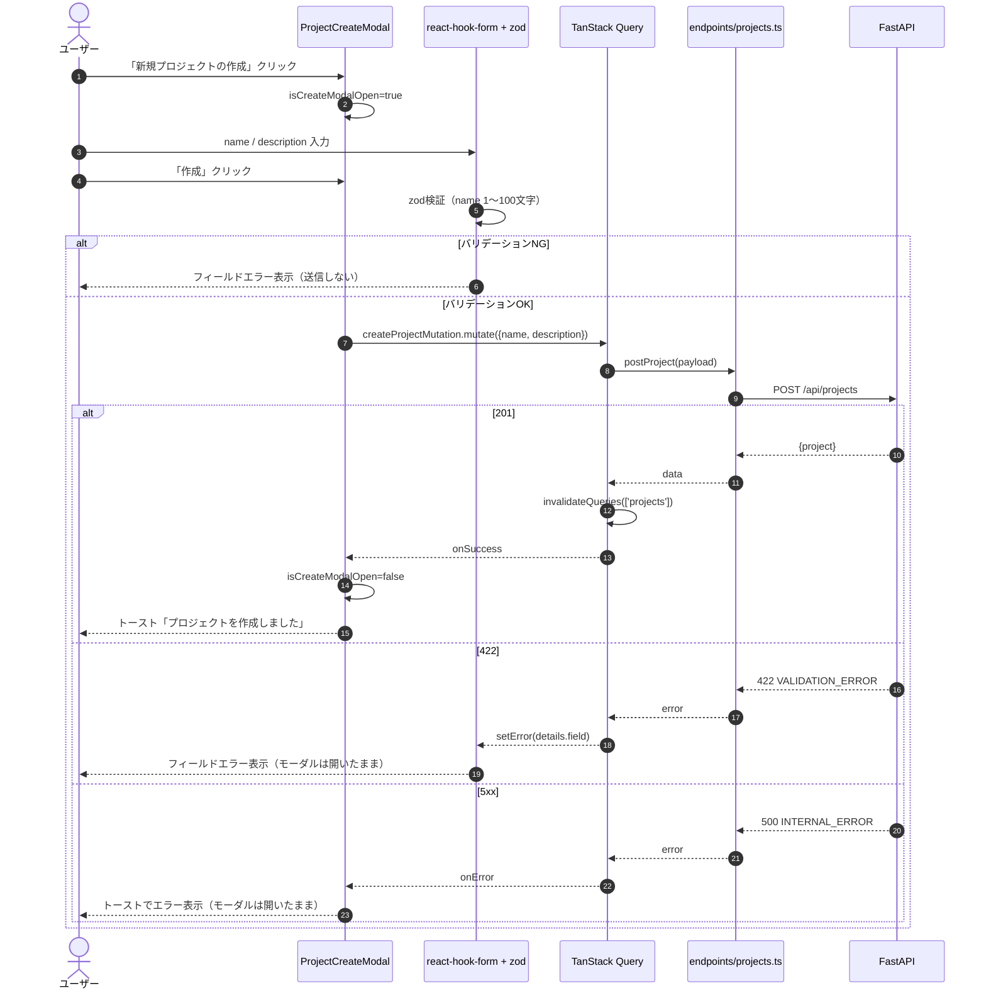
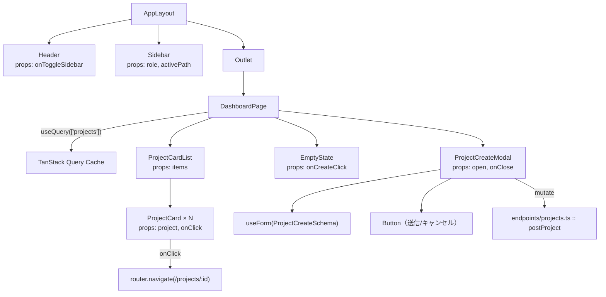
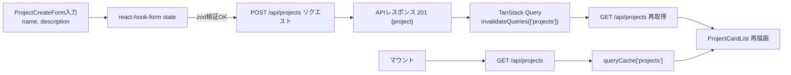

# ダッシュボード詳細設計（`/dashboard`）

## 0. 関連ドキュメント

| ドキュメント | 内容 |
|--------------|------|
| [../../basic_design/05_frontend.md](../../basic_design/05_frontend.md) | §3 共通レイアウト、§3.1 通知ベル・通知パネル、§5 状態管理、§7.4 ダッシュボード仕様、§7.8 通知 |
| [../../basic_design/04_api.md](../../basic_design/04_api.md) | §2.3 プロジェクトAPI、§2.6 通知API、§3.2 `GET /projects` レスポンス、§3.3 通知スキーマ |
| [../api/projects/01_get_projects.md](../api/projects/01_get_projects.md) | `GET /api/projects` 詳細設計 |
| [../api/projects/02_post_projects.md](../api/projects/02_post_projects.md) | `POST /api/projects` 詳細設計 |
| [../api/notifications/01_get_notifications.md](../api/notifications/01_get_notifications.md) | `GET /api/notifications` 詳細設計（別担当作成中。パスは確定） |
| [../api/notifications/02_get_notifications_unread_count.md](../api/notifications/02_get_notifications_unread_count.md) | `GET /api/notifications/unread-count` 詳細設計（別担当作成中。パスは確定） |
| [../api/notifications/03_patch_notification_read.md](../api/notifications/03_patch_notification_read.md) | `PATCH /api/notifications/{id}/read` 詳細設計（別担当作成中。パスは確定） |
| [../api/notifications/04_post_notifications_read_all.md](../api/notifications/04_post_notifications_read_all.md) | `POST /api/notifications/read-all` 詳細設計（別担当作成中。パスは確定） |
| [./07_project_board.md](./07_project_board.md) | カード選択後の遷移先。通知行クリック時の遷移先でもある |

## 1. 概要

| 項目 | 内容 |
|------|------|
| 画面名 / パス | ダッシュボード `/dashboard`（`/` は `/login` へのリダイレクト専用パス。[05_frontend.md 2.1](../../basic_design/05_frontend.md#21-ルートパス--の扱い)） |
| レイアウト | AppLayout（左サイドバー + ヘッダー。詳細は本書§2、共通仕様は [05_frontend.md §3](../../basic_design/05_frontend.md#3-共通レイアウト)） |
| ガード | 認証必須（`RequireAuth`）。未認証は `/login` へリダイレクト |
| 対応要件 | 要件書§2-3 |
| 主なユースケース | 自分が所属するプロジェクトを一覧し、カードから `/projects/:projectId` へ遷移する。新規プロジェクトを作成する |
| 実装ファイル | `frontend/src/features/projects/DashboardPage.tsx`、`frontend/src/features/projects/components/ProjectCardList.tsx`、`frontend/src/features/projects/components/ProjectCreateModal.tsx` |

## 2. 画面レイアウト

```
┌────────────────────────────────────────────────────────────┐
│①≡│                  Cerberus                              │ ← Header
├──┴────────────────────────────────────────────────────────┤
│┌────────┐ ┌──────────────────────────────────────────────┐│
││②Sidebar│ │③見出し「プロジェクト」    ④[+ 新規プロジェクト]││
││ home   │ │┌────────┐┌────────┐┌────────┐               ││
││ 管理(*)│ ││⑤Card   ││ Card   ││ Card   │  …グリッド配置 ││
││ 設定   │ ││ 名称    ││        ││        │               ││
││        │ ││⑥人数   ││        ││        │               ││
││ログアウト││⑦todo/ip/││        ││        │               ││
││        │ ││  done   ││        ││        │               ││
││        │ │└────────┘└────────┘└────────┘               ││
││        │ │⑧空状態（0件時）：カード領域の代わりに          ││
││        │ │  「まだプロジェクトがありません」+ 作成導線    ││
│└────────┘ └──────────────────────────────────────────────┘│
└────────────────────────────────────────────────────────────┘
```

- ①ハンバーガー：サイドバー開閉（`uiStore.sidebarOpen`、localStorage永続）
- ②Sidebar：`home` / `管理`（`role==='admin'` のみ描画） / `設定` / `ログアウト`。共通仕様は [05_frontend.md §3](../../basic_design/05_frontend.md#3-共通レイアウト)
- ③④ヘッダー行：見出しと新規作成ボタン
- ⑤カード：プロジェクト名、説明の先頭、オーナー表示名
- ⑥メンバー数バッジ、⑦ステータス別タスク件数バッジ（todo/in_progress/done）
- ⑧空状態：`items.length === 0` のとき表示

レスポンシブ：カードグリッドは `grid-template-columns: repeat(auto-fill, minmax(16rem, 1fr))` とし、幅に応じて列数が自動で変わる。狭幅ではサイドバーは既定で閉じ、ハンバーガーで開閉する（開閉判定は `uiStore` の値をそのまま使い、画面幅による自動制御は行わない。要検討：初期表示時のブレークポイント別デフォルト値は基本設計に定めがなく未定義）。

## 3. UI要素仕様

| No | 要素 | 種別 | 初期値 | 入力制約 | 活性条件 | イベント／遷移 |
|----|------|------|--------|----------|----------|----------------|
| ① | ハンバーガー | button | `uiStore.sidebarOpen` | - | 常時 | クリックで `uiStore.toggleSidebar()` |
| ② | Sidebar項目 | nav link | - | - | 「管理」は `role==='admin'` のみ表示 | クリックで各パスへ`navigate` |
| ③ | 見出し | text | 「プロジェクト」固定 | - | - | - |
| ④ | 新規プロジェクトボタン | button | - | - | 常時活性 | クリックで `ProjectCreateModal` を開く（`isCreateModalOpen=true`） |
| ⑤ | ProjectCard | card (button相当) | `useProjects()` の1件 | - | 常時活性 | クリックで `navigate('/projects/' + id)` |
| ⑥ | メンバー数バッジ | badge | `member_count` | - | - | - |
| ⑦ | タスク件数バッジ | badge×3 | `task_counts.{todo,in_progress,done}` | - | - | - |
| ⑧ | 空状態メッセージ | text + button | - | - | `items.length===0` の時のみ表示 | 「作成する」ボタンは④と同じモーダルを開く |
| ⑨ | ProjectCreateModal / name | text input | `""` | 1〜100文字必須（[04_api.md §3.2](../../basic_design/04_api.md#32-プロジェクトタスク)） | - | 入力毎に `react-hook-form` へ反映 |
| ⑩ | ProjectCreateModal / description | textarea | `""` | 任意、上限は要検討（基本設計に文字数上限の記載なし） | - | 入力毎に反映 |
| ⑪ | ProjectCreateModal / 作成ボタン | button | - | - | `isValid && !isSubmitting` | クリックで `createProjectMutation.mutate()` |
| ⑫ | ProjectCreateModal / キャンセル | button | - | - | 常時 | モーダルを閉じ `reset()` |

## 4. 使用API

| No | 呼び出しタイミング | メソッド／パス | 送信内容 | 成功時処理 | 失敗時処理 | queryKey / mutationKey |
|----|--------------------|-----------------|----------|------------|------------|--------------------------|
| 1 | マウント時 | `GET /api/projects?page=1&per_page=20` | クエリのみ | `items` をカード描画、`meta` は現状ページングUIなし（要検討：一覧が21件以上になった場合のページング導線は基本設計に未記載） | 401はAuthAdapterが処理、その他はエラー表示領域にリトライボタン | `queryKey: ['projects', { page }]` |
| 2 | 「新規プロジェクトの作成」送信 | `POST /api/projects` | `{ name, description }` | `201` → モーダルを閉じ `invalidateQueries(['projects'])` → 作成された `projects.name` をトーストで通知 | 422はフィールドエラー表示、それ以外はトーストでエラー表示 | `mutationKey: ['createProject']` |

## 5. 状態管理

| 区分 | 名称 | 型 | 初期値 | 更新契機 | 永続化 |
|------|------|----|--------|----------|--------|
| ローカルstate | `isCreateModalOpen` | `boolean` | `false` | ④⑧クリックで`true`、作成成功/キャンセルで`false` | なし |
| React Hook Form | `ProjectCreateForm`（`name`, `description`） | `zod` スキーマ由来 | `{name:'', description:''}` | 入力・送信・リセット | なし |
| Zustand（`uiStore`） | `sidebarOpen`, `fontScale` | `boolean` / `number` | localStorage復元値、無ければ `true` / `1.0` | ①操作、設定画面での変更 | localStorage |
| Zustand（`authStore`） | `user.role` | `'member'\|'admin'` | `/auth/me` 由来 | ログイン/ログアウト | メモリのみ |
| TanStack Query | `['projects', {page}]` | `Page<ProjectSummary>` | 未取得 | マウント時fetch、`createProject`成功時に`invalidate` | しない（[05_frontend.md §5](../../basic_design/05_frontend.md#5-状態管理)） |

## 6. 画面状態遷移図



## 7. 処理シーケンス

### 7.1 初期表示



### 7.2 新規プロジェクト作成



## 8. コンポーネント構成・相関図



## 9. 関数・カスタムフック詳細

### 9.1 `features/projects/hooks/useProjects.ts :: useProjects`

| 項目 | 内容 |
|------|------|
| シグネチャ | `function useProjects(params: { page?: number; perPage?: number }): UseQueryResult<ProjectListResponse, ApiError>` |
| 引数 | `page`（既定1）、`perPage`（既定20） |
| 戻り値 | TanStack Query の `UseQueryResult` |
| 処理内容 | 1. `queryKey: ['projects', { page, perPage }]` を組み立てる 2. `endpoints/projects.ts :: getProjects` を `queryFn` に設定 3. 結果を返す |
| 副作用 | `GET /api/projects` 呼び出し |

### 9.2 `features/projects/hooks/useCreateProject.ts :: useCreateProject`

| 項目 | 内容 |
|------|------|
| シグネチャ | `function useCreateProject(): UseMutationResult<Project, ApiError, ProjectCreateInput>` |
| 引数 | なし（`mutate(payload)` 時に `ProjectCreateInput` を渡す） |
| 戻り値 | TanStack Query の `UseMutationResult` |
| 処理内容 | 1. `mutationFn` に `endpoints/projects.ts :: postProject` を設定 2. `onSuccess` で `queryClient.invalidateQueries(['projects'])` 3. `onError` は呼び出し元（`ProjectCreateModal`）でハンドリング |
| 副作用 | `POST /api/projects` 呼び出し、成功時にキャッシュ無効化 |

### 9.3 `features/projects/components/ProjectCreateModal.tsx :: ProjectCreateModal`

| 項目 | 内容 |
|------|------|
| シグネチャ | `function ProjectCreateModal(props: { open: boolean; onClose: () => void }): JSX.Element` |
| 引数 | `open`：表示制御、`onClose`：閉じる際のコールバック |
| 戻り値 | JSX |
| 処理内容 | 1. `useForm(zodResolver(ProjectCreateSchema))` でフォーム初期化 2. 送信ハンドラで `useCreateProject().mutate` を呼ぶ 3. 成功時に `reset()` と `onClose()` を呼ぶ 4. 422時は `setError` でフィールドへ反映 |
| 副作用 | `POST /api/projects`、トースト表示 |

## 10. バリデーション

| フィールド | zodルール | エラーメッセージ | バックエンド対応 |
|-----------|-----------|-------------------|-------------------|
| `name` | `z.string().min(1).max(100)` | 「プロジェクト名を1〜100文字で入力してください」 | `POST /projects` name（[04_api.md §3.2](../../basic_design/04_api.md#32-プロジェクトタスク)） |
| `description` | `z.string().max(2000).optional()`（要検討：上限文字数は基本設計に明記がなく暫定値） | 「説明は2000文字以内で入力してください」 | 基本設計に文字数上限の記載なし。バックエンド側の制約は要確認 |

## 11. エラーハンドリング

| APIエラーコード / HTTP | 画面表示 | 遷移 | 再試行導線 |
|------------------------|----------|------|------------|
| 401 `UNAUTHENTICATED` | なし（AuthAdapterが処理） | `/login` | - |
| 422 `VALIDATION_ERROR` | モーダル内フィールドにエラー表示 | 遷移なし（モーダル開いたまま） | 修正して再送信 |
| 5xx `INTERNAL_ERROR` / `SERVICE_UNAVAILABLE` | 一覧取得時：画面中央にエラーメッセージ＋再試行ボタン／作成時：トースト | 遷移なし | 一覧は再試行ボタン、作成はモーダル開いたまま再送信 |

## 12. データ遷移図



## 13. アクセシビリティ・表示設定

| 項目 | 内容 |
|------|------|
| 文字サイズ | `--font-scale` に追従（`rem`指定。[05_frontend.md §8](../../basic_design/05_frontend.md#8-アクセシビリティ設定文字サイズ)） |
| キーボード操作 | カードは `role="button" tabIndex=0`、Enter/Spaceで遷移。モーダルはフォーカストラップ、Escで閉じる |
| `aria-*` | モーダルに `role="dialog" aria-modal="true" aria-labelledby="create-project-title"`。空状態バナーは `role="status"` |
| フォーカス管理 | モーダルオープン時に `name` 入力へ自動フォーカス、閉じたら開いたトリガー要素へフォーカスを戻す |

## 14. テスト設計

| No | 区分 | ケース | 前提（MSWのモック応答等） | 期待結果 | テスト名案 |
|----|------|--------|---------------------------|----------|------------|
| 1 | 単体（zod） | `name` が101文字 | - | バリデーションエラー | `ProjectCreateSchema rejects name over 100 chars` |
| 2 | 単体（zod） | `name` が空文字 | - | 必須エラー | `ProjectCreateSchema requires name` |
| 3 | コンポーネント | 0件時の描画 | `GET /projects` → `{items:[], meta:{total:0}}` | 空状態メッセージと作成導線を表示 | `DashboardPage shows empty state when no projects` |
| 4 | コンポーネント | 複数件時の描画 | `GET /projects` → 2件 | メンバー数・タスク件数バッジを含むカードが2枚描画 | `DashboardPage renders project cards with badges` |
| 5 | コンポーネント | 作成成功 | `POST /projects` → 201 | モーダルが閉じ、一覧が再取得される | `ProjectCreateModal closes and refetches list on success` |
| 6 | コンポーネント | 作成422 | `POST /projects` → 422 `{field:'name'}` | フィールドにエラー表示、モーダルは開いたまま | `ProjectCreateModal shows field error on 422` |
| 7 | 結合 | 未認証アクセス | authStore=`unauthenticated` | `/login` にリダイレクト | `RequireAuth redirects unauthenticated user from dashboard` |
| 8 | 網羅できない範囲 | 実際のカードグリッドのレスポンシブ折返し | - | - | ピクセル単位のレイアウト崩れはCSSの視覚回帰テスト対象外のため手動確認とする |

## 15. 不明点・要検討事項

| 区分 | 内容 | 影響 |
|------|------|------|
| 要検討 | プロジェクトが21件以上（`per_page`超過）になった場合のページング導線（ページャー表示の有無）が基本設計に未記載 | 一覧UIの追加実装要否 |
| 要検討 | `description` の文字数上限がAPI基本設計（[04_api.md §3.2](../../basic_design/04_api.md#32-プロジェクトタスク)）に明記されていない。本書ではフロント側暫定値として2000文字とした | バックエンドの実際の制約と不一致の可能性 |
| 要検討 | サイドバー開閉の画面幅によるデフォルト値切り替え（狭幅時の自動折りたたみ等）の要否が [05_frontend.md](../../basic_design/05_frontend.md) に明記されていない | レスポンシブ挙動の実装方針 |
