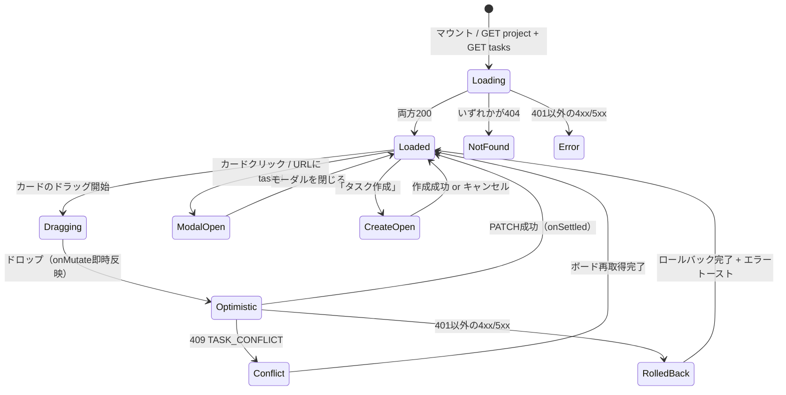
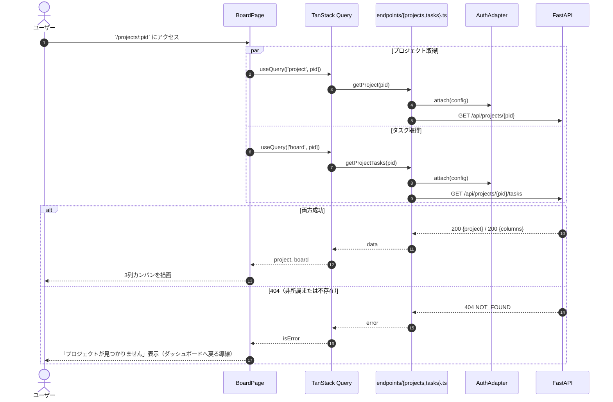
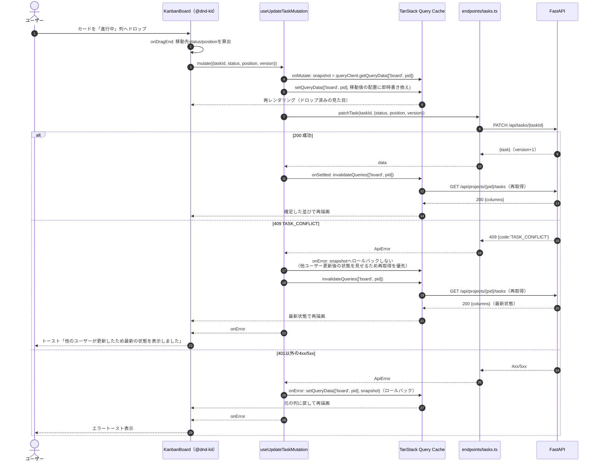
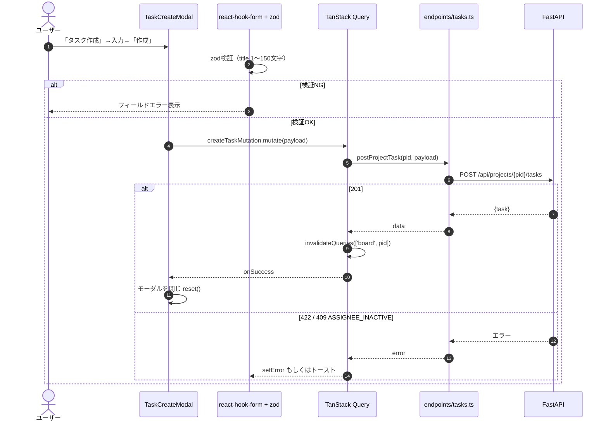
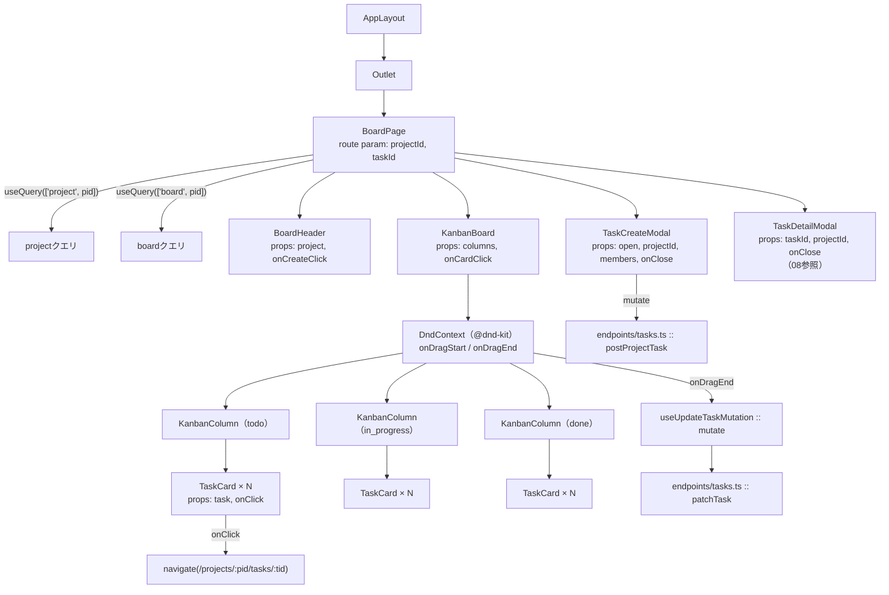
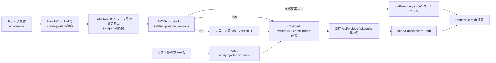

# プロジェクト詳細（カンバンボード）詳細設計（`/projects/:projectId`）

## 0. 関連ドキュメント

| ドキュメント | 内容 |
|--------------|------|
| [../../basic_design/05_frontend.md](../../basic_design/05_frontend.md) | §3 共通レイアウト、§5.2 楽観的更新、§7.5 カンバンボード仕様 |
| [../../basic_design/00_overview.md](../../basic_design/00_overview.md) | §5.2 タスクのドラッグ＆ドロップによるステータス変更 |
| [../../basic_design/04_api.md](../../basic_design/04_api.md) | §2.4 タスクAPI、§3.2 `PATCH /tasks/{id}`、`409 TASK_CONFLICT` |
| [../api/projects/03_get_project.md](../api/projects/03_get_project.md) | `GET /api/projects/{project_id}` 詳細設計 |
| [../api/tasks/01_get_project_tasks.md](../api/tasks/01_get_project_tasks.md) | `GET /api/projects/{project_id}/tasks` 詳細設計 |
| [../api/tasks/02_post_project_tasks.md](../api/tasks/02_post_project_tasks.md) | `POST /api/projects/{project_id}/tasks` 詳細設計 |
| [../api/tasks/04_patch_task.md](../api/tasks/04_patch_task.md) | `PATCH /api/tasks/{id}` 詳細設計（version制御） |
| [./08_task_detail_modal.md](./08_task_detail_modal.md) | タスク詳細モーダル（本画面上にURL同期で表示） |

## 1. 概要

| 項目 | 内容 |
|------|------|
| 画面名 / パス | プロジェクト詳細（カンバンボード） `/projects/:projectId`（タスク詳細モーダル表示時は `/projects/:projectId/tasks/:taskId`） |
| レイアウト | AppLayout（サイドバー + ヘッダー。[05_frontend.md §3](../../basic_design/05_frontend.md#3-共通レイアウト)） |
| ガード | 認証必須。加えてプロジェクトメンバーでない場合はAPIが404を返すため画面はエラー表示に遷移する |
| 対応要件 | 要件書§2-4、§2-5（タスク詳細/編集はモーダルとして本画面に統合） |
| 主なユースケース | プロジェクトのタスクをカンバン形式で閲覧し、D&Dでステータスを変更する。タスクの新規作成、詳細モーダルを開く |
| 実装ファイル | `frontend/src/features/board/BoardPage.tsx`、`frontend/src/features/board/components/KanbanBoard.tsx`、`frontend/src/features/board/components/KanbanColumn.tsx`、`frontend/src/features/board/components/TaskCard.tsx`、`frontend/src/features/board/hooks/useBoard.ts`、`frontend/src/features/board/hooks/useUpdateTaskMutation.ts` |

## 2. 画面レイアウト

```
┌──────────────────────────────────────────────────────────────────┐
│①≡│                  Cerberus                                    │
├──┴──────────────────────────────────────────────────────────────┤
│┌────────┐┌────────────────────────────────────────────────────┐│
││Sidebar ││②プロジェクト名          ③[+ タスク作成] [⑨メンバー]││
││        │├────────────────────────────────────────────────────┤│
││        ││┌──────────┐┌──────────┐┌──────────┐                ││
││        ││④未着手(n) ││⑤進行中(n)││⑥完了(n)  │                ││
││        ││┌────────┐││┌────────┐││┌────────┐│                ││
││        │││⑦TaskCard│││⑦TaskCard│││⑦TaskCard│                ││
││        │││ title   │││ title   │││ title   │                ││
││        │││ assignee│││ assignee│││ assignee│                ││
││        │││ due/💬n │││ due/💬n │││ due/💬n │                ││
││        ││└────────┘││└────────┘││└────────┘│                ││
││        ││   …ドラッグで列間移動可能…                          ││
││        ││└──────────┘└──────────┘└──────────┘                ││
│└────────┘└────────────────────────────────────────────────────┘│
└──────────────────────────────────────────────────────────────────┘
   ⑧TaskDetailModal（URL: /projects/:pid/tasks/:tid 時にオーバーレイ表示）
```

- ①②③：ヘッダー行。②はプロジェクト名（クリック不可の見出し）、③はタスク作成ボタンとメンバー一覧トグル
- ④⑤⑥：3列固定（`todo` / `in_progress` / `done`）。列ヘッダーに件数バッジ
- ⑦：`TaskCard`。タイトル・担当者アバター・期限・コメント数を表示。ドラッグ可能（`@dnd-kit` の `useDraggable`）
- ⑧：タスク詳細モーダル（[08_task_detail_modal.md](./08_task_detail_modal.md)）。URLとモーダル開閉を同期
- ⑨：メンバー一覧の簡易表示（アバター＋人数。招待導線自体は本画面の対応要件外。要検討：メンバー招待UIをこの画面に置くか設定画面相当の別導線にするかは基本設計に明記なし）

レスポンシブ：3列は `flex` で横並びを維持し、画面幅が狭い場合は列内を `overflow-x: auto` で横スクロールさせる（列を縦積みにはしない。カンバンの列対応関係を保つため）。列の最小幅は `min-width: 16rem` とする。

## 3. UI要素仕様

| No | 要素 | 種別 | 初期値 | 入力制約 | 活性条件 | イベント／遷移 |
|----|------|------|--------|----------|----------|----------------|
| ① | ハンバーガー | button | `uiStore.sidebarOpen` | - | 常時 | サイドバー開閉 |
| ② | プロジェクト名見出し | text | `board.project.name` | - | - | - |
| ③ | タスク作成ボタン | button | - | - | 常時活性 | `TaskCreateModal` を開く |
| ④⑤⑥ | 列ヘッダー | text + badge | 固定ラベル + `columns[status].length` | - | - | - |
| ⑦ | TaskCard | draggable card | `useBoard()` の1件 | - | 常時 | クリックで `navigate('/projects/:pid/tasks/:tid')`。ドラッグで列間・列内移動 |
| ⑧ | TaskDetailModal | modal | URLの `taskId` に応じて表示 | - | `taskId` が存在する時のみ描画 | 閉じるボタン/Escで `/projects/:pid` へ`navigate` |
| ⑨ | メンバーアバター群 | avatar list | `board.project` のメンバー | - | 常時 | クリックで簡易ツールチップ（氏名表示のみ） |
| ⑩ | TaskCreateModal / title | text input | `""` | 1〜150文字必須（[04_api.md §3.2](../../basic_design/04_api.md#32-プロジェクトタスク)） | - | 入力反映 |
| ⑪ | TaskCreateModal / assignee | select | `null` | プロジェクトメンバーから選択、未選択可 | - | 選択反映 |
| ⑫ | TaskCreateModal / due_at | datetime-local input | `null` | 任意 | - | `APP_TIMEZONE`の日時として入力し、UTCへ正規化して送信 |
| ⑬ | TaskCreateModal / status | select | `todo` | `todo`/`in_progress`/`done` | - | 選択反映 |
| ⑭ | TaskCreateModal / 作成ボタン | button | - | - | `isValid && !isSubmitting` | `POST /tasks` |

## 4. 使用API

| No | 呼び出しタイミング | メソッド／パス | 送信内容 | 成功時処理 | 失敗時処理 | queryKey / mutationKey |
|----|--------------------|-----------------|----------|------------|------------|--------------------------|
| 1 | マウント時 | `GET /api/projects/{projectId}` | パスパラメータのみ | プロジェクト名・メンバー一覧を描画 | 404はプロジェクトエラー画面（非所属/不存在を区別しない） | `queryKey: ['project', projectId]` |
| 2 | マウント時 | `GET /api/projects/{projectId}/tasks` | パスパラメータのみ | `columns` を3列に描画 | 404は同上、401はAuthAdapterが処理 | `queryKey: ['board', projectId]` |
| 3 | カードD&Dドロップ時 | `PATCH /api/tasks/{taskId}` | `{status, position, version}` | 楽観的更新済みキャッシュを確定（§5.2/§7参照） | `409 TASK_CONFLICT` は `invalidateQueries(['board', projectId])` で再取得、その他はロールバック | `mutationKey: ['updateTask', taskId]` |
| 4 | タスク作成送信 | `POST /api/projects/{projectId}/tasks` | `{title, description, status, assignee_id, due_at}` | `201` → `invalidateQueries(['board', projectId])`、モーダルを閉じる | 422はフィールドエラー、`ASSIGNEE_INACTIVE`はトースト | `mutationKey: ['createTask']` |
| 5 | URLに `taskId` が付与された時 | （[08_task_detail_modal.md](./08_task_detail_modal.md)参照） | - | - | - | `queryKey: ['task', taskId]` |

## 5. 状態管理

| 区分 | 名称 | 型 | 初期値 | 更新契機 | 永続化 |
|------|------|----|--------|----------|--------|
| ローカルstate | `isCreateModalOpen` | `boolean` | `false` | ③クリック / 作成成功 / キャンセル | なし |
| ローカルstate（`KanbanBoard`内） | `activeDragTaskId` | `string \| null` | `null` | `@dnd-kit` の `onDragStart` / `onDragEnd` | なし |
| URL | `projectId`, `taskId` | `string`（route param） | route定義由来 | React Router のナビゲーション | URL自体が状態（リロード・共有可能） |
| TanStack Query | `['project', projectId]` | `Project` | 未取得 | マウント時fetch | しない |
| TanStack Query | `['board', projectId]` | `BoardResponse`（`columns.{todo,in_progress,done}`） | 未取得 | マウント時fetch、`updateTask`/`createTask`/`deleteTask`成功時、`409`時に`invalidate` | しない |
| TanStack Query（楽観的更新のスナップショット） | `onMutate` 内のローカル変数 | `BoardResponse`（更新前の複製） | mutate呼び出し時に取得 | `onError`でロールバックに使用後は破棄 | しない（mutation実行中のみ保持） |

## 6. 画面状態遷移図



## 7. 処理シーケンス

### 7.1 初期表示



### 7.2 ドラッグ＆ドロップによるステータス変更（楽観的更新）

[00_overview.md §5.2](../../basic_design/00_overview.md#52-タスクのドラッグ＆ドロップによるステータス変更) の全体シーケンスを画面詳細レベルへ展開したもの。



### 7.3 タスク新規作成



## 8. コンポーネント構成・相関図



## 9. 関数・カスタムフック詳細

### 9.1 `features/board/hooks/useBoard.ts :: useBoard`

| 項目 | 内容 |
|------|------|
| シグネチャ | `function useBoard(projectId: string): UseQueryResult<BoardResponse, ApiError>` |
| 引数 | `projectId`（route param） |
| 戻り値 | `columns: {todo: Task[]; in_progress: Task[]; done: Task[]}` を含む `BoardResponse` |
| 処理内容 | 1. `queryKey: ['board', projectId]` 2. `queryFn` に `endpoints/tasks.ts :: getProjectTasks(projectId)` 3. `enabled: !!projectId` |
| 副作用 | `GET /api/projects/{projectId}/tasks` 呼び出し |

### 9.2 `features/board/hooks/useUpdateTaskMutation.ts :: useUpdateTaskMutation`

| 項目 | 内容 |
|------|------|
| シグネチャ | `function useUpdateTaskMutation(projectId: string): UseMutationResult<Task, ApiError, UpdateTaskInput, { snapshot: BoardResponse \| undefined }>` |
| 引数 | `projectId`（クロージャで保持） |
| 戻り値 | `mutate`／`mutateAsync` を含む `UseMutationResult`。`context` に `onMutate` で保存した `snapshot` を保持 |
| 処理内容 | 1. `onMutate(input)`：`queryClient.cancelQueries(['board', projectId])` → `snapshot = getQueryData(['board', projectId])` → 移動後の配置を計算し `setQueryData` で即時反映 → `{snapshot}` を返す 2. `mutationFn`：`patchTask(input.taskId, {status, position, version})` を呼ぶ 3. `onError(err, input, context)`：`err.code === 'TASK_CONFLICT'` なら `invalidateQueries(['board', projectId])` のみ、それ以外は `setQueryData(['board', projectId], context.snapshot)` でロールバック 4. `onSettled`：`TASK_CONFLICT` 以外の成功時は `invalidateQueries(['board', projectId])` |
| 副作用 | `PATCH /api/tasks/{taskId}`、キャッシュ書き換え、失敗時トースト表示 |

### 9.3 `features/board/components/KanbanBoard.tsx :: handleDragEnd`

| 項目 | 内容 |
|------|------|
| シグネチャ | `function handleDragEnd(event: DragEndEvent, columns: BoardResponse['columns']): void` |
| 引数 | `event`：`@dnd-kit` のドラッグ終了イベント（`active.id`＝タスクID、`over.id`＝ドロップ先の列またはカード）、`columns`：現在のボード状態 |
| 戻り値 | なし |
| 処理内容 | 1. `over` が無ければ何もしない（列外へのドロップはキャンセル） 2. `over.id` からドロップ先の `status` と挿入位置 `position` を算出（列の末尾 or 対象カードの直前） 3. 移動元と移動先が同じ場合は元カードの現在の `version` を用いて `useUpdateTaskMutation().mutate({taskId, status, position, version})` を呼ぶ |
| 副作用 | `useUpdateTaskMutation` 経由でAPI呼び出し |

### 9.4 `features/board/BoardPage.tsx :: useSyncTaskModalWithUrl`

| 項目 | 内容 |
|------|------|
| シグネチャ | `function useSyncTaskModalWithUrl(): { taskId: string \| null; openTask: (id: string) => void; closeTask: () => void }` |
| 引数 | なし（`useParams` / `useNavigate` を内部で使用） |
| 戻り値 | 現在開いているタスクIDと開閉操作関数 |
| 処理内容 | 1. `useParams()` から `taskId` を取得しそのまま返す 2. `openTask(id)`：`navigate('/projects/' + projectId + '/tasks/' + id)` 3. `closeTask()`：`navigate('/projects/' + projectId)`（`replace: false` としブラウザ「戻る」でも自然に閉じられるようにする） |
| 副作用 | ルーティング（URL変更） |

## 10. バリデーション

| フィールド | zodルール | エラーメッセージ | バックエンド対応 |
|-----------|-----------|-------------------|-------------------|
| `title`（タスク作成） | `z.string().min(1).max(150)` | 「タイトルを1〜150文字で入力してください」 | `POST /tasks` title（[04_api.md §3.2](../../basic_design/04_api.md#32-プロジェクトタスク)） |
| `description`（タスク作成） | `z.string().nullable().optional()` | - | 上限は要検討（基本設計に明記なし） |
| `assignee_id`（タスク作成） | `z.string().uuid().nullable().optional()` | 「担当者の選択が不正です」 | 有効なプロジェクトメンバーであることはサーバー側で検証（`409 ASSIGNEE_INACTIVE`） |
| `due_at`（タスク作成） | `z.string().datetime({ local: true }).nullable().optional()` | 「期限日時の形式が正しくありません」 | `APP_TIMEZONE`へ変換後、ISO 8601 UTCを送信 |
| `status`（タスク作成） | `z.enum(['todo','in_progress','done'])` | - | 省略時サーバーは `todo` を既定とする |

D&D操作自体（`PATCH /tasks/{id}` の `status`/`position`/`version`）はユーザー入力フォームを介さないためzod検証の対象外とし、`version` はクライアントが保持する現在値をそのまま送信する。

## 11. エラーハンドリング

| APIエラーコード / HTTP | 画面表示 | 遷移 | 再試行導線 |
|------------------------|----------|------|------------|
| 404 `NOT_FOUND`（プロジェクト） | 「プロジェクトが見つかりません」全画面メッセージ | 遷移なし（`/dashboard`へのリンクを提示） | ダッシュボードへ戻るリンク |
| 401 `UNAUTHENTICATED` | なし（AuthAdapterが処理） | `/login` | - |
| 409 `TASK_CONFLICT` | トースト「他のユーザーが更新したため最新の状態を表示しました」 | ボードを再取得して同一画面に留まる | 再取得後に再度ドラッグ操作 |
| 409 `ASSIGNEE_INACTIVE` | タスク作成モーダルにトースト | 遷移なし | 担当者を選び直して再送信 |
| 422 `VALIDATION_ERROR`（タスク作成） | モーダル内フィールドエラー | 遷移なし | 修正して再送信 |
| 5xx `INTERNAL_ERROR` / `SERVICE_UNAVAILABLE`（D&D時） | ロールバック＋エラートースト | 遷移なし | 再度ドラッグ操作 |
| 5xx（初期表示時） | 画面中央にエラーメッセージ＋再試行ボタン | 遷移なし | 再試行ボタン |

## 12. データ遷移図



## 13. アクセシビリティ・表示設定

| 項目 | 内容 |
|------|------|
| 文字サイズ | `--font-scale` に追従（`rem`指定） |
| キーボード操作 | `@dnd-kit` の `KeyboardSensor` を有効化し、カードにフォーカス後 Space でつかむ→矢印キーで列移動→Space で確定（`@dnd-kit` 標準のキーボードD&D）。カードクリックと同じくEnterで詳細モーダルを開く |
| `aria-*` | 列は `role="list" aria-label="未着手"` 等、カードは `role="listitem" aria-roledescription="draggable item"`。ドラッグ中は `aria-live="polite"` の領域で「◯◯を進行中列に移動しました」等を通知（`@dnd-kit` の `announcements` オプションを利用） |
| フォーカス管理 | モーダルを閉じたら直前にクリックしたカードへフォーカスを戻す |

## 14. テスト設計

| No | 区分 | ケース | 前提（MSWのモック応答等） | 期待結果 | テスト名案 |
|----|------|--------|---------------------------|----------|------------|
| 1 | 単体 | `handleDragEnd` で列外へドロップ | `event.over = null` | mutateが呼ばれない | `handleDragEnd does nothing when dropped outside a column` |
| 2 | 単体 | `handleDragEnd` で同列内の並べ替え | `over` が同一status内の別カード | 算出された`position`が対象カードの直前になる | `handleDragEnd computes position within same column` |
| 3 | 単体（zod） | タスク作成 `title` 151文字 | - | バリデーションエラー | `TaskCreateSchema rejects title over 150 chars` |
| 4 | コンポーネント | D&D成功時の楽観的更新 | `PATCH /tasks/:id` → 200 | ドロップ直後に見た目が即時変更され、成功後も同じ状態を維持 | `KanbanBoard reflects optimistic update on successful drop` |
| 5 | コンポーネント | D&D失敗（500）時のロールバック | `PATCH /tasks/:id` → 500 | ドロップ後に一旦反映されたカードが元の列へ戻る | `KanbanBoard rolls back card position on update failure` |
| 6 | コンポーネント | D&D時の409 | `PATCH /tasks/:id` → 409 `TASK_CONFLICT`、直後の`GET /tasks`は最新データ | ボードが再取得され最新状態が表示、ロールバックはしない | `KanbanBoard refetches board on 409 TASK_CONFLICT` |
| 7 | コンポーネント | カードクリックでURL同期 | - | `navigate` が `/projects/:pid/tasks/:tid` を呼ぶ | `TaskCard click navigates to task detail URL` |
| 8 | 結合 | `taskId` 付きURLへ直接アクセス | `GET /tasks/:id` → 200 | モーダルが初期表示から開いた状態になる | `BoardPage opens TaskDetailModal from URL on mount` |
| 9 | 結合 | 非所属プロジェクトへのアクセス | `GET /projects/:pid` → 404 | 「プロジェクトが見つかりません」表示 | `BoardPage shows not-found message for 404 project` |
| 10 | 網羅できない範囲 | 実ブラウザでのD&Dのポインタ挙動・タッチ操作 | - | `@dnd-kit` のイベントはユーティリティ（`simulate`）でシミュレートし、実操作は手動確認とする |

## 15. 不明点・要検討事項

| 区分 | 内容 | 影響 |
|------|------|------|
| 要検討 | メンバー招待UIを本画面（③⑨付近）に置くか、独立した導線とするかが基本設計（[05_frontend.md §7.5](../../basic_design/05_frontend.md#75-カンバンボード)）に明記されていない。本書では簡易表示のみとし招待操作は対象外とした | メンバー管理APIの呼び出し元画面の要確認 |
| 要検討 | タスク作成時の `description` 文字数上限が基本設計に明記されていない | フロント側バリデーション実装の要確認 |
| なし | 上記以外 | - |
