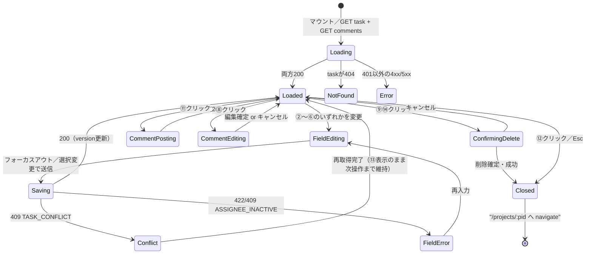
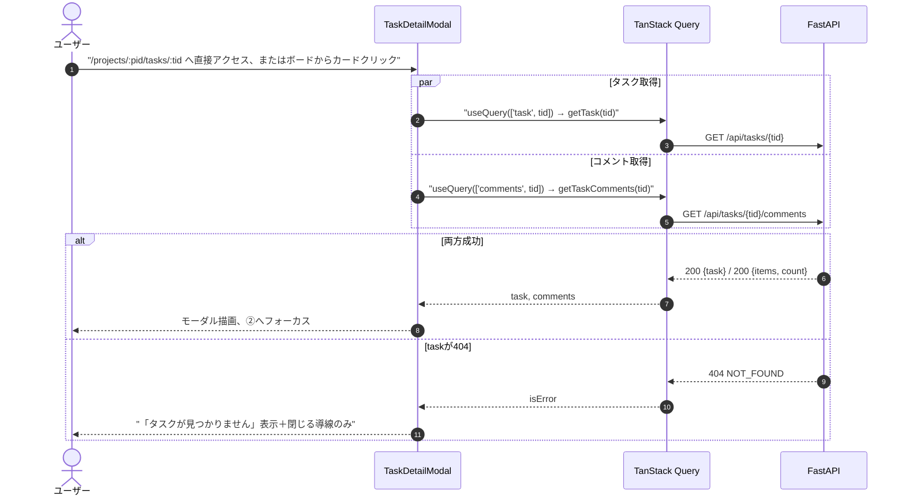
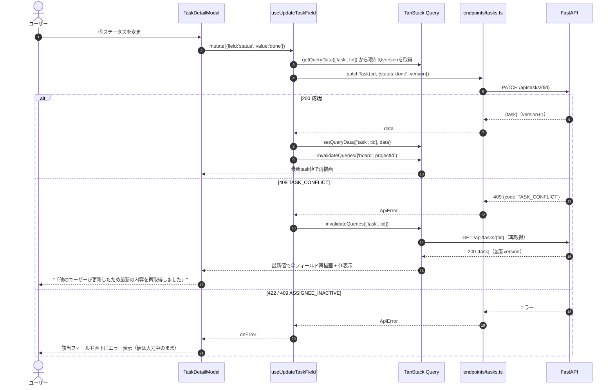
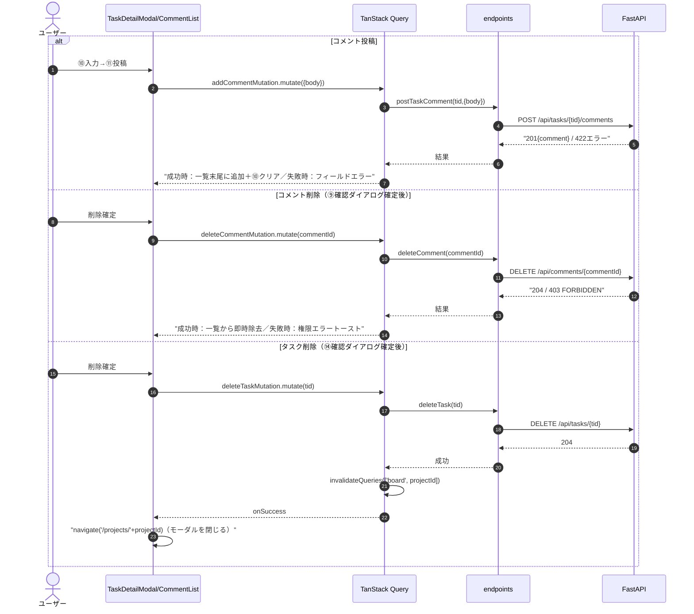
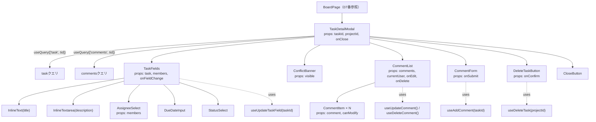
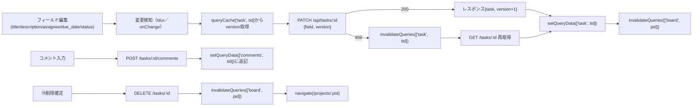

# タスク詳細/編集モーダル詳細設計（/projects/:projectId/tasks/:taskId）

## 0. 関連ドキュメント

| ドキュメント | 内容 |
|--------------|------|
| [../../basic_design/05_frontend.md](../../basic_design/05_frontend.md) | §2 ルーティング、§5.2 楽観的更新、§7.5 カンバンボード仕様（本モーダルの記述） |
| [../../basic_design/04_api.md](../../basic_design/04_api.md) | §2.4 タスク・コメントAPI、§3.2 `PATCH /tasks/{id}`、§4.2 `TASK_CONFLICT` |
| [../api/tasks/03_get_task.md](../api/tasks/03_get_task.md) | `GET /api/tasks/{task_id}` 詳細 |
| [../api/tasks/04_patch_task.md](../api/tasks/04_patch_task.md) | `PATCH /api/tasks/{task_id}` 詳細（version制御） |
| [../api/tasks/05_delete_task.md](../api/tasks/05_delete_task.md) | `DELETE /api/tasks/{task_id}` 詳細 |
| [../api/tasks/06_get_task_comments.md](../api/tasks/06_get_task_comments.md) | コメント一覧取得 |
| [../api/tasks/07_post_task_comments.md](../api/tasks/07_post_task_comments.md) | コメント投稿 |
| [../api/tasks/08_patch_comment.md](../api/tasks/08_patch_comment.md) | コメント編集（403/404の切り分け） |
| [../api/tasks/09_delete_comment.md](../api/tasks/09_delete_comment.md) | コメント削除 |
| [../api/projects/06_get_project_members.md](../api/projects/06_get_project_members.md) | 担当者選択に使うメンバー一覧 |
| [./07_project_board.md](./07_project_board.md) | 本モーダルを開くカンバンボード画面（URL同期の起点） |

## 1. 概要

| 項目 | 内容 |
|------|------|
| 画面名 / パス | タスク詳細/編集モーダル / `/projects/:projectId/tasks/:taskId`（[07_project_board.md](./07_project_board.md) 上にオーバーレイ表示） |
| レイアウト | AppLayout上のモーダル（独自レイアウトは持たない） |
| ガード | 認証必須（ボード画面と共通）。タスクが非所属プロジェクトまたは不存在の場合はAPIが404を返しモーダル内にエラー表示 |
| 対応要件 | 要件書§2-5 |
| 主なユースケース | タスクの内容確認・編集（タイトル・説明・担当者・期限・ステータス）、コメントの閲覧・投稿・編集・削除、タスク削除 |
| 実装ファイル | `frontend/src/features/board/components/TaskDetailModal.tsx`、`frontend/src/features/board/components/CommentList.tsx`、`frontend/src/features/board/components/CommentForm.tsx`、`frontend/src/features/board/hooks/useTaskDetail.ts`、`frontend/src/features/board/hooks/useUpdateTaskField.ts`、`frontend/src/features/board/hooks/useComments.ts` |

## 2. 画面レイアウト

```
┌──────────────────────────────────────────────────────────┐
│ ①タスク詳細                                    [⑫ ×閉じる]│
├──────────────────────────────────────────────────────────┤
│ ②タイトル [インライン編集可]                                │
│ ③説明                                                      │
│  [複数行テキストエリア、フォーカスアウトで保存]              │
│                                                            │
│ ④担当者: [selectドロップダウン▼]  ⑤期限: [date input]       │
│ ⑥ステータス: [todo/進行中/完了 セレクト]                    │
│                                                            │
│ [⑬ 409競合バナー（条件表示）]                               │
│                                                            │
│ ────────────── コメント ──────────────                     │
│ ⑦コメント一覧（created_at昇順）                             │
│  ┌────────────────────────────────────────┐              │
│  │ 投稿者名  日時        [⑧編集][⑨削除]     │              │
│  │ 本文...                                  │              │
│  └────────────────────────────────────────┘              │
│  …N件…                                                    │
│                                                            │
│ ⑩コメント入力欄（複数行）                                   │
│ [⑪         投稿         ]（ボタン）                         │
│                                                            │
│ [⑭         タスクを削除         ]（危険操作ボタン）          │
└──────────────────────────────────────────────────────────┘
```

- モーダルは画面中央に固定表示し、背景はオーバーレイでスクロールロックする。フォーカスは開いた瞬間に②へ移動しモーダル外へは出られない（フォーカストラップ。§13参照）
- レスポンシブ：幅600px未満ではモーダル幅を`100% - 24px`とし、④⑤を横並びから縦積みへ変更する
- ⑧⑨はコメント投稿者本人または`role=admin`の場合のみ表示する（§3参照）

## 3. UI要素仕様

| No | 要素 | 種別 | 初期値 | 入力制約 | 活性条件 | イベント／遷移 |
|----|------|------|--------|----------|----------|----------------|
| ① | 見出し | 静的テキスト | "タスク詳細" | - | 常時 | - |
| ② | タイトル | インライン編集text | `task.title` | 1〜150文字必須 | 常時編集可 | フォーカスアウトで変更検知→`PATCH`（§9.1） |
| ③ | 説明 | インライン編集textarea | `task.description` | 上限なし（要検討：§15） | 常時編集可 | フォーカスアウトで変更検知→`PATCH` |
| ④ | 担当者 | select | `task.assignee?.id ?? ''`（空文字＝未割当） | プロジェクトメンバーから選択、`is_active=false`のメンバーは選択肢に表示するが選択不可（グレーアウト） | 常時活性 | 選択変更で即時`PATCH` |
| ⑤ | 期限 | date input | `task.due_date` | 任意 | 常時活性 | 変更で即時`PATCH` |
| ⑥ | ステータス | select | `task.status` | `todo`/`in_progress`/`done` | 常時活性 | 変更で即時`PATCH`（ボード側の列移動と同一API） |
| ⑦ | コメント一覧 | list | `useComments()`の結果 | - | 常時 | スクロール表示（ページングなし） |
| ⑧ | コメント編集ボタン | icon button | - | - | `comment.author.id === currentUser.id \|\| currentUser.role === 'admin'` | クリックで該当コメントをインライン編集モードへ |
| ⑨ | コメント削除ボタン | icon button | - | - | ⑧と同一条件 | クリックで確認ダイアログ→確定で`DELETE` |
| ⑩ | コメント入力欄 | textarea | `""` | 1〜2000文字必須（trim後判定） | 常時活性 | onChangeでstate更新 |
| ⑪ | 投稿ボタン | submit button | 非活性（空文字時） | - | `body`が1〜2000文字 かつ `!isSubmitting` | クリックで`POST`、成功後にクリアしフォーカスを⑩へ戻す |
| ⑫ | 閉じるボタン | icon button | - | - | 常時活性 | クリックまたはEscで`/projects/:pid`へ`navigate`（モーダルを閉じる） |
| ⑬ | 409競合バナー | Alert(warning) | 非表示 | - | いずれかのフィールド更新が`409 TASK_CONFLICT`を受けた場合のみ | 「他のユーザーが更新したため最新の内容を再取得しました」＋再取得後の値で全フィールドを再描画 |
| ⑭ | タスク削除ボタン | 危険操作button | - | - | 常時活性（プロジェクトメンバーであれば誰でも削除可。[05_delete_task.md](../api/tasks/05_delete_task.md) §1・§13） | クリックで確認ダイアログ→確定で`DELETE /tasks/{id}`→成功後モーダルを閉じてボードへ戻る |

## 4. 使用API

| No | 呼び出しタイミング | メソッド／パス | 送信内容 | 成功時処理 | 失敗時処理 | queryKey / mutationKey |
|----|--------------------|-----------------|----------|------------|------------|--------------------------|
| 1 | モーダル表示時（マウント／URLの`taskId`変化時） | GET `/tasks/{taskId}` | パスパラメータのみ | `task`（`version`含む）を描画 | 404はモーダル内エラー表示＋`/projects/:pid`への導線 | `queryKey: ['task', taskId]` |
| 2 | 表示時（1と並行） | GET `/tasks/{taskId}/comments` | パスパラメータのみ | ⑦へ描画 | トースト表示、再試行ボタン | `queryKey: ['comments', taskId]` |
| 3 | ②③④⑤⑥のいずれか変更確定時 | PATCH `/tasks/{taskId}` | `{version, <変更フィールドのみ>}`（1回のリクエストにつき1フィールド。§9.2参照） | レスポンスの`task`でキャッシュを更新し`version`を最新化。`['board', projectId]`も`invalidateQueries` | `409 TASK_CONFLICT`は⑬表示＋`['task', taskId]`を`invalidateQueries`して再取得。`409 ASSIGNEE_INACTIVE`／`422`はフィールド直下にエラー | `mutationKey: ['updateTaskField', taskId]` |
| 4 | ⑪クリック | POST `/tasks/{taskId}/comments` | `{body}` | `['comments', taskId]`に新規コメントを追加反映、⑩をクリア | 422はフィールドエラー、404はモーダルをエラー表示に切替 | `mutationKey: ['addComment', taskId]` |
| 5 | ⑧⑨編集/削除確定 | PATCH／DELETE `/comments/{commentId}` | `{body}` または パスパラメータのみ | 該当コメントを更新表示、または`['comments', taskId]`から即時除去 | 403は「権限がありません」トースト、404はコメント一覧を再取得（削除済みの可能性） | `mutationKey: ['updateComment'\|'deleteComment', commentId]` |
| 6 | ⑭削除確定 | DELETE `/tasks/{taskId}` | パスパラメータのみ | `['board', projectId]`を`invalidateQueries`し、モーダルを閉じて`/projects/:pid`へ`navigate` | 404は既に削除済みとして同様にボードへ戻る、CSRF系はトースト | `mutationKey: ['deleteTask', taskId]` |
| 7 | 表示時（④の選択肢構築） | （[07_project_board.md](./07_project_board.md) の`['project', projectId]`キャッシュを再利用） | - | メンバー一覧を④の選択肢に変換 | - | `queryKey: ['project', projectId]`（新規fetchしない） |

## 5. 状態管理

| 区分 | 名称 | 型 | 初期値 | 更新契機 | 永続化 |
|------|------|----|--------|----------|--------|
| URL | `projectId`, `taskId` | `string`（route param） | route定義由来 | React Routerのナビゲーション | URL自体が状態（リロード・共有可能） |
| TanStack Query | `['task', taskId]` | `TaskDetail`（`version`含む） | 未取得 | マウント時fetch、各`PATCH`成功時に`setQueryData`、`409`時に`invalidate` | しない |
| TanStack Query | `['comments', taskId]` | `CommentListResponse` | 未取得 | マウント時fetch、コメントCRUD成功時に楽観更新／`invalidate` | しない |
| ローカルstate | `editingField` | `'title' \| 'description' \| null` | `null` | ②③のフォーカスイン／アウト | なし |
| ローカルstate | `commentDraft` | `string` | `""` | ⑩入力・投稿成功 | なし |
| ローカルstate | `editingCommentId` | `string \| null` | `null` | ⑧クリック・編集確定／キャンセル | なし |
| ローカルstate | `conflictBannerVisible` | `boolean` | `false` | 409受信・再取得完了 | なし |
| ローカルstate | `pendingDeleteTarget` | `'task' \| { commentId: string } \| null` | `null` | ⑨⑭クリック（確認ダイアログの対象保持） | なし |

タスクの`version`は`['task', taskId]`キャッシュの値を常に正とし、各`PATCH`送信直前にキャッシュから読み直す（フォーム内に別途保持しない）。

## 6. 画面状態遷移図



## 7. 処理シーケンス

### 7.1 モーダル表示（URLからの直接アクセス／リロード含む）



### 7.2 フィールド編集（楽観更新＋409時の再取得）



### 7.3 コメント投稿・削除／タスク削除（共通パターン）



## 8. コンポーネント構成・相関図



## 9. 関数・カスタムフック詳細

### 9.1 `hooks/useTaskDetail.ts :: useTaskDetail`

| 項目 | 内容 |
|------|------|
| シグネチャ | `function useTaskDetail(taskId: string): UseQueryResult<TaskDetail, ApiError>` |
| 引数 | `taskId`（route param） |
| 戻り値 | `TaskDetail`（`version`, `assignee`, `comment_count`等を含む） |
| 処理内容 | 1. `queryKey: ['task', taskId]` 2. `queryFn`に`endpoints/tasks.ts :: getTask(taskId)` 3. `enabled: !!taskId` |
| 副作用 | `GET /api/tasks/{taskId}` 呼び出し |

### 9.2 `hooks/useUpdateTaskField.ts :: useUpdateTaskField`

| 項目 | 内容 |
|------|------|
| シグネチャ | `function useUpdateTaskField(taskId: string): UseMutationResult<TaskDetail, ApiError, Partial<TaskUpdatePayload>>` |
| 引数 | `taskId`（クロージャで保持） |
| 戻り値 | `mutate`／`mutateAsync`を含む`UseMutationResult` |
| 処理内容 | 1. `mutationFn(fields)`：`queryClient.getQueryData(['task', taskId])`から現在の`version`を読み取り、`patchTask(taskId, {...fields, version})`を呼ぶ（**1回の呼び出しにつき変更フィールドは1件のみ送信**。複数フィールドを同時変更するUIは持たないため） 2. `onSuccess(data)`：`setQueryData(['task', taskId], data)` → `invalidateQueries(['board', projectId])` 3. `onError(err)`：`err.code === 'TASK_CONFLICT'`なら`invalidateQueries(['task', taskId])`し`conflictBannerVisible=true`。それ以外はフィールドへエラーを伝播 |
| 副作用 | `PATCH /api/tasks/{taskId}`、キャッシュ書き換え |

### 9.3 `components/TaskFields.tsx :: handleFieldBlur`

| 項目 | 内容 |
|------|------|
| シグネチャ | `function handleFieldBlur(field: 'title' \| 'description', value: string, original: string): void` |
| 引数 | `field`：対象フィールド名、`value`：入力後の値、`original`：直前に表示していた値 |
| 戻り値 | なし |
| 処理内容 | 1. `value === original`なら何もしない（不要なPATCHを送らない） 2. 異なる場合のみ`useUpdateTaskField().mutate({[field]: value})`を呼ぶ |
| 副作用 | 条件付きでAPI呼び出し |

### 9.4 `hooks/useComments.ts :: useAddComment` / `features/board/TaskDetailModal.tsx :: useFocusTrap`

| 項目 | `useAddComment` | `useFocusTrap` |
|------|-----------------|----------------|
| シグネチャ | `function useAddComment(taskId: string): UseMutationResult<Comment, ApiError, { body: string }>` | `function useFocusTrap(containerRef: RefObject<HTMLElement>, active: boolean): void` |
| 引数 | `taskId` | `containerRef`：モーダルのルート要素、`active`：トラップの有効/無効 |
| 戻り値 | `mutation`オブジェクト | なし |
| 処理内容 | 1. `postTaskComment(taskId, payload)`を呼ぶ 2. `onSuccess(comment)`：`setQueryData(['comments', taskId], prev => ({...prev, items:[...prev.items, comment], count: prev.count+1}))`（`invalidate`ではなく直接追記し再フェッチを避ける） | 1. `active`が`true`になった時点のフォーカス位置を記憶 2. モーダル内の`tabbable`要素を収集しTab/Shift+Tabの循環を`keydown`で実現 3. `active`が`false`に戻った時点（閉じた時点）で記憶していた直前フォーカス位置（ボードの対象`TaskCard`）へ戻す |
| 副作用 | `POST /api/tasks/{taskId}/comments`、キャッシュへの追加反映 | DOMイベントリスナー登録・解除、フォーカス移動 |

## 10. バリデーション

| フィールド | zodスキーマ | ルール | エラーメッセージ | バックエンド対応 |
|-----------|-------------|--------|-------------------|-------------------|
| ②title | `taskFieldSchema.title` | `z.string().min(1).max(150)` | 「タイトルは1〜150文字で入力してください」 | pydantic `TaskUpdateRequest.title`（[04_patch_task.md](../api/tasks/04_patch_task.md) §10） |
| ③description | `taskFieldSchema.description` | `z.string().nullable().optional()`（上限は未設定） | - | 上限は基本設計に明記なし（要検討：§15） |
| ④assignee_id | `taskFieldSchema.assigneeId` | `z.string().uuid().nullable()` | 「担当者の選択が不正です」 | メンバー・`is_active`検証はサーバー側（`409 ASSIGNEE_INACTIVE`） |
| ⑤due_date | `taskFieldSchema.dueDate` | `z.string().date().nullable()` | 「日付の形式が正しくありません」 | - |
| ⑥status | `taskFieldSchema.status` | `z.enum(['todo','in_progress','done'])` | - | - |
| ⑩コメント本文 | `commentSchema.body` | `z.string().trim().min(1).max(2000)` | 「コメントは1〜2000文字で入力してください」 | pydantic `CommentCreateRequest.body`（`TASK_COMMENT_BODY_MAX_LENGTH`。[07_post_task_comments.md](../api/tasks/07_post_task_comments.md) §10。上限値はフロント・バック間の共有方法が未確定のため要検討：§15） |

## 11. エラーハンドリング

| APIエラーコード / HTTP | 画面表示 | 遷移 | 再試行導線 |
|--------------------------|----------|------|------------|
| 404 `NOT_FOUND`（task取得時） | モーダル内「タスクが見つかりません」＋閉じる導線のみ | 遷移なし（ユーザー操作で`/projects/:pid`へ） | なし |
| 409 `TASK_CONFLICT`（フィールド更新時） | ⑬バナー表示＋全フィールドを最新値で再描画 | なし（モーダルは開いたまま） | 再取得後に同じ操作をやり直す |
| 409 `ASSIGNEE_INACTIVE` | ④直下にエラー「指定した担当者は無効化されています」 | なし | 担当者を選び直す |
| 422 `VALIDATION_ERROR`（フィールド更新） | 該当フィールド直下にエラー | なし | 修正して再度フォーカスアウト |
| 422 `VALIDATION_ERROR`（コメント投稿） | ⑩直下にエラー | なし | 修正して再送信 |
| 403 `FORBIDDEN`（コメント編集/削除） | トースト「この操作を行う権限がありません」 | なし | UI上⑧⑨は本来表示されないため、他端末からの同時操作等の異常系のみ想定 |
| 404 `NOT_FOUND`（コメント編集/削除） | トースト「対象のコメントは既に削除されています」＋一覧を再取得 | なし | 再取得後の一覧で再操作 |
| 204（タスク削除成功） | なし（モーダルを閉じてボードへ） | `/projects/:pid` | - |
| 401以外の5xx | 共通トースト「エラーが発生しました。しばらくしてから再度お試しください」 | なし | 再試行 |

## 12. データ遷移図



## 13. アクセシビリティ・表示設定

| 項目 | 内容 |
|------|------|
| 文字サイズ | `--font-scale`に追従（`rem`指定） |
| キーボード操作 | Escでモーダルを閉じる（⑫と同一挙動）。Tabはモーダル内要素のみを循環（フォーカストラップ、§9.5） |
| `aria-*` | モーダルルートに`role="dialog" aria-modal="true" aria-labelledby="task-detail-title"`。⑬に`role="alert"`。⑦の各コメントに`role="article"` |
| フォーカス管理 | 開いた瞬間に②へフォーカス。閉じた瞬間に直前クリックしたボード上の`TaskCard`へフォーカスを戻す（[07_project_board.md §13](./07_project_board.md#13-アクセシビリティ表示設定)と対になる挙動） |

## 14. テスト設計

| No | 区分 | ケース | 前提（MSWのモック応答等） | 期待結果 | テスト名案 |
|----|------|--------|----------------------------|----------|-------------|
| 1 | 単体（zod） | title 151文字／コメント本文2001文字 | - | いずれもバリデーションエラー | `taskFieldSchema/commentSchema reject over-length input` |
| 2 | 単体 | `handleFieldBlur`で値が変化していない場合 | `value === original` | mutateが呼ばれない | `handleFieldBlur skips patch when value unchanged` |
| 3 | コンポーネント | フィールド更新成功 | `PATCH /tasks/:id` → 200 | 新しい値で再描画、⑬非表示 | `TaskFields updates on successful patch` |
| 4 | コンポーネント | 409競合 | `PATCH /tasks/:id` → 409、直後の`GET /tasks/:id`は最新データ | ⑬表示、全フィールドが最新値に更新される | `TaskDetailModal shows conflict banner and refetches on 409` |
| 5 | コンポーネント | コメント投稿成功 | `POST /tasks/:id/comments` → 201 | 一覧末尾に追加、⑩がクリアされる | `CommentForm appends new comment on success` |
| 6 | コンポーネント | 編集/削除ボタンの表示制御 | 投稿者以外`role='member'` と `role='admin'` の2パターン | 前者は⑧⑨非表示、後者は表示 | `CommentItem shows edit/delete only for author or admin` |
| 7 | コンポーネント | タスク削除の確認とキャンセル／成功 | ⑭クリック→キャンセル、または確定して`DELETE /tasks/:id` → 204 | キャンセル時はAPI未呼び出し、成功時は`navigate('/projects/:pid')` | `TaskDetailModal handles delete confirmation and success` |
| 8 | 結合 | フォーカストラップ・閉じた後のフォーカス復帰 | モーダル表示中にTabを繰り返す／⑫で閉じる | フォーカスがモーダル外へ出ない／直前のカードへ復帰する | `TaskDetailModal traps and restores focus` |
| 9 | 結合 | URL直接アクセス（リロード相当） | `/projects/:pid/tasks/:tid`へ直接遷移、`GET /tasks/:id`→200 | モーダルが開いた状態で初期表示される | `TaskDetailModal opens directly from URL on mount` |
| 10 | 結合 | 非所属／不存在タスクへのアクセス | `GET /tasks/:id` → 404 | 「タスクが見つかりません」表示 | `TaskDetailModal shows not-found state for 404 task` |

## 15. 不明点・要検討事項

| 区分 | 内容 | 影響 |
|------|------|------|
| 要検討 | タスク`description`の文字数上限が基本設計に明記されていない（[04_patch_task.md](../api/tasks/04_patch_task.md) §13でも同様に要検討とされている）。本設計ではフロント側のzodスキーマも上限を設けない方針とした | 極端に長い入力に対するUI崩れ・送信サイズの検証が必要 |
| 要検討 | `TASK_COMMENT_BODY_MAX_LENGTH`（既定2000）をフロントのzodスキーマへどう共有するか（環境変数経由か共有定数モジュールか）が[07_post_task_comments.md §13](../api/tasks/07_post_task_comments.md)で要検討とされており、本画面のバリデーションも同じ課題を引き継ぐ | フロント・バック間の制約不一致リスク |
| 要検討 | フィールド更新を「1回のPATCHにつき1フィールド」とする設計は本書独自の具体化であり、複数フィールドをまとめて1回のPATCHで送信する設計（バックエンドの部分更新自体は複数フィールド対応済み）でも基本設計と矛盾しない。UI応答性とversion競合の起こりやすさのトレードオフのため、実装時に見直す余地がある | フィールドごとのAPI呼び出し回数・体感速度に影響 |
| なし | 上記以外 | - |
