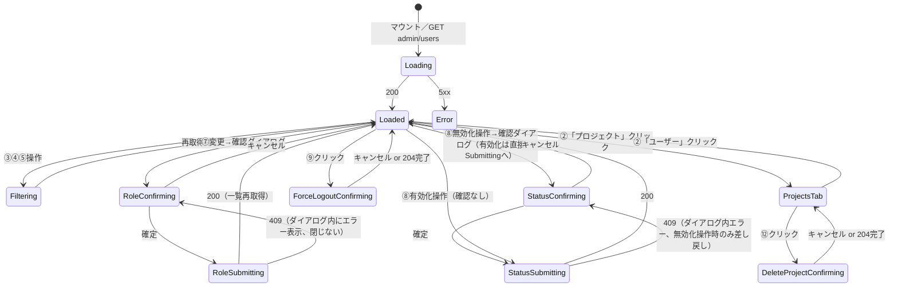
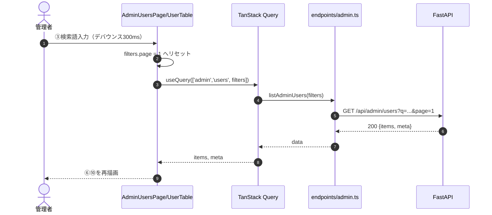
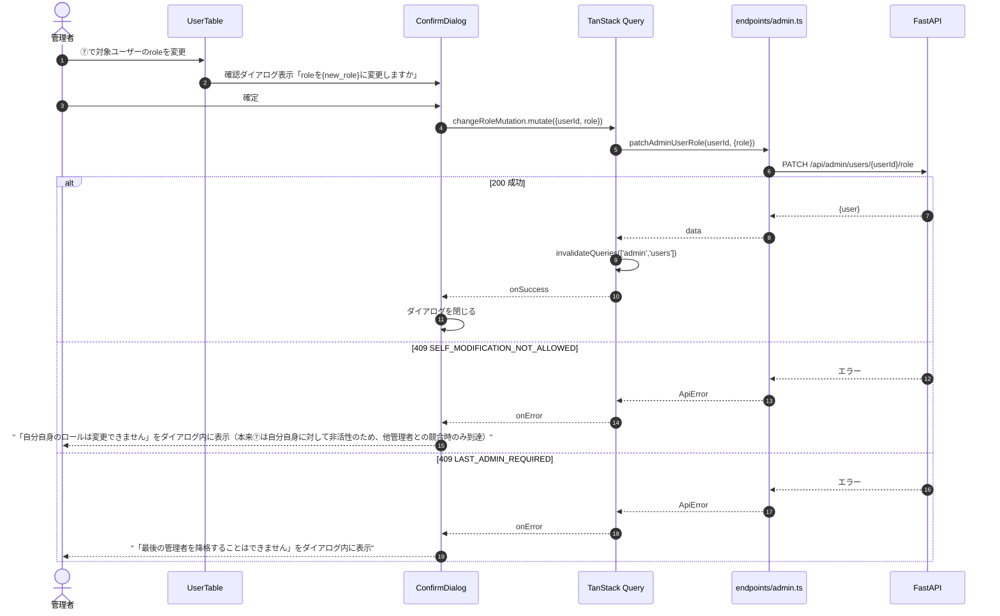
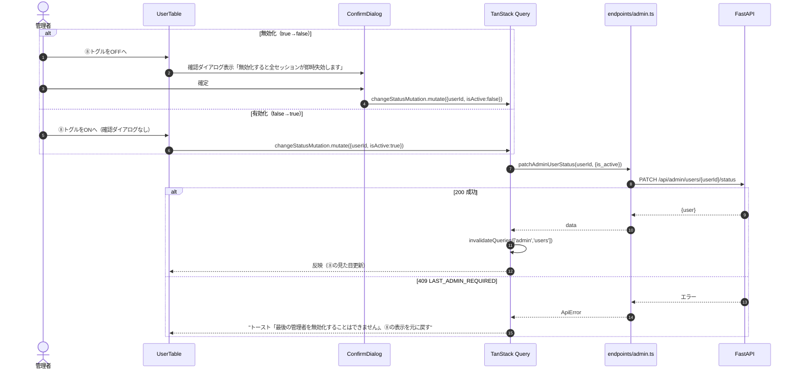
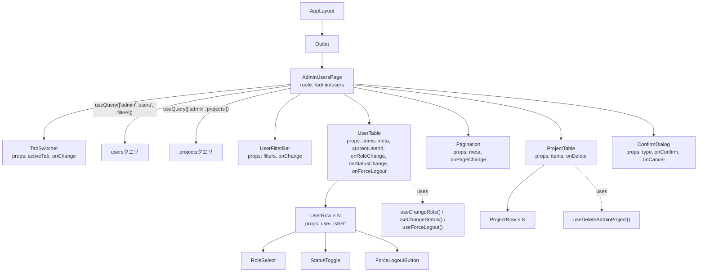
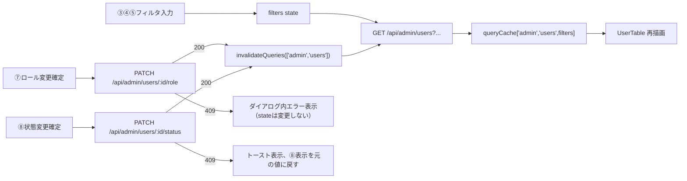

# 管理者ユーザー管理画面詳細設計（/admin/users）

## 0. 関連ドキュメント

| ドキュメント | 内容 |
|--------------|------|
| [../../basic_design/05_frontend.md](../../basic_design/05_frontend.md) | §2 ルーティング（adminのみ）、§3 共通レイアウト（「管理」タブ）、§7.7 管理者ユーザー管理仕様 |
| [../../basic_design/04_api.md](../../basic_design/04_api.md) | §2.5 管理者API一覧、§4.2 `SELF_MODIFICATION_NOT_ALLOWED`/`LAST_ADMIN_REQUIRED` |
| [../api/admin/01_get_admin_users.md](../api/admin/01_get_admin_users.md) | ユーザー一覧取得（検索・ページング） |
| [../api/admin/02_patch_admin_user_role.md](../api/admin/02_patch_admin_user_role.md) | ロール変更 |
| [../api/admin/03_patch_admin_user_status.md](../api/admin/03_patch_admin_user_status.md) | 有効化/無効化 |
| [../api/admin/04_post_admin_user_force_logout.md](../api/admin/04_post_admin_user_force_logout.md) | 強制ログアウト |
| [../api/admin/05_get_admin_projects.md](../api/admin/05_get_admin_projects.md) | 全プロジェクト一覧取得 |
| [../api/admin/06_delete_admin_project.md](../api/admin/06_delete_admin_project.md) | プロジェクト削除 |

## 1. 概要

| 項目 | 内容 |
|------|------|
| 画面名 / パス | 管理者ユーザー管理画面 / `/admin/users` |
| レイアウト | `AppLayout`（サイドバーの「管理」から遷移） |
| ガード | `admin`のみ。`RequireAdmin`で`role !== 'admin'`の場合は`/`へリダイレクトする。サイドバーの「管理」リンク自体も`role !== 'admin'`では描画しない（[05_frontend.md §3](../../basic_design/05_frontend.md#3-共通レイアウト)） |
| 対応要件 | 要件書§2-7 |
| 主なユースケース | 全ユーザーの検索・閲覧、ロール変更、有効/無効切替、強制ログアウト、全プロジェクトの閲覧・削除 |
| 実装ファイル | `frontend/src/features/admin/pages/AdminUsersPage.tsx`、`frontend/src/features/admin/components/UserTable.tsx`、`frontend/src/features/admin/components/ProjectTable.tsx`、`frontend/src/features/admin/hooks/useAdminUsers.ts`、`frontend/src/features/admin/hooks/useAdminProjects.ts` |

## 2. 画面レイアウト

```
┌──────────────────────────────────────────────────────────────────┐
│①≡│                  Cerberus                                    │
├──┴──────────────────────────────────────────────────────────────┤
│┌────────┐┌────────────────────────────────────────────────────┐│
││Sidebar ││ [②タブ: ユーザー | プロジェクト]                     ││
││ 管理(*)││                                                      ││
││        ││ === ユーザータブ ===                                 ││
││        ││ [③検索input] [④role絞込] [⑤is_active絞込]           ││
││        ││ ┌──────────────────────────────────────────────┐   ││
││        ││ │username│email│氏名│role│有効│操作          │   ││
││        ││ ├──────────────────────────────────────────────┤   ││
││        ││ │⑥taro   │…   │…  │⑦[member▼]│⑧[toggle]│⑨強制LO│   ││
││        ││ │…N件…                                        │   ││
││        ││ └──────────────────────────────────────────────┘   ││
││        ││ [⑩ページネーション]                                 ││
││        ││                                                      ││
││        ││ === プロジェクトタブ ===                             ││
││        ││ ┌──────────────────────────────────────────────┐   ││
││        ││ │プロジェクト名│オーナー│メンバー数│操作         │   ││
││        ││ ├──────────────────────────────────────────────┤   ││
││        ││ │⑪Cerberus開発 │taro   │3        │⑫[削除]     │   ││
││        ││ └──────────────────────────────────────────────┘   ││
│└────────┘└────────────────────────────────────────────────────┘│
└──────────────────────────────────────────────────────────────────┘
```

- ⑦ロールセレクトと⑧有効/無効トグルは、対象行が現在ログイン中の管理者自身（`user.id === authStore.user.id`）の場合は非活性化しツールチップ「自分自身は変更できません」を表示する（自己変更禁止のUI抑止。§3参照）
- ⑨強制ログアウトボタンは自分自身に対しても活性のまま（自己対象の禁止規定がAPI側にないため。[04_post_admin_user_force_logout.md](../api/admin/04_post_admin_user_force_logout.md) §13）
- レスポンシブ：幅768px未満ではテーブルを横スクロール可能な`overflow-x: auto`コンテナに収め、列の折り返しは行わない

## 3. UI要素仕様

| No | 要素 | 種別 | 初期値 | 入力制約 | 活性条件 | イベント／遷移 |
|----|------|------|--------|----------|----------|----------------|
| ① | ハンバーガー | button | `uiStore.sidebarOpen` | - | 常時 | サイドバー開閉 |
| ② | タブ切替 | tab | `'users'` | `'users' \| 'projects'` | 常時 | 切替でクエリを差し替え（URLクエリ`?tab=projects`等には同期しない。要検討：§15） |
| ③ | 検索input | text input | `""` | 100文字以内 | 常時活性 | 入力デバウンス（300ms）後に`page=1`へリセットして再取得 |
| ④ | roleフィルタ | select | `''`（全件） | `''`/`member`/`admin` | 常時活性 | 変更で`page=1`へリセットして再取得 |
| ⑤ | is_activeフィルタ | select | `''`（全件） | `''`/`true`/`false` | 常時活性 | 変更で`page=1`へリセットして再取得 |
| ⑥ | ユーザー行 | table row | `items[i]` | - | 常時 | - |
| ⑦ | ロール変更セレクト | select | `user.role` | `member`/`admin` | `user.id !== currentUser.id`（自分自身は非活性。§2参照） | 変更確定で確認ダイアログ→`PATCH .../role` |
| ⑧ | 有効/無効トグル | switch | `user.is_active` | - | `user.id !== currentUser.id` | 無効化操作のみ確認ダイアログを挟む（有効化は即時反映）。§7.2参照 |
| ⑨ | 強制ログアウトボタン | button | - | - | 常時活性 | クリックで確認ダイアログ→確定で`POST .../force-logout` |
| ⑩ | ページネーション | pagination | `meta.page`等 | - | `meta.total_pages > 1` | ページ番号クリックで該当ページを再取得 |
| ⑪ | プロジェクト行 | table row | `items[i]` | - | 常時 | - |
| ⑫ | プロジェクト削除ボタン | button | - | - | 常時活性 | クリックで確認ダイアログ→確定で`DELETE /admin/projects/{id}` |

## 4. 使用API

| No | 呼び出しタイミング | メソッド／パス | 送信内容 | 成功時処理 | 失敗時処理 | queryKey / mutationKey |
|----|--------------------|-----------------|----------|------------|------------|--------------------------|
| 1 | ユーザータブ表示時／③④⑤変更／⑩ページ切替 | GET `/admin/users` | `?page&per_page&q&role&is_active` | `items`/`meta`を⑥へ描画 | 403は`RequireAdmin`で到達しない想定。5xxはトースト＋再試行ボタン | `queryKey: ['admin','users',{page,perPage,q,role,isActive}]` |
| 2 | ⑦変更確定 | PATCH `/admin/users/{id}/role` | `{role}` | `invalidateQueries(['admin','users'])`、確認ダイアログを閉じる | `409 SELF_MODIFICATION_NOT_ALLOWED`／`409 LAST_ADMIN_REQUIRED`はダイアログ内にエラー表示し確定させない | `mutationKey: ['admin','changeRole', userId]` |
| 3 | ⑧トグル操作確定 | PATCH `/admin/users/{id}/status` | `{is_active}` | `invalidateQueries(['admin','users'])` | ⑦と同様の409、404は一覧再取得 | `mutationKey: ['admin','changeStatus', userId]` |
| 4 | ⑨確認ダイアログ確定 | POST `/admin/users/{id}/force-logout` | パスパラメータのみ | トースト「対象ユーザーを強制ログアウトしました」 | 404は一覧再取得＋トースト | `mutationKey: ['admin','forceLogout', userId]` |
| 5 | プロジェクトタブ表示時 | GET `/admin/projects` | クエリなし（要検討：§15、ページング要否） | `items`を⑪へ描画 | 5xxはトースト＋再試行ボタン | `queryKey: ['admin','projects']` |
| 6 | ⑫確認ダイアログ確定 | DELETE `/admin/projects/{id}` | パスパラメータのみ | `invalidateQueries(['admin','projects'])`、確認ダイアログを閉じる | 404は一覧再取得、5xxはトースト | `mutationKey: ['admin','deleteProject', projectId]` |

## 5. 状態管理

| 区分 | 名称 | 型 | 初期値 | 更新契機 | 永続化 |
|------|------|----|--------|----------|--------|
| ローカルstate | `activeTab` | `'users' \| 'projects'` | `'users'` | ②クリック | なし |
| ローカルstate | `filters` | `{page, perPage, q, role, isActive}` | `{page:1, perPage:20, q:'', role:'', isActive:''}` | ③④⑤⑩操作 | なし |
| ローカルstate | `confirmDialog` | `{type:'role'\|'status'\|'forceLogout'\|'deleteProject'; targetId:string; payload?:unknown} \| null` | `null` | ⑦⑧⑨⑫クリック、確定／キャンセル | なし |
| Zustand `authStore` | `user`（`id`, `role`） | - | §5.1参照（[05_frontend.md §5](../../basic_design/05_frontend.md#5-状態管理)） | ログイン時 | しない |
| TanStack Query | `['admin','users', filters]` | `AdminUserListResponse` | 未取得 | `filters`変更時にfetch、ロール変更／状態変更成功時に`invalidate` | しない |
| TanStack Query | `['admin','projects']` | `AdminProjectListResponse` | 未取得 | プロジェクトタブ表示時にfetch、削除成功時に`invalidate` | しない |

## 6. 画面状態遷移図



## 7. 処理シーケンス

### 7.1 ユーザー一覧の検索・ページング



### 7.2 ロール変更（自己変更・最後のadmin保護）



### 7.3 有効化/無効化



## 8. コンポーネント構成・相関図



## 9. 関数・カスタムフック詳細

### 9.1 `hooks/useAdminUsers.ts :: useAdminUsers`

| 項目 | 内容 |
|------|------|
| シグネチャ | `function useAdminUsers(filters: AdminUserFilters): UseQueryResult<AdminUserListResponse, ApiError>` |
| 引数 | `filters`：`{page, perPage, q, role, isActive}` |
| 戻り値 | `items`/`meta`を含む`AdminUserListResponse` |
| 処理内容 | 1. `queryKey: ['admin','users', filters]` 2. `queryFn`に`endpoints/admin.ts :: listAdminUsers(filters)` 3. `keepPreviousData: true`（ページ切替時のちらつき防止） |
| 副作用 | `GET /api/admin/users` 呼び出し |

### 9.2 `hooks/useAdminUsers.ts :: useChangeRole`

| 項目 | 内容 |
|------|------|
| シグネチャ | `function useChangeRole(): UseMutationResult<AdminUserDetail, ApiError, { userId: string; role: 'member' \| 'admin' }>` |
| 引数 | なし |
| 戻り値 | `mutation`オブジェクト |
| 処理内容 | 1. `endpoints/admin.ts :: patchAdminUserRole(userId, {role})`を呼ぶ 2. `onSuccess`：`queryClient.invalidateQueries(['admin','users'])` |
| 副作用 | `PATCH /api/admin/users/{id}/role`、キャッシュ無効化 |

### 9.3 `components/UserRow.tsx :: isSelf`

| 項目 | 内容 |
|------|------|
| シグネチャ | `function isSelf(targetUserId: string, currentUserId: string): boolean` |
| 引数 | `targetUserId`：行のユーザーID、`currentUserId`：`authStore.user.id` |
| 戻り値 | 一致すれば`true` |
| 処理内容 | 1. 単純な文字列比較 2. `true`の場合、呼び出し元（`UserRow`）が⑦⑧を非活性化しツールチップを表示する |
| 副作用 | なし |

### 9.4 `components/AdminUsersPage.tsx :: handleStatusToggle`

| 項目 | 内容 |
|------|------|
| シグネチャ | `function handleStatusToggle(user: AdminUserSummary, nextIsActive: boolean): void` |
| 引数 | `user`：対象ユーザー、`nextIsActive`：トグル後の値 |
| 戻り値 | なし |
| 処理内容 | 1. `nextIsActive === false`（無効化方向）の場合のみ`confirmDialog`をセットしてダイアログ表示を待つ 2. `nextIsActive === true`（有効化方向）の場合は確認なしで即座に`useChangeStatus().mutate({userId: user.id, isActive: true})`を呼ぶ |
| 副作用 | `confirmDialog`state更新、または即時API呼び出し |

## 10. バリデーション

| フィールド | zodスキーマ | ルール | エラーメッセージ | バックエンド対応 |
|-----------|-------------|--------|-------------------|-------------------|
| ③検索語 | `adminUserFilterSchema.q` | `z.string().max(100)` | - | pydantic `AdminUserListQuery.q`（[01_get_admin_users.md](../api/admin/01_get_admin_users.md) §10） |
| ④roleフィルタ | `adminUserFilterSchema.role` | `z.enum(['member','admin']).optional()` | - | 同上 |
| ⑤is_activeフィルタ | `adminUserFilterSchema.isActive` | `z.boolean().optional()` | - | 同上 |
| ⑦ロール変更 | `roleChangeSchema.role` | `z.enum(['member','admin'])` | - | pydantic `AdminUserRoleUpdateRequest.role` |
| ⑧状態変更 | `statusChangeSchema.isActive` | `z.boolean()` | - | pydantic `AdminUserStatusUpdateRequest.is_active` |

## 11. エラーハンドリング

| APIエラーコード / HTTP | 画面表示 | 遷移 | 再試行導線 |
|--------------------------|----------|------|------------|
| 403 `FORBIDDEN`（`role!=admin`でのAPI直叩き等） | `RequireAdmin`により本画面自体に到達しないため通常発生しない。念のためのフォールバックとしてトースト＋`/`へリダイレクト | `/` | - |
| 409 `SELF_MODIFICATION_NOT_ALLOWED` | 確認ダイアログ内にエラー表示、ダイアログは閉じない | なし | ダイアログをキャンセルして操作をやり直す |
| 409 `LAST_ADMIN_REQUIRED` | 確認ダイアログ内（ロール変更時）／一覧上トースト（無効化時、⑧の表示を元に戻す） | なし | 別の管理者を先に昇格させてから再操作 |
| 404 `NOT_FOUND`（ユーザー／プロジェクト） | トースト「対象が見つかりません」＋一覧再取得 | なし | 一覧最新化後に再操作 |
| 422 `VALIDATION_ERROR`（フィルタ） | フィルタ入力欄にエラー表示 | なし | 修正して再送信 |
| 5xx | 共通トースト＋一覧に再試行ボタン | なし | 再試行 |

## 12. データ遷移図



## 13. アクセシビリティ・表示設定

| 項目 | 内容 |
|------|------|
| 文字サイズ | `--font-scale`に追従。テーブルは`rem`基準の`min-width`を持つセルで構成し、拡大時も横スクロールで対応する |
| キーボード操作 | ②タブは矢印キーで切替（`role="tablist"`）。テーブル内はTabで行順に移動、⑦⑧⑨はそれぞれ独立してフォーカス可能 |
| `aria-*` | ②に`role="tablist"`/`role="tab"` `aria-selected`。⑧に`role="switch" aria-checked`。確認ダイアログに`role="alertdialog"`（破壊的操作のため） |
| フォーカス管理 | 確認ダイアログ表示時はダイアログ内の確定ボタンへフォーカス、キャンセル／確定後は操作元の⑦⑧⑨⑫へフォーカスを戻す |

## 14. テスト設計

| No | 区分 | ケース | 前提（MSWのモック応答等） | 期待結果 | テスト名案 |
|----|------|--------|----------------------------|----------|-------------|
| 1 | 単体 | `isSelf`の判定 | `targetUserId === currentUserId` | `true` | `isSelf returns true when ids match` |
| 2 | 単体（zod） | 検索語101文字 | - | バリデーションエラー | `adminUserFilterSchema rejects q over 100 chars` |
| 3 | コンポーネント | 自分自身の行は⑦⑧が非活性 | `currentUser.id`と一致する行を含む一覧 | 該当行の⑦⑧が`disabled` | `UserRow disables role select and status toggle for self` |
| 4 | コンポーネント | ロール変更成功 | `PATCH .../role` → 200 | 一覧が再取得され新しいroleが表示される | `UserTable reflects role change after success` |
| 5 | コンポーネント | ロール変更で409 LAST_ADMIN_REQUIRED | `PATCH .../role` → 409 | ダイアログ内にエラーメッセージ表示、ダイアログは閉じない | `UserTable shows last-admin error inside confirm dialog` |
| 6 | コンポーネント | 無効化操作は確認ダイアログを経由する | ⑧をOFFへ操作 | `PATCH .../status`が確認ダイアログの確定後にのみ呼ばれる | `UserRow requires confirmation before deactivating` |
| 7 | コンポーネント | 有効化操作は確認なしで即時反映 | ⑧をONへ操作 | 確認ダイアログなしで`PATCH .../status`が呼ばれる | `UserRow reactivates without confirmation dialog` |
| 8 | コンポーネント | 強制ログアウト成功 | `POST .../force-logout` → 204 | 成功トースト表示 | `UserRow shows success toast after force logout` |
| 9 | コンポーネント | 検索語入力のデバウンス | ③に連続入力 | APIが300ms後に1回だけ呼ばれる | `UserFilterBar debounces search input` |
| 10 | コンポーネント | プロジェクト削除確認とキャンセル | ⑫クリック→キャンセル | `DELETE`が呼ばれない | `ProjectTable cancels delete confirmation without calling API` |
| 11 | コンポーネント | プロジェクト削除成功 | `DELETE /admin/projects/:id` → 204 | 一覧から対象行が消える | `ProjectTable removes row after successful delete` |
| 12 | 結合 | `role=member`ユーザーが`/admin/users`へ直接アクセス | `authStore.user.role='member'` | `/`へリダイレクトされる | `RequireAdmin redirects non-admin user away from /admin/users` |
| 13 | 結合 | サイドバーの「管理」タブがmemberには表示されない | `role='member'` | Sidebarに「管理」リンクが描画されない | `Sidebar hides admin link for member role`（[05_frontend.md §3](../../basic_design/05_frontend.md#3-共通レイアウト)参照。実装は`Sidebar`側だが本画面へのアクセス経路として検証） |
| 14 | 結合 | ページネーション操作 | ユーザー25件（1ページ20件） | 2ページ目クリックで残り5件が表示される | `UserTable paginates through GET /admin/users` |

## 15. 不明点・要検討事項

| 区分 | 内容 | 影響 |
|------|------|------|
| 要検討 | タブの選択状態（②）をURLクエリ（例：`?tab=projects`）に同期させ、リロード・共有時にタブ状態を保持すべきかは基本設計（[05_frontend.md §7.7](../../basic_design/05_frontend.md#77-管理者ユーザー管理)）に明記がない。本設計ではローカルstateのみとし同期させない方針とした | リロード時に常にユーザータブへ戻る点のUX確認が必要 |
| 要検討 | `GET /admin/projects`のページング・検索要否（[admin/05_get_admin_projects.md](../api/admin/05_get_admin_projects.md)側の設計）が未確定のため、本画面のプロジェクトタブはページングなしの全件表示として設計した。同APIがページングを採用する場合は⑩相当のページネーションをプロジェクトタブにも追加する必要がある | プロジェクト件数が多い場合の表示性能・UI追加要否 |
| 要検討 | プロジェクト削除（⑫）にタスク・コメントもCASCADE削除される旨の警告文言を確認ダイアログに含めるべきかは画面設計側の裁量とした（基本設計にはCASCADEの事実のみ記載） | 誤削除時の影響範囲をユーザーが認識できるかどうか |
| なし | 上記以外 | - |
