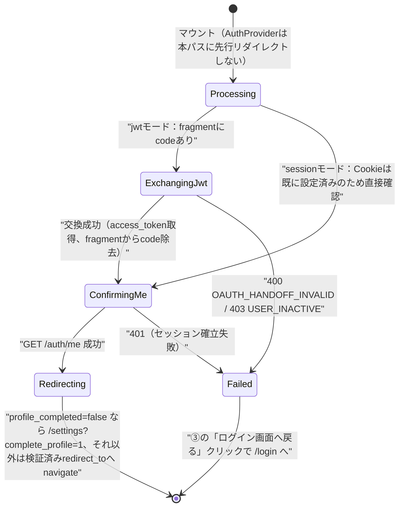
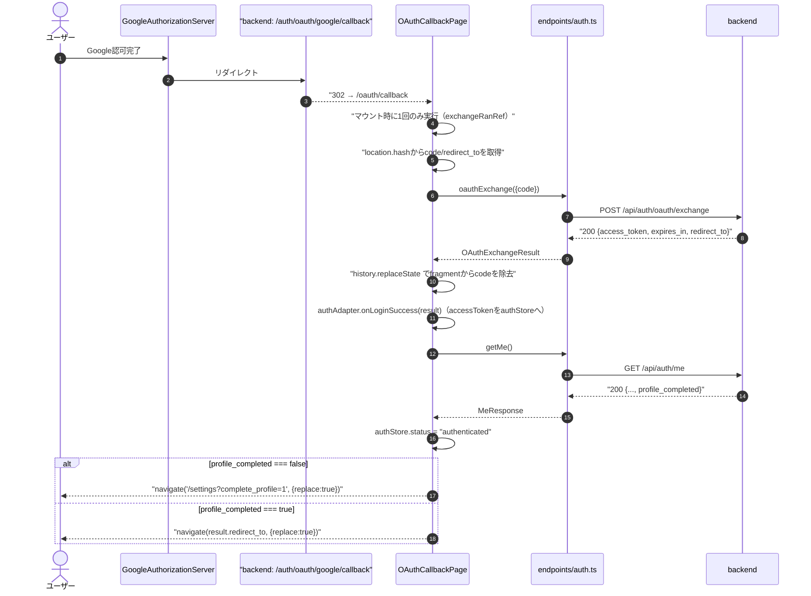
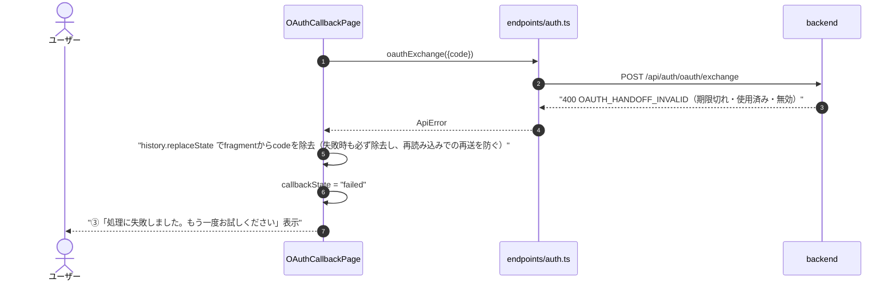
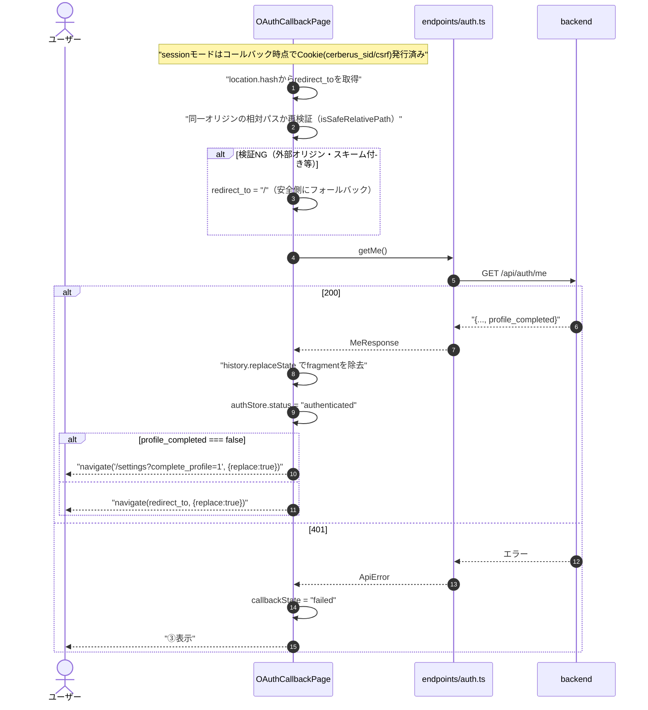
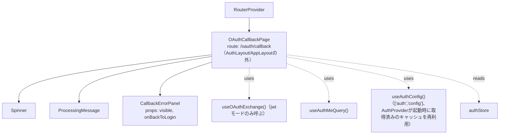
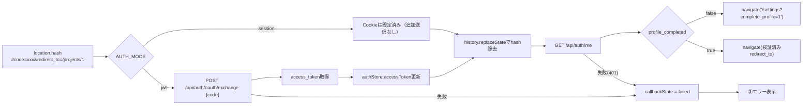

# OAuthコールバック中継画面詳細設計（/oauth/callback）

## 0. 関連ドキュメント

| ドキュメント | 内容 |
|--------------|------|
| [../../basic_design/05_frontend.md](../../basic_design/05_frontend.md) | §2 ルーティング（No.11）、§6.1 interceptorの流れ（OAuth callbackの優先）、§7.3.1 OAuthコールバック中継 |
| [../../basic_design/03_auth.md](../../basic_design/03_auth.md) | §5.4 jwtモードでのトークン受け渡し |
| [../api/auth/13_post_auth_oauth_exchange.md](../api/auth/13_post_auth_oauth_exchange.md) | `POST /api/auth/oauth/exchange` 詳細（jwtモードのハンドオフコード交換） |
| [../api/auth/04_get_auth_me.md](../api/auth/04_get_auth_me.md) | `GET /api/auth/me` 詳細（セッション確認） |
| [../api/auth/12_get_auth_oauth_google_callback.md](../api/auth/12_get_auth_oauth_google_callback.md) | `GET /api/auth/oauth/google/callback`（本画面へのリダイレクト元） |
| [./01_login.md](./01_login.md) | ログイン画面（Googleログインボタンの起点、失敗時の遷移先） |
| [./09_settings.md](./09_settings.md) | アカウント設定画面（`profile_completed=false`時の遷移先） |

## 1. 概要

| 項目 | 内容 |
|------|------|
| 画面名 / パス | OAuthコールバック中継画面 / `/oauth/callback` |
| レイアウト | なし（ローディング表示のみ。`AuthLayout`/`AppLayout`いずれにも属さない） |
| ガード | 不要。`AuthProvider`は本パスに限り未認証でも先行して`/login`へリダイレクトしない例外パスとして扱う（[05_frontend.md §6.1](../../basic_design/05_frontend.md#61-interceptorの流れ)「OAuth callbackの優先」） |
| 対応要件 | 要件書§3.1（認証機能、Google OAuth2ログイン）。[05_frontend.md §2](../../basic_design/05_frontend.md#2-画面一覧とルーティング) ルーティング一覧No.11 |
| 主なユースケース | Google認可後のリダイレクト先として、認証状態を確定させ本来の遷移先へ中継する。ユーザーが直接操作する要素は持たない |
| 実装ファイル | `src/features/auth/pages/OAuthCallbackPage.tsx` |

## 2. 画面レイアウト

```
┌───────────────────────────────────────────┐
│                                             │
│                                             │
│              ①ローディングスピナー          │
│         ②「ログイン処理中です…」            │
│                                             │
│  [③エラー時のみ：処理に失敗しました          │
│      ログイン画面へ戻る                    ]│
│                                             │
└───────────────────────────────────────────┘
```

- 通常は①②のみが一瞬表示され、処理完了後は即座に`redirect_to`（または`/settings?complete_profile=1`）へ`navigate`するため、ユーザーが本画面を長く視認することは想定しない
- ③は交換・確認に失敗した場合のみ表示し、③以外の要素は表示しない（フォーム等は持たない）
- レスポンシブ：画面中央固定のため幅による表示差分はない。文字サイズは`--font-scale`に連動（§13参照）

## 3. UI要素仕様

| No | 要素 | 種別 | 初期値 | 入力制約 | 活性条件 | イベント／遷移 |
|----|------|------|--------|----------|----------|----------------|
| ① | ローディングスピナー | spinner | 表示 | - | `callbackState === 'processing'` | - |
| ② | 処理中メッセージ | 静的テキスト | "ログイン処理中です…" | - | ①と同時 | - |
| ③ | 失敗時メッセージ＋戻るリンク | Alert(error) + link | 非表示 | - | `callbackState === 'failed'` | クリックで`/login`へ`navigate`（`replace: true`） |

## 4. 使用API

| No | 呼び出しタイミング | メソッド／パス | 送信内容 | 成功時処理 | 失敗時処理 | queryKey / mutationKey |
|----|--------------------|-----------------|----------|------------|------------|--------------------------|
| 1 | マウント時（jwtモードのみ） | POST `/auth/oauth/exchange` | `{code}`（`location.hash`から取得した一時コード） | `access_token`を`authStore`へ保存。直後に`history.replaceState`でfragmentからcodeを除去 | `400 OAUTH_HANDOFF_INVALID`／`403 USER_INACTIVE`は③表示。**一時codeは失敗時も再送しない**（§7.2参照） | `mutationKey: ['auth','oauthExchange']` |
| 2 | 1の成功後（jwt）、またはマウント時（session、Cookieは既にコールバックで設定済みのため直接） | GET `/auth/me` | - | `authStore`を`authenticated`に更新。`profile_completed`を確認 | 401はセッション確立失敗として③表示 | `queryKey: ['auth','me']` |

## 5. 状態管理

| 区分 | 名称 | 型 | 初期値 | 更新契機 | 永続化 |
|------|------|----|--------|----------|--------|
| ローカルstate | `callbackState` | `'processing' \| 'failed'` | `'processing'` | 交換・確認の成否 | なし |
| ローカルstate | `exchangeRanRef`（`useRef`） | `boolean` | `false` | マウント時に1度だけ実行するためのフラグ（`StrictMode`の二重実行防止） | なし（レンダー間で保持するがstateではない） |
| Zustand `authStore` | `user`, `status`, `accessToken`, `authAdapter` | - | [05_frontend.md §5](../../basic_design/05_frontend.md#5-状態管理)参照 | 交換・`/auth/me`成功時に更新 | しない |
| React Router `location.hash` | `code`, `redirect_to`（sessionモードのみ`redirect_to`をfragmentで受け取る想定） | - | コールバックからのリダイレクト時のみ | 使用後に`history.replaceState`で除去 | なし |

## 6. 画面状態遷移図



## 7. 処理シーケンス

### 7.1 jwtモード：fragmentのcode交換 → `/auth/me` → リダイレクト



### 7.2 交換失敗（一時codeは再送しない）



### 7.3 sessionモード：Cookie確認 → redirect_to検証 → リダイレクト



## 8. コンポーネント構成・相関図



## 9. 関数・カスタムフック詳細

### 9.1 `hooks/useOAuthExchange.ts :: useOAuthExchange`

| 項目 | 内容 |
|------|------|
| シグネチャ | `function useOAuthExchange(): UseMutationResult<OAuthExchangeResult, ApiError, { code: string }>` |
| 引数 | なし |
| 戻り値 | `mutation`オブジェクト |
| 処理内容 | 1. `endpoints/auth.ts#oauthExchange`を呼ぶ 2. 成功時は`authAdapter.onLoginSuccess`相当の処理で`accessToken`を`authStore`へ保存 |
| 副作用 | API呼び出し、`authStore`更新 |

### 9.2 `pages/OAuthCallbackPage.tsx :: runCallback`

| 項目 | 内容 |
|------|------|
| シグネチャ | `async function runCallback(): Promise<void>` |
| 引数 | なし（`useEffect`内から1回のみ呼ばれる） |
| 戻り値 | なし |
| 処理内容 | 1. `exchangeRanRef.current`が`true`なら即return（`StrictMode`二重実行防止） 2. `exchangeRanRef.current = true` 3. `location.hash`を解析し`code`/`redirect_to`を取得 4. `authConfig.auth_mode === 'jwt'`の場合のみ`useOAuthExchange().mutateAsync({code})`を実行し、成功後の`redirect_to`をレスポンス値で上書き 5. `sessionモード`または`jwt`交換成功後、`history.replaceState(null, '', '/oauth/callback')`でfragmentを除去 6. `getMe()`相当（`useAuthMeQuery`のrefetch）を実行 7. 成功時：`profile_completed`を判定し、`false`なら`/settings?complete_profile=1`、`true`なら検証済み`redirect_to`へ`navigate(..., {replace:true})` 8. いずれかの段階で失敗した場合は`callbackState = 'failed'`とし、fragmentは既に除去済みのため再送は発生しない |
| 副作用 | API呼び出し（交換・`/auth/me`）、`history.replaceState`、`authStore`更新、ルーティング |

### 9.3 `utils/url.ts :: isSafeRelativePath`

| 項目 | 内容 |
|------|------|
| シグネチャ | `function isSafeRelativePath(path: string \| null \| undefined): path is string` |
| 引数 | `path`：fragmentから取得した`redirect_to`候補（sessionモードのみフロントで再検証。jwtモードはサーバーが正規化済みの値をレスポンスで返すため不要） |
| 戻り値 | `/`で始まり`//`や`\`で始まらず、`:`（スキーム区切り）を含まない場合のみ`true` |
| 処理内容 | 1. `path`が`null`/空文字なら`false` 2. 先頭が`/`かつ2文字目が`/`でないことを確認（`//evil.com`のようなプロトコル相対URLを拒否） 3. `path`に`:`が含まれないことを確認（`javascript:`等のスキーム注入を拒否） |
| 副作用 | なし |

## 10. バリデーション

zodによるフォーム入力は存在しない（本画面はフォームを持たない）。`redirect_to`の安全性検証は9.3の`isSafeRelativePath`（プレーンなTypeScript関数）で行い、zodスキーマ化はしない。

## 11. エラーハンドリング

| APIエラーコード / HTTP | 画面表示 | 遷移 | 再試行導線 |
|--------------------------|----------|------|------------|
| 400 `OAUTH_HANDOFF_INVALID`（jwt交換） | ③「ログインセッションの有効期限が切れました。もう一度お試しください」 | なし（ユーザー操作で`/login`へ） | `/login`から再度Googleログインをやり直す（一時codeは再送しない。§7.2） |
| 403 `USER_INACTIVE`（jwt交換） | ③「アカウントが無効化されています。管理者にお問い合わせください」 | なし | なし（管理者対応待ち） |
| 401（session、`/auth/me`失敗） | ③「ログイン処理に失敗しました」 | なし | `/login`から再試行 |
| fragmentに`code`（jwt）も有効なCookie（session）も無い | ③「不正なアクセスです」 | なし | `/login`へ戻る |
| ネットワークエラー | ③共通トースト＋メッセージ | なし | `/login`へ戻ってから再試行 |

## 12. データ遷移図



## 13. アクセシビリティ・表示設定

| 項目 | 内容 |
|------|------|
| 文字サイズ | `--font-scale`に連動（`rem`指定） |
| キーボード操作 | 通常は自動遷移のためユーザー操作を要さない。③表示時のみ「ログイン画面へ戻る」リンクにTabで到達可能 |
| `aria-*` | ②に`role="status" aria-live="polite"`（スクリーンリーダーへ処理中を通知）。③に`role="alert"` |
| フォーカス管理 | マウント時にフォーカス移動は行わない（自動遷移が主のため）。③表示時のみ「ログイン画面へ戻る」リンクへフォーカスを移動する |

## 14. テスト設計

| No | 区分 | ケース | 前提（MSWのモック応答等） | 期待結果 | テスト名案 |
|----|------|--------|----------------------------|----------|-------------|
| 1 | 単体 | `isSafeRelativePath`：正常な相対パス | `"/projects/1"` | `true` | `isSafeRelativePath accepts same-origin relative path` |
| 2 | 単体 | `isSafeRelativePath`：プロトコル相対URL | `"//evil.com"` | `false` | `isSafeRelativePath rejects protocol-relative url` |
| 3 | 単体 | `isSafeRelativePath`：スキーム注入 | `"javascript:alert(1)"` | `false` | `isSafeRelativePath rejects scheme injection` |
| 4 | 単体 | `runCallback`の二重実行防止 | `useEffect`を2回発火させる（`StrictMode`相当） | `oauthExchange`が1回しか呼ばれない | `OAuthCallbackPage runs exchange only once under StrictMode` |
| 5 | コンポーネント | jwtモード正常系 | `POST /auth/oauth/exchange` → 200、`GET /auth/me` → 200 `profile_completed:true` | `navigate(redirect_to)`が呼ばれる | `OAuthCallbackPage redirects to redirect_to on jwt success` |
| 6 | コンポーネント | jwtモードで`profile_completed:false` | 同上だが`profile_completed:false` | `navigate('/settings?complete_profile=1')`が優先される | `OAuthCallbackPage prioritizes profile completion redirect` |
| 7 | コンポーネント | jwt交換失敗 | `POST /auth/oauth/exchange` → 400 `OAUTH_HANDOFF_INVALID` | ③表示、`history.replaceState`でhashが除去される | `OAuthCallbackPage shows error and clears hash on exchange failure` |
| 8 | コンポーネント | sessionモード正常系 | fragmentに`redirect_to`のみ、`GET /auth/me` → 200 | `navigate(redirect_to)`が呼ばれ、`POST /auth/oauth/exchange`は呼ばれない | `OAuthCallbackPage skips exchange call in session mode` |
| 9 | コンポーネント | sessionモードで不正な`redirect_to` | `redirect_to="//evil.com"` | `navigate('/')`（フォールバック）が呼ばれる | `OAuthCallbackPage falls back to root for unsafe redirect_to in session mode` |
| 10 | 結合 | `AuthProvider`が本パスで先行リダイレクトしない | 未認証状態でCookie/access_tokenがまだ無い瞬間に本画面へ遷移 | `/login`への強制リダイレクトが発生せず`OAuthCallbackPage`自身の処理が先に走る | `AuthProvider does not preempt redirect on /oauth/callback` |
| 11 | 結合 | `/auth/me`が401 | `GET /auth/me` → 401 | ③表示 | `OAuthCallbackPage shows error when session confirmation fails` |
| 網羅できない範囲 | - | 実際のGoogle認可画面遷移、ブラウザの`window.location.hash`書き換えタイミングの実機挙動 | - | jsdom環境では実ナビゲーションを検証できないため、`location.hash`をモックした単体・コンポーネントテストに留め、実操作は手動確認とする | - |

## 15. 不明点・要検討事項

| 区分 | 内容 | 影響 |
|------|------|------|
| 要検討 | sessionモードでの`redirect_to`のfragment受け渡し形式（キー名・URLエンコード方式）が基本設計（[05_frontend.md §2](../../basic_design/05_frontend.md#2-画面一覧とルーティング) No.11、[03_auth.md §5.4](../../basic_design/03_auth.md#54-jwt-モードでのトークン受け渡し)）に厳密なフォーマット定義がなく、本書では`#redirect_to=...`形式を前提とした。バックエンド（`GET /auth/oauth/google/callback`）側の実際のfragment組み立て仕様との整合を要確認 | fragment解析処理の実装がバックエンド仕様とずれるリスク |
| 不明 | `profile_completed=false`による`/settings?complete_profile=1`への優先遷移は、jwt（レスポンスの`redirect_to`を破棄）・session（fragmentの`redirect_to`を破棄）のいずれの経路でも同様に適用されるが、元の`redirect_to`（例：招待リンク経由の特定プロジェクトURL）を設定完了後に復元する導線が基本設計に明記されていない。本設計では復元せず`/settings`完了後は`/`へ遷移する前提とした | プロフィール未補完のOAuth新規ユーザーが招待リンク経由で登録した場合、元の遷移先を失う可能性 |
