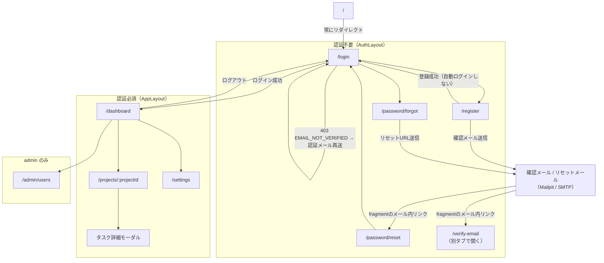
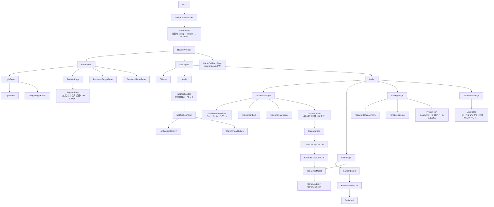
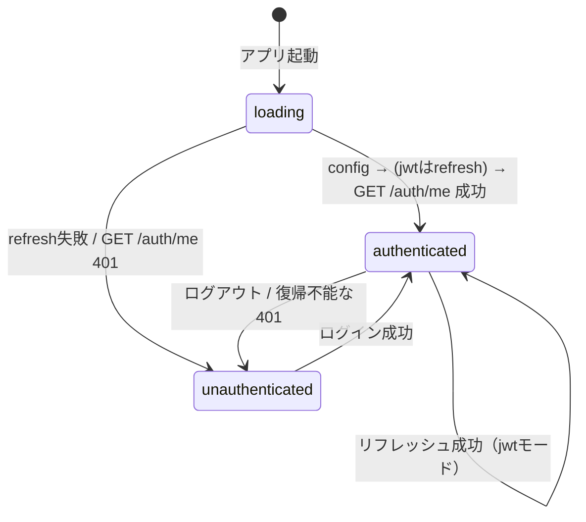
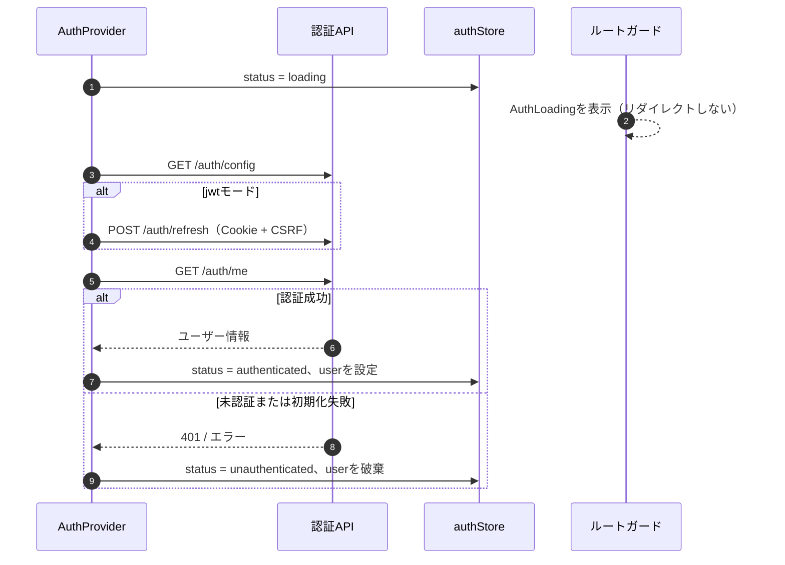
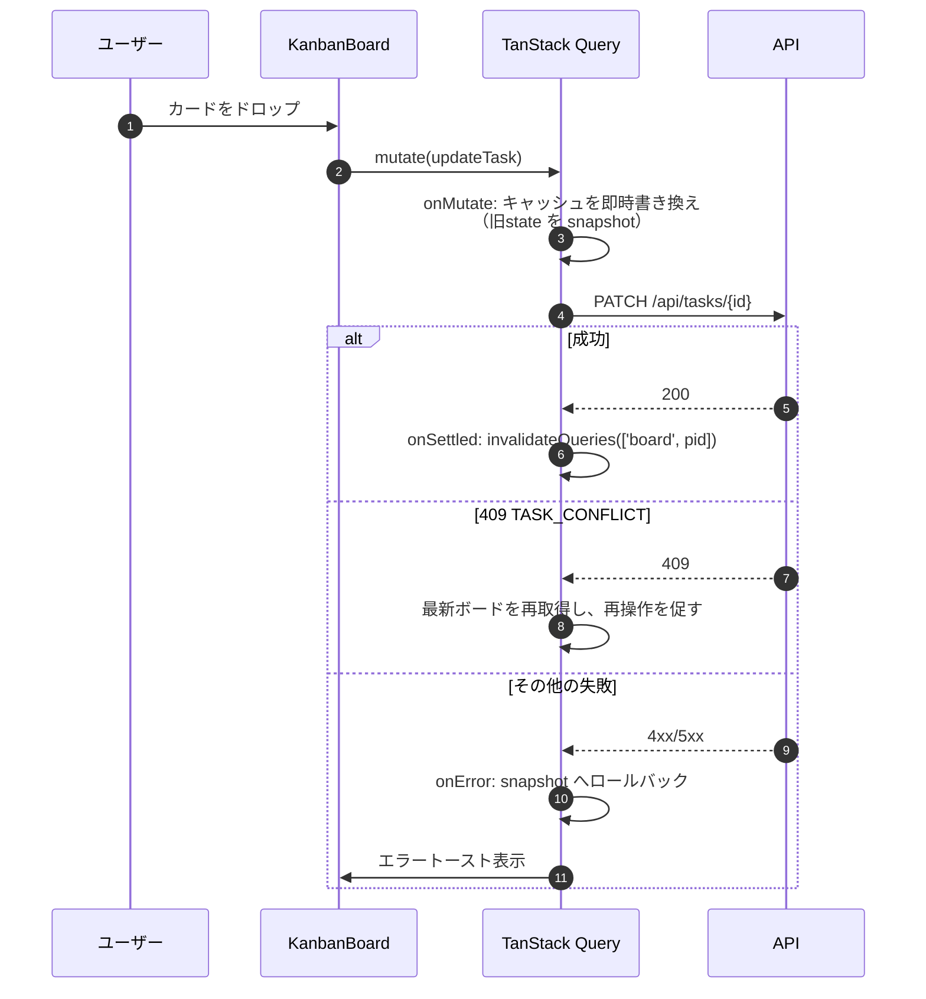
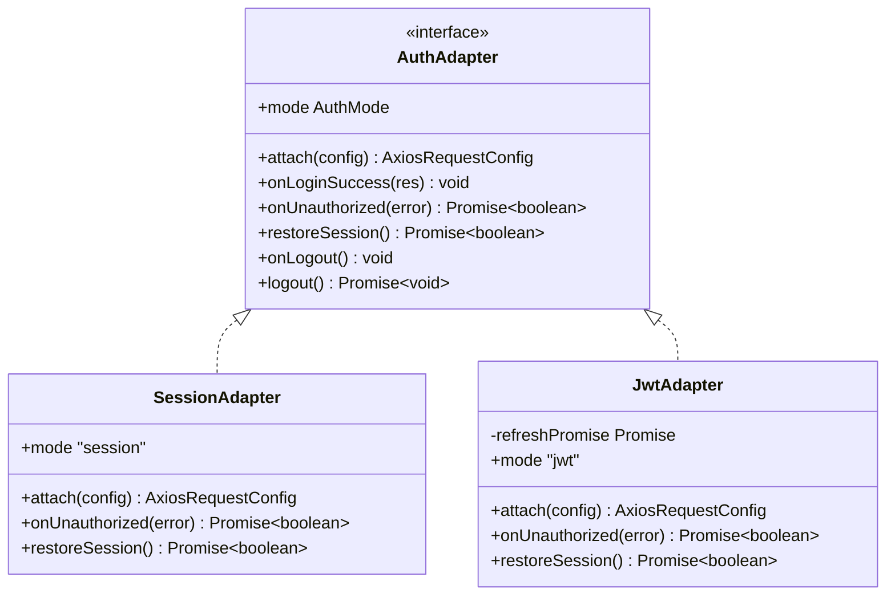
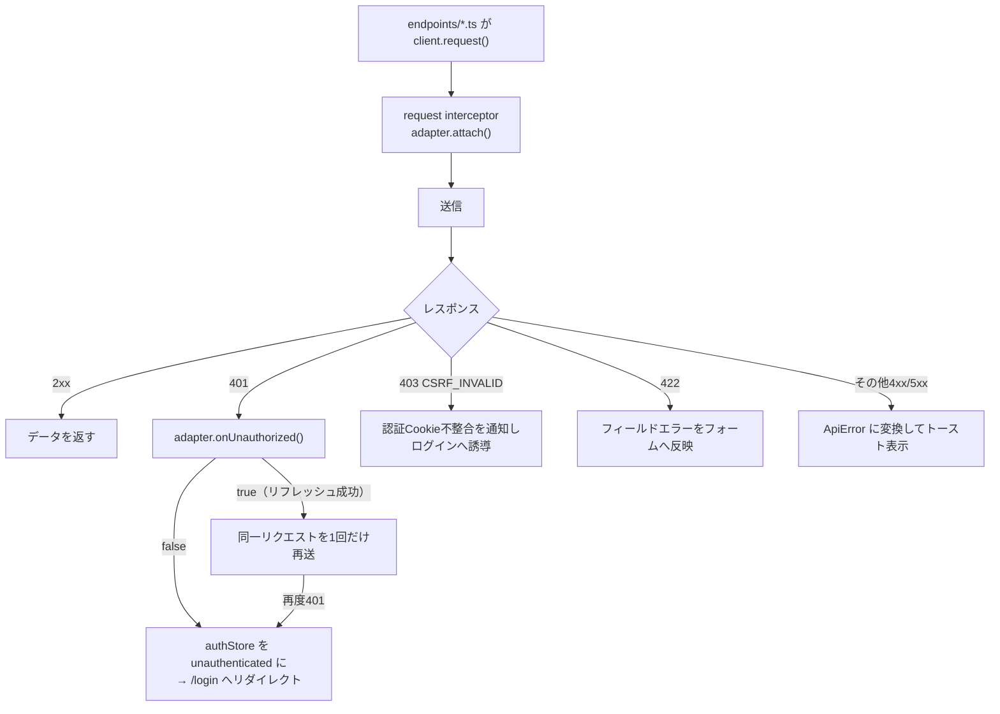
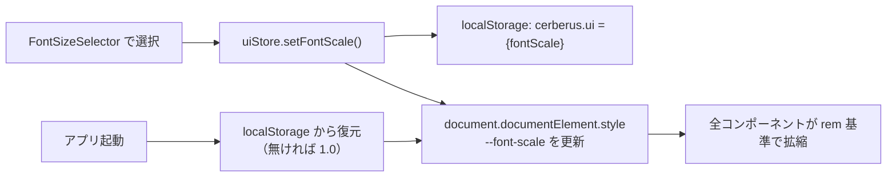

# 05 フロントエンド設計

## 1. 構成

| 項目 | 内容 |
|------|------|
| フレームワーク | React 19 + TypeScript（strict） |
| ビルド | Vite 7 |
| ルーティング | React Router v7（`createBrowserRouter`） |
| 状態管理 | Zustand（認証状態・UI設定）＋ TanStack Query（サーバー状態のキャッシュ） |
| HTTPクライアント | axios（インスタンス + interceptor） |
| ドラッグ＆ドロップ | `@dnd-kit/core`（カンバンのカード移動） |
| フォーム | React Hook Form + zod（バックエンドと同一のバリデーション規則を再現） |
| スタイル | CSS Modules + CSS変数（文字サイズ設定のため `rem` ベースで設計） |
| テスト | Vitest + React Testing Library + MSW（APIモック） |
| Lint / 型 | ESLint（flat config）+ `tsc --noEmit` |
| Node | v26（Dockerfile で固定） |

### ディレクトリ構成

```
frontend/
├── src/
│   ├── main.tsx
│   ├── router.tsx                  # ルート定義・認証ガード
│   ├── routes.ts                   # 画面パス定数（ROUTES）。パスの直書きを禁止し、遷移先はすべてここを参照する
│   ├── api/
│   │   ├── client.ts               # axiosインスタンス生成（認証方式を吸収）
│   │   ├── authAdapter/            # 認証方式ごとの差異を閉じ込める層
│   │   │   ├── types.ts            # AuthAdapter インターフェース
│   │   │   ├── sessionAdapter.ts
│   │   │   ├── jwtAdapter.ts
│   │   │   └── index.ts            # /auth/config のauth_modeで選択
│   │   ├── endpoints/              # auth.ts / projects.ts / tasks.ts / admin.ts / notifications.ts
│   │   └── errors.ts               # ApiError 型とエラーコード変換
│   ├── auth/
│   │   ├── authStore.ts            # Zustand（user / status）
│   │   ├── AuthProvider.tsx        # /auth/config → 必要ならrefresh → /auth/me
│   │   ├── AuthLoading.tsx         # 認証状態確定まで表示するローディングUI
│   │   └── guards.tsx              # RequireAuth / RequireAdmin
│   ├── components/                 # 汎用UI（Button, Modal, Field, Toast, Avatar…）
│   ├── layouts/
│   │   ├── AppLayout.tsx           # サイドバー付き共通レイアウト
│   │   └── AuthLayout.tsx          # ログイン系画面のレイアウト
│   ├── features/
│   │   ├── auth/                   # ログイン・登録・メール認証・パスワードリセット
│   │   ├── projects/               # ダッシュボード（カード表示・カレンダー表示）・プロジェクト
│   │   ├── board/                  # カンバン・タスク詳細
│   │   ├── settings/               # アカウント設定
│   │   ├── notifications/          # 通知ベル・通知パネル
│   │   └── admin/                  # ユーザー管理
│   ├── stores/uiStore.ts           # 文字サイズ・サイドバー開閉（localStorage永続）
│   └── types/                      # APIレスポンスの型定義
├── tests/
├── Dockerfile
└── vite.config.ts
```

## 2. 画面一覧とルーティング

> drawio版の画面遷移図：[diagrams/04_screen_flow.drawio](./diagrams/04_screen_flow.drawio)

| No | 画面 | パス | レイアウト | ガード | 出典 |
|----|------|------|-----------|--------|------|
| 0 | （ルート） | `/` | なし（画面を持たない） | なし | 認証状態にかかわらず `/login` へリダイレクトする |
| 1 | ログイン | `/login` | AuthLayout | 未認証のみ | 要件書§2-1 |
| 2 | 会員登録 | `/register` | AuthLayout | 未認証のみ | 要件書§2-2 |
| 3 | パスワード再設定要求 | `/password/forgot` | AuthLayout | 公開（認証不要） | - |
| 4 | パスワード再設定 | `/password/reset#token=` | AuthLayout | 公開（認証不要） | - |
| 5 | メール認証 | `/verify-email#token=` | AuthLayout | 公開（認証不要） | 確認メール内リンクは別タブで開く想定。認証完了後の自動遷移は行わない |
| 6 | ダッシュボード | `/dashboard` | AppLayout | 認証必須 | 要件書§2-3 |
| 7 | プロジェクト詳細（カンバン） | `/projects/:projectId` | AppLayout | 認証必須 | 要件書§2-4 |
| 8 | タスク詳細/編集 | `/projects/:projectId/tasks/:taskId`（モーダル） | AppLayout | 認証必須 | 要件書§2-5 |
| 9 | アカウント設定 | `/settings` | AppLayout | 認証必須 | 要件書§2-6 |
| 10 | 管理者ユーザー管理 | `/admin/users` | AppLayout | admin のみ | 要件書§2-7 |
| 11 | OAuthコールバック中継 | `/oauth/callback` | なし（ローディングのみ） | 不要 | sessionは `/auth/me` を確認、jwtはfragmentの一時codeを `/auth/oauth/exchange` へ送り、その後 `/auth/me`。レスポンスの検証済み `redirect_to` へ遷移する。 [03_auth 5.4](./03_auth.md#54-jwt-モードでのトークン受け渡し) |



### 2.1 ルートパス `/` の扱い

`/` は画面を持たない入口専用パスとし、`createBrowserRouter` のルート定義で `<Navigate to="/login" replace />` を返す（`replace` により履歴を汚さず、ブラウザの戻る操作で `/` に戻ってループしない）。認証状態は参照しない。

| アクセス元の状態 | 遷移 |
|-----------------|------|
| 未認証で `/` | `/` → `/login`（ログイン画面を表示） |
| 認証済みで `/` | `/` → `/login` → `/login` の未認証ガードにより `/dashboard` |

認証済みユーザーが `/` を経由すると2ホップになるため、アプリ内の遷移・OAuthの `redirect_to`・ログアウト後以外のリダイレクト先には `/` を使わず `/dashboard` を指定する。

パスはコンポーネントに直書きせず `src/routes.ts` の定数（`ROUTES.ROOT` / `ROUTES.LOGIN` / `ROUTES.DASHBOARD` …）を参照する。パス変更時の追従漏れを防ぐため、`router.tsx`・ガード・`navigate` の遷移先・サイドバーのリンクはすべて同一定数を用いる。

## 3. 共通レイアウト

全画面で共通の左サイドバー構成。

```
┌────────────────────────────────────────────────────────┐
│ ≡ │              Cerberus              │ 🔔(3) │       │  ← ヘッダー
├───┴────────────────────────────────────────────────────┤
│ ┌──────────┐                                           │
│ │ home     │   ┌─── メインコンテンツ ─────────────┐    │
│ │ 管理 (*) │   │                                  │    │
│ │ 設定     │   │  （画面ごとの内容）              │    │
│ │          │   │                                  │    │
│ │ ログアウト│   └──────────────────────────────────┘    │
│ └──────────┘                                           │
└────────────────────────────────────────────────────────┘
  (*) 「管理」は role = admin のときのみ表示
```

| 要素 | 挙動 |
|------|------|
| `≡`（ハンバーガー） | サイドバーの開閉。状態は `uiStore` に保持し localStorage へ永続化 |
| home | `/dashboard` へ遷移 |
| 管理 | `/admin/users` へ遷移。`role !== 'admin'` の場合は**要素自体を描画しない** |
| 設定 | `/settings` へ遷移 |
| ログアウト | `POST /auth/logout` → authStore クリア → `/login` へ |
| `🔔`（通知ベル） | ヘッダー右端。クリックで `NotificationPanel` を開閉する。未読が1件以上あるときだけバッジを重ねて表示する（詳細は§3.1） |

### 3.1 通知ベルと通知パネル

認証後の全画面（`AppLayout` 配下）で共通に表示する。要件書§3.4 N-2〜N-5 に対応する。

```
              ┌──────────────────────────────┐
   🔔(3) ───▶ │ 通知            [すべて既読] │  ← ヘッダー右端のベルから開く
              ├──────────────────────────────┤
              │ ● 設計書をレビューする        │  ← ● は未読マーク
              │   期限 09/05 10:00           │
              ├──────────────────────────────┤
              │   CIを直す                   │  ← 既読（マークなし・淡色）
              │   期限 09/04 18:00           │
              │ [前へ] 1 2 [次へ]             │  ← 2ページ以上で表示
              ├──────────────────────────────┤
              │ 通知はありません（0件時）     │
              └──────────────────────────────┘
```

| 要素 | 挙動 |
|------|------|
| ベルアイコン | `aria-label="通知"`、`aria-expanded` でパネルの開閉状態を伝える |
| 未読バッジ | `unread_count >= 1` のときだけ描画。100件以上は `99+` と表示。`aria-label="未読 {n} 件"` |
| パネル | ベルの下にポップオーバー表示。`Escape` キーと外側クリックで閉じ、閉じたらベルへフォーカスを戻す |
| 通知行 | クリックで `/projects/{project_id}` へ遷移し、対象タスクの詳細モーダルを開く。遷移と同時に `PATCH /notifications/{id}/read` を実行する。`task` が `null`（タスク削除済み）の行は遷移せず、既読化のみ行う |
| すべて既読ボタン | `POST /notifications/read-all`。`unread_count === 0` のときは非活性 |
| 空状態 | 通知0件のとき「通知はありません」を表示する |
| ページネーション | `GET /notifications?page={page}&per_page=20&unread_only={unreadOnly}` の `meta.page` / `meta.total_pages` を使い、2ページ以上のときだけ表示する。ページ番号変更で一覧を再取得し、`unreadOnly`変更時は`page=1`へ戻す |

**未読件数の取得（ポーリング）**

| 項目 | 内容 |
|------|------|
| 取得元 | `GET /notifications/unread-count`（React Query の `refetchInterval`） |
| 間隔 | `VITE_NOTIFICATION_POLL_INTERVAL_MS`（既定 60000 = 60秒）。値はハードコードせず環境変数から取得する |
| 停止条件 | 未認証（`authStore.status !== 'authenticated'`）のときはクエリ自体を `enabled: false` にする。またタブが非アクティブの間は `refetchIntervalInBackground: false` により停止する |
| 一覧との整合 | パネルを開いたときに `GET /notifications` を取得し、そのレスポンスの `unread_count` で未読件数のキャッシュを更新する（追加リクエストを発生させない） |
| 既読操作後 | `PATCH .../read` / `POST .../read-all` のレスポンスに含まれる `unread_count` でキャッシュを更新し、一覧クエリを `invalidateQueries` する |

リアルタイム配信（SSE / WebSocket）は採用しない。したがってバッジの反映は最大でポーリング間隔ぶん遅れる。

## 4. コンポーネント構成



## 5. 状態管理

| ストア | 保持内容 | 永続化 | 備考 |
|--------|----------|--------|------|
| `authStore`（Zustand） | `user`, `status`（`loading` / `authenticated` / `unauthenticated`）, `accessToken`（jwtモードのみ）, `authAdapter` | **しない**（メモリのみ） | アクセストークンを localStorage に置かない（XSS対策）。adapterは起動時のbackend設定から選択 |
| `uiStore`（Zustand + persist） | `fontScale`, `sidebarOpen`, `dashboardView`（`"cards"` / `"calendar"`） | localStorage | 文字サイズ・サイドバー開閉・ダッシュボードの表示モードはクライアント側のみで保持。次回起動時も選択中の表示モードを復元する |
| 通知（React Query） | `['notifications','unread-count']` / `['notifications', page, unreadOnly]` | しない | 未読件数はポーリング、一覧はパネルを開いたときに取得。パネルの開閉状態のみコンポーネントのローカルstateで持つ |
| TanStack Query | プロジェクト一覧・ボード・ユーザー一覧 | しない | `queryKey` は `['projects']` / `['board', projectId]`。タスク詳細コメントは`taskDetailStore`で管理する（下段参照） |
| `taskDetailStore`（singleton） | タスク詳細・コメント詳細の取得結果、更新中/エラー、`notFound`、`closeRequested`、`boardRefreshToken` | しない | タスク詳細モーダルは既存実装との互換性を優先し、`subscribe`/`getSnapshot`を`useSyncExternalStore`から購読する。TanStack Queryへ移行しない方針は[タスク詳細モーダル詳細設計](../detailed_design/screen/08_task_detail_modal.md)を正とする |
| カレンダー（React Query） | `['tasks-calendar', scope, projectId, from, to]` | しない | 表示中の月（前後の見切れ週を含む`from`〜`to`）が変わるたびに取得し直す。`scope`/`projectId`の切替時も同様に再取得する |

### 5.1 認証状態の遷移



`loading` 中は `RequireAuth` / `RequireAdmin` / `RequireGuest` のいずれもリダイレクトせず、`AuthLoading` を表示する。`AuthLoading` は `role="status"` と「認証状態を確認中...」のラベルを持ち、`AuthProvider` が初期化を完了するまで現在のURLを維持する。



### 5.2 カンバン操作時の楽観的更新



## 6. APIクライアント層（認証方式の吸収）

**方針**：認証方式の差異は `AuthAdapter` に閉じ込め、画面・feature 層は `api/endpoints/*` の関数を呼ぶだけで方式に依存しない。



| 実装 | `attach` | `onLoginSuccess` | `onUnauthorized` | `restoreSession` | `onLogout` | `logout` |
|------|----------|------------------|------------------|------------------|------------|------------|
| `SessionAdapter` | `withCredentials = true`、更新系には `X-CSRF-Token`（Cookieから読む）を付与 | 何もしない（Cookieはブラウザが保持） | `false`（リトライしない） | 追加処理なしで `true` | authStoreを破棄。Cookie破棄はbackendのlogoutに任せる | `POST /api/auth/logout`をCookie・CSRF付きで実行 |
| `JwtAdapter` | 通常APIには `Authorization: Bearer {accessToken}`、refresh/logoutには `withCredentials=true` と `X-CSRF-Token` を付与 | authStore にaccessTokenを保存。Cookieはbackendが発行 | `/auth/refresh` を1回だけ試行し、成功なら `true` | `/auth/refresh` を実行し、成功時にaccessTokenを保持 | accessTokenをメモリから破棄。Cookie破棄はbackendのlogoutに任せる | `POST /api/auth/logout`をCookie・CSRF付きで実行 |

| メソッド | 引数 | 戻り値 | 責務 |
|----------|------|--------|------|
| `attach` | `AxiosRequestConfig` | `AxiosRequestConfig` | リクエスト直前の認証情報付与（Cookie送信設定 / CSRFヘッダ / Bearerヘッダ）。CSRF Cookie名は `/auth/config` から取得 |
| `onLoginSuccess` | `LoginResponse` | `void` | ログインレスポンスから必要な情報を保持 |
| `onUnauthorized` | `AxiosError` | `Promise<boolean>` | 401 時の復帰処理。`true` を返した場合のみ元リクエストを再送 |
| `restoreSession` | なし | `Promise<boolean>` | アプリ起動時に既存Cookieから認証状態を復元。jwtではrefreshを実行 |
| `onLogout` | なし | `void` | クライアント側の後片付け |
| `logout` | なし | `Promise<void>` | `POST /api/auth/logout`を認証方式固有の設定で実行 |

### 6.1 interceptor の流れ



| ルール | 内容 |
|--------|------|
| 起動時の復元 | `GET /auth/config` → jwtなら `POST /auth/refresh` → `GET /auth/me`。refresh Cookieが無い場合の401は未認証として扱う |
| OAuth callbackの優先 | `/oauth/callback` では、jwtのrefresh Cookieが無い場合でもAuthProviderが `/login` へ先行リダイレクトせず、`OAuthCallbackPage` がfragmentのcodeを交換してから認証状態を確定する |
| リフレッシュの多重実行防止 | `JwtAdapter` 内で進行中の `refreshPromise` を共有し、同時に発生した401をまとめて1回のリフレッシュで処理する |
| リトライ回数 | 1回のみ（`config._retried` フラグで管理） |
| リフレッシュ対象外 | `/auth/login`・`/auth/refresh`・`/auth/register`・`/auth/oauth/exchange` の401はリトライしない |
| session モード | 401 は即ログアウト扱い（リフレッシュの概念がない） |

### 6.2 環境変数（Vite）

| 変数 | 例 | 用途 |
|------|-----|------|
| `VITE_API_BASE_URL` | `/api` | APIのベースURL（同一オリジンを既定） |
| `VITE_NOTIFICATION_POLL_INTERVAL_MS` | `60000` | 未読通知件数のポーリング間隔（ミリ秒） |
| `VITE_TASK_COMMENT_BODY_MAX_LENGTH` | `2000` | コメント本文のzodバリデーション上限文字数。バックエンドの`TASK_COMMENT_BODY_MAX_LENGTH`と同じ値を`.env`へ設定し、値の一致は運用（`.env.example`のコメント併記）で担保する |

認証モード、Googleログインの有効/無効、CSRF Cookie名は `GET /auth/config` から実行時に取得する。`VITE_AUTH_MODE` / `VITE_GOOGLE_LOGIN_ENABLED` / `VITE_CSRF_COOKIE_NAME` は定義しない。これによりfrontendイメージとbackendの設定がずれても、起動時にbackendの設定へ追従できる。

## 7. 画面別の主要仕様

### 7.1 ログイン

| 要素 | 仕様 |
|------|------|
| 「IDもしくはメールアドレス」入力 | `identifier` として送信 |
| パスワード入力 | 目のアイコンで表示/非表示をトグル |
| ログインボタン | Enter キーでも送信 |
| 「新規会員登録はこちら」 | `/register` |
| 「パスワードを忘れた方はこちら」 | `/password/forgot` |
| Googleログイン | `window.location.href = {API}/auth/oauth/google` へ遷移（XHRでは行わない）。OAuth callbackのstate Cookieを検証し、jwtではfragmentの一時codeを交換 |
| エラー表示 | `INVALID_CREDENTIALS` は「IDまたはパスワードが正しくありません」と統一表示（どちらが誤りか示さない） |
| メール未認証 | 403 `EMAIL_NOT_VERIFIED` の場合は「メール認証が完了していません」と表示し、「認証メールを再送する」ボタン（`POST /auth/verify-email/resend`）を出す。送信後は結果に関わらず「送信しました」と表示する |
| 登録直後の遷移 | `/register` から遷移してきた場合、「確認メールを送信しました」のメッセージを表示する（`navigate("/login", { state: { registeredEmail } })`） |
| レート制限 | 429 の場合は待機時間を案内 |

### 7.2 会員登録

- 入力順は 姓 → 名 → フリガナ → 生年月日 → メール → パスワード → パスワード再入力
- 生年月日は年/月/日の3プルダウン
- パスワードは強度インジケータを表示し、zod で「8文字以上・2種類以上の文字種」を検証（バックエンドと同一規則）
- 「Googleで新規登録」はログイン画面と同じOAuth開始URLへ遷移（ログインと登録の入口を共通化）
- 409（重複）は該当フィールドにエラーを表示
- **登録成功（201）後は自動ログインしない**。`/login` へリダイレクトし、「確認メールを送信しました」を表示する。認証状態を持たないため `authStore` は更新しない

### 7.3 メール認証

| 要素 | 仕様 |
|------|------|
| 到達経路 | 確認メール内のリンク `{FRONTEND_BASE_URL}/verify-email#token=xxx`。メールクライアントの挙動により別タブ（別ウィンドウ）で開かれる前提とする |
| 初期処理 | マウント時にfragmentの `token` で `POST /auth/verify-email` を1回だけ実行（`StrictMode` の二重実行を避けるため実行済みフラグで抑止する）。送信後は `history.replaceState` でtokenをURLから消す |
| 成功時 | 「メール認証が完了しました。このタブは閉じて問題ありません」を表示する。元のタブ（ログイン画面等）は別に開いたままのため、`/login` への自動遷移・遷移リンクは設けない |
| 失敗時（400） | 「リンクの有効期限が切れているか、既に使用済みです」と表示し、メールアドレス入力による再送フォームを出す |
| token 欠落 | APIを呼ばず、再送フォームのみを表示する |

### 7.3.1 OAuthコールバック中継

- `/oauth/callback` 到達時は、jwtモードならfragmentの `code` を取得して `POST /auth/oauth/exchange` を1回だけ実行し、成功後に `GET /auth/me` を取得してレスポンスの `redirect_to` へ遷移する
- sessionモードはcallbackで設定済みのCookieを使って `GET /auth/me` を取得し、fragmentの `redirect_to` を同一オリジン相対パスとして再検証してから遷移する（違反時は `/dashboard`）
- codeは送信後に `history.replaceState` でURLから除去し、失敗時は一時コードを再送しない
- `profile_completed=false` の場合は、サーバーが返した `redirect_to` より優先して `/settings?complete_profile=1` へ遷移する

### 7.4 ダッシュボード

- 所属プロジェクトをカード表示（プロジェクト名・メンバー数・タスク件数バッジ）
- 「新規プロジェクトの作成」ボタン → モーダル
- プロジェクト0件時は空状態メッセージと作成導線を表示
- ヘッダーの通知ベル（§3.1）から通知一覧を開ける。ベル自体は `AppLayout` の共通要素であり、ダッシュボード固有の実装は持たない
- 画面上部のタブで「カード表示」「カレンダー表示」を切替できる（§7.4.1）。選択状態は `uiStore.dashboardView` に保持し、次回訪問時も復元する

#### 7.4.1 カレンダー表示（issue #38）

| 要素 | 仕様 |
|------|------|
| 表示範囲切替 | 「自分のタスク」「プロジェクト：{選択中プロジェクト名} ▼」の2択。「プロジェクト」選択時はプルダウンで所属プロジェクトから選ぶ（初期値は最初の1件、所属0件なら選択肢自体を出さず「自分のタスク」固定） |
| 月送り | `‹ {YYYY年M月} ›` で前月・翌月へ移動。初期表示は当月 |
| グリッド | 月表示（日曜始まり、6週×7列=42セル固定）。当月以外の日付は淡色表示 |
| セル内表示 | 日付番号＋その日が`due_at`のタスクをチップ表示（タイトル省略表示）。1セルの表示上限（既定4件、超過分は「+N件」を表示しクリックでその日の全件をポップオーバー表示） |
| タスクの操作 | チップ（またはポップオーバー内の行）をクリックすると`TaskDetailModal`を開く（カンバン §7.5 と同一コンポーネントを再利用）。ドラッグによる`due_at`変更は本機能のスコープ外 |
| URL同期 | カンバン（§7.5）と異なり、ダッシュボードは特定プロジェクトに紐づく画面ではないため、モーダルを開いてもURLは変更しない（ブラウザの共有・リロードでの復元は対象外） |
| データ取得 | `GET /tasks/calendar?from=&to=&scope=&project_id=`（[04_api.md](./04_api.md#24-タスクコメント)）。表示中の月に加え前後月の見切れ週分を含めた範囲を1回のリクエストで取得する |
| 空状態 | 表示範囲内に該当タスクが1件もない月は、グリッドはそのまま表示しつつ全セルにチップなし（専用の空状態メッセージは出さない） |

### 7.5 カンバンボード

- 3列（未着手 / 進行中 / 完了）を横並び表示。列ヘッダーに件数
- `@dnd-kit` によるカード移動で `PATCH /tasks/{id}`（status + position + 取得時の version）。`409 TASK_CONFLICT` 時はボードを再取得して再操作を促し、それ以外の更新失敗時は楽観的更新をロールバックする
- カードクリックでタスク詳細モーダル（URLも `/projects/:pid/tasks/:tid` に同期させ、リロード・共有可能にする）
- タスク詳細モーダル：タイトル・説明・担当者（プロジェクトメンバーから選択）・期限・ステータス・コメント一覧/投稿

### 7.6 アカウント設定

| 項目 | 仕様 |
|------|------|
| プロフィール編集 | 姓・名・フリガナ・生年月日を `PATCH /users/me`。OAuth新規ユーザーの未入力値は設定画面で補完し、完了後 `profile_completed=true` にする |
| パスワードの変更 | 通常ユーザーは現在のパスワード + 新パスワード + 確認、OAuthのみのユーザーは現在のパスワードを省略して新パスワード + 確認 → `PUT /users/me/password`。成功後は再ログインを促す（全セッション失効のため） |
| 文字サイズの変更 | 小 / 標準 / 大 / 特大（`0.875` / `1` / `1.125` / `1.25`）。サーバーには保存しない |
| ログイン履歴 | `GET /users/me/login-history` を表形式で表示（自衛的な監査） |

### 7.7 管理者ユーザー管理

- タブ「管理」自体を `role = admin` のみ表示。直接URLアクセス時も `RequireAdmin` で `/dashboard` にリダイレクト
- ユーザー一覧（検索・ページング）、ロール変更セレクト、有効/無効トグル、強制ログアウトボタン
- 自分自身の権限降格・無効化は UI 上で禁止（誤操作防止。サーバー側でも 409 とする）
- プロジェクト一覧タブ（`GET /admin/projects`）と削除操作

### 7.8 通知

- ベルアイコン・未読バッジ・通知パネル・「すべて既読」ボタン（仕様は§3.1）
- 通知行から対象タスクへ遷移し、遷移と同時に既読化する
- ポーリング間隔は `VITE_NOTIFICATION_POLL_INTERVAL_MS` から取得し、コンポーネントに直書きしない

## 8. アクセシビリティ設定（文字サイズ）

localStorage のみで保持する。



| 項目 | 内容 |
|------|------|
| 実装 | `html { font-size: calc(16px * var(--font-scale)); }` とし、各コンポーネントは `rem` 指定 |
| 端末間同期 | されない（localStorage のため）。DB保存が必要になった場合は `users` にカラム追加が必要 |
| 影響範囲 | レイアウト崩れを防ぐため、固定 `px` 幅のコンテナは使わず `min-width` / `flex` で組む |

## 9. テスト方針

| 区分 | 対象 | 内容 |
|------|------|------|
| 単体 | `authAdapter` | session / jwt それぞれで `attach` / `onUnauthorized` の挙動、リフレッシュの多重実行防止 |
| 単体 | `AuthProvider` | 起動時の認証状態を `loading` に保ち、初期化成功で `authenticated`、未認証・失敗で `unauthenticated` に遷移 |
| コンポーネント | `RequireAuth` / `RequireAdmin` / `RequireGuest` | `loading` 中はローディングUIを表示し、リダイレクトしない |
| 単体 | zod スキーマ | パスワードポリシー・フリガナ・50文字制限などの境界値 |
| 単体 | `uiStore` | 文字サイズの永続化と復元、localStorage が空の場合の既定値 |
| コンポーネント | LoginForm / RegisterForm | 入力検証・エラー表示・送信内容 |
| コンポーネント | KanbanBoard | D&D後の楽観的更新とロールバック（MSWで失敗レスポンスを返す） |
| コンポーネント | CalendarView | 月送りで表示範囲(`from`/`to`)が再計算されること、`scope`/`project_id`切替で再取得されること、1セル超過分が「+N件」表示になること、チップクリックで`TaskDetailModal`が開くこと |
| コンポーネント | Sidebar | `role` による「管理」タブの表示/非表示 |
| コンポーネント | NotificationBell | `unread_count` 0件でバッジ非表示、1件以上で表示、100件以上で `99+` |
| コンポーネント | NotificationPanel | 一覧描画・空状態・「すべて既読」押下で未読が0になること・`task` が `null` の行が遷移しないこと |
| 単体 | 未読件数ポーリング | 未認証時に `enabled: false` となること、間隔が `VITE_NOTIFICATION_POLL_INTERVAL_MS` を参照すること（fake timers で検証） |
| 結合 | ルートリダイレクト | 未認証・認証済みのいずれでも `/` にアクセス → `/login`（認証済みはさらに `/login` のガードで `/dashboard`） |
| 結合 | ルーティングガード | 未認証で `/dashboard` にアクセス → `/login`、member で `/admin/users` → `/dashboard` |
| 網羅できない範囲 | 実ブラウザでのD&Dのピクセル単位挙動、Google認可画面 | `@dnd-kit` のイベントはユーティリティでシミュレートし、実操作は手動確認とする |
