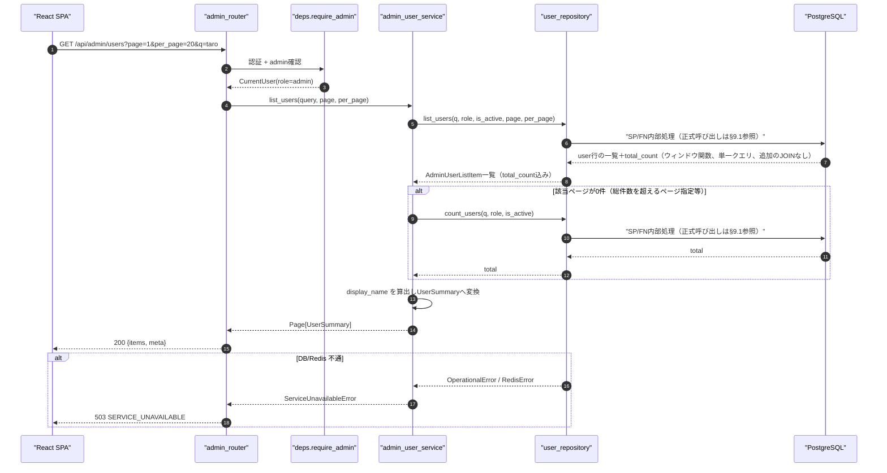
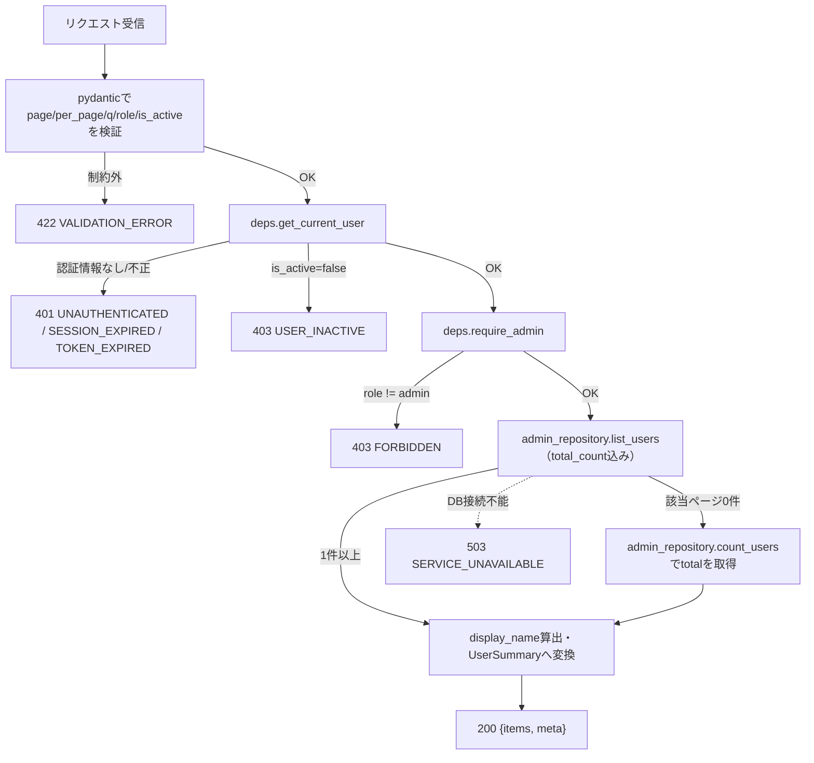
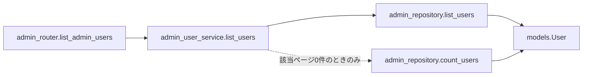
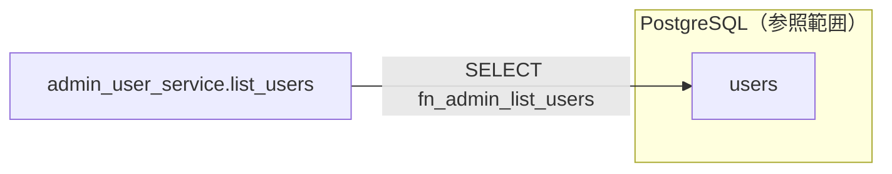

# GET /api/admin/users（全ユーザー一覧取得）

## 0. 関連ドキュメント

| ドキュメント | 内容 |
|--------------|------|
| [../../../basic_design/04_api.md](../../../basic_design/04_api.md) | §2.5 管理者API一覧、§4.2 エラーコード体系、§5 認可マトリクス |
| [../../../basic_design/01_database.md](../../../basic_design/01_database.md) | §3.1 users |
| [../../../basic_design/03_auth.md](../../../basic_design/03_auth.md) | §9.2 `core/deps.py`（`require_admin`） |
| [../../database/01_table_users.md](../../database/01_table_users.md) | users テーブル定義・インデックス（`ix_users_created_at` 等） |
| [./02_patch_admin_user_role.md](./02_patch_admin_user_role.md) | ロール変更API（一覧の表示更新契機） |
| [./03_patch_admin_user_status.md](./03_patch_admin_user_status.md) | 有効化/無効化API（一覧の表示更新契機） |
| [../../screen/10_admin_users.md](../../screen/10_admin_users.md) | 本APIを呼び出す画面（管理者ユーザー管理画面） |

## 1. 概要

| 項目 | 内容 |
|------|------|
| エンドポイント | `GET /api/admin/users` |
| 目的 | 管理者が全ユーザーをページング・検索付きで一覧参照する |
| 認証 | 必要（session Cookie または `Authorization: Bearer`） |
| 認可 | admin のみ |
| CSRF検証 | 不要（参照系 GET） |
| Origin検証 | 不要（Cookie発行・更新系ではないため） |
| AUTH_MODE差異 | 差異なし（`deps.get_current_user` が方式差を吸収する） |
| 冪等性 | あり（GET） |
| レート制限 | 対象外 |
| トランザクション境界 | 単一の読み取りトランザクション（更新なし） |

## 2. 入出力仕様

### 2.1 リクエスト

**クエリパラメータ**

| 名前 | 型 | 必須 | 制約 | 説明 |
|------|----|------|------|------|
| page | integer | 任意 | 1以上。既定 `1` | ページ番号 |
| per_page | integer | 任意 | 1〜100。既定 `20`（`PAGINATION_DEFAULT_PER_PAGE` / `PAGINATION_MAX_PER_PAGE`） | 1ページあたり件数 |
| q | string | 任意 | 100文字以内 | `username` / `email` の部分一致検索（大文字小文字区別なし） |
| role | string | 任意 | `member` / `admin` のいずれか | ロールで絞り込み |
| is_active | boolean | 任意 | `true` / `false` | 有効フラグで絞り込み |

パスパラメータ／ヘッダ（認証ヘッダ・Cookieを除く）／ボディ：なし。

### 2.2 レスポンス

**`200 OK`**

```json
{
  "items": [
    {
      "id": "3f1c2a10-...",
      "username": "taro",
      "email": "taro@example.com",
      "display_name": "山田 太郎",
      "role": "member",
      "is_active": true,
      "email_verified_at": "2026-08-01T00:00:00Z",
      "created_at": "2026-08-01T00:00:00Z"
    }
  ],
  "meta": { "page": 1, "per_page": 20, "total": 1, "total_pages": 1 }
}
```

| フィールド | 型 | NULL | 説明 |
|-----------|----|----|------|
| items[].id | string(uuid) | 不可 | ユーザーID |
| items[].username | string | 不可 | ログインID |
| items[].email | string | 不可 | メールアドレス |
| items[].display_name | string | 不可 | `last_name + ' ' + first_name`。姓名未設定時は `username` を代替表示（[01_get_projects.md](../projects/01_get_projects.md) と同様の規則） |
| items[].role | string | 不可 | `member` / `admin` |
| items[].is_active | boolean | 不可 | 有効フラグ |
| items[].email_verified_at | string(datetime) | 可 | NULLは未認証 |
| items[].created_at | string(datetime) | 不可 | ISO 8601 UTC |
| meta.page / per_page / total / total_pages | integer | 不可 | ページング情報 |

パスワードハッシュ・Google `provider_user_id` 等の機微情報は含めない。`Set-Cookie` なし。共通ヘッダ `X-Request-ID` を全レスポンスに付与する。

## 3. エラー仕様

| HTTP | code | 発生条件 | メッセージ | 備考 |
|------|------|----------|------------|------|
| 401 | `UNAUTHENTICATED` | Cookie／Bearerが無い、または無効 | 認証が必要です | `deps.get_current_user` |
| 401 | `SESSION_EXPIRED` / `TOKEN_EXPIRED` / `TOKEN_INVALID` | 各方式の認証失効・不正 | 認証情報が無効です | |
| 403 | `USER_INACTIVE` | `users.is_active=false` | アカウントが無効化されています | |
| 403 | `FORBIDDEN` | `role != admin` | 権限がありません | `deps.require_admin` |
| 422 | `VALIDATION_ERROR` | `page` / `per_page` / `role` / `is_active` が制約外 | 入力内容に誤りがあります | `details` にフィールド情報 |
| 503 | `SERVICE_UNAVAILABLE` | PostgreSQL / Redis 接続不能 | しばらくしてから再度お試しください | fail-close |

`basic_design/04_api.md` §4.2 のエラーコード体系から逸脱しない。

## 4. 処理シーケンス



## 5. 処理フロー・分岐



## 6. 関数詳細

### 6.1 `api/routers/admin_router.py :: list_admin_users`

| 項目 | 内容 |
|------|------|
| シグネチャ | `async def list_admin_users(query: AdminUserListQuery = Depends(), user: CurrentUser = Depends(require_admin), db: AsyncSession = Depends(get_db)) -> AdminUserListResponse` |
| 引数 | `query`: `page`/`per_page`/`q`/`role`/`is_active`（クエリ） / `user`: admin確認済みユーザー / `db`: DBセッション |
| 戻り値 | `AdminUserListResponse`（`items`, `meta`） |
| 送出例外 | なし（サービス層の例外を `AppError` としてそのまま伝播） |
| 処理内容 | 1. `require_admin` により403判定を完了させる 2. `admin_user_service.list_users` を呼び出す 3. 戻り値をそのままレスポンスとして返す |
| 副作用 | なし |

### 6.2 `service/admin_user_service.py :: list_users`

| 項目 | 内容 |
|------|------|
| シグネチャ | `async def list_users(query: AdminUserListQuery, db: AsyncSession) -> AdminUserListResponse` |
| 引数 | `query`: 検索・ページング条件 / `db`: DBセッション |
| 戻り値 | `AdminUserListResponse`（`items`, `meta`） |
| 送出例外 | `ServiceUnavailableError`（PostgreSQL接続不能時）→503 |
| 処理内容 | 1. `admin_repository.list_users` を1回呼び、該当ページの行と`total_count`（ウィンドウ関数`count(*) OVER()`）を同時に取得する 2. 該当ページが0件（総件数を超えるページ指定など）の場合のみ`admin_repository.count_users`で総件数を別途取得する 3. 各行の `display_name` を `last_name`/`first_name` から算出し（両方NULLなら `username`）、`UserSummary` へ詰め替える（#347レビューで総件数取得方式を確定。issue #143/PR #294の`fn_list_notifications`対応と同一手法） |
| 副作用 | なし（読み取りのみ） |

### 6.3 `repository/admin_repository.py :: list_users`

| 項目 | 内容 |
|------|------|
| シグネチャ | `async def list_users(db: AsyncSession, q: str \| None, role: str \| None, is_active: bool \| None, limit: int, offset: int) -> list[AdminUserListItem]` |
| 引数 | `q`: username/email部分一致 / `role`, `is_active`: 絞り込み条件 / `limit`, `offset`: ページング |
| 戻り値 | `AdminUserListItem`（`user: User`, `total_count: int`）のリスト |
| 送出例外 | `OperationalError`（DB不通） |
| 処理内容 | `SELECT ("user").*, total_count FROM fn_admin_list_users(:query, :role, :is_active, :limit, :offset)` を実行する。`q`/`role`/`is_active`によるフィルタ・`ORDER BY created_at DESC`・`LIMIT/OFFSET`・`count(*) OVER()`によるtotal_countの算出はいずれもFN内部で行う。`oauth_accounts`/`login_history` へのJOINは行わずN+1を発生させない（一覧に表示しないため） |
| 副作用 | なし |

### 6.4 `repository/admin_repository.py :: count_users`

| 項目 | 内容 |
|------|------|
| シグネチャ | `async def count_users(db: AsyncSession, q: str \| None, role: str \| None, is_active: bool \| None) -> int` |
| 引数 | `list_users` と同じ絞り込み条件（ページング除く） |
| 戻り値 | 該当件数 |
| 送出例外 | `OperationalError` |
| 処理内容 | `SELECT fn_count_admin_users(:query, :role, :is_active)` を実行する。`list_users`が返す`total_count`は該当ページが0件のとき取得できないため、そのフォールバックとしてのみ使用する |
| 副作用 | なし |

## 7. 関数相関図



## 8. データ遷移図

読み取りのみで状態遷移なし。



## 9. SP/FNデータアクセス一覧

### 9.1 正式なDBアクセス契約

本APIのrepositoryは、次のSP/FN呼び出しとDTO写像だけを行う。

| 種別 | 契約 | 説明 |
|------|------|------|
| fn_admin_list_users | `fn_admin_list_users(p_query, p_role, p_is_active, p_limit, p_offset)` | fn_admin_list_usersを呼び出し、結果（user行＋total_count）をレスポンスへ写像する |
| fn_count_admin_users | `fn_count_admin_users(p_query, p_role, p_is_active)` | fn_admin_list_usersのtotal_countが取得できない場合（該当0件）のフォールバック |

repositoryはDBテーブルへ直結せず、SP/FN契約だけを呼び出す。 直下の従来のテーブルI/O表はSP/FN内部SQLの補足であり、repositoryの発行契約ではない。更新系の整合性制御、version検証、advisory lock、通知、SQLSTATE P0xxxはSP/FN層の責務である。存在・所属の事実判定はFNの空集合/falseを受け、404/403への変換はAPI層が行う。

**PostgreSQL**

| テーブル | 操作 | 条件 | 備考 |
|----------|------|------|------|
| `fn_admin_list_users` | FN | `query`/`role`/`is_active`/page | 絞り込み・並び順・件数をFN内部で処理 |

**Redis**

| キー | 操作 | TTL | 備考 |
|------|------|-----|------|
| `session:{sid}`（sessionモードのみ） | GET | `SESSION_TTL_SECONDS` | `deps.get_current_user` の認証確認のみで本APIの業務データではない |

## 10. バリデーション規則

| pydanticスキーマ | フィールド | 制約 | フロント（zod）との整合 |
|-------------------|-----------|------|--------------------------|
| `AdminUserListQuery` | page | `int, ge=1`, 既定1 | `zod.number().int().min(1)` |
| `AdminUserListQuery` | per_page | `int, ge=1, le=100`, 既定 `PAGINATION_DEFAULT_PER_PAGE` | `zod.number().int().min(1).max(100)` |
| `AdminUserListQuery` | q | `str \| None, max_length=100` | `zod.string().max(100).optional()` |
| `AdminUserListQuery` | role | `Literal["member","admin"] \| None` | `zod.enum(["member","admin"]).optional()` |
| `AdminUserListQuery` | is_active | `bool \| None` | `zod.boolean().optional()` |

## 11. 非機能・セキュリティ考慮

| 観点 | 内容 |
|------|------|
| ログ出力 | 監査ログ対象外（参照系）。アクセスログに `user_id`(admin), `q`, `role`, `is_active`, `page`, `per_page`, `X-Request-ID` を構造化出力 |
| ユーザー列挙対策 | admin専用APIのため対象外（一般ユーザーからは403/401で内容を隠蔽） |
| タイミング攻撃対策 | 該当なし |
| レート制限 | なし |
| fail-close方針 | PostgreSQL接続不能時は `503 SERVICE_UNAVAILABLE` |
| N+1対策 | 一覧表示に必要な項目（username/email/role/is_active/created_at/email_verified_at/氏名）はすべて `users` 単一テーブルの列であり、`oauth_accounts`/`login_history` へのJOINや個別クエリを発生させない。COUNTと一覧取得の合計2クエリで完結する |

## 12. テスト設計

| No | 区分 | ケース | 前提 | 期待結果 | pytest関数名案 |
|----|------|--------|------|----------|-----------------|
| 1 | 単体 | 一般ユーザーはアクセス不可 | `role=member` のCurrentUser | `403 FORBIDDEN`、リポジトリ未呼び出し | `test_list_admin_users_forbidden_for_member` |
| 2 | 結合（実DB・実SP） | q指定時にusername/emailの両方に対しLIKE条件が組み立てられる | 実DB・実SPで検証 | 発行されたSQL条件にusername/emailの両方が含まれる | `test_list_admin_users_query_builds_username_email_like` |
| 3 | 単体 | display_nameのフォールバック | 氏名未設定ユーザーを含む一覧 | `display_name` が `username` になる | `test_list_admin_users_display_name_fallback` |
| 4 | 結合 | 検索条件なしで全件が返る | ユーザー25件を作成 | 1ページ目20件、`total=25`、`total_pages=2` | `test_list_admin_users_pagination` |
| 5 | 結合 | q部分一致検索が機能する | `username=taro123` を含む複数ユーザー | `taro` で検索した結果に該当ユーザーのみ含まれる | `test_list_admin_users_search_by_username` |
| 6 | 結合 | role/is_active絞り込みが機能する | `role=admin` と `is_active=false` のユーザーを作成 | それぞれの条件で該当ユーザーのみ返る | `test_list_admin_users_filter_by_role_and_is_active` |
| 7 | 結合 | 未認証は401 | Cookie/Bearerなし | `401 UNAUTHENTICATED` | `test_list_admin_users_unauthenticated` |
| 8 | 結合 | N+1が発生しないことの確認 | ユーザー20件、SQLAlchemyの実DBの呼び出し回数を検証 | 発行クエリ数がCOUNT+一覧取得の定数2件 | `test_list_admin_users_query_count_constant` |

`AUTH_MODE=session` / `jwt` の両方で No.7（401判定経路の違い：`SESSION_EXPIRED` と `TOKEN_EXPIRED`）をパラメータ化して実施する。

## 13. 不明点・要検討事項

| 区分 | 内容 | 影響 |
|------|------|------|
| 確定 | `q` の検索仕様（username/emailに対する部分一致・大文字小文字区別なし）はissue #40で[`basic_design/04_api.md` §2.5](../../../basic_design/04_api.md#25-管理者apiadmin)へ集約定義された |
| 確定 | `display_name` は姓名が両方そろう場合のみ「姓 名」とし、それ以外は`username`へフォールバックする |
