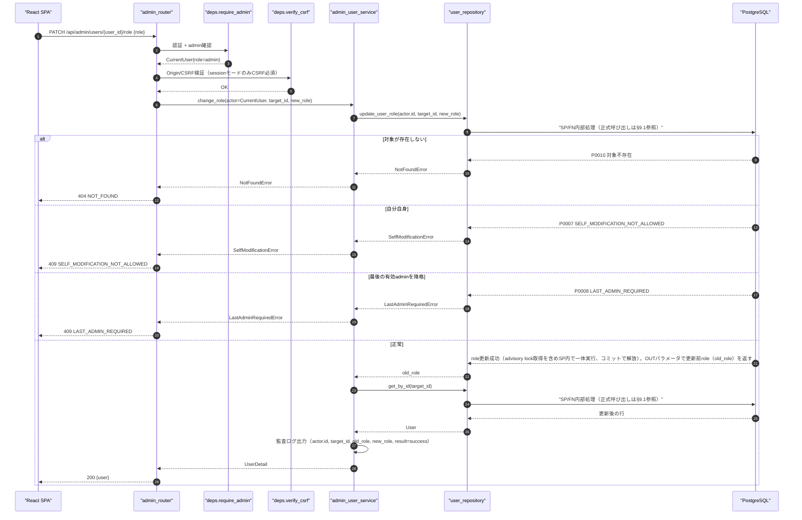
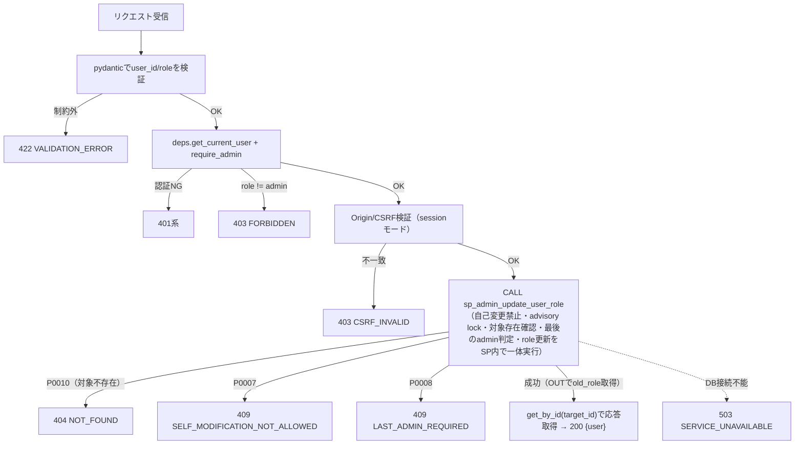
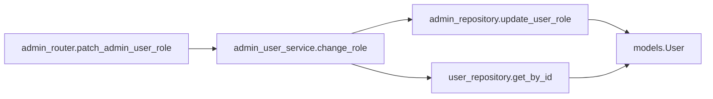
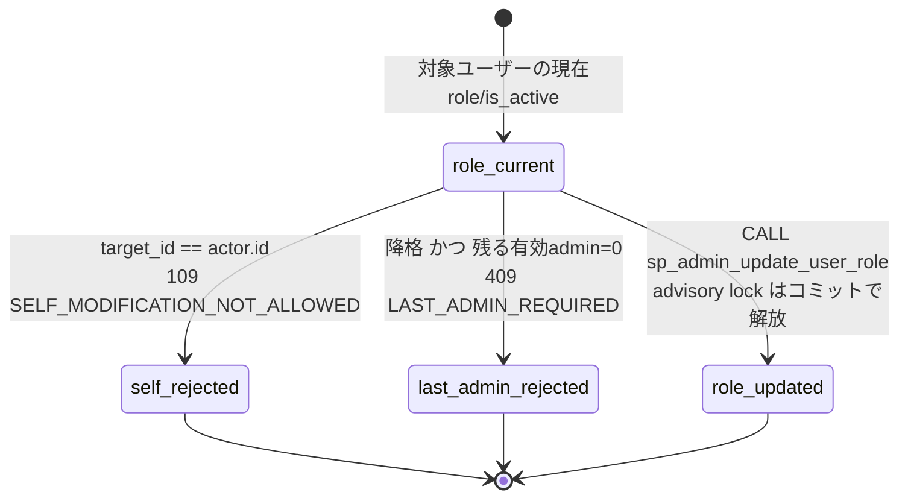

# PATCH /api/admin/users/{user_id}/role（ロール変更）

## 0. 関連ドキュメント

| ドキュメント | 内容 |
|--------------|------|
| [../../../basic_design/04_api.md](../../../basic_design/04_api.md) | §2.5 管理者API一覧（自己変更・最後のadmin保護の記述）、§4.2 エラーコード体系 |
| [../../../basic_design/01_database.md](../../../basic_design/01_database.md) | §3.1 users |
| [../../../basic_design/03_auth.md](../../../basic_design/03_auth.md) | §9.2 `core/deps.py`（`require_admin`）。role/usernameは常にPostgreSQLの現在値を正とする方針 |
| [../../database/01_table_users.md](../../database/01_table_users.md) | users テーブル定義（`ck_users_role`、`sp_admin_update_user_role`） |
| [./01_get_admin_users.md](./01_get_admin_users.md) | ロール変更後に反映される一覧API |
| [./03_patch_admin_user_status.md](./03_patch_admin_user_status.md) | 同じ「自己変更禁止・最後のadmin保護」の判定順序を共有する有効化/無効化API |

## 1. 概要

| 項目 | 内容 |
|------|------|
| エンドポイント | `PATCH /api/admin/users/{user_id}/role` |
| 目的 | 管理者が対象ユーザーの `role`（`member` ⇔ `admin`）を変更する |
| 認証 | 必要 |
| 認可 | admin のみ |
| CSRF検証 | 必要（session モードの更新系メソッド。`X-CSRF-Token` ヘッダ + `csrf:{sid}` 一致） |
| Origin検証 | 必要（Cookieを利用する更新系のため。jwt モードはAuthorizationヘッダのみで良くOriginは必須検証としない） |
| AUTH_MODE差異 | 差異なし。認証確立後の業務ロジックはモードに依存しない |
| 冪等性 | なし（現在のroleと同じ値を指定した場合は実質変化なしだが、自己変更禁止・最終admin判定は毎回同一ロジックを通過させるため厳密な冪等操作としては扱わない） |
| レート制限 | 対象外 |
| トランザクション境界 | アドバイザリロック取得 → 最後の有効admin判定 → `UPDATE users` を単一トランザクションで実行 |

## 2. 入出力仕様

### 2.1 リクエスト

**パスパラメータ**

| 名前 | 型 | 必須 | 制約 | 説明 |
|------|----|------|------|------|
| user_id | string(uuid) | ○ | UUID形式 | 対象ユーザーID |

**ボディ**

| フィールド | 型 | 必須 | 制約 | 説明 |
|-----------|----|------|------|------|
| role | string | ○ | `member` / `admin` のいずれか | 変更後のロール |

クエリパラメータ／該当ヘッダ（認証・CSRF・Cookieを除く）：なし。

### 2.2 レスポンス

**`200 OK`**

```json
{
  "id": "3f1c2a10-...",
  "username": "taro",
  "email": "taro@example.com",
  "role": "admin",
  "is_active": true,
  "updated_at": "2026-09-04T00:00:00Z"
}
```

| フィールド | 型 | NULL | 説明 |
|-----------|----|----|------|
| id | string(uuid) | 不可 | ユーザーID |
| username | string | 不可 | ログインID |
| email | string | 不可 | メールアドレス |
| role | string | 不可 | 更新後のロール |
| is_active | boolean | 不可 | 有効フラグ（本APIでは変更しないが最新値を返す） |
| updated_at | string(datetime) | 不可 | トリガにより自動更新された日時 |

`Set-Cookie` なし。共通ヘッダ `X-Request-ID` を全レスポンスに付与する。

## 3. エラー仕様

| HTTP | code | 発生条件 | メッセージ | 備考 |
|------|------|----------|------------|------|
| 401 | `UNAUTHENTICATED` / `SESSION_EXPIRED` / `TOKEN_EXPIRED` / `TOKEN_INVALID` | 認証情報なし・失効・不正 | 認証情報が無効です | |
| 403 | `USER_INACTIVE` | 実行者自身が `is_active=false` | アカウントが無効化されています | |
| 403 | `FORBIDDEN` | 実行者の `role != admin` | 権限がありません | |
| 403 | `CSRF_INVALID` | sessionモードでCSRFヘッダ不一致・欠落 | CSRFトークンが不正です | |
| 404 | `NOT_FOUND` | `user_id` が存在しない | ユーザーが見つかりません | |
| 409 | `SELF_MODIFICATION_NOT_ALLOWED` | `user_id` が実行者自身 | 自分自身のロールは変更できません | 4章の判定順序を参照 |
| 409 | `LAST_ADMIN_REQUIRED` | 対象が現在 `role=admin` かつ `is_active=true` で、変更後 `role=member` にすると有効なadminが0人になる | 最後の管理者を降格することはできません | 4章の判定順序を参照 |
| 422 | `VALIDATION_ERROR` | `role` が `member`/`admin` 以外・`user_id` がUUID形式でない | 入力内容に誤りがあります | `details` にフィールド情報 |
| 503 | `SERVICE_UNAVAILABLE` | PostgreSQL / Redis 接続不能 | しばらくしてから再度お試しください | fail-close |

`basic_design/04_api.md` §4.2 のエラーコード体系から逸脱しない。

## 4. 処理シーケンス



## 5. 処理フロー・分岐



**判定順序の理由**：自己変更禁止判定・対象存在確認・最後のadmin判定・advisory lockによる直列化は、いずれも `sp_admin_update_user_role` 内部で一体的に処理される。SP内部では自己変更を先に判定して早期に例外化し、`pg_advisory_xact_lock` を取得したうえで対象行を`FOR UPDATE`取得し、`NOT FOUND`ならP0010（対象不存在）へ、降格（admin→member）の場合のみ残る有効admin数を判定する。API・service層は追加のSELECTやロック取得を行わず、SPが返すSQLSTATE（`P0007`/`P0008`/`P0010`）をそのままHTTPエラーへ変換するだけである（#347レビューで事前存在確認SELECTを廃止し、SP呼び出し1回のみに整理）。

## 6. 関数詳細

### 6.1 `api/routers/admin_router.py :: patch_admin_user_role`

| 項目 | 内容 |
|------|------|
| シグネチャ | `async def patch_admin_user_role(user_id: UUID, payload: AdminUserRoleUpdateRequest, actor: CurrentUser = Depends(require_admin), _: None = Depends(verify_csrf), db: AsyncSession = Depends(get_db)) -> AdminUserDetailResponse` |
| 引数 | `user_id`: パス / `payload.role`: ボディ / `actor`: admin確認済みユーザー / `db`: DBセッション |
| 戻り値 | `AdminUserDetailResponse` |
| 送出例外 | なし（サービス層の例外をそのまま伝播） |
| 処理内容 | 1. `require_admin`・`verify_csrf` を通過 2. `admin_user_service.change_role` を呼び出す 3. 結果をそのまま返す |
| 副作用 | なし（副作用は全てservice/repository層） |

### 6.2 `service/admin_user_service.py :: change_role`

| 項目 | 内容 |
|------|------|
| シグネチャ | `async def change_role(actor: CurrentUser, target_id: UUID, new_role: str, db: AsyncSession) -> AdminUserDetailResponse` |
| 引数 | `actor`: 実行者（admin） / `target_id`: 対象ユーザーID / `new_role`: 変更後ロール / `db`: DBセッション |
| 戻り値 | 更新後の `AdminUserDetailResponse` |
| 送出例外 | `NotFoundError`（404）/ `SelfModificationError`（409）/ `LastAdminRequiredError`（409） |
| 処理内容 | `admin_repository.update_user_role(actor.id, target_id, new_role)` を1回呼ぶ。対象不存在（P0010）・自己変更禁止（P0007）・最後のadmin保護（P0008）・advisory lock・role更新はSP内部で一体実行され、更新前role（`old_role`）がOUTパラメータで返る。成功後は `user_repository.get_by_id(target_id)` で応答を取得し、`actor.id`/`target_id`/`old_role`/`new_role`/`result`を監査ログへINFO出力する（#347レビューで事前存在確認SELECTを廃止） |
| 副作用 | SP内で `users.role` を更新。Redisは変更せず、次回リクエストのDB再取得で認可へ反映 |

### 6.3 `repository/admin_repository.py :: update_user_role`

| 項目 | 内容 |
|------|------|
| シグネチャ | `async def update_user_role(db: AsyncSession, actor_id: UUID, target_id: UUID, new_role: str) -> str` |
| 引数 / 戻り値 | actor・target・新role / 更新前のrole（`OUT p_old_role`） |
| SP/FN呼び出し（内部SQLはSP側） | `CALL sp_admin_update_user_role(:actor_id, :target_id, :new_role, NULL)` |
| 送出例外 | `P0007 SELF_MODIFICATION_NOT_ALLOWED` / `P0008 LAST_ADMIN_REQUIRED` / `P0010`（対象不存在） |
| 処理内容 | SP内部で自己変更・対象の存在・最後のadminを判定し、必要なadvisory lockとrole更新を一体で行う。更新前roleをOUTパラメータで返すことで、service層が監査ログ用に別途SELECTする必要をなくす |
| 副作用 | SP内のusers更新 |

## 7. 関数相関図



## 8. データ遷移図



Redisのキー状態は変化しない（本APIはPostgreSQLの `users.role` のみを更新する）。

## 9. SP/FNデータアクセス一覧

### 9.1 正式なDBアクセス契約

本APIのrepositoryは、次のSP/FN呼び出しとDTO写像だけを行う。

| 種別 | 契約 | 説明 |
|------|------|------|
| admin_update_user_role | `sp_admin_update_user_role(p_actor_id, p_target_id, p_new_role, OUT p_old_role)` | sp_admin_update_user_roleを呼び出し、更新前role（OUT）と更新後の応答（`get_by_id`で別途取得）をレスポンスへ写像する |

repositoryはDBテーブルへ直結せず、SP/FN契約だけを呼び出す。 直下の従来のテーブルI/O表はSP/FN内部SQLの補足であり、repositoryの発行契約ではない。更新系の整合性制御、version検証、advisory lock、通知、SQLSTATE P0xxxはSP/FN層の責務である。存在・所属の事実判定はFNの空集合/falseを受け、404/403への変換はAPI層が行う。

**PostgreSQL**

| テーブル／関数 | 操作 | 条件・TTL | 備考 |
|----------------|------|-----------|------|
| users | SELECT ... FOR UPDATE | `id=:target_id` | 対象行ロック。`NOT FOUND`ならP0010（対象不存在）をRAISEする（#347レビューで追加） |
| users | SELECT COUNT | `role='admin' AND is_active=true AND id<>:target_id` | 降格判定時のみ実行 |
| `pg_advisory_xact_lock` | 関数呼び出し | キー `hashtext('admin_role_change')` | 降格判定時のみ実行。トランザクション終了で自動解放 |
| users | UPDATE | `id=:target_id` | `role` のみ更新。`updated_at` はトリガ |

**Redis**

| キー | 操作 | TTL | 備考 |
|------|------|-----|------|
| `session:{sid}`（sessionモードのみ） | GET | `SESSION_TTL_SECONDS` | `deps.get_current_user` の認証確認のみ。本APIはRedisを更新しない |

## 10. バリデーション規則

| pydanticスキーマ | フィールド | 制約 | フロント（zod）との整合 |
|-------------------|-----------|------|--------------------------|
| パスパラメータ | user_id | UUID形式 | `zod.string().uuid()` |
| `AdminUserRoleUpdateRequest` | role | `Literal["member","admin"]` | `zod.enum(["member","admin"])` |

## 11. 非機能・セキュリティ考慮

| 観点 | 内容 |
|------|------|
| ログ出力 | 監査ログ対象。`actor.id`, `target_id`, `old_role`, `new_role`, 結果（成功/409種別）, `X-Request-ID` をINFO出力 |
| ユーザー列挙対策 | admin専用APIのため対象外 |
| タイミング攻撃対策 | 該当なし |
| レート制限 | なし |
| fail-close方針 | PostgreSQL接続不能時は `503 SERVICE_UNAVAILABLE` |
| 競合対策 | `FOR UPDATE` による対象行ロックと `pg_advisory_xact_lock` による降格処理の直列化により、2件の同時降格リクエストが両方成功して有効adminが0人になる事態を防ぐ |
| 認可の即時反映 | ロール変更は既存のセッション/アクセストークンを失効させない。次回リクエスト以降 `deps.get_current_user` がPostgreSQLの現在role列を再取得して認可判定に使うため、降格は次のリクエストから反映される（sessionはRedisの `session:{sid}` からuser_idのみ取得しroleはDB参照、jwtも同様にroleをJWT/Redisに含めない設計のため） |

## 12. テスト設計

| No | 区分 | ケース | 前提 | 期待結果 | pytest関数名案 |
|----|------|--------|------|----------|-----------------|
| 1 | 単体 | 自己変更は最後のadmin判定より先に拒否される | `target_id == actor.id`、かつ実質的に最後のadminでもある状況 | `409 SELF_MODIFICATION_NOT_ALLOWED`、`sp_admin_update_user_role`未呼び出し | `test_change_role_self_modification_checked_before_last_admin` |
| 2 | 単体 | 最後の有効adminの降格は拒否される | 有効admin1名のみが存在し、それを対象に`member`へ変更 | `409 LAST_ADMIN_REQUIRED` | `test_change_role_last_admin_required` |
| 3 | 単体 | 無効化済みadminは降格対象カウントに含めない | 対象以外に `role=admin, is_active=false` のユーザーが存在 | `sp_admin_update_user_role` が0を返し `409 LAST_ADMIN_REQUIRED` | `test_change_role_inactive_admin_not_counted` |
| 4 | 単体 | 昇格（member→admin）は最後のadmin判定を経由しない | 対象が `role=member` | `sp_admin_update_user_role` 未呼び出しで200相当の更新処理へ | `test_change_role_promotion_skips_last_admin_check` |
| 5 | 結合 | 対象ユーザーが存在しない場合は404 | 存在しないUUID | `404 NOT_FOUND` | `test_change_role_target_not_found` |
| 6 | 結合 | 通常の降格（他に有効adminがいる）は成功する | 有効admin2名のうち1名を対象に`member`へ変更 | `200`、`users.role='member'` | `test_change_role_demote_success_with_other_admin` |
| 7 | 結合 | 同時に2件の降格リクエストが飛んだ場合、片方のみ成功する | 有効admin2名に対し同時に相互を`member`へ降格するリクエストを発行 | 1件は`200`、もう1件は`409 LAST_ADMIN_REQUIRED`（advisory lockによる直列化） | `test_change_role_concurrent_demotion_serialized` |
| 8 | 結合 | member（非admin）はアクセス不可 | `role=member` の実行者 | `403 FORBIDDEN` | `test_change_role_forbidden_for_member` |
| 9 | 結合 | sessionモードでCSRFヘッダ欠落は403 | `AUTH_MODE=session` | `403 CSRF_INVALID` | `test_change_role_csrf_required_in_session_mode` |
| 10 | 結合 | roleに不正値を指定すると422 | `role="superadmin"` | `422 VALIDATION_ERROR` | `test_change_role_invalid_role_value` |

No.7は本APIの中核である競合制御の検証であり、`asyncio.gather` 等で同時に2リクエストを発行し実PostgreSQLコンテナ上で検証する（`AUTH_MODE`両方で実施する必要はなく、認証確立後の業務ロジック検証のため `session` モードのみで実施し理由を明記する）。

## 13. 不明点・要検討事項

| 区分 | 内容 | 影響 |
|------|------|------|
| 要検討 | 「自己変更禁止」を、変更後の値が現在と同じ場合（例：admin自身が`role=admin`を指定）にも一律で409とするか、実質変化がない場合は許容するかは基本設計に明記がない。本書では一律で拒否する方針とした |
| 要検討 | `pg_advisory_xact_lock` に用いるロックキー文字列（`'admin_role_change'`）は基本設計に記載がなく本書での提案。同一キーを[03_patch_admin_user_status.md](./03_patch_admin_user_status.md)の無効化処理とも共有すべきかは実装時に要確認（役割変更と無効化を同一ロックで直列化すればより安全だが、本書では役割変更用として独立させた） |
