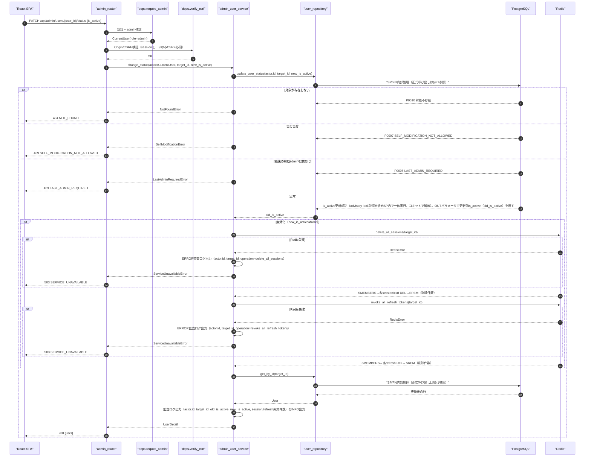
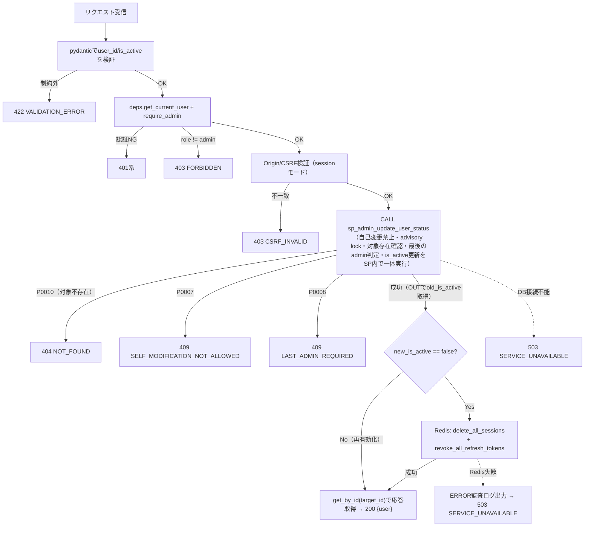
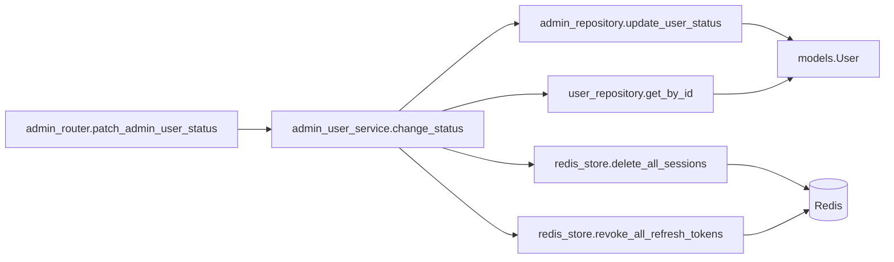
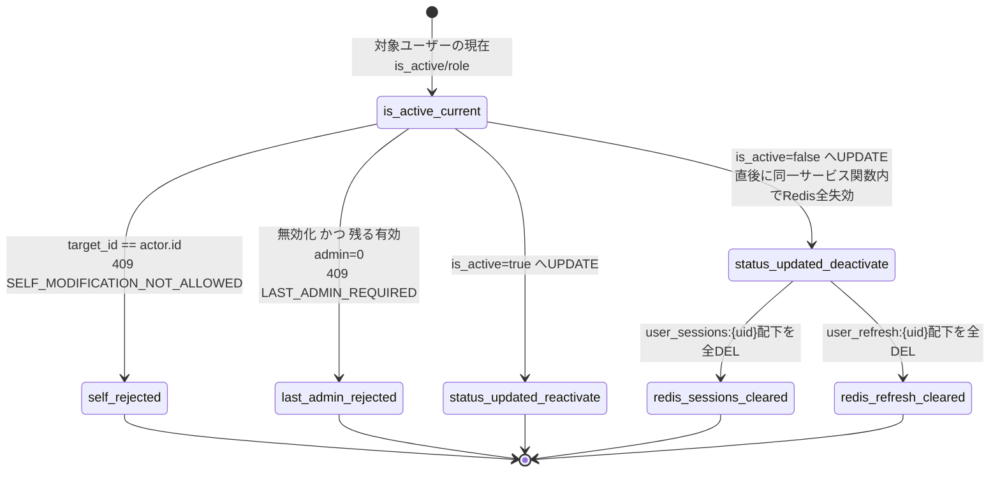

# PATCH /api/admin/users/{user_id}/status（有効化 / 無効化）

## 0. 関連ドキュメント

| ドキュメント | 内容 |
|--------------|------|
| [../../../basic_design/04_api.md](../../../basic_design/04_api.md) | §2.5 管理者API一覧（無効化時の全失効・JWTのis_active毎回確認の記述）、§4.2 エラーコード体系 |
| [../../../basic_design/03_auth.md](../../../basic_design/03_auth.md) | §9.2 `get_current_user`（`is_active` 確認）、§4.2 jwtは毎回Redisを参照せず署名検証のみ |
| [../../../basic_design/02_redis.md](../../../basic_design/02_redis.md) | §2 キー一覧（`user_sessions:{uid}` / `user_refresh:{uid}`）、§5.1/5.2 `delete_all_sessions` / `revoke_all_refresh_tokens` |
| [../../database/01_table_users.md](../../database/01_table_users.md) | users テーブル定義（`is_active`、`sp_admin_update_user_status`） |
| [./02_patch_admin_user_role.md](./02_patch_admin_user_role.md) | 同じ「自己変更禁止・最後のadmin保護」の判定順序を共有するロール変更API |
| [./04_post_admin_user_force_logout.md](./04_post_admin_user_force_logout.md) | 全セッション・全リフレッシュ失効のみを行うAPI（本APIはDB更新も併せて行う点が異なる） |

## 1. 概要

| 項目 | 内容 |
|------|------|
| エンドポイント | `PATCH /api/admin/users/{user_id}/status` |
| 目的 | 管理者が対象ユーザーの `is_active` を切り替える。無効化時はDB更新とRedis上の全セッション・全リフレッシュトークン失効を同一サービス処理内で完了させる |
| 認証 | 必要 |
| 認可 | admin のみ |
| CSRF検証 | 必要（session モードの更新系メソッド） |
| Origin検証 | 必要（sessionモードのみ。jwtモードはAuthorizationヘッダのみのため不要） |
| AUTH_MODE差異 | DB更新自体はモード非依存だが、無効化直後の効果に差がある（3章参照） |
| 冪等性 | あり（同じ `is_active` 値を再指定しても結果は同じ状態になる。ただしRedis失効処理は無効化のたびに実行される） |
| レート制限 | 対象外 |
| トランザクション境界 | `sp_admin_update_user_status`によるPostgreSQLの`is_active`更新を先にコミットし、成功後にRedisの`delete_all_sessions` / `revoke_all_refresh_tokens`を実行する（§4「判定順序の理由」参照）。Redis失効が失敗してもDBの無効化はロールバックしない。フェイルセーフ側（無効化済み）に倒し、再試行または運用者による手動失効で補償する |

## 2. 入出力仕様

### 2.1 リクエスト

**パスパラメータ**

| 名前 | 型 | 必須 | 制約 | 説明 |
|------|----|------|------|------|
| user_id | string(uuid) | ○ | UUID形式 | 対象ユーザーID |

**ボディ**

| フィールド | 型 | 必須 | 制約 | 説明 |
|-----------|----|------|------|------|
| is_active | boolean | ○ | - | `false`＝無効化、`true`＝再有効化 |

クエリパラメータ／該当ヘッダ（認証・CSRF・Cookieを除く）：なし。

### 2.2 レスポンス

**`200 OK`**

```json
{
  "id": "3f1c2a10-...",
  "username": "taro",
  "email": "taro@example.com",
  "role": "member",
  "is_active": false,
  "updated_at": "2026-09-04T00:00:00Z"
}
```

| フィールド | 型 | NULL | 説明 |
|-----------|----|----|------|
| id / username / email / role | 各種 | 不可 | [01_get_admin_users.md](./01_get_admin_users.md) と同一定義 |
| is_active | boolean | 不可 | 更新後の値 |
| updated_at | string(datetime) | 不可 | トリガにより自動更新された日時 |

`Set-Cookie` なし。共通ヘッダ `X-Request-ID` を全レスポンスに付与する。

## 3. エラー仕様

| HTTP | code | 発生条件 | メッセージ | 備考 |
|------|------|----------|------------|------|
| 401 | `UNAUTHENTICATED` / `SESSION_EXPIRED` / `TOKEN_EXPIRED` / `TOKEN_INVALID` | 認証情報なし・失効・不正 | 認証情報が無効です | |
| 403 | `USER_INACTIVE` | 実行者自身が `is_active=false` | アカウントが無効化されています | |
| 403 | `FORBIDDEN` | 実行者の `role != admin` | 権限がありません | |
| 403 | `CSRF_INVALID` | sessionモードでCSRFヘッダ不一致・欠落 | CSRFトークンが不正です | |
| 404 | `NOT_FOUND` | `user_id` が存在しない | ユーザーが見つかりません | |
| 409 | `SELF_MODIFICATION_NOT_ALLOWED` | `user_id` が実行者自身 | 自分自身は無効化できません | 4章の判定順序を参照 |
| 409 | `LAST_ADMIN_REQUIRED` | 対象が現在 `role=admin` かつ `is_active=true` で、`is_active=false` にすると有効なadminが0人になる | 最後の管理者を無効化することはできません | 4章の判定順序を参照 |
| 422 | `VALIDATION_ERROR` | `is_active` が boolean でない・`user_id` がUUID形式でない | 入力内容に誤りがあります | `details` にフィールド情報 |
| 503 | `SERVICE_UNAVAILABLE` | PostgreSQL / Redis 接続不能 | しばらくしてから再度お試しください | fail-close |

`basic_design/04_api.md` §4.2 のエラーコード体系から逸脱しない。

## 4. 処理シーケンス



## 5. 処理フロー・分岐



**判定順序の理由**：[02_patch_admin_user_role.md](./02_patch_admin_user_role.md) と同一の考え方で、自己変更禁止判定・対象存在確認・最後のadmin判定・advisory lockによる直列化はいずれも `sp_admin_update_user_status` 内部で一体的に処理される。API/service層は追加のSELECTやロック取得を行わず、SPが返すSQLSTATE（`P0007`/`P0008`/`P0010`）をそのままHTTPエラーへ変換する（#347レビューで事前存在確認SELECTを廃止し、SP呼び出し1回のみに整理。更新前is_activeはOUTパラメータで受け取る）。DB更新後にRedis失効を行う順序とすることで、「DB上は無効化されたがRedisのセッションだけが生き残る」中間状態が発生してもフェイルセーフ側（無効化済み）に倒れる。Redis失効が失敗した場合はDBの無効化をロールバックせず、`actor.id`/`target_id`/失敗した操作（sessions/refresh_tokens）をERROR監査ログへ出力してから503を返す。運用者はこのログを検知して同じuser_idに対する失効を再試行、または手動失効で補償する。逆に「Redisは失効したがDB更新前に失敗した」場合はトランザクションがロールバックされDB上は有効なままとなり、この場合はユーザーが再ログインすればセッションが再発行されるため実害はない。

## 6. 関数詳細

### 6.1 `api/routers/admin_router.py :: patch_admin_user_status`

| 項目 | 内容 |
|------|------|
| シグネチャ | `async def patch_admin_user_status(user_id: UUID, payload: AdminUserStatusUpdateRequest, actor: CurrentUser = Depends(require_admin), _: None = Depends(verify_csrf), db: AsyncSession = Depends(get_db)) -> AdminUserDetailResponse` |
| 引数 | `user_id`: パス / `payload.is_active`: ボディ / `actor`: admin確認済みユーザー / `db`: DBセッション |
| 戻り値 | `AdminUserDetailResponse` |
| 送出例外 | なし（サービス層の例外をそのまま伝播） |
| 処理内容 | 1. `require_admin`・`verify_csrf` を通過 2. `admin_user_service.change_status` を呼び出す 3. 結果をそのまま返す |
| 副作用 | なし |

### 6.2 `service/admin_user_service.py :: change_status`

| 項目 | 内容 |
|------|------|
| シグネチャ | `async def change_status(actor: CurrentUser, target_id: UUID, new_is_active: bool, db: AsyncSession) -> AdminUserDetailResponse` |
| 引数 | `actor`: 実行者（admin） / `target_id`: 対象ユーザーID / `new_is_active`: 変更後の値 / `db`: DBセッション |
| 戻り値 | 更新後の `AdminUserDetailResponse` |
| 送出例外 | `NotFoundError`（404）/ `SelfModificationError`（409）/ `LastAdminRequiredError`（409）/ `ServiceUnavailableError`（503） |
| 処理内容 | `admin_repository.update_user_status(actor.id, target_id, new_is_active)` を1回呼ぶ。対象不存在（P0010）・自己変更禁止（P0007）・最後のadmin保護（P0008）・advisory lock・status更新はSP内部で一体実行され、更新前is_active（`old_is_active`）がOUTパラメータで返る。無効化が成功した場合だけAPI層がRedis失効（`delete_all_sessions`→`revoke_all_refresh_tokens`）を続けて実行し、失敗時は`actor.id`/`target_id`/失敗した操作をERROR監査ログへ出力してから`ServiceUnavailableError`にする。成功後は`user_repository.get_by_id`で応答を取得し、`actor.id`/`target_id`/`old_is_active`/`new_is_active`/失効件数を監査ログへINFO出力する（#347レビューで事前存在確認SELECTを廃止） |
| 副作用 | SP内で `users.is_active` を更新。無効化時はDB更新成功後にRedisの `session:{sid}` / `csrf:{sid}` / `user_sessions:{uid}` / `refresh:{hash}` / `user_refresh:{uid}` をAPI層が全削除 |

### 6.3 `repository/admin_repository.py :: update_user_status`

| 項目 | 内容 |
|------|------|
| シグネチャ | `async def update_user_status(db: AsyncSession, actor_id: UUID, target_id: UUID, is_active: bool) -> bool` |
| DB呼び出し | `CALL sp_admin_update_user_status(:actor_id, :target_id, :is_active, NULL)` |
| 戻り値 | 更新前のis_active（`OUT p_old_is_active`） |
| 送出例外 | `P0007 SELF_MODIFICATION_NOT_ALLOWED` / `P0008 LAST_ADMIN_REQUIRED` / `P0010`（対象不存在） |
| 責務 | 自己変更、対象存在、最後のadmin、advisory lock、users更新をSP内で一体実行する。更新前is_activeをOUTパラメータで返すことで、service層が監査ログ用に別途SELECTする必要をなくす |

### 6.4 `repository/redis_store.py :: delete_all_sessions`（既存関数の再掲）

| 項目 | 内容 |
|------|------|
| シグネチャ | `async def delete_all_sessions(user_id: UUID) -> int` |
| 引数 / 戻り値 | `user_id`：対象ユーザー / 削除したセッション件数 |
| 処理内容 | 1. `SMEMBERS user_sessions:{uid}` で有効な `session_id` 一覧を取得 2. 各 `session_id` について `DEL session:{sid}` / `DEL csrf:{sid}` 3. `DEL user_sessions:{uid}` |
| 送出例外 | `RedisError`（Redis接続不能） |
| 副作用 | Redis上の該当セッション関連キーを全削除。詳細は[02_redis.md §5.1](../../../basic_design/02_redis.md#51-セッション操作) |

### 6.5 `repository/redis_store.py :: revoke_all_refresh_tokens`（既存関数の再掲）

| 項目 | 内容 |
|------|------|
| シグネチャ | `async def revoke_all_refresh_tokens(user_id: UUID) -> int` |
| 引数 / 戻り値 | `user_id`：対象ユーザー / 削除したリフレッシュトークン件数 |
| 処理内容 | 1. `SMEMBERS user_refresh:{uid}` で有効な `token_hash` 一覧を取得 2. 各 `token_hash` について `DEL refresh:{hash}` 3. `DEL user_refresh:{uid}` |
| 送出例外 | `RedisError` |
| 副作用 | Redis上の該当リフレッシュトークン関連キーを全削除。詳細は[02_redis.md §5.2](../../../basic_design/02_redis.md#52-リフレッシュトークン操作) |

## 7. 関数相関図



## 8. データ遷移図



## 9. SP/FNデータアクセス一覧

### 9.1 正式なDBアクセス契約

本APIのrepositoryは、次のSP/FN呼び出しとDTO写像だけを行う。

| 種別 | 契約 | 説明 |
|------|------|------|
| admin_update_user_status | `sp_admin_update_user_status(p_actor_id, p_target_id, p_is_active, OUT p_old_is_active)` | sp_admin_update_user_statusを呼び出し、更新前is_active（OUT）と更新後の応答（`get_by_id`で別途取得）をレスポンスへ写像する |

repositoryはDBテーブルへ直結せず、SP/FN契約だけを呼び出す。 直下の従来のテーブルI/O表はSP/FN内部SQLの補足であり、repositoryの発行契約ではない。更新系の整合性制御、version検証、advisory lock、通知、SQLSTATE P0xxxはSP/FN層の責務である。存在・所属の事実判定はFNの空集合/falseを受け、404/403への変換はAPI層が行う。

**PostgreSQL**

| テーブル／関数 | 操作 | 条件・TTL | 備考 |
|----------------|------|-----------|------|
| users | SELECT ... FOR UPDATE | `id=:target_id` | 対象行ロック。`NOT FOUND`ならP0010（対象不存在）をRAISEする（#347レビューで追加） |
| users | SELECT COUNT | `role='admin' AND is_active=true AND id<>:target_id` | 無効化かつ現在adminの場合のみ実行 |
| `pg_advisory_xact_lock` | 関数呼び出し | キー `hashtext('admin_role_change')` | 同上の場合のみ実行。[02_patch_admin_user_role.md](./02_patch_admin_user_role.md)と共通のロックキー |
| users | UPDATE | `id=:target_id` | `is_active` のみ更新 |

**Redis**（無効化時のみ実行。再有効化時は実行しない）

| キー | 操作 | TTL | 備考 |
|------|------|-----|------|
| `user_sessions:{target_id}` | SMEMBERS → DEL | - | 有効session_id一覧取得後に集合ごと削除 |
| `session:{sid}`（各session_idごと） | DEL | - | 即時失効 |
| `csrf:{sid}`（各session_idごと） | DEL | - | 即時失効 |
| `user_refresh:{target_id}` | SMEMBERS → DEL | - | 有効token_hash一覧取得後に集合ごと削除 |
| `refresh:{hash}`（各token_hashごと） | DEL | - | 即時失効 |

## 10. バリデーション規則

| pydanticスキーマ | フィールド | 制約 | フロント（zod）との整合 |
|-------------------|-----------|------|--------------------------|
| パスパラメータ | user_id | UUID形式 | `zod.string().uuid()` |
| `AdminUserStatusUpdateRequest` | is_active | `bool` | `zod.boolean()` |

## 11. 非機能・セキュリティ考慮

| 観点 | 内容 |
|------|------|
| ログ出力 | 監査ログ対象。`actor.id`, `target_id`, `old_is_active`, `new_is_active`, Redis失効件数（session/refreshそれぞれ）, `X-Request-ID` をINFO出力 |
| ユーザー列挙対策 | admin専用APIのため対象外 |
| タイミング攻撃対策 | 該当なし |
| レート制限 | なし |
| fail-close方針 | PostgreSQL/Redis接続不能時は `503 SERVICE_UNAVAILABLE`。DB更新を先に行うため、Redis失効が失敗してもDBの無効化はロールバックしない。Redis失効の失敗時は`actor.id`/`target_id`/失敗した操作（`delete_all_sessions`/`revoke_all_refresh_tokens`のどちらか）をERROR出力し、運用者が検知して同じuser_idで再試行または手動失効できるようにする（#347レビューで追加） |
| sessionモードへの効果 | `session:{sid}` の即時DELにより、無効化直後のリクエストから `401 SESSION_EXPIRED` となる |
| jwtモードへの効果 | アクセストークンはRedisを参照しない署名検証のみのため、`user_refresh` 配下のリフレッシュトークンを失効させても既発行のアクセストークンは失効しない。ただし `deps.get_current_user` は認証成立後に必ず `users` テーブルの `is_active` を再確認するため（[03_auth.md §9.2](../../../basic_design/03_auth.md#92-依存性関数coredepspy)）、無効化直後のリクエストからは `403 USER_INACTIVE` で拒否される。すなわち「アクセストークンの署名は有効だがDB確認により403で弾かれる」という形で実質的に即時遮断される |
| 最後のadmin保護 | ロール変更API（[02](./02_patch_admin_user_role.md)）と同一の `pg_advisory_xact_lock` キーを用いた直列化で、無効化とロール変更が同時に発生しても有効adminが0人になることを防ぐ |

## 12. テスト設計

| No | 区分 | ケース | 前提 | 期待結果 | pytest関数名案 |
|----|------|--------|------|----------|-----------------|
| 1 | 単体 | 自己変更は最後のadmin判定より先に拒否される | `target_id == actor.id` | `409 SELF_MODIFICATION_NOT_ALLOWED`、`sp_admin_update_user_status`未呼び出し | `test_change_status_self_modification_checked_before_last_admin` |
| 2 | 単体 | 最後の有効adminの無効化は拒否される | 有効admin1名のみ、それを対象に`is_active=false` | `409 LAST_ADMIN_REQUIRED` | `test_change_status_last_admin_required` |
| 3 | 単体 | member対象の無効化は最後のadmin判定を経由しない | 対象が `role=member` | `sp_admin_update_user_status`未呼び出しで更新処理へ | `test_change_status_member_deactivation_skips_last_admin_check` |
| 4 | 結合 | 無効化時にDB更新成功後、API層がRedis失効2種を順に呼ぶ | 実DB・実SPとRedisを使用 | `CALL sp_admin_update_user_status`→commit→`delete_all_sessions`→`revoke_all_refresh_tokens`の順 | `test_change_status_deactivate_db_then_redis_order` |
| 5 | 単体 | 再有効化時はRedis失効を呼ばない | `new_is_active=True` | `delete_all_sessions`/`revoke_all_refresh_tokens`未呼び出し | `test_change_status_reactivate_skips_redis_revocation` |
| 6 | 結合 | 対象ユーザーが存在しない場合は404 | 存在しないUUID | `404 NOT_FOUND` | `test_change_status_target_not_found` |
| 7 | 結合(session) | 無効化直後にsession Cookieでのリクエストが401になる | 対象ユーザーでログイン中にadminが無効化 | `401 SESSION_EXPIRED` | `test_change_status_session_invalidated_immediately` |
| 8 | 結合(jwt) | 無効化直後にaccess tokenでのリクエストが403 USER_INACTIVEになる | 対象ユーザーでログイン中（access token未失効）にadminが無効化 | `403 USER_INACTIVE`（署名検証は通過するがDBのis_active確認で拒否） | `test_change_status_jwt_access_token_rejected_by_db_check` |
| 9 | 結合(jwt) | 無効化直後に対象ユーザーのrefreshが失効している | 無効化前に発行済みのrefresh tokenで`/auth/refresh`を実行 | `401 TOKEN_REVOKED`相当（`refresh:{hash}`が存在しない） | `test_change_status_jwt_refresh_revoked_after_deactivation` |
| 10 | 結合 | 複数端末でログイン中のユーザーを無効化すると全端末が失効する | 同一ユーザーでsession 2件を作成 | 両方の`session:{sid}`がDELされ、両端末とも401になる | `test_change_status_deactivate_invalidates_all_devices` |
| 11 | 結合 | 再有効化後は新規ログインが可能 | 無効化→再有効化 | 再有効化後のログインが200/204で成功する | `test_change_status_reactivate_allows_new_login` |
| 12 | 結合 | member（非admin）はアクセス不可 | `role=member` の実行者 | `403 FORBIDDEN` | `test_change_status_forbidden_for_member` |

No.7〜9は本APIの中核（session/jwt双方での失効挙動の違い）であり、`AUTH_MODE=session` と `AUTH_MODE=jwt` をそれぞれ専用のテストケースとして実施する（両方を1つのパラメータ化テストにまとめず、モードごとの挙動差そのものを検証対象とするため）。

## 13. Issue #8で確定した事項

| 区分 | 内容 | 影響 |
|------|------|------|
| 採用 | DB更新をRedis失効より先に実行する（判定順序の理由は4章参照）。Redis失効が失敗してもDBの無効化はロールバックせず、フェイルセーフ側（無効化済み）に倒す。部分失効はERROR監査後に同じuser_idで再実行できる | staleな認証状態を残さない |
| 要検討 | ロール変更API（[02](./02_patch_admin_user_role.md)）と同一の `pg_advisory_xact_lock` キーを共有する設計としたが、ロック粒度（役割変更と無効化を同一キーで直列化するか、別キーにするか）は基本設計に記載がなく本書での提案 |
