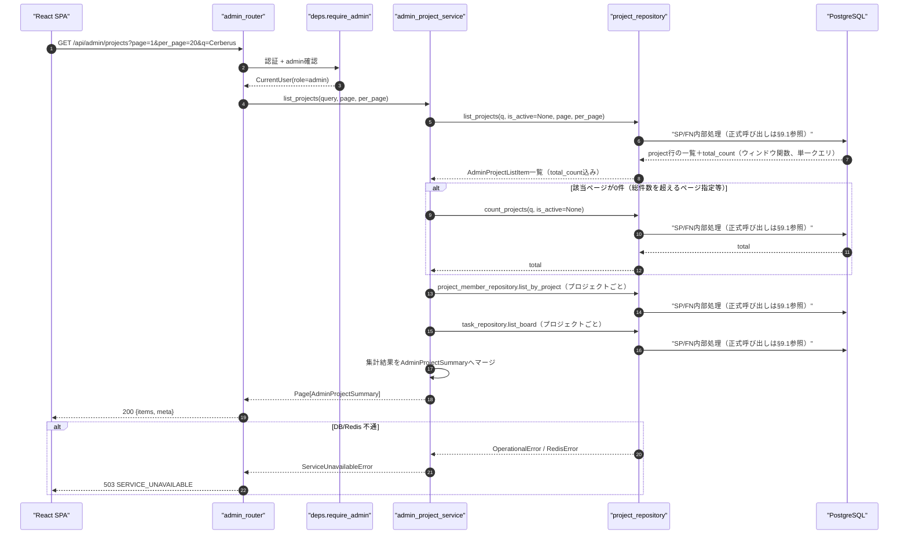
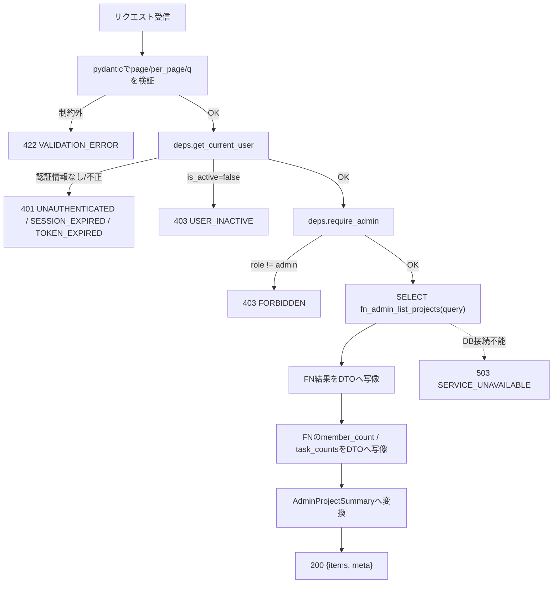
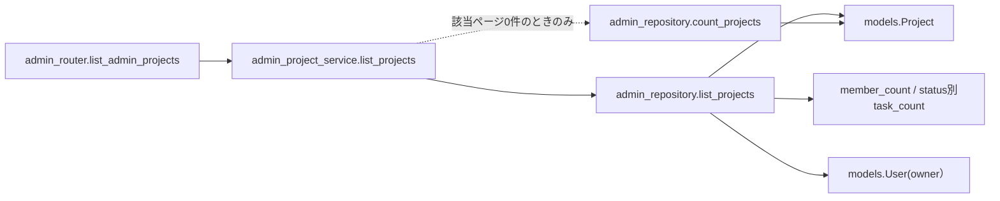
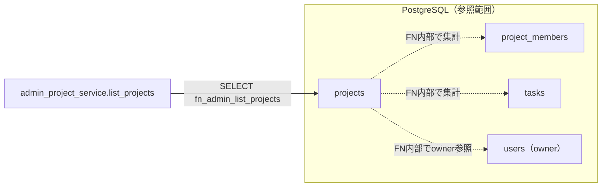

# GET /api/admin/projects（全プロジェクト一覧取得）

## 0. 関連ドキュメント

| ドキュメント | 内容 |
|--------------|------|
| [../../../basic_design/04_api.md](../../../basic_design/04_api.md) | §2.3 `GET /projects`（admin 全件）、§2.5 管理者API一覧、§4.2 エラーコード体系、§5 認可マトリクス、§7.2 サービス層関数一覧 |
| [../../../basic_design/01_database.md](../../../basic_design/01_database.md) | §3.3 projects、§3.4 project_members、§3.5 tasks、§7 主要クエリ（Q-2） |
| [../../../basic_design/05_frontend.md](../../../basic_design/05_frontend.md) | §7.7 管理者ユーザー管理（プロジェクト一覧タブ） |
| [../projects/01_get_projects.md](../projects/01_get_projects.md) | `GET /projects`（admin時は全件返却）。本APIとの使い分けは1章参照 |
| [./01_get_admin_users.md](./01_get_admin_users.md) | 同じ管理者画面から呼ばれる姉妹API（クエリ設計・ページング規約を統一） |
| [./06_delete_admin_project.md](./06_delete_admin_project.md) | 本一覧の削除操作 |
| [../../screen/10_admin_users.md](../../screen/10_admin_users.md) | 本APIを呼び出す画面（管理者ユーザー管理画面・プロジェクト一覧タブ） |

## 1. 概要

| 項目 | 内容 |
|------|------|
| エンドポイント | `GET /api/admin/projects` |
| 目的 | 管理者が全プロジェクトをページング・検索付きで一覧参照する（管理者画面のプロジェクト一覧タブ専用） |
| 認証 | 必要（session Cookie または `Authorization: Bearer`） |
| 認可 | admin のみ |
| CSRF検証 | 不要（参照系 GET） |
| Origin検証 | 不要（Cookie発行・更新系ではないため） |
| AUTH_MODE差異 | 差異なし（`deps.get_current_user` が方式差を吸収する） |
| 冪等性 | あり（GET） |
| レート制限 | 対象外 |
| トランザクション境界 | 単一の読み取りトランザクション（更新なし） |

`GET /projects` との使い分けは以下のとおりである。

| 観点 | `GET /projects`（`04_get_project...` 参照）※admin利用時 | `GET /admin/projects`（本API） |
|------|-----------------------------------------------------|--------------------------------|
| 主用途 | ダッシュボード画面（`screen/06_dashboard.md`）。adminも自分用ダッシュボードとして全件を閲覧できる副次効果を持つに過ぎない | 管理者ユーザー管理画面のプロジェクト一覧タブ（`screen/10_admin_users.md`）専用 |
| 認可 | member（自分の所属分のみ）／admin（全件） | admin固定。member/オーナーは403（一般ユーザーには存在自体を見せない） |
| `is_owner` | あり（自分がオーナーかどうかをダッシュボードで表示するため） | なし（管理者視点の一覧であり「自分のプロジェクトか」は無関係） |
| 検索 (`q`) | なし | あり（プロジェクト名の部分一致） |
| 削除操作との連携 | なし（削除は `DELETE /projects/{id}` でオーナー/admin向け） | あり（`DELETE /admin/projects/{project_id}` と対になる管理者専用の削除導線） |
| 内部実装 | `admin_repository.list_projects`（`query=None`で呼び出し） | 同じFNを`query`付きで呼び出す（クエリ実装を共有し重複実装しない） |

## 2. 入出力仕様

### 2.1 リクエスト

**クエリパラメータ**

| 名前 | 型 | 必須 | 制約 | 説明 |
|------|----|------|------|------|
| page | integer | 任意 | 1以上。既定 `1` | ページ番号 |
| per_page | integer | 任意 | 1〜100。既定 `20`（`PAGINATION_DEFAULT_PER_PAGE` / `PAGINATION_MAX_PER_PAGE`） | 1ページあたり件数 |
| q | string | 任意 | 100文字以内 | プロジェクト名 (`projects.name`) の部分一致検索（大文字小文字区別なし） |

パスパラメータ／ヘッダ（認証ヘッダ・Cookieを除く）／ボディ：なし。

### 2.2 レスポンス

**`200 OK`**

```json
{
  "items": [
    {
      "id": "3f1c2a10-...",
      "name": "Cerberus開発",
      "description": "学習用タスク管理システムの開発",
      "owner": { "id": "1a2b...", "username": "taro", "display_name": "山田 太郎" },
      "member_count": 3,
      "task_counts": { "todo": 4, "in_progress": 2, "done": 7 },
      "is_active": true,
      "start_at": null,
      "end_at": null,
      "created_at": "2026-09-01T00:00:00Z"
    }
  ],
  "meta": { "page": 1, "per_page": 20, "total": 1, "total_pages": 1 }
}
```

| フィールド | 型 | NULL | 説明 |
|-----------|----|----|------|
| items[].id | string(uuid) | 不可 | プロジェクトID |
| items[].name | string | 不可 | プロジェクト名 |
| items[].description | string | 可 | 説明 |
| items[].owner.id / username | string | 不可 | オーナーの識別情報 |
| items[].owner.display_name | string | 不可 | `last_name + ' ' + first_name`（未設定項目があれば `username` を代替表示。[01_get_projects.md](../projects/01_get_projects.md) と同一規則） |
| items[].member_count | integer | 不可 | `project_members` の件数 |
| items[].task_counts.todo / in_progress / done | integer | 不可 | status別タスク件数。0件のstatusも `0` を返す |
| items[].is_active | boolean | 不可 | `issue #10`で追加された論理削除フラグ。管理者一覧は`is_active`の値に関わらず常に全件（無効化済みも含む）を返す。管理画面から`DELETE /admin/projects/{id}`（無効化）・`PATCH /projects/{id}`（再有効化、admin権限）を実行できる |
| items[].start_at / end_at | string(datetime) \| null | 可 | プロジェクトの開始・終了日時（ISO 8601 UTC） |
| items[].created_at | string(datetime) | 不可 | ISO 8601 UTC |
| meta.page / per_page / total / total_pages | integer | 不可 | ページング情報 |

`is_owner` フィールドは含めない（1章参照）。`Set-Cookie` なし。共通ヘッダ `X-Request-ID` を全レスポンスに付与する。

## 3. エラー仕様

| HTTP | code | 発生条件 | メッセージ | 備考 |
|------|------|----------|------------|------|
| 401 | `UNAUTHENTICATED` / `SESSION_EXPIRED` / `TOKEN_EXPIRED` / `TOKEN_INVALID` | 認証情報なし・失効・不正 | 認証情報が無効です | `deps.get_current_user` |
| 403 | `USER_INACTIVE` | `users.is_active=false` | アカウントが無効化されています | |
| 403 | `FORBIDDEN` | `role != admin` | 権限がありません | `deps.require_admin` |
| 422 | `VALIDATION_ERROR` | `page` / `per_page` / `q` が制約外 | 入力内容に誤りがあります | `details` にフィールド情報 |
| 503 | `SERVICE_UNAVAILABLE` | PostgreSQL / Redis 接続不能 | しばらくしてから再度お試しください | fail-close |

`basic_design/04_api.md` §4.2 のエラーコード体系から逸脱しない。

## 4. 処理シーケンス



## 5. 処理フロー・分岐



## 6. 関数詳細

### 6.1 `api/routers/admin_router.py :: list_admin_projects`

| 項目 | 内容 |
|------|------|
| シグネチャ | `async def list_admin_projects(query: AdminProjectListQuery = Depends(), user: CurrentUser = Depends(require_admin), db: AsyncSession = Depends(get_db)) -> AdminProjectListResponse` |
| 引数 | `query`: `page`/`per_page`/`q`（クエリ） / `user`: admin確認済みユーザー / `db`: DBセッション |
| 戻り値 | `AdminProjectListResponse`（`items`, `meta`） |
| 送出例外 | なし（サービス層の例外を `AppError` としてそのまま伝播） |
| 処理内容 | 1. `require_admin` により403判定を完了させる 2. `admin_project_service.list_projects` を呼び出す 3. 戻り値をそのままレスポンスとして返す |
| 副作用 | なし |

### 6.2 `service/admin_project_service.py :: list_projects`

| 項目 | 内容 |
|------|------|
| シグネチャ | `async def list_projects(query: AdminProjectListQuery, db: AsyncSession) -> AdminProjectListResponse` |
| 引数 | `query`: 検索・ページング条件 / `db`: DBセッション |
| 戻り値 | `AdminProjectListResponse`（`items`, `meta`） |
| 送出例外 | `ServiceUnavailableError`（PostgreSQL接続不能時）→503 |
| 処理内容 | 1. `admin_repository.list_projects` を1回呼び、プロジェクト本体・member_count・status別task_count・`total_count`（ウィンドウ関数`count(*) OVER()`）を取得する 2. 該当ページが0件の場合のみ`admin_repository.count_projects`で総件数を別途取得する 3. FNが返した集計値を`AdminProjectSummary`へ写像する（issue #348対応。ページ内件数に比例する追加クエリは発行しない） |
| 副作用 | なし（読み取りのみ） |

### 6.3 `repository/admin_repository.py :: list_projects`

| 項目 | 内容 |
|------|------|
| シグネチャ | `async def list_projects(db: AsyncSession, q: str \| None, is_active: bool \| None, limit: int, offset: int) -> list[AdminProjectListItem]` |
| 引数 | `q`: プロジェクト名の部分一致条件（`None` なら全件対象） / `is_active`: admin一覧では常に`None`（全件対象） / `limit`, `offset`: ページング |
| 戻り値 | `AdminProjectListItem`（`project: Project`, `member_count: int`, status別task_count、`total_count: int`）のリスト |
| 送出例外 | `OperationalError`（DB不通） |
| 処理内容 | `SELECT (project).*, member_count, task_count_todo, task_count_in_progress, task_count_done, total_count FROM fn_admin_list_projects(:query, :is_active, :limit, :offset)` を実行する。`q`によるフィルタ・集計・`ORDER BY created_at DESC`・`LIMIT/OFFSET`・`count(*) OVER()`によるtotal_countの算出はいずれもFN内部で行う |
| 副作用 | なし |

### 6.4 `repository/admin_repository.py :: count_projects`

| 項目 | 内容 |
|------|------|
| シグネチャ | `async def count_projects(db: AsyncSession, q: str \| None, is_active: bool \| None) -> int` |
| 引数 | `list_projects` と同じ絞り込み条件（ページング除く） |
| 戻り値 | 該当件数 |
| 送出例外 | `OperationalError` |
| 処理内容 | `SELECT fn_count_admin_projects(:query, :is_active)` を実行する。`list_projects`が返す`total_count`は該当ページが0件のとき取得できないため、そのフォールバックとしてのみ使用する |
| 副作用 | なし |

## 7. 関数相関図



## 8. データ遷移図

読み取りのみで状態遷移なし。



## 9. SP/FNデータアクセス一覧

### 9.1 正式なDBアクセス契約

本APIのrepositoryは、次のSP/FN呼び出しとDTO写像だけを行う。

| 種別 | 契約 | 説明 |
|------|------|------|
| fn_admin_list_projects | `fn_admin_list_projects(p_query, p_is_active, p_limit, p_offset)` | fn_admin_list_projectsを呼び出し、結果（project行＋member_count＋status別task_count＋total_count）をレスポンスへ写像する |
| fn_count_admin_projects | `fn_count_admin_projects(p_query, p_is_active)` | fn_admin_list_projectsのtotal_countが取得できない場合（該当0件）のフォールバック |

repositoryはDBテーブルへ直結せず、SP/FN契約だけを呼び出す。 直下の従来のテーブルI/O表はSP/FN内部SQLの補足であり、repositoryの発行契約ではない。更新系の整合性制御、version検証、advisory lock、通知、SQLSTATE P0xxxはSP/FN層の責務である。存在・所属の事実判定はFNの空集合/falseを受け、404/403への変換はAPI層が行う。

**PostgreSQL**

| テーブル | 操作 | 条件 | 備考 |
|----------|------|------|------|
| projects | SELECT | `q` 指定時は `name` 部分一致、なければ全件 | `ORDER BY created_at DESC LIMIT/OFFSET` |
| projects | SELECT COUNT | 同上 | `meta.total` 算出用 |
| users | SELECT | `projects.owner_id` に対する eager load | owner表示用、N+1回避 |
| project_members | SELECT + GROUP BY | FN内部で対象プロジェクトを集計 | `member_count` |
| tasks | SELECT + GROUP BY | FN内部で対象プロジェクト・status別に集計 | `task_counts`（有効・無効を含む） |

**Redis**

| キー | 操作 | TTL | 備考 |
|------|------|-----|------|
| `session:{sid}`（sessionモードのみ） | GET | `SESSION_TTL_SECONDS` | `deps.get_current_user` の認証確認のみで本APIの業務データではない |

## 10. バリデーション規則

| pydanticスキーマ | フィールド | 制約 | フロント（zod）との整合 |
|-------------------|-----------|------|--------------------------|
| `AdminProjectListQuery` | page | `int, ge=1`, 既定1 | `zod.number().int().min(1)` |
| `AdminProjectListQuery` | per_page | `int, ge=1, le=100`, 既定 `PAGINATION_DEFAULT_PER_PAGE` | `zod.number().int().min(1).max(100)` |
| `AdminProjectListQuery` | q | `str \| None, max_length=100` | `zod.string().max(100).optional()` |

## 11. 非機能・セキュリティ考慮

| 観点 | 内容 |
|------|------|
| ログ出力 | 監査ログ対象外（参照系）。アクセスログに `user_id`(admin), `q`, `page`, `per_page`, `X-Request-ID` を構造化出力 |
| ユーザー列挙対策 | admin専用APIのため対象外（一般ユーザーからは403で内容を隠蔽） |
| タイミング攻撃対策 | 該当なし |
| レート制限 | なし |
| fail-close方針 | PostgreSQL接続不能時は `503 SERVICE_UNAVAILABLE` |
| N+1対策・クエリ回数 | 非空ページでは一覧FN 1回。FN内部でmember/task集計も完了するため、プロジェクト件数に比例する追加クエリを発行しない。空ページでは一覧FN 1回と`count_projects` 1回を基本とする |

## 12. テスト設計

| No | 区分 | ケース | 前提 | 期待結果 | pytest関数名案 |
|----|------|--------|------|----------|-----------------|
| 1 | 単体 | 一般ユーザーはアクセス不可 | `role=member` のCurrentUser | `403 FORBIDDEN`、リポジトリ未呼び出し | `test_list_admin_projects_forbidden_for_member` |
| 2 | 結合（実DB・実SP） | q指定時に名称部分一致条件が組み立てられる | 実DB・実SPで検証 | 発行されたSQL条件に `name` のLIKE条件が含まれる | `test_list_admin_projects_query_builds_name_like` |
| 3 | 単体 | is_ownerフィールドが出力に含まれない | サービス層の戻り値スキーマを検証 | `AdminProjectSummary` に `is_owner` キーが存在しない | `test_list_admin_projects_response_has_no_is_owner` |
| 4 | 結合 | 検索条件なしで全プロジェクトが返る（他ユーザー所有分も含む） | 3ユーザーがそれぞれ所有するプロジェクトを作成 | `total=3` で全件返る | `test_list_admin_projects_returns_all_owners_projects` |
| 5 | 結合 | qによるプロジェクト名検索が機能する | `name="Cerberus開発"` を含む複数プロジェクト | `q=Cerberus` で該当プロジェクトのみ返る | `test_list_admin_projects_search_by_name` |
| 6 | 結合 | ページングが正しく機能する | プロジェクト25件を作成 | 1ページ目20件、`total=25`、`total_pages=2` | `test_list_admin_projects_pagination` |
| 7 | 結合 | member（オーナー含む）はアクセス不可 | 一般メンバー・オーナーのCurrentUserでGET | `403 FORBIDDEN` | `test_list_admin_projects_forbidden_for_owner_non_admin` |
| 8 | 結合 | 未認証は401 | Cookie/Bearerなし | `401 UNAUTHENTICATED` | `test_list_admin_projects_unauthenticated` |
| 9 | 単体・結合 | N+1が発生しないことの確認 | プロジェクト10件、一覧FNの戻り値とサービスの依存呼び出し回数を検証 | 発行クエリ数が定数（プロジェクト件数に比例しない） | `test_list_admin_projects_query_count_constant` |

`AUTH_MODE=session` / `jwt` の両方で No.8（401判定経路の違い：`SESSION_EXPIRED` と `TOKEN_EXPIRED`）をパラメータ化して実施する。

## 13. 不明点・要検討事項

| 区分 | 内容 | 影響 |
|------|------|------|
| 確定 | `q` によるプロジェクト名検索仕様（部分一致・大文字小文字区別なし）はissue #40で[`basic_design/04_api.md` §2.5](../../../basic_design/04_api.md#25-管理者apiadmin)へ集約定義された |
| 要検討 | `fn_admin_list_projects`の検索引数と一般プロジェクト一覧の共有範囲は、DB実装時にシグネチャを正として確定する |
| 対応済み | issue #10により`is_active`/`start_at`/`end_at`をレスポンスへ追加。管理者一覧は無効化済みプロジェクトを隠す必要がないため`is_active`によるフィルタは行わず常に全件返す（`GET /projects`の`include_inactive`とは異なる設計判断） | - |
