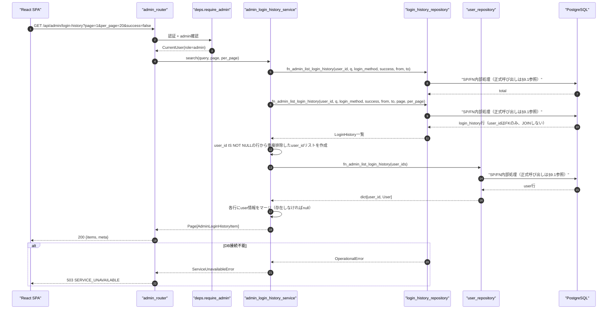
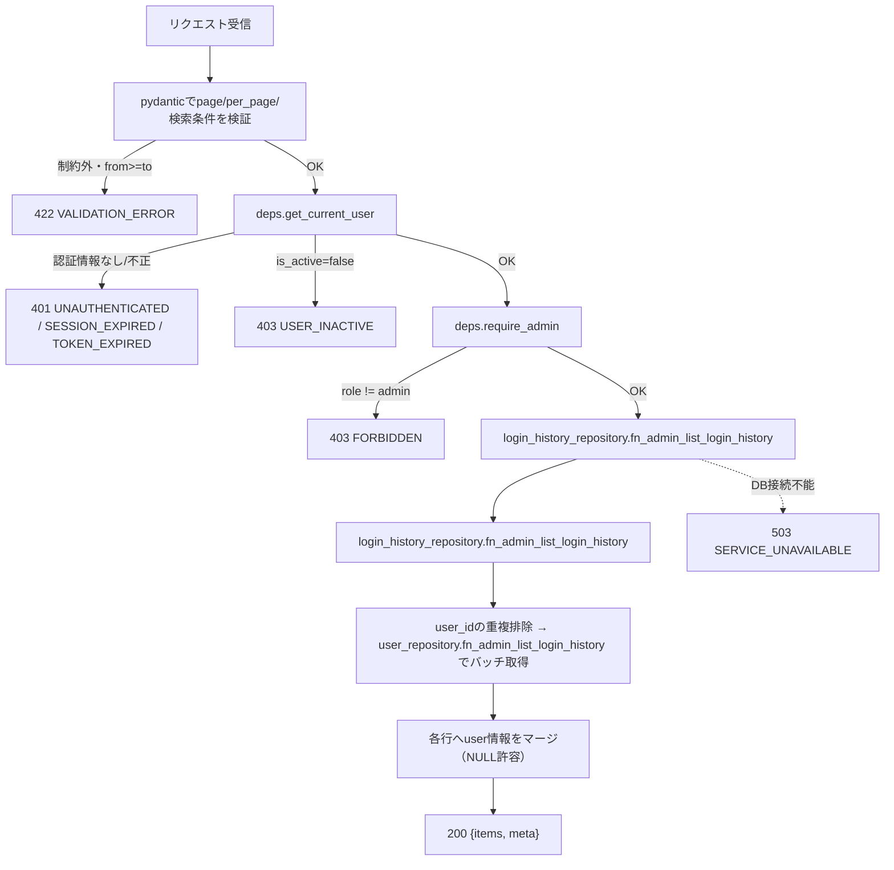
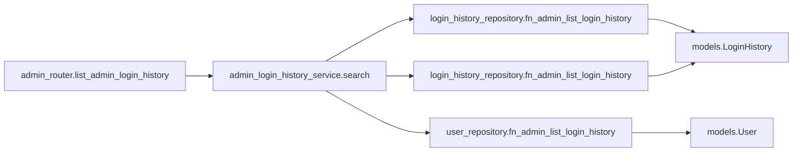
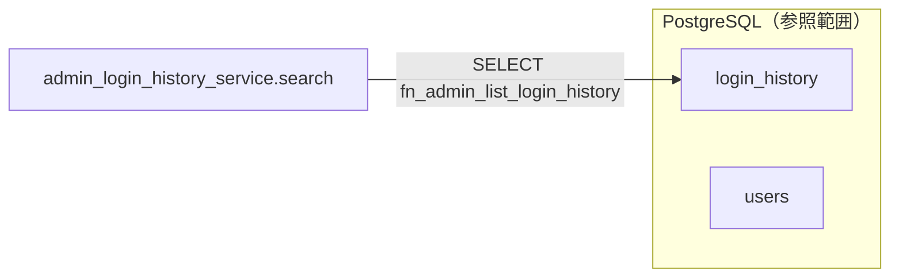

# GET /api/admin/login-history（全ユーザーのログイン履歴取得）

## 0. 関連ドキュメント

| ドキュメント | 内容 |
|--------------|------|
| [../../../basic_design/04_api.md](../../../basic_design/04_api.md) | §2.5 管理者API一覧（「全ユーザーのログイン履歴（監査）」）、§4.2 エラーコード体系、§5 認可マトリクス |
| [../../../basic_design/01_database.md](../../../basic_design/01_database.md) | §3.7 login_history、§7 主要クエリ（Q-6） |
| [../../database/03_table_login_history.md](../../database/03_table_login_history.md) | login_history テーブル定義・インデックス・`list_all`（8.3節）・保持期間管理 |
| [../users/04_get_users_me_login_history.md](../users/04_get_users_me_login_history.md) | 自分のログイン履歴取得API（本APIは全ユーザー対象である点が異なる） |
| [./01_get_admin_users.md](./01_get_admin_users.md) | 同じ管理者画面から呼ばれる姉妹API（クエリ・ページング規約を統一） |

## 1. 概要

| 項目 | 内容 |
|------|------|
| エンドポイント | `GET /api/admin/login-history` |
| 目的 | 管理者が全ユーザーのログイン試行履歴（成功・失敗を問わない監査ログ）を検索・ページングして参照する |
| 認証 | 必要（session Cookie または `Authorization: Bearer`） |
| 認可 | admin のみ |
| CSRF検証 | 不要（参照系 GET） |
| Origin検証 | 不要（Cookie発行・更新系ではないため） |
| AUTH_MODE差異 | 差異なし（`deps.get_current_user` が方式差を吸収する） |
| 冪等性 | あり（GET） |
| レート制限 | 対象外 |
| トランザクション境界 | 単一の読み取りトランザクション（更新なし） |

`GET /users/me/login-history`（[04_get_users_me_login_history.md](../users/04_get_users_me_login_history.md)）は認証済みユーザー自身の直近50件のみを対象とし検索条件を持たないのに対し、本APIは全ユーザーを対象とし、ユーザー・期間・成否・ログイン方式による絞り込みとページングを提供する管理者専用の監査APIである。

## 2. 入出力仕様

### 2.1 リクエスト

**クエリパラメータ**

| 名前 | 型 | 必須 | 制約 | 説明 |
|------|----|------|------|------|
| page | integer | 任意 | 1以上。既定 `1` | ページ番号 |
| per_page | integer | 任意 | 1〜100。既定 `20`（`PAGINATION_DEFAULT_PER_PAGE` / `PAGINATION_MAX_PER_PAGE`） | 1ページあたり件数 |
| user_id | string(uuid) | 任意 | UUID形式 | 特定ユーザーの履歴に絞り込む（`login_history.user_id` の完全一致）。管理者ユーザー管理画面からのドリルダウン導線を想定 |
| q | string | 任意 | 100文字以内 | `login_identifier`（通常ログインは入力されたusername/email原文、Google OAuthは検証済みGoogle email）の部分一致検索。未登録ID/メールでの試行も検索対象にできる |
| login_method | string | 任意 | `session` / `jwt` / `oauth_google` のいずれか | ログイン方式で絞り込み |
| success | boolean | 任意 | `true` / `false` | 成否で絞り込み |
| from | string(datetime) | 任意 | ISO 8601。`to` 未満であること | `created_at >= from` |
| to | string(datetime) | 任意 | ISO 8601。`from` 超であること | `created_at < to` |

`user_id` と `q` は併用可能（両方指定時は `AND` 条件）だが、通常はどちらか一方のみを使う運用を想定する。パスパラメータ／ヘッダ（認証ヘッダ・Cookieを除く）／ボディ：なし。

### 2.2 レスポンス

**`200 OK`**

```json
{
  "items": [
    {
      "id": "9c1a...",
      "user": { "id": "3f1c...", "username": "taro", "display_name": "山田 太郎" },
      "login_identifier": "taro",
      "login_method": "session",
      "ip_address": "203.0.113.10",
      "user_agent": "Mozilla/5.0 ...",
      "success": true,
      "failure_reason": null,
      "created_at": "2026-09-01T00:00:00Z"
    }
  ],
  "meta": { "page": 1, "per_page": 20, "total": 1, "total_pages": 1 }
}
```

| フィールド | 型 | NULL | 説明 |
|-----------|----|----|------|
| items[].id | string(uuid) | 不可 | `login_history.id` |
| items[].user | object | 可 | `login_history.user_id` が存在するユーザーを指す場合のみ `{id, username, display_name}` を格納。未登録ID/メールでの試行、または対象ユーザーが削除済み（`ON DELETE SET NULL`）の場合は `null` |
| items[].login_identifier | string | 不可 | 通常ログインは入力された username / email の原文、Google OAuthは検証済みGoogle email（パスワード・OAuthの `sub`・トークンは含めない） |
| items[].login_method | string | 不可 | `session` / `jwt` / `oauth_google` |
| items[].ip_address | string | 可 | 記録時に取得できなかった場合はNULL |
| items[].user_agent | string | 可 | 同上 |
| items[].success | boolean | 不可 | 成否 |
| items[].failure_reason | string | 可 | 失敗時のみ値が入る |
| items[].created_at | string(datetime) | 不可 | ISO 8601 UTC |
| meta.page / per_page / total / total_pages | integer | 不可 | ページング情報 |

`Set-Cookie` なし。共通ヘッダ `X-Request-ID` を全レスポンスに付与する。IPアドレス・ユーザーエージェントの取り扱いは11章参照。

## 3. エラー仕様

| HTTP | code | 発生条件 | メッセージ | 備考 |
|------|------|----------|------------|------|
| 401 | `UNAUTHENTICATED` / `SESSION_EXPIRED` / `TOKEN_EXPIRED` / `TOKEN_INVALID` | 認証情報なし・失効・不正 | 認証情報が無効です | `deps.get_current_user` |
| 403 | `USER_INACTIVE` | `users.is_active=false` | アカウントが無効化されています | |
| 403 | `FORBIDDEN` | `role != admin` | 権限がありません | `deps.require_admin` |
| 422 | `VALIDATION_ERROR` | `page`/`per_page`/`user_id`/`login_method`/`success`/`from`/`to` が制約外、または `from >= to` | 入力内容に誤りがあります | `details` にフィールド情報 |
| 503 | `SERVICE_UNAVAILABLE` | PostgreSQL 接続不能 | しばらくしてから再度お試しください | fail-close |

`basic_design/04_api.md` §4.2 のエラーコード体系から逸脱しない。

## 4. 処理シーケンス



## 5. 処理フロー・分岐



## 6. 関数詳細

### 6.1 `api/routers/admin_router.py :: list_admin_login_history`

| 項目 | 内容 |
|------|------|
| シグネチャ | `async def list_admin_login_history(query: AdminLoginHistoryQuery = Depends(), user: CurrentUser = Depends(require_admin), db: AsyncSession = Depends(get_db)) -> AdminLoginHistoryListResponse` |
| 引数 | `query`: `page`/`per_page`/`user_id`/`q`/`login_method`/`success`/`from`/`to`（クエリ） / `user`: admin確認済みユーザー / `db`: DBセッション |
| 戻り値 | `AdminLoginHistoryListResponse`（`items`, `meta`） |
| 送出例外 | なし（サービス層の例外を `AppError` としてそのまま伝播） |
| 処理内容 | 1. `require_admin` により403判定を完了させる 2. `admin_login_history_service.search` を呼び出す 3. 戻り値をそのままレスポンスとして返す |
| 副作用 | なし |

### 6.2 `service/admin_login_history_service.py :: search`

| 項目 | 内容 |
|------|------|
| シグネチャ | `async def search(query: AdminLoginHistoryQuery, db: AsyncSession) -> Page[AdminLoginHistoryItem]` |
| 引数 | `query`: 検索・ページング条件 / `db`: DBセッション |
| 戻り値 | `Page[AdminLoginHistoryItem]`（`items: list[AdminLoginHistoryItem]`, `total: int`） |
| 送出例外 | `ServiceUnavailableError`（PostgreSQL接続不能時）→503 |
| 処理内容 | `SELECT fn_admin_list_login_history(:user_id, :query, :login_method, :success, :limit, :offset)` を1回呼び出し、履歴と表示用ユーザー情報を含むFN結果を`AdminLoginHistoryItem`へ写像する。件数とページングもFN結果から取得する |
| 副作用 | なし（読み取りのみ） |

### 6.3 `repository/login_history_repository.py :: fn_admin_list_login_history`

| 項目 | 内容 |
|------|------|
| シグネチャ | `async def fn_admin_list_login_history(db: AsyncSession, user_id: UUID \| None, q: str \| None, login_method: str \| None, success: bool \| None, created_from: datetime \| None, created_to: datetime \| None, page: int, per_page: int) -> list[LoginHistory]` ／ `async def fn_admin_list_login_history(db: AsyncSession, ...同上（page/per_page除く）) -> int` |
| 引数 | 各絞り込み条件（すべて任意） / `page`, `per_page`: ページング（`fn_admin_list_login_history` のみ） |
| 戻り値 | `LoginHistory` エンティティのリスト ／ 該当件数 |
| 送出例外 | `OperationalError`（DB不通） |
| 処理内容 | 1. `user_id` 指定時は等価条件 2. `q` 指定時は `lower(login_identifier) LIKE '%' \|\| lower(:q) \|\| '%'`（部分一致。issue #40で確定） 3. `login_method`/`success` は等価条件 4. `created_from`/`created_to` は `created_at >= :from` / `created_at < :to` 5. `ORDER BY created_at DESC` 6. `OFFSET (page-1)*per_page LIMIT per_page`（`fn_admin_list_login_history` はページングなし） 7. `users` へのJOINは行わずN+1を避ける（ユーザー情報はサービス層でバッチ取得） |
| 副作用 | なし |

[../../database/03_table_login_history.md §8.3](../../database/03_table_login_history.md) の `list_all`（フィルタなし全件版）を、絞り込み条件を持つ本関数で置き換える形で拡張する（既存の呼び出し元がなければ `list_all` は本関数に統合してよい。13章参照）。

### 6.4 service層のDTO写像

| 項目 | 内容 |
|------|------|
| シグネチャ | `async def fn_admin_list_login_history(db: AsyncSession, user_ids: list[UUID]) -> list[User]` |
| 引数 | `user_ids`: 当該ページの `login_history` 行から抽出した重複排除済みユーザーIDリスト |
| 戻り値 | 該当する `User` エンティティのリスト |
| 送出例外 | `OperationalError` |
| 処理内容 | `SELECT fn_admin_list_login_history(:user_id, :query, :login_method, :success, :limit, :offset)` を1回実行する。履歴と表示用ユーザー情報の結合はFN内部で行い、repositoryの追加SELECTは発行しない |
| 副作用 | なし |

## 7. 関数相関図



## 8. データ遷移図

読み取りのみで状態遷移なし。



## 9. SP/FNデータアクセス一覧

### 9.1 正式なDBアクセス契約

本APIのrepositoryは、次のSP/FN呼び出しとDTO写像だけを行う。

| 種別 | 契約 | 説明 |
|------|------|------|
| fn_admin_list_login_history | `fn_admin_list_login_history(p_user_id, p_query, p_login_method, p_success, p_limit, p_offset)` | fn_admin_list_login_historyを呼び出し、結果をレスポンスへ写像する |

repositoryはDBテーブルへ直結せず、SP/FN契約だけを呼び出す。 直下の従来のテーブルI/O表はSP/FN内部SQLの補足であり、repositoryの発行契約ではない。更新系の整合性制御、version検証、advisory lock、通知、SQLSTATE P0xxxはSP/FN層の責務である。存在・所属の事実判定はFNの空集合/falseを受け、404/403への変換はAPI層が行う。

**PostgreSQL**

| テーブル | 操作 | 条件 | 備考 |
|----------|------|------|------|
| `fn_admin_list_login_history` | FN | `user_id`/`query`/`login_method`/`success`/page | 履歴・表示用ユーザー情報の結合、絞り込み、件数をFN内部で処理 |

**Redis**

| キー | 操作 | TTL | 備考 |
|------|------|-----|------|
| `session:{sid}`（sessionモードのみ） | GET | `SESSION_TTL_SECONDS` | `deps.get_current_user` の認証確認のみで本APIの業務データではない |

## 10. バリデーション規則

| pydanticスキーマ | フィールド | 制約 | フロント（zod）との整合 |
|-------------------|-----------|------|--------------------------|
| `AdminLoginHistoryQuery` | page | `int, ge=1`, 既定1 | `zod.number().int().min(1)` |
| `AdminLoginHistoryQuery` | per_page | `int, ge=1, le=100`, 既定 `PAGINATION_DEFAULT_PER_PAGE` | `zod.number().int().min(1).max(100)` |
| `AdminLoginHistoryQuery` | user_id | `UUID \| None` | `zod.string().uuid().optional()` |
| `AdminLoginHistoryQuery` | q | `str \| None, max_length=100` | `zod.string().max(100).optional()` |
| `AdminLoginHistoryQuery` | login_method | `Literal["session","jwt","oauth_google"] \| None` | `zod.enum([...]).optional()` |
| `AdminLoginHistoryQuery` | success | `bool \| None` | `zod.boolean().optional()` |
| `AdminLoginHistoryQuery` | from / to | `datetime \| None`、`model_validator` で `from < to` を検証 | `zod.string().datetime().optional()` + `refine` で相互比較 |

## 11. 非機能・セキュリティ考慮（検索条件・性能・個人情報の取り扱いを含む）

| 観点 | 内容 |
|------|------|
| 検索条件 | ユーザー（`user_id`完全一致 / `q`によるログイン識別子の部分一致）・期間（`from`/`to`）・成否（`success`）・ログイン方式（`login_method`）の4系統。すべて任意かつ組み合わせ可能 |
| ログ出力 | 監査ログ対象外（参照系）。ただし本APIは大量の個人情報（IPアドレス等）を一括で閲覧可能にする操作であるため、アクセスログには `admin_user_id`（閲覧者）, 検索条件一式, `page`, `per_page`, `X-Request-ID` を構造化出力し、「誰が誰の監査ログを閲覧したか」を追跡可能にする（**要検討**：この“閲覧の監査”自体を `login_history` とは別に記録するかは基本設計に規定がなく本書の提案） |
| ユーザー列挙対策 | admin専用APIのため対象外 |
| IPアドレス・UAという個人情報の取り扱い | `ip_address`/`user_agent` は [../../database/03_table_login_history.md](../../database/03_table_login_history.md) の定義どおりマスキングせず生値をレスポンスに含める（不正アクセス調査という監査目的上、一部でも欠落すると調査価値が失われるため）。アクセス制御は `deps.require_admin` によるロールベースの一点集中とし、admin以外には一切公開しない。フロントの画面（`screen/10_admin_users.md`、要検討）側でCSVエクスポート等の二次利用を提供する場合は、エクスポート先ファイルの取り扱い（アクセス権・保管期間）を別途検討する必要がある |
| 保持期間との関係 | `LOGIN_HISTORY_RETENTION_DAYS`（既定90日）を超えた行は `sp_purge_login_history` により物理削除されるため、本APIの検索対象は常に未削除の保持期間内データのみとなる（[../../database/03_table_login_history.md §11](../../database/03_table_login_history.md)） |
| 件数増加時の性能 | `login_history` は「INSERTのみで単調増加し、他テーブルより増加速度が速い」（[../../database/03_table_login_history.md §1](../../database/03_table_login_history.md)）。`created_at` 降順の一覧・`user_id`指定検索は既存の `ix_login_history_created` / `ix_login_history_user_created` でカバーされるが、`login_method`/`success` 単独または組み合わせでの絞り込みには専用インデックスが無く、件数が増えるほど `WHERE` 句の絞り込み効率が低下し、`created_at` インデックスを使ったスキャン後にフィルタで行を捨てる形になる（**要検討**：検索頻度が高まる場合は `(login_method, created_at DESC)` や `(success, created_at DESC)` の部分インデックス追加をDB担当と検討する。本書はAPI詳細設計のスコープのためインデックス追加自体は提案に留め、DDL変更は行わない） |
| タイミング攻撃対策 | 該当なし |
| レート制限 | なし |
| fail-close方針 | PostgreSQL接続不能時は `503 SERVICE_UNAVAILABLE` |
| N+1対策 | `users` へのJOINは行わず、当該ページの `user_id` を重複排除した上で `fn_admin_list_login_history` による1回のバッチクエリに集約する |

## 12. テスト設計

| No | 区分 | ケース | 前提 | 期待結果 | pytest関数名案 |
|----|------|--------|------|----------|-----------------|
| 1 | 単体 | 一般ユーザーはアクセス不可 | `role=member` のCurrentUser | `403 FORBIDDEN`、リポジトリ未呼び出し | `test_list_admin_login_history_forbidden_for_member` |
| 2 | 単体 | `from >= to` は422 | `from="2026-09-02", to="2026-09-01"` | `422 VALIDATION_ERROR` | `test_list_admin_login_history_invalid_date_range` |
| 3 | 単体 | user未登録行（user_id=NULL）は `user: null` になる | repositoryが `user_id=NULL` の行を返すようモック | レスポンスの該当行が `user: null` | `test_list_admin_login_history_null_user_for_unregistered_identifier` |
| 4 | 結合（実DB・実SP） | user情報のバッチ取得が1回のクエリで行われる | 実DB・実SPで検証しuser_idを3件重複させて返す | `user_repository.fn_admin_list_login_history` が重複排除済み2件で1回だけ呼ばれる | `test_list_admin_login_history_batches_user_lookup` |
| 5 | 結合 | 検索条件なしで全ユーザーの履歴が返る | 2ユーザー分のログイン試行を作成 | 全件が返る | `test_list_admin_login_history_returns_all_users` |
| 6 | 結合 | user_idによる絞り込みが機能する | 2ユーザー分の履歴を作成 | 指定した`user_id`の行のみ返る | `test_list_admin_login_history_filter_by_user_id` |
| 7 | 結合 | qによるlogin_identifier部分一致検索が機能する | 未登録メールでの失敗試行を含む | `q`一致行のみ返る | `test_list_admin_login_history_search_by_identifier` |
| 8 | 結合 | success/login_methodの組み合わせ絞り込みが機能する | 成功/失敗、各方式のデータを作成 | 条件に一致する行のみ返る | `test_list_admin_login_history_filter_by_success_and_method` |
| 9 | 結合 | 期間指定（from/to）が機能する | 異なる日時の履歴を複数作成 | 期間内の行のみ返る | `test_list_admin_login_history_filter_by_date_range` |
| 10 | 結合 | ページングが正しく機能する | 履歴25件を作成 | 1ページ目20件、`total=25`、`total_pages=2` | `test_list_admin_login_history_pagination` |
| 11 | 結合 | 未認証は401 | Cookie/Bearerなし | `401 UNAUTHENTICATED` | `test_list_admin_login_history_unauthenticated` |
| 12 | 性能 | 大量件数（例：10,000件）投入時のcreated_at降順一覧応答 | `ix_login_history_created` を使用 | 実行計画にIndex Scanが現れ、LIMIT付きで高速応答する | `test_list_admin_login_history_uses_index_with_large_dataset` |

`AUTH_MODE=session` / `jwt` の両方で No.11（401判定経路の違い：`SESSION_EXPIRED` と `TOKEN_EXPIRED`）をパラメータ化して実施する。No.12は `login_method`/`success` 単独フィルタでの実行計画悪化を再現する目的も兼ねるが、悪化の程度を数値で保証するテストは環境依存が大きいため、実行計画にIndex Scanが含まれることの確認に留める（網羅できない範囲：本番相当データ量でのレイテンシSLAは学習用途のスコープ外とし手動確認とする）。

## 13. 不明点・要検討事項

| 区分 | 内容 | 影響 |
|------|------|------|
| 要検討 | `login_method`/`success` を単独または組み合わせで絞り込む際の専用インデックス（例：部分インデックス）の要否は、基本設計・[03_table_login_history.md](../../database/03_table_login_history.md) のいずれにも規定がない。件数増加時の性能劣化リスクとして11章に記載したが、追加要否はDB担当・運用側との協議が必要 |
| 要検討 | 本APIの「監査ログの閲覧」自体を別途記録する（誰がいつ閲覧したか）かどうかは基本設計に規定がなく、本書での提案に留めた。個人情報を大量に扱うAPIであるため運用ポリシー次第では要実装 |
| 確定 | `q` によるログイン識別子検索仕様（部分一致・大文字小文字区別なし）はissue #40で[`basic_design/04_api.md` §2.5](../../../basic_design/04_api.md#25-管理者apiadmin)へ集約定義された |
| 要検討 | `login_history_repository.list_all`（[03_table_login_history.md §8.3](../../database/03_table_login_history.md)、フィルタなし全件版）と本書の `fn_admin_list_login_history`（フィルタあり）の統合方針は、DB担当ドキュメントとの整合を別途取る必要がある |
