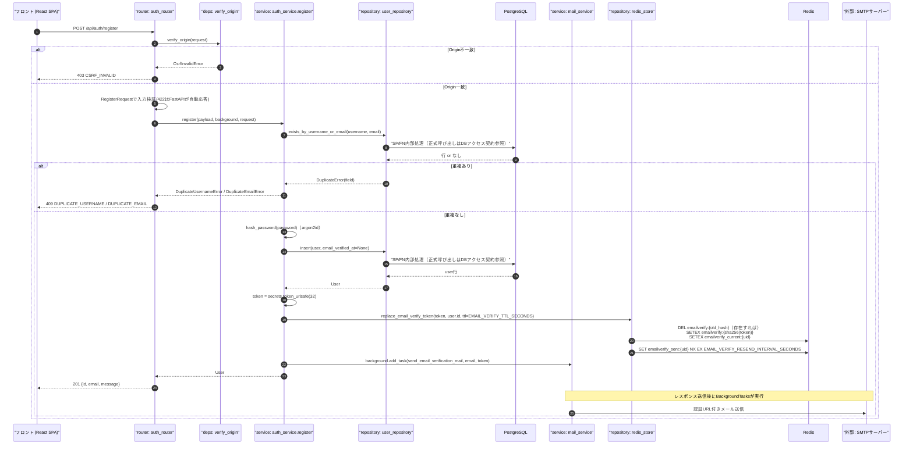
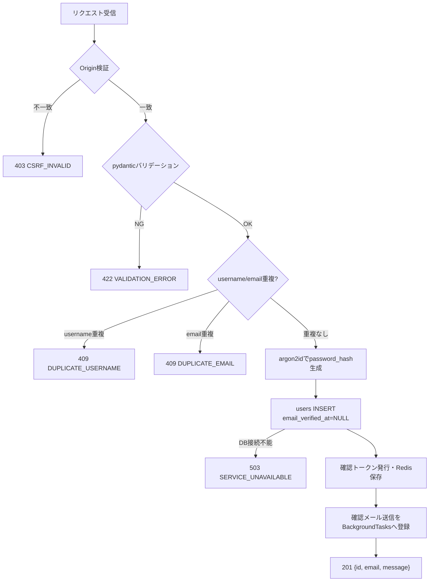
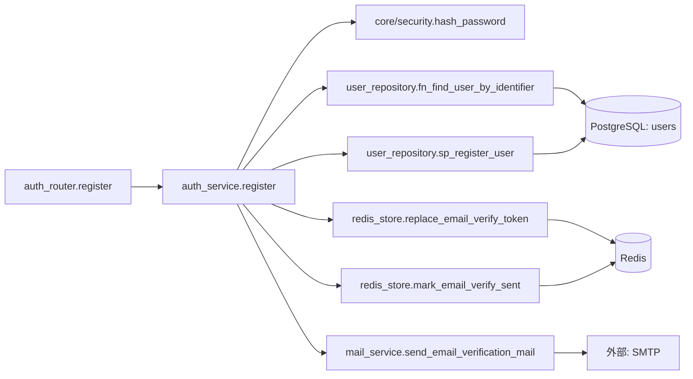
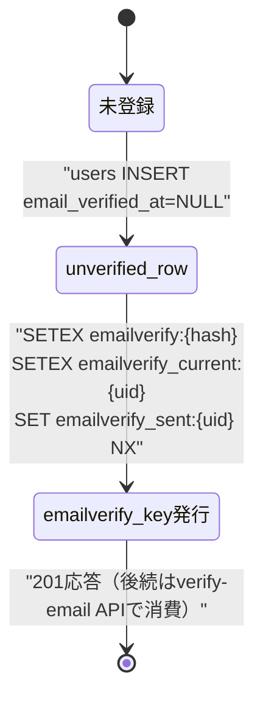

# POST /api/auth/register（会員登録）

## 0. 関連ドキュメント

| ドキュメント | パス |
|--------------|------|
| API基本設計 | `../../../basic_design/04_api.md` |
| 認証基本設計 | `../../../basic_design/03_auth.md`（§6 会員登録とメール認証） |
| Redis基本設計 | `../../../basic_design/02_redis.md`（§2 emailverify系キー） |
| DB基本設計 | `../../../basic_design/01_database.md`（§3.1 users） |
| メール認証API | `./07_post_auth_verify_email.md` |
| 認証メール再送API | `./08_post_auth_verify_email_resend.md` |
| ログインAPI | `./02_post_auth_login.md` |
| 会員登録画面 | `../../screen/02_register.md` |

## 1. 概要

| 項目 | 内容 |
|------|------|
| エンドポイント | `POST /api/auth/register` |
| 目的 | 新規ユーザーのアカウント作成。確認メールを送信し、メールアドレスの所有確認を行う |
| 認証 | 不要 |
| 認可 | 未認証可 |
| CSRF検証 | 不要（未認証・Cookie未発行の状態で呼ばれるため。Origin検証は行う） |
| Origin検証 | 必要（`CORS_ALLOW_ORIGINS` との一致。更新系かつ公開APIのため） |
| AUTH_MODE差異 | 差異なし（登録はCookie/トークンを発行しないため、session/jwtのいずれでも同一処理） |
| 冪等性 | なし（同一入力での再送信はメールアドレス重複により409） |
| レート制限 | `register` はIP単位で5回/900秒。超過時は429 `TOO_MANY_ATTEMPTS`（`Retry-After`付き）、Redis障害時は503 `SERVICE_UNAVAILABLE` |
| トランザクション境界 | `users` へのINSERT1件のみ。メール送信はDB更新後に`BackgroundTasks`で非同期実行するためトランザクション外 |

## 2. 入出力仕様

### 2.1 リクエスト

パスパラメータ：なし
クエリパラメータ：なし
ヘッダ：なし（`Origin` はミドルウェアが検証）
Cookie：なし

ボディ（`application/json`、スキーマ `RegisterRequest`）

| 名前 | 型 | 必須 | 制約 | 説明 |
|------|----|------|------|------|
| username | string | ○ | 3〜50文字、`^[A-Za-z0-9_-]+$` | ログインID。大文字小文字は区別しない一意制約（`uq_users_username`） |
| email | string | ○ | 50文字以内、メール形式（`@ - _ . +` を許容） | 大文字小文字を区別しない一意制約（`uq_users_email`） |
| password | string | ○ | 8文字以上、大文字英字/小文字英字/数字/記号のうち2種類以上 | 平文はログ・DBに保存しない |
| password_confirm | string | ○ | `password` と一致 | |
| last_name / first_name | string | ○ | 各1〜30文字 | |
| last_name_kana / first_name_kana | string | ○ | 各1〜30文字、ひらがな・カタカナ・数字のみ | |
| birth_date | string(date) | ○ | `YYYY-MM-DD`、未来日不可 | プルダウン選択想定。フロントは年/月/日を結合して送信 |

### 2.2 レスポンス

**201 Created**（`RegisterResponse`）

```json
{
  "id": "3f1c...",
  "email": "taro@example.com",
  "message": "確認メールを送信しました。メール内のリンクから認証を完了してください。"
}
```

| フィールド | 型 | NULL可否 | 説明 |
|-----------|----|----------|------|
| id | string(uuid) | 不可 | 作成された `users.id` |
| email | string | 不可 | 登録メールアドレス |
| message | string | 不可 | フロント表示用の固定文言 |

Cookie／認証トークンは一切発行しない（自動ログインしない）。フロントは `/login` へ遷移し、本文言をトースト表示する。

共通ヘッダ：全レスポンスに `X-Request-ID` を付与する。

## 3. エラー仕様

| HTTP | code | 発生条件 | メッセージ | 備考 |
|------|------|----------|------------|------|
| 403 | `CSRF_INVALID` | Origin不一致 | 許可されていないOriginからのリクエストです | `verify_origin` |
| 409 | `DUPLICATE_USERNAME` | `username` が既存行と重複（大文字小文字無視） | このユーザーIDは既に使用されています | |
| 409 | `DUPLICATE_EMAIL` | `email` が既存行と重複（大文字小文字無視） | このメールアドレスは既に使用されています | ユーザー列挙対策は行わない方針（`basic_design/04_api.md` の設計に準拠。要検討として§13に記載） |
| 422 | `VALIDATION_ERROR` | pydanticバリデーション失敗（文字数・形式・パスワード確認不一致等） | 入力内容に誤りがあります | `details` にフィールド単位のエラー |
| 503 | `SERVICE_UNAVAILABLE` | PostgreSQL接続不能 | 現在サービスをご利用いただけません | fail-close |
| 500 | `INTERNAL_ERROR` | 未捕捉例外 | サーバーエラーが発生しました | |

## 4. 処理シーケンス



## 5. 処理フロー・分岐



## 6. 関数詳細

### 6.1 `api/routers/auth_router.py :: register`

| 項目 | 内容 |
|------|------|
| シグネチャ | `async def register(payload: RegisterRequest, background: BackgroundTasks, request: Request, _: None = Depends(verify_origin), db: AsyncSession = Depends(get_db_session)) -> RegisterResponse` |
| 引数 | `payload`（検証済みリクエストボディ）、`background`（メール送信予約）、`request`（Origin検証用）、`db`（DBセッション） |
| 戻り値 | `RegisterResponse`（201） |
| 送出例外 | `CsrfInvalidError`→403、`DuplicateUsernameError`/`DuplicateEmailError`→409 |
| 処理内容 | 1. `verify_origin` 依存性でOrigin確認 2. `auth_service.register` を呼び出す 3. 結果を `RegisterResponse` に詰めて201で返す |
| 副作用 | なし（service層に委譲） |

### 6.2 `service/auth_service.py :: register`

| 項目 | 内容 |
|------|------|
| シグネチャ | `async def register(payload: RegisterRequest, background: BackgroundTasks, request: Request, db: AsyncSession) -> User` |
| 引数 | `payload: RegisterRequest`、`background: BackgroundTasks`、`request: Request`（IP単位Rate Limit用）、`db: AsyncSession` |
| 戻り値 | 作成された `User`（ORMモデル） |
| 送出例外 | `DuplicateUsernameError` / `DuplicateEmailError`（409） |
| 処理内容 | 1. `request`から解決したIP単位で`RATE_LIMIT_REGISTER_MAX_REQUESTS` / `RATE_LIMIT_REGISTER_WINDOW_SECONDS`を検証 2. `core/security.hash_password` でargon2idハッシュ生成 3. `sp_register_user`を呼び、プロフィールSPで入力値を更新 4. `token_urlsafe(32)` を生成 5. `redis_store.replace_email_verify_token` でRedis登録（TTL=`EMAIL_VERIFY_TTL_SECONDS`） 6. `redis_store.mark_email_verify_sent` で送信済みマーカー設定 7. `background.add_task(mail_service.send_email_verification_mail, ...)` を登録 8. **`AuthStrategy.login` は呼ばない** |
| 副作用 | DB: `users` INSERT。Redis: `emailverify:{hash}` / `emailverify_current:{uid}` / `emailverify_sent:{uid}` 作成。メール送信（非同期） |

### 6.3 `repository/user_repository.py :: fn_find_user_by_identifier`

| 項目 | 内容 |
|------|------|
| シグネチャ | `async def exists_by_username_or_email(db: AsyncSession, username: str, email: str) -> DuplicateField | None` |
| 引数 | `db`、`username`、`email` |
| 戻り値 | 重複がなければ `None`。重複があれば `"username"` または `"email"` を示す列挙値 |
| 送出例外 | なし（DB接続不能時は上位で`RedisError`同様に`OperationalError`が伝播し503へ変換） |
| 処理内容 | `fn_find_user_by_identifier` 相当のFNで重複候補を取得する。登録本体の一意性保証は `sp_register_user` がP0001/P0002で行う |
| 副作用 | なし（参照のみ） |

### 6.4 `repository/user_repository.py :: sp_register_user`

| 項目 | 内容 |
|------|------|
| シグネチャ | `async def insert(db: AsyncSession, payload: RegisterRequest, password_hash: str) -> User` |
| 引数 | `db`、`payload`、`password_hash` |
| 戻り値 | 作成済み `User` |
| 送出例外 | `IntegrityError`（一意制約違反時。事前チェックとの競合時のみ発生し、上位で409へ変換） |
| 処理内容 | `CALL sp_register_user(:user_id, :username, :email, :password_hash)` のみを発行する。ユーザー行の作成と一意性検証はSP内部 |
| 副作用 | DB: `users` へ1行追加 |

### 6.5 `repository/redis_store.py :: replace_email_verify_token`

| 項目 | 内容 |
|------|------|
| シグネチャ | `async def replace_email_verify_token(token: str, user_id: UUID, ttl: int) -> None` |
| 引数 | `token`（平文）、`user_id`、`ttl`（`EMAIL_VERIFY_TTL_SECONDS`） |
| 戻り値 | なし |
| 送出例外 | `RedisError`（呼び出し元で503へ変換） |
| 処理内容 | 1. `emailverify_current:{uid}` から旧token_hashを取得 2. 存在すれば `DEL emailverify:{old_hash}` 3. `SETEX emailverify:{sha256(token)}` 4. `SETEX emailverify_current:{uid}` を新hashで更新 |
| 副作用 | Redis: 上記キーの作成・削除 |

## 7. 関数相関図



## 8. データ遷移図



## 9. データアクセス一覧

**PostgreSQL**

| テーブル | 操作 | 条件・TTL | 備考 |
|----------|------|-----------|------|
| users | SELECT | `lower(username)=? OR lower(email)=?` | 重複確認 |
| users | INSERT | - | `password_hash`はargon2idハッシュ、`email_verified_at=NULL` |

**Redis**

| キー | 操作 | 条件・TTL | 備考 |
|------|------|-----------|------|
| `emailverify:{sha256(token)}` | SETEX / (旧hash)DEL | `EMAIL_VERIFY_TTL_SECONDS`（既定86400） | ワンタイム認証トークン |
| `emailverify_current:{user_id}` | SETEX | `EMAIL_VERIFY_TTL_SECONDS` | 旧token逆引き用 |
| `emailverify_sent:{user_id}` | SET NX EX | `EMAIL_VERIFY_RESEND_INTERVAL_SECONDS`（既定60） | 再送レート制限の初期化 |

## 10. バリデーション規則

| スキーマ | フィールド | 規則 | フロント(zod)対応 |
|----------|-----------|------|--------------------|
| `RegisterRequest` | username | `^[A-Za-z0-9_-]{3,50}$` | `z.string().min(3).max(50).regex(...)` |
| `RegisterRequest` | email | 50文字以内、`EmailStr`相当 | `z.string().email().max(50)` |
| `RegisterRequest` | password | 8文字以上、大文字/小文字/数字/記号のうち2種類以上（カスタムバリデータ） | `zod`カスタム`refine`で同一ルールを実装 |
| `RegisterRequest` | password_confirm | `password`と完全一致（`model_validator`） | `refine`でフィールド間比較 |
| `RegisterRequest` | last_name / first_name | 1〜30文字 | `z.string().min(1).max(30)` |
| `RegisterRequest` | last_name_kana / first_name_kana | 1〜30文字、`^[ぁ-んァ-ヶー0-9]+$` | 同一正規表現を共有定数化 |
| `RegisterRequest` | birth_date | `date`型、未来日不可（`model_validator`で`date.today()`比較） | `zod`で`max: today`検証 |

フロントとバックエンドで正規表現・文字数上限は共通の定数ファイル（例：`shared/validation-rules`。要検討：フロント/バックエンド間の共有方法は基本設計に記載なし）から参照することが望ましい。

## 11. 非機能・セキュリティ考慮

| 項目 | 内容 |
|------|------|
| 監査ログ | 本APIでは`login_history`に記録しない（ログイン試行ではないため）。構造化ログに`event=user_registered`, `user_id`, `request_id`をINFO出力し、メールアドレス・パスワードは出力しない |
| ユーザー列挙対策 | 本APIは基本設計（`04_api.md` §4.2）の方針どおり重複時に`DUPLICATE_USERNAME`/`DUPLICATE_EMAIL`を明示返却する（列挙耐性より使いやすさを優先する設計判断。要検討として§13に記載） |
| タイミング攻撃対策 | 対象外（ログイン時のみパスワード検証タイミングが問題になる。登録は新規作成のみ） |
| レート制限 | `register` はIP単位で5回/900秒。Redisキーは`rate_limit:register:{key_hash}`とし、超過時は429 `TOO_MANY_ATTEMPTS`（`Retry-After`付き） |
| fail-close方針 | PostgreSQL接続不能時は503を返し、部分的な登録状態を作らない（トランザクション未コミット） |
| メール送信失敗時 | `mail_service`内でログに記録し、APIレスポンス（201）には影響させない（`basic_design/03_auth.md` §7.2 準拠） |
| パスワード平文 | ログ・エラーレスポンス・DBのいずれにも保存しない |

## 12. テスト設計

| No | 区分 | ケース | 前提 | 期待結果 | pytest関数名案 |
|----|------|--------|------|----------|-----------------|
| 1 | 単体 | 重複なしの正常系 | repositoryをモック | `register`がUserを返しStrategy.loginを呼ばない | `test_register_success_calls_no_strategy_login` |
| 2 | 単体 | username重複 | repositoryモックが`"username"`を返す | `DuplicateUsernameError`送出 | `test_register_duplicate_username_raises` |
| 3 | 単体 | email重複 | repositoryモックが`"email"`を返す | `DuplicateEmailError`送出 | `test_register_duplicate_email_raises` |
| 4 | 単体 | パスワード確認不一致 | pydanticスキーマ単体 | `ValidationError` | `test_register_schema_password_mismatch` |
| 5 | 単体 | 未来日birth_date | pydanticスキーマ単体 | `ValidationError` | `test_register_schema_future_birth_date` |
| 6 | 結合 | 正常系201 | 実PostgreSQL/Redis | `201`、レスポンスにCookie/トークンが**含まれない**、`email_verified_at`がNULL | `test_register_endpoint_returns_201_without_auth` |
| 7 | 結合 | Origin不一致 | `Origin`ヘッダを許可外に設定 | `403 CSRF_INVALID` | `test_register_endpoint_invalid_origin` |
| 8 | 結合 | 重複登録 | 事前に同一usernameで登録済み | `409 DUPLICATE_USERNAME` | `test_register_endpoint_duplicate_username` |
| 9 | 結合 | メール送信予約確認 | `aiosmtplib`をモック | `send_email_verification_mail`が1回呼ばれる | `test_register_endpoint_sends_verification_mail` |
| 10 | 結合 | Redisキー確認 | 実Redis | `emailverify:{hash}`と`emailverify_current:{uid}`がTTL付きで存在 | `test_register_endpoint_stores_email_verify_token` |

`AUTH_MODE`による分岐がないため、session/jwt双方でのパラメータ化テストは不要（両モードで同一処理であることのみ1ケース確認する）。

## 13. 不明点・要検討事項

| 区分 | 内容 | 影響 |
|------|------|------|
| 確定 | 会員登録APIはIP単位5回/900秒のレート制限を適用する | 429時は`Retry-After`を表示し、Redis障害時は503で安全側に停止する |
| 要検討 | `409 DUPLICATE_EMAIL`を明示返却する設計はユーザー列挙を許容する（`basic_design/04_api.md`の記載どおり）。パスワードリセット等の他APIは列挙対策として202固定にしている非対称性がある | 一貫性の観点で要確認（基本設計の意図的な設計判断の可能性が高いため、変更はしない） |

## DBアクセス契約

本APIのDBアクセスは、下記のFN/SP呼び出しをrepositoryの薄いラッパーから実行する。テーブルへの直接CRUD、認証業務の判定、履歴のINSERTはrepositoryに実装しない。healthの `SELECT 1` だけは本契約の対象外である。

| 正式な呼び出し | 契約 |
|----------------|------|
| sp_register_user(p_user_id, p_username, p_email, p_password_hash) | `detailed_design/database/08_db_functions.md` のシグネチャに従う |

SQLSTATE P0xxxは同文書 §4 の対応表でAPIエラーへ変換し、Redis・メール・JWTの処理はAPI/service層に残す。
