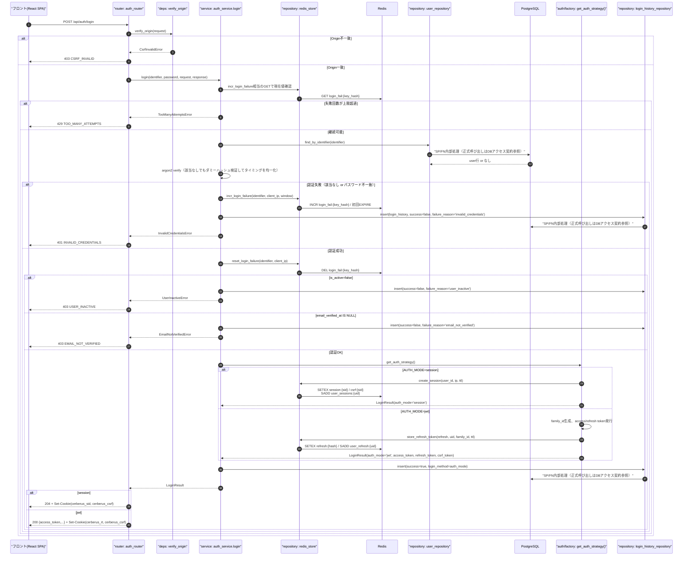
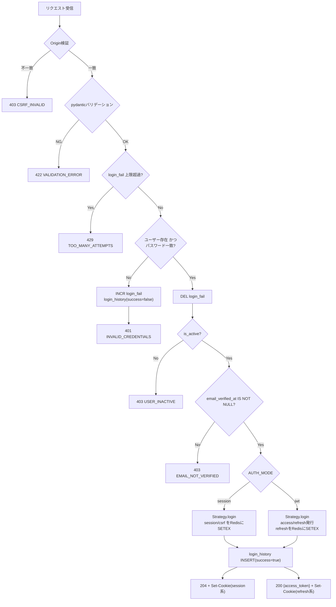
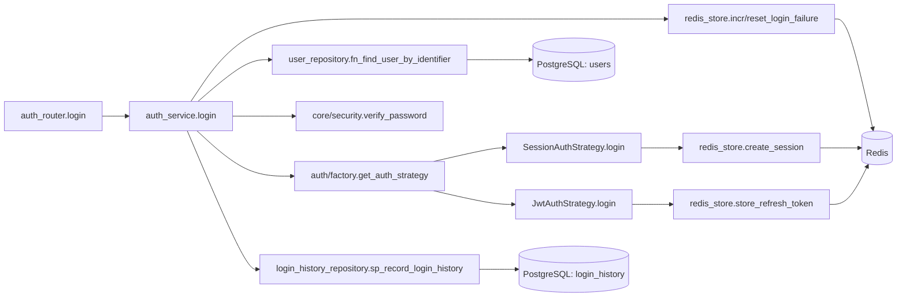
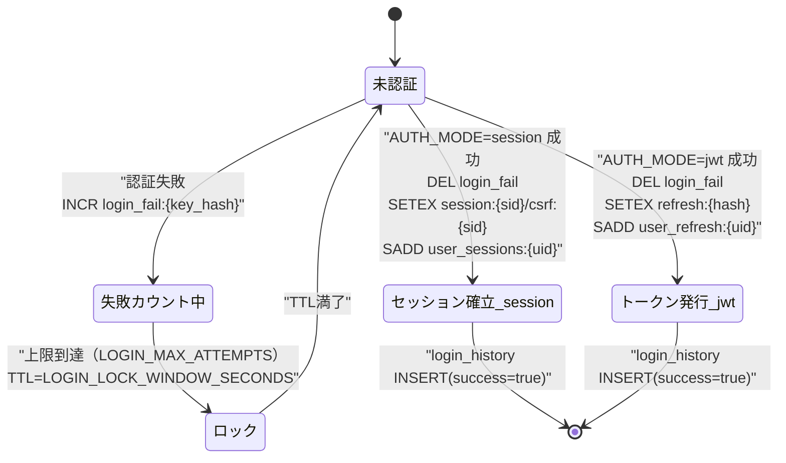

# POST /api/auth/login（ログイン）

## 0. 関連ドキュメント

| ドキュメント | パス |
|--------------|------|
| API基本設計 | `../../../basic_design/04_api.md` |
| 認証基本設計 | `../../../basic_design/03_auth.md`（§3 session、§4 jwt、§6.2 ログイン判定順序） |
| Redis基本設計 | `../../../basic_design/02_redis.md`（§2 キー一覧、§5 redis_store） |
| DB基本設計 | `../../../basic_design/01_database.md`（§3.1 users、§3.7 login_history） |
| 会員登録API | `./01_post_auth_register.md` |
| ログアウトAPI | `./03_post_auth_logout.md` |
| リフレッシュAPI | `./06_post_auth_refresh.md` |
| 設定取得API | `./05_get_auth_config.md` |
| ログイン画面 | `../../screen/01_login.md` |

## 1. 概要

| 項目 | 内容 |
|------|------|
| エンドポイント | `POST /api/auth/login` |
| 目的 | メール/username + パスワードによる認証成立と、`AUTH_MODE`に応じた認証状態の確立（Cookieセッション or JWT発行） |
| 認証 | 不要（本APIで認証状態を新規に確立する） |
| 認可 | 未認証可 |
| CSRF検証 | 不要（ログイン時点ではCSRF Cookieが未発行のため。ログイン成功時に新規発行する） |
| Origin検証 | 必要（Cookie/トークンを新規発行する更新系APIのため） |
| AUTH_MODE差異 | **あり**。詳細は§4・§5・§9を参照 |
| 冪等性 | なし（成功のたびに新規セッション/リフレッシュトークンを発行し、多重ログインを許容する） |
| レート制限 | ログイン失敗回数（`login_fail:{key_hash}`、`LOGIN_LOCK_WINDOW_SECONDS`既定900秒）。上限は`LOGIN_MAX_ATTEMPTS`で環境変数化。クライアントIPは`TRUSTED_PROXY_CIDRS`で解決する |
| トランザクション境界 | `login_history` INSERT 1件（成功/失敗いずれも記録）。`users` SELECTのみで更新なし |

## 2. 入出力仕様

### 2.1 リクエスト

パスパラメータ：なし　クエリパラメータ：なし
ヘッダ：`Origin`（検証用。値そのものはボディに含めない）
Cookie：なし

ボディ（`application/json`、スキーマ `LoginRequest`）

| 名前 | 型 | 必須 | 制約 | 説明 |
|------|----|------|------|------|
| identifier | string | ○ | 1〜50文字 | `username` または `email`。`lower()`比較で照合 |
| password | string | ○ | 1文字以上（上限はパスワードポリシー上限に準拠しないが極端な長さはDoS対策として要検討） | 平文。ログ出力しない |

### 2.2 レスポンス

**session モード：204 No Content**

Set-Cookie（`04_api.md` §1、`03_auth.md` §3.1 準拠）

| Cookie名 | HttpOnly | Secure | SameSite | Path | Max-Age（対応する設定項目名） |
|----------|----------|--------|----------|------|-------------------------------|
| `cerberus_sid`（`COOKIE_NAME_SESSION`） | Yes | `COOKIE_SECURE` | `Lax` | `/` | 未設定（ブラウザ終了まで。実効期限はRedis TTL=`SESSION_TTL_SECONDS`） |
| `cerberus_csrf`（`COOKIE_NAME_CSRF`） | No | `COOKIE_SECURE` | `Lax` | `/` | 未設定（Redis TTLに追従） |

ボディなし。

**jwt モード：200 OK**

```json
{
  "access_token": "eyJhbGciOi...",
  "token_type": "bearer",
  "expires_in": 900
}
```

| フィールド | 型 | NULL可否 | 説明 |
|-----------|----|----------|------|
| access_token | string | 不可 | JWT。`ACCESS_TOKEN_TTL_SECONDS`（既定900秒）で失効 |
| token_type | string | 不可 | 固定値 `"bearer"` |
| expires_in | integer | 不可 | アクセストークンの残り秒数 |

Set-Cookie（`03_auth.md` §4.1 準拠）

| Cookie名 | HttpOnly | Secure | SameSite | Path | Max-Age（対応する設定項目名） |
|----------|----------|--------|----------|------|-------------------------------|
| `cerberus_rt`（`COOKIE_NAME_REFRESH`） | Yes | `COOKIE_SECURE` | `COOKIE_SAMESITE_REFRESH`（既定`Strict`） | `/api/auth` | `REFRESH_TTL_SECONDS`（既定1209600） |
| `cerberus_csrf`（`COOKIE_NAME_CSRF`） | No | `COOKIE_SECURE` | `COOKIE_SAMESITE`（既定`Lax`） | `/` | `REFRESH_TTL_SECONDS` |

`refresh_token`はJSONレスポンスに含めない（Cookieのみで受け渡す）。

共通ヘッダ：`X-Request-ID`。

## 3. エラー仕様

| HTTP | code | 発生条件 | メッセージ | 備考 |
|------|------|----------|------------|------|
| 403 | `CSRF_INVALID` | Origin不一致 | 許可されていないOriginからのリクエストです | |
| 401 | `INVALID_CREDENTIALS` | `identifier`該当なし、または`password`不一致 | IDまたはパスワードが正しくありません | ユーザー存在有無を区別しない |
| 403 | `USER_INACTIVE` | `users.is_active = false` | このアカウントは無効化されています | |
| 403 | `EMAIL_NOT_VERIFIED` | `users.email_verified_at IS NULL` | メールアドレスの認証が完了していません | パスワード検証**後**にのみ判定（列挙対策、§6参照） |
| 422 | `VALIDATION_ERROR` | pydanticバリデーション失敗 | 入力内容に誤りがあります | |
| 429 | `TOO_MANY_ATTEMPTS` | `login_fail:{key_hash}`が上限超過 | ログイン試行回数が上限に達しました。しばらくしてから再度お試しください | |
| 503 | `SERVICE_UNAVAILABLE` | Redis/PostgreSQL接続不能 | 現在サービスをご利用いただけません | fail-close |
| 500 | `INTERNAL_ERROR` | 未捕捉例外 | サーバーエラーが発生しました | |

## 4. 処理シーケンス



## 5. 処理フロー・分岐



## 6. 関数詳細

### 6.1 `api/routers/auth_router.py :: login`

| 項目 | 内容 |
|------|------|
| シグネチャ | `async def login(payload: LoginRequest, request: Request, response: Response, _: None = Depends(verify_origin), db: AsyncSession = Depends(get_db), strategy: AuthStrategy = Depends(get_auth_strategy)) -> LoginResponse | None` |
| 引数 | `payload`、`request`（IPアドレス取得用）、`response`（Cookie書き込み対象）、`db`、`strategy` |
| 戻り値 | sessionモード：`None`（204）／jwtモード：`LoginResponse`（200） |
| 送出例外 | `CsrfInvalidError`(403)、`InvalidCredentialsError`(401)、`UserInactiveError`(403)、`EmailNotVerifiedError`(403)、`TooManyAttemptsError`(429) |
| 処理内容 | 1. `verify_origin`でOrigin確認 2. `auth_service.login`を呼び出す 3. `auth_mode`に応じてレスポンスを組み立てる（204 or 200） |
| 副作用 | `response`へのSet-Cookie設定（service層が`response`を受け取り内部で設定） |

### 6.2 `service/auth_service.py :: login`

| 項目 | 内容 |
|------|------|
| シグネチャ | `async def login(identifier: str, password: str, request: Request, response: Response, db: AsyncSession, strategy: AuthStrategy) -> LoginResult` |
| 引数 | `identifier`、`password`、`request`、`response`、`db`、`strategy` |
| 戻り値 | `LoginResult`（`auth_mode`、必要に応じ`access_token`等を保持。Cookie設定は内部で完了済み） |
| 送出例外 | `InvalidCredentialsError`(401)、`UserInactiveError`(403)、`EmailNotVerifiedError`(403)、`TooManyAttemptsError`(429) |
| 処理内容 | 1. `redis_store`でレート制限確認 2. `user_repository.fn_find_user_by_identifier`でユーザー取得 3. `core/security.verify_password`で照合（該当なし時もダミーハッシュで検証しタイミング差を縮小） 4. 失敗時は`incr_login_failure`＋`login_history`記録＋例外送出 5. 成功時は`reset_login_failure` 6. `is_active`/`email_verified_at`を順に確認（§6.2判定順序） 7. `strategy.login(user, request, response)`を呼び認証状態を確立 8. `login_history_repository.sp_record_login_history`で成功記録 9. `LoginResult`を返す |
| 副作用 | Redis: `login_fail:{key_hash}`のINCR/DEL、Strategy経由で`session:{sid}`等またはRefresh系キーを作成。DB: `login_history` INSERT。Cookie: `response`へSet-Cookie |

### 6.3 `auth/session_auth.py :: SessionAuthStrategy.login`

| 項目 | 内容 |
|------|------|
| シグネチャ | `async def login(self, user: User, request: Request, response: Response) -> LoginResult` |
| 引数 | `user`、`request`、`response` |
| 戻り値 | `LoginResult(auth_mode="session")` |
| 送出例外 | なし（Redis接続不能時は`RedisError`が伝播し503へ変換） |
| 処理内容 | 1. `redis_store.create_session(user.id, ip, ttl=SESSION_TTL_SECONDS)`でsession_id/csrf_tokenを取得 2. `response.set_cookie`で`cerberus_sid`（HttpOnly）と`cerberus_csrf`（非HttpOnly）を設定 |
| 副作用 | Redis: `session:{sid}` / `csrf:{sid}` / `user_sessions:{uid}` 作成。Cookie発行 |

### 6.4 `auth/jwt_auth.py :: JwtAuthStrategy.login`

| 項目 | 内容 |
|------|------|
| シグネチャ | `async def login(self, user: User, request: Request, response: Response) -> LoginResult` |
| 引数 | `user`、`request`、`response` |
| 戻り値 | `LoginResult(auth_mode="jwt", access_token, refresh_token, csrf_token, expires_in)` |
| 送出例外 | なし（Redis接続不能時は503へ変換） |
| 処理内容 | 1. `family_id = uuid4()` を生成 2. `_issue_tokens(user, family_id)`でaccess token（HS256, TTL=`ACCESS_TOKEN_TTL_SECONDS`）とrefresh token（`token_urlsafe(48)`）を発行 3. `redis_store.store_refresh_token(refresh, user.id, family_id, ttl=REFRESH_TTL_SECONDS)` 4. `csrf_token = token_urlsafe(32)`を生成（Redis保存なし、Cookie値がそのまま検証値） 5. `response.set_cookie`で`cerberus_rt`（HttpOnly, Path=`/api/auth`）と`cerberus_csrf`（非HttpOnly, Path=`/`）を設定 |
| 副作用 | Redis: `refresh:{hash}` / `user_refresh:{uid}` 作成。Cookie発行（access_tokenはCookie化しない） |

### 6.5 `repository/login_history_repository.py :: sp_record_login_history`

| 項目 | 内容 |
|------|------|
| シグネチャ | `async def insert(db: AsyncSession, user_id: UUID | None, identifier: str, method: str, ip: str | None, user_agent: str | None, success: bool, failure_reason: str | None) -> None` |
| 引数 | 上記のとおり |
| 戻り値 | なし |
| 送出例外 | `RedisError`は無関係。DB接続不能時は`OperationalError`（503） |
| 処理内容 | `CALL sp_record_login_history(:user_id, :login_identifier, :login_method, :ip_address, :user_agent, :success, :failure_reason)` を実行（`login_identifier`はリクエストのusername/email原文。`login_method`は`'session'`/`'jwt'`、OAuthは別API） |
| 副作用 | DB: `login_history` へ1行追加 |

## 7. 関数相関図



## 8. データ遷移図



## 9. データアクセス一覧

**PostgreSQL**

| テーブル | 操作 | 条件・TTL | 備考 |
|----------|------|-----------|------|
| users | SELECT | `lower(username)=? OR lower(email)=?` | Q-1（`01_database.md`） |
| login_history | INSERT | - | 成功・失敗いずれも記録 |

**Redis**

| キー | 操作 | 条件・TTL | 備考 |
|------|------|-----------|------|
| `login_fail:{key_hash}` | GET / INCR / DEL | `LOGIN_LOCK_WINDOW_SECONDS`（既定900） | key_hashは正規化識別子＋確定済みIPのハッシュ |
| `session:{sid}` | SETEX | `SESSION_TTL_SECONDS`（既定1800） | sessionモードのみ |
| `csrf:{sid}` | SETEX | 同上 | sessionモードのみ |
| `user_sessions:{uid}` | SADD / EXPIRE | 同上 | sessionモードのみ |
| `refresh:{token_hash}` | SETEX | `REFRESH_TTL_SECONDS`（既定1209600） | jwtモードのみ |
| `user_refresh:{uid}` | SADD / EXPIRE | 同上 | jwtモードのみ |

## 10. バリデーション規則

| スキーマ | フィールド | 規則 | フロント(zod)対応 |
|----------|-----------|------|--------------------|
| `LoginRequest` | identifier | 1〜50文字必須 | `z.string().min(1).max(50)` |
| `LoginRequest` | password | 1文字以上必須 | `z.string().min(1)` |

ログインAPIでは登録時のような複雑な文字種チェックは行わない（過去に発行された既存パスワードとの整合性を保つため。パスワードポリシーは登録・変更時のみ適用）。

## 11. 非機能・セキュリティ考慮

| 項目 | 内容 |
|------|------|
| 監査ログ | `login_history`に成功/失敗を必ず記録（`failure_reason`：`invalid_credentials`/`user_inactive`/`email_not_verified`）。INSERT失敗時はログインを拒否して503とし、Redis状態を補償する。構造化ログにも`event=login_attempt`, `success`, `auth_mode`, `request_id`をINFO出力し、`identifier`はマスクしない設計だが**パスワードは絶対に出力しない** |
| ユーザー列挙対策 | ユーザー不存在とパスワード不一致を同一の`401 INVALID_CREDENTIALS`に統合。存在しないユーザーでもダミーハッシュ検証を行いレスポンス時間を均一化する |
| タイミング攻撃対策 | 上記ダミーハッシュ検証、および`secrets.compare_digest`は本APIでは不使用（argon2 verifyが定数時間比較を内包） |
| 判定順序 | パスワード検証 → `is_active` → `email_verified_at` の順（`03_auth.md` §6.2）。この順序を変えるとユーザー列挙・アカウント存在漏洩のリスクが生じるため厳守 |
| レート制限 | `login_fail:{key_hash}`。keyは`identifier`を`lower/trim`した値と確定済みクライアントIP（`X-Forwarded-For`等の信頼できるプロキシ経由の値）の組み合わせのハッシュとし、Redisキーへ平文で保存しない |
| fail-close方針 | Redis/PostgreSQL接続不能時は503（認証状態を確立できないため） |
| Origin検証 | ログイン時点ではCSRF Cookieが存在しないため、CSRF検証ではなくOrigin検証のみ実施（`03_auth.md` §8） |

## 12. テスト設計

| No | 区分 | ケース | 前提 | 期待結果 | pytest関数名案 |
|----|------|--------|------|----------|-----------------|
| 1 | 単体 | 正常系（session） | Strategyモック | `LoginResult(auth_mode='session')`、Cookie2種設定 | `test_login_service_session_success` |
| 2 | 単体 | 正常系（jwt） | Strategyモック | `LoginResult(auth_mode='jwt')`、access_token返却 | `test_login_service_jwt_success` |
| 3 | 単体 | パスワード不一致 | user_repositoryモック | `InvalidCredentialsError`、`incr_login_failure`が呼ばれる | `test_login_service_invalid_password` |
| 4 | 単体 | ユーザー未存在 | user_repositoryが`None`返却 | `InvalidCredentialsError`（ダミー検証実施） | `test_login_service_user_not_found` |
| 5 | 単体 | is_active=false | user行モック | `UserInactiveError` | `test_login_service_user_inactive` |
| 6 | 単体 | email_verified_at=NULL | user行モック | `EmailNotVerifiedError` | `test_login_service_email_not_verified` |
| 7 | 結合 | 正常系（`AUTH_MODE=session`） | 実PostgreSQL/Redis | `204`、`Set-Cookie: cerberus_sid, cerberus_csrf`、`login_history`にsuccess行 | `test_login_endpoint_session_success` |
| 8 | 結合 | 正常系（`AUTH_MODE=jwt`） | 実PostgreSQL/Redis | `200 {access_token}`、`Set-Cookie: cerberus_rt, cerberus_csrf` | `test_login_endpoint_jwt_success` |
| 9 | 結合 | レート制限 | 事前に上限まで失敗させる | `429 TOO_MANY_ATTEMPTS` | `test_login_endpoint_rate_limited` |
| 10 | 結合 | 未認証メールでのログイン拒否 | `email_verified_at=NULL`のユーザー | `403 EMAIL_NOT_VERIFIED`、`login_history.failure_reason='email_not_verified'` | `test_login_endpoint_email_not_verified` |
| 11 | 結合 | 無効化ユーザー | `is_active=false` | `403 USER_INACTIVE` | `test_login_endpoint_user_inactive` |
| 12 | 結合 | Origin不一致 | 許可外Origin | `403 CSRF_INVALID` | `test_login_endpoint_invalid_origin` |

`AUTH_MODE`両モードでのパラメータ化テストを7・8で実施。それ以外の異常系はモード非依存のためsessionモードのみで代表させる（jwtモードでの重複確認は工数対効果が低いため実施しない旨を明記）。

## 13. 不明点・要検討事項

| 区分 | 内容 | 影響 |
|------|------|------|
| 確定 | `LOGIN_MAX_ATTEMPTS`（許容失敗回数の上限値）はissue #40で`5`に正式確定（[02_redis.md](../../../basic_design/02_redis.md)） | - |
| 確定 | `client_ip`は接続元が`TRUSTED_PROXY_CIDRS`内の場合だけXFFを右から検証して解決し、`login_history`・レート制限と共通化する | 監査ログには`client_ip`、`proxy_peer_ip`、`ip_source`を記録する |

## DBアクセス契約

本APIのDBアクセスは、下記のFN/SP呼び出しをrepositoryの薄いラッパーから実行する。テーブルへの直接CRUD、認証業務の判定、履歴のINSERTはrepositoryに実装しない。healthの `SELECT 1` だけは本契約の対象外である。

| 正式な呼び出し | 契約 |
|----------------|------|
| fn_find_user_by_identifier(p_identifier), sp_record_login_history(p_user_id, p_login_identifier, p_login_method, p_ip_address, p_user_agent, p_success, p_failure_reason) | `detailed_design/database/08_db_functions.md` のシグネチャに従う |

SQLSTATE P0xxxは同文書 §4 の対応表でAPIエラーへ変換し、Redis・メール・JWTの処理はAPI/service層に残す。
