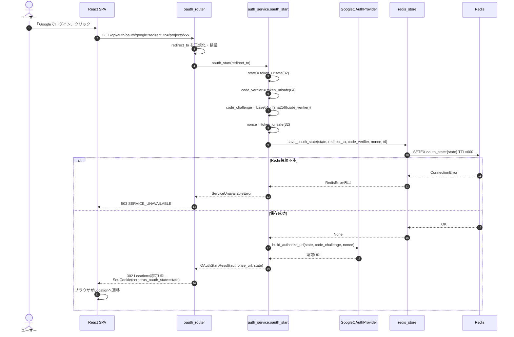
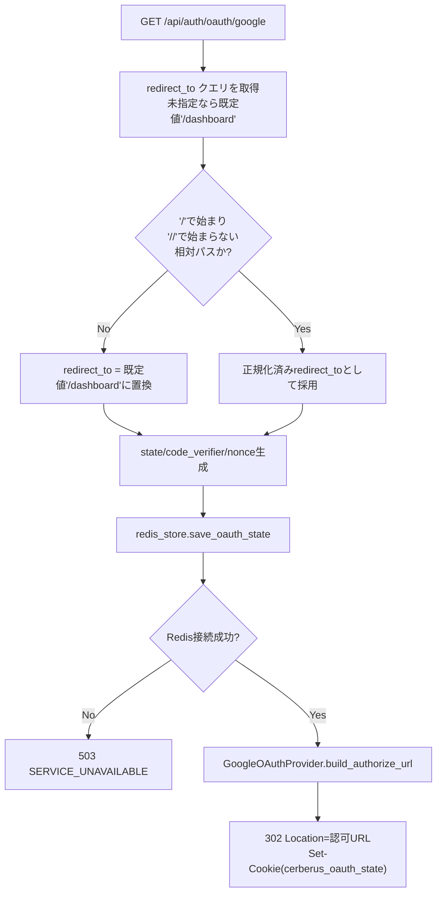
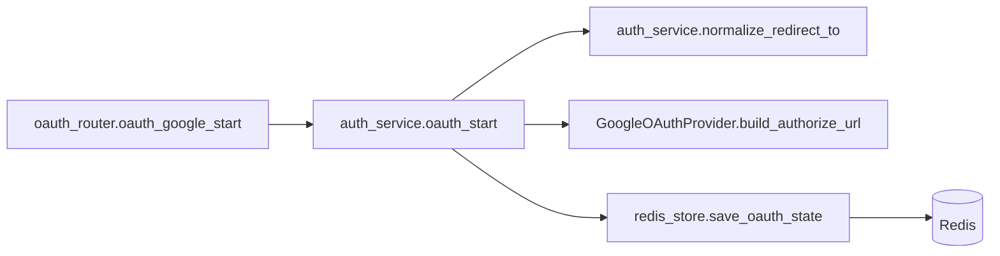
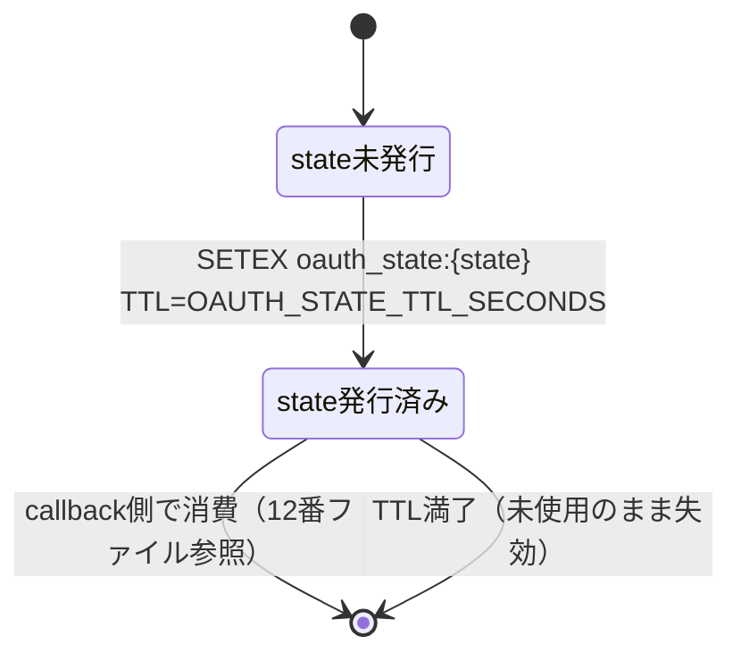

# GET /api/auth/oauth/google（Google OAuth2 認可開始）

## 0. 関連ドキュメント

| ドキュメント | 内容 |
|--------------|------|
| [../../../basic_design/03_auth.md](../../../basic_design/03_auth.md) | §5 Google OAuth2 全体設計 |
| [../../../basic_design/02_redis.md](../../../basic_design/02_redis.md) | §2 キー一覧（`oauth_state`）、§4.3 state遷移 |
| [../../../basic_design/04_api.md](../../../basic_design/04_api.md) | §1 共通仕様、§4 エラー設計 |
| [./12_get_auth_oauth_google_callback.md](./12_get_auth_oauth_google_callback.md) | コールバック側の詳細設計 |
| [./13_post_auth_oauth_exchange.md](./13_post_auth_oauth_exchange.md) | jwtモードのハンドオフ交換 |
| [../../auth/04_google_oauth.md](../../auth/04_google_oauth.md) | GoogleOAuthProvider の詳細（認証領域担当が作成） |
| [../../auth/08_redis_store.md](../../auth/08_redis_store.md) | `save_oauth_state` の実装詳細（認証領域担当が作成） |
| [../../screen/11_oauth_callback.md](../../screen/11_oauth_callback.md) | フロント側コールバック中継画面 |

## 1. 概要

| 項目 | 内容 |
|------|------|
| エンドポイント | `GET /api/auth/oauth/google` |
| 目的 | Google OAuth2（Authorization Code Flow + PKCE）の認可を開始し、Googleの認可画面へリダイレクトする |
| 認証 | 不要 |
| 認可 | 未認証可（誰でも呼び出し可能） |
| CSRF検証 | 不要（GET・状態変更なし。ただし後続のcallback/exchangeを保護するためstate/PKCE/nonceを本APIで発行する） |
| Origin検証 | 不要（ブラウザの直接ナビゲーションであり、Originヘッダが付与されない場合がある） |
| AUTH_MODE差異 | 差異なし。`AUTH_MODE` に関わらず本APIの処理は同一（分岐はcallback/exchange側で発生する） |
| 冪等性 | 冪等ではない（呼び出しごとに新しい `state` を発行しRedisに書き込む） |
| レート制限 | `oauth start` はIP単位で10回/900秒。超過時は429 `TOO_MANY_ATTEMPTS`、Redis障害時は503 `SERVICE_UNAVAILABLE` |
| トランザクション境界 | なし（PostgreSQL操作を行わない） |

## 2. 入出力仕様

### 2.1 リクエスト

パスパラメータ：なし

クエリパラメータ

| 名前 | 型 | 必須 | 制約 | 説明 |
|------|----|----|------|------|
| `redirect_to` | string | 任意 | 省略時は既定値 `/dashboard`（`OAUTH_DEFAULT_REDIRECT_TO`） | ログイン成功後にフロントへ戻すパス。サーバー側で正規化・検証する（§10参照） |

ヘッダ：なし（認証ヘッダ不要）

Cookie：なし（本APIはCookieを読まず、発行のみ行う）

ボディ：なし

### 2.2 レスポンス

**`302 Found`（正常系のみ。本APIはエラー時も原則302で `/login` へ誘導し、JSONエラーは返さない）**

| ヘッダ | 内容 |
|--------|------|
| `Location` | Googleの認可エンドポイント（`https://accounts.google.com/o/oauth2/v2/auth?...`） |
| `Set-Cookie` | `cerberus_oauth_state`（下表） |
| `X-Request-ID` | リクエスト相関用ID（共通ヘッダ） |

`Location` のクエリパラメータ

| パラメータ | 値 |
|-----------|-----|
| `client_id` | `GOOGLE_CLIENT_ID` |
| `redirect_uri` | `GOOGLE_REDIRECT_URI` |
| `response_type` | `code` |
| `scope` | `openid email profile` |
| `state` | 生成した `state`（`token_urlsafe(32)`） |
| `code_challenge` | `code_verifier` から S256 で導出した値 |
| `code_challenge_method` | `S256` |
| `nonce` | 生成した `nonce`（`token_urlsafe(32)`） |
| `prompt` | `select_account`（`GOOGLE_OAUTH_PROMPT`。複数Googleアカウントの選択を促す） |

Set-Cookie 一覧

| Cookie名 | HttpOnly | Secure | SameSite | Path | Max-Age（対応設定項目） |
|----------|----------|--------|----------|------|--------------------------|
| `cerberus_oauth_state`（`COOKIE_NAME_OAUTH_STATE`） | Yes | `COOKIE_SECURE` | `Lax` | `/api/auth/oauth` | `OAUTH_STATE_TTL_SECONDS`（既定600） |

Cookie値は `state` そのもの。callback側でクエリの `state` とCookie値の一致を確認するために用いる（Redis保存のみでは、CookieなしのCSRF的なstate強制送信を防げないため二重に保持する）。

**異常系（Redis接続不能時のみ）**

| HTTP | code | ボディ |
|------|------|--------|
| 503 | `SERVICE_UNAVAILABLE` | `basic_design/04_api.md` §4.1 形式のJSON |

## 3. エラー仕様

| HTTP | code | 発生条件 | メッセージ | 備考 |
|------|------|----------|------------|------|
| 302 | - | `redirect_to` が不正（絶対URL・`//`始まり・外部ドメイン等） | - | エラーにはせず、正規化して既定値 `/dashboard` を用いた上で処理を継続する（オープンリダイレクト対策。§10参照） |
| 503 | `SERVICE_UNAVAILABLE` | Redis接続不能で `save_oauth_state` が失敗 | 現在サービスをご利用いただけません | fail-close。`basic_design/02_redis.md` §6 に準拠 |
| 500 | `INTERNAL_ERROR` | 上記以外の未捕捉例外 | - | ログにのみ詳細を出力 |

`GOOGLE_CLIENT_ID` 等の設定不備（未設定）は起動時のconfig検証で検出し、本APIレベルのエラーコードは持たない（起動失敗として扱う。要検討：起動時検証の詳細は `infra/04_env_config.md` 側で規定）。

## 4. 処理シーケンス

## 5. 処理フロー・分岐

バリデーション層・認証層・認可層は本APIでは実質スキップされる（未認証利用が前提のため）。唯一の入力検証は `redirect_to` の正規化であり、これはルーター層で行い業務エラーにはしない。

## 6. 関数詳細

### 6.1 `api/routers/oauth_router.py :: oauth_google_start`

| 項目 | 内容 |
|------|------|
| シグネチャ | `async def oauth_google_start(response: Response, request: Request, redirect_to: str | None = Query(default=None)) -> RedirectResponse` |
| 引数 | `redirect_to`: クエリパラメータ、任意のフロントパス文字列（未検証のまま渡ってくる） |
| 戻り値 | `RedirectResponse`（302、`Set-Cookie` 付き） |
| 送出例外 | `ServiceUnavailableError` → 503（例外ハンドラで変換） |
| 処理内容 | 1. `redirect_to`、`request`、`response`を`auth_service.oauth_start`に渡す 2. 戻り値の`authorize_url`を`Location`に設定 3. serviceが設定した`cerberus_oauth_state` Cookieをレスポンスへ引き継ぐ 4. `RedirectResponse(status_code=302)`を返す |
| 副作用 | Cookie発行のみ（Redis更新はservice層で発生） |

### 6.2 `service/auth_service.py :: oauth_start`

| 項目 | 内容 |
|------|------|
| シグネチャ | `async def oauth_start(redirect_to: str | None, request: Request, response: Response) -> OAuthStartResult` |
| 引数 | `redirect_to`: 表 6.1 と同じ（未正規化）、`request`/`response`: レート制限・Cookie操作用 |
| 戻り値 | `OAuthStartResult`（`authorize_url: str`, `state: str`） |
| 送出例外 | `ServiceUnavailableError`（Redis接続不能時） |
| 処理内容 | 1. requestのIP単位レート制限を確認 2. `normalize_redirect_to(redirect_to)` で正規化 3. `secrets.token_urlsafe(32)` で `state` 生成 4. `secrets.token_urlsafe(64)` で `code_verifier` 生成 5. PKCE S256で `code_challenge` を導出 6. `secrets.token_urlsafe(32)` で `nonce` 生成 7. `redis_store.save_oauth_state(state, redirect_to, code_verifier, nonce, settings.oauth_state_ttl_seconds)` を呼ぶ 8. `response`へstate Cookieを設定し、`GoogleOAuthProvider.build_authorize_url(state, code_challenge, nonce)`を呼び `OAuthStartResult`を返す |
| 副作用 | Redis書き込み（`oauth_state:{state}`） |

### 6.3 `service/auth_service.py :: normalize_redirect_to`

| 項目 | 内容 |
|------|------|
| シグネチャ | `def normalize_redirect_to(raw: str | None) -> str` |
| 引数 | `raw`: クライアントから渡された未検証の文字列 |
| 戻り値 | 検証済み相対パス。不正な場合は `settings.oauth_default_redirect_to`（既定 `/dashboard`） |
| 送出例外 | なし（例外を送出せず既定値へフォールバックする） |
| 処理内容 | 1. `raw` が `None` または空文字なら既定値を返す 2. `raw` が `/` で始まらない、または `//` で始まる場合は既定値を返す（プロトコル相対URL対策） 3. `urlparse` でスキーム・ホストが含まれないことを確認し、含まれる場合は既定値を返す 4. 上記をすべて満たす場合のみ `raw` をそのまま返す |
| 副作用 | なし |

### 6.4 `auth/oauth.py :: GoogleOAuthProvider.build_authorize_url`

| 項目 | 内容 |
|------|------|
| シグネチャ | `def build_authorize_url(self, state: str, code_challenge: str, nonce: str) -> str` |
| 引数 | `state`, `code_challenge`, `nonce`：表6.2で生成した値 |
| 戻り値 | Googleの認可エンドポイントURL（クエリパラメータ組み立て済み） |
| 送出例外 | なし |
| 処理内容 | 1. `GOOGLE_CLIENT_ID` / `GOOGLE_REDIRECT_URI` / `scope='openid email profile'` / `response_type=code` / `code_challenge_method=S256` / `prompt` を固定値として設定 2. `urlencode` でクエリを組み立てる |
| 副作用 | なし |

## 7. 関数相関図

## 8. データ遷移図

PostgreSQLへの書き込みは発生しない。Redisに `oauth_state:{state}` が1件新規作成される。

## 9. データアクセス一覧

| ストア | テーブル／キー | 操作 | 条件・TTL | 備考 |
|--------|----------------|------|-----------|------|
| Redis | `oauth_state:{state}` | `SETEX`（新規作成） | TTL=`OAUTH_STATE_TTL_SECONDS`（既定600秒） | 値：`{redirect_to, code_verifier, nonce, created_at}` |
| PostgreSQL | なし | - | - | 本APIは参照・更新とも行わない |

## 10. バリデーション規則

| スキーマ／項目 | フィールド | 制約 | フロント（zod）との整合 |
|-----------------|-----------|------|--------------------------|
| クエリパラメータ | `redirect_to` | pydanticの `str | None`。長さ上限は `OAUTH_REDIRECT_TO_MAX_LENGTH`（既定2048） | フロントは `redirect_to` を現在パス（`location.pathname + search`）から自動生成するため、通常はユーザー入力を経由しない。フロント側でも念のため同じ正規化ロジック（`/`始まり・`//`始まり禁止）をユーティリティ関数として持つことを推奨（要検討：フロント実装側で共通化するか） |

`redirect_to` の正規化ルールはURLバリデーションではなくオープンリダイレクト対策であるため、pydanticのフィールド制約（422）ではなく、サービス層でのフォールバック処理（既定値への置換）として扱う。不正値でも422にはしない。

## 11. 非機能・セキュリティ考慮

| 観点 | 内容 |
|------|------|
| ログ出力 | INFO：`oauth_start` 呼び出し（`state`のプレフィックスのみ、全体はログに出さない）。`redirect_to`（正規化後の値）を記録し、不正値だった場合はWARNレベルで記録する |
| ユーザー列挙対策 | 該当なし（未認証で誰でも呼べるエンドポイントのため） |
| タイミング攻撃対策 | 該当なし |
| オープンリダイレクト対策 | `redirect_to` を相対パスに限定し、`//`始まり・絶対URL・外部ドメインを拒否して既定値へフォールバックする（本設計の中心的な対策） |
| CSRF対策 | 本API自体はGETで状態変更を伴わないため対象外。ただし発行する `state` と `cerberus_oauth_state` Cookieが、callback時のCSRF相当の攻撃（別セッションでの認可コード注入）を防ぐ |
| レート制限 | `oauth start` はIP単位10回/900秒。ブラウザの再試行を妨げないよう、429時は`Retry-After`を返す |
| fail-close方針 | Redis接続不能時は認可URLへのリダイレクトを行わず503を返す（`basic_design/02_redis.md` §6準拠） |

## 12. テスト設計

| No | 区分 | ケース | 前提 | 期待結果 | pytest関数名案 |
|----|------|--------|------|----------|-----------------|
| 1 | 単体 | `normalize_redirect_to` に `/projects/1` を渡す | - | そのまま返る | `test_normalize_redirect_to_valid_relative_path` |
| 2 | 単体 | `normalize_redirect_to` に `//evil.com` を渡す | - | 既定値 `/dashboard` が返る | `test_normalize_redirect_to_rejects_protocol_relative` |
| 3 | 単体 | `normalize_redirect_to` に `https://evil.com/x` を渡す | - | 既定値 `/dashboard` が返る | `test_normalize_redirect_to_rejects_absolute_url` |
| 4 | 単体 | `normalize_redirect_to` に `None` を渡す | - | 既定値 `/dashboard` が返る | `test_normalize_redirect_to_defaults_when_none` |
| 5 | 単体 | `GoogleOAuthProvider.build_authorize_url` の出力にPKCEパラメータが含まれる | - | `code_challenge_method=S256` を含むURL | `test_build_authorize_url_includes_pkce` |
| 6 | 結合 | `GET /api/auth/oauth/google` を呼ぶ | `fakeredis` | 302、`Location` にGoogleドメインを含む、`Set-Cookie: cerberus_oauth_state` あり | `test_oauth_google_start_redirects_with_state_cookie` |
| 7 | 結合 | `redirect_to=/projects/1` 付きで呼ぶ | 実Redis | `oauth_state:{state}` の値に `redirect_to=/projects/1` が保存される | `test_oauth_google_start_stores_redirect_to` |
| 8 | 結合 | `redirect_to=https://evil.com` 付きで呼ぶ | 実Redis | 保存される `redirect_to` は `/dashboard` に正規化されている | `test_oauth_google_start_normalizes_malicious_redirect_to` |
| 9 | 結合 | Redis接続不能時に呼ぶ | Redis停止をモック | 503 `SERVICE_UNAVAILABLE` | `test_oauth_google_start_returns_503_on_redis_down` |
| 10 | 結合 | `AUTH_MODE=session` / `jwt` の両方で呼ぶ | 各AUTH_MODE | 挙動に差異がないこと（同じ302形式） | `test_oauth_google_start_no_diff_between_auth_modes` |

網羅できない範囲：Googleの実認可画面へのリダイレクト後の挙動（同意画面の表示・操作）はブラウザ実機での手動確認とする。

## 13. 不明点・要検討事項

| 区分 | 内容 | 影響 |
|------|------|------|
| 確定 | 本APIはIP単位10回/900秒のレート制限を適用する | 超過時429 `TOO_MANY_ATTEMPTS`（`Retry-After`付き）、Redis障害時503 |
| 要検討 | `redirect_to` の最大長（`OAUTH_REDIRECT_TO_MAX_LENGTH`）は基本設計に定義がなく、本ファイルで既定値2048として仮置きした | 実装時に環境変数の既定値として確定させる必要がある |
| 不明 | `prompt=select_account` は基本設計に明記がなく、UX観点で妥当と判断し追加した仮の設計 | Googleアカウントを複数持つユーザーの体験に影響。要件との整合を確認したい |

## DBアクセス契約

本APIのDBアクセスは、下記のFN/SP呼び出しをrepositoryの薄いラッパーから実行する。テーブルへの直接CRUD、認証業務の判定、履歴のINSERTはrepositoryに実装しない。healthの `SELECT 1` だけは本契約の対象外である。

| 正式な呼び出し | 契約 |
|----------------|------|
| DBアクセスなし（Redis/OAuth providerのみ） | `detailed_design/database/08_db_functions.md` のシグネチャに従う |

SQLSTATE P0xxxは同文書 §4 の対応表でAPIエラーへ変換し、Redis・メール・JWTの処理はAPI/service層に残す。
