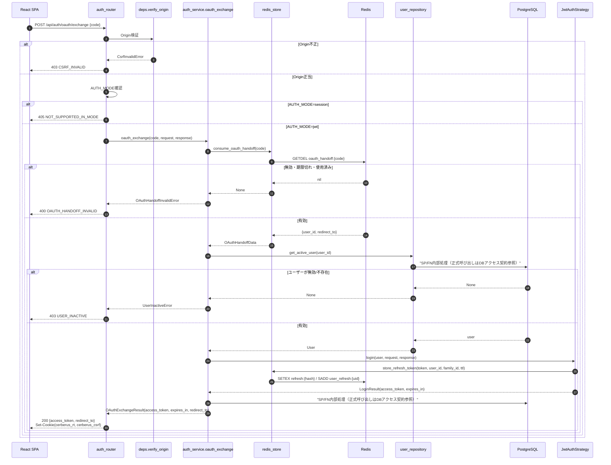
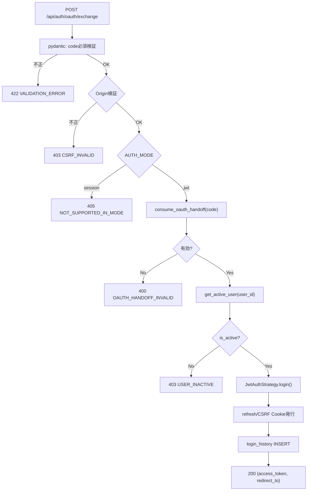
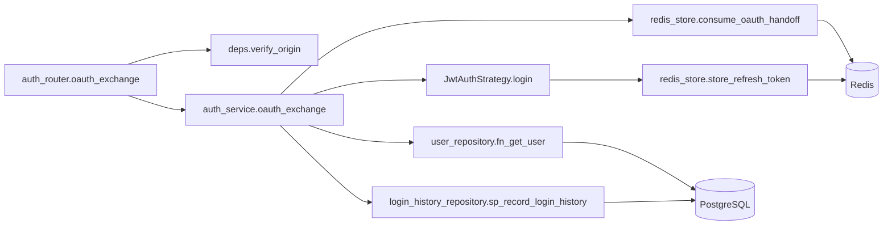
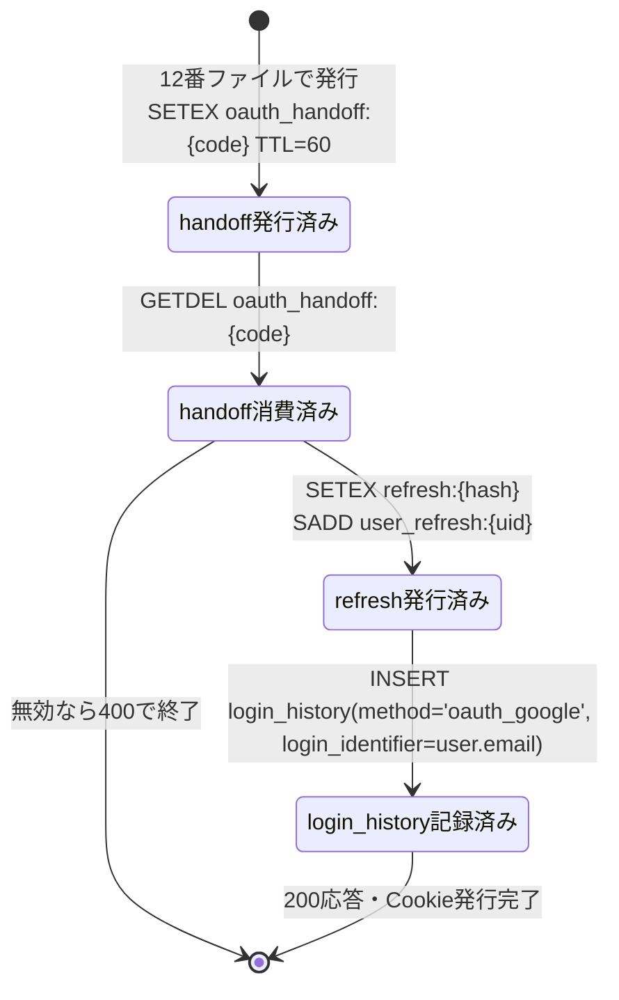

# POST /api/auth/oauth/exchange（OAuthハンドオフコード交換）

## 0. 関連ドキュメント

| ドキュメント | 内容 |
|--------------|------|
| [../../../basic_design/03_auth.md](../../../basic_design/03_auth.md) | §4 jwt方式、§5.4 jwtモードのトークン受け渡し |
| [../../../basic_design/02_redis.md](../../../basic_design/02_redis.md) | §2 キー一覧（`oauth_handoff`）、§5.3 `consume_oauth_handoff` |
| [../../../basic_design/04_api.md](../../../basic_design/04_api.md) | §1 共通仕様、§3.1 レスポンス例、§4 エラー設計 |
| [./11_get_auth_oauth_google.md](./11_get_auth_oauth_google.md) | 認可開始 |
| [./12_get_auth_oauth_google_callback.md](./12_get_auth_oauth_google_callback.md) | コールバック（handoff code発行元） |
| [./06_post_auth_refresh.md](./06_post_auth_refresh.md) | refresh Cookie・CSRF Cookieの仕様共通部分 |
| [../../auth/02_jwt_auth.md](../../auth/02_jwt_auth.md) | JwtAuthStrategy詳細（認証領域担当が作成） |
| [../../auth/08_redis_store.md](../../auth/08_redis_store.md) | `consume_oauth_handoff`の実装詳細（認証領域担当が作成） |
| [../../screen/11_oauth_callback.md](../../screen/11_oauth_callback.md) | フロント側コールバック中継画面（本APIの呼び出し元） |

## 1. 概要

| 項目 | 内容 |
|------|------|
| エンドポイント | `POST /api/auth/oauth/exchange` |
| 目的 | jwtモードのOAuthログインにおいて、コールバックで発行された一時ハンドオフコードをアクセストークン・refresh/CSRF Cookieに交換する |
| 認証 | 一時コード（ボディの`code`）。session/refresh Cookie・Authorizationヘッダは不要 |
| 認可 | 未認証可（ただし有効な`code`の保有が事実上の認可条件） |
| CSRF検証 | 不要（本APIはCookieを読み取らず、一時codeという単発トークンで保護されているため。Origin検証のみ実施） |
| Origin検証 | 必要（`basic_design/03_auth.md` §5.4・§8。第三者サイトからのfetchによるcode窃用を防ぐ） |
| AUTH_MODE差異 | **jwtモード専用**。`AUTH_MODE=session`時は`405 NOT_SUPPORTED_IN_MODE`を返す |
| 冪等性 | 冪等ではない（`code`は`GETDEL`によりワンタイム消費。2回目の呼び出しは失敗する） |
| レート制限 | `oauth exchange` はIP単位で10回/900秒。超過時は429 `TOO_MANY_ATTEMPTS`（`Retry-After`付き）、Redis障害時は503 `SERVICE_UNAVAILABLE` |
| トランザクション境界 | `user_id`から現在の有効ユーザーを再取得する処理と`login_history`のINSERTは、それぞれ独立したPostgreSQL操作（同一トランザクションにまとめる必要はない。要検討：一貫性が必要な場合は1トランザクションに統合） |

## 2. 入出力仕様

### 2.1 リクエスト

パスパラメータ：なし

クエリパラメータ：なし

ヘッダ

| 名前 | 必須 | 説明 |
|------|------|------|
| `Origin` | ○（ブラウザからの通常リクエストでは自動付与） | `CORS_ALLOW_ORIGINS`のいずれかと完全一致することを検証 |
| `Content-Type` | ○ | `application/json` |

Cookie：なし（本APIはCookieを読み取らない。発行のみ行う）

ボディ

| フィールド | 型 | 必須 | 制約 | 説明 |
|-----------|----|----|------|------|
| `code` | string | ○ | 1文字以上。実体は`token_urlsafe(32)`相当 | コールバックでURLフラグメント経由で受け取った一時コード |

### 2.2 レスポンス

**`200 OK`**

```json
{
  "access_token": "eyJhbGciOiJIUzI1NiIs...",
  "token_type": "bearer",
  "expires_in": 900,
  "redirect_to": "/projects/xxx"
}
```

| フィールド | 型 | NULL可否 | 説明 |
|-----------|----|----------|------|
| `access_token` | string | 不可 | JWTアクセストークン。`typ='access'` |
| `token_type` | string | 不可 | 固定値`"bearer"` |
| `expires_in` | integer | 不可 | 秒単位。`ACCESS_TOKEN_TTL_SECONDS`（既定900） |
| `redirect_to` | string | 不可 | 認可開始時にサーバーが正規化・保存した相対パス |

refresh tokenの平文はレスポンスボディに含めない（`Set-Cookie`でのみ送付）。

Set-Cookie 一覧

| Cookie名 | HttpOnly | Secure | SameSite | Path | Max-Age（対応設定項目） |
|----------|----------|--------|----------|------|--------------------------|
| `cerberus_rt`（`COOKIE_NAME_REFRESH`） | Yes | `COOKIE_SECURE` | `COOKIE_SAMESITE_REFRESH`（既定`Strict`） | `/api/auth` | `REFRESH_TTL_SECONDS`（既定1209600） |
| `cerberus_csrf`（`COOKIE_NAME_CSRF`） | No | `COOKIE_SECURE` | `COOKIE_SAMESITE`（既定`Lax`） | `/` | `REFRESH_TTL_SECONDS`（既定1209600） |

共通ヘッダ：`X-Request-ID`を全レスポンスに付与。`Cache-Control: no-store`をボディにトークンを含むため付与する。

**エラー系はいずれも`basic_design/04_api.md` §4.1のJSON形式に従う（本APIはJSONで応答し、302リダイレクトは行わない）。**

## 3. エラー仕様

| HTTP | code | 発生条件 | メッセージ | 備考 |
|------|------|----------|------------|------|
| 400 | `OAUTH_HANDOFF_INVALID` | `code`が無効・期限切れ・使用済み | ログインセッションの有効期限が切れました。もう一度お試しください | `consume_oauth_handoff`が`None`を返す |
| 403 | `CSRF_INVALID` | `Origin`ヘッダが`CORS_ALLOW_ORIGINS`のいずれとも一致しない | 不正なリクエストです | `verify_origin`失敗 |
| 403 | `USER_INACTIVE` | ハンドオフに紐づく`user_id`が`is_active=false` | アカウントが無効化されています | コールバックからexchangeまでの間に管理者が無効化した場合 |
| 405 | `NOT_SUPPORTED_IN_MODE` | `AUTH_MODE=session`で呼び出された | このAPIは現在のモードでは利用できません | `basic_design/04_api.md` §4.2 |
| 422 | `VALIDATION_ERROR` | `code`が未指定・空文字 | 入力内容に誤りがあります | pydanticバリデーション |
| 503 | `SERVICE_UNAVAILABLE` | Redis接続不能 | 現在サービスをご利用いただけません | fail-close |

## 4. 処理シーケンス



## 5. 処理フロー・分岐



## 6. 関数詳細

### 6.1 `api/routers/auth_router.py :: oauth_exchange`

| 項目 | 内容 |
|------|------|
| シグネチャ | `async def oauth_exchange(payload: OAuthExchangeRequest, request: Request, response: Response, _: None = Depends(verify_origin), service: AuthService = Depends(get_auth_service)) -> OAuthExchangeResponse` |
| 引数 | `payload`：`code`を含むリクエストボディ。`request`/`response`：Cookie操作用 |
| 戻り値 | `OAuthExchangeResponse`（200） |
| 送出例外 | `NotSupportedInModeError`（405）、`OAuthHandoffInvalidError`（400）、`UserInactiveError`（403）、`CsrfInvalidError`（403、`verify_origin`内） |
| 処理内容 | 1. `settings.auth_mode != 'jwt'`なら`NotSupportedInModeError` 2. `service.oauth_exchange(payload.code, request, response)`を呼ぶ 3. 戻り値をレスポンスモデルへマッピング |
| 副作用 | Cookie発行（`cerberus_rt`/`cerberus_csrf`。`service`内の`JwtAuthStrategy.login`が実施） |

### 6.2 `service/auth_service.py :: oauth_exchange`

| 項目 | 内容 |
|------|------|
| シグネチャ | `async def oauth_exchange(code: str, request: Request, response: Response) -> OAuthExchangeResult` |
| 引数 | `code`：一時ハンドオフコード。`request`/`response`：Strategy.loginへ引き渡す |
| 戻り値 | `OAuthExchangeResult`（`access_token`, `expires_in`, `redirect_to`） |
| 送出例外 | `OAuthHandoffInvalidError`、`UserInactiveError`、`ServiceUnavailableError` |
| 処理内容 | 1. `redis_store.consume_oauth_handoff(code)`を呼び`None`なら`OAuthHandoffInvalidError` 2. `user_repository.fn_get_user(data.user_id)`で現在の有効ユーザーを取得（Redisに保存されたuser_idのみを信頼し、role等は再取得しない） 3. 取得できなければ`UserInactiveError` 4. `jwt_strategy.login(user, request, response)`を呼び`LoginResult`を得る 5. `login_history_repository.sp_record_login_history(user.id, login_identifier=user.email, method='oauth_google', success=True)`を呼ぶ 6. `data.redirect_to`（正規化済み）とともに結果を返す。ここでの`login_identifier`は解決済みユーザーの検証済みGoogle emailであり、OAuthアカウントの`sub`ではない |
| 副作用 | PostgreSQL：`login_history`INSERT。Redis：`refresh:{hash}`/`user_refresh:{uid}`新規作成（`JwtAuthStrategy.login`内）。Cookie：`cerberus_rt`/`cerberus_csrf`発行 |

### 6.3 `repository/user_repository.py :: fn_get_user`

| 項目 | 内容 |
|------|------|
| シグネチャ | `async def get_active_user(user_id: UUID) -> User | None` |
| 引数 | `user_id`：Redisの`oauth_handoff`に保存されていたUUID |
| 戻り値 | `User`。該当なし・`is_active=false`の場合は`None` |
| 送出例外 | なし |
| 処理内容 | `SELECT fn_get_user(:user_id)` を実行し、`is_active` は取得済みユーザーデータで判定する |
| 副作用 | なし（読み取りのみ） |

### 6.4 `auth/jwt_auth.py :: JwtAuthStrategy.login`

| 項目 | 内容 |
|------|------|
| シグネチャ | `async def login(self, user: User, request: Request, response: Response) -> LoginResult` |
| 引数 | `user`：ログイン確立対象。`request`：クライアントIP等の取得用。`response`：Cookie設定先 |
| 戻り値 | `LoginResult`（`auth_mode='jwt'`, `access_token`, `refresh_token`, `csrf_token`, `expires_in`） |
| 送出例外 | `ServiceUnavailableError`（Redis接続不能） |
| 処理内容 | 1. `family_id = uuid4()`を生成 2. アクセストークン（JWT、`sub=user.id`, `exp`, `jti`, `typ='access'`）を署名生成 3. リフレッシュトークン（`token_urlsafe(48)`）を生成 4. `redis_store.store_refresh_token(refresh_token, user.id, family_id, REFRESH_TTL_SECONDS)`を呼ぶ 5. CSRFトークン（`token_urlsafe(32)`）を生成 6. `response`に`cerberus_rt`（HttpOnly）・`cerberus_csrf`（非HttpOnly）をSet-Cookie |
| 副作用 | Redis：`refresh:{hash}`/`user_refresh:{uid}`新規作成。Cookie：2件発行 |

### 6.5 `repository/login_history_repository.py :: sp_record_login_history`

| 項目 | 内容 |
|------|------|
| シグネチャ | `async def record(user_id: UUID, method: Literal["session", "jwt", "oauth_google"], success: bool, ip_address: str | None = None, failure_reason: str | None = None) -> None` |
| 引数 | 表の通り |
| 戻り値 | なし |
| 送出例外 | なし（DB例外は共通ハンドラに委譲） |
| 処理内容 | `CALL sp_record_login_history(:user_id, :login_identifier, :login_method, :ip_address, :user_agent, :success, :failure_reason)`。OAuth交換では`login_identifier=user.email`、`login_method='oauth_google'`を渡す |
| 副作用 | PostgreSQL：`login_history`INSERT |

## 7. 関数相関図



## 8. データ遷移図



PostgreSQLの`users`/`oauth_accounts`は本APIでは更新しない（12番ファイルで確定済み）。本APIが更新するのは`login_history`への1行追加のみ。

## 9. データアクセス一覧

| ストア | テーブル／キー | 操作 | 条件・TTL | 備考 |
|--------|----------------|------|-----------|------|
| Redis | `oauth_handoff:{code}` | `GETDEL`（ワンタイム消費） | 発行から60秒以内のみ有効 | 2回目の呼び出しは必ず失敗する |
| Redis | `refresh:{token_hash}` | `SETEX`（新規作成） | TTL=`REFRESH_TTL_SECONDS`（既定14日） | `JwtAuthStrategy.login`内 |
| Redis | `user_refresh:{user_id}` | `SADD` + `EXPIRE`（新規追加） | TTL=`REFRESH_TTL_SECONDS` | 同上 |
| PostgreSQL | `users` | `SELECT`（`id`+`is_active`） | - | ハンドオフに保存された`user_id`の再検証 |
| PostgreSQL | `login_history` | `INSERT`（`method='oauth_google'`, `login_identifier=user.email`） | - | 交換成功時のみ、解決済みユーザーの検証済みGoogle emailを記録 |

## 10. バリデーション規則

| スキーマ名 | フィールド | 制約 | フロント（zod）との整合 |
|-----------|-----------|------|--------------------------|
| `OAuthExchangeRequest` | `code` | `str`、`min_length=1`。フォーマットの厳密な検証はせず、Redisの`GETDEL`結果に委ねる | フロントは`location.hash`から`code`を取り出し、空文字の場合はAPI呼び出し自体を行わずエラー画面を表示する（`screen/11_oauth_callback.md`側の責務） |

## 11. 非機能・セキュリティ考慮

| 観点 | 内容 |
|------|------|
| ログ出力 | INFO：交換成功（`user_id`, `method='oauth_google'`）。WARN：`OAUTH_HANDOFF_INVALID`（`code`は先頭数文字のみログ化しハッシュ化推奨）、`USER_INACTIVE` |
| ユーザー列挙対策 | 該当なし（`code`はユーザー入力ではなくシステム発行値） |
| タイミング攻撃対策 | `code`の一致判定はRedisのキー存在確認（`GETDEL`）に委ねるため、アプリケーション側での追加対策は不要 |
| ワンタイム性 | `code`は`GETDEL`により必ず一度しか成功しない。フロントが多重送信（二重クリック等）した場合、2回目は`OAUTH_HANDOFF_INVALID`となるため、フロント側で送信中はボタンを無効化する（要検討：フロント実装の責務） |
| Origin検証 | `CORS_ALLOW_ORIGINS`との完全一致を必須とする。一時codeのみでは第三者サイトからの窃用（XSSでURLをコピーされた場合等）を防げないため、Origin検証を必須の追加防御とする |
| レート制限 | `oauth exchange` はIP単位10回/900秒。codeの高エントロピー性に加えて汎用IP制限を適用する |
| fail-close方針 | Redis接続不能時は503 `SERVICE_UNAVAILABLE` |
| access_tokenの取り扱い | レスポンスボディで返すが、フロントはメモリ（Zustand）にのみ保持し、`localStorage`には保存しない（`basic_design/03_auth.md` §4.1） |

## 12. テスト設計

| No | 区分 | ケース | 前提 | 期待結果 | pytest関数名案 |
|----|------|--------|------|----------|-----------------|
| 1 | 単体 | `oauth_exchange`：正常系 | モック`redis_store`/`user_repository`/`JwtAuthStrategy` | `LoginResult`相当の値が返り、`login_history_repository.sp_record_login_history`が1回呼ばれる | `test_oauth_exchange_success_calls_login_and_records_history` |
| 2 | 単体 | `oauth_exchange`：handoff無効 | `consume_oauth_handoff`が`None`を返す | `OAuthHandoffInvalidError`送出 | `test_oauth_exchange_raises_on_invalid_handoff` |
| 3 | 単体 | `oauth_exchange`：ユーザー無効化済み | `get_active_user`が`None`を返す | `UserInactiveError`送出 | `test_oauth_exchange_raises_on_inactive_user` |
| 4 | 結合 | `AUTH_MODE=session`で呼び出し | - | 405 `NOT_SUPPORTED_IN_MODE` | `test_oauth_exchange_returns_405_in_session_mode` |
| 5 | 結合 | 正常系（`AUTH_MODE=jwt`） | 12番ファイルの処理で`oauth_handoff`をRedisに事前投入 | 200、`access_token`あり、`Set-Cookie: cerberus_rt`（HttpOnly）/`cerberus_csrf`（非HttpOnly）、`refresh:{hash}`がRedisに存在 | `test_oauth_exchange_success_sets_cookies_and_returns_token` |
| 6 | 結合 | 同一`code`を2回送信 | 1回目成功後に2回目を送信 | 2回目は400 `OAUTH_HANDOFF_INVALID` | `test_oauth_exchange_rejects_replayed_code` |
| 7 | 結合 | 存在しない`code` | Redis未投入 | 400 `OAUTH_HANDOFF_INVALID` | `test_oauth_exchange_rejects_unknown_code` |
| 8 | 結合 | 許可されていない`Origin`ヘッダ | `Origin: https://evil.com` | 403 `CSRF_INVALID` | `test_oauth_exchange_rejects_disallowed_origin` |
| 9 | 結合 | 交換前にユーザーが無効化される | handoff発行後に対象ユーザーの`is_active=false`へ更新 | 403 `USER_INACTIVE` | `test_oauth_exchange_rejects_deactivated_user` |
| 10 | 結合 | `code`未指定 | ボディに`code`なし | 422 `VALIDATION_ERROR` | `test_oauth_exchange_requires_code_field` |
| 11 | 結合 | 交換成功後の`login_history` | 正常系 | `login_history`に`method='oauth_google', login_identifier=user.email, success=true`の行が1件追加される | `test_oauth_exchange_records_login_history` |
| 12 | 結合 | `redirect_to`の伝播 | 11番ファイルで`redirect_to=/projects/1`を保存 → 12番でhandoffへ引き継ぎ | レスポンスの`redirect_to`が`/projects/1` | `test_oauth_exchange_returns_propagated_redirect_to` |

網羅できない範囲：なし（本APIは外部通信を行わないため、Google関連の手動確認対象は11・12番ファイル側に集約される）。

## 13. 不明点・要検討事項

| 区分 | 内容 | 影響 |
|------|------|------|
| 確定 | `login_history` INSERTが失敗した場合は認証情報を返さず503とし、発行済みRedis状態を補償削除する。取得後のユーザー再検証と監査記録は同一処理の完了条件として扱う | 監査記録のないOAuthログインを成立させない |
| 要検討 | フロントの二重送信（ボタン多重クリック等）に対する具体的な排他制御方針が基本設計・本ファイルいずれにも未定義 | 2回目呼び出しは仕様上400になるが、UX上のリトライ導線をフロント側でどう設計するかは要検討 |
| なし | 上記以外の不明点はなし | - |

## DBアクセス契約

本APIのDBアクセスは、下記のFN/SP呼び出しをrepositoryの薄いラッパーから実行する。テーブルへの直接CRUD、認証業務の判定、履歴のINSERTはrepositoryに実装しない。healthの `SELECT 1` だけは本契約の対象外である。

| 正式な呼び出し | 契約 |
|----------------|------|
| fn_get_user(p_user_id), sp_record_login_history(p_user_id, p_login_identifier, p_login_method, p_ip_address, p_user_agent, p_success, p_failure_reason) | `detailed_design/database/08_db_functions.md` のシグネチャに従う |

SQLSTATE P0xxxは同文書 §4 の対応表でAPIエラーへ変換し、Redis・メール・JWTの処理はAPI/service層に残す。
